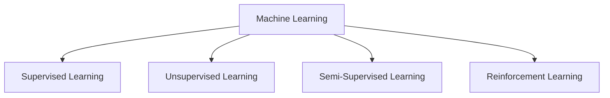
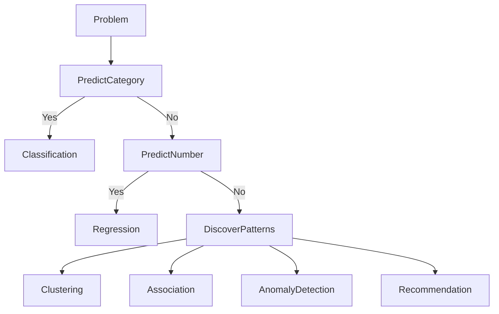

# 02. Machine Learning Fundamentals

> Understand the fundamental learning paradigms and core Machine Learning techniques that form the foundation of modern intelligent systems.

---

## 🎯 Learning Objectives

After completing this chapter, you will be able to:

- Explain the four major Machine Learning paradigms
- Differentiate between supervised, unsupervised, semi-supervised, and reinforcement learning
- Understand common Machine Learning techniques
- Identify suitable learning approaches for different business problems
- Recognize real-world applications of each Machine Learning technique

---

## 📖 Overview

Not all Machine Learning problems are the same.

Some problems require predicting known outcomes, while others involve discovering hidden patterns or enabling intelligent systems to learn through interaction. Selecting the appropriate Machine Learning paradigm is one of the most important decisions when designing an AI solution.

This chapter introduces the major Machine Learning paradigms and the most widely used Machine Learning techniques that power modern intelligent applications.

---

## 🧠 Core Concepts

Machine Learning algorithms learn in different ways depending on the type of data available and the problem being solved.

The four major Machine Learning paradigms are:

- Supervised Learning
- Unsupervised Learning
- Semi-Supervised Learning
- Reinforcement Learning

Each paradigm is designed for different types of learning problems and produces different kinds of outcomes.

---

## 🏗️ Machine Learning Paradigms



---

## 📘 Supervised Learning

Supervised Learning learns from **labelled data**, where the correct output is already known.

The model discovers relationships between input features and known outputs so it can accurately predict results for new data.

### Common Use Cases

- Spam Detection
- Credit Risk Assessment
- Disease Diagnosis
- House Price Prediction
- Customer Churn Prediction

### Popular Algorithms

- Linear Regression
- Logistic Regression
- Decision Trees
- Random Forest
- Support Vector Machines

---

## 📗 Unsupervised Learning

Unsupervised Learning works with **unlabelled data**.

Instead of predicting known outputs, it discovers hidden structures, relationships, or groups within the data.

### Common Use Cases

- Customer Segmentation
- Market Basket Analysis
- Document Clustering
- Topic Discovery

### Popular Algorithms

- K-Means Clustering
- Hierarchical Clustering
- DBSCAN
- PCA

---

## 📙 Semi-Supervised Learning

Semi-Supervised Learning combines a **small amount of labelled data** with a **large amount of unlabelled data**.

This approach improves model performance while reducing the cost of manually labelling large datasets.

### Common Use Cases

- Medical Image Classification
- Document Classification
- Speech Recognition

---

## 📕 Reinforcement Learning

Reinforcement Learning enables an agent to learn through interaction with an environment.

Instead of learning from labelled examples, the agent receives rewards or penalties for its actions and gradually learns the optimal strategy.

### Common Use Cases

- Robotics
- Autonomous Vehicles
- Game Playing
- Resource Optimization

---

## 📊 Comparison of Learning Paradigms

| Learning Type | Training Data | Goal | Example |
|---------------|---------------|-------|---------|
| Supervised Learning | Labelled | Predict known outcomes | Spam Detection |
| Unsupervised Learning | Unlabelled | Discover hidden patterns | Customer Segmentation |
| Semi-Supervised Learning | Partially Labelled | Improve learning with limited labels | Image Classification |
| Reinforcement Learning | Rewards & Penalties | Learn optimal actions | Self-driving Cars |

---

## ⚙️ Common Machine Learning Techniques

Machine Learning problems are solved using different techniques depending on the business objective.

| Technique | Purpose | Example Applications |
|-----------|---------|----------------------|
| Classification | Predict categories | Spam Detection, Disease Diagnosis |
| Regression | Predict numerical values | House Price Prediction, Sales Forecasting |
| Clustering | Group similar records | Customer Segmentation |
| Association Rule Learning | Discover relationships | Market Basket Analysis |
| Anomaly Detection | Detect unusual behaviour | Fraud Detection |
| Recommendation Systems | Predict user preferences | Netflix, Amazon |
| Sequence Mining | Predict future events | Website Clickstream Analysis |
| Dimensionality Reduction | Reduce feature space | Data Visualization, Compression |

---

## 🏗️ Choosing the Right Technique



---

## 🌍 Real-World Examples

| Business Problem | Technique |
|------------------|-----------|
| Email Spam Detection | Classification |
| House Price Prediction | Regression |
| Customer Segmentation | Clustering |
| Product Recommendations | Recommendation Systems |
| Credit Card Fraud Detection | Anomaly Detection |
| Frequently Bought Together | Association Rule Learning |

---

## 🏢 Enterprise Perspective

Selecting the right Machine Learning paradigm is often more important than selecting a specific algorithm.

Successful AI projects begin by clearly understanding the business problem, identifying the available data, and then choosing the most appropriate learning approach before evaluating different algorithms.

This problem-first approach helps organizations build solutions that are scalable, maintainable, and aligned with business objectives.

---

## 💻 Implementation Example

=== "Python"

```python title="Selecting a Classification Algorithm"
from sklearn.ensemble import RandomForestClassifier

model = RandomForestClassifier()

model.fit(X_train, y_train)

predictions = model.predict(X_test)
```

=== "Java"

```java title="Machine Learning Libraries for Java"
// Example libraries:
//
// Smile
// Tribuo
// Weka
// Deep Java Library (DJL)
```

---

!!! tip "Production Insight"

    Always start by understanding the business problem before selecting a Machine Learning technique.

    Choosing the right learning paradigm often has a greater impact than choosing a specific algorithm.

---

## 💡 Best Practices

- Clearly define the business objective.
- Understand the available data before selecting a learning paradigm.
- Keep the initial solution simple.
- Validate assumptions with real-world data.
- Measure success using appropriate evaluation metrics.

---

## ⚠️ Common Mistakes

- Selecting algorithms before understanding the problem.
- Using supervised learning without sufficient labelled data.
- Applying complex models to simple problems.
- Ignoring business constraints.
- Assuming one algorithm works best for every problem.

---

## 📌 Key Takeaways

- Machine Learning consists of four major learning paradigms.
- Different business problems require different Machine Learning techniques.
- Classification and Regression are supervised learning tasks.
- Clustering discovers hidden patterns in unlabelled data.
- Reinforcement Learning enables intelligent decision-making through interaction.
- Selecting the correct learning approach is the foundation of successful Machine Learning systems.

---

## 📚 Further Reading

Continue with the Machine Learning lifecycle to understand how production-ready Machine Learning systems are designed, developed, deployed, and continuously improved.

---

## ➡️ Next Chapter

**[03. Machine Learning Lifecycle](03-machine-learning-lifecycle.md)**# 02. Machine Learning Fundamentals

> Understand the fundamental learning paradigms and core Machine Learning techniques that form the foundation of modern intelligent systems.

---

## 🎯 Learning Objectives

After completing this chapter, you will be able to:

- Explain the four major Machine Learning paradigms
- Differentiate between supervised, unsupervised, semi-supervised, and reinforcement learning
- Understand common Machine Learning techniques
- Identify suitable learning approaches for different business problems
- Recognize real-world applications of each Machine Learning technique

---

## 📖 Overview

Not all Machine Learning problems are the same.

Some problems require predicting known outcomes, while others involve discovering hidden patterns or enabling intelligent systems to learn through interaction. Selecting the appropriate Machine Learning paradigm is one of the most important decisions when designing an AI solution.

This chapter introduces the major Machine Learning paradigms and the most widely used Machine Learning techniques that power modern intelligent applications.

---

## 🧠 Core Concepts

Machine Learning algorithms learn in different ways depending on the type of data available and the problem being solved.

The four major Machine Learning paradigms are:

- Supervised Learning
- Unsupervised Learning
- Semi-Supervised Learning
- Reinforcement Learning

Each paradigm is designed for different types of learning problems and produces different kinds of outcomes.

---

## 🏗️ Machine Learning Paradigms


---

## 📘 Supervised Learning

Supervised Learning learns from **labelled data**, where the correct output is already known.

The model discovers relationships between input features and known outputs so it can accurately predict results for new data.

### Common Use Cases

- Spam Detection
- Credit Risk Assessment
- Disease Diagnosis
- House Price Prediction
- Customer Churn Prediction

### Popular Algorithms

- Linear Regression
- Logistic Regression
- Decision Trees
- Random Forest
- Support Vector Machines

---

## 📗 Unsupervised Learning

Unsupervised Learning works with **unlabelled data**.

Instead of predicting known outputs, it discovers hidden structures, relationships, or groups within the data.

### Common Use Cases

- Customer Segmentation
- Market Basket Analysis
- Document Clustering
- Topic Discovery

### Popular Algorithms

- K-Means Clustering
- Hierarchical Clustering
- DBSCAN
- PCA

---

## 📙 Semi-Supervised Learning

Semi-Supervised Learning combines a **small amount of labelled data** with a **large amount of unlabelled data**.

This approach improves model performance while reducing the cost of manually labelling large datasets.

### Common Use Cases

- Medical Image Classification
- Document Classification
- Speech Recognition

---

## 📕 Reinforcement Learning

Reinforcement Learning enables an agent to learn through interaction with an environment.

Instead of learning from labelled examples, the agent receives rewards or penalties for its actions and gradually learns the optimal strategy.

### Common Use Cases

- Robotics
- Autonomous Vehicles
- Game Playing
- Resource Optimization

---

## 📊 Comparison of Learning Paradigms

| Learning Type | Training Data | Goal | Example |
|---------------|---------------|-------|---------|
| Supervised Learning | Labelled | Predict known outcomes | Spam Detection |
| Unsupervised Learning | Unlabelled | Discover hidden patterns | Customer Segmentation |
| Semi-Supervised Learning | Partially Labelled | Improve learning with limited labels | Image Classification |
| Reinforcement Learning | Rewards & Penalties | Learn optimal actions | Self-driving Cars |

---

## ⚙️ Common Machine Learning Techniques

Machine Learning problems are solved using different techniques depending on the business objective.

| Technique | Purpose | Example Applications |
|-----------|---------|----------------------|
| Classification | Predict categories | Spam Detection, Disease Diagnosis |
| Regression | Predict numerical values | House Price Prediction, Sales Forecasting |
| Clustering | Group similar records | Customer Segmentation |
| Association Rule Learning | Discover relationships | Market Basket Analysis |
| Anomaly Detection | Detect unusual behaviour | Fraud Detection |
| Recommendation Systems | Predict user preferences | Netflix, Amazon |
| Sequence Mining | Predict future events | Website Clickstream Analysis |
| Dimensionality Reduction | Reduce feature space | Data Visualization, Compression |

---

## 🏗️ Choosing the Right Technique


---

## 🌍 Real-World Examples

| Business Problem | Technique |
|------------------|-----------|
| Email Spam Detection | Classification |
| House Price Prediction | Regression |
| Customer Segmentation | Clustering |
| Product Recommendations | Recommendation Systems |
| Credit Card Fraud Detection | Anomaly Detection |
| Frequently Bought Together | Association Rule Learning |

---

## 🏢 Enterprise Perspective

Selecting the right Machine Learning paradigm is often more important than selecting a specific algorithm.

Successful AI projects begin by clearly understanding the business problem, identifying the available data, and then choosing the most appropriate learning approach before evaluating different algorithms.

This problem-first approach helps organizations build solutions that are scalable, maintainable, and aligned with business objectives.

---

## 💻 Implementation Example

=== "Python"

```python title="Selecting a Classification Algorithm"
from sklearn.ensemble import RandomForestClassifier

model = RandomForestClassifier()

model.fit(X_train, y_train)

predictions = model.predict(X_test)
```

=== "Java"

```java title="Machine Learning Libraries for Java"
// Example libraries:
//
// Smile
// Tribuo
// Weka
// Deep Java Library (DJL)
```

---

!!! tip "Production Insight"

    Always start by understanding the business problem before selecting a Machine Learning technique.

    Choosing the right learning paradigm often has a greater impact than choosing a specific algorithm.

---

## 💡 Best Practices

- Clearly define the business objective.
- Understand the available data before selecting a learning paradigm.
- Keep the initial solution simple.
- Validate assumptions with real-world data.
- Measure success using appropriate evaluation metrics.

---

## ⚠️ Common Mistakes

- Selecting algorithms before understanding the problem.
- Using supervised learning without sufficient labelled data.
- Applying complex models to simple problems.
- Ignoring business constraints.
- Assuming one algorithm works best for every problem.

---

## 📌 Key Takeaways

- Machine Learning consists of four major learning paradigms.
- Different business problems require different Machine Learning techniques.
- Classification and Regression are supervised learning tasks.
- Clustering discovers hidden patterns in unlabelled data.
- Reinforcement Learning enables intelligent decision-making through interaction.
- Selecting the correct learning approach is the foundation of successful Machine Learning systems.

---

## 📚 Further Reading

Continue with the Machine Learning lifecycle to understand how production-ready Machine Learning systems are designed, developed, deployed, and continuously improved.

---

## ➡️ Next Chapter

*[03. Machine Learning Lifecycle](03-machine-learning-lifecycle.md)*