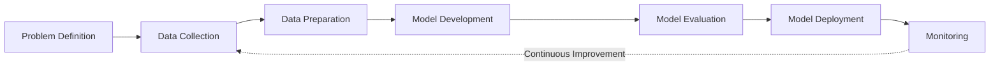

# 03. Machine Learning Lifecycle

> Learn how Machine Learning solutions are designed, developed, deployed, monitored, and continuously improved in real-world production environments.

---

## 🎯 Learning Objectives

After completing this chapter, you will be able to:

- Understand the complete Machine Learning lifecycle
- Explain each stage of an ML project
- Recognize the importance of data preparation and model evaluation
- Understand why Machine Learning is an iterative process
- Identify the responsibilities of Machine Learning engineers throughout the lifecycle

---

## 📖 Overview

Building a Machine Learning model is only one part of a successful AI project.

A production Machine Learning solution involves multiple stages, including understanding the business problem, collecting and preparing data, training and evaluating models, deploying them into production, and continuously monitoring their performance.

Unlike traditional software development, Machine Learning projects are highly iterative. Models must evolve as data changes, business requirements grow, and user behavior shifts over time.

---

## 🧠 Core Concepts

A typical Machine Learning project consists of the following stages:

1. Problem Definition
2. Data Collection
3. Data Preparation
4. Model Development
5. Model Evaluation
6. Model Deployment
7. Monitoring and Continuous Improvement

Each stage plays a critical role in delivering reliable and production-ready Machine Learning systems.

---

## 🏗️ Machine Learning Lifecycle



---

## 1️⃣ Problem Definition

Every successful Machine Learning project begins with a clearly defined business problem.

Examples include:

- Predict customer churn
- Detect fraudulent transactions
- Recommend products
- Forecast future sales

At this stage, stakeholders define:

- Business objectives
- Success criteria
- Expected outcomes
- Project constraints

Without a clearly defined problem, even the most accurate model may fail to deliver business value.

---

## 2️⃣ Data Collection

Machine Learning models learn from data.

The quality, quantity, and relevance of the collected data directly influence model performance.

Common data sources include:

- Relational databases
- Data warehouses
- APIs
- IoT devices
- Application logs
- CSV and Excel files
- Cloud storage

---

## 3️⃣ Data Preparation

Raw data is rarely suitable for Machine Learning.

It must be cleaned, transformed, and organized before model training.

Typical activities include:

- Removing duplicate records
- Handling missing values
- Correcting inconsistent data
- Feature engineering
- Data normalization
- Exploratory Data Analysis (EDA)

---

### ETL Process


| Stage | Purpose |
|--------|---------|
| Extract | Collect data from multiple sources |
| Transform | Clean, validate, and structure the data |
| Load | Store processed data for Machine Learning |

---

## 4️⃣ Model Development

During this stage, Machine Learning algorithms are trained using prepared datasets.

The goal is to discover patterns that enable accurate predictions on unseen data.

Typical activities include:

- Selecting an algorithm
- Training the model
- Feature selection
- Hyperparameter tuning
- Cross-validation

---

## 5️⃣ Model Evaluation

A trained model must be evaluated before deployment.

Common evaluation activities include:

- Testing on unseen data
- Measuring prediction quality
- Comparing multiple models
- Selecting the best-performing model

Typical evaluation metrics include:

- Accuracy
- Precision
- Recall
- F1 Score
- ROC-AUC

---

## 6️⃣ Model Deployment

Once validated, the Machine Learning model is deployed into production.

Deployment options include:

- REST APIs
- Microservices
- Batch processing
- Streaming applications
- Cloud AI platforms

After deployment, the model begins making predictions on real-world data.

---

## 7️⃣ Monitoring and Continuous Improvement

Deployment is not the end of the Machine Learning lifecycle.

Production models must be continuously monitored to ensure they remain accurate and reliable.

Monitoring activities include:

- Model performance
- Data drift
- Concept drift
- Prediction latency
- System availability
- Business KPIs

When performance degrades, models are retrained using new data.

---

## 🔄 The Iterative Nature of Machine Learning

Machine Learning projects are rarely linear.


As new data becomes available, models are retrained and redeployed to maintain performance.

---

## 👨‍💻 A Day in the Life of a Machine Learning Engineer

A Machine Learning engineer typically performs activities such as:

- Understanding business requirements
- Collecting data
- Cleaning and preparing datasets
- Training Machine Learning models
- Evaluating model performance
- Deploying models into production
- Monitoring production systems
- Retraining models when necessary

In most enterprise projects, data preparation and model tuning consume significantly more time than writing Machine Learning code.

---

## 🌍 Real-World Example

### Beauty Product Recommendation System

A beauty retailer wants to recommend products based on customer preferences.

The Machine Learning lifecycle might look like this:

1. Define the recommendation problem
2. Collect purchase history and customer profiles
3. Clean and prepare customer data
4. Train recommendation models
5. Evaluate recommendation quality
6. Deploy the recommendation engine
7. Monitor customer engagement and retrain periodically

---

## 🏢 Enterprise Perspective

Successful Machine Learning systems extend far beyond model development.

Enterprise AI teams invest heavily in:

- Reliable data pipelines
- Automated training pipelines
- Continuous deployment
- Model monitoring
- Governance
- Security
- Observability

Production Machine Learning is an ongoing engineering discipline rather than a one-time development effort.

---

## 💻 Implementation Example

=== "Python"

```python title="Typical Scikit-Learn Workflow"

# Collect Data

# Prepare Data

# Train Model

# Evaluate Model

# Deploy Model
```

=== "Enterprise Pipeline"

```text
Business Problem

↓

Data Pipeline

↓

Feature Engineering

↓

Model Training

↓

Model Evaluation

↓

Deployment

↓

Monitoring

↓

Retraining
```

---

!!! tip "Production Insight"

    In real-world Machine Learning projects, data collection, preparation, feature engineering, monitoring, and retraining often require significantly more effort than training the model itself.

---

## 💡 Best Practices

- Define measurable business objectives.
- Invest in high-quality data preparation.
- Validate models before deployment.
- Continuously monitor production performance.
- Retrain models regularly using updated data.
- Automate the Machine Learning pipeline wherever possible.

---

## ⚠️ Common Mistakes

- Starting with algorithms instead of business problems.
- Ignoring data quality.
- Evaluating models using only one metric.
- Deploying models without monitoring.
- Assuming deployed models will remain accurate indefinitely.

---

## 📌 Key Takeaways

- Machine Learning projects follow a structured lifecycle.
- Data quality is one of the most important success factors.
- Model evaluation is essential before deployment.
- Deployment is only the beginning of the production lifecycle.
- Continuous monitoring and retraining keep Machine Learning systems effective over time.

---

## 📚 Further Reading

The next chapter explores how Machine Learning is applied in real-world enterprise environments and the role of Machine Learning engineers in building production AI systems.

---

## ➡️ Next Chapter

**[04. Machine Learning in Practice](04-machine-learning-in-practice.md)**