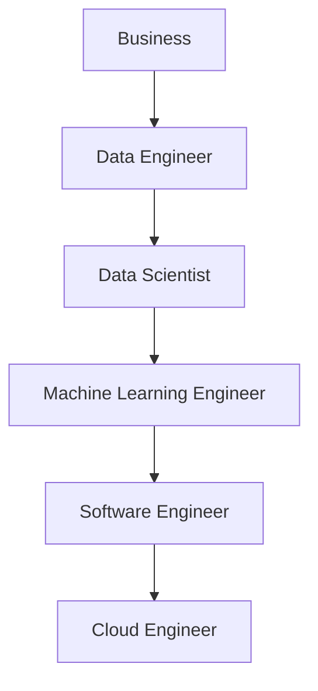

# 04. Machine Learning in Practice

> Explore how Machine Learning projects are executed in real-world organizations, understand the responsibilities of Machine Learning engineers, and learn how modern AI teams build production-ready intelligent systems.

---

## 🎯 Learning Objectives

After completing this chapter, you will be able to:

- Understand how Machine Learning projects are executed in practice
- Learn the day-to-day responsibilities of a Machine Learning Engineer
- Understand how business problems are transformed into AI solutions
- Differentiate between Data Scientists, Machine Learning Engineers, and AI Engineers
- Recognize the collaboration required to build production AI systems

---

## 📖 Overview

Developing Machine Learning models is only one part of an AI project.

In enterprise environments, Machine Learning engineers work closely with business stakeholders, data engineers, software engineers, cloud architects, and data scientists to design, build, deploy, and maintain intelligent systems.

A successful Machine Learning solution combines technical expertise with business understanding, high-quality data, scalable infrastructure, and continuous monitoring.

---

## 🧠 Core Concepts

A typical Machine Learning project involves:

- Understanding business objectives
- Collecting and preparing data
- Building Machine Learning models
- Evaluating model performance
- Deploying models into production
- Monitoring and continuously improving the solution

Machine Learning engineers participate throughout this entire lifecycle.

---

## 🏗️ Enterprise Machine Learning Workflow

---

## 👨‍💻 A Day in the Life of a Machine Learning Engineer

Machine Learning engineers solve business problems using data and intelligent models.

A typical day may include:

- Meeting business stakeholders
- Understanding project requirements
- Collecting and validating datasets
- Cleaning and preparing data
- Building Machine Learning pipelines
- Training and evaluating models
- Deploying models to production
- Monitoring model performance
- Investigating prediction failures
- Retraining models using new data

Their work extends far beyond writing Machine Learning code.

---

## 🌍 Real-World Example

### Beauty Product Recommendation System

Suppose an online retailer wants to recommend beauty products to customers.

The Machine Learning workflow may look like this:

### Step 1 — Understand the Business Problem

Recommend products that customers are most likely to purchase.

---

### Step 2 — Collect Data

Gather information such as:

- Customer profiles
- Purchase history
- Product catalog
- Product ratings
- Search history
- Browsing behavior

---

### Step 3 — Prepare the Data

Prepare the dataset by:

- Removing duplicate records
- Handling missing values
- Creating useful features
- Performing exploratory data analysis (EDA)

---

### Step 4 — Build Machine Learning Models

Possible recommendation approaches include:

- Content-Based Filtering
- Collaborative Filtering
- Hybrid Recommendation Systems

---

### Step 5 — Evaluate the Solution

Measure success using:

- Click-through rate
- Conversion rate
- Customer engagement
- Product purchases
- User feedback

---

### Step 6 — Deploy the Model

Integrate the recommendation engine into:

- Website
- Mobile application
- Customer portal

---

### Step 7 — Monitor and Improve

Continuously monitor:

- Recommendation quality
- Customer feedback
- Model accuracy
- Business KPIs

Retrain the model whenever performance declines.

---

## 👥 Data Scientist vs Machine Learning Engineer vs AI Engineer

| Aspect | Data Scientist | Machine Learning Engineer | AI Engineer |
|---------|----------------|---------------------------|-------------|
| Primary Focus | Data Analysis & Insights | Building ML Systems | Building AI Applications |
| Typical Work | Statistics, Analytics | Model Development & Deployment | LLMs, RAG, Agents, AI Applications |
| Data | Mostly Structured | Structured & Semi-Structured | Mostly Unstructured |
| Models | Classical ML Models | ML & Deep Learning Models | Foundation Models & LLMs |
| Deployment | Limited | Extensive | Extensive |
| Primary Goal | Generate Insights | Deliver Production ML Systems | Build Intelligent AI Products |

---

## 🏢 Collaboration in AI Projects

Enterprise AI projects involve multiple teams working together.

Each role contributes specialized expertise to deliver reliable and scalable AI solutions.

---

## 🚀 Evolution of AI Engineering

Modern AI engineering has evolved beyond traditional Machine Learning.

Today's AI engineers increasingly build applications using:

- Foundation Models
- Large Language Models (LLMs)
- Prompt Engineering
- Retrieval-Augmented Generation (RAG)
- AI Agents
- Multimodal AI

Instead of training models from scratch, many AI systems leverage powerful pre-trained foundation models.

---

## 💻 Example Enterprise AI Stack

| Layer | Example Technologies |
|--------|----------------------|
| Programming | Python, Java |
| Data Processing | Pandas, Spark |
| Machine Learning | Scikit-Learn |
| Deep Learning | TensorFlow, PyTorch |
| Generative AI | Hugging Face, OpenAI APIs |
| Orchestration | LangChain, LangGraph |
| Deployment | Docker, Kubernetes |
| Cloud | AWS, Azure, Google Cloud |

---

!!! tip "Production Insight"

    Production Machine Learning is a collaborative engineering effort.

    Success depends on effective teamwork, reliable data pipelines, scalable infrastructure, continuous monitoring, and close alignment with business objectives.

---

## 💡 Best Practices

- Start with a clearly defined business problem.
- Collaborate closely with domain experts.
- Build reusable Machine Learning pipelines.
- Automate deployment and monitoring.
- Continuously evaluate business impact.
- Retrain models using fresh production data.

---

## ⚠️ Common Mistakes

- Focusing only on model accuracy.
- Ignoring business objectives.
- Treating deployment as the final step.
- Underestimating data preparation effort.
- Failing to monitor production models.

---

## 📌 Key Takeaways

- Machine Learning engineers participate throughout the complete ML lifecycle.
- Successful AI projects require collaboration across multiple disciplines.
- Production AI systems extend far beyond model training.
- Monitoring, maintenance, and continuous improvement are essential for long-term success.
- Modern AI engineering increasingly combines classical Machine Learning with Generative AI technologies.

---

## 📚 Further Reading

Continue with the Machine Learning ecosystem to explore the tools, frameworks, and libraries used to build modern AI systems.

---

## ➡️ Next Chapter

*[05. Machine Learning Ecosystem and Tools](05-machine-learning-ecosystem-and-tools.md)*