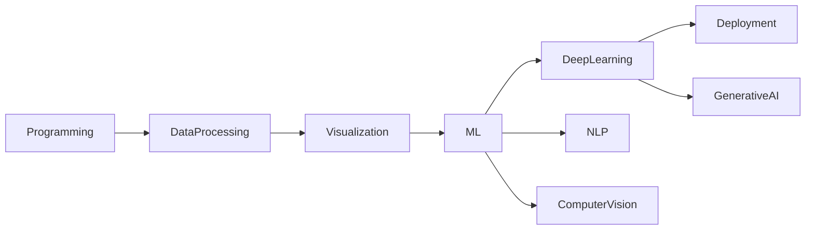
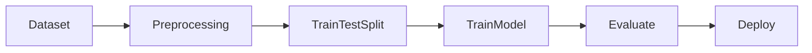

# 05. Machine Learning Ecosystem and Tools

> Explore the ecosystem of programming languages, libraries, frameworks, and platforms that power modern Machine Learning solutions, from data processing to production deployment.

---

## 🎯 Learning Objectives

After completing this chapter, you will be able to:

- Understand the Machine Learning ecosystem
- Identify the role of popular ML programming languages
- Recognize the major categories of Machine Learning tools
- Understand where different libraries fit into an ML project
- Become familiar with Scikit-Learn and the Python ML ecosystem

---

## 📖 Overview

Machine Learning is not built using a single programming language or library.

Instead, it relies on a rich ecosystem of tools that support every stage of the Machine Learning lifecycle—from collecting and processing data to building models, visualizing results, deploying solutions, and maintaining production systems.

Choosing the right tools allows engineers to build scalable, maintainable, and production-ready AI applications.

---

## 🧠 Core Concepts

A modern Machine Learning ecosystem consists of multiple categories of tools, including:

- Programming Languages
- Data Processing
- Data Visualization
- Machine Learning Libraries
- Deep Learning Frameworks
- Computer Vision Libraries
- Natural Language Processing (NLP)
- Generative AI Frameworks

Each category addresses a different part of the Machine Learning workflow.

---

## 🏗️ Machine Learning Ecosystem



---

## 💻 Programming Languages

Several programming languages are widely used in Machine Learning.

| Language | Primary Use |
|----------|-------------|
| Python | General-purpose Machine Learning and AI |
| R | Statistics and Data Analysis |
| Julia | Scientific Computing |
| Scala | Big Data and Apache Spark |
| Java | Enterprise Machine Learning Applications |
| JavaScript | Browser-based Machine Learning |

Among these, **Python** has become the dominant language due to its extensive ecosystem, simplicity, and strong community support.

---

## 📊 Data Processing Tools

Before training a model, data must be collected, cleaned, transformed, and organized.

Common tools include:

| Tool | Purpose |
|------|---------|
| NumPy | Numerical Computing |
| Pandas | Data Analysis and Manipulation |
| PostgreSQL | Relational Database |
| Apache Spark | Distributed Data Processing |
| Hadoop | Big Data Processing |
| Kafka | Real-Time Data Streaming |

---

## 📈 Data Visualization Tools

Visualization helps engineers understand data, identify trends, and communicate insights.

| Tool | Purpose |
|------|---------|
| Matplotlib | Basic Data Visualization |
| Seaborn | Statistical Visualization |
| ggplot2 | Visualization in R |
| Tableau | Business Intelligence Dashboards |

---

## 🤖 Machine Learning Libraries

These libraries provide implementations of classical Machine Learning algorithms.

| Library | Purpose |
|---------|---------|
| Scikit-Learn | Classical Machine Learning |
| NumPy | Numerical Operations |
| Pandas | Data Manipulation |
| SciPy | Scientific Computing |

These libraries work together to simplify the complete Machine Learning workflow.

---

## 🧠 Deep Learning Frameworks

Deep Learning frameworks simplify the development of neural networks.

| Framework | Purpose |
|-----------|---------|
| TensorFlow | Production Deep Learning |
| Keras | High-Level Deep Learning API |
| PyTorch | Research and Flexible Development |
| Theano | Legacy Symbolic Computation |

TensorFlow and PyTorch are the most widely adopted frameworks in modern AI development.

---

## 👁️ Computer Vision Libraries

Computer Vision enables machines to understand and interpret images and videos.

| Library | Purpose |
|---------|---------|
| OpenCV | Computer Vision Applications |
| Scikit-Image | Image Processing |
| TorchVision | Vision Models for PyTorch |

---

## 💬 Natural Language Processing (NLP)

NLP focuses on understanding and processing human language.

| Library | Purpose |
|---------|---------|
| NLTK | Text Processing |
| TextBlob | Sentiment Analysis |
| Stanza | Advanced NLP Models |

---

## 🚀 Generative AI Tools

Modern AI applications increasingly rely on foundation models and Generative AI frameworks.

| Tool | Purpose |
|------|---------|
| Hugging Face | Open-Source Foundation Models |
| ChatGPT | Conversational AI |
| DALL·E | Text-to-Image Generation |
| PyTorch | Building Generative Models |

These platforms enable developers to build intelligent applications without training massive models from scratch.

---

## ⭐ Scikit-Learn

Scikit-Learn is one of the most popular Machine Learning libraries in Python.

It provides a simple and consistent API for building classical Machine Learning models.

Key capabilities include:

- Data preprocessing
- Feature engineering
- Train-test splitting
- Classification
- Regression
- Clustering
- Model evaluation
- Cross-validation
- Model persistence

---

## 🏗️ Typical Scikit-Learn Workflow



---

## 💻 Implementation Example

=== "Python"

```python title="scikit_learn_workflow.py"
from sklearn.datasets import load_iris
from sklearn.model_selection import train_test_split
from sklearn.ensemble import RandomForestClassifier

X, y = load_iris(return_X_y=True)

X_train, X_test, y_train, y_test = train_test_split(
    X,
    y,
    test_size=0.2,
    random_state=42
)

model = RandomForestClassifier()

model.fit(X_train, y_train)

accuracy = model.score(X_test, y_test)

print(f"Accuracy: {accuracy:.2f}")
```

=== "Enterprise ML Stack"

```text
Business Problem

↓

Data Sources

↓

Pandas / Spark

↓

Scikit-Learn

↓

TensorFlow / PyTorch

↓

Model Deployment

↓

Monitoring
```

---

## 🏢 Enterprise Perspective

Enterprise Machine Learning solutions rarely depend on a single framework.

Organizations combine multiple technologies to build complete AI platforms, including:

- Data Engineering
- Machine Learning
- Deep Learning
- Cloud Infrastructure
- Containerization
- CI/CD Pipelines
- Monitoring
- MLOps

Selecting the right combination of tools depends on business requirements, scalability, team expertise, and operational constraints.

---

!!! tip "Production Insight"

    There is no single "best" Machine Learning framework.

    Successful AI teams choose tools based on the problem they are solving, system scalability, deployment requirements, and long-term maintainability.

---

## 💡 Best Practices

- Select tools based on project requirements.
- Prefer widely adopted open-source frameworks.
- Build modular and reusable ML pipelines.
- Automate repetitive workflows.
- Keep libraries updated.
- Use version control for models and datasets.

---

## ⚠️ Common Mistakes

- Learning too many tools before mastering the fundamentals.
- Choosing frameworks based on popularity instead of requirements.
- Ignoring interoperability between tools.
- Using complex frameworks for simple Machine Learning problems.
- Neglecting production deployment considerations.

---

## 📌 Key Takeaways

- Machine Learning relies on a rich ecosystem of tools and frameworks.
- Python is the dominant programming language for Machine Learning.
- Different libraries serve different stages of the ML lifecycle.
- Scikit-Learn is the standard library for classical Machine Learning.
- TensorFlow and PyTorch are the leading Deep Learning frameworks.
- Enterprise AI systems integrate multiple tools rather than relying on a single technology.

---

## 🎉 Module Complete

Congratulations! You have completed the **Machine Learning** module.

You now have a solid understanding of:

- Machine Learning fundamentals
- Learning paradigms
- The Machine Learning lifecycle
- Enterprise Machine Learning workflows
- The Machine Learning ecosystem

These concepts form the foundation for Deep Learning, Generative AI, Retrieval-Augmented Generation (RAG), AI Agents, and other advanced topics covered in this handbook.

---

## ➡️ Next Module

**[Part II — Deep Learning](../02-deep-learning/index.md)**