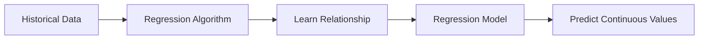
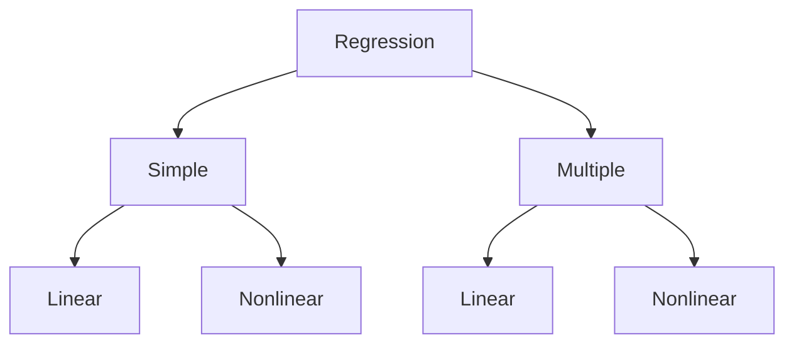

# 06. Regression Fundamentals

> Learn the fundamentals of regression, understand how it models relationships between variables, and discover how regression techniques are used to solve real-world prediction problems across industries.

---

## 🎯 Learning Objectives

After completing this chapter, you will be able to:

- Explain what regression is and why it is important
- Understand the difference between simple and multiple regression
- Differentiate between linear and nonlinear regression
- Identify common business applications of regression
- Select an appropriate regression approach for different prediction problems

---

## 📖 Overview

Regression is one of the most widely used supervised Machine Learning techniques for predicting **continuous numerical values**.

Unlike classification, which predicts categories, regression estimates quantities such as house prices, sales revenue, stock prices, medical measurements, and CO₂ emissions by learning relationships between input variables (features) and a continuous target variable.

Regression serves as the foundation for many predictive analytics solutions and remains one of the most important techniques used in business intelligence, finance, healthcare, manufacturing, and scientific research. :contentReference[oaicite:0]{index=0}

---

## 🧠 Core Concepts

Regression learns the relationship between:

- Independent Variables (Features)
- Dependent Variable (Target)

After learning from historical labelled data, the model predicts numerical values for unseen observations.

Examples include:

- Predicting house prices
- Forecasting sales
- Estimating fuel consumption
- Predicting CO₂ emissions
- Forecasting electricity demand
- Estimating insurance costs

---

## 🏗️ How Regression Works



---

## 📘 What is Regression?

Regression is a **Supervised Learning** technique that models relationships between variables to predict continuous outcomes.

It attempts to answer questions such as:

- What will next month's sales be?
- What is the expected house price?
- How much CO₂ will this vehicle emit?
- What will tomorrow's temperature be?

Rather than assigning categories, regression estimates numerical values based on patterns learned from historical data. :contentReference[oaicite:1]{index=1}

---

## 📊 Types of Regression

Regression models can be classified based on the number of input variables.

### Simple Regression

Simple Regression uses **one independent variable** to predict a target variable.

Example:

- Predict CO₂ emissions using only engine size.

---

### Multiple Regression

Multiple Regression uses **two or more independent variables** to improve prediction accuracy.

Example:

- Engine Size
- Cylinders
- Fuel Consumption

↓

Predict CO₂ Emissions

Using additional relevant features often improves predictive performance. :contentReference[oaicite:2]{index=2}

---

## 📋 Simple vs Multiple Regression

| Aspect | Simple Regression | Multiple Regression |
|---------|-------------------|---------------------|
| Independent Variables | 1 | Two or More |
| Complexity | Low | Higher |
| Information Available | Limited | Richer |
| Example | House Price from Area | House Price from Area, Bedrooms, Location |

---

## 📈 Linear vs Nonlinear Regression

Regression models can also be categorized based on the relationship between variables.

### Linear Regression

Assumes a straight-line relationship between features and the target variable.

Suitable when the relationship is approximately linear.

---

### Nonlinear Regression

Models more complex relationships that cannot be represented using a straight line.

Useful for exponential growth, logarithmic relationships, seasonal trends, and other nonlinear patterns. :contentReference[oaicite:3]{index=3}

---

## 🏗️ Regression Categories



---

## 🌍 Real-World Applications

Regression is widely used across industries.

| Industry | Example Application |
|----------|---------------------|
| Automotive | CO₂ Emission Prediction |
| Real Estate | House Price Prediction |
| Finance | Sales Forecasting |
| Manufacturing | Predictive Maintenance |
| Healthcare | Blood Pressure Prediction |
| Banking | Revenue Forecasting |
| Insurance | Premium Estimation |
| Agriculture | Crop Yield Prediction |
| Weather | Rainfall Forecasting |

These applications demonstrate how regression transforms historical data into meaningful business predictions. :contentReference[oaicite:4]{index=4}

---

## 🚗 Case Study: Predicting CO₂ Emissions

Consider a vehicle manufacturer that wants to estimate carbon emissions before production.

Available features include:

- Engine Size
- Number of Cylinders
- Fuel Consumption

A regression model learns from historical vehicle data and predicts expected CO₂ emissions for new vehicles.

Such predictions help manufacturers optimize engine design while complying with environmental regulations. :contentReference[oaicite:5]{index=5}

---

## 🏢 Enterprise Perspective

Regression models play a critical role in enterprise analytics.

Organizations rely on regression to:

- Forecast demand
- Predict revenue
- Optimize pricing
- Estimate financial risk
- Improve inventory planning
- Support strategic decision-making

Although modern AI systems often use more sophisticated algorithms, regression remains one of the most interpretable and trusted predictive techniques available.

---

## 💻 Implementation Example

=== "Python"

```python title="linear_regression.py"
from sklearn.linear_model import LinearRegression

model = LinearRegression()

model.fit(X_train, y_train)

predictions = model.predict(X_test)
```

=== "Business Workflow"

```text
Historical Data

↓

Regression Model

↓

Predictions

↓

Business Decisions
```

---

!!! tip "Production Insight"

    Regression models are often used as baseline models in Machine Learning projects because they are simple, interpretable, computationally efficient, and easy to explain to business stakeholders.

---

## 💡 Best Practices

- Clearly define the prediction objective.
- Use relevant independent variables.
- Collect high-quality historical data.
- Start with simple models before increasing complexity.
- Evaluate models using appropriate regression metrics.

---

## ⚠️ Common Mistakes

- Treating regression problems as classification tasks.
- Selecting irrelevant features.
- Ignoring feature relationships.
- Using regression for categorical targets.
- Assuming every relationship is linear.

---

## 📌 Key Takeaways

- Regression predicts continuous numerical values.
- It is a supervised Machine Learning technique.
- Simple regression uses one feature.
- Multiple regression uses multiple features.
- Regression models can be linear or nonlinear.
- Regression is one of the most widely used predictive modeling techniques in enterprise applications.

---

## 📚 Further Reading

The next chapter introduces **Linear Regression**, covering Simple Linear Regression, Multiple Linear Regression, Ordinary Least Squares (OLS), and the assumptions behind linear models.

---

## ➡️ Next Chapter

*[07. Linear Regression](07-linear-regression.md)*