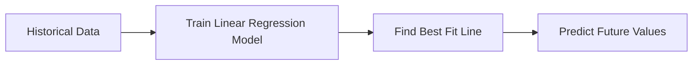
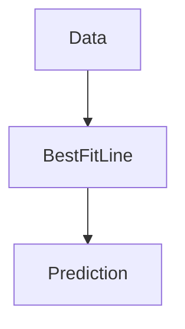
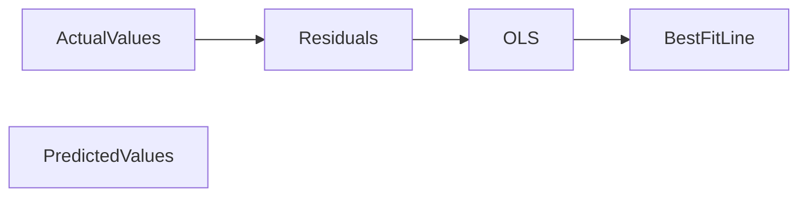

# 07. Linear Regression

> Learn one of the most fundamental Machine Learning algorithms used to model relationships between variables and predict continuous numerical values using a best-fit linear equation.

---

## 🎯 Learning Objectives

After completing this chapter, you will be able to:

- Understand the concept of Linear Regression
- Explain Simple and Multiple Linear Regression
- Learn how the best-fit line is calculated
- Understand the role of Ordinary Least Squares (OLS)
- Recognize the assumptions of Linear Regression
- Apply Linear Regression using Scikit-Learn

---

## 📖 Overview

Linear Regression is one of the simplest and most widely used supervised Machine Learning algorithms.

It models the relationship between one or more independent variables and a continuous dependent variable using a straight-line equation.

Despite its simplicity, Linear Regression is widely used in finance, healthcare, manufacturing, economics, and business analytics because it is easy to understand, computationally efficient, and highly interpretable.

---

## 🧠 Core Concepts

Linear Regression attempts to find the line that best represents the relationship between the input variables and the target variable.

The objective is to minimize the difference between the predicted values and the actual observations.

There are two major types of Linear Regression:

- Simple Linear Regression
- Multiple Linear Regression

---

## 🏗️ Linear Regression Workflow



---

# 📘 Simple Linear Regression

Simple Linear Regression uses **one independent variable** to predict a continuous target variable.

Example:

Predict a student's exam score based on the number of hours studied.

| Hours Studied | Exam Score |
|---------------|------------|
| 2 | 45 |
| 4 | 60 |
| 6 | 75 |
| 8 | 88 |

The algorithm learns the relationship and predicts scores for new students.

---

## 📈 Best Fit Line

Linear Regression attempts to fit the best possible straight line through the training data.

The equation of the line is:

**Prediction = Intercept + (Slope × Feature)**

The slope determines how much the prediction changes when the feature changes.

The intercept represents the predicted value when the feature is zero.

---

## 📊 Visual Representation



---

## 📗 Multiple Linear Regression

Multiple Linear Regression extends Simple Linear Regression by using multiple input variables.

Example:

Predict house prices using:

- Area
- Number of Bedrooms
- Location
- Age of Property

Using multiple features generally produces more accurate predictions because the model captures additional information.

---

## 📋 Simple vs Multiple Linear Regression

| Aspect | Simple | Multiple |
|---------|--------|----------|
| Features | One | Multiple |
| Complexity | Low | Moderate |
| Accuracy | Lower | Higher |
| Example | House Price from Area | House Price from Area, Bedrooms & Location |

---

# 📐 Ordinary Least Squares (OLS)

Linear Regression uses the **Ordinary Least Squares (OLS)** method to determine the best-fit line.

OLS minimizes the overall prediction error by reducing the squared distance between actual values and predicted values.

This process produces the line that best represents the relationship within the training data.

---

## 📉 Residuals

A **Residual** is the difference between the actual value and the predicted value.

```text
Residual = Actual Value − Predicted Value
```

Smaller residuals indicate a better-performing regression model.

---

## 🏗️ OLS Concept



---

# 📌 Assumptions of Linear Regression

Linear Regression performs best when certain assumptions are satisfied.

## 1. Linear Relationship

The relationship between features and target should be approximately linear.

---

## 2. Independence

Observations should be independent of one another.

---

## 3. Homoscedasticity

Residuals should have constant variance.

---

## 4. Normal Distribution of Residuals

Prediction errors should approximately follow a normal distribution.

---

## 5. Low Multicollinearity

Independent variables should not be highly correlated with each other.

Violating these assumptions can reduce prediction quality.

---

## 🌍 Real-World Applications

Linear Regression is commonly used for:

| Industry | Example |
|----------|----------|
| Real Estate | House Price Prediction |
| Finance | Revenue Forecasting |
| Healthcare | Blood Pressure Prediction |
| Retail | Sales Forecasting |
| Insurance | Premium Estimation |
| Manufacturing | Cost Prediction |
| Agriculture | Crop Yield Prediction |

---

## 🚗 Case Study

### Predicting House Prices

Features:

- Area
- Bedrooms
- Bathrooms
- Age of House
- Parking

↓

Linear Regression Model

↓

Predicted House Price

This allows real estate companies to estimate property values before listing them.

---

## 💻 Implementation Example

=== "Python"

```python title="linear_regression.py"
from sklearn.linear_model import LinearRegression

model = LinearRegression()

model.fit(X_train, y_train)

predictions = model.predict(X_test)

print(predictions)
```

=== "Java"

```java title="Smile Linear Regression"

// Smile Machine Learning Library

LinearRegression model = LinearRegression.fit(x, y);
```

---

## 🏢 Enterprise Perspective

Linear Regression is often the first predictive model built in enterprise analytics projects.

Its advantages include:

- Easy interpretation
- Fast training
- Low computational cost
- Explainable predictions
- Strong baseline for comparing advanced models

Many organizations begin with Linear Regression before evaluating more sophisticated algorithms such as Decision Trees, Random Forests, or Gradient Boosting.

---

!!! tip "Production Insight"

    Linear Regression is frequently used as a baseline model in production Machine Learning projects.

    If a complex algorithm cannot significantly outperform a well-designed Linear Regression model, the simpler model is often preferred due to its interpretability and lower maintenance cost.

---

## 💡 Best Practices

- Understand the business problem before selecting features.
- Remove irrelevant variables.
- Check for multicollinearity.
- Scale features when appropriate.
- Validate assumptions before deployment.
- Compare Linear Regression with other baseline models.

---

## ⚠️ Common Mistakes

- Ignoring regression assumptions.
- Using highly correlated features.
- Overfitting with unnecessary variables.
- Assuming every relationship is linear.
- Evaluating models only by visual inspection.

---

## 📌 Key Takeaways

- Linear Regression predicts continuous numerical values.
- Simple Linear Regression uses one feature.
- Multiple Linear Regression uses multiple features.
- OLS finds the best-fit line by minimizing prediction errors.
- Residuals measure prediction accuracy.
- Linear Regression remains one of the most important predictive algorithms in Machine Learning.

---

## 📚 Further Reading

The next chapter introduces **Nonlinear Regression**, where relationships between variables cannot be represented using a straight line.

---

## ➡️ Next Chapter

*[08. Nonlinear Regression](08-nonlinear-regression.md)*