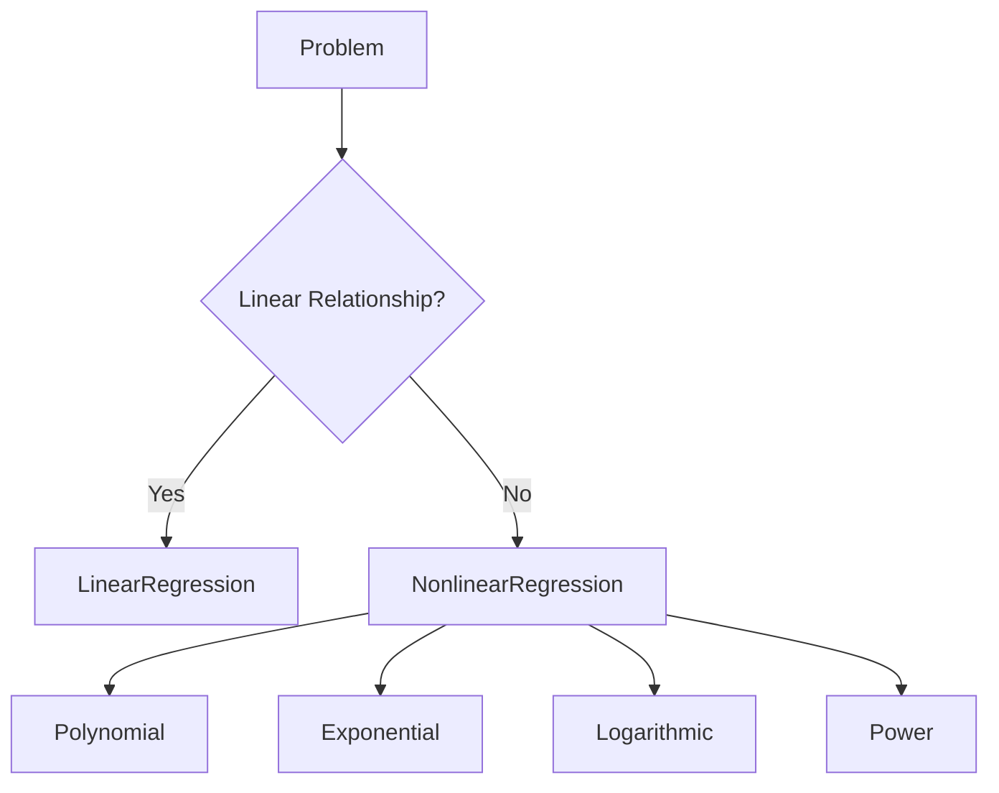

# 08. Nonlinear Regression

> Learn how Nonlinear Regression models complex relationships between variables when a straight line is not sufficient to accurately represent real-world data.

---

## 🎯 Learning Objectives

After completing this chapter, you will be able to:

- Understand when Linear Regression is insufficient
- Explain the concept of Nonlinear Regression
- Differentiate Linear and Nonlinear Regression
- Understand common nonlinear functions
- Learn Polynomial Regression
- Select the appropriate regression model for different business problems

---

## 📖 Overview

Many real-world relationships are not linear.

While Linear Regression assumes that changes in the independent variable produce proportional changes in the dependent variable, many business and scientific problems exhibit curves, exponential growth, logarithmic trends, saturation effects, or seasonal patterns.

Nonlinear Regression models these complex relationships more accurately, enabling better predictions when data does not follow a straight-line pattern.

---

## 🧠 Core Concepts

Nonlinear Regression models relationships that cannot be represented using a straight line.

Examples include:

- Population growth
- Disease spread
- Battery discharge
- Product adoption
- Radioactive decay
- Compound interest
- Chemical reactions

In these scenarios, predictions improve significantly when nonlinear models are used instead of linear models.

---

## 🏗️ Regression Decision Flow



---

# 📘 What is Nonlinear Regression?

Nonlinear Regression models data where the relationship between variables follows a curve rather than a straight line.

Instead of fitting a line, the algorithm estimates a mathematical function that best represents the observed data.

This allows the model to capture more realistic patterns found in business and scientific datasets.

---

## 📊 Linear vs Nonlinear Regression

| Feature | Linear Regression | Nonlinear Regression |
|---------|------------------|----------------------|
| Relationship | Straight Line | Curve |
| Complexity | Simple | Higher |
| Flexibility | Limited | High |
| Training Time | Faster | Slower |
| Interpretability | High | Moderate |

---

## 📈 Common Nonlinear Relationships

Several mathematical relationships are commonly used.

### Polynomial

Suitable for curved relationships.

Example:

House prices increasing faster in premium neighborhoods.

---

### Exponential

Suitable for rapid growth or decay.

Examples:

- Virus spread
- Population growth
- Radioactive decay

---

### Logarithmic

Suitable when growth slows over time.

Examples:

- Learning curves
- Marketing response
- Customer acquisition

---

### Power Functions

Used when one variable grows proportionally with another raised to a power.

Examples:

- Biological scaling
- Engineering models

---

## 🏗️ Common Nonlinear Models


---

# 📙 Polynomial Regression

Polynomial Regression is one of the most widely used nonlinear regression techniques.

Instead of fitting a straight line, it fits a curve by introducing polynomial terms.

For example:

- Linear Regression fits a line.
- Polynomial Regression fits a curve.

Polynomial Regression is especially useful when data exhibits gradual curvature while remaining continuous.

Typical applications include:

- Sales forecasting
- Demand prediction
- Manufacturing optimization
- Financial modeling

---

## 🌍 Real-World Applications

| Industry | Example |
|----------|----------|
| Retail | Demand Forecasting |
| Healthcare | Disease Progression |
| Finance | Revenue Forecasting |
| Agriculture | Crop Yield Prediction |
| Energy | Electricity Consumption |
| Transportation | Fuel Consumption |
| Manufacturing | Equipment Performance |
| Environmental Science | Climate Modeling |

---

## 🚗 Case Study

### Predicting Fuel Consumption

Suppose a vehicle manufacturer wants to predict fuel consumption.

A Linear Regression model may perform poorly because fuel efficiency changes nonlinearly as engine size increases.

Using Polynomial Regression produces a smoother curve that better captures the real-world relationship between engine size and fuel consumption.

This leads to more accurate predictions.

---

## 💻 Implementation Example

=== "Python"

```python title="polynomial_regression.py"
from sklearn.preprocessing import PolynomialFeatures
from sklearn.linear_model import LinearRegression
from sklearn.pipeline import Pipeline

model = Pipeline([
    ("poly", PolynomialFeatures(degree=2)),
    ("linear", LinearRegression())
])

model.fit(X_train, y_train)

predictions = model.predict(X_test)
```

=== "Pipeline"

```text
Dataset

↓

Polynomial Features

↓

Regression Model

↓

Predictions
```

---

## ⚖️ Choosing Between Linear and Nonlinear Regression

Choose **Linear Regression** when:

- Data follows a straight-line relationship
- Simplicity and interpretability are important
- The relationship is approximately linear

Choose **Nonlinear Regression** when:

- Data exhibits curves
- Prediction accuracy is more important than simplicity
- Linear models consistently underperform

---

## 🚨 Overfitting Considerations

Increasing model complexity can improve training accuracy but may reduce performance on unseen data.

Common causes include:

- High polynomial degree
- Small training datasets
- Excessive model complexity

A good regression model should balance accuracy and generalization.

---

## 🏢 Enterprise Perspective

Enterprise Machine Learning projects rarely assume that business relationships are perfectly linear.

Organizations evaluate multiple regression models and compare their performance before selecting the best solution.

Model selection typically considers:

- Prediction accuracy
- Explainability
- Computational cost
- Scalability
- Maintenance effort

In many production systems, Linear Regression serves as the baseline model, while Polynomial or other nonlinear techniques are adopted only when they provide meaningful improvements.

---

!!! tip "Production Insight"

    Always begin with the simplest model that adequately explains the data.

    If Linear Regression performs well, introducing more complex nonlinear models may increase maintenance costs without delivering significant business value.

---

## 💡 Best Practices

- Visualize the data before selecting a regression model.
- Start with Linear Regression as a baseline.
- Increase model complexity only when necessary.
- Validate models using unseen data.
- Compare multiple regression techniques before deployment.

---

## ⚠️ Common Mistakes

- Assuming every dataset requires nonlinear models.
- Using very high polynomial degrees.
- Ignoring overfitting.
- Evaluating models only on training data.
- Selecting complex models without business justification.

---

## 📌 Key Takeaways

- Nonlinear Regression models curved relationships.
- Polynomial Regression is the most common nonlinear technique.
- Linear Regression should be used as a baseline.
- More complex models do not always produce better business outcomes.
- Model selection should balance prediction accuracy, interpretability, and maintainability.

---

## 📚 Further Reading

The next chapter introduces **Logistic Regression**, a supervised learning algorithm used for binary classification problems.

---

## ➡️ Next Chapter

*[09. Logistic Regression](09-logistic-regression.md)*