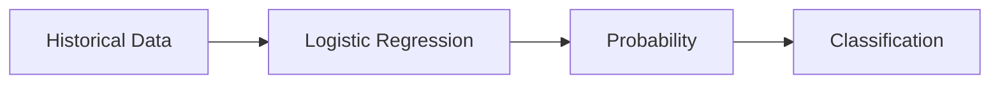
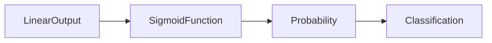
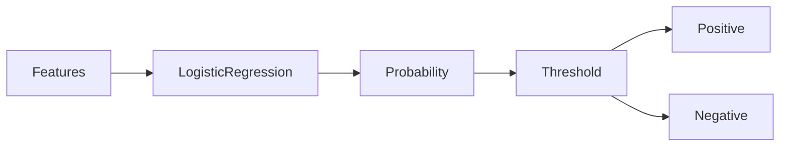

# 09. Logistic Regression

> Learn how Logistic Regression solves binary classification problems by estimating probabilities and making intelligent decisions based on data.

---

## 🎯 Learning Objectives

After completing this chapter, you will be able to:

- Understand why Linear Regression cannot solve classification problems
- Explain the concept of Logistic Regression
- Understand the Sigmoid Function
- Learn how probability-based classification works
- Understand the Decision Boundary
- Build a Logistic Regression model using Scikit-Learn

---

## 📖 Overview

Although its name contains the word **Regression**, Logistic Regression is primarily a **classification algorithm**.

Instead of predicting continuous numerical values, Logistic Regression predicts the probability that an observation belongs to a particular class.

It is one of the most widely used supervised Machine Learning algorithms for binary classification problems such as fraud detection, disease diagnosis, spam detection, customer churn prediction, and credit approval.

---

## 🧠 Core Concepts

Logistic Regression predicts the probability of an event occurring.

Examples include:

- Will a customer churn?
- Is this email spam?
- Is a transaction fraudulent?
- Will a patient develop a disease?
- Will a loan default?

Instead of predicting numbers, Logistic Regression predicts probabilities between **0 and 1**, which are then converted into class labels.

---

## 🏗️ Logistic Regression Workflow



---

# 📘 Why Not Linear Regression?

Linear Regression predicts continuous values.

For classification problems, predictions must belong to predefined classes.

Example:

| Problem | Expected Output |
|----------|----------------|
| Spam Detection | Spam / Not Spam |
| Disease Detection | Positive / Negative |
| Customer Churn | Yes / No |
| Loan Approval | Approved / Rejected |

A Linear Regression model may predict values less than **0** or greater than **1**, making it unsuitable for probability estimation.

Logistic Regression overcomes this limitation by transforming predictions into probabilities.

---

# 📈 Sigmoid Function

The Sigmoid Function converts any real-valued input into a probability between **0 and 1**.

Characteristics:

- Smooth S-shaped curve
- Outputs values between 0 and 1
- Easy to interpret as probabilities
- Ideal for binary classification

---

## 🏗️ Sigmoid Curve



---

## 📊 Probability Interpretation

| Probability | Prediction |
|-------------|------------|
| 0.95 | Positive |
| 0.82 | Positive |
| 0.67 | Positive |
| 0.51 | Positive |
| 0.49 | Negative |
| 0.25 | Negative |
| 0.03 | Negative |

---

# 📌 Decision Boundary

Once the probability is calculated, a threshold determines the final prediction.

The most common threshold is:

**0.5**

If:

Probability ≥ 0.5

↓

Positive Class

Otherwise

↓

Negative Class

The threshold can be adjusted depending on the business requirements.

---

## 🏗️ Classification Process



---

## 📈 Linear Regression vs Logistic Regression

| Feature | Linear Regression | Logistic Regression |
|----------|------------------|---------------------|
| Problem Type | Regression | Classification |
| Output | Continuous Value | Probability |
| Target Variable | Numeric | Categorical |
| Prediction Range | Any Number | 0 to 1 |
| Typical Applications | House Price Prediction | Spam Detection |

---

## 🌍 Real-World Applications

Logistic Regression is widely used for binary classification.

| Industry | Example |
|----------|----------|
| Banking | Loan Approval |
| Finance | Fraud Detection |
| Healthcare | Disease Diagnosis |
| Insurance | Claim Prediction |
| Retail | Customer Churn Prediction |
| Cybersecurity | Intrusion Detection |
| Marketing | Campaign Response Prediction |

---

## 🚗 Case Study

### Customer Churn Prediction

A telecom company wants to identify customers who are likely to leave.

Input Features:

- Monthly Charges
- Contract Type
- Internet Usage
- Customer Tenure
- Support Tickets

↓

Logistic Regression

↓

Probability of Customer Churn

↓

Business Action

- High probability → Retention campaign
- Low probability → No action required

---

## 💻 Implementation Example

=== "Python"

```python title="logistic_regression.py"
from sklearn.linear_model import LogisticRegression

model = LogisticRegression()

model.fit(X_train, y_train)

predictions = model.predict(X_test)

probabilities = model.predict_proba(X_test)
```

=== "Prediction"

```python
prediction = model.predict(customer)

if prediction == 1:
    print("Customer will churn")
else:
    print("Customer will stay")
```

---

## 🏢 Enterprise Perspective

Logistic Regression remains one of the most trusted algorithms for enterprise classification problems because it is:

- Easy to interpret
- Computationally efficient
- Fast to train
- Highly explainable
- Suitable for probability estimation

Many organizations begin with Logistic Regression before evaluating more advanced classification algorithms such as Decision Trees, Random Forests, Gradient Boosting, or Neural Networks.

---

!!! tip "Production Insight"

    Logistic Regression is often the first classification model built in enterprise Machine Learning projects.

    Its explainability makes it especially valuable in regulated industries such as banking, healthcare, insurance, and finance.

---

## 💡 Best Practices

- Use Logistic Regression for binary classification problems.
- Scale numerical features when appropriate.
- Remove highly correlated features.
- Evaluate probability thresholds based on business requirements.
- Compare Logistic Regression with more complex classifiers before deployment.

---

## ⚠️ Common Mistakes

- Using Logistic Regression for regression problems.
- Assuming the default threshold is optimal.
- Ignoring class imbalance.
- Evaluating models using only accuracy.
- Using poorly engineered features.

---

## 📌 Key Takeaways

- Logistic Regression is a supervised classification algorithm.
- It predicts probabilities rather than continuous values.
- The Sigmoid Function converts predictions into values between 0 and 1.
- Decision thresholds determine the final class prediction.
- Logistic Regression is simple, interpretable, and widely used in production systems.

---

## 📚 Further Reading

The next chapter explores how regression models are trained, optimized, and evaluated using Gradient Descent, cost functions, and regression performance metrics.

---

## ➡️ Next Chapter

*[10. Training and Evaluation Regression Models](10-training-and-evaluating-regression-models)*