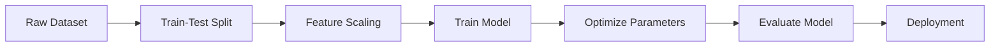
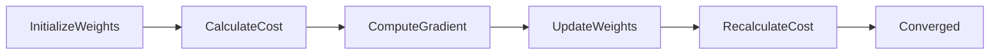

# 10. Regression Model Training and Evaluation

> Learn how regression models are trained, optimized, and evaluated using cost functions, optimization algorithms, and performance metrics to build accurate and reliable Machine Learning solutions.

---

## 🎯 Learning Objectives

After completing this chapter, you will be able to:

- Understand how regression models learn from data
- Explain the purpose of a cost function
- Understand Gradient Descent and Stochastic Gradient Descent (SGD)
- Learn the importance of learning rate
- Evaluate regression models using common performance metrics
- Build and evaluate regression models using Scikit-Learn

---

## 📖 Overview

Training a Machine Learning model involves finding the optimal parameters that minimize prediction errors.

During training, the model repeatedly adjusts its parameters, evaluates its predictions, and gradually improves until it can accurately estimate unseen data.

After training, the model must be evaluated using objective performance metrics to ensure it generalizes well beyond the training dataset.

---

## 🧠 Core Concepts

Model training consists of several stages:

- Data Preparation
- Train-Test Split
- Feature Scaling
- Model Training
- Cost Calculation
- Parameter Optimization
- Model Evaluation
- Performance Improvement

Each stage contributes to building a robust and reliable regression model.

---

## 🏗️ Model Training Pipeline



---

# 📘 Train-Test Split

A dataset should be divided into two parts:

| Dataset | Purpose |
|----------|----------|
| Training Set | Train the model |
| Test Set | Evaluate the model |

A common split is:

- Training: 80%
- Testing: 20%

Using unseen test data provides a realistic estimate of model performance.

---

# 📗 Feature Scaling

Many Machine Learning algorithms perform better when features are on a similar scale.

Common scaling techniques include:

- Standardization
- Normalization

Feature scaling helps optimization algorithms converge more efficiently.

---

## 💻 Example

=== "Python"

```python title="train_test_split.py"
from sklearn.model_selection import train_test_split

X_train, X_test, y_train, y_test = train_test_split(
    X,
    y,
    test_size=0.2,
    random_state=42
)
```

=== "StandardScaler"

```python title="feature_scaling.py"
from sklearn.preprocessing import StandardScaler

scaler = StandardScaler()

X_train = scaler.fit_transform(X_train)

X_test = scaler.transform(X_test)
```

---

# 📙 Cost Function

A Cost Function measures how far model predictions are from the actual values.

A lower cost indicates a better model.

During training, the objective is to minimize the cost function by continuously updating model parameters.

Common regression cost functions include:

- Mean Squared Error (MSE)
- Mean Absolute Error (MAE)

---

# 📉 Gradient Descent

Gradient Descent is an optimization algorithm used to minimize the cost function.

It works by repeatedly adjusting model parameters in the direction that reduces prediction error.

Training continues until the model reaches the minimum possible cost.

---

## 🏗️ Gradient Descent Workflow



---

# 📘 Stochastic Gradient Descent (SGD)

Instead of processing the entire dataset at once, Stochastic Gradient Descent updates model parameters using one training example at a time.

### Advantages

- Faster training
- Lower memory usage
- Suitable for very large datasets
- Supports online learning

---

## Gradient Descent vs Stochastic Gradient Descent

| Gradient Descent | Stochastic Gradient Descent |
|------------------|-----------------------------|
| Uses entire dataset | Uses one sample at a time |
| Slower | Faster |
| Stable convergence | Noisier updates |
| Higher memory usage | Lower memory usage |

---

# 📈 Learning Rate

The Learning Rate controls the size of each optimization step.

Choosing the right learning rate is critical.

| Learning Rate | Result |
|---------------|--------|
| Too Small | Slow convergence |
| Too Large | May overshoot the optimum |
| Appropriate | Faster and stable convergence |

---

## 🏗️ Training Process

```mermaid
flowchart TD

Initialize

↓

Predict

↓

Calculate Error

↓

Compute Gradient

↓

Update Parameters

↓

Repeat Until Convergence
```

---

# 📊 Regression Evaluation Metrics

After training, the model must be evaluated using objective metrics.

---

## Mean Absolute Error (MAE)

Measures the average absolute difference between predictions and actual values.

Characteristics:

- Easy to interpret
- Less sensitive to outliers

---

## Mean Squared Error (MSE)

Squares prediction errors before averaging.

Characteristics:

- Penalizes large errors
- Widely used for optimization

---

## Root Mean Squared Error (RMSE)

RMSE is the square root of MSE.

Characteristics:

- Same unit as target variable
- Easy to interpret
- Common business metric

---

## R² Score (Coefficient of Determination)

Measures how well the regression model explains the variance in the target variable.

Typical interpretation:

| R² Score | Interpretation |
|----------|----------------|
| 1.0 | Perfect Prediction |
| 0.9 | Excellent |
| 0.7 | Good |
| 0.5 | Moderate |
| 0.0 | Poor |

---

## 📊 Regression Metrics Comparison

| Metric | Better Value | Sensitive to Outliers |
|---------|--------------|-----------------------|
| MAE | Lower | No |
| MSE | Lower | Yes |
| RMSE | Lower | Yes |
| R² Score | Higher | No |

---

## 🌍 Real-World Example

Suppose a retailer builds a regression model to forecast monthly sales.

After training the model:

- MAE measures the average prediction error.
- RMSE highlights larger prediction mistakes.
- R² Score indicates how well sales trends are captured.

These metrics help determine whether the model is ready for production deployment.

---

## 💻 Implementation Example

=== "Python"

```python title="evaluate_regression_model.py"
from sklearn.metrics import (
    mean_absolute_error,
    mean_squared_error,
    r2_score
)

predictions = model.predict(X_test)

mae = mean_absolute_error(y_test, predictions)
mse = mean_squared_error(y_test, predictions)
rmse = mean_squared_error(y_test, predictions, squared=False)
r2 = r2_score(y_test, predictions)

print("MAE :", mae)
print("MSE :", mse)
print("RMSE:", rmse)
print("R²  :", r2)
```

=== "Complete Workflow"

```text
Collect Data

↓

Split Dataset

↓

Scale Features

↓

Train Model

↓

Optimize Parameters

↓

Evaluate Metrics

↓

Deploy Model
```

---

## 🏢 Enterprise Perspective

Enterprise Machine Learning teams rarely rely on a single evaluation metric.

Instead, they compare multiple metrics alongside business KPIs to determine whether a model is suitable for deployment.

Modern MLOps pipelines automatically:

- Train models
- Evaluate metrics
- Compare versions
- Register the best model
- Deploy approved models
- Continuously monitor production performance

---

!!! tip "Production Insight"

    Model accuracy alone is not enough.

    A production-ready regression model should balance prediction accuracy, computational efficiency, explainability, scalability, and long-term maintainability.

---

## 💡 Best Practices

- Always evaluate models using unseen test data.
- Compare multiple evaluation metrics.
- Scale features when required.
- Start with simple baseline models.
- Monitor model performance after deployment.
- Retrain models as new data becomes available.

---

## ⚠️ Common Mistakes

- Evaluating only on training data.
- Using a single evaluation metric.
- Ignoring feature scaling.
- Choosing an inappropriate learning rate.
- Deploying models without validation.

---

## 📌 Key Takeaways

- Model training is an iterative optimization process.
- Gradient Descent minimizes prediction error.
- SGD enables efficient training on large datasets.
- MAE, MSE, RMSE, and R² are essential regression metrics.
- Proper evaluation is critical before deploying regression models into production.

---

## 🎉 Module Complete

Congratulations! You have completed the **Regression** module.

You now understand:

- Regression Fundamentals
- Linear Regression
- Nonlinear Regression
- Logistic Regression
- Model Training and Optimization
- Regression Evaluation Metrics
- Production Best Practices

These concepts form the foundation for more advanced Machine Learning algorithms such as Decision Trees, Random Forests, Support Vector Machines, Ensemble Learning, and Deep Learning.

---

 ➡️ Next Chapter

*[10. Classification Fundamentals ](11-classification-fundamentals.md)*