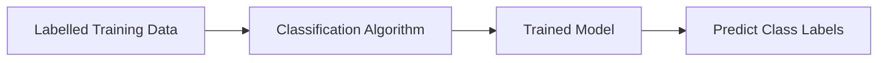
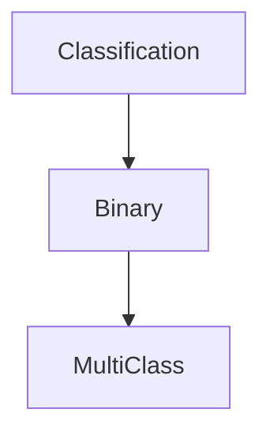
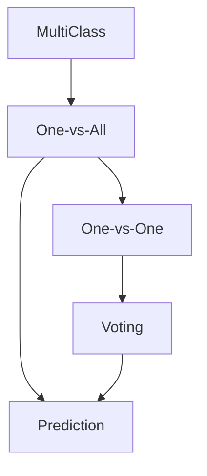

# 11. Classification Fundamentals

> Learn the fundamentals of classification in supervised Machine Learning, understand how classification models predict categorical outcomes, and explore the strategies used to solve binary and multi-class problems.

---

## 🎯 Learning Objectives

After completing this chapter, you will be able to:

- Understand what classification is
- Differentiate classification from regression
- Explain binary and multi-class classification
- Understand common classification algorithms
- Learn One-vs-All (OvA) and One-vs-One (OvO) strategies
- Identify real-world applications of classification

---

## 📖 Overview

Classification is one of the most important supervised Machine Learning tasks.

Unlike regression, which predicts continuous numerical values, classification predicts **categorical labels** or **classes**. The objective is to learn patterns from labelled historical data and assign new observations to predefined categories.

Classification powers many real-world intelligent systems, including spam filters, fraud detection, customer churn prediction, medical diagnosis, sentiment analysis, and recommendation systems.

---

## 🧠 Core Concepts

A classification model learns from labelled examples and predicts discrete categories.

Typical classification problems include:

- Spam or Not Spam
- Fraud or Genuine
- Disease or Healthy
- Customer Will Churn or Stay
- Loan Approved or Rejected

Depending on the problem, classification models may predict:

- Two classes (Binary Classification)
- Multiple classes (Multi-Class Classification)

---

## 🏗️ Classification Workflow



---

# 📘 What is Classification?

Classification is a **Supervised Learning** technique used to predict **categorical outcomes**.

The model learns the relationship between input features and class labels during training and then predicts the most likely class for unseen data.

Examples include:

- Email → Spam / Not Spam
- Patient → Disease / Healthy
- Customer → Churn / No Churn
- Transaction → Fraud / Genuine

Unlike regression, classification predicts categories instead of numerical values.

---

## 📊 Classification vs Regression

| Aspect | Classification | Regression |
|---------|----------------|------------|
| Output | Categories | Continuous Values |
| Target Variable | Categorical | Numerical |
| Example | Spam Detection | House Price Prediction |
| Goal | Predict Class | Predict Quantity |

---

# 📗 Types of Classification

## Binary Classification

Binary Classification predicts one of two possible classes.

Examples:

- Yes / No
- True / False
- Fraud / Genuine
- Approved / Rejected

---

## Multi-Class Classification

Multi-Class Classification predicts one class from multiple possible categories.

Examples:

- Species of Flower
- Drug Recommendation
- Handwritten Digit Recognition
- Product Category Classification

---

## 🏗️ Classification Types



---

# 📈 Common Classification Algorithms

Several Machine Learning algorithms are commonly used for classification.

| Algorithm | Typical Use |
|-----------|-------------|
| Logistic Regression | Binary Classification |
| Decision Trees | Classification & Regression |
| K-Nearest Neighbors (KNN) | Instance-Based Learning |
| Support Vector Machines (SVM) | Linear & Nonlinear Classification |
| Naïve Bayes | Text Classification |
| Neural Networks | Complex Classification Problems |

Each algorithm has its strengths depending on the dataset and business requirements.

---

# 📌 Multi-Class Classification Strategies

Some algorithms naturally support multiple classes, while others require additional strategies.

The two most common approaches are:

- One-vs-All (OvA)
- One-vs-One (OvO)

---

## One-vs-All (OvA)

In the One-vs-All strategy:

- One classifier is built for each class.
- Each classifier learns to distinguish one class from all remaining classes.
- The class with the highest confidence score becomes the final prediction.

Example:

For four classes:

- Class A vs Others
- Class B vs Others
- Class C vs Others
- Class D vs Others

Total classifiers = **4**

---

## One-vs-One (OvO)

In the One-vs-One strategy:

A classifier is built for every possible pair of classes.

Example:

For four classes:

- A vs B
- A vs C
- A vs D
- B vs C
- B vs D
- C vs D

The final prediction is determined through majority voting.

---

## 📊 OvA vs OvO

| Feature | One-vs-All (OvA) | One-vs-One (OvO) |
|----------|------------------|------------------|
| Number of Models | One per class | One per pair of classes |
| Complexity | Lower | Higher |
| Prediction | Highest Confidence | Majority Voting |
| Scalability | Better for many classes | Better for fewer classes |
| Common Usage | Logistic Regression | Support Vector Machines |

---

## 🏗️ Multi-Class Classification



---

## 🌍 Real-World Applications

Classification is used across numerous industries.

| Industry | Example Application |
|----------|---------------------|
| Banking | Loan Default Prediction |
| Finance | Fraud Detection |
| Healthcare | Disease Diagnosis |
| Retail | Customer Segmentation |
| Telecommunications | Customer Churn Prediction |
| Marketing | Campaign Response Prediction |
| Cybersecurity | Intrusion Detection |
| Email | Spam Filtering |

---

## 🏥 Case Study

### Medical Drug Recommendation

A hospital wants to recommend the most suitable medication for a patient.

Input Features:

- Age
- Gender
- Blood Pressure
- Cholesterol Level

↓

Classification Model

↓

Recommended Drug

The model predicts the most appropriate medication based on historical patient data.

---

## 💻 Implementation Example

=== "Python"

```python title="classification_example.py"
from sklearn.linear_model import LogisticRegression

model = LogisticRegression()

model.fit(X_train, y_train)

predictions = model.predict(X_test)
```

=== "Prediction"

```text
Patient Information

↓

Classification Model

↓

Predicted Drug
```

---

## 🏢 Enterprise Perspective

Classification models form the foundation of many enterprise AI systems.

Organizations use classification to:

- Detect fraud
- Identify high-risk customers
- Recommend products
- Classify support tickets
- Automate medical diagnosis
- Detect cybersecurity threats

Selecting the appropriate classification algorithm depends on factors such as dataset size, interpretability, prediction speed, scalability, and business objectives.

---

!!! tip "Production Insight"

    Begin with simple and interpretable classification models such as Logistic Regression or Decision Trees.

    More complex algorithms should only be introduced when they provide measurable improvements in business outcomes.

---

## 💡 Best Practices

- Clearly define class labels.
- Ensure high-quality labelled training data.
- Handle class imbalance appropriately.
- Evaluate models using multiple performance metrics.
- Select algorithms based on business requirements rather than complexity.

---

## ⚠️ Common Mistakes

- Treating classification problems as regression problems.
- Using insufficient labelled data.
- Ignoring class imbalance.
- Evaluating models using only accuracy.
- Choosing complex algorithms without a performance benefit.

---

## 📌 Key Takeaways

- Classification predicts categorical labels.
- It is a supervised Machine Learning technique.
- Problems may be binary or multi-class.
- OvA and OvO enable multi-class classification.
- Classification powers many production AI systems across industries.

---

## 📚 Further Reading

The next chapter explores **Decision Trees**, one of the most interpretable Machine Learning algorithms used for both classification and regression.

---

## ➡️ Next Chapter

*[12. Decision Trees](12-decision-trees.md)*