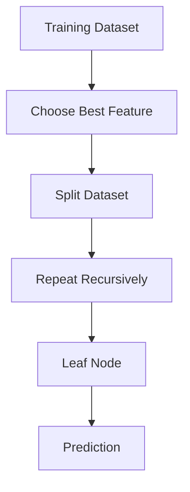
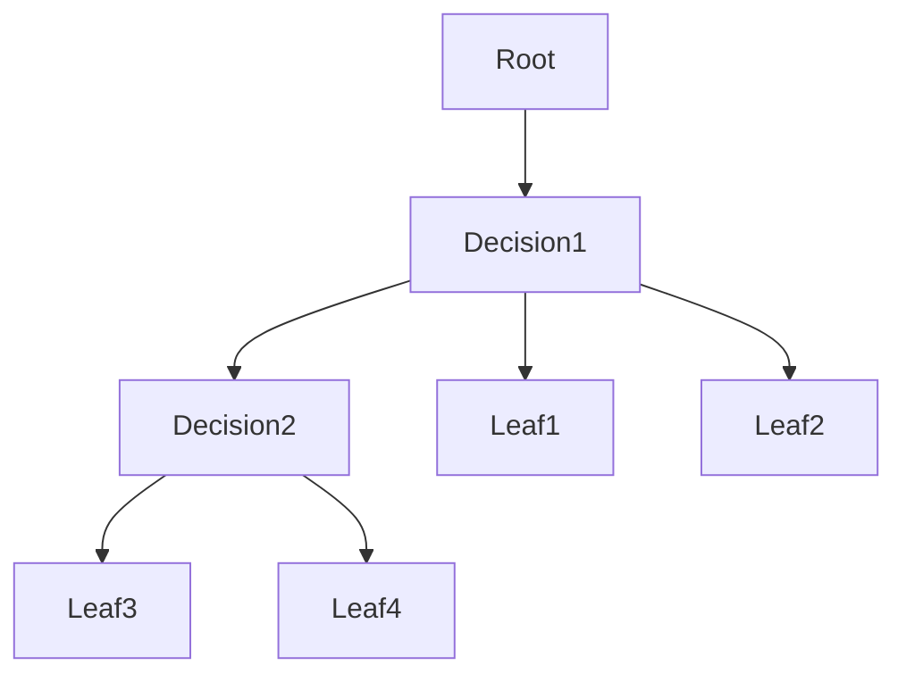
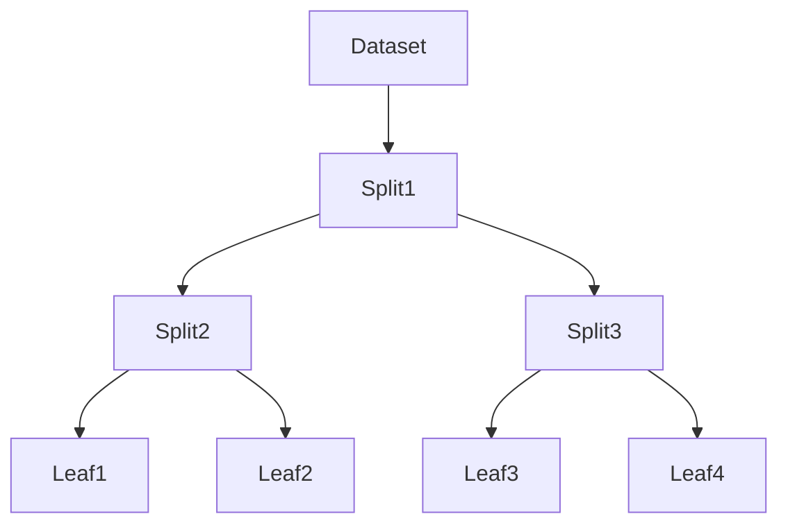
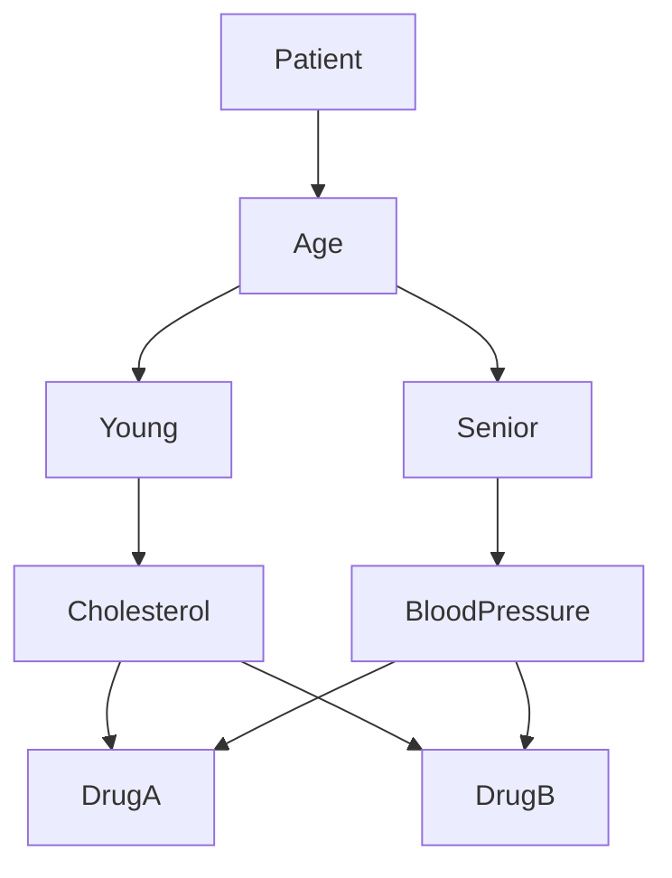
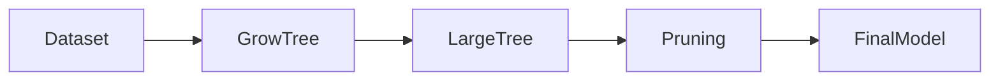

# 12. Decision Trees

> Learn how Decision Trees classify data by recursively splitting datasets into smaller, purer groups, making them one of the most interpretable and widely used Machine Learning algorithms.

---

## 🎯 Learning Objectives

After completing this chapter, you will be able to:

- Understand how Decision Trees work
- Learn the structure of a Decision Tree
- Explain recursive partitioning
- Understand Entropy, Information Gain, and Gini Impurity
- Learn how pruning prevents overfitting
- Build Decision Tree models using Scikit-Learn

---

## 📖 Overview

Decision Trees are among the most intuitive Machine Learning algorithms.

They make predictions by repeatedly splitting data into smaller subsets based on feature values until a final decision is reached. The resulting model resembles a flowchart, making it highly interpretable for both technical and business users.

Decision Trees can solve both **classification** and **regression** problems and form the foundation of powerful ensemble algorithms such as Random Forests and Gradient Boosting.

---

## 🧠 Core Concepts

A Decision Tree consists of three main components:

- Root Node
- Decision (Internal) Nodes
- Leaf Nodes

The model learns by selecting the best feature at each step to divide the data into increasingly homogeneous groups.

---

## 🏗️ Decision Tree Workflow



---

# 📘 Decision Tree Structure

A Decision Tree is organized as a hierarchy.

### Root Node

The starting point containing the complete dataset.

---

### Decision Node

Represents a test performed on a feature.

Each decision creates one or more branches.

---

### Branch

Represents the outcome of a feature test.

Each branch leads to another decision or a final prediction.

---

### Leaf Node

The terminal node that produces the final prediction.

For classification:

- Predicts a class label

For regression:

- Predicts a numerical value

---

## 🏗️ Decision Tree Components



---

# 📗 Building a Decision Tree

Decision Trees are constructed recursively.

The algorithm performs the following steps:

1. Start with the entire dataset.
2. Evaluate every available feature.
3. Select the feature that best separates the data.
4. Split the dataset.
5. Repeat the process for each child node.
6. Stop when a stopping criterion is satisfied.

This recursive process is known as **Recursive Partitioning**.

---

## 📊 Recursive Partitioning



---

# 📈 Selecting the Best Split

The success of a Decision Tree depends on selecting the most informative feature at every split.

Common splitting criteria include:

- Entropy
- Information Gain
- Gini Impurity

These measures quantify how well a feature separates different classes.

---

## Entropy

Entropy measures the amount of uncertainty or randomness in a dataset.

- High entropy indicates mixed classes.
- Low entropy indicates pure classes.

The objective is to reduce entropy after each split.

---

## Information Gain

Information Gain measures the reduction in entropy after splitting the data.

A feature with higher Information Gain produces a better split.

The algorithm selects the feature with the highest Information Gain.

---

## Gini Impurity

Gini Impurity measures the probability that a randomly selected observation would be incorrectly classified.

Lower Gini values indicate purer nodes.

Many Decision Tree implementations, including Scikit-Learn, use Gini Impurity as the default splitting criterion.

---

## 📊 Split Criteria Comparison

| Criterion | Measures | Better Value | Common Usage |
|-----------|----------|--------------|--------------|
| Entropy | Uncertainty | Lower | ID3 |
| Information Gain | Reduction in Entropy | Higher | ID3 |
| Gini Impurity | Misclassification Probability | Lower | CART (Scikit-Learn) |

---

## 🌍 Real-World Example

A hospital wants to recommend the most appropriate medication for a patient.

Available features:

- Age
- Blood Pressure
- Cholesterol
- Gender

The Decision Tree may first split patients by age, then blood pressure, and finally cholesterol level before recommending the appropriate drug.

This produces a clear and explainable prediction process.

---

## 🏥 Example Decision Tree



---

# 📌 Stopping Criteria

Tree growth stops when one or more conditions are met.

Common stopping criteria include:

- Maximum tree depth reached
- Minimum number of samples in a node
- Maximum number of leaf nodes reached
- No significant improvement after splitting
- All samples belong to the same class

Stopping criteria help prevent unnecessarily complex trees.

---

# ✂️ Pruning

Large Decision Trees often memorize the training data instead of learning general patterns.

Pruning removes unnecessary branches to simplify the model.

Benefits include:

- Reduced overfitting
- Better generalization
- Improved interpretability
- Faster predictions

Pruning creates smaller and more robust Decision Trees.

---

## 🏗️ Training Process



---

## 💻 Implementation Example

=== "Python"

```python title="decision_tree_classifier.py"
from sklearn.tree import DecisionTreeClassifier

model = DecisionTreeClassifier(
    criterion="gini",
    max_depth=5,
    random_state=42
)

model.fit(X_train, y_train)

predictions = model.predict(X_test)
```

=== "Visual Workflow"

```text
Training Data

↓

Decision Tree

↓

Recursive Splits

↓

Leaf Nodes

↓

Prediction
```

---

## 🏢 Enterprise Perspective

Decision Trees are widely used because they produce transparent and explainable decisions.

Common enterprise applications include:

- Credit approval
- Fraud detection
- Medical diagnosis
- Customer segmentation
- Risk assessment
- Insurance claim prediction

They are also the foundation of modern ensemble algorithms such as Random Forest and Gradient Boosting, which significantly improve predictive performance.

---

!!! tip "Production Insight"

    Decision Trees are among the most explainable Machine Learning models.

    In regulated industries such as healthcare, banking, and insurance, their transparency makes them valuable for explaining predictions to stakeholders and auditors.

---

## 💡 Best Practices

- Limit tree depth to reduce overfitting.
- Use pruning to improve generalization.
- Compare Gini Impurity and Entropy when appropriate.
- Validate the model using unseen data.
- Consider ensemble methods for improved accuracy.

---

## ⚠️ Common Mistakes

- Growing excessively deep trees.
- Ignoring overfitting.
- Using too many irrelevant features.
- Evaluating performance only on training data.
- Assuming Decision Trees always outperform simpler models.

---

## 📌 Key Takeaways

- Decision Trees classify data using recursive feature-based splits.
- Root, decision, and leaf nodes form the tree structure.
- Entropy, Information Gain, and Gini Impurity determine the best splits.
- Pruning improves model generalization.
- Decision Trees are highly interpretable and widely used in enterprise AI systems.

---

## 📚 Further Reading

The next chapter introduces **Regression Trees**, which extend the Decision Tree concept to predict continuous numerical values instead of categorical classes.

---

## ➡️ Next Chapter

*[13. Regression Trees](13-regression-trees.md)*