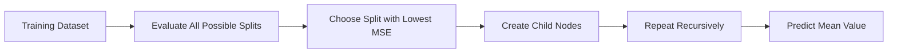
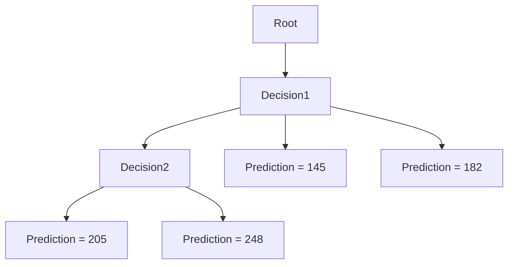
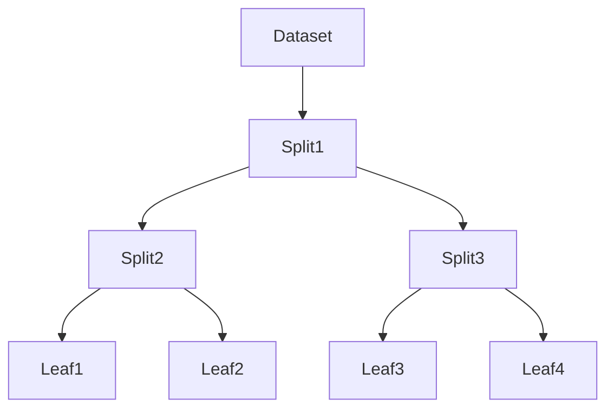
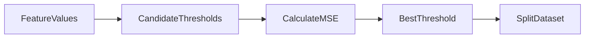

# 13. Regression Trees

> Learn how Regression Trees extend Decision Trees to predict continuous numerical values by recursively splitting data to minimize prediction error.

---

## 🎯 Learning Objectives

After completing this chapter, you will be able to:

- Understand what Regression Trees are
- Differentiate Regression Trees from Classification Trees
- Learn how Regression Trees make predictions
- Understand Mean Squared Error (MSE) as a splitting criterion
- Learn how split thresholds are selected
- Build Regression Tree models using Scikit-Learn

---

## 📖 Overview

While Decision Trees can solve both classification and regression problems, the way they make predictions differs significantly.

Classification Trees predict **categorical labels**, whereas Regression Trees predict **continuous numerical values**.

Instead of assigning a class label at each leaf node, a Regression Tree predicts the **average value of the training samples** that reach that leaf. The objective is to recursively partition the dataset into increasingly homogeneous regions by minimizing prediction error.

Regression Trees are widely used for forecasting, pricing, demand prediction, energy consumption estimation, and other continuous prediction tasks.

---

## 🧠 Core Concepts

Regression Trees:

- Predict continuous values
- Use recursive partitioning
- Split data to minimize prediction error
- Use **Mean Squared Error (MSE)** as the primary splitting criterion
- Predict the average target value at each leaf node

---

## 🏗️ Regression Tree Workflow



---

# 📘 Regression Tree Structure

Regression Trees have the same structure as Decision Trees.

- Root Node
- Decision Nodes
- Branches
- Leaf Nodes

The key difference lies in the prediction.

Classification Tree

↓

Leaf predicts a class.

Regression Tree

↓

Leaf predicts a numerical value.

---

## 🏗️ Regression Tree Components



---

# 📊 Classification Tree vs Regression Tree

| Aspect | Classification Tree | Regression Tree |
|---------|---------------------|-----------------|
| Target Variable | Categorical | Continuous |
| Prediction | Class Label | Numerical Value |
| Leaf Node Output | Majority Class | Mean Target Value |
| Split Criterion | Entropy / Gini | Mean Squared Error |
| Typical Use | Spam Detection | House Price Prediction |

---

# 📈 How Regression Trees Work

The algorithm repeatedly searches for the feature and threshold that produce the lowest prediction error.

Each split divides the dataset into smaller groups with similar target values.

This recursive process continues until one of the stopping criteria is satisfied.

The final prediction equals the **average target value** of the observations contained within the leaf node.

---

## 🏗️ Recursive Splitting



---

# 📉 Mean Squared Error (MSE)

Regression Trees evaluate split quality using **Mean Squared Error (MSE)**.

MSE measures how close the predicted values are to the actual observations.

A lower MSE indicates a better split.

During training, the algorithm evaluates many possible splits and selects the one that minimizes the weighted MSE of the resulting child nodes.

---

## 📊 Choosing the Best Split

For continuous features, the algorithm:

1. Sorts the feature values.
2. Generates candidate thresholds.
3. Splits the data at each threshold.
4. Calculates the weighted MSE.
5. Selects the threshold with the lowest prediction error.

---

## 🏗️ Threshold Selection



---

# 📌 Stopping Criteria

Tree growth stops when one or more conditions are met.

Common stopping criteria include:

- Maximum tree depth reached
- Minimum number of samples in a node
- Minimum number of samples in a leaf
- No meaningful reduction in MSE
- Maximum number of leaf nodes reached

Stopping criteria prevent excessively complex trees.

---

## 🌍 Real-World Applications

Regression Trees are widely used across industries.

| Industry | Example Application |
|----------|---------------------|
| Real Estate | House Price Prediction |
| Banking | Revenue Forecasting |
| Retail | Demand Forecasting |
| Manufacturing | Predictive Maintenance |
| Energy | Electricity Consumption Forecasting |
| Agriculture | Crop Yield Prediction |
| Insurance | Claim Cost Estimation |
| Environmental Science | Temperature & Rainfall Prediction |

---

## 🏠 Case Study

### House Price Prediction

A real estate company wants to estimate property prices.

Input Features:

- Area
- Bedrooms
- Location
- Age of Property
- Parking Spaces

↓

Regression Tree

↓

Predicted House Price

Each leaf node stores the average price of similar properties, allowing the model to estimate prices for new homes.

---

## 💻 Implementation Example

=== "Python"

```python title="regression_tree.py"
from sklearn.tree import DecisionTreeRegressor

model = DecisionTreeRegressor(
    max_depth=5,
    random_state=42
)

model.fit(X_train, y_train)

predictions = model.predict(X_test)
```

=== "Prediction Workflow"

```text
Training Data

↓

Regression Tree

↓

Recursive Splits

↓

Leaf Node

↓

Average Target Value

↓

Prediction
```

---

## 🏢 Enterprise Perspective

Regression Trees are powerful because they naturally capture nonlinear relationships without requiring explicit mathematical equations.

They are widely used in:

- Financial forecasting
- Dynamic pricing
- Demand planning
- Capacity forecasting
- Resource optimization
- Predictive analytics

Regression Trees also serve as the foundation for modern ensemble algorithms such as **Random Forest Regressors**, **Gradient Boosting Regressors**, and **XGBoost**, which significantly improve prediction accuracy.

---

!!! tip "Production Insight"

    Regression Trees are excellent at modeling complex nonlinear relationships without requiring assumptions about the underlying data distribution.

    However, a single Regression Tree may overfit the training data. In production systems, ensemble methods such as Random Forests and Gradient Boosting are often preferred for improved stability and predictive performance.

---

## 💡 Best Practices

- Tune tree depth to reduce overfitting.
- Use cross-validation during model selection.
- Compare Regression Trees with Linear Regression as a baseline.
- Monitor prediction error using multiple evaluation metrics.
- Consider ensemble methods for higher accuracy.

---

## ⚠️ Common Mistakes

- Growing trees that are too deep.
- Ignoring overfitting.
- Using too few training samples.
- Evaluating models only on training data.
- Assuming Regression Trees always outperform simpler models.

---

## 📌 Key Takeaways

- Regression Trees predict continuous numerical values.
- Leaf nodes store the average target value.
- Splits are selected by minimizing Mean Squared Error.
- Recursive partitioning continues until stopping criteria are met.
- Regression Trees capture nonlinear relationships without requiring explicit equations.
- They form the foundation of many modern ensemble learning algorithms.

---

## 📚 Further Reading

The next chapter introduces **Support Vector Machines (SVMs)**, powerful supervised learning algorithms capable of solving both classification and regression problems using maximum-margin decision boundaries.

---

## ➡️ Next Chapter

*[14. Support Vector Machines](14-support-vector-machines.md)*