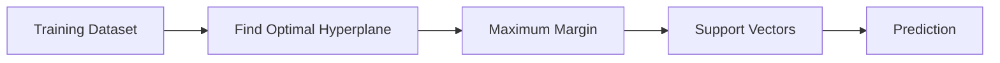
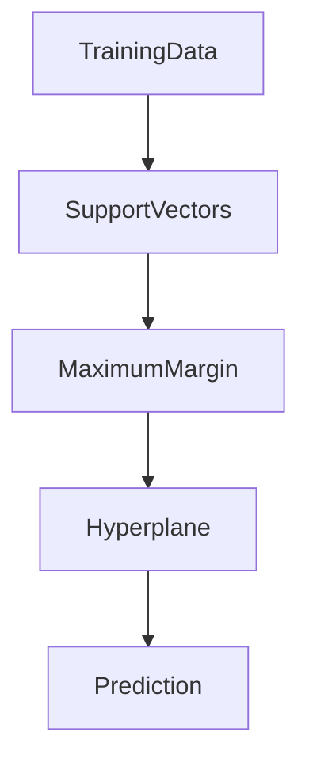

# 14. Support Vector Machines (SVM)

> Learn how Support Vector Machines (SVMs) classify data by finding the optimal decision boundary with the maximum margin, making them one of the most powerful supervised learning algorithms for both classification and regression.

---

## 🎯 Learning Objectives

After completing this chapter, you will be able to:

- Understand how Support Vector Machines work
- Explain hyperplanes, margins, and support vectors
- Differentiate linear and nonlinear SVMs
- Understand the Kernel Trick
- Learn Soft Margin and the C parameter
- Build SVM models using Scikit-Learn

---

## 📖 Overview

Support Vector Machines (SVMs) are powerful supervised Machine Learning algorithms used for both **classification** and **regression** tasks.

The primary objective of an SVM is to identify the **optimal decision boundary (hyperplane)** that separates different classes while maximizing the distance between the boundary and the nearest training samples.

Unlike many traditional algorithms, SVMs remain highly effective in high-dimensional datasets and can solve both linear and nonlinear classification problems using kernel functions.

---

## 🧠 Core Concepts

Support Vector Machines are built around several key concepts:

- Hyperplane
- Margin
- Support Vectors
- Soft Margin
- Kernel Functions

Together, these concepts allow SVMs to build highly accurate decision boundaries.

---

## 🏗️ SVM Workflow



---

# 📘 What is a Hyperplane?

A **hyperplane** is the decision boundary that separates different classes.

For:

- Two-dimensional data → Line
- Three-dimensional data → Plane
- Higher-dimensional data → Hyperplane

The objective is to position the hyperplane so that it best separates the classes.

---

## 📈 Margin

The **margin** is the distance between the hyperplane and the nearest training samples from each class.

A larger margin generally results in better model generalization.

SVM always seeks the **maximum-margin hyperplane**.

---

## 📍 Support Vectors

Support Vectors are the training samples closest to the decision boundary.

They are the most influential observations because they determine the position of the hyperplane.

Removing other points often has little effect, whereas changing support vectors directly changes the model.

---

## 🏗️ SVM Decision Boundary



---

# 📊 Linear vs Nonlinear SVM

Not all datasets can be separated using a straight line.

Linear SVM works well when the classes are linearly separable.

For more complex datasets, SVM uses **kernel functions** to transform the data into a higher-dimensional space where separation becomes possible.

| Aspect | Linear SVM | Nonlinear SVM |
|---------|------------|---------------|
| Data Pattern | Linear | Nonlinear |
| Hyperplane | Straight | Higher-dimensional |
| Kernel Required | No | Yes |
| Complexity | Lower | Higher |

---

# 📗 Kernel Trick

The **Kernel Trick** enables SVM to solve nonlinear problems without explicitly transforming the data into higher dimensions.

Instead, kernel functions compute similarities between observations efficiently.

Common kernels include:

- Linear Kernel
- Polynomial Kernel
- Radial Basis Function (RBF)
- Sigmoid Kernel

Kernel selection significantly influences model performance.

---

## 📊 Common Kernel Functions

| Kernel | Typical Use Case |
|---------|------------------|
| Linear | Large linear datasets |
| Polynomial | Curved decision boundaries |
| RBF | General-purpose nonlinear problems |
| Sigmoid | Neural network-like behavior |

---

# 📌 Soft Margin

Real-world datasets often contain noise and overlapping classes.

Instead of requiring perfect separation, SVM introduces a **Soft Margin**.

The **C parameter** controls the trade-off between:

- Maximizing the margin
- Minimizing classification errors

| C Value | Model Behavior |
|----------|----------------|
| Small | Larger margin, allows more misclassifications |
| Large | Smaller margin, fewer training errors |

Choosing an appropriate C value helps balance underfitting and overfitting.

---

## 🌍 Real-World Applications

Support Vector Machines are widely used across industries.

| Industry | Example Application |
|----------|---------------------|
| Healthcare | Disease Diagnosis |
| Banking | Fraud Detection |
| Finance | Credit Risk Classification |
| Cybersecurity | Intrusion Detection |
| Retail | Customer Segmentation |
| NLP | Sentiment Analysis |
| Computer Vision | Image Classification |
| Manufacturing | Defect Detection |

---

## 🏥 Case Study

### Email Spam Detection

An organization wants to automatically classify incoming emails.

Input Features:

- Word Frequency
- Email Length
- Number of Links
- Sender Reputation

↓

Support Vector Machine

↓

Spam / Not Spam

The SVM identifies the optimal decision boundary that separates spam emails from legitimate messages with maximum margin.

---

## 💻 Implementation Example

=== "Python"

```python title="support_vector_machine.py"
from sklearn.svm import SVC

model = SVC(
    kernel="rbf",
    C=1.0,
    gamma="scale"
)

model.fit(X_train, y_train)

predictions = model.predict(X_test)
```

=== "Linear SVM"

```python title="linear_svm.py"
from sklearn.svm import LinearSVC

model = LinearSVC()

model.fit(X_train, y_train)

predictions = model.predict(X_test)
```

---

## 📊 Support Vector Regression (SVR)

Although primarily known for classification, SVM can also solve regression problems.

Support Vector Regression (SVR):

- Predicts continuous values
- Uses an **epsilon (ε) margin** to ignore small prediction errors
- Works well for nonlinear regression problems

Typical applications include:

- Stock price prediction
- Demand forecasting
- Energy consumption estimation

---

## 🏢 Enterprise Perspective

Support Vector Machines are particularly effective when:

- The dataset has many features
- Clear class separation exists
- High prediction accuracy is required
- The dataset is relatively small or medium-sized

However, for extremely large datasets, training time and computational cost may become significant.

Modern production systems often compare SVM with Decision Trees, Random Forests, Gradient Boosting, and Neural Networks before selecting the final model.

---

!!! tip "Production Insight"

    SVMs often deliver excellent accuracy on structured datasets with moderate sample sizes and high-dimensional features.

    For very large datasets, tree-based ensemble methods or deep learning models may provide better scalability and faster training.

---

## 💡 Best Practices

- Scale numerical features before training.
- Experiment with different kernel functions.
- Tune the C parameter using cross-validation.
- Compare SVM with simpler baseline models.
- Monitor model performance using multiple evaluation metrics.

---

## ⚠️ Common Mistakes

- Forgetting feature scaling.
- Choosing an inappropriate kernel.
- Using a very large C value, leading to overfitting.
- Applying SVM to extremely large datasets without considering computational cost.
- Ignoring hyperparameter tuning.

---

## 📌 Key Takeaways

- SVM finds the optimal hyperplane with the maximum margin.
- Support Vectors define the decision boundary.
- Kernel functions enable nonlinear classification.
- Soft Margin balances classification accuracy and generalization.
- SVM supports both classification and regression.
- It is widely used in production systems requiring robust and accurate classification.

---

## 📚 Further Reading

The next chapter introduces **K-Nearest Neighbors (K-NN)**, a simple yet powerful instance-based learning algorithm that classifies data based on the nearest labeled examples.

---

## ➡️ Next Chapter

*[15. K-Nearest Neighbors](15-k-nearest-neighbors.md)*