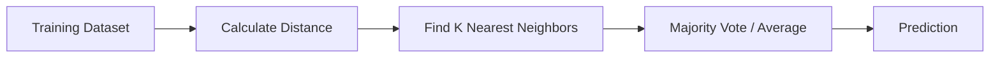

# 15. K-Nearest Neighbors (K-NN)

> Learn how the K-Nearest Neighbors (K-NN) algorithm makes predictions by finding the most similar data points, making it one of the simplest yet highly effective supervised Machine Learning algorithms.

---

## 🎯 Learning Objectives

After completing this chapter, you will be able to:

- Understand how the K-NN algorithm works
- Explain the concept of nearest neighbors
- Learn distance-based classification and regression
- Understand the impact of choosing K
- Learn why feature scaling is essential for K-NN
- Build K-NN models using Scikit-Learn

---

## 📖 Overview

K-Nearest Neighbors (K-NN) is one of the simplest supervised Machine Learning algorithms used for both **classification** and **regression**.

Unlike many Machine Learning algorithms that build an explicit mathematical model during training, K-NN stores the training data and performs learning only when predictions are required.

For every new observation, K-NN identifies the **K closest training samples** and makes predictions based on their labels or values.

---

## 🧠 Core Concepts

K-NN is based on one simple assumption:

> Similar data points are likely to belong to the same class or have similar target values.

The prediction process involves:

- Measuring distances
- Finding nearest neighbors
- Combining neighbor information
- Making the final prediction

---

## 🏗️ K-NN Workflow



---

# 📘 How K-NN Works

The K-NN algorithm follows four simple steps.

### Step 1

Choose the value of **K**.

---

### Step 2

Calculate the distance between the new observation and every training sample.

---

### Step 3

Select the **K nearest neighbors**.

---

### Step 4

Make the prediction.

For:

- Classification → Majority Vote
- Regression → Average (or Median) Value

---

## 🏗️ Prediction Process

```mermaid
flowchart TD

New Sample

--> Distance Calculation

--> Sort Neighbors

--> Select Top K

--> Prediction
```

---

# 📊 Classification vs Regression

K-NN supports both supervised learning tasks.

| Task | Prediction Method |
|------|-------------------|
| Classification | Majority Vote |
| Regression | Average / Median Value |

---

# 📏 Distance Metrics

Distance determines which observations are considered neighbors.

Common distance metrics include:

- Euclidean Distance
- Manhattan Distance
- Minkowski Distance

Among these, **Euclidean Distance** is the most commonly used.

The closer two observations are, the more similar they are considered.

---

## 📊 Common Distance Metrics

| Metric | Typical Use |
|---------|-------------|
| Euclidean | Continuous Features |
| Manhattan | Grid-like Data |
| Minkowski | Generalized Distance |

---

# 📌 Choosing the Value of K

The value of **K** greatly influences model performance.

### Small K

- Sensitive to noise
- Complex decision boundaries
- Higher risk of overfitting

---

### Large K

- Smoother decision boundaries
- More generalized predictions
- Higher risk of underfitting

Choosing an appropriate K usually requires experimentation and validation.

---

## 📊 Small K vs Large K

| Small K | Large K |
|----------|----------|
| More Complex | Simpler |
| High Variance | High Bias |
| May Overfit | May Underfit |
| Sensitive to Noise | More Stable |

---

# 📈 Feature Scaling

Because K-NN relies on distance calculations, feature scaling is extremely important.

If one feature has much larger numerical values than another, it may dominate the distance calculation.

Common scaling techniques include:

- Standardization
- Normalization

Feature scaling ensures every feature contributes fairly to the prediction.

---

## 🌍 Real-World Applications

K-NN is widely used across many industries.

| Industry | Example Application |
|----------|---------------------|
| Healthcare | Disease Diagnosis |
| Banking | Credit Risk Classification |
| Retail | Product Recommendation |
| Telecommunications | Customer Segmentation |
| Marketing | Customer Classification |
| Manufacturing | Quality Inspection |
| Computer Vision | Image Classification |
| Agriculture | Crop Classification |

---

## 🌸 Case Study

### Iris Flower Classification

Suppose we want to classify a flower species.

Input Features:

- Sepal Length
- Sepal Width
- Petal Length
- Petal Width

↓

K-NN

↓

Nearest Flower Samples

↓

Predicted Species

The new flower is assigned the same species as the majority of its nearest neighbors.

---

## 💻 Implementation Example

=== "Python"

```python title="knn_classifier.py"
from sklearn.neighbors import KNeighborsClassifier

model = KNeighborsClassifier(
    n_neighbors=5
)

model.fit(X_train, y_train)

predictions = model.predict(X_test)
```

=== "Feature Scaling"

```python title="knn_scaling.py"
from sklearn.preprocessing import StandardScaler

scaler = StandardScaler()

X_train = scaler.fit_transform(X_train)

X_test = scaler.transform(X_test)
```

---

## 📊 Weighted K-NN

Standard K-NN gives equal importance to every neighbor.

Weighted K-NN assigns higher importance to closer neighbors.

Advantages include:

- Better handling of class imbalance
- Improved prediction accuracy
- Reduced influence of distant observations

Weighted K-NN is often preferred in production systems.

---

## 🏢 Enterprise Perspective

K-NN performs well when:

- The dataset is relatively small
- Decision boundaries are complex
- Model interpretability is important

However, because K-NN compares every new observation with the training dataset, prediction becomes slower as the dataset grows.

Large enterprise applications often replace K-NN with algorithms that scale more efficiently, such as Decision Trees, Random Forests, or Gradient Boosting.

---

!!! tip "Production Insight"

    K-NN has virtually no training cost but a relatively high prediction cost.

    It is an excellent baseline algorithm for small and medium-sized datasets, but production systems with millions of records often require more scalable alternatives.

---

## 💡 Best Practices

- Scale numerical features before training.
- Choose the value of K using cross-validation.
- Remove irrelevant features.
- Consider Weighted K-NN for imbalanced datasets.
- Compare K-NN with tree-based algorithms for large datasets.

---

## ⚠️ Common Mistakes

- Forgetting feature scaling.
- Choosing K without validation.
- Using irrelevant features.
- Applying K-NN to very large datasets.
- Ignoring class imbalance.

---

## 📌 Key Takeaways

- K-NN is a supervised learning algorithm for classification and regression.
- Predictions are based on the nearest training samples.
- The choice of K significantly impacts performance.
- Feature scaling is essential for accurate distance calculations.
- Weighted K-NN improves predictions by giving more importance to closer neighbors.
- K-NN is simple, intuitive, and widely used as a baseline model.

---

## 📚 Further Reading

The next chapter explores **Classification Model Evaluation**, including the Confusion Matrix, Accuracy, Precision, Recall, F1 Score, ROC Curve, and AUC for measuring classification performance.

---

## ➡️ Next Chapter

*[16. Classification Model Evaluation](16-classification-model-evaluation.md)*