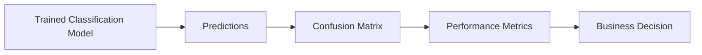
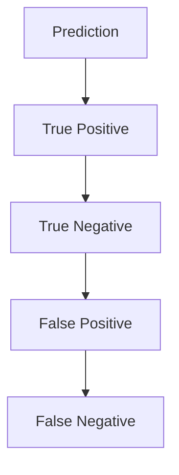
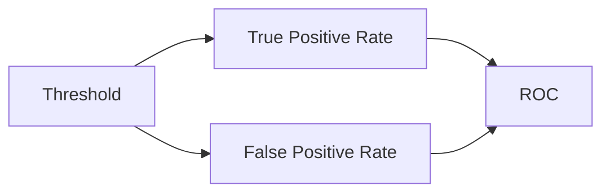

# 16. Classification Model Evaluation

> Learn how to evaluate classification models using industry-standard performance metrics and understand when to use each metric for building reliable and production-ready Machine Learning systems.

---

## 🎯 Learning Objectives

After completing this chapter, you will be able to:

- Understand why model evaluation is important
- Build and interpret a Confusion Matrix
- Calculate Accuracy, Precision, Recall, and F1 Score
- Understand ROC Curves and AUC
- Select appropriate evaluation metrics for different business problems
- Evaluate classification models using Scikit-Learn

---

## 📖 Overview

Building an accurate classification model is only half of the Machine Learning workflow.

The other half is determining **how well the model performs** on unseen data.

Different evaluation metrics measure different aspects of model performance. While accuracy is the most common metric, it is not always the most appropriate—especially for imbalanced datasets.

Choosing the right evaluation metric ensures that a model meets both technical requirements and business objectives.

---

## 🧠 Core Concepts

Classification model evaluation helps answer questions such as:

- How often does the model make correct predictions?
- How many positive predictions are actually correct?
- How many positive cases does the model successfully detect?
- Does the model generalize well to unseen data?

Common evaluation metrics include:

- Confusion Matrix
- Accuracy
- Precision
- Recall
- F1 Score
- ROC Curve
- AUC (Area Under the Curve)

---

## 🏗️ Model Evaluation Workflow



---

# 📘 Confusion Matrix

A **Confusion Matrix** summarizes the predictions made by a classification model.

It compares predicted labels with actual labels.

---

## Confusion Matrix Structure

| | Predicted Positive | Predicted Negative |
|---|---:|---:|
| **Actual Positive** | True Positive (TP) | False Negative (FN) |
| **Actual Negative** | False Positive (FP) | True Negative (TN) |

---

## Understanding the Terms

### True Positive (TP)

The model correctly predicts the positive class.

Example:

Patient has a disease.

↓

Model predicts **Disease**.

---

### True Negative (TN)

The model correctly predicts the negative class.

---

### False Positive (FP)

The model predicts positive when the actual class is negative.

Also called:

**Type I Error**

---

### False Negative (FN)

The model predicts negative when the actual class is positive.

Also called:

**Type II Error**

---

## 🏗️ Classification Outcomes



---

# 📊 Accuracy

Accuracy measures the percentage of correct predictions.

It is one of the simplest evaluation metrics.

Accuracy works well when the dataset is balanced.

=== "Formula"

\[
Accuracy=\frac{TP+TN}{TP+TN+FP+FN}
\]

=== "Interpretation"

Higher accuracy indicates more correct predictions overall.

---

# 📈 Precision

Precision measures how many predicted positive observations are actually positive.

Precision is important when **False Positives are expensive**.

Examples:

- Spam Detection
- Fraud Detection
- Medical Screening

=== "Formula"

\[
Precision=\frac{TP}{TP+FP}
\]

---

# 📉 Recall (Sensitivity)

Recall measures how many actual positive observations are correctly identified.

Recall is important when **False Negatives are costly**.

Examples:

- Disease Diagnosis
- Cancer Detection
- Fraud Detection

=== "Formula"

\[
Recall=\frac{TP}{TP+FN}
\]

---

# 📌 F1 Score

The F1 Score combines Precision and Recall into a single metric.

It is useful when both False Positives and False Negatives matter.

=== "Formula"

\[
F1=2\times\frac{Precision\times Recall}{Precision+Recall}
\]

---

## 📊 Metric Comparison

| Metric | Best Used When |
|---------|----------------|
| Accuracy | Balanced datasets |
| Precision | False Positives are costly |
| Recall | False Negatives are costly |
| F1 Score | Precision and Recall are equally important |

---

# 📈 ROC Curve

The **Receiver Operating Characteristic (ROC)** Curve evaluates a classifier across different decision thresholds.

It compares:

- True Positive Rate (Recall)
- False Positive Rate

A better classifier produces a curve closer to the top-left corner.

---

## 📊 ROC Curve



---

# 📘 Area Under the Curve (AUC)

AUC measures the classifier's ability to distinguish between classes.

Typical interpretation:

| AUC | Performance |
|-----|-------------|
| 1.0 | Excellent |
| 0.9 | Very Good |
| 0.8 | Good |
| 0.7 | Fair |
| 0.5 | Random Guess |

Higher AUC values indicate better classification performance.

---

## 🌍 Real-World Applications

| Industry | Important Metric |
|----------|------------------|
| Healthcare | Recall |
| Banking | Precision |
| Fraud Detection | Precision & Recall |
| Email Filtering | Precision |
| Customer Churn | Recall |
| Marketing | F1 Score |

Different business problems prioritize different evaluation metrics.

---

## 🏥 Case Study

### Credit Card Fraud Detection

Suppose a bank builds a fraud detection model.

Possible outcomes:

- High Accuracy but low Recall → Many fraudulent transactions are missed.
- High Recall but low Precision → Many genuine transactions are incorrectly blocked.

The bank therefore evaluates:

- Precision
- Recall
- F1 Score
- ROC-AUC

rather than relying only on Accuracy.

---

## 💻 Implementation Example

=== "Python"

```python title="classification_metrics.py"
from sklearn.metrics import (
    confusion_matrix,
    accuracy_score,
    precision_score,
    recall_score,
    f1_score,
    roc_auc_score
)

predictions = model.predict(X_test)

print(confusion_matrix(y_test, predictions))
print("Accuracy :", accuracy_score(y_test, predictions))
print("Precision:", precision_score(y_test, predictions))
print("Recall   :", recall_score(y_test, predictions))
print("F1 Score :", f1_score(y_test, predictions))
print("ROC-AUC  :", roc_auc_score(y_test, model.predict_proba(X_test)[:,1]))
```

=== "Visualization"

```text
Test Dataset

↓

Model Predictions

↓

Confusion Matrix

↓

Performance Metrics

↓

Model Evaluation
```

---

## 🏢 Enterprise Perspective

Enterprise AI teams rarely rely on a single evaluation metric.

Instead, multiple metrics are analyzed together based on business priorities.

Examples include:

- Healthcare → Maximize Recall
- Banking → Balance Precision and Recall
- Fraud Detection → Optimize ROC-AUC
- Recommendation Systems → Optimize Precision

Modern MLOps platforms automatically track these metrics during training, validation, and production monitoring.

---

!!! tip "Production Insight"

    Accuracy alone can be misleading for imbalanced datasets.

    Always choose evaluation metrics that align with the business impact of prediction errors rather than relying on a single performance measure.

---

## 💡 Best Practices

- Always evaluate on unseen test data.
- Use a Confusion Matrix to understand prediction errors.
- Compare multiple evaluation metrics.
- Select metrics based on business objectives.
- Monitor model performance continuously after deployment.

---

## ⚠️ Common Mistakes

- Using only Accuracy for imbalanced datasets.
- Ignoring False Positives and False Negatives.
- Evaluating models only on training data.
- Selecting metrics without understanding business requirements.
- Comparing models using different evaluation datasets.

---

## 📌 Key Takeaways

- Model evaluation measures how well a classifier performs.
- The Confusion Matrix forms the foundation of classification metrics.
- Accuracy is suitable for balanced datasets.
- Precision measures prediction correctness.
- Recall measures detection capability.
- F1 Score balances Precision and Recall.
- ROC-AUC evaluates classification performance across different thresholds.

---

## 📚 Further Reading

The next chapter explores **Feature Scaling and Data Preparation**, covering Standardization, Normalization, feature engineering, and preprocessing techniques for building high-quality Machine Learning models.

---

## ➡️ Next Chapter

*[17. Feature Scaling and Data Preparation](17-feature-scaling-and-data-preparation.md)*