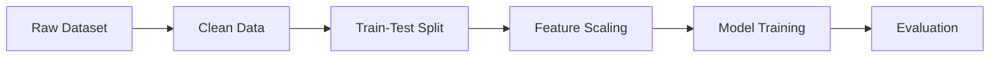
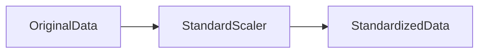
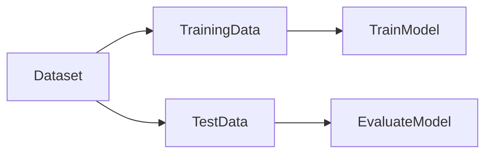

# 17. Feature Scaling and Data Preparation

> Learn how proper data preparation and feature scaling improve Machine Learning model performance by ensuring features contribute fairly during training and prediction.

---

## 🎯 Learning Objectives

After completing this chapter, you will be able to:

- Understand why data preparation is important
- Learn the role of feature scaling
- Differentiate Standardization and Normalization
- Understand train-test splitting
- Identify common data preprocessing techniques
- Build preprocessing pipelines using Scikit-Learn

---

## 📖 Overview

High-quality data is the foundation of every successful Machine Learning model.

Before training begins, raw data must be cleaned, transformed, and prepared into a format suitable for learning algorithms. This process, known as **data preparation**, ensures that models learn meaningful patterns rather than noise.

Many Machine Learning algorithms, especially distance-based methods such as **K-Nearest Neighbors (K-NN)** and **Support Vector Machines (SVMs)**, are sensitive to differences in feature scales. Feature scaling ensures that each feature contributes equally during model training.

---

## 🧠 Core Concepts

Data preparation typically includes:

- Data Cleaning
- Handling Missing Values
- Feature Selection
- Train-Test Split
- Feature Scaling
- Feature Transformation

These preprocessing steps improve model accuracy, stability, and generalization.

---

## 🏗️ Data Preparation Workflow



---

# 📘 Why Feature Scaling?

Different features often have vastly different ranges.

Example:

| Feature | Value |
|---------|-------|
| Age | 35 |
| Annual Income | 85000 |
| Credit Score | 720 |

Without scaling, features with larger values dominate distance calculations and optimization algorithms.

Feature scaling ensures every feature contributes proportionally.

---

# 📊 Standardization

Standardization transforms data so that:

- Mean = 0
- Standard Deviation = 1

It is one of the most commonly used scaling techniques.

Standardization is particularly effective for algorithms that assume normally distributed data.

Common algorithms:

- K-NN
- SVM
- Logistic Regression
- Neural Networks

---

## Standardization Workflow



---

# 📈 Normalization

Normalization rescales feature values into a fixed range, typically:

**0 to 1**

It is useful when features have different units or when algorithms require bounded input values.

Common applications include:

- Image Processing
- Deep Learning
- Distance-Based Algorithms

---

## 📊 Standardization vs Normalization

| Aspect | Standardization | Normalization |
|---------|-----------------|---------------|
| Output Range | Mean = 0, Std = 1 | Usually 0 to 1 |
| Sensitive to Outliers | Less | More |
| Typical Algorithms | SVM, Logistic Regression | Neural Networks, K-NN |
| Distribution Preserved | Yes | No |

---

# 📌 Train-Test Split

A Machine Learning model should always be evaluated using unseen data.

The dataset is commonly divided into:

| Dataset | Purpose |
|----------|----------|
| Training Set | Learn model parameters |
| Test Set | Evaluate model performance |

A typical split is:

- 80% Training
- 20% Testing

This helps estimate how well the model generalizes to new data.

---

## 🏗️ Data Splitting Process



---

# 📙 Common Data Preparation Techniques

Before training a model, data often requires additional preprocessing.

Common techniques include:

- Handling Missing Values
- Removing Duplicate Records
- Encoding Categorical Variables
- Feature Scaling
- Feature Selection
- Handling Outliers

Each technique contributes to improving model quality.

---

## 🌍 Real-World Example

### Customer Churn Prediction

Suppose a telecom company wants to predict customer churn.

Available features include:

- Age
- Monthly Charges
- Contract Length
- Internet Usage
- Customer Support Calls

Before training:

- Missing values are handled.
- Numerical features are standardized.
- The dataset is split into training and testing sets.

The resulting dataset is then used to train a classification model.

---

## 💻 Implementation Example

=== "Train-Test Split"

```python title="train_test_split.py"
from sklearn.model_selection import train_test_split

X_train, X_test, y_train, y_test = train_test_split(
    X,
    y,
    test_size=0.2,
    random_state=42
)
```

=== "Standardization"

```python title="standard_scaler.py"
from sklearn.preprocessing import StandardScaler

scaler = StandardScaler()

X_train = scaler.fit_transform(X_train)

X_test = scaler.transform(X_test)
```

=== "Normalization"

```python title="minmax_scaler.py"
from sklearn.preprocessing import MinMaxScaler

scaler = MinMaxScaler()

X_train = scaler.fit_transform(X_train)

X_test = scaler.transform(X_test)
```

---

## 🏢 Enterprise Perspective

Enterprise Machine Learning pipelines automate preprocessing before every model training cycle.

Typical preprocessing workflows include:

- Data validation
- Missing value handling
- Feature engineering
- Feature scaling
- Data versioning
- Pipeline automation

Modern MLOps platforms integrate these steps into reproducible pipelines, ensuring consistent preprocessing during both training and inference.

---

!!! tip "Production Insight"

    Always fit preprocessing transformers (such as StandardScaler) on the training dataset only, and then apply the same transformation to validation and test datasets. Fitting on the entire dataset can introduce **data leakage**, leading to overly optimistic evaluation results.

---

## 💡 Best Practices

- Split data before preprocessing.
- Fit preprocessing steps only on training data.
- Apply identical transformations during inference.
- Scale numerical features for distance-based algorithms.
- Automate preprocessing using pipelines.

---

## ⚠️ Common Mistakes

- Scaling the entire dataset before train-test splitting.
- Forgetting to apply the same scaling during inference.
- Mixing Standardization and Normalization without justification.
- Ignoring missing values.
- Using inconsistent preprocessing across environments.

---

## 📌 Key Takeaways

- Data preparation is essential for building reliable Machine Learning models.
- Feature scaling improves the performance of many algorithms.
- Standardization centers data around zero with unit variance.
- Normalization rescales features to a fixed range.
- Always split data before preprocessing.
- Consistent preprocessing is critical for production deployments.

---

## 📚 Further Reading

The next chapter explores the **Bias-Variance Trade-off**, explaining how model complexity influences underfitting, overfitting, and generalization.

---

## ➡️ Next Chapter

*[18. Bias-Variance Trade-off](18-bias-variance-tradeoff.md)*