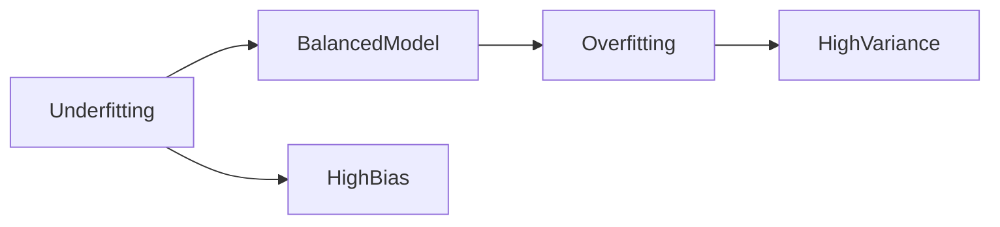

# 18. Bias-Variance Trade-off

> Learn how model complexity affects prediction performance by understanding the relationship between bias, variance, underfitting, overfitting, and how ensemble learning techniques help build more accurate and generalizable Machine Learning models.

---

## 🎯 Learning Objectives

After completing this chapter, you will be able to:

- Understand the concepts of bias and variance
- Differentiate underfitting and overfitting
- Explain the bias-variance trade-off
- Understand weak and strong learners
- Learn how bagging and boosting improve model performance
- Apply best practices for selecting model complexity

---

## 📖 Overview

One of the biggest challenges in Machine Learning is building models that perform well not only on training data but also on unseen data.

Models that are too simple fail to capture important patterns, while overly complex models memorize the training data instead of learning general relationships.

This balance between **bias** and **variance** is known as the **Bias-Variance Trade-off** and is fundamental to building production-ready Machine Learning systems.

Understanding this trade-off enables data scientists to select models that generalize well while minimizing prediction errors.

---

## 🧠 Core Concepts

Every Machine Learning model has two primary sources of prediction error:

- Bias
- Variance

The objective is to find an optimal balance that minimizes total prediction error.

---

## 🏗️ Model Complexity

```mermaid
flowchart LR

Simple Model

--> HighBias

HighBias --> BalancedModel

BalancedModel --> HighVariance

HighVariance --> ComplexModel
```

---

# 📘 What is Bias?

Bias measures how far a model's predictions are from the actual values due to simplifying assumptions made during learning.

Models with **high bias** are usually too simple and fail to capture important relationships within the data.

This leads to:

- Underfitting
- Poor prediction accuracy
- High training error
- High testing error

---

## Characteristics of High Bias

- Simple models
- Low complexity
- Poor learning capability
- Misses important data patterns
- Underfits the data

---

# 📗 What is Variance?

Variance measures how sensitive a model is to changes in the training dataset.

Models with **high variance** learn not only meaningful patterns but also random noise present in the training data.

This leads to:

- Overfitting
- Excellent training accuracy
- Poor testing performance
- Low generalization

---

## Characteristics of High Variance

- Complex models
- Sensitive to training data
- Memorizes noise
- Excellent training performance
- Poor performance on unseen data

---

## 📊 Bias vs Variance

| Bias | Variance |
|------|----------|
| Measures prediction accuracy | Measures prediction stability |
| High bias causes underfitting | High variance causes overfitting |
| Simple models | Complex models |
| Low complexity | High complexity |

---

# 📈 Underfitting vs Overfitting

Finding the correct model complexity is essential.

| Underfitting | Good Fit | Overfitting |
|--------------|----------|-------------|
| High Bias | Balanced | High Variance |
| Poor Accuracy | Good Generalization | Memorizes Training Data |
| Too Simple | Optimal Complexity | Too Complex |

---

## 🏗️ Bias-Variance Trade-off



---

# 📌 Bias-Variance Trade-off

As model complexity increases:

- Bias decreases
- Variance increases

The objective is **not** to eliminate bias or variance completely.

Instead, the goal is to identify a model with the lowest overall prediction error and the best ability to generalize to unseen data.

---

## 🌍 Real-World Example

Imagine building a house price prediction model.

### Very Simple Model

Uses only:

- Area

↓

Misses many important factors.

Result:

High Bias

---

### Very Complex Model

Uses hundreds of highly specific features.

↓

Memorizes historical prices.

Result:

High Variance

---

### Balanced Model

Uses the most relevant features while avoiding unnecessary complexity.

↓

Produces reliable predictions on new properties.

---

# 📙 Weak Learners

A **Weak Learner** performs only slightly better than random guessing.

Characteristics:

- High Bias
- Low Variance
- Simple model
- Fast training

Example:

- Small Decision Tree

Weak learners become powerful when combined using ensemble techniques.

---

# 📘 Strong Learners

A **Strong Learner** captures complex relationships in the data.

Characteristics:

- Low Bias
- Higher Variance
- Better predictive performance
- Greater risk of overfitting

Examples:

- Deep Decision Trees
- Complex Neural Networks

---

## 📊 Weak vs Strong Learners

| Weak Learner | Strong Learner |
|--------------|----------------|
| High Bias | Low Bias |
| Low Variance | Higher Variance |
| Simple | Complex |
| Underfits | May Overfit |

---

# 📈 Ensemble Learning

Ensemble Learning combines multiple models to improve prediction accuracy.

Instead of relying on a single learner, multiple models work together to produce better predictions.

Two of the most popular ensemble techniques are:

- Bagging
- Boosting

---

## 🏗️ Ensemble Learning Overview

```mermaid
flowchart TD

Training Data

--> Ensemble

Ensemble --> Bagging

Ensemble --> Boosting

Bagging --> FinalPrediction

Boosting --> FinalPrediction
```

---

# 📦 Bagging

Bagging (**Bootstrap Aggregating**) reduces **variance**.

How it works:

- Create multiple bootstrap samples
- Train independent models
- Combine predictions

Example:

- Random Forest

Advantages:

- Reduces overfitting
- Improves stability
- Handles noisy data well

---

# 🚀 Boosting

Boosting reduces **bias**.

How it works:

- Train weak learners sequentially
- Each model focuses on previous errors
- Combine all learners into one strong model

Popular boosting algorithms:

- AdaBoost
- Gradient Boosting
- XGBoost

Advantages:

- High predictive accuracy
- Learns complex relationships
- Excellent performance on structured data

---

## 📊 Bagging vs Boosting

| Feature | Bagging | Boosting |
|---------|----------|----------|
| Goal | Reduce Variance | Reduce Bias |
| Training | Parallel | Sequential |
| Learners | Independent | Dependent |
| Robust to Noise | Yes | Less |
| Example | Random Forest | XGBoost |

---

## 💻 Implementation Example

=== "Random Forest (Bagging)"

```python title="random_forest.py"
from sklearn.ensemble import RandomForestClassifier

model = RandomForestClassifier(
    n_estimators=100,
    random_state=42
)

model.fit(X_train, y_train)
```

=== "Gradient Boosting"

```python title="gradient_boosting.py"
from sklearn.ensemble import GradientBoostingClassifier

model = GradientBoostingClassifier()

model.fit(X_train, y_train)
```

---

## 🏢 Enterprise Perspective

Selecting the right model complexity is one of the most important decisions in enterprise AI projects.

Production teams often:

- Start with simple baseline models
- Compare multiple algorithms
- Use cross-validation
- Monitor prediction performance
- Apply ensemble methods when additional accuracy is required

Modern production systems frequently use ensemble algorithms such as **Random Forest**, **XGBoost**, and **LightGBM** because they provide excellent predictive performance while reducing bias and variance.

---

!!! tip "Production Insight"

    There is no universally "best" Machine Learning model.

    The most effective production models achieve the right balance between prediction accuracy, generalization, interpretability, computational efficiency, and maintenance cost.

---

## 💡 Best Practices

- Start with simpler models before increasing complexity.
- Monitor both training and validation performance.
- Use cross-validation during model selection.
- Apply regularization or pruning to reduce overfitting.
- Consider ensemble methods when a single model is insufficient.

---

## ⚠️ Common Mistakes

- Assuming more complex models are always better.
- Ignoring validation performance.
- Evaluating models only on training data.
- Confusing bias with variance.
- Applying boosting without tuning hyperparameters.

---

## 📌 Key Takeaways

- High bias leads to underfitting.
- High variance leads to overfitting.
- The Bias-Variance Trade-off helps identify optimal model complexity.
- Weak learners can be combined to build powerful ensemble models.
- Bagging reduces variance.
- Boosting reduces bias.
- Ensemble methods are widely used in production Machine Learning systems.

---

## 📚 Further Reading

The next chapter explores **Ensemble Learning**, covering Random Forests, AdaBoost, Gradient Boosting, XGBoost, and how combining multiple models improves prediction accuracy and robustness.

---

## ➡️ Next Chapter

*[19. Ensemble Learning](19-ensemble-learning.md)*