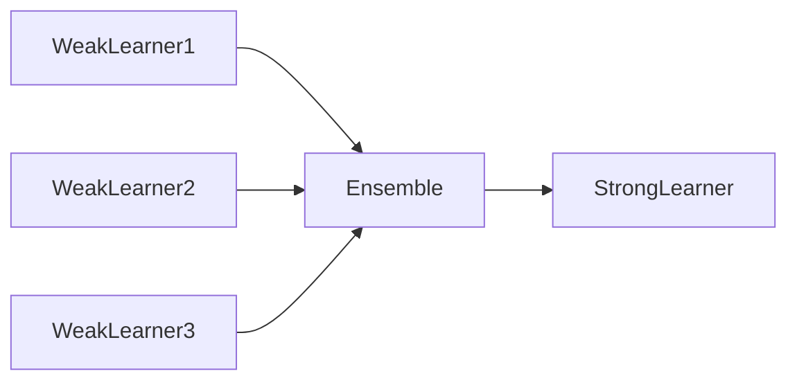
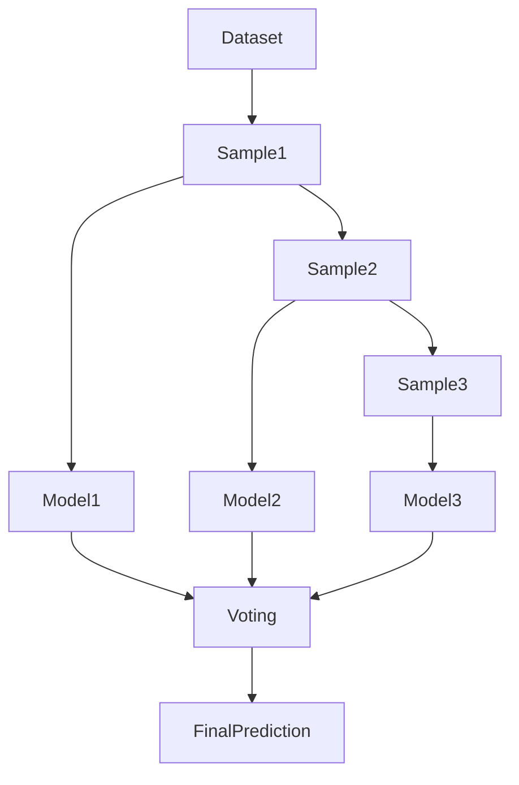
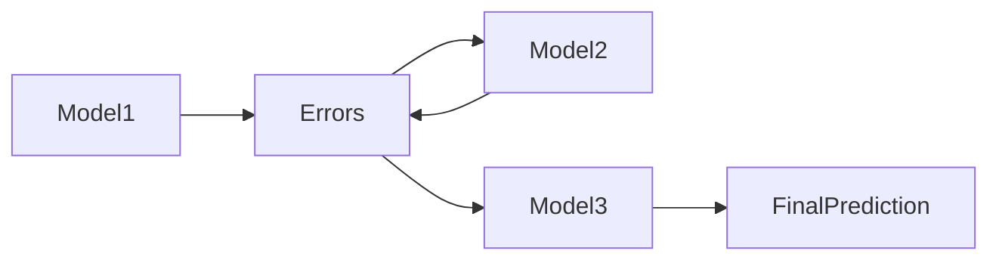

# 19. Ensemble Learning

> Learn how Ensemble Learning combines multiple Machine Learning models to improve prediction accuracy, reduce bias and variance, and build highly robust production-ready AI systems.

---

## 🎯 Learning Objectives

After completing this chapter, you will be able to:

- Understand the concept of Ensemble Learning
- Differentiate weak and strong learners
- Explain Bagging and Boosting
- Learn how Random Forest improves Decision Trees
- Understand Gradient Boosting, AdaBoost, and XGBoost
- Identify when ensemble methods should be used in production systems

---

## 📖 Overview

Individual Machine Learning models often have limitations.

Some models suffer from **high bias**, while others experience **high variance**. Ensemble Learning addresses these limitations by combining multiple models to produce a stronger and more reliable predictor.

Rather than relying on a single model, ensemble methods aggregate predictions from multiple learners, resulting in improved accuracy, robustness, and generalization.

Today, ensemble algorithms such as **Random Forest**, **Gradient Boosting**, **XGBoost**, **LightGBM**, and **CatBoost** are among the most successful algorithms used in structured data problems.

---

## 🧠 Core Concepts

Ensemble Learning combines multiple models into a single predictive system.

The objective is to:

- Improve prediction accuracy
- Reduce overfitting
- Improve generalization
- Increase robustness
- Reduce prediction error

Individual models are called **base learners**.

---

## 🏗️ Ensemble Learning Workflow

```mermaid
flowchart LR

Training Data

--> Multiple Models

--> Combine Predictions

--> Final Prediction
```

---

# 📘 Why Ensemble Learning?

A single model may:

- Miss important patterns
- Overfit training data
- Underfit complex relationships

Combining multiple models helps compensate for the weaknesses of individual learners.

This results in more stable and accurate predictions.

---

## 📊 Single Model vs Ensemble

| Single Model | Ensemble Model |
|---------------|----------------|
| One Learner | Multiple Learners |
| Higher Risk of Error | Lower Prediction Error |
| Less Robust | More Robust |
| Lower Stability | Higher Stability |

---

# 📗 Weak vs Strong Learners

### Weak Learner

A model that performs only slightly better than random guessing.

Examples:

- Small Decision Tree
- Decision Stump

Characteristics:

- High Bias
- Low Variance
- Simple Model

---

### Strong Learner

A model capable of making highly accurate predictions.

Characteristics:

- Low Bias
- Better Generalization
- Higher Predictive Performance

Ensemble Learning transforms many weak learners into a strong learner.

---

## 🏗️ Weak to Strong Learning



---

# 📦 Bagging (Bootstrap Aggregating)

Bagging reduces **variance** by training multiple models independently on different random subsets of the training data.

Each model produces a prediction.

The final prediction is obtained through:

- Majority Voting (Classification)
- Averaging (Regression)

Because each learner is independent, Bagging can train models in parallel.

---

## Advantages of Bagging

- Reduces overfitting
- Improves stability
- Handles noisy datasets
- Easy to parallelize

---

## 🏗️ Bagging Workflow



---

# 🌲 Random Forest

Random Forest is the most popular Bagging algorithm.

Instead of training one Decision Tree, it trains hundreds of trees using:

- Bootstrap sampling
- Random feature selection

The predictions from all trees are combined to produce the final result.

Random Forest significantly improves the stability and accuracy of individual Decision Trees.

---

## Random Forest Characteristics

- Uses Decision Trees
- Parallel Training
- Majority Voting
- Excellent Generalization
- Resistant to Overfitting

---

# 🚀 Boosting

Boosting reduces **bias**.

Instead of training models independently, Boosting trains them sequentially.

Each new model focuses on correcting the mistakes made by previous models.

This process gradually produces a highly accurate predictive model.

---

## Advantages of Boosting

- High predictive accuracy
- Excellent performance on structured data
- Learns complex relationships
- Reduces bias

---

## 🏗️ Boosting Workflow



---

# 📘 Popular Boosting Algorithms

## AdaBoost

Adaptive Boosting increases the importance of incorrectly classified observations during each iteration.

Best suited for:

- Small to medium datasets
- Binary classification

---

## Gradient Boosting

Gradient Boosting builds models sequentially by minimizing prediction errors using gradient optimization.

Applications:

- Regression
- Classification
- Ranking Problems

---

## XGBoost

Extreme Gradient Boosting (XGBoost) is one of the most widely used Machine Learning algorithms in industry.

Features include:

- Regularization
- Parallel processing
- Missing value handling
- High scalability
- Excellent predictive performance

---

## LightGBM

LightGBM is designed for speed and efficiency.

Advantages:

- Fast training
- Low memory consumption
- Suitable for very large datasets

---

## CatBoost

CatBoost specializes in datasets containing categorical features.

Advantages:

- Minimal preprocessing
- Strong handling of categorical variables
- High accuracy

---

## 📊 Ensemble Algorithm Comparison

| Algorithm | Technique | Primary Goal | Typical Use |
|-----------|-----------|--------------|-------------|
| Random Forest | Bagging | Reduce Variance | General Classification & Regression |
| AdaBoost | Boosting | Reduce Bias | Binary Classification |
| Gradient Boosting | Boosting | Reduce Bias | Structured Data |
| XGBoost | Boosting | High Accuracy | Enterprise ML |
| LightGBM | Boosting | Speed | Large Datasets |
| CatBoost | Boosting | Categorical Features | Business Data |

---

## 🌍 Real-World Applications

Ensemble Learning powers many enterprise AI systems.

| Industry | Example Application |
|----------|---------------------|
| Banking | Credit Risk Assessment |
| Finance | Fraud Detection |
| Insurance | Claim Prediction |
| Retail | Demand Forecasting |
| Healthcare | Disease Prediction |
| Manufacturing | Predictive Maintenance |
| Telecommunications | Customer Churn Prediction |

---

## 🏦 Case Study

### Credit Risk Prediction

A bank wants to predict whether a customer is likely to default on a loan.

Input Features:

- Credit Score
- Annual Income
- Existing Debt
- Employment History
- Loan Amount

↓

XGBoost Model

↓

Probability of Default

↓

Loan Approval Decision

Ensemble methods provide higher predictive accuracy than a single Decision Tree, making them ideal for financial risk assessment.

---

## 💻 Implementation Example

=== "Random Forest"

```python title="random_forest.py"
from sklearn.ensemble import RandomForestClassifier

model = RandomForestClassifier(
    n_estimators=100,
    random_state=42
)

model.fit(X_train, y_train)
```

=== "Gradient Boosting"

```python title="gradient_boosting.py"
from sklearn.ensemble import GradientBoostingClassifier

model = GradientBoostingClassifier()

model.fit(X_train, y_train)
```

=== "XGBoost"

```python title="xgboost_classifier.py"
from xgboost import XGBClassifier

model = XGBClassifier(
    n_estimators=200,
    learning_rate=0.1,
    max_depth=6
)

model.fit(X_train, y_train)
```

---

## 🏢 Enterprise Perspective

Ensemble Learning has become the standard approach for solving structured data problems in enterprise environments.

Organizations frequently use ensemble algorithms because they:

- Improve prediction accuracy
- Reduce model variance
- Handle complex nonlinear relationships
- Generalize well to unseen data
- Deliver state-of-the-art performance on tabular datasets

Many winning solutions in data science competitions and production systems are based on XGBoost, LightGBM, or Random Forest.

---

!!! tip "Production Insight"

    Start with a simple baseline model such as Logistic Regression or Decision Trees.

    If additional accuracy is required, evaluate ensemble methods. Although they often achieve superior performance, they typically require greater computational resources and are less interpretable than simpler models.

---

## 💡 Best Practices

- Build a simple baseline model first.
- Use cross-validation for model comparison.
- Tune ensemble hyperparameters carefully.
- Balance prediction accuracy with interpretability.
- Monitor ensemble models after deployment.

---

## ⚠️ Common Mistakes

- Using ensemble methods without establishing a baseline.
- Assuming more trees always improve performance.
- Ignoring computational cost.
- Overfitting by excessive boosting iterations.
- Neglecting feature engineering.

---

## 📌 Key Takeaways

- Ensemble Learning combines multiple models to improve prediction performance.
- Bagging reduces variance by training independent models.
- Boosting reduces bias through sequential learning.
- Random Forest is the most popular Bagging algorithm.
- XGBoost, LightGBM, and CatBoost are powerful Boosting algorithms widely used in production.
- Ensemble methods are among the most effective approaches for structured Machine Learning problems.

---

## 📚 Further Reading

The next chapter concludes this module by exploring how to design, deploy, and operate **Production-Ready Classification Systems** using enterprise best practices and MLOps principles.

---

## ➡️ Next Chapter

*[20. Building Production Classification Systems](20-building-production-classification-systems.md)*