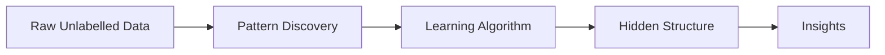
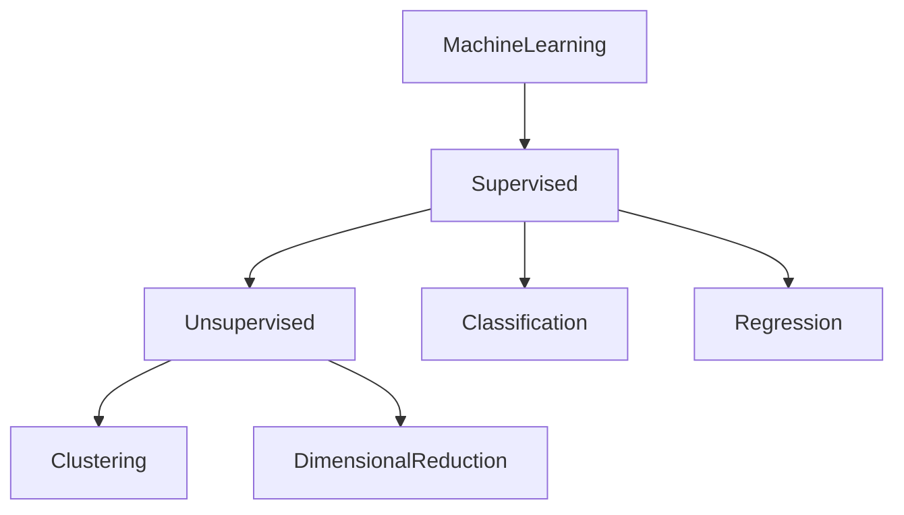

# 21. Unsupervised Learning Fundamentals

> Learn the fundamentals of Unsupervised Learning, understand how machines discover hidden patterns without labelled data, and explore the real-world applications that make it an essential branch of Machine Learning.

---

## 🎯 Learning Objectives

After completing this chapter, you will be able to:

- Understand what Unsupervised Learning is
- Differentiate Supervised and Unsupervised Learning
- Understand how unlabeled data is used
- Explore the major types of Unsupervised Learning
- Identify common enterprise applications
- Understand the strengths and limitations of Unsupervised Learning

---

## 📖 Overview

Unlike Supervised Learning, where models learn from labelled examples, **Unsupervised Learning** works with **unlabelled data**.

The objective is not to predict a predefined output but to automatically discover hidden structures, relationships, similarities, and patterns within the data.

Because organizations generate enormous volumes of unlabeled data every day, Unsupervised Learning has become an essential technique for customer segmentation, anomaly detection, recommendation systems, feature engineering, and data exploration.

---

## 🧠 Core Concepts

Unsupervised Learning focuses on discovering patterns without predefined labels.

Common learning tasks include:

- Clustering
- Dimensionality Reduction
- Association Rule Mining
- Anomaly Detection

Instead of answering **"What is the correct label?"**, the algorithm attempts to answer:

- Which observations are similar?
- Are there natural groups?
- Can the data be represented more efficiently?
- Are there unusual observations?

---

## 🏗️ Unsupervised Learning Workflow



---

# 📘 What is Unsupervised Learning?

Unsupervised Learning is a Machine Learning approach in which algorithms analyze **unlabelled datasets** to discover meaningful structures and relationships.

Since no target variable exists, the model independently identifies similarities and differences between observations.

Unlike supervised models, there is no "correct answer" provided during training.

---

## Characteristics

- Uses unlabeled datasets
- No predefined target variable
- Automatically discovers hidden patterns
- Useful for exploratory data analysis
- Can identify unknown relationships

---

# 📊 Supervised vs Unsupervised Learning

| Aspect | Supervised Learning | Unsupervised Learning |
|---------|---------------------|-----------------------|
| Training Data | Labelled | Unlabelled |
| Goal | Predict Outputs | Discover Patterns |
| Target Variable | Required | Not Required |
| Typical Tasks | Classification, Regression | Clustering, Dimensionality Reduction |
| Example | Spam Detection | Customer Segmentation |

---

## 🏗️ Learning Approaches



---

# 📗 Types of Unsupervised Learning

Several techniques fall under Unsupervised Learning.

## Clustering

Groups similar observations into clusters.

Examples:

- Customer Segmentation
- Product Categorization
- Image Grouping

---

## Dimensionality Reduction

Reduces the number of input features while preserving important information.

Examples:

- Principal Component Analysis (PCA)
- t-SNE
- UMAP

---

## Association Rule Learning

Discovers relationships between variables.

Example:

- Market Basket Analysis

---

## Anomaly Detection

Identifies unusual observations that differ significantly from the majority.

Examples:

- Fraud Detection
- Network Intrusion Detection
- Equipment Failure Detection

---

## 📊 Major Unsupervised Learning Tasks

| Technique | Purpose |
|-----------|---------|
| Clustering | Discover Similar Groups |
| Dimensionality Reduction | Simplify High-Dimensional Data |
| Association Rules | Discover Relationships |
| Anomaly Detection | Identify Rare Events |

---

# 📈 How Unsupervised Learning Works

Unlike supervised algorithms, the model receives only input features.

The algorithm analyzes similarities between observations and identifies meaningful structures without human guidance.

The discovered patterns can then be used for business insights, visualization, or downstream Machine Learning tasks.

---

## 🏗️ Learning Process

```mermaid
flowchart LR

Unlabelled Data

--> Similarity Analysis

--> Pattern Discovery

--> Groups

--> Business Insights
```

---

## 🌍 Real-World Applications

Unsupervised Learning is widely used across industries.

| Industry | Example Application |
|----------|---------------------|
| Banking | Fraud Detection |
| Retail | Customer Segmentation |
| E-Commerce | Product Recommendation |
| Healthcare | Disease Pattern Discovery |
| Manufacturing | Predictive Maintenance |
| Cybersecurity | Network Anomaly Detection |
| Marketing | Customer Behavior Analysis |
| Telecommunications | Usage Pattern Analysis |

---

## 🏢 Case Study

### Customer Segmentation

A retail company has millions of customer records but no predefined customer categories.

Available information:

- Age
- Income
- Purchase Frequency
- Product Preferences

↓

Clustering Algorithm

↓

Customer Groups

↓

Personalized Marketing Campaigns

Instead of manually defining customer segments, the algorithm automatically discovers natural groups within the customer base.

---

## 💻 Implementation Example

=== "Python"

```python title="unsupervised_learning_example.py"
from sklearn.cluster import KMeans

model = KMeans(
    n_clusters=4,
    random_state=42
)

model.fit(X)
```

=== "Workflow"

```text
Unlabelled Data

↓

Pattern Discovery

↓

Clusters

↓

Business Insights
```

---

## 🏢 Enterprise Perspective

Organizations often possess significantly more **unlabelled** than labelled data.

Unsupervised Learning enables enterprises to:

- Discover hidden customer segments
- Detect unusual behavior
- Reduce data complexity
- Improve recommendation systems
- Generate features for supervised models
- Explore large datasets before predictive modeling

Many production AI systems use Unsupervised Learning as an initial step before building supervised Machine Learning models.

---

!!! tip "Production Insight"

    Unsupervised Learning is often used to understand data before predictive modeling begins.

    In enterprise Machine Learning projects, clustering and dimensionality reduction frequently improve feature engineering, visualization, anomaly detection, and downstream model performance.

---

## 💡 Best Practices

- Understand the business objective before selecting an algorithm.
- Scale numerical features when required.
- Experiment with multiple clustering techniques.
- Validate discovered patterns using domain knowledge.
- Visualize results whenever possible.

---

## ⚠️ Common Mistakes

- Assuming discovered clusters always represent meaningful business groups.
- Ignoring feature scaling.
- Selecting an arbitrary number of clusters.
- Treating unsupervised outputs as absolute truth.
- Evaluating results without business validation.

---

## 📌 Key Takeaways

- Unsupervised Learning works with unlabeled data.
- It discovers hidden patterns and relationships automatically.
- Major tasks include clustering, dimensionality reduction, association rule learning, and anomaly detection.
- It is widely used for customer segmentation, fraud detection, recommendation systems, and exploratory analysis.
- Unsupervised Learning often serves as the foundation for advanced analytics and production AI systems.

---

## 📚 Further Reading

The next chapter explores **Clustering Fundamentals**, introducing similarity measures, clustering strategies, and the core concepts behind grouping similar observations.

---

## ➡️ Next Chapter

*[22. Clustering Fundamentals](22-clustering-fundamentals.md)*