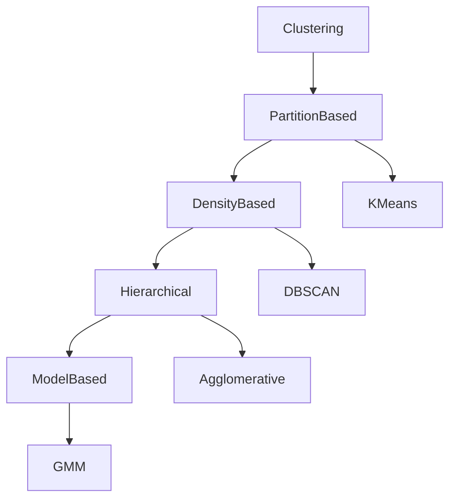

# 22. Clustering Fundamentals

> Learn the fundamental concepts of clustering, understand how similar data points are grouped together, and explore the major clustering techniques used in modern Machine Learning and enterprise AI systems.

---

## 🎯 Learning Objectives

After completing this chapter, you will be able to:

- Understand what clustering is
- Learn how clustering algorithms group similar data
- Understand similarity and distance measures
- Differentiate major clustering approaches
- Identify real-world clustering applications
- Select appropriate clustering techniques for business problems

---

## 📖 Overview

Clustering is one of the most widely used techniques in **Unsupervised Learning**.

Unlike classification, where predefined labels are available, clustering automatically groups similar observations into meaningful clusters based on their characteristics.

The objective is to maximize similarity within each cluster while maximizing differences between different clusters.

Clustering is widely used for customer segmentation, recommendation systems, anomaly detection, image analysis, document organization, and exploratory data analysis.

---

## 🧠 Core Concepts

Clustering identifies natural groups within unlabeled data.

The algorithm attempts to:

- Discover hidden structures
- Group similar observations
- Separate dissimilar observations
- Reveal meaningful patterns

Unlike supervised learning, there are no predefined classes.

---

## 🏗️ Clustering Workflow


---

# 📘 What is Clustering?

Clustering is an **Unsupervised Learning** technique that organizes similar observations into groups called **clusters**.

Objects within the same cluster are more similar to one another than to objects in different clusters.

Each cluster represents a naturally occurring group within the dataset.

---

## Characteristics

- No labelled data
- Automatic pattern discovery
- Groups similar observations
- Separates dissimilar observations
- Useful for exploratory analysis

---

# 📊 Similarity and Distance

Most clustering algorithms rely on measuring similarity between observations.

The smaller the distance between two observations, the more similar they are considered.

Common distance metrics include:

- Euclidean Distance
- Manhattan Distance
- Cosine Similarity
- Minkowski Distance

The choice of distance metric can significantly affect clustering results.

---

## 📈 Common Distance Metrics

| Distance Metric | Typical Use |
|-----------------|-------------|
| Euclidean | Numerical Data |
| Manhattan | Grid-Based Data |
| Cosine Similarity | Text & NLP |
| Minkowski | General Purpose |

---

# 📗 Types of Clustering

Different clustering algorithms use different strategies for grouping data.

The major approaches include:

- Partition-Based Clustering
- Density-Based Clustering
- Hierarchical Clustering
- Model-Based Clustering

Each approach has advantages and limitations depending on the dataset.

---

## 📊 Clustering Approaches

| Approach | Example Algorithm | Best For |
|-----------|------------------|----------|
| Partition-Based | K-Means | Compact, spherical clusters |
| Density-Based | DBSCAN | Arbitrary-shaped clusters & noise |
| Hierarchical | Agglomerative Clustering | Hierarchical relationships |
| Model-Based | Gaussian Mixture Models | Probabilistic clustering |

---

## 🏗️ Clustering Categories



---

# 📌 Choosing a Clustering Algorithm

The choice of algorithm depends on several factors.

Consider:

- Dataset size
- Cluster shape
- Presence of noise
- Number of features
- Computational complexity
- Interpretability

No single clustering algorithm performs best for every problem.

---

## 🌍 Real-World Applications

Clustering is widely used across industries.

| Industry | Example Application |
|----------|---------------------|
| Retail | Customer Segmentation |
| Banking | Fraud Pattern Discovery |
| Healthcare | Patient Grouping |
| Marketing | Audience Segmentation |
| Manufacturing | Product Categorization |
| Cybersecurity | Network Traffic Analysis |
| E-Commerce | Product Recommendations |
| Social Media | Community Detection |

---

## 🏢 Case Study

### Customer Segmentation

A retail company wants to group customers based on purchasing behavior.

Available features:

- Annual Income
- Spending Score
- Purchase Frequency
- Product Preferences

↓

Clustering Algorithm

↓

Customer Segments

↓

Personalized Marketing Campaigns

The business can now target each customer segment with tailored promotions without manually defining customer categories.

---

## 📊 Evaluating Clustering Results

Unlike supervised learning, clustering has no ground truth labels.

Common evaluation techniques include:

- Silhouette Score
- Davies-Bouldin Index
- Calinski-Harabasz Index
- Visual Inspection
- Business Validation

Evaluation often combines quantitative metrics with domain expertise.

---

## 🏗️ Clustering Evaluation

```mermaid
flowchart LR

Clusters

--> Evaluation Metrics

Evaluation Metrics

--> Business Validation

Business Validation

--> Model Improvement
```

---

## 💻 Implementation Example

=== "Python"

```python title="clustering_example.py"
from sklearn.cluster import KMeans

model = KMeans(
    n_clusters=4,
    random_state=42
)

model.fit(X)
```

=== "Workflow"

```text
Unlabelled Data

↓

Similarity Measurement

↓

Clustering Algorithm

↓

Clusters

↓

Business Insights
```

---

## 🏢 Enterprise Perspective

Clustering is often the first analytical step in enterprise AI projects.

Organizations use clustering to:

- Understand customer behavior
- Identify hidden market segments
- Detect anomalies
- Organize products and documents
- Generate features for supervised learning
- Improve recommendation systems

Modern AI platforms frequently integrate clustering into data exploration, business intelligence, and feature engineering workflows.

---

!!! tip "Production Insight"

    Clustering is exploratory by nature. The quality of clusters should always be evaluated using both quantitative metrics and business understanding.

    A mathematically optimal clustering solution is not always the most useful from a business perspective.

---

## 💡 Best Practices

- Scale numerical features before clustering.
- Experiment with multiple clustering algorithms.
- Choose appropriate distance metrics.
- Validate clusters using evaluation metrics and domain knowledge.
- Visualize clusters whenever possible.

---

## ⚠️ Common Mistakes

- Assuming every dataset naturally contains clusters.
- Ignoring feature scaling.
- Selecting an arbitrary number of clusters.
- Evaluating clusters using only visual inspection.
- Choosing algorithms without understanding their assumptions.

---

## 📌 Key Takeaways

- Clustering groups similar observations without labeled data.
- Similarity is typically measured using distance metrics.
- Multiple clustering approaches exist, each suited to different data characteristics.
- Clustering supports customer segmentation, anomaly detection, recommendation systems, and exploratory analysis.
- Business validation is essential when interpreting clustering results.

---

## 📚 Further Reading

The next chapter explores **K-Means Clustering**, one of the most widely used partition-based clustering algorithms for grouping similar observations.

---

## ➡️ Next Chapter

*[23. K-Means Clustering](23-k-means-clustering.md)*