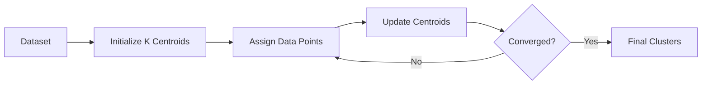

# 23. K-Means Clustering

> Learn how K-Means Clustering groups similar data points into clusters, understand how centroids are formed, and explore one of the most widely used unsupervised learning algorithms for customer segmentation, pattern discovery, and data exploration.

---

## 🎯 Learning Objectives

After completing this chapter, you will be able to:

- Understand the K-Means clustering algorithm
- Learn how centroids are initialized and updated
- Understand the iterative clustering process
- Determine the optimal number of clusters
- Evaluate K-Means clustering performance
- Build K-Means models using Scikit-Learn

---

## 📖 Overview

K-Means is one of the most popular and widely used clustering algorithms in Machine Learning.

It partitions unlabeled data into **K distinct clusters**, where each observation belongs to the cluster with the nearest centroid.

The algorithm continuously updates cluster centers until the clusters stabilize, making it simple, efficient, and suitable for many real-world applications such as customer segmentation, recommendation systems, image compression, and market analysis.

---

## 🧠 Core Concepts

K-Means clustering is based on several key concepts:

- Number of Clusters (K)
- Centroids
- Distance Measurement
- Cluster Assignment
- Iterative Optimization

The objective is to minimize the distance between observations and their assigned cluster centroids.

---

## 🏗️ K-Means Workflow



---

# 📘 What is K-Means Clustering?

K-Means is a **partition-based clustering algorithm** that divides a dataset into **K non-overlapping clusters**.

Each cluster is represented by a **centroid**, which is the average position of all observations assigned to that cluster.

The algorithm aims to create clusters where:

- Observations within a cluster are highly similar.
- Different clusters are as distinct as possible.

---

## Characteristics

- Unsupervised Learning
- Partition-Based Clustering
- Requires predefined K
- Fast and scalable
- Works best with compact, spherical clusters

---

# 📊 How K-Means Works

The algorithm follows an iterative optimization process.

### Step 1

Choose the number of clusters (**K**).

---

### Step 2

Randomly initialize K centroids.

---

### Step 3

Assign every observation to its nearest centroid.

---

### Step 4

Recalculate the centroid of each cluster.

---

### Step 5

Repeat the assignment and update steps until the centroids no longer change significantly.

---

## 🏗️ K-Means Iterative Process

```mermaid
flowchart TD

Initialize Centroids

-->

Assign Points

-->

Update Centroids

-->

Repeat Until Stable

-->

Final Clusters
```

---

# 📍 Centroids

A centroid represents the center of a cluster.

After each iteration:

- The centroid position is recalculated.
- Observations may move to a different cluster.
- Cluster boundaries improve.

Eventually, the algorithm converges when centroids stop changing significantly.

---

## 📈 Distance Measurement

K-Means typically uses **Euclidean Distance** to determine the closest centroid.

The nearest centroid determines the cluster assignment.

Smaller distances indicate greater similarity.

---

## 📊 Distance Metrics

| Distance Metric | Typical Usage |
|-----------------|---------------|
| Euclidean Distance | Default for K-Means |
| Manhattan Distance | Less Common |
| Cosine Similarity | Usually Not Used in Standard K-Means |

---

# 📌 Choosing the Number of Clusters

Selecting the appropriate value of **K** is one of the most important decisions.

Too few clusters may combine unrelated observations.

Too many clusters may split natural groups unnecessarily.

Several techniques help determine the optimal K.

---

## Elbow Method

The Elbow Method evaluates clustering performance for different values of K.

The optimal K is often located at the point where adding more clusters provides only marginal improvement.

---

## Silhouette Score

The Silhouette Score measures:

- Cluster cohesion
- Cluster separation

Higher scores indicate better clustering quality.

---

## 📊 Cluster Evaluation Methods

| Method | Purpose |
|----------|----------|
| Elbow Method | Determine Optimal K |
| Silhouette Score | Evaluate Cluster Quality |
| Davies-Bouldin Index | Compare Cluster Separation |
| Calinski-Harabasz Index | Measure Cluster Compactness |

---

## 🌍 Real-World Applications

K-Means is widely used across industries.

| Industry | Example Application |
|----------|---------------------|
| Retail | Customer Segmentation |
| Banking | Customer Risk Grouping |
| Healthcare | Patient Segmentation |
| Marketing | Campaign Targeting |
| Manufacturing | Product Categorization |
| Telecommunications | User Behavior Analysis |
| E-Commerce | Product Recommendation |
| Image Processing | Image Compression |

---

## 🏢 Case Study

### Customer Segmentation

A retail company wants to divide customers into meaningful groups.

Available features:

- Annual Income
- Spending Score
- Purchase Frequency

↓

K-Means Clustering

↓

Customer Segments

↓

Targeted Marketing Campaigns

The business can design personalized promotions for each customer segment.

---

## 💻 Implementation Example

=== "Python"

```python title="kmeans_clustering.py"
from sklearn.cluster import KMeans

model = KMeans(
    n_clusters=4,
    random_state=42
)

model.fit(X)

labels = model.labels_

centroids = model.cluster_centers_
```

=== "Finding the Optimal K"

```python title="elbow_method.py"
from sklearn.cluster import KMeans
import matplotlib.pyplot as plt

inertia = []

for k in range(1, 11):
    model = KMeans(n_clusters=k, random_state=42)
    model.fit(X)
    inertia.append(model.inertia_)

plt.plot(range(1,11), inertia)
plt.xlabel("Number of Clusters")
plt.ylabel("Inertia")
plt.show()
```

---

## 🏢 Enterprise Perspective

K-Means is often the first clustering algorithm used in enterprise analytics because of its simplicity and scalability.

Typical enterprise use cases include:

- Customer segmentation
- Product grouping
- Recommendation systems
- User behavior analysis
- Marketing personalization
- Data preprocessing
- Feature engineering

Although K-Means performs well on many datasets, it assumes clusters are compact and roughly spherical. For datasets containing irregular cluster shapes or significant noise, density-based algorithms such as DBSCAN may provide better results.

---

!!! tip "Production Insight"

    K-Means performs best when numerical features are properly standardized and clusters are relatively balanced in size.

    Always evaluate multiple values of **K** using techniques such as the Elbow Method and Silhouette Score before selecting the final model.

---

## 💡 Best Practices

- Standardize numerical features before clustering.
- Experiment with different values of K.
- Initialize centroids multiple times (`n_init`).
- Validate clustering results using evaluation metrics.
- Visualize clusters whenever possible.

---

## ⚠️ Common Mistakes

- Choosing K arbitrarily.
- Ignoring feature scaling.
- Applying K-Means to non-spherical clusters.
- Ignoring outliers.
- Assuming clustering results always represent meaningful business segments.

---

## 📌 Key Takeaways

- K-Means is a partition-based clustering algorithm.
- It groups observations around cluster centroids.
- The algorithm iteratively assigns observations and updates centroids.
- Choosing the correct value of K is critical.
- The Elbow Method and Silhouette Score help evaluate clustering quality.
- K-Means is widely used for customer segmentation, recommendation systems, and exploratory data analysis.

---

## 📚 Further Reading

The next chapter introduces **Density-Based Clustering**, including DBSCAN and HDBSCAN, which can discover arbitrarily shaped clusters and identify noise within datasets.

---

## ➡️ Next Chapter

*[24. Density-Based Clustering](24-density-based-clustering.md)*