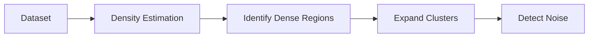
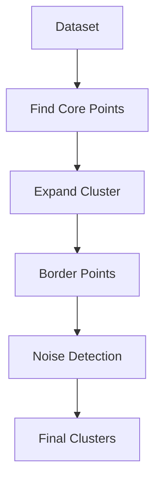

# 24. Density-Based Clustering

> Learn how Density-Based Clustering discovers clusters of arbitrary shapes, identifies noise and outliers, and overcomes many limitations of partition-based clustering algorithms such as K-Means.

---

## 🎯 Learning Objectives

After completing this chapter, you will be able to:

- Understand the concept of density-based clustering
- Learn how DBSCAN forms clusters
- Differentiate core, border, and noise points
- Understand the advantages and limitations of DBSCAN
- Learn about HDBSCAN
- Build density-based clustering models using Scikit-Learn

---

## 📖 Overview

Traditional clustering algorithms such as **K-Means** assume that clusters are roughly spherical and require the number of clusters to be specified in advance.

However, many real-world datasets contain clusters with irregular shapes, varying densities, and noisy observations.

**Density-Based Clustering** addresses these challenges by identifying dense regions of data separated by sparse regions. Instead of relying on predefined cluster centers, these algorithms automatically discover clusters based on local point density.

One of the most widely used density-based algorithms is **DBSCAN (Density-Based Spatial Clustering of Applications with Noise)**.

---

## 🧠 Core Concepts

Density-Based Clustering is based on three key ideas:

- Dense regions form clusters.
- Sparse regions separate clusters.
- Isolated observations are treated as noise or outliers.

Unlike K-Means, DBSCAN does not require the number of clusters to be specified beforehand.

---

## 🏗️ Density-Based Clustering Workflow



---

# 📘 What is DBSCAN?

DBSCAN is a density-based clustering algorithm that groups observations located in densely populated regions.

Instead of assigning every observation to a cluster, DBSCAN can classify observations as:

- Core Points
- Border Points
- Noise Points

This makes DBSCAN particularly effective for datasets containing outliers.

---

## Characteristics

- Unsupervised Learning
- Density-Based
- No need to specify K
- Detects arbitrary-shaped clusters
- Automatically identifies noise

---

# 📍 Core Concepts

DBSCAN uses two important parameters:

## Epsilon (ε)

Defines the maximum distance within which neighboring points are considered connected.

---

## Minimum Samples (MinPts)

Defines the minimum number of neighboring observations required to form a dense region.

Together, these parameters determine how clusters are discovered.

---

## Types of Points

### Core Point

A point with at least **MinPts** neighbors within the ε radius.

---

### Border Point

A point located near a core point but without enough neighboring observations to become a core point itself.

---

### Noise Point

An isolated observation that does not belong to any cluster.

These observations are often treated as anomalies or outliers.

---

## 🏗️ DBSCAN Process



---

# 📊 DBSCAN vs K-Means

| Feature | K-Means | DBSCAN |
|----------|----------|---------|
| Requires Number of Clusters | Yes | No |
| Handles Arbitrary Shapes | No | Yes |
| Detects Noise | No | Yes |
| Sensitive to Outliers | Yes | Less |
| Cluster Shape | Spherical | Arbitrary |

---

# 📈 HDBSCAN

**HDBSCAN (Hierarchical Density-Based Spatial Clustering of Applications with Noise)** is an extension of DBSCAN.

Unlike DBSCAN, HDBSCAN:

- Handles varying data densities
- Builds a hierarchy of clusters
- Automatically determines stable clusters
- Produces more robust clustering results

HDBSCAN is particularly effective for complex real-world datasets where cluster density varies.

---

## 📊 DBSCAN vs HDBSCAN

| Aspect | DBSCAN | HDBSCAN |
|---------|---------|----------|
| Density | Uniform | Variable |
| Cluster Selection | Fixed Parameters | Automatic |
| Hierarchical Clustering | No | Yes |
| Handles Varying Density | Limited | Excellent |

---

## 🌍 Real-World Applications

Density-based clustering is widely used for:

| Industry | Example Application |
|----------|---------------------|
| Banking | Fraud Detection |
| Cybersecurity | Network Intrusion Detection |
| Manufacturing | Fault Detection |
| Retail | Customer Behavior Analysis |
| Transportation | GPS Route Analysis |
| Geospatial Analytics | Hotspot Detection |
| Healthcare | Disease Pattern Discovery |
| IoT | Sensor Anomaly Detection |

---

## 🏢 Case Study

### Credit Card Fraud Detection

A financial institution wants to identify unusual customer transactions.

Available features:

- Transaction Amount
- Transaction Time
- Merchant Category
- Geographic Location

↓

DBSCAN

↓

Dense Groups

↓

Outlier Transactions

↓

Fraud Investigation

Because fraudulent transactions often appear as isolated observations, DBSCAN naturally identifies them as noise.

---

## 💻 Implementation Example

=== "DBSCAN"

```python title="dbscan.py"
from sklearn.cluster import DBSCAN

model = DBSCAN(
    eps=0.5,
    min_samples=5
)

labels = model.fit_predict(X)
```

=== "HDBSCAN"

```python title="hdbscan.py"
import hdbscan

model = hdbscan.HDBSCAN(
    min_cluster_size=10
)

labels = model.fit_predict(X)
```

---

## 🏢 Enterprise Perspective

Density-based clustering is widely adopted in production systems where datasets contain:

- Irregular cluster shapes
- Outliers
- Noise
- Unknown numbers of clusters

Unlike partition-based algorithms, DBSCAN provides greater flexibility for exploratory analytics, anomaly detection, and geospatial applications.

HDBSCAN has become increasingly popular in enterprise AI because of its ability to discover clusters across varying densities with minimal parameter tuning.

---

!!! tip "Production Insight"

    Choose DBSCAN when your dataset contains noise or irregular cluster shapes and the approximate neighborhood size is known.

    For datasets with varying densities, HDBSCAN often produces more reliable and stable clustering results.

---

## 💡 Best Practices

- Standardize numerical features before clustering.
- Carefully tune **ε (epsilon)** and **MinPts**.
- Visualize clustering results whenever possible.
- Compare DBSCAN with K-Means and Hierarchical Clustering.
- Use HDBSCAN when cluster densities vary significantly.

---

## ⚠️ Common Mistakes

- Choosing inappropriate epsilon values.
- Ignoring feature scaling.
- Using DBSCAN on extremely high-dimensional data without dimensionality reduction.
- Assuming every dataset contains meaningful density-based clusters.
- Treating all noise points as errors rather than potential anomalies.

---

## 📌 Key Takeaways

- Density-Based Clustering groups observations based on local data density.
- DBSCAN automatically discovers clusters and identifies noise.
- Core, border, and noise points define cluster formation.
- HDBSCAN extends DBSCAN by handling varying data densities.
- Density-based algorithms are widely used for anomaly detection, fraud detection, geospatial analytics, and exploratory data analysis.

---

## 📚 Further Reading

The next chapter explores **Hierarchical Clustering**, which builds nested clusters using tree-like structures and dendrograms to reveal hierarchical relationships within data.

---

## ➡️ Next Chapter

*[25. Hierarchical Clustering](25-hierarchical-clustering.md)*