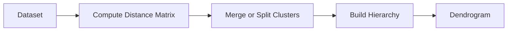

# 25. Hierarchical Clustering

> Learn how Hierarchical Clustering builds nested groups of similar observations, understand dendrograms, and explore how hierarchical relationships help discover natural structures within complex datasets.

---

## 🎯 Learning Objectives

After completing this chapter, you will be able to:

- Understand the concept of Hierarchical Clustering
- Differentiate Agglomerative and Divisive clustering
- Learn how dendrograms represent cluster hierarchies
- Understand linkage methods
- Evaluate the advantages and limitations of hierarchical clustering
- Build hierarchical clustering models using Scikit-Learn

---

## 📖 Overview

Unlike partition-based clustering algorithms such as K-Means, **Hierarchical Clustering** builds a hierarchy of nested clusters instead of creating a fixed number of groups.

The result is a **tree-like structure**, known as a **dendrogram**, which illustrates how clusters are progressively merged or divided.

Hierarchical clustering is particularly useful when the natural number of clusters is unknown or when understanding relationships between observations is more important than assigning them to predefined groups.

---

## 🧠 Core Concepts

Hierarchical Clustering organizes observations into a hierarchy.

The algorithm repeatedly:

- Measures similarity
- Merges similar clusters (Agglomerative)
- Or splits larger clusters (Divisive)

The result is a hierarchy that can be visualized using a dendrogram.

---

## 🏗️ Hierarchical Clustering Workflow



---

# 📘 What is Hierarchical Clustering?

Hierarchical Clustering is an **Unsupervised Learning** technique that creates a hierarchy of clusters rather than producing a single flat clustering solution.

Instead of requiring the number of clusters before training, it allows users to choose the desired level of clustering by cutting the dendrogram.

---

## Characteristics

- Unsupervised Learning
- Hierarchical grouping
- Tree-based representation
- No predefined number of clusters required
- Suitable for exploratory data analysis

---

# 📗 Types of Hierarchical Clustering

There are two primary approaches.

---

## Agglomerative Clustering (Bottom-Up)

Agglomerative clustering begins with each observation as an individual cluster.

The algorithm repeatedly merges the two most similar clusters until only one cluster remains or a stopping criterion is reached.

This is the most commonly used hierarchical clustering technique.

---

## Divisive Clustering (Top-Down)

Divisive clustering starts with all observations in a single cluster.

The algorithm recursively splits the dataset into smaller clusters until individual observations remain or the desired number of clusters is achieved.

Although conceptually simple, divisive clustering is computationally more expensive and less commonly used.

---

## 📊 Agglomerative vs Divisive

| Feature | Agglomerative | Divisive |
|---------|---------------|-----------|
| Approach | Bottom-Up | Top-Down |
| Initial State | One cluster per observation | One cluster containing all observations |
| Process | Merge clusters | Split clusters |
| Popularity | Very High | Moderate |
| Computational Cost | Lower | Higher |

---

## 🏗️ Hierarchical Clustering Process

```mermaid
flowchart TD

Individual Points

-->

Merge Closest Clusters

-->

Larger Clusters

-->

Single Cluster
```

---

# 📘 Dendrogram

A **dendrogram** is a tree diagram that illustrates the hierarchical relationship between clusters.

It helps visualize:

- Cluster similarity
- Merge order
- Cluster distance
- Natural cluster boundaries

By selecting a horizontal cut through the dendrogram, the desired number of clusters can be obtained.

---

## 🏗️ Dendrogram Concept

```text
                ───────────────

          ─────────      ─────────

      ─────      ────

   A     B     C     D
```

The height of each merge indicates the distance between the merged clusters.

---

# 📈 Linkage Methods

Hierarchical clustering requires a strategy for measuring the distance between clusters.

Common linkage methods include:

- Single Linkage
- Complete Linkage
- Average Linkage
- Ward Linkage

Each method produces different clustering structures.

---

## Single Linkage

Measures the shortest distance between observations in two clusters.

Advantages:

- Detects elongated clusters

Limitations:

- Sensitive to chaining effects

---

## Complete Linkage

Measures the maximum distance between observations.

Advantages:

- Produces compact clusters

Limitations:

- Sensitive to outliers

---

## Average Linkage

Uses the average pairwise distance between observations.

Advantages:

- Balanced clustering
- Less sensitive to noise

---

## Ward Linkage

Merges clusters that result in the smallest increase in within-cluster variance.

Advantages:

- Produces compact and balanced clusters
- Often performs well with numerical datasets

---

## 📊 Linkage Method Comparison

| Linkage | Distance Calculation | Typical Characteristics |
|----------|----------------------|--------------------------|
| Single | Minimum Distance | Elongated Clusters |
| Complete | Maximum Distance | Compact Clusters |
| Average | Average Distance | Balanced Clusters |
| Ward | Variance Minimization | Compact & Spherical Clusters |

---

## 🌍 Real-World Applications

Hierarchical Clustering is widely used in:

| Industry | Example Application |
|----------|---------------------|
| Biology | Gene Expression Analysis |
| Healthcare | Disease Classification |
| Marketing | Customer Segmentation |
| Finance | Portfolio Analysis |
| Cybersecurity | Malware Grouping |
| Retail | Product Categorization |
| Document Analysis | Topic Discovery |
| Social Networks | Community Detection |

---

## 🏢 Case Study

### Customer Behavior Analysis

A retail organization wants to understand relationships between customers.

Available features:

- Annual Income
- Purchase Frequency
- Spending Score
- Product Categories

↓

Hierarchical Clustering

↓

Dendrogram

↓

Customer Groups

Business analysts can visualize customer relationships before deciding how many customer segments to create.

---

## 💻 Implementation Example

=== "Agglomerative Clustering"

```python title="agglomerative_clustering.py"
from sklearn.cluster import AgglomerativeClustering

model = AgglomerativeClustering(
    n_clusters=4,
    linkage="ward"
)

labels = model.fit_predict(X)
```

=== "Dendrogram"

```python title="dendrogram.py"
from scipy.cluster.hierarchy import dendrogram, linkage
import matplotlib.pyplot as plt

Z = linkage(X, method="ward")

dendrogram(Z)

plt.show()
```

---

## 🏢 Enterprise Perspective

Hierarchical clustering is frequently used during exploratory data analysis when analysts need to understand natural relationships within data.

Typical enterprise applications include:

- Customer segmentation
- Product taxonomy
- Biomedical research
- Knowledge discovery
- Recommendation systems
- Organizational structure analysis

Although hierarchical clustering provides excellent interpretability, it becomes computationally expensive for very large datasets.

---

!!! tip "Production Insight"

    Hierarchical Clustering is ideal when the number of clusters is unknown and understanding relationships between observations is more important than maximizing scalability.

    For large datasets, organizations often use K-Means or DBSCAN because of their lower computational cost.

---

## 💡 Best Practices

- Standardize numerical features before clustering.
- Compare different linkage methods.
- Use dendrograms to determine meaningful cluster boundaries.
- Validate clustering results with domain knowledge.
- Apply dimensionality reduction for high-dimensional datasets.

---

## ⚠️ Common Mistakes

- Applying hierarchical clustering to extremely large datasets.
- Choosing linkage methods without experimentation.
- Ignoring feature scaling.
- Interpreting every dendrogram branch as a meaningful cluster.
- Assuming hierarchical clustering always produces the optimal grouping.

---

## 📌 Key Takeaways

- Hierarchical Clustering builds nested clusters rather than flat partitions.
- Agglomerative clustering merges observations from the bottom up.
- Divisive clustering splits observations from the top down.
- Dendrograms visualize hierarchical relationships.
- Linkage methods influence cluster formation.
- Hierarchical clustering is valuable for exploratory analysis and understanding data relationships.

---

## 📚 Further Reading

The next chapter introduces **Dimensionality Reduction Fundamentals**, explaining why reducing the number of features is essential for visualization, computational efficiency, and improving Machine Learning performance.

---

## ➡️ Next Chapter

*[26. Dimensionality Reduction Fundamentals](26-dimensionality-reduction-fundamentals.md)*