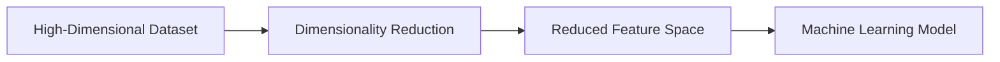

# 26. Dimensionality Reduction Fundamentals

> Learn why Dimensionality Reduction is essential in Machine Learning, understand the challenges of high-dimensional data, and explore the techniques used to simplify datasets while preserving meaningful information.

---

## 🎯 Learning Objectives

After completing this chapter, you will be able to:

- Understand what Dimensionality Reduction is
- Learn why high-dimensional data creates challenges
- Understand the Curse of Dimensionality
- Differentiate Feature Selection and Feature Extraction
- Explore common Dimensionality Reduction techniques
- Identify enterprise applications of dimensionality reduction

---

## 📖 Overview

Modern datasets often contain hundreds or even thousands of features.

While more features may appear beneficial, they frequently introduce redundancy, noise, increased computational cost, and reduced model performance.

**Dimensionality Reduction** addresses these challenges by reducing the number of features while preserving as much useful information as possible.

It improves computational efficiency, simplifies visualization, reduces overfitting, and often enhances Machine Learning model performance.

---

## 🧠 Core Concepts

Dimensionality Reduction aims to:

- Reduce the number of input features
- Preserve meaningful information
- Remove redundant features
- Improve computational efficiency
- Simplify visualization
- Reduce model complexity

It is widely used as a preprocessing step before clustering, classification, and regression.

---

## 🏗️ Dimensionality Reduction Workflow



---

# 📘 What is Dimensionality Reduction?

Dimensionality Reduction is the process of transforming a dataset with many features into a smaller set of representative features while retaining the most important information.

Instead of working with hundreds of variables, Machine Learning algorithms operate on a smaller and more informative feature space.

---

## Characteristics

- Reduces feature count
- Removes redundancy
- Improves efficiency
- Simplifies visualization
- Helps improve generalization

---

# 📊 Why Reduce Dimensions?

High-dimensional datasets introduce several challenges.

Common problems include:

- Increased computational cost
- Slower training
- Difficult visualization
- Higher storage requirements
- Greater risk of overfitting
- Redundant information

Reducing dimensionality simplifies learning while preserving valuable patterns.

---

## Benefits

| Benefit | Description |
|----------|-------------|
| Faster Training | Less computation |
| Lower Memory Usage | Smaller datasets |
| Better Visualization | Easier exploration |
| Reduced Noise | Improved model quality |
| Better Generalization | Lower overfitting risk |

---

# 📗 The Curse of Dimensionality

As the number of features increases, data becomes increasingly sparse.

This phenomenon is known as the **Curse of Dimensionality**.

Challenges include:

- Distance measures become less meaningful.
- Data sparsity increases.
- More training data is required.
- Computational complexity grows rapidly.
- Many algorithms perform less effectively.

This is one of the primary motivations for dimensionality reduction.

---

## 🏗️ Curse of Dimensionality

```mermaid
flowchart LR

More Features

--> Higher Complexity

--> Sparse Data

--> Reduced Model Performance
```

---

# 📈 Feature Selection vs Feature Extraction

Dimensionality Reduction can be achieved in two ways.

---

## Feature Selection

Feature Selection keeps the most important original features while removing irrelevant or redundant ones.

Examples:

- Correlation Analysis
- Recursive Feature Elimination (RFE)
- Tree-Based Feature Importance

---

## Feature Extraction

Feature Extraction creates entirely new features by combining information from existing features.

Examples:

- Principal Component Analysis (PCA)
- t-SNE
- UMAP
- Autoencoders

---

## 📊 Feature Selection vs Feature Extraction

| Feature Selection | Feature Extraction |
|-------------------|--------------------|
| Keeps original features | Creates new features |
| Easier to interpret | Lower interpretability |
| Removes redundant variables | Combines information |
| Faster implementation | Often higher compression |

---

# 📘 Common Dimensionality Reduction Techniques

Several techniques are widely used in Machine Learning.

| Technique | Primary Purpose |
|-----------|-----------------|
| PCA | Linear Feature Extraction |
| t-SNE | Data Visualization |
| UMAP | Visualization & Manifold Learning |
| Autoencoders | Deep Learning Compression |

The following chapters explore these techniques in detail.

---

## 🌍 Real-World Applications

Dimensionality Reduction is widely used across industries.

| Industry | Example Application |
|----------|---------------------|
| Healthcare | Medical Image Analysis |
| Finance | Risk Modeling |
| Retail | Customer Behavior Analysis |
| Cybersecurity | Intrusion Detection |
| Manufacturing | Sensor Data Compression |
| Bioinformatics | Gene Expression Analysis |
| Computer Vision | Image Processing |
| NLP | Text Embedding Visualization |

---

## 🏢 Case Study

### Customer Analytics

A retail organization stores over 500 customer attributes.

Many of these variables are highly correlated.

↓

Dimensionality Reduction

↓

Compact Feature Representation

↓

Clustering Model

↓

Customer Segments

The simplified feature space enables faster clustering while preserving meaningful customer relationships.

---

## 💻 Implementation Example

=== "Principal Component Analysis"

```python title="pca_preprocessing.py"
from sklearn.decomposition import PCA

pca = PCA(n_components=2)

X_reduced = pca.fit_transform(X)
```

=== "Pipeline"

```python title="pipeline.py"
from sklearn.pipeline import Pipeline
from sklearn.preprocessing import StandardScaler
from sklearn.decomposition import PCA

pipeline = Pipeline([
    ("scaler", StandardScaler()),
    ("pca", PCA(n_components=5))
])

X_transformed = pipeline.fit_transform(X)
```

---

## 🏢 Enterprise Perspective

Dimensionality Reduction is commonly used before training Machine Learning models on high-dimensional datasets.

Typical enterprise applications include:

- Customer analytics
- Recommendation systems
- Fraud detection
- Image recognition
- Natural Language Processing
- Predictive maintenance
- Data visualization

Modern AI platforms frequently combine dimensionality reduction with feature engineering and automated ML pipelines to improve scalability and model performance.

---

!!! tip "Production Insight"

    Dimensionality Reduction is not just about reducing computational cost—it also helps remove noise, improve generalization, and simplify complex datasets for downstream Machine Learning tasks.

    Choose the technique based on your objective: interpretability, visualization, computational efficiency, or predictive performance.

---

## 💡 Best Practices

- Standardize numerical features before feature extraction.
- Remove irrelevant features before applying advanced techniques.
- Select the number of dimensions based on explained variance or business requirements.
- Evaluate model performance before and after dimensionality reduction.
- Combine dimensionality reduction with feature engineering where appropriate.

---

## ⚠️ Common Mistakes

- Applying dimensionality reduction without understanding the business objective.
- Removing too many features and losing important information.
- Using visualization techniques for predictive modeling.
- Ignoring feature scaling before PCA.
- Assuming fewer features always produce better models.

---

## 📌 Key Takeaways

- Dimensionality Reduction simplifies high-dimensional datasets.
- It improves computational efficiency and reduces overfitting.
- The Curse of Dimensionality motivates reducing feature space.
- Feature Selection removes unnecessary features.
- Feature Extraction creates new compact representations.
- PCA, t-SNE, and UMAP are among the most widely used dimensionality reduction techniques.

---

## 📚 Further Reading

The next chapter explores **Principal Component Analysis (PCA)**, one of the most widely used linear dimensionality reduction techniques for feature extraction and data compression.

---

## ➡️ Next Chapter

*[27. Principal Component Analysis (PCA)](27-principal-component-analysis-pca.md)*