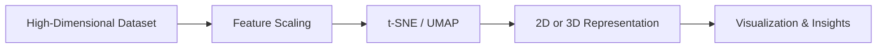

# 28. t-SNE and UMAP

> Learn how t-SNE and UMAP transform high-dimensional datasets into low-dimensional representations, enabling intuitive visualization of complex data while preserving meaningful relationships between observations.

---

## 🎯 Learning Objectives

After completing this chapter, you will be able to:

- Understand why nonlinear dimensionality reduction is needed
- Learn how t-SNE works
- Understand the principles of UMAP
- Compare PCA, t-SNE, and UMAP
- Visualize high-dimensional datasets
- Select the appropriate visualization technique for different use cases

---

## 📖 Overview

While **Principal Component Analysis (PCA)** is highly effective for linear dimensionality reduction, many real-world datasets contain **nonlinear relationships** that PCA cannot fully capture.

Two of the most popular nonlinear dimensionality reduction techniques are:

- **t-Distributed Stochastic Neighbor Embedding (t-SNE)**
- **Uniform Manifold Approximation and Projection (UMAP)**

These algorithms are designed primarily for **visualization**, helping data scientists understand the structure of high-dimensional datasets by projecting them into two or three dimensions while preserving local relationships between data points.

---

## 🧠 Core Concepts

Both t-SNE and UMAP aim to:

- Reduce dimensionality
- Preserve local neighborhood structures
- Visualize high-dimensional data
- Reveal hidden clusters and patterns
- Support exploratory data analysis

Unlike PCA, they are **nonlinear** dimensionality reduction techniques.

---

## 🏗️ Visualization Workflow



---

# 📘 Why Nonlinear Dimensionality Reduction?

High-dimensional datasets often contain complex nonlinear relationships.

Examples include:

- Image embeddings
- Text embeddings
- Gene expression data
- Customer behavior patterns

Linear techniques such as PCA may fail to preserve these relationships.

Nonlinear methods can reveal hidden structures that are difficult to observe using traditional feature extraction techniques.

---

## Benefits

- Better visualization
- Reveals hidden clusters
- Preserves neighborhood relationships
- Supports exploratory analysis
- Improves understanding of complex datasets

---

# 📗 t-Distributed Stochastic Neighbor Embedding (t-SNE)

**t-SNE** is a nonlinear dimensionality reduction algorithm designed specifically for data visualization.

Instead of preserving global distances, t-SNE focuses on preserving **local neighborhoods**, ensuring that similar observations remain close together in the lower-dimensional representation.

This makes it particularly useful for discovering hidden clusters.

---

## Characteristics

- Nonlinear dimensionality reduction
- Excellent cluster visualization
- Preserves local similarity
- Computationally expensive
- Primarily used for visualization

---

## How t-SNE Works

The algorithm:

1. Measures similarities between observations in the original feature space.
2. Maps observations into a lower-dimensional space.
3. Minimizes differences between neighborhood relationships.

The result is a visualization where similar observations remain close together.

---

## 🏗️ t-SNE Workflow

```mermaid
flowchart TD

High-Dimensional Data

-->

Neighborhood Similarities

-->

Low-Dimensional Mapping

-->

Cluster Visualization
```

---

# 📙 Uniform Manifold Approximation and Projection (UMAP)

UMAP is a modern nonlinear dimensionality reduction technique that preserves both **local** and **global** data structures more effectively than t-SNE.

Compared to t-SNE, UMAP is:

- Faster
- More scalable
- Better at preserving overall data structure
- Suitable for larger datasets

UMAP has become increasingly popular for visualizing embeddings generated by deep learning models.

---

## Characteristics

- Nonlinear dimensionality reduction
- Faster than t-SNE
- Scales well to large datasets
- Preserves local and global relationships
- Widely used in modern AI applications

---

## 🏗️ UMAP Workflow

```mermaid
flowchart TD

High-Dimensional Data

-->

Graph Construction

-->

Manifold Approximation

-->

Low-Dimensional Embedding
```

---

# 📊 PCA vs t-SNE vs UMAP

| Feature | PCA | t-SNE | UMAP |
|---------|-----|--------|------|
| Technique | Linear | Nonlinear | Nonlinear |
| Primary Purpose | Feature Extraction | Visualization | Visualization & Embedding |
| Preserves Global Structure | Excellent | Limited | Good |
| Preserves Local Structure | Moderate | Excellent | Excellent |
| Computational Speed | Fast | Slow | Fast |
| Scalability | Excellent | Moderate | Excellent |

---

# 📈 Choosing the Right Technique

Choose the dimensionality reduction technique based on your objective.

| Goal | Recommended Technique |
|------|-----------------------|
| Feature Extraction | PCA |
| Exploratory Visualization | t-SNE |
| Large Dataset Visualization | UMAP |
| Deep Learning Embeddings | UMAP |
| Fast Projection | PCA |

---

## 🌍 Real-World Applications

Nonlinear dimensionality reduction is widely used across industries.

| Industry | Example Application |
|----------|---------------------|
| Computer Vision | Image Embedding Visualization |
| Healthcare | Patient Similarity Analysis |
| Bioinformatics | Gene Expression Visualization |
| NLP | Word and Sentence Embeddings |
| Retail | Customer Segmentation |
| Cybersecurity | Threat Pattern Analysis |
| Finance | Fraud Investigation |
| Recommendation Systems | User Behavior Visualization |

---

## 🏢 Case Study

### Visualizing Customer Embeddings

An e-commerce platform generates high-dimensional customer embeddings from browsing and purchasing behavior.

↓

Feature Scaling

↓

UMAP

↓

2D Visualization

↓

Customer Segments

Analysts can visually identify distinct customer groups, discover outliers, and gain insights into customer behavior.

---

## 💻 Implementation Example

=== "t-SNE"

```python title="tsne.py"
from sklearn.manifold import TSNE

tsne = TSNE(
    n_components=2,
    random_state=42
)

X_tsne = tsne.fit_transform(X)
```

=== "UMAP"

```python title="umap.py"
import umap

reducer = umap.UMAP(
    n_components=2,
    random_state=42
)

X_umap = reducer.fit_transform(X)
```

=== "Visualization"

```python title="visualize_embeddings.py"
import matplotlib.pyplot as plt

plt.scatter(
    X_umap[:, 0],
    X_umap[:, 1]
)

plt.title("UMAP Projection")
plt.show()
```

---

## 🏢 Enterprise Perspective

Modern AI systems frequently use UMAP and t-SNE to visualize:

- Deep Learning embeddings
- Customer behavior
- Recommendation systems
- Text embeddings
- Image feature vectors
- Fraud detection patterns

While these techniques are excellent for exploratory analysis, they are generally **not used directly as preprocessing steps for predictive Machine Learning models**, unlike PCA.

---

!!! tip "Production Insight"

    Use **PCA** when you need dimensionality reduction for model training, compression, or feature engineering.

    Use **t-SNE** and **UMAP** when your primary objective is to **visualize** high-dimensional data and explore hidden patterns rather than generate features for predictive models.

---

## 💡 Best Practices

- Standardize numerical features before applying t-SNE or UMAP.
- Use PCA first when working with extremely high-dimensional datasets.
- Experiment with algorithm parameters for optimal visualization.
- Validate discovered clusters using domain knowledge.
- Use UMAP for large datasets requiring faster computation.

---

## ⚠️ Common Mistakes

- Using t-SNE or UMAP as replacement features for predictive models.
- Comparing distances between distant clusters in t-SNE plots.
- Ignoring feature scaling.
- Assuming visual clusters always represent meaningful business groups.
- Using default parameters without experimentation.

---

## 📌 Key Takeaways

- t-SNE and UMAP are nonlinear dimensionality reduction techniques.
- Both are designed primarily for visualization and exploratory analysis.
- t-SNE excels at preserving local neighborhood structures.
- UMAP provides faster computation and better scalability while preserving both local and global relationships.
- PCA, t-SNE, and UMAP serve different purposes and should be selected based on the problem being solved.

---

## 📚 Further Reading

The next chapter explores **Clustering for Feature Engineering**, demonstrating how clustering can create meaningful features that improve downstream Machine Learning models.

---

## ➡️ Next Chapter

*[29. Clustering for Feature Engineering](29-clustering-for-feature-engineering.md)*