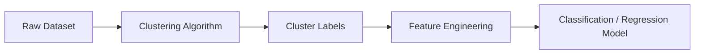

# 29. Clustering for Feature Engineering

> Learn how clustering can be used to create meaningful features, improve predictive models, and enhance Machine Learning performance by uncovering hidden patterns within unlabeled data.

---

## 🎯 Learning Objectives

After completing this chapter, you will be able to:

- Understand clustering-based feature engineering
- Learn how cluster labels become predictive features
- Understand feature augmentation using clustering
- Explore real-world applications
- Build clustering-based feature engineering pipelines
- Apply clustering in enterprise Machine Learning workflows

---

## 📖 Overview

Clustering is commonly viewed as an exploratory analysis technique, but it also plays an important role in **Feature Engineering**.

Instead of using clusters as the final output, Machine Learning practitioners often use **cluster assignments as additional input features** for supervised learning models.

These engineered features capture hidden relationships within the data, enabling models to make more accurate predictions while reducing the need for manual feature design.

This approach is widely used in customer analytics, recommendation systems, fraud detection, marketing, and predictive maintenance.

---

## 🧠 Core Concepts

Clustering-based feature engineering involves:

- Discovering hidden groups
- Assigning cluster labels
- Using cluster IDs as new features
- Enhancing existing feature sets
- Improving downstream predictive models

The clustering algorithm itself is unsupervised, but the generated features are often used in supervised learning.

---

## 🏗️ Feature Engineering Workflow



---

# 📘 Why Use Clustering for Feature Engineering?

Many datasets contain hidden structures that traditional features cannot explicitly represent.

Clustering identifies these hidden relationships and converts them into meaningful features.

Benefits include:

- Better feature representation
- Improved model accuracy
- Reduced manual feature engineering
- Discovery of latent customer behavior
- Better segmentation for predictive models

---

## Example

Original Features:

- Age
- Income
- Spending Score

↓

K-Means Clustering

↓

Cluster ID

↓

Final Feature Set:

- Age
- Income
- Spending Score
- Customer Cluster

---

# 📊 Cluster Labels as Features

The simplest approach is to assign each observation to a cluster and use the **cluster label** as a new categorical feature.

Example:

| Customer | Income | Spending | Cluster |
|-----------|--------|-----------|---------|
| A | 40K | Low | 0 |
| B | 95K | High | 2 |
| C | 62K | Medium | 1 |

The supervised model can now learn different behaviors for different customer groups.

---

## 🏗️ Cluster Feature Generation

```mermaid
flowchart TD

Customer Data

-->

K-Means

-->

Cluster Labels

-->

New Feature

-->

Prediction Model
```

---

# 📈 Feature Augmentation

Rather than replacing existing features, clustering typically **augments** the dataset.

Common engineered features include:

- Cluster ID
- Distance to Cluster Centroid
- Cluster Density
- Cluster Probability
- Number of Nearby Neighbors

These features often provide valuable information that was not explicitly available in the original dataset.

---

## 📊 Types of Cluster-Based Features

| Feature | Description |
|----------|-------------|
| Cluster Label | Assigned cluster ID |
| Distance to Centroid | Similarity to cluster center |
| Cluster Density | Density of surrounding observations |
| Membership Probability | Confidence of cluster assignment |
| Neighbor Count | Local neighborhood size |

---

# 📘 Feature Engineering Pipeline

A typical workflow includes:

1. Prepare the dataset.
2. Apply clustering.
3. Generate cluster-based features.
4. Combine new and original features.
5. Train the predictive model.
6. Evaluate performance improvements.

---

## 🏗️ Pipeline

```mermaid
flowchart LR

Dataset

-->

Feature Scaling

-->

Clustering

-->

Cluster Features

-->

Supervised Model

-->

Predictions
```

---

## 🌍 Real-World Applications

Clustering-based feature engineering is widely used in production systems.

| Industry | Example Application |
|----------|---------------------|
| Banking | Credit Risk Prediction |
| Retail | Customer Segmentation |
| Healthcare | Patient Risk Groups |
| Insurance | Claim Classification |
| Manufacturing | Equipment Monitoring |
| Marketing | Personalized Campaigns |
| Telecommunications | Customer Churn Prediction |
| E-Commerce | Product Recommendation |

---

## 🏢 Case Study

### Customer Churn Prediction

A telecommunications company wants to predict customer churn.

Original Features:

- Monthly Charges
- Contract Length
- Internet Usage
- Customer Support Calls

↓

K-Means Clustering

↓

Customer Segment Feature

↓

Gradient Boosting Model

↓

Improved Churn Prediction

Adding customer segment information enables the model to learn behavioral patterns that were not directly represented by the original features.

---

## 💻 Implementation Example

=== "Generate Cluster Features"

```python title="cluster_features.py"
from sklearn.cluster import KMeans

kmeans = KMeans(
    n_clusters=4,
    random_state=42
)

X["cluster"] = kmeans.fit_predict(X)
```

=== "Distance to Centroid"

```python title="distance_to_centroid.py"
distances = kmeans.transform(X)

X["distance_to_cluster"] = distances.min(axis=1)
```

=== "Training Pipeline"

```python title="feature_engineering_pipeline.py"
from sklearn.pipeline import Pipeline
from sklearn.preprocessing import StandardScaler
from sklearn.ensemble import RandomForestClassifier

pipeline = Pipeline([
    ("scaler", StandardScaler()),
    ("classifier", RandomForestClassifier())
])

pipeline.fit(X_train, y_train)
```

---

## 🏢 Enterprise Perspective

Feature engineering remains one of the most important contributors to Machine Learning performance.

Enterprise AI teams frequently use clustering-generated features to improve:

- Customer segmentation models
- Fraud detection systems
- Recommendation engines
- Marketing analytics
- Predictive maintenance
- Risk assessment models

Rather than replacing predictive algorithms, clustering enriches the dataset by providing additional behavioral and structural information.

---

!!! tip "Production Insight"

    Cluster labels should be treated like any other engineered feature.

    Always evaluate whether the additional clustering features improve validation performance before including them in production pipelines.

---

## 💡 Best Practices

- Scale features before clustering.
- Experiment with multiple clustering algorithms.
- Validate engineered features using cross-validation.
- Retrain clustering models as data evolves.
- Combine clustering features with domain knowledge.

---

## ⚠️ Common Mistakes

- Assuming cluster labels always improve predictive performance.
- Using clustering features without validating their impact.
- Ignoring feature scaling before clustering.
- Training clustering models on inconsistent datasets.
- Forgetting to regenerate cluster features during inference.

---

## 📌 Key Takeaways

- Clustering can be used as a powerful feature engineering technique.
- Cluster labels and distances provide valuable predictive information.
- Feature augmentation often improves downstream supervised learning models.
- Clustering-based features are widely used in customer analytics, fraud detection, and recommendation systems.
- Always validate engineered features before deploying them to production.

---

## 📚 Further Reading

The next chapter concludes this module by exploring how to design, deploy, and monitor **Production-Ready Unsupervised Learning Systems** using enterprise AI engineering and MLOps best practices.

---

## ➡️ Next Chapter

*[30. Building Production Unsupervised Learning Systems](30-building-production-unsupervised-learning-systems.md)*