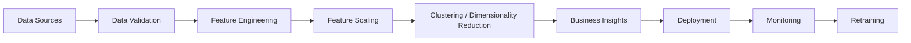

# 30. Building Production Unsupervised Learning Systems

> Learn how Unsupervised Learning models are designed, deployed, monitored, and maintained in enterprise environments, enabling organizations to discover hidden patterns, detect anomalies, and generate business insights at scale.

---

## 🎯 Learning Objectives

After completing this chapter, you will be able to:

- Understand the lifecycle of production Unsupervised Learning systems
- Learn how to select appropriate clustering and dimensionality reduction techniques
- Design scalable unsupervised learning pipelines
- Deploy clustering and anomaly detection models
- Monitor model quality over time
- Apply enterprise MLOps best practices for unsupervised learning

---

## 📖 Overview

Unlike supervised Machine Learning, Unsupervised Learning does not rely on labeled data or predefined target variables.

Instead, these systems continuously analyze large volumes of data to discover hidden structures, customer segments, anomalies, and relationships.

In production environments, organizations use unsupervised learning for customer segmentation, fraud detection, recommendation systems, anomaly detection, feature engineering, and exploratory analytics.

Building reliable production systems requires far more than choosing a clustering algorithm—it involves scalable data pipelines, continuous monitoring, model versioning, automated retraining, and close collaboration with business stakeholders.

---

## 🧠 Core Concepts

A production Unsupervised Learning system typically includes:

- Data Collection
- Data Validation
- Feature Engineering
- Feature Scaling
- Clustering or Dimensionality Reduction
- Business Interpretation
- Deployment
- Monitoring
- Continuous Improvement

Since there are no ground-truth labels, success is measured through evaluation metrics, business impact, and domain validation.

---

## 🏗️ Production Workflow



---

# 📘 Choosing the Right Algorithm

Different business problems require different unsupervised learning techniques.

Selection depends on:

- Dataset size
- Feature dimensions
- Cluster shape
- Presence of noise
- Computational requirements
- Interpretability
- Business objectives

---

## 📊 Algorithm Selection Guide

| Algorithm | Best For | Limitations |
|-----------|----------|-------------|
| K-Means | Compact customer segments | Requires predefined K |
| DBSCAN | Noise detection & irregular clusters | Sensitive to parameter selection |
| Hierarchical Clustering | Relationship analysis | Expensive for large datasets |
| PCA | Feature extraction & compression | Linear relationships only |
| t-SNE | Data visualization | Slow on large datasets |
| UMAP | Large-scale visualization | Primarily exploratory |

---

# 📗 Production Pipeline

A production unsupervised learning pipeline automates the entire analytical workflow.

Typical stages include:

1. Collect data
2. Validate data quality
3. Prepare features
4. Scale numerical features
5. Train clustering or dimensionality reduction model
6. Generate business insights
7. Deploy model
8. Monitor data drift
9. Retrain when required

Automation ensures reproducibility and scalability.

---

## 🏗️ Pipeline Architecture

```mermaid
flowchart TD

Raw Data

↓

Validation

↓

Feature Engineering

↓

Scaling

↓

Unsupervised Learning

↓

Business Insights

↓

Deployment

↓

Monitoring
```

---

# 📊 Deployment Strategies

Unlike supervised models that predict labels, unsupervised models often generate:

- Customer segments
- Cluster assignments
- Anomaly scores
- Feature embeddings
- Similarity scores

Common deployment strategies include:

- Batch Processing
- Real-Time APIs
- Streaming Analytics
- Feature Generation Pipelines

---

## Deployment Patterns

| Deployment Type | Typical Use Case |
|-----------------|------------------|
| Batch Processing | Customer Segmentation |
| Real-Time API | Fraud Detection |
| Streaming Analytics | IoT Monitoring |
| Feature Engineering | Recommendation Systems |

---

# 📈 Monitoring Unsupervised Models

Monitoring is challenging because no ground-truth labels are available.

Organizations typically monitor:

- Cluster stability
- Data drift
- Feature drift
- Cluster population changes
- Silhouette Score
- Business KPIs

Significant changes may indicate the need for model retraining.

---

## 🏗️ Monitoring Workflow

```mermaid
flowchart LR

Production Data

--> Drift Detection

--> Cluster Monitoring

--> Quality Metrics

--> Alerts

--> Retraining
```

---

# 📌 Model Retraining

Business environments evolve continuously.

Customer behavior, transaction patterns, and operational processes change over time.

Models should be retrained when:

- Data distributions change
- Cluster quality degrades
- Business requirements evolve
- New products or services are introduced
- Scheduled retraining cycles occur

Regular retraining helps maintain meaningful clustering results.

---

# 📙 MLOps for Unsupervised Learning

Modern MLOps practices improve the reliability and maintainability of production systems.

Typical practices include:

- Dataset versioning
- Feature versioning
- Automated preprocessing
- Pipeline orchestration
- Model registry
- Continuous monitoring
- Automated retraining

These practices ensure reproducibility and operational efficiency.

---

## 🌍 Real-World Applications

Production Unsupervised Learning systems support many industries.

| Industry | Example Application |
|----------|---------------------|
| Banking | Fraud & Risk Analysis |
| Retail | Customer Segmentation |
| Healthcare | Patient Similarity Analysis |
| Manufacturing | Predictive Maintenance |
| Telecommunications | User Behavior Analysis |
| Cybersecurity | Network Anomaly Detection |
| Logistics | Route Optimization |
| E-Commerce | Recommendation Systems |

---

## 🏢 Case Study

### Personalized Customer Segmentation

A global retailer collects millions of customer interactions daily.

Workflow:

Customer Data

↓

Feature Engineering

↓

K-Means Clustering

↓

Customer Segments

↓

Personalized Marketing Campaigns

As customer behavior changes, the clustering model is periodically retrained to ensure the generated segments remain relevant.

---

## 💻 Implementation Example

=== "Training"

```python title="train_clustering_model.py"
from sklearn.cluster import KMeans

model = KMeans(
    n_clusters=5,
    random_state=42
)

model.fit(X_train)
```

=== "Inference"

```python title="predict_cluster.py"
cluster = model.predict(customer_features)

print(cluster)
```

=== "Pipeline"

```python title="unsupervised_pipeline.py"
from sklearn.pipeline import Pipeline
from sklearn.preprocessing import StandardScaler
from sklearn.cluster import KMeans

pipeline = Pipeline([
    ("scaler", StandardScaler()),
    ("kmeans", KMeans(n_clusters=5))
])

pipeline.fit(X_train)
```

---

## 🏢 Enterprise Architecture

```mermaid
flowchart LR

Users

--> Data Pipeline

Data Pipeline

--> Feature Store

Feature Store

--> Clustering Service

Clustering Service

--> Business Applications

Clustering Service

--> Monitoring

Monitoring

--> Dashboard

Monitoring

--> Alerting
```

---

## 🏢 Enterprise Perspective

Enterprise AI teams frequently use unsupervised learning as the foundation for downstream analytics.

Typical production use cases include:

- Customer segmentation
- Recommendation engines
- Fraud detection
- Anomaly detection
- Feature engineering
- Data exploration
- Knowledge discovery

Unlike supervised models, success is often measured through business impact rather than prediction accuracy alone. Close collaboration between data scientists, ML engineers, and business stakeholders is essential to ensure that discovered patterns translate into actionable insights.

---

!!! tip "Production Insight"

    The value of an unsupervised learning model lies not only in discovering patterns but also in ensuring those patterns remain stable, interpretable, and actionable as data evolves.

    Continuous monitoring and periodic retraining are essential for maintaining long-term business value.

---

## 💡 Best Practices

- Standardize features before clustering.
- Compare multiple clustering algorithms.
- Validate clusters using quantitative metrics and domain expertise.
- Monitor cluster quality over time.
- Version datasets, features, and models.
- Automate retraining and deployment pipelines.

---

## ⚠️ Common Mistakes

- Assuming discovered clusters are always meaningful.
- Ignoring data drift after deployment.
- Choosing algorithms without understanding data characteristics.
- Evaluating clustering using only one metric.
- Forgetting to regenerate embeddings or cluster assignments during inference.

---

## 📌 Key Takeaways

- Production Unsupervised Learning systems require robust engineering practices beyond algorithm selection.
- Algorithm choice depends on data characteristics and business objectives.
- Monitoring focuses on cluster stability, drift detection, and business impact.
- MLOps practices improve scalability, reproducibility, and maintainability.
- Successful enterprise AI systems combine unsupervised learning with continuous monitoring, retraining, and business validation.

---

## 🎉 Module Complete

Congratulations! You have completed the **Building Unsupervised Learning Models** module.

You now understand:

- Unsupervised Learning Fundamentals
- Clustering Fundamentals
- K-Means Clustering
- Density-Based Clustering
- Hierarchical Clustering
- Dimensionality Reduction Fundamentals
- Principal Component Analysis (PCA)
- t-SNE and UMAP
- Clustering for Feature Engineering
- Building Production Unsupervised Learning Systems

These concepts provide a strong foundation for advanced topics such as **Recommendation Systems, Deep Learning, Representation Learning, Generative AI, Retrieval-Augmented Generation (RAG), and Agentic AI**.

---

## ➡️ Next Chapter

*[31. Model Evaluation Fundamentals](31-model-evaluation-fundamentals.md)*