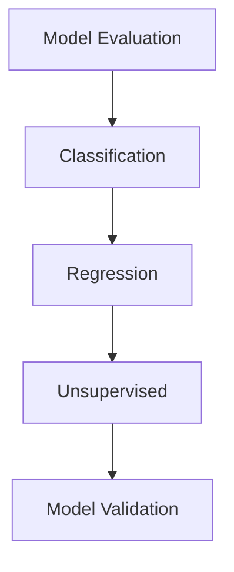

# 31. Model Evaluation Fundamentals

> Learn why model evaluation is essential in Machine Learning, understand how to measure model performance on unseen data, and explore the evaluation strategies used to build reliable production AI systems.

---

## 🎯 Learning Objectives

After completing this chapter, you will be able to:

- Understand the purpose of model evaluation
- Differentiate training, validation, and testing
- Learn why evaluating on unseen data is important
- Understand common evaluation workflows
- Recognize the relationship between evaluation and model generalization
- Prepare for classification, regression, and unsupervised evaluation techniques

---

## 📖 Overview

Building a Machine Learning model is only the first step.

A model must also be evaluated to determine **how well it performs on unseen data** and whether it can generalize beyond the training dataset. Model evaluation compares predictions against expected outcomes (for supervised learning) or assesses the quality of discovered patterns (for unsupervised learning). Proper evaluation is essential for selecting the best model, preventing overfitting, and ensuring reliable deployment in production environments. :contentReference[oaicite:0]{index=0}

---

## 🧠 Core Concepts

Model evaluation helps answer important questions:

- Is the model learning meaningful patterns?
- Does it generalize to unseen data?
- Which model performs best?
- Is the model ready for production?
- Does the model require further improvement?

Evaluation is a continuous process throughout the Machine Learning lifecycle.

---

## 🏗️ Model Evaluation Workflow


---

# 📘 Why Model Evaluation Matters

A model that performs well on training data may perform poorly on new, unseen data.

Proper evaluation helps:

- Measure model quality
- Compare multiple models
- Detect overfitting
- Improve generalization
- Support deployment decisions

Without evaluation, it is impossible to know whether a model is truly effective. :contentReference[oaicite:1]{index=1}

---

## Benefits

- Reliable model comparison
- Better decision making
- Reduced deployment risk
- Improved prediction quality
- Increased confidence in production

---

# 📊 Training, Validation, and Testing

A dataset is typically divided into separate subsets to evaluate model performance fairly.

| Dataset | Purpose |
|----------|---------|
| Training Set | Learn model parameters |
| Validation Set | Tune models and hyperparameters |
| Test Set | Final unbiased evaluation |

Using separate datasets helps estimate how well a model will perform on future data. Proper model validation avoids evaluating the model on the test set before optimization is complete. :contentReference[oaicite:2]{index=2}

---

## 🏗️ Data Splitting Process

```mermaid
flowchart LR

Dataset

--> Training Set

Dataset

--> Validation Set

Dataset

--> Test Set

```

---

# 📗 Generalization

The primary objective of Machine Learning is **generalization**.

A model generalizes well when it performs accurately on data that was not used during training.

Good generalization indicates that the model has learned meaningful patterns rather than memorizing the training dataset.

---

## Characteristics of a Good Model

- High predictive performance
- Stable results
- Low overfitting
- Good generalization
- Consistent behavior on unseen data

---

# 📈 Types of Model Evaluation

Different Machine Learning tasks require different evaluation strategies.

| Learning Task | Evaluation Focus |
|---------------|------------------|
| Classification | Classification Metrics |
| Regression | Regression Metrics |
| Clustering | Cluster Quality |
| Dimensionality Reduction | Information Preservation |

The following chapters explore each evaluation approach in detail.

---

## 🏗️ Evaluation Categories



---

# 📘 Evaluation in the Machine Learning Lifecycle

Model evaluation is not a one-time activity.

It occurs throughout the Machine Learning lifecycle:

1. Train the model
2. Evaluate performance
3. Tune parameters
4. Validate improvements
5. Deploy
6. Monitor production performance
7. Retrain when necessary

Continuous evaluation ensures models remain accurate as data changes over time.

---

## 🌍 Real-World Applications

Model evaluation is critical across industries.

| Industry | Example |
|----------|----------|
| Banking | Fraud Detection Models |
| Healthcare | Disease Prediction Models |
| Retail | Recommendation Systems |
| Manufacturing | Predictive Maintenance |
| Cybersecurity | Threat Detection |
| Insurance | Risk Prediction |
| Telecommunications | Customer Churn Models |

---

## 🏢 Case Study

### Loan Default Prediction

A bank develops several classification models to predict loan defaults.

Workflow:

Customer Data

↓

Train Multiple Models

↓

Evaluate Performance

↓

Select Best Model

↓

Deploy

↓

Monitor Performance

Only the model that demonstrates strong performance on unseen data is deployed to production.

---

## 💻 Implementation Example

=== "Train-Test Split"

```python title="train_test_split.py"
from sklearn.model_selection import train_test_split

X_train, X_test, y_train, y_test = train_test_split(
    X,
    y,
    test_size=0.2,
    random_state=42
)
```

=== "Model Evaluation"

```python title="model_evaluation.py"
model.fit(X_train, y_train)

score = model.score(X_test, y_test)

print(score)
```

---

## 🏢 Enterprise Perspective

Enterprise AI teams evaluate models before every production release.

Typical evaluation activities include:

- Model comparison
- Validation
- Performance benchmarking
- Error analysis
- Business impact assessment
- Production monitoring

Evaluation is not limited to technical metrics; organizations also assess business objectives such as customer satisfaction, operational efficiency, and financial impact. :contentReference[oaicite:3]{index=3}

---

!!! tip "Production Insight"

    A highly accurate model is not necessarily the best production model.

    Production systems prioritize models that generalize well, remain stable over time, and consistently perform on unseen data.

---

## 💡 Best Practices

- Always evaluate models using unseen data.
- Maintain separate training, validation, and test datasets.
- Compare multiple models before deployment.
- Combine quantitative metrics with business objectives.
- Continuously monitor model performance after deployment.

---

## ⚠️ Common Mistakes

- Evaluating only on training data.
- Using the test set during model tuning.
- Comparing models using a single metric.
- Ignoring business requirements.
- Deploying models without proper validation.

---

## 📌 Key Takeaways

- Model evaluation measures how well a Machine Learning model performs on unseen data.
- Proper evaluation helps compare models, improve generalization, and reduce deployment risk.
- Training, validation, and test datasets serve different purposes.
- Different Machine Learning tasks require different evaluation techniques.
- Continuous evaluation and monitoring are essential for production AI systems.

---

## 📚 Further Reading

The next chapter explores **Classification Evaluation Metrics**, including Accuracy, Confusion Matrix, Precision, Recall, and F1 Score, and explains when each metric should be used.

---

## ➡️ Next Chapter

*[32. Classification Evaluation Metrics](32-classification-evaluation-metrics.md)*