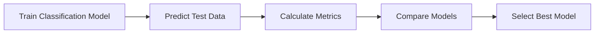
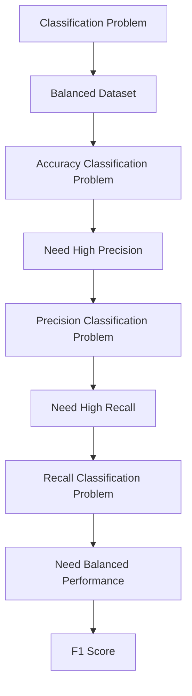

# 32. Classification Evaluation Metrics

> Learn how classification models are evaluated using performance metrics such as Accuracy, Confusion Matrix, Precision, Recall, and F1 Score, and understand when each metric should be used in real-world Machine Learning applications.

---

## 🎯 Learning Objectives

After completing this chapter, you will be able to:

- Understand why classification metrics are important
- Interpret a Confusion Matrix
- Calculate Accuracy, Precision, Recall, and F1 Score
- Select the appropriate metric based on business requirements
- Evaluate binary and multi-class classification models
- Build classification evaluation pipelines using Scikit-Learn

---

## 📖 Overview

Evaluating a classification model involves measuring how accurately it predicts class labels on **unseen data**.

No single evaluation metric is suitable for every problem. Depending on the application, minimizing **False Positives**, minimizing **False Negatives**, or balancing both may be more important than maximizing overall accuracy.

Common evaluation metrics include:

- Accuracy
- Confusion Matrix
- Precision
- Recall
- F1 Score

Choosing the appropriate metric depends on the business context and the consequences of prediction errors. :contentReference[oaicite:0]{index=0}

---

## 🧠 Core Concepts

Classification metrics help answer questions such as:

- How many predictions are correct?
- Which mistakes are being made?
- Are false alarms acceptable?
- Are missed positive cases acceptable?
- Which model performs best?

Different metrics provide different perspectives on model performance.

---

## 🏗️ Classification Evaluation Workflow



---

# 📘 Train-Test Split

Before evaluating a classifier, the dataset should be divided into separate training and testing datasets.

A common split is:

- **70–80%** Training Data
- **20–30%** Test Data

The training set is used to learn the model, while the test set evaluates how well the model generalizes to unseen data. :contentReference[oaicite:1]{index=1}

---

## 🏗️ Train-Test Split

```mermaid
flowchart LR

Dataset

--> Training Data

Dataset

--> Test Data

Training Data

--> Train Model

Test Data

--> Evaluate Model

```

---

# 📊 Confusion Matrix

A **Confusion Matrix** summarizes the predictions made by a classification model.

It compares predicted labels with actual labels.

The four possible outcomes are:

- True Positive (TP)
- True Negative (TN)
- False Positive (FP)
- False Negative (FN) :contentReference[oaicite:2]{index=2}

---

## 📘 Understanding the Confusion Matrix

| Actual / Predicted | Positive | Negative |
|--------------------|----------|----------|
| Positive | True Positive (TP) | False Negative (FN) |
| Negative | False Positive (FP) | True Negative (TN) |

---

## Interpretation

- **TP** → Correctly predicted positive
- **TN** → Correctly predicted negative
- **FP** → Incorrectly predicted positive
- **FN** → Incorrectly predicted negative :contentReference[oaicite:3]{index=3}

---

# 📈 Accuracy

Accuracy measures the proportion of correct predictions among all predictions.

It provides an overall measure of model correctness.

Use Accuracy when:

- Classes are balanced.
- All prediction errors have similar importance.

Accuracy alone may be misleading for imbalanced datasets. :contentReference[oaicite:4]{index=4}

---

## 📊 Accuracy Characteristics

| Advantages | Limitations |
|-------------|-------------|
| Easy to understand | Misleading for imbalanced datasets |
| Good for balanced data | Does not distinguish error types |
| Simple comparison metric | Ignores business impact of errors |

---

# 📗 Precision

Precision measures how many predicted positive observations are actually positive.

High Precision means:

- Few False Positives
- Reliable positive predictions

Precision is important when false positives are expensive. Examples include recommendation systems and spam filtering. :contentReference[oaicite:5]{index=5}

---

## Business Examples

High Precision is important for:

- Product Recommendations
- Email Spam Detection
- Marketing Campaigns

---

# 📙 Recall

Recall measures how many actual positive observations are correctly identified.

High Recall means:

- Few False Negatives
- Most positive cases are detected

Recall is critical when missing positive cases is costly, such as in medical diagnosis or fraud detection. :contentReference[oaicite:6]{index=6}

---

## Business Examples

High Recall is important for:

- Disease Detection
- Fraud Detection
- Cybersecurity Threat Detection

---

# 📕 F1 Score

The **F1 Score** combines Precision and Recall into a single metric.

It is especially useful when:

- Classes are imbalanced.
- Precision and Recall are equally important.

The F1 Score provides a balanced measure of classification performance. :contentReference[oaicite:7]{index=7}

---

## 📊 Metric Comparison

| Metric | Measures | Best Used When |
|----------|----------|----------------|
| Accuracy | Overall Correctness | Balanced Classes |
| Precision | Quality of Positive Predictions | False Positives are Costly |
| Recall | Ability to Find Positives | False Negatives are Costly |
| F1 Score | Balance of Precision & Recall | Both Error Types Matter |

---

## 🏗️ Choosing the Right Metric



---

# 📘 Multi-Class Classification

For multi-class problems, evaluation metrics are calculated for each class.

Scikit-Learn combines the results using:

- Macro Average
- Weighted Average

Weighted averages account for the number of samples belonging to each class. :contentReference[oaicite:8]{index=8}

---

## 🌍 Real-World Applications

Classification metrics are widely used across industries.

| Industry | Evaluation Focus |
|----------|------------------|
| Healthcare | High Recall |
| Banking | High Recall for Fraud |
| Retail | High Precision for Recommendations |
| Cybersecurity | High Recall for Threat Detection |
| Insurance | Balanced F1 Score |
| Manufacturing | Defect Detection Accuracy |

---

## 🏢 Case Study

### Disease Detection

A hospital develops a model to detect a serious disease.

A **False Negative** means an infected patient is classified as healthy.

↓

High Recall

↓

Fewer Missed Cases

↓

Improved Patient Safety

Although Precision remains important, maximizing Recall is the primary objective because missing an actual patient could have severe consequences. :contentReference[oaicite:9]{index=9}

---

## 💻 Implementation Example

=== "Classification Report"

```python title="classification_report.py"
from sklearn.metrics import classification_report

print(classification_report(
    y_test,
    y_pred
))
```

=== "Confusion Matrix"

```python title="confusion_matrix.py"
from sklearn.metrics import confusion_matrix

cm = confusion_matrix(
    y_test,
    y_pred
)

print(cm)
```

=== "Evaluation Metrics"

```python title="classification_metrics.py"
from sklearn.metrics import (
    accuracy_score,
    precision_score,
    recall_score,
    f1_score
)

print("Accuracy :", accuracy_score(y_test, y_pred))
print("Precision:", precision_score(y_test, y_pred))
print("Recall   :", recall_score(y_test, y_pred))
print("F1 Score :", f1_score(y_test, y_pred))
```

---

## 🏢 Enterprise Perspective

Production AI systems rarely rely on Accuracy alone.

Enterprise teams evaluate models using multiple metrics depending on business objectives.

Examples include:

- Fraud Detection → Recall
- Recommendation Systems → Precision
- Healthcare → Recall and F1 Score
- Customer Churn Prediction → F1 Score
- Credit Risk → Precision and Recall

Selecting the correct metric ensures the deployed model aligns with business priorities rather than simply maximizing overall accuracy. :contentReference[oaicite:10]{index=10}

---

!!! tip "Production Insight"

    There is no universally best classification metric.

    Always select the evaluation metric based on the business cost of False Positives and False Negatives rather than relying solely on overall Accuracy.

---

## 💡 Best Practices

- Always evaluate on unseen test data.
- Analyze the Confusion Matrix before selecting metrics.
- Use Accuracy only for balanced datasets.
- Use Precision when false positives are expensive.
- Use Recall when false negatives are expensive.
- Use F1 Score when both Precision and Recall matter.

---

## ⚠️ Common Mistakes

- Reporting only Accuracy.
- Ignoring class imbalance.
- Choosing metrics without considering business impact.
- Evaluating on training data.
- Misinterpreting Precision and Recall.

---

## 📌 Key Takeaways

- Classification metrics evaluate how well a model predicts categorical outcomes.
- The Confusion Matrix explains prediction errors through TP, TN, FP, and FN.
- Accuracy measures overall correctness.
- Precision minimizes False Positives.
- Recall minimizes False Negatives.
- F1 Score balances Precision and Recall.
- Metric selection should always be driven by business requirements.

---

## 📚 Further Reading

The next chapter explores **Regression Evaluation Metrics**, including MAE, MSE, RMSE, and R² Score for evaluating continuous prediction models.

---

## ➡️ Next Chapter

*[33. Regression Evaluation Metrics](33-regression-evaluation-metrics.md)*