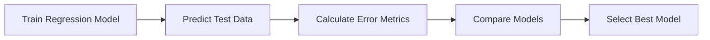
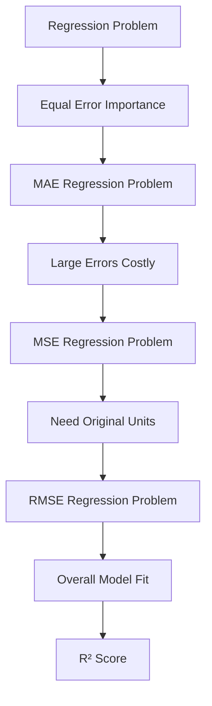

# 33. Regression Evaluation Metrics

> Learn how regression models are evaluated using metrics such as Mean Absolute Error (MAE), Mean Squared Error (MSE), Root Mean Squared Error (RMSE), and R² Score, and understand how to select the appropriate metric for real-world Machine Learning applications.

---

## 🎯 Learning Objectives

After completing this chapter, you will be able to:

- Understand why regression models require specialized evaluation metrics
- Differentiate MAE, MSE, RMSE, and R² Score
- Interpret regression model performance
- Compare regression models using multiple metrics
- Select the appropriate metric based on business requirements
- Evaluate regression models using Scikit-Learn

---

## 📖 Overview

Unlike classification problems, where predictions belong to discrete categories, **regression models predict continuous numerical values**.

Evaluating regression models focuses on measuring **how close predicted values are to the actual values**.

Different metrics measure prediction errors differently. Some penalize large errors more heavily, while others are easier to interpret. Selecting the right metric depends on the problem domain and business requirements. :contentReference[oaicite:0]{index=0}

---

## 🧠 Core Concepts

Regression evaluation helps answer questions such as:

- How far are predictions from actual values?
- Which regression model performs best?
- Are prediction errors acceptable?
- Does the model generalize well?

Lower prediction error generally indicates better model performance.

---

## 🏗️ Regression Evaluation Workflow



---

# 📘 Prediction Error

A prediction error is the difference between the **actual value** and the **predicted value**.

Smaller prediction errors indicate better model performance.

Different evaluation metrics summarize these errors in different ways.

---

## Characteristics

- Measures prediction quality
- Quantifies model error
- Supports model comparison
- Guides model improvement

---

# 📊 Mean Absolute Error (MAE)

**Mean Absolute Error (MAE)** measures the average absolute difference between predicted and actual values.

Characteristics:

- Easy to interpret
- Same unit as the target variable
- Treats all errors equally
- Less sensitive to outliers

---

## When to Use MAE

MAE is suitable when:

- Every prediction error has equal importance.
- Outliers should not dominate the evaluation.
- Business users require an easily interpretable metric.

---

# 📈 Mean Squared Error (MSE)

**Mean Squared Error (MSE)** calculates the average squared prediction error.

Characteristics:

- Penalizes larger errors more heavily.
- Frequently used during model optimization.
- Sensitive to outliers.

Because errors are squared, large prediction mistakes have a greater impact on the final score. :contentReference[oaicite:1]{index=1}

---

## When to Use MSE

MSE is appropriate when:

- Large prediction errors are especially costly.
- Comparing optimization algorithms.
- Training regression models.

---

# 📙 Root Mean Squared Error (RMSE)

**Root Mean Squared Error (RMSE)** is the square root of MSE.

Advantages:

- Same unit as the target variable.
- Easier to interpret than MSE.
- Still penalizes large errors.

RMSE is one of the most commonly reported regression metrics in production systems.

---

## When to Use RMSE

RMSE is useful when:

- Large errors should be penalized.
- Results need to be interpreted using the original measurement units.

---

# 📕 R² Score (Coefficient of Determination)

The **R² Score** measures how well the regression model explains the variation in the target variable.

Interpretation:

- **1.0** → Perfect prediction
- **0.0** → No improvement over predicting the mean
- **Less than 0** → Worse than predicting the mean

Higher R² values generally indicate better model performance. :contentReference[oaicite:2]{index=2}

---

## 📊 Metric Comparison

| Metric | Measures | Best Used When |
|----------|----------|----------------|
| MAE | Average Absolute Error | Easy interpretation |
| MSE | Average Squared Error | Penalize large errors |
| RMSE | Root of Squared Error | Same unit as target |
| R² Score | Explained Variance | Overall model fit |

---

## 🏗️ Choosing the Right Metric



---

## 🌍 Real-World Applications

Regression evaluation metrics are widely used across industries.

| Industry | Example Application |
|----------|---------------------|
| Finance | Revenue Forecasting |
| Retail | Demand Prediction |
| Healthcare | Medical Cost Estimation |
| Manufacturing | Predictive Maintenance |
| Energy | Electricity Load Forecasting |
| Real Estate | House Price Prediction |

---

## 🏢 Case Study

### House Price Prediction

A real estate company develops a regression model to estimate property prices.

Workflow:

Property Features

↓

Regression Model

↓

Predicted Price

↓

Evaluate Using MAE, RMSE, and R²

↓

Deploy Best Model

Business users prefer MAE because it directly represents the average prediction error in currency units, while data scientists also monitor RMSE and R² to assess overall model quality.

---

## 💻 Implementation Example

=== "Regression Metrics"

```python title="regression_metrics.py"
from sklearn.metrics import (
    mean_absolute_error,
    mean_squared_error,
    r2_score
)

mae = mean_absolute_error(y_test, y_pred)
mse = mean_squared_error(y_test, y_pred)
rmse = mean_squared_error(y_test, y_pred, squared=False)
r2 = r2_score(y_test, y_pred)

print("MAE :", mae)
print("MSE :", mse)
print("RMSE:", rmse)
print("R²  :", r2)
```

=== "Model Evaluation"

```python title="evaluate_regression.py"
model.fit(X_train, y_train)

predictions = model.predict(X_test)
```

---

## 🏢 Enterprise Perspective

Production regression models are rarely evaluated using a single metric.

Enterprise AI teams typically review:

- MAE for business interpretability
- RMSE for error severity
- R² for overall explanatory power
- Business-specific performance indicators

The final model is selected based on both technical performance and business impact rather than a single numerical score.

---

!!! tip "Production Insight"

    No single regression metric is universally best.

    MAE is often preferred for business reporting because it is easy to interpret, while RMSE is useful when large prediction errors carry greater business risk.

---

## 💡 Best Practices

- Evaluate regression models using multiple metrics.
- Compare models on unseen test data.
- Interpret metrics within the business context.
- Monitor regression performance after deployment.
- Combine technical metrics with business KPIs.

---

## ⚠️ Common Mistakes

- Relying on only one evaluation metric.
- Comparing models using training data.
- Ignoring the impact of outliers.
- Using R² alone to judge model quality.
- Selecting models without considering business requirements.

---

## 📌 Key Takeaways

- Regression metrics measure prediction error for continuous outputs.
- MAE provides easily interpretable average error.
- MSE heavily penalizes large prediction errors.
- RMSE expresses prediction error in the original units.
- R² measures how well the model explains variation in the target variable.
- Multiple metrics should be used together for robust model evaluation.

---

## 📚 Further Reading

The next chapter explores **Unsupervised Learning Evaluation**, including techniques such as Silhouette Score, Davies-Bouldin Index, and Calinski-Harabasz Index for assessing clustering quality.

---

## ➡️ Next Chapter

*[34. Unsupervised Learning Evaluation](34-unsupervised-learning-evaluation.md)*