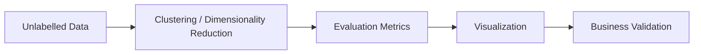
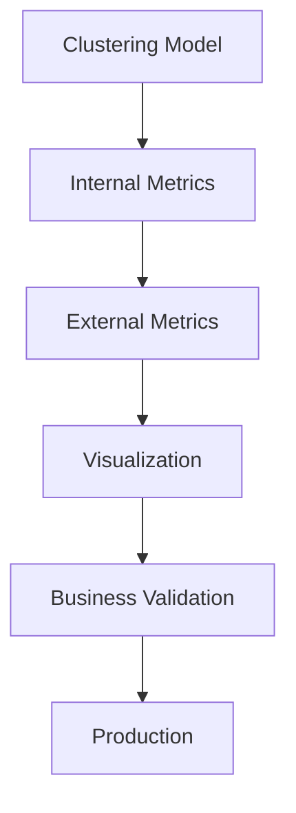

# 34. Unsupervised Learning Evaluation

> Learn how to evaluate clustering and dimensionality reduction models using internal metrics, external metrics, stability analysis, and visualization techniques to assess the quality of patterns discovered from unlabeled data.

---

## 🎯 Learning Objectives

After completing this chapter, you will be able to:

- Understand why evaluating Unsupervised Learning is challenging
- Differentiate internal and external evaluation metrics
- Evaluate clustering quality using common metrics
- Assess dimensionality reduction techniques
- Validate clustering stability
- Apply evaluation techniques using Scikit-Learn

---

## 📖 Overview

Unlike supervised learning, **Unsupervised Learning** does not have predefined labels or ground truth.

As a result, evaluating clustering and dimensionality reduction models requires different techniques that measure the **quality of discovered patterns**, **cluster separation**, **compactness**, and **stability** rather than prediction accuracy.

Evaluation typically combines quantitative metrics, visualization, domain expertise, and business validation to determine whether the discovered structures are meaningful. :contentReference[oaicite:0]{index=0}

---

## 🧠 Core Concepts

Unsupervised Learning evaluation focuses on:

- Cluster quality
- Cluster separation
- Cluster compactness
- Pattern stability
- Visualization
- Business interpretation

Since no correct labels are available, there is rarely a single "correct" answer.

---

## 🏗️ Evaluation Workflow



---

# 📘 Why Unsupervised Evaluation is Different

In supervised learning, predictions are compared against known labels.

In unsupervised learning:

- No predefined labels exist.
- Models discover hidden structures.
- Evaluation measures the quality of discovered patterns instead of prediction accuracy. :contentReference[oaicite:1]{index=1}

---

## Evaluation Approaches

Several complementary approaches are used:

- Internal Metrics
- External Metrics (when labels are available)
- Stability Analysis
- Visualization
- Domain Expertise

Using multiple evaluation techniques provides a more reliable assessment. :contentReference[oaicite:2]{index=2}

---

# 📊 Internal Evaluation Metrics

Internal metrics evaluate clustering using only the dataset and cluster assignments.

They do not require ground truth labels.

Common internal metrics include:

- Silhouette Score
- Davies-Bouldin Index
- Inertia

---

## Silhouette Score

Measures:

- Cluster cohesion
- Cluster separation

Characteristics:

- Range: **−1 to 1**
- Higher values indicate better clustering.

Interpretation:

- Near **1** → Well-separated clusters
- Near **0** → Overlapping clusters
- Below **0** → Poor clustering :contentReference[oaicite:3]{index=3}

---

## Davies-Bouldin Index (DBI)

Measures:

- Cluster compactness
- Separation between clusters

Characteristics:

- Lower values indicate better clustering.
- Useful for comparing different clustering solutions. :contentReference[oaicite:4]{index=4}

---

## Inertia

Inertia measures the **within-cluster sum of squared distances** between observations and their assigned centroids.

Characteristics:

- Lower values indicate tighter clusters.
- Decreases as the number of clusters increases.
- Often used with the **Elbow Method** for selecting the optimal number of clusters. :contentReference[oaicite:5]{index=5}

---

## 📊 Internal Metric Comparison

| Metric | Best Value | Measures |
|----------|-----------|----------|
| Silhouette Score | Higher | Cohesion & Separation |
| Davies-Bouldin Index | Lower | Compactness & Separation |
| Inertia | Lower | Within-Cluster Variance |

---

# 📗 External Evaluation Metrics

When ground-truth labels are available, clustering quality can be evaluated by comparing predicted clusters with known classes.

Common external metrics include:

- Adjusted Rand Index (ARI)
- Normalized Mutual Information (NMI)
- Fowlkes-Mallows Index (FMI) :contentReference[oaicite:6]{index=6}

---

## Adjusted Rand Index (ARI)

Measures agreement between predicted clusters and true labels.

Characteristics:

- Range: **−1 to 1**
- **1** indicates perfect agreement.

---

## Normalized Mutual Information (NMI)

Measures the amount of shared information between predicted clusters and true labels.

Characteristics:

- Range: **0 to 1**
- Higher values indicate better clustering.

---

## Fowlkes-Mallows Index (FMI)

Combines clustering precision and recall into a single metric.

Higher values indicate stronger agreement between clustering results and ground truth. :contentReference[oaicite:7]{index=7}

---

## 📊 External Metric Comparison

| Metric | Requires Labels | Higher is Better |
|----------|----------------|------------------|
| ARI | Yes | ✅ |
| NMI | Yes | ✅ |
| FMI | Yes | ✅ |

---

# 📘 Evaluating Dimensionality Reduction

Dimensionality reduction techniques require different evaluation methods.

Common evaluation metrics include:

- Explained Variance Ratio
- Reconstruction Error
- Neighborhood Preservation :contentReference[oaicite:8]{index=8}

---

## Explained Variance Ratio

Measures the proportion of information retained by each principal component.

Primarily used with PCA.

Higher cumulative explained variance indicates that more information has been preserved.

---

## Reconstruction Error

Measures how accurately the original dataset can be reconstructed after dimensionality reduction.

Lower values indicate better preservation of information.

---

## Neighborhood Preservation

Evaluates whether nearby observations remain close after projection into lower dimensions.

Commonly used for:

- t-SNE
- UMAP

---

## 📊 Dimensionality Reduction Metrics

| Metric | Best Value | Used For |
|----------|-----------|----------|
| Explained Variance | Higher | PCA |
| Reconstruction Error | Lower | Autoencoders, PCA |
| Neighborhood Preservation | Higher | t-SNE, UMAP |

---

# 📈 Stability Analysis

A good clustering algorithm should produce similar results when:

- Training data changes slightly
- Random initialization changes
- Data is resampled

Stable clustering solutions are generally more reliable.

Stability testing is often used alongside internal evaluation metrics. :contentReference[oaicite:9]{index=9}

---

## 🏗️ Evaluation Strategy



---

## 🌍 Real-World Applications

Unsupervised evaluation is widely used across industries.

| Industry | Example Application |
|----------|---------------------|
| Retail | Customer Segmentation |
| Banking | Fraud Detection |
| Healthcare | Patient Clustering |
| Manufacturing | Predictive Maintenance |
| Cybersecurity | Anomaly Detection |
| Bioinformatics | Gene Expression Analysis |
| Marketing | Audience Segmentation |
| Computer Vision | Image Embedding Analysis |

---

## 🏢 Case Study

### Customer Segmentation

A retailer applies K-Means clustering to customer purchase data.

Evaluation Results:

- Silhouette Score = **0.84**
- Davies-Bouldin Index = **0.22**

These values indicate compact, well-separated customer clusters suitable for personalized marketing campaigns. :contentReference[oaicite:10]{index=10}

---

## 💻 Implementation Example

=== "Silhouette Score"

```python title="silhouette_score.py"
from sklearn.metrics import silhouette_score

score = silhouette_score(X, labels)

print(score)
```

=== "Davies-Bouldin Index"

```python title="davies_bouldin.py"
from sklearn.metrics import davies_bouldin_score

dbi = davies_bouldin_score(X, labels)

print(dbi)
```

=== "Adjusted Rand Index"

```python title="adjusted_rand.py"
from sklearn.metrics import adjusted_rand_score

ari = adjusted_rand_score(
    true_labels,
    predicted_labels
)

print(ari)
```

---

## 🏢 Enterprise Perspective

Enterprise AI teams rarely rely on a single clustering metric.

Production evaluation typically combines:

- Internal evaluation metrics
- Visualization
- Stability testing
- Domain expertise
- Business validation

The final decision depends not only on statistical quality but also on whether the discovered patterns produce meaningful business outcomes. :contentReference[oaicite:11]{index=11}

---

!!! tip "Production Insight"

    The mathematically best clustering solution is not always the most valuable business solution.

    Always combine quantitative evaluation metrics with domain knowledge and business validation before deploying clustering models.

---

## 💡 Best Practices

- Evaluate clustering using multiple internal metrics.
- Use external metrics when ground truth labels are available.
- Assess clustering stability across multiple runs.
- Visualize clustering results whenever possible.
- Validate discovered patterns with business experts.

---

## ⚠️ Common Mistakes

- Evaluating clustering using only one metric.
- Assuming higher numbers are always better for every metric.
- Ignoring visualization and business interpretation.
- Treating clustering results as absolute truth.
- Deploying clustering models without stability testing.

---

## 📌 Key Takeaways

- Unsupervised Learning evaluation differs fundamentally from supervised evaluation.
- Internal metrics assess clustering without labels.
- External metrics compare clustering against known labels when available.
- Dimensionality reduction requires specialized evaluation metrics.
- Stability analysis and visualization complement quantitative metrics.
- Effective evaluation combines statistical measures with business validation.

---

## 📚 Further Reading

The next chapter explores **Cross-Validation and Model Validation**, explaining how validation techniques help improve model generalization while preventing overfitting and data leakage.

---

## ➡️ Next Chapter

*[35. Cross-Validation and Model Validation](35-cross-validation-and-model-validation.md)*