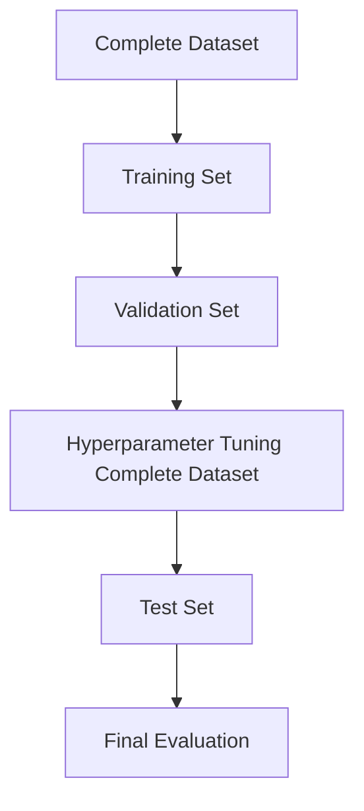
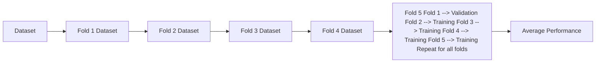
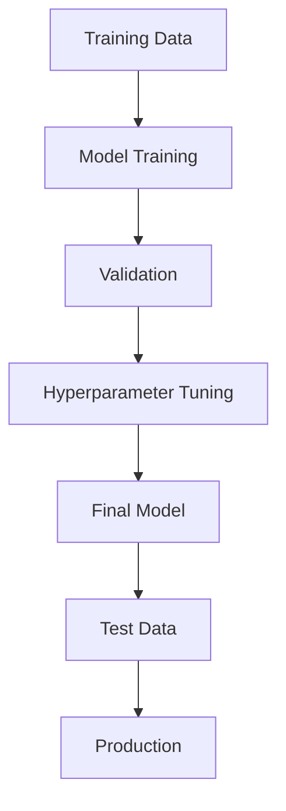

# 35. Cross-Validation and Model Validation

> Learn how model validation ensures reliable performance on unseen data, understand cross-validation techniques, and explore best practices for preventing overfitting and data leakage in production Machine Learning systems.

---

## 🎯 Learning Objectives

After completing this chapter, you will be able to:

- Understand the purpose of model validation
- Differentiate training, validation, and test datasets
- Learn how cross-validation improves model evaluation
- Understand K-Fold and Stratified K-Fold Cross-Validation
- Prevent data snooping and data leakage
- Apply model validation techniques using Scikit-Learn

---

## 📖 Overview

A Machine Learning model should not only perform well on the data used for training but also generalize to **new, unseen data**.

**Model Validation** helps estimate how well a model will perform in real-world scenarios by separating model training from performance evaluation. It plays a critical role in preventing **overfitting**, selecting optimal **hyperparameters**, and ensuring unbiased performance estimation.

Improper validation can lead to **data snooping** (a form of data leakage), where information from the test set influences model development and results in overly optimistic performance estimates. :contentReference[oaicite:0]{index=0}

---

## 🎯 Why Model Validation Matters

Model validation helps answer important questions:

- Will the model generalize well?
- Is the model overfitting?
- Which hyperparameters perform best?
- Which model should be deployed?

Without proper validation, evaluation results can be misleading and unreliable.

---

## 🏗️ Model Validation Workflow

```mermaid
flowchart LR

Dataset

--> Training Data

Training Data

--> Validation

Validation

--> Hyperparameter Tuning

Hyperparameter Tuning

--> Best Model

Best Model

--> Test Data

Test Data

--> Final Evaluation

```

---

# 📘 Training, Validation, and Test Sets

A reliable evaluation strategy separates data into different subsets.

| Dataset | Purpose |
|----------|----------|
| Training Set | Learn model parameters |
| Validation Set | Hyperparameter tuning and model selection |
| Test Set | Final unbiased performance evaluation |

The **test set should only be used once**, after model development is complete. :contentReference[oaicite:1]{index=1}

---

## 📊 Data Splitting Strategy



---

# 📗 Model Validation

Model validation evaluates different model configurations during development.

Typical activities include:

- Hyperparameter tuning
- Model comparison
- Feature selection
- Algorithm selection

The validation dataset guides model improvement without exposing the model to the final test data.

---

# 📈 Problems with a Single Validation Set

Using a single validation dataset has several drawbacks.

Limitations include:

- Overfitting to the validation set
- High variance in performance estimates
- Reduced training data
- Results depend on a single data split

Cross-validation addresses these limitations by using multiple validation splits. :contentReference[oaicite:2]{index=2}

---

# 📘 K-Fold Cross-Validation

K-Fold Cross-Validation divides the training dataset into **K equal folds**.

The process is repeated **K times**:

1. Train on **K − 1** folds.
2. Validate on the remaining fold.
3. Rotate the validation fold.
4. Average the evaluation results.

Typical values are **K = 5** or **K = 10**. :contentReference[oaicite:3]{index=3}

---

## 🏗️ K-Fold Cross-Validation



---

# 📙 Stratified K-Fold Cross-Validation

For **imbalanced classification datasets**, standard K-Fold may produce folds with different class distributions.

**Stratified K-Fold Cross-Validation** preserves the original class proportions in every fold, producing more reliable evaluation results. :contentReference[oaicite:4]{index=4}

---

## When to Use Stratified K-Fold

Use Stratified K-Fold when:

- Binary classification
- Multi-class classification
- Imbalanced datasets

---

## 📊 Validation Method Comparison

| Method | Advantages | Limitations |
|---------|------------|-------------|
| Train/Test Split | Simple and fast | High variance |
| Single Validation Set | Easy to implement | Can overfit validation set |
| K-Fold Cross-Validation | Robust evaluation | Computationally expensive |
| Stratified K-Fold | Handles class imbalance | More complex |

:contentReference[oaicite:5]{index=5}

---

# 📌 Hyperparameter Tuning

Hyperparameters are configuration values chosen **before training**.

Examples include:

- Learning Rate
- Number of Trees
- Maximum Tree Depth
- Regularization Strength

Hyperparameter tuning should always be performed using the **training and validation data**, **never** using the test set. :contentReference[oaicite:6]{index=6}

---

# 📕 Data Snooping and Data Leakage

One of the most common mistakes in Machine Learning is evaluating the model on the **test dataset before development is complete**.

This practice is known as **Data Snooping**, a form of **Data Leakage**.

Consequences include:

- Overly optimistic evaluation
- Poor real-world performance
- Unreliable model comparison

The test dataset should remain untouched until the final evaluation stage. 

---

## 🏗️ Correct Validation Process



---

# 📙 Regression Target Transformations

Some regression problems contain **highly skewed target variables**, making model learning difficult.

Common transformations include:

- Log Transformation
- Box-Cox Transformation

These techniques reduce skewness and can improve regression performance. :contentReference[oaicite:8]{index=8}

---

## 🌍 Real-World Applications

Model validation is essential across industries.

| Industry | Example Application |
|----------|---------------------|
| Banking | Credit Risk Models |
| Healthcare | Disease Prediction |
| Retail | Customer Churn Prediction |
| Manufacturing | Predictive Maintenance |
| Insurance | Claim Prediction |
| Cybersecurity | Threat Detection |

---

## 🏢 Case Study

### Customer Churn Prediction

A telecommunications company develops multiple churn prediction models.

Workflow:

Training Data

↓

K-Fold Cross-Validation

↓

Hyperparameter Tuning

↓

Best Model

↓

Final Test Evaluation

↓

Production Deployment

By using cross-validation instead of a single validation split, the organization obtains a more reliable estimate of real-world model performance.

---

## 💻 Implementation Example

=== "K-Fold Cross-Validation"

```python title="kfold_cv.py"
from sklearn.model_selection import cross_val_score
from sklearn.ensemble import RandomForestClassifier

model = RandomForestClassifier(random_state=42)

scores = cross_val_score(
    model,
    X,
    y,
    cv=5
)

print(scores.mean())
```

=== "Stratified K-Fold"

```python title="stratified_kfold.py"
from sklearn.model_selection import StratifiedKFold

cv = StratifiedKFold(
    n_splits=5,
    shuffle=True,
    random_state=42
)
```

=== "Grid Search"

```python title="grid_search.py"
from sklearn.model_selection import GridSearchCV

grid = GridSearchCV(
    estimator=model,
    param_grid=params,
    cv=5
)

grid.fit(X_train, y_train)
```

---

## 🏢 Enterprise Perspective

Enterprise AI teams rely heavily on cross-validation before deploying production models.

Typical activities include:

- Model comparison
- Hyperparameter optimization
- Feature selection
- Algorithm benchmarking
- Performance estimation

Cross-validation provides a more stable estimate of model quality, reducing the risk of deploying models that perform well only on a particular data split.

---

!!! tip "Production Insight"

    Never use the test dataset during model development.

    The test set should remain untouched until the final model has been selected. This prevents data leakage and provides an unbiased estimate of production performance.

---

## 💡 Best Practices

- Maintain separate training, validation, and test datasets.
- Use K-Fold Cross-Validation for robust evaluation.
- Use Stratified K-Fold for imbalanced classification problems.
- Perform hyperparameter tuning only on training and validation data.
- Preserve the test dataset for the final evaluation.

---

## ⚠️ Common Mistakes

- Evaluating models on the test dataset during development.
- Overfitting the validation dataset.
- Using random splits for highly imbalanced datasets.
- Ignoring class distribution.
- Selecting hyperparameters based on test performance.

---

## 📌 Key Takeaways

- Model validation estimates how well a model generalizes to unseen data.
- Training, validation, and test datasets serve different purposes.
- K-Fold Cross-Validation provides more reliable performance estimates than a single validation split.
- Stratified K-Fold preserves class distribution for imbalanced datasets.
- Data snooping leads to data leakage and overly optimistic results.
- Proper validation is essential for building reliable production Machine Learning systems.

---

## 📚 Further Reading

The next chapter explores **Regularization Techniques**, including Ridge (L2) and Lasso (L1) Regression, and explains how regularization helps prevent overfitting while improving model generalization.

---

## ➡️ Next Chapter

*[36. Regularization Techniques](36-regularization-techniques.md)*