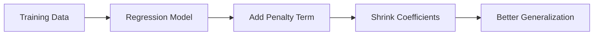
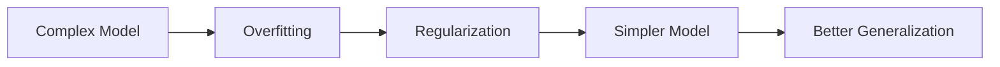

# 36. Regularization Techniques

> Learn how Regularization reduces overfitting by penalizing complex models, understand the differences between Ridge (L2) and Lasso (L1) Regression, and explore how regularization improves model generalization in production Machine Learning systems.

---

## 🎯 Learning Objectives

After completing this chapter, you will be able to:

- Understand why regularization is needed
- Learn how regularization reduces overfitting
- Differentiate Ridge (L2) and Lasso (L1) Regression
- Understand the role of the regularization parameter (λ)
- Select the appropriate regularization technique
- Apply Ridge and Lasso Regression using Scikit-Learn

---

## 📖 Overview

Machine Learning models often become **too complex**, fitting not only meaningful patterns but also random noise in the training data. This phenomenon is known as **overfitting**.

**Regularization** reduces overfitting by adding a **penalty term** to the model's cost function, discouraging excessively large model coefficients.

The two most widely used regularization techniques are:

- **Ridge Regression (L2 Regularization)**
- **Lasso Regression (L1 Regularization)**

While both techniques shrink model coefficients, **Lasso can reduce some coefficients to exactly zero**, making it useful for automatic feature selection. 

---

## 🧠 Core Concepts

Regularization helps:

- Reduce overfitting
- Improve model generalization
- Control model complexity
- Reduce coefficient magnitude
- Improve prediction stability

Rather than eliminating features directly, regularization constrains the model during training.

---

## 🏗️ Regularization Workflow



---

# 📘 What is Regularization?

Regularization is a technique that **adds a penalty term to the model's objective function** to discourage large coefficient values.

The goal is to build simpler models that generalize better to unseen data rather than memorizing the training dataset. :contentReference[oaicite:1]{index=1}

---

## Characteristics

- Prevents overfitting
- Improves generalization
- Controls coefficient size
- Reduces model variance
- Supports more stable predictions

---

# 📊 Why Regularization is Needed

Highly flexible models may learn random fluctuations in the training data.

Consequences include:

- Poor test performance
- High model variance
- Unstable predictions
- Reduced generalization

Regularization limits model complexity and improves robustness.

---

## 🏗️ Overfitting vs Regularization



---

# 📗 Ridge Regression (L2 Regularization)

Ridge Regression applies an **L2 penalty**, which is based on the **sum of squared coefficients**.

Characteristics:

- Shrinks coefficients toward zero
- Rarely makes coefficients exactly zero
- Helps reduce overfitting
- Performs well when most features contribute useful information :contentReference[oaicite:2]{index=2}

---

## When to Use Ridge

Choose Ridge Regression when:

- Most features are useful.
- Multicollinearity exists.
- You want to retain all features.
- Stable coefficient estimates are important.

---

# 📙 Lasso Regression (L1 Regularization)

Lasso Regression applies an **L1 penalty**, which is based on the **sum of absolute coefficient values**.

Unlike Ridge, Lasso can reduce some coefficients to **exactly zero**, automatically removing less important features. This makes Lasso useful for **feature selection**. 

---

## When to Use Lasso

Choose Lasso Regression when:

- Many features are irrelevant.
- Feature selection is desired.
- Sparse models are preferred.
- Model interpretability is important.

---

# 📈 Regularization Parameter (λ)

The **regularization parameter (λ)** controls the strength of the penalty.

- Small λ → Minimal regularization
- Large λ → Strong regularization

Choosing the appropriate λ requires experimentation using model validation or cross-validation. :contentReference[oaicite:4]{index=4}

---

## 📊 Ridge vs Lasso

| Feature | Ridge (L2) | Lasso (L1) |
|----------|------------|------------|
| Penalty | Squared coefficients | Absolute coefficients |
| Feature Selection | No | Yes |
| Coefficients | Shrinks toward zero | Can become exactly zero |
| Best For | Many useful features | Sparse datasets |
| Model Complexity | Reduced | Reduced + Feature Selection |

---

# 📘 Signal-to-Noise Ratio (SNR)

The effectiveness of Ridge and Lasso depends on the **Signal-to-Noise Ratio (SNR)** and whether the dataset contains **sparse** or **non-sparse** features.

According to the course material:

- **Lasso generally performs best in sparse datasets**, particularly when identifying zero coefficients.
- **Ridge performs well when most features contribute useful information.**
- In noisy datasets, Lasso often produces lower prediction error than standard Linear Regression and Ridge Regression. :contentReference[oaicite:5]{index=5}

---

## 📊 Performance Comparison

| Dataset Condition | Linear Regression | Ridge | Lasso |
|-------------------|------------------|--------|--------|
| Sparse, High SNR | Good | Similar | **Best** |
| Sparse, Low SNR | Poor | Good | **Best** |
| Non-sparse, High SNR | Good | Good | Good |
| Non-sparse, Low SNR | Poor | Better | Good |

:contentReference[oaicite:6]{index=6}

---

## 🌍 Real-World Applications

Regularization is widely used across industries.

| Industry | Example Application |
|----------|---------------------|
| Banking | Credit Risk Modeling |
| Healthcare | Disease Prediction |
| Retail | Demand Forecasting |
| Marketing | Customer Response Prediction |
| Manufacturing | Predictive Maintenance |
| Insurance | Premium Estimation |

---

## 🏢 Case Study

### House Price Prediction

A real estate company builds a regression model using hundreds of property features.

Without regularization:

- High training accuracy
- Poor test performance

↓

Apply Ridge and Lasso Regression

↓

Reduced Overfitting

↓

Improved Generalization

↓

Better Price Predictions

Lasso additionally removes irrelevant features, resulting in a simpler and more interpretable model. :contentReference[oaicite:7]{index=7}

---

## 💻 Implementation Example

=== "Ridge Regression"

```python title="ridge_regression.py"
from sklearn.linear_model import Ridge

model = Ridge(alpha=1.0)

model.fit(X_train, y_train)
```

=== "Lasso Regression"

```python title="lasso_regression.py"
from sklearn.linear_model import Lasso

model = Lasso(alpha=0.1)

model.fit(X_train, y_train)
```

=== "Model Evaluation"

```python title="regularization_evaluation.py"
from sklearn.metrics import mean_squared_error

predictions = model.predict(X_test)

mse = mean_squared_error(
    y_test,
    predictions
)

print(mse)
```

---

## 🏢 Enterprise Perspective

Regularization is a standard component of modern Machine Learning pipelines.

Enterprise AI teams use regularization to:

- Improve generalization
- Reduce overfitting
- Stabilize model coefficients
- Handle multicollinearity
- Perform feature selection
- Build interpretable models

Regularization is often combined with cross-validation to determine the optimal value of the regularization parameter before deployment.

---

!!! tip "Production Insight"

    Regularization should not be viewed as a replacement for good feature engineering.

    The best production models combine high-quality features, appropriate regularization, and rigorous model validation to achieve reliable performance.

---

## 💡 Best Practices

- Standardize numerical features before applying regularization.
- Select λ using cross-validation.
- Use Ridge when most features are informative.
- Use Lasso when feature selection is required.
- Compare regularized and non-regularized models.

---

## ⚠️ Common Mistakes

- Using regularization without feature scaling.
- Selecting λ arbitrarily.
- Assuming Lasso always outperforms Ridge.
- Ignoring business interpretability.
- Applying excessive regularization that causes underfitting.

---

## 📌 Key Takeaways

- Regularization prevents overfitting by penalizing large model coefficients.
- Ridge Regression uses L2 regularization and retains all features.
- Lasso Regression uses L1 regularization and can eliminate unnecessary features.
- The regularization parameter (λ) controls model complexity.
- Regularization improves model generalization and stability.
- Ridge and Lasso should be selected based on dataset characteristics and business requirements.

---

## 📚 Further Reading

The next chapter explores **Data Leakage and Modeling Pitfalls**, explaining how improper data handling can produce misleading evaluation results and reduce production model reliability.

---

## ➡️ Next Chapter

*[37. Data Leakage and Modeling Pitfalls](37-data-leakage-and-modeling-pitfalls.md)*