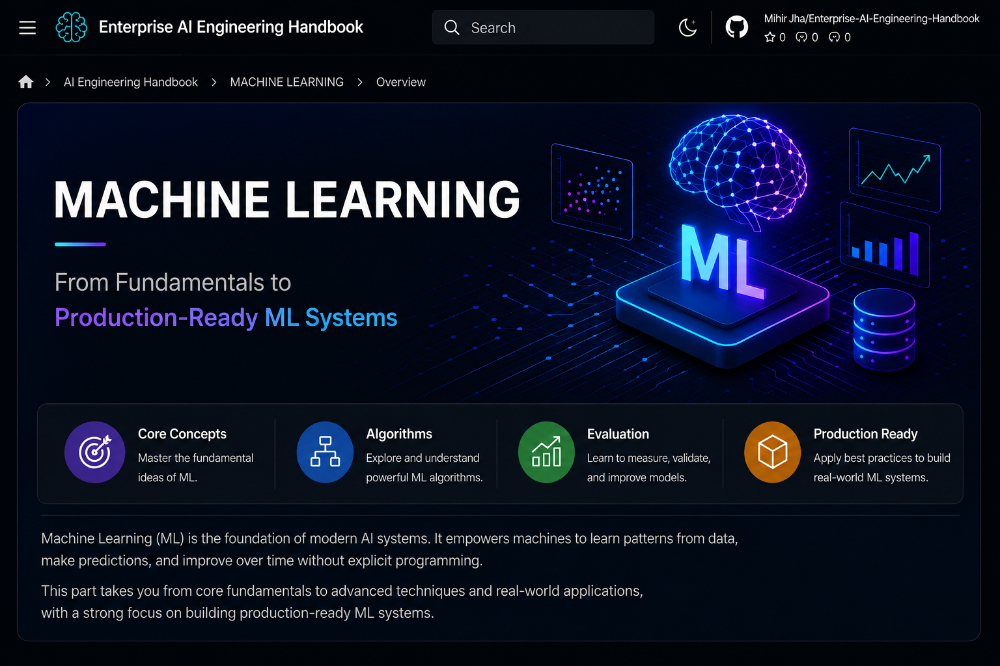

# Part I — Machine Learning

  

> Build a strong foundation in Machine Learning and learn how production-ready ML systems are designed, trained, evaluated, deployed, and operated in modern enterprise environments.

---

## 📖 Overview

Machine Learning (ML) enables computers to learn patterns from data and make predictions or decisions without being explicitly programmed for every scenario.

This module provides a production-focused introduction to Machine Learning, covering the complete lifecycle of building intelligent systems—from understanding fundamental concepts and algorithms to developing, evaluating, deploying, and maintaining models in enterprise applications.

Designed for software engineers, backend developers, cloud engineers, and solution architects, this module bridges the gap between traditional software engineering and modern AI Engineering.

---

## 🎯 Learning Outcomes

After completing this module, you will be able to:

- Understand the core principles of Machine Learning
- Differentiate AI, Machine Learning, and Deep Learning
- Understand major Machine Learning paradigms and algorithms
- Prepare and preprocess data for model training
- Engineer meaningful features for better model performance
- Train, validate, and evaluate Machine Learning models
- Understand common performance metrics and model optimization techniques
- Recognize overfitting, underfitting, and bias-variance tradeoffs
- Understand how Machine Learning systems are deployed and monitored in production
- Apply enterprise best practices for designing production-ready ML solutions

---

## 🛣️ Recommended Learning Path

This module is designed as a progressive learning journey. We recommend studying the chapters in the order presented, as each topic builds upon concepts introduced in previous chapters, gradually progressing from Machine Learning fundamentals to production-ready enterprise AI systems.

| Chapter | Status |
|---------|:------:|
| **[01. Introduction to Machine Learning](01-introduction-to-machine-learning.md)** | ✅ |
| **[02. Machine Learning Fundamentals](02-machine-learning-fundamentals.md)** | ✅ |
| **[03. Machine Learning Lifecycle](03-machine-learning-lifecycle.md)** | ✅ |
| **[04. Machine Learning in Practice](04-machine-learning-in-practice.md)** | ✅ |
| **[05. Machine Learning Ecosystem and Tools](05-machine-learning-ecosystem-and-tools.md)** | ✅ |
| **[06. Regression Fundamentals](06-regression-fundamentals.md)** | ✅ |
| **[07. Linear Regression](07-linear-regression.md)** | ✅ |
| **[08. Nonlinear Regression](08-nonlinear-regression.md)** | ✅ |
| **[09. Logistic Regression](09-logistic-regression.md)** | ✅ |
| **[10. Regression Model Training and Evaluation](10-regression-model-training-and-evaluation.md)** | ✅ |

---

## 🏢 Enterprise Perspective

Machine Learning powers intelligent systems across almost every industry.

Some common enterprise applications include:

- Fraud Detection
- Recommendation Systems
- Customer Churn Prediction
- Credit Risk Analysis
- Predictive Maintenance
- Demand Forecasting
- Intelligent Search
- Medical Diagnosis
- Cybersecurity
- Predictive Analytics

Throughout this module, you'll learn not only the underlying theory but also how these systems are architected, deployed, monitored, optimized, and scaled in real-world enterprise environments.

---

## 🚀 Start Learning

Ready to begin your Machine Learning journey?

➡️ Continue with **[01. Introduction to Machine Learning](01-introduction-to-machine-learning.md)** .

---
Fixed issue in navigation
> **Enterprise AI Engineering Handbook**  
> *Building Production-Grade Enterprise AI Systems — One Chapter at a Time.*