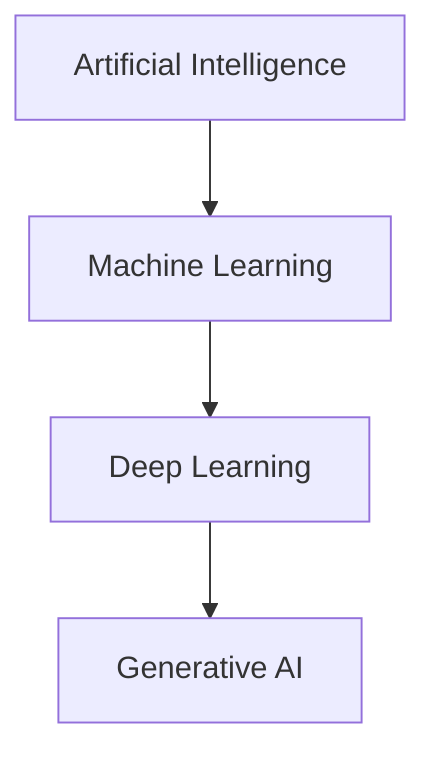
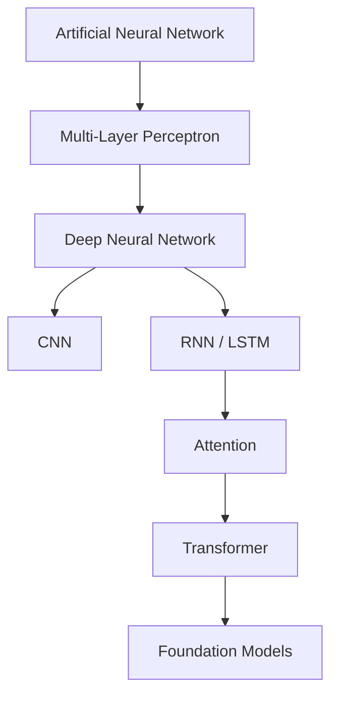
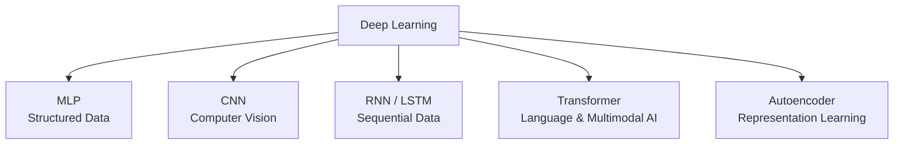
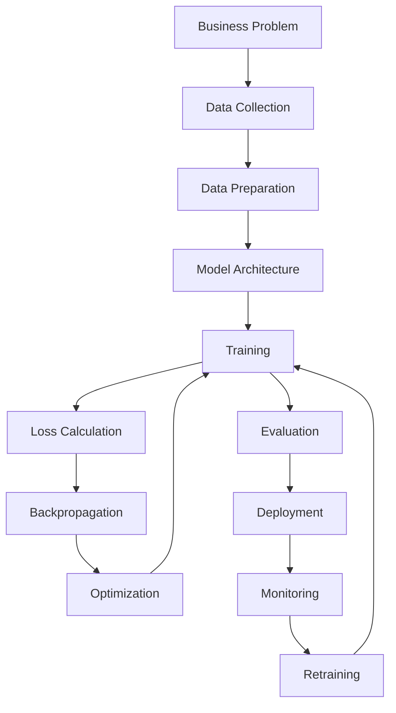

# 01. Introduction to Deep Learning

> Discover what Deep Learning is, why it has become one of the most important technologies in modern Artificial Intelligence, and how it powers intelligent applications across industries.

---

## 🎯 Learning Objectives

After completing this chapter, you will be able to:

- Explain what Deep Learning is
- Understand how Deep Learning relates to Artificial Intelligence and Machine Learning
- Understand how Deep Learning differs from traditional Machine Learning
- Explain the concept of feature learning and representation learning
- Understand why Deep Learning is effective for complex and unstructured data
- Recognize the evolution of Deep Learning architectures
- Identify major Deep Learning architectures and their use cases
- Understand major Deep Learning learning paradigms
- Understand the high-level Deep Learning training workflow
- Identify common Deep Learning frameworks and technologies
- Recognize major Deep Learning applications
- Understand the challenges involved in building production Deep Learning systems

---

## 📖 Overview

Deep Learning (DL) is a specialized branch of **Machine Learning** that uses **Artificial Neural Networks with multiple layers** to automatically learn hierarchical representations from data.

Unlike traditional Machine Learning, which often depends on manually engineered features, Deep Learning models can learn useful representations directly from data.

This capability makes Deep Learning particularly effective for complex and high-dimensional data such as:

- Images
- Text
- Audio
- Video
- Speech
- Time-Series Data
- Sensor Data

Deep Learning has become one of the foundations of modern Artificial Intelligence, powering applications such as:

- Computer Vision
- Natural Language Processing (NLP)
- Speech Recognition
- Recommendation Systems
- Medical AI
- Robotics
- Autonomous Systems
- Generative AI
- Large Language Models (LLMs)

---

## 🤖 What is Deep Learning?

Deep Learning is a Machine Learning approach based on neural networks that contain multiple computational layers.

Each layer transforms the representation produced by the previous layer, allowing the network to progressively learn increasingly complex patterns.

In simple terms:

> **Deep Learning enables computers to automatically learn hierarchical representations from data using multi-layer neural networks.**

A simplified Deep Learning model can be represented as:

```text
Input Data
    │
    ▼
Neural Network
    │
    ▼
Learned Representation
    │
    ▼
Prediction
```

For example, an image classification model may receive an image and produce probabilities for different classes:

```text
Input Image
     │
     ▼
Deep Neural Network
     │
     ▼
Probability Distribution
     │
     ├── Cat      0.05
     ├── Dog      0.90
     └── Bird     0.05
     │
     ▼
Prediction: Dog
```

During training, the model adjusts its internal parameters so that its predictions become increasingly accurate.

---

## 🧠 AI, Machine Learning & Deep Learning

Deep Learning is part of the broader Artificial Intelligence ecosystem.



The relationship can be summarized as:

```text
Artificial Intelligence
          │
          ▼
Machine Learning
          │
          ▼
Deep Learning
          │
          ▼
Modern Generative AI
```

### Artificial Intelligence

Artificial Intelligence is the broader field concerned with building systems capable of performing tasks that normally require human intelligence.

Examples include:

- Reasoning
- Planning
- Perception
- Learning
- Decision Making
- Language Understanding

### Machine Learning

Machine Learning is a subset of AI where systems learn patterns from data.

### Deep Learning

Deep Learning is a specialized Machine Learning approach based primarily on multi-layer neural networks.

---

## 🔄 Traditional Machine Learning vs Deep Learning

Traditional Machine Learning often depends heavily on feature engineering.

### Traditional Machine Learning

```text
Raw Data
    │
    ▼
Feature Engineering
    │
    ▼
Machine Learning Model
    │
    ▼
Prediction
```

### Deep Learning

```text
Raw Data
    │
    ▼
Deep Neural Network
    │
    ├── Low-Level Features
    ├── Intermediate Features
    └── High-Level Features
    │
    ▼
Prediction
```

The major difference is that Deep Learning can learn useful features automatically as part of the training process.

| Aspect | Traditional ML | Deep Learning |
|---|---|---|
| Feature Engineering | Often required | Learned automatically |
| Data Requirement | Often lower | Often higher |
| Model Complexity | Usually lower | Usually higher |
| Training Cost | Generally lower | Generally higher |
| Compute | CPU often sufficient | GPU often beneficial |
| Structured Data | Often strong | Can be effective |
| Images | Feature engineering often required | Highly effective |
| Text | Feature engineering often required | Highly effective |
| Representation Learning | Limited | Core capability |
| Interpretability | Often easier | Often more difficult |

---

## 🧩 Feature Learning

One of the most important capabilities of Deep Learning is **automatic feature learning**.

Traditional Machine Learning may require engineers to manually identify useful characteristics of the input data.

For an image, these features could include:

- Edges
- Corners
- Textures
- Shapes
- Color patterns

Deep Learning can learn these representations automatically.

```text
Raw Image
    │
    ▼
Edges
    │
    ▼
Textures
    │
    ▼
Shapes
    │
    ▼
Object Parts
    │
    ▼
Objects
    │
    ▼
Prediction
```

The network therefore learns increasingly meaningful representations as information moves through deeper layers.

---

## 🧠 Representation Learning

Feature learning is closely related to **representation learning**.

A representation is an internal form of the data that makes a particular task easier to solve.

For example:

| Data | Hierarchical Representation |
|---|---|
| Images | Pixels → Edges → Textures → Objects |
| Text | Tokens → Syntax → Semantics |
| Audio | Frequencies → Phonemes → Words |
| Time Series | Signals → Patterns → Events |

This hierarchical learning capability is one of the key reasons Deep Learning performs well on complex data.

---

## 🌳 Evolution of Deep Learning

Deep Learning has evolved through several generations of neural network architectures.



A simplified evolution is:

```text
Artificial Neural Networks
          │
          ▼
Multi-Layer Perceptrons
          │
          ▼
Deep Neural Networks
          │
     ┌────┴────┐
     ▼         ▼
    CNN       RNN
     │         │
     ▼         ▼
 Computer    LSTM / GRU
  Vision
     │         │
     └────┬────┘
          ▼
      Attention
          │
          ▼
     Transformers
          │
          ▼
   Foundation Models
```

Each generation introduced new capabilities and enabled Deep Learning to address increasingly complex problems.

---

## 🏗 Major Deep Learning Architectures

Different neural network architectures are designed for different types of data and problems.



### Multi-Layer Perceptron

Commonly used for:

- Classification
- Regression
- Structured data

### Convolutional Neural Network

Commonly used for:

- Image Classification
- Object Detection
- Image Segmentation
- Computer Vision

### Recurrent Neural Network

Historically important for:

- Sequential Data
- Time-Series Data
- Speech
- Natural Language Processing

### LSTM and GRU

Designed to improve the ability of recurrent networks to learn long-term dependencies.

### Transformer

Transformers use attention mechanisms to model relationships between elements of a sequence.

They are widely used in:

- Natural Language Processing
- Large Language Models
- Generative AI
- Vision Transformers
- Multimodal AI

### Autoencoder

Autoencoders learn compressed representations of data and can be used for:

- Data Compression
- Denoising
- Representation Learning
- Anomaly Detection

---

## 🎓 Deep Learning Learning Paradigms

Deep Learning systems can be trained using different learning paradigms.

| Paradigm | Description | Example |
|---|---|---|
| **Supervised Learning** | Learns from labeled examples | Image Classification |
| **Unsupervised Learning** | Learns patterns without explicit labels | Representation Learning |
| **Self-Supervised Learning** | Creates training signals from the data itself | Language Model Pretraining |
| **Reinforcement Learning** | Learns through rewards and penalties | Game AI / Robotics |

Modern AI systems often combine multiple learning approaches.

For example:

```text
Large Unlabeled Dataset
        │
        ▼
Self-Supervised Pretraining
        │
        ▼
Pretrained Model
        │
        ▼
Fine-Tuning
        │
        ▼
Domain-Specific AI System
```

---

## 🔄 Deep Learning Training Workflow

A typical Deep Learning workflow involves several stages.



At a simplified level:

```text
Input Data
     │
     ▼
Forward Pass
     │
     ▼
Prediction
     │
     ▼
Loss
     │
     ▼
Backpropagation
     │
     ▼
Gradients
     │
     ▼
Optimizer
     │
     ▼
Updated Parameters
     │
     ▼
Repeat
```

The detailed mathematical concepts behind this process are covered in later chapters.

---

## 📊 Deep Learning Data Types

Deep Learning is particularly powerful when dealing with high-dimensional and unstructured data.

| Data Type | Example | Common Architecture |
|---|---|---|
| Tabular | Customer records | MLP |
| Image | Satellite image | CNN / ViT |
| Text | Documents | Transformer |
| Audio | Speech | CNN / Transformer |
| Video | Surveillance footage | CNN / Transformer |
| Time Series | Sensor data | RNN / Transformer |
| Multimodal | Text + Image | Multimodal Transformer |

The choice of architecture should be driven by the characteristics of the data and the requirements of the problem.

---

## 💡 Why Deep Learning Matters

Deep Learning has become important because it enables organizations to:

- Automatically learn useful representations
- Process complex and unstructured data
- Build highly accurate predictive systems
- Scale models with increasing data and compute
- Build intelligent products
- Power modern Generative AI systems
- Reuse knowledge through Transfer Learning

Deep Learning has therefore moved from being primarily a research technology to becoming a core component of modern enterprise AI.

---

## 🌍 Real-World Applications

Deep Learning is used across almost every major industry.

| Industry | Example Applications |
|---|---|
| Healthcare | Medical imaging, diagnosis support |
| Finance | Fraud detection, risk analysis |
| Retail | Recommendations, visual search |
| Manufacturing | Predictive maintenance, defect detection |
| Telecommunications | Network optimization, churn prediction |
| Transportation | Autonomous systems, object detection |
| Cybersecurity | Threat detection, anomaly detection |
| Agriculture | Crop classification, satellite analysis |
| Media | Recommendation and content generation |
| Enterprise | Document intelligence, search, assistants |

---

## 📱 Deep Learning Around Us

You interact with Deep Learning systems every day, often without realizing it.

Examples include:

- Face recognition
- Voice assistants
- Speech-to-text
- Image search
- Recommendation systems
- Machine translation
- Generative AI assistants
- AI coding assistants
- Fraud detection
- Intelligent document processing

---

## 🔬 Modern Deep Learning

Modern Deep Learning extends far beyond traditional neural networks.

Important developments include:

- Transfer Learning
- Attention Mechanisms
- Transformers
- Vision Transformers
- Foundation Models
- Multimodal AI
- Generative AI
- Diffusion Models
- Large Language Models
- Deep Reinforcement Learning

The broader evolution can be represented as:

```text
Deep Learning
      │
      ▼
Advanced Neural Architectures
      │
      ▼
Transformers
      │
      ▼
Large-Scale Pretraining
      │
      ▼
Foundation Models
      │
      ▼
Generative AI
```

These topics will be explored progressively throughout this handbook.

---

## 🔁 Transfer Learning

Training large Deep Learning models from scratch can require significant:

- Data
- Compute
- Training time
- Engineering effort

Transfer Learning allows a pretrained model to reuse knowledge learned from a previous task.

```text
Large Dataset
      │
      ▼
Pretraining
      │
      ▼
Pretrained Model
      │
      ▼
Domain-Specific Dataset
      │
      ▼
Fine-Tuning
      │
      ▼
Specialized Model
```

Benefits include:

- Reduced training time
- Lower computational cost
- Smaller data requirements
- Improved generalization
- Faster model development

Transfer Learning is widely used in Computer Vision, NLP, Generative AI, and modern Foundation Models.

A dedicated chapter later in this module covers Transfer Learning and Fine-Tuning in detail.

---

## 🛠 Deep Learning Frameworks

Modern Deep Learning development relies on specialized frameworks.

| Framework | Primary Strength |
|---|---|
| **TensorFlow** | Production-oriented Deep Learning ecosystem |
| **Keras** | High-level Deep Learning development |
| **PyTorch** | Flexible research and production development |
| **JAX** | High-performance numerical computing |

These frameworks provide capabilities such as:

- Tensor operations
- Automatic differentiation
- GPU acceleration
- Model building
- Training
- Evaluation
- Data pipelines
- Distributed training

Later chapters will provide hands-on implementations using **TensorFlow, Keras, and PyTorch**.

---

## 🏢 Enterprise Perspective

Deep Learning is no longer limited to research environments.

Modern enterprises use Deep Learning to build intelligent systems across:

- Customer Experience
- Financial Services
- Healthcare
- Manufacturing
- Telecommunications
- Retail
- Cybersecurity
- Transportation
- Enterprise Search
- Intelligent Automation

However, building a production Deep Learning system requires much more than training a model.

A complete system may involve:

```text
Data Sources
      │
      ▼
Data Engineering
      │
      ▼
Data Preparation
      │
      ▼
Model Training
      │
      ▼
Model Evaluation
      │
      ▼
Model Registry
      │
      ▼
Deployment
      │
      ▼
Inference
      │
      ▼
Monitoring
      │
      ▼
Retraining
```

Production considerations include:

- Data quality
- Reproducibility
- GPU utilization
- Distributed training
- Model versioning
- Inference latency
- Scalability
- Monitoring
- Model drift
- Cost optimization
- Security and governance

---

!!! tip "Production Insight"

    In real-world Deep Learning projects, building the neural network is only one part of the overall engineering problem.

    Significant engineering effort is required for data preparation, experiment tracking, model evaluation, deployment, inference optimization, monitoring, infrastructure, and continuous improvement.

---

## ⚠ Challenges and Limitations

Despite its capabilities, Deep Learning introduces several challenges.

### Data Requirements

Deep Learning models can require large amounts of representative and high-quality training data.

### Computational Requirements

Training large models can require significant GPU or accelerator resources.

### Training Complexity

Deep networks may suffer from:

- Vanishing gradients
- Exploding gradients
- Slow convergence
- Unstable training

### Overfitting

Highly expressive models can memorize training data instead of learning patterns that generalize to unseen data.

### Model Complexity

Larger models can increase:

- Training cost
- Memory requirements
- Inference latency
- Infrastructure complexity

### Interpretability

Deep Neural Networks can be more difficult to interpret than traditional Machine Learning models.

### Production Complexity

A model that performs well in a notebook may still fail to meet production requirements for:

- Latency
- Throughput
- Reliability
- Scalability
- Cost
- Monitoring

---

## ⚠ Common Mistakes

Some common mistakes when starting with Deep Learning include:

- Using Deep Learning for every problem
- Ignoring data quality
- Starting with an unnecessarily complex architecture
- Training without a proper validation strategy
- Ignoring overfitting
- Using inappropriate learning rates
- Ignoring computational requirements
- Focusing only on model accuracy
- Ignoring inference latency
- Not monitoring production models

---

## 📌 Key Takeaways

- Deep Learning is a specialized branch of Machine Learning based on multi-layer neural networks.
- Deep Learning can automatically learn useful features and hierarchical representations from data.
- It is particularly effective for complex and high-dimensional data such as images, text, audio, and video.
- Deep Learning evolved from basic neural networks into specialized architectures such as CNNs, RNNs, LSTMs, and Transformers.
- Transformers have become a major foundation for modern AI systems and Foundation Models.
- Different architectures are appropriate for different data types and business problems.
- Deep Learning supports supervised, unsupervised, self-supervised, and reinforcement learning paradigms.
- Transfer Learning allows pretrained models to be adapted to new tasks with significantly less data and compute.
- TensorFlow, Keras, and PyTorch are major Deep Learning frameworks.
- Production Deep Learning requires much more than model training, including data engineering, deployment, monitoring, optimization, and governance.
- Deep Learning provides the foundation for later topics including **Foundation Models, LLMs, Generative AI, RAG, AI Agents, and Agentic AI**.

---

## 📚 Further Reading

Continue with the next chapters to explore the concepts introduced in this chapter in greater depth:

- Neural Network Fundamentals
- Shallow and Deep Neural Networks
- Activation Functions
- Loss Functions
- Forward Propagation and Backpropagation
- Gradient Descent and Optimization
- TensorFlow and Keras
- PyTorch
- Convolutional Neural Networks
- Transfer Learning
- Transformers

---

## ➡️ Next Chapter

**[02. Neural Network Fundamentals](02-neural-network-fundamentals.md)**