# 02. Neural Network Fundamentals

> Understand the fundamental building blocks of Deep Learning, from artificial neurons and learnable parameters to layers, forward propagation, mathematical representations, and the foundations required to build modern neural network architectures.

---

## 🎯 Learning Objectives

After completing this chapter, you will be able to:

- Understand the fundamental concept of an Artificial Neural Network
- Explain how an artificial neuron works
- Understand inputs, weights, biases, and learnable parameters
- Calculate the output of a neuron mathematically
- Understand the role of activation functions
- Understand input, hidden, and output layers
- Explain fully connected neural networks
- Differentiate between shallow and deep neural networks
- Understand Multi-Layer Perceptrons (MLPs)
- Understand feedforward neural networks
- Explain forward propagation
- Represent neural network computations using vectors and matrices
- Understand neural networks as mathematical function approximators
- Understand model capacity
- Understand how neural networks learn representations
- Identify common neural network training problems
- Build a basic neural network using Keras
- Build a basic neural network using PyTorch
- Understand the relationship between parameters, predictions, loss, gradients, and optimization
- Understand the architectural foundation required for CNNs, RNNs, Transformers, and other Deep Learning models

---

## 📖 Overview

Artificial Neural Networks (ANNs) are the fundamental computational building blocks of Deep Learning.

A neural network is composed of interconnected computational units called **neurons**. Each neuron receives input values, applies a mathematical transformation using learnable parameters, and produces an output.

A simple neural network can learn relationships between inputs and outputs by repeatedly:

1. Processing input data
2. Producing predictions
3. Measuring prediction error
4. Calculating gradients
5. Updating learnable parameters

The basic learning cycle is:


Deep Learning extends this idea by using networks containing many layers and potentially millions or billions of learnable parameters.

---

## 🧠 Biological Inspiration

Artificial Neural Networks were inspired by the concept of biological neurons.

A simplified biological neuron receives signals through dendrites, processes them in the cell body, and passes signals through the axon.

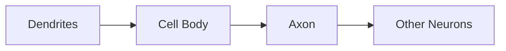

Artificial neurons are **not exact simulations of biological neurons**.

Instead, the biological neuron provides a conceptual inspiration for designing interconnected mathematical processing units.

The relationship can be viewed as:

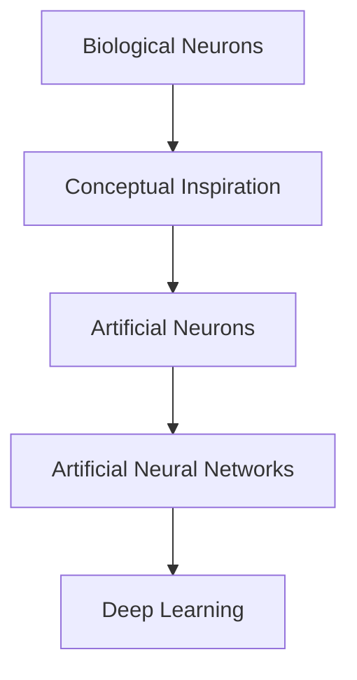

---

# 🤖 Artificial Neuron

## What is an Artificial Neuron?

An artificial neuron is the basic computational unit of a neural network.

It receives input values, multiplies them by weights, adds a bias, and applies an activation function.

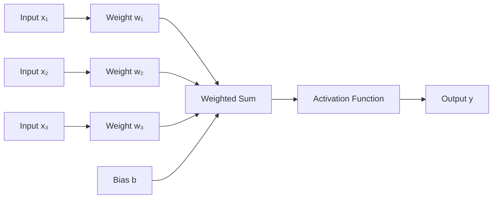

The mathematical computation performed by the neuron is:

\[
z = \sum_{i=1}^{n} w_i x_i + b
\]

The final output is:

\[
y = f(z)
\]

Where:

| Symbol | Meaning |
|---|---|
| \(x_i\) | Input |
| \(w_i\) | Weight |
| \(b\) | Bias |
| \(z\) | Weighted sum / pre-activation |
| \(f\) | Activation function |
| \(y\) | Neuron output |

---

## 🧮 The Linear Transformation

Before applying an activation function, the neuron performs a linear transformation:

\[
z = w_1x_1 + w_2x_2 + \cdots + w_nx_n + b
\]

This can also be written using vector notation:

\[
z = \mathbf{w}^{T}\mathbf{x} + b
\]

Where:

- \(\mathbf{x}\) represents the input vector
- \(\mathbf{w}\) represents the weight vector
- \(b\) represents the bias

This simple equation is one of the most important mathematical building blocks in Deep Learning.

---

## 🔢 Numerical Example

Consider a neuron with two inputs:

\[
x_1 = 2
\]

\[
x_2 = 3
\]

Weights:

\[
w_1 = 0.5
\]

\[
w_2 = 0.8
\]

Bias:

\[
b = 0.2
\]

The weighted sum is:

\[
z = (2 \times 0.5) + (3 \times 0.8) + 0.2
\]

Therefore:

\[
z = 1.0 + 2.4 + 0.2
\]

\[
z = 3.6
\]

If ReLU is used as the activation:

\[
y = \max(0,z)
\]

then:

\[
y = 3.6
\]

The neuron therefore produces:

```text
Output = 3.6
```

---

## ⚖️ Weights

Weights determine how strongly individual inputs influence a neuron.

For example:

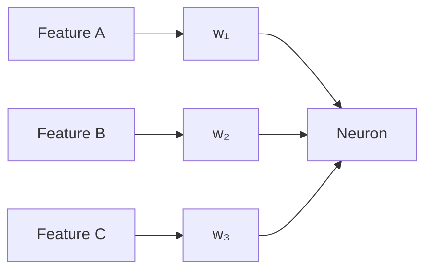

During training, the network learns appropriate weight values.

A simplified interpretation is:

- Positive weight → increases the weighted sum
- Negative weight → decreases the weighted sum
- Larger absolute value → stronger influence

Weights are therefore **learnable parameters**.

---

## ➕ Bias

The bias is another learnable parameter.

Without a bias:

\[
z = \sum_{i=1}^{n} w_i x_i
\]

With a bias:

\[
z = \sum_{i=1}^{n} w_i x_i + b
\]

The bias allows the neuron to shift the activation independently of the input values.

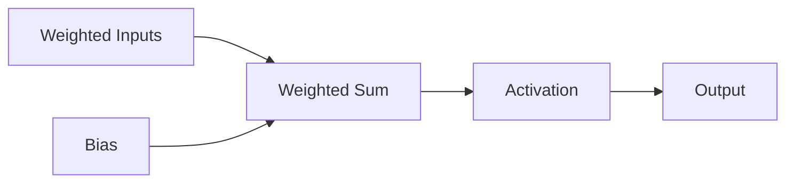

Weights and biases are learned together during training.

---

# 🧮 Learnable Parameters

## What are Parameters?

The values learned automatically during training are called **parameters**.

For a neuron:

```text
Parameters = Weights + Bias
```

For example, a neuron receiving three inputs has:

\[
3 \text{ weights} + 1 \text{ bias} = 4 \text{ parameters}
\]

For a Dense layer with:

- 3 input features
- 4 neurons

the number of parameters is:

\[
(3 \times 4) + 4 = 16
\]

The general formula for a fully connected layer is:

\[
\text{Parameters} = (n_{\text{inputs}} \times n_{\text{neurons}}) + n_{\text{neurons}}
\]

or:

\[
\text{Parameters} = n_{\text{neurons}}(n_{\text{inputs}} + 1)
\]

The additional \(n_{\text{neurons}}\) term represents the biases.

---

## 🧱 Neural Network Layers

Neural networks organize neurons into layers.

The basic architecture consists of:

- Input Layer
- Hidden Layer(s)
- Output Layer

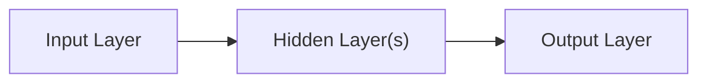

A deeper network contains multiple hidden layers:

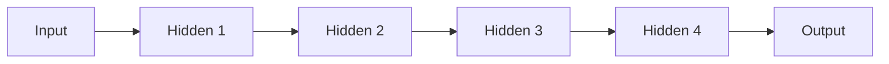

---

# 📥 Input Layer

The input layer receives the features provided to the network.

For example, a customer prediction model might receive:

```text
Age
Income
Account Balance
Transaction Count
Credit Score
```

The input can be represented as a vector:

\[
\mathbf{x} =
\begin{bmatrix}
x_1 \\
x_2 \\
x_3 \\
x_4 \\
x_5
\end{bmatrix}
\]

Different Deep Learning systems can have very different input representations.

### Tabular Data

```text
Customer Features
        │
        ▼
Feature Vector
```

### Image Data

```text
Image
  │
  ▼
Pixel Tensor
```

### Text Data

```text
Text
  │
  ▼
Tokens
  │
  ▼
Embeddings
```

### Time-Series Data

```text
Historical Observations
        │
        ▼
Sequence Tensor
```

---

# 🧠 Hidden Layers

Hidden layers transform representations received from previous layers.

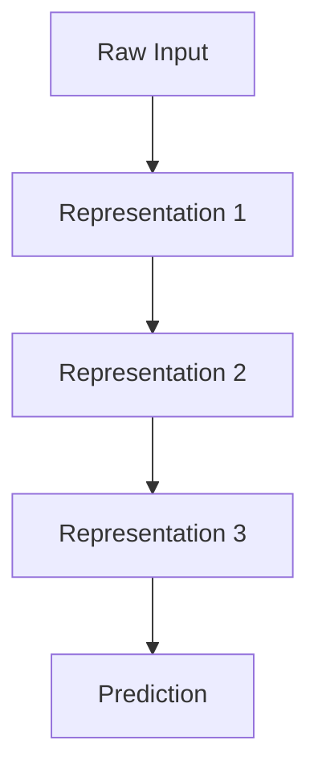

Deep networks can learn hierarchical representations.

For example, in Computer Vision:


This is a conceptual representation. The actual features learned by a network depend on its architecture and training process.

---

# 📤 Output Layer

The output layer produces the final model prediction.

The architecture of the output layer depends on the problem.

---

## Regression

Regression predicts a continuous value.

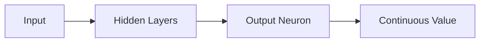

Example:

```text
Predicted House Price
        ↓
₹85,00,000
```

A regression output commonly uses a linear activation.

---

## Binary Classification

Binary classification predicts between two classes.

Examples:

- Fraud / Not Fraud
- Spam / Not Spam
- Churn / No Churn

A common design is:

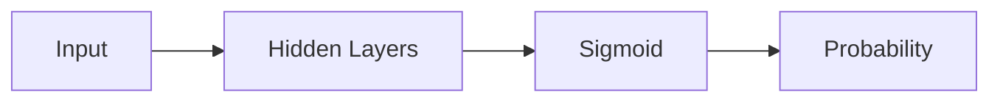

Example:

```text
Fraud Probability = 0.87
```

A threshold can then be applied to convert the probability into a class prediction.

---

## Multi-Class Classification

Multi-class classification predicts one of multiple classes.

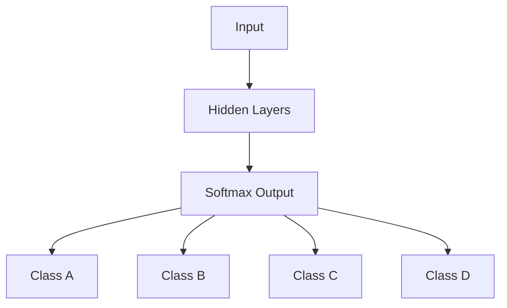

Softmax converts the output logits into a probability distribution.

---

# 🔗 Fully Connected Neural Networks

A **fully connected** or **Dense** layer connects every neuron in one layer to every neuron in the next layer.

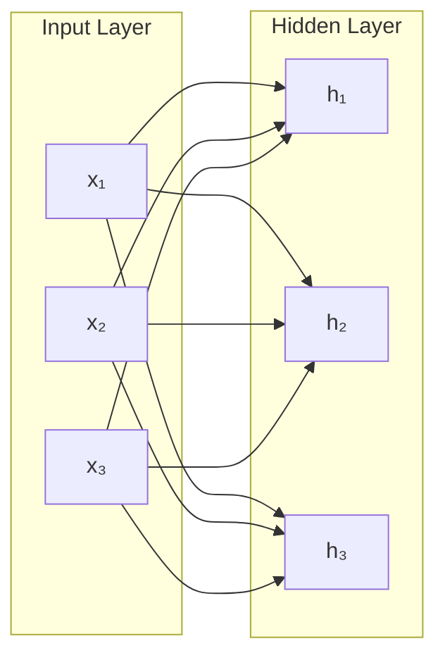

Dense layers are common in:

- MLPs
- Tabular models
- Classification
- Regression
- Recommendation systems
- Final layers of many CNN architectures

---

# 🌱 Shallow vs Deep Neural Networks

A shallow network may contain only one or a small number of hidden layers.

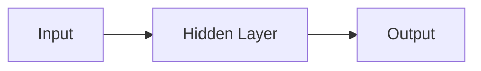

A deep network contains multiple hidden layers.


### Comparison

| Characteristic | Shallow Network | Deep Network |
|---|---|---|
| Hidden Layers | Few | Multiple |
| Representation Depth | Lower | Higher |
| Model Capacity | Lower | Higher |
| Computational Cost | Lower | Higher |
| Representation Hierarchy | Limited | More expressive |
| Parameter Count | Usually lower | Usually higher |
| Training Complexity | Lower | Higher |
| Potential Overfitting | Possible | Possible |

More depth does not automatically guarantee better performance.

Architecture selection should consider:

- Dataset size
- Problem complexity
- Data type
- Model capacity
- Computational resources
- Latency requirements
- Memory requirements
- Production constraints

---

# 🧠 Multi-Layer Perceptron

A **Multi-Layer Perceptron (MLP)** is a feedforward neural network containing an input layer, one or more hidden layers, and an output layer.

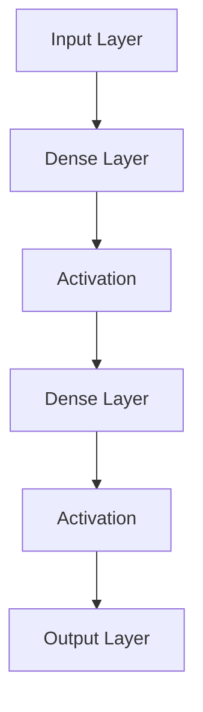

MLPs are commonly used for:

- Regression
- Binary classification
- Multi-class classification
- Tabular data
- Structured data
- Recommendation systems

MLPs provide the foundation for understanding more specialized Deep Learning architectures.

---

# 🔄 Feedforward Neural Networks

A feedforward neural network passes information from input toward output.

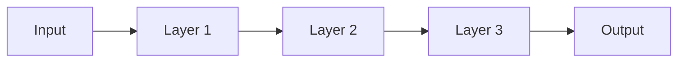

The information flows in one primary direction:

```text
Input → Hidden Layers → Output
```

This differs from recurrent architectures such as RNNs, where the architecture introduces mechanisms for processing sequential information.

---

# 🧮 Matrix Representation

Neural networks are implemented using vector and matrix operations rather than calculating every neuron individually.

For a layer:

\[
Z = XW + b
\]

Then:

\[
A = f(Z)
\]

Where:

- \(X\) = Input matrix
- \(W\) = Weight matrix
- \(b\) = Bias vector
- \(Z\) = Pre-activation
- \(f\) = Activation function
- \(A\) = Layer output

The computation can be visualized as:

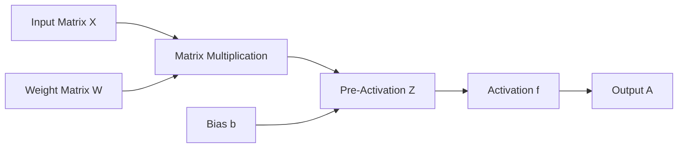

Matrix operations allow neural networks to efficiently process batches of examples.

---

# 📦 Batch Processing

Neural networks typically process multiple examples together rather than one example at a time.

Suppose:

```text
Batch Size = 32
Features = 10
```

The input matrix has a shape similar to:

```text
(32, 10)
```

A Dense layer with 16 neurons can transform this into:

```text
(32, 16)
```

Conceptually:

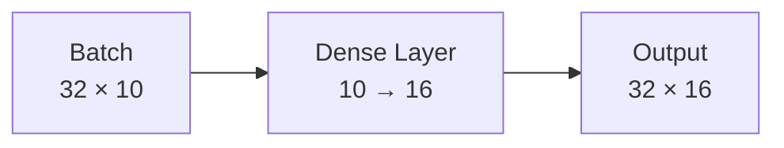

Batch processing is important for:

- GPU utilization
- Training throughput
- Memory efficiency
- Stable optimization

---

# 🔄 Forward Propagation

**Forward propagation** is the process of passing input data through the network to produce a prediction.

For a two-layer network:

\[
Z_1 = XW_1 + b_1
\]

\[
A_1 = f(Z_1)
\]

\[
Z_2 = A_1W_2 + b_2
\]

\[
A_2 = g(Z_2)
\]

The complete process can be represented as:

```mermaid
flowchart LR

    X["Input X"]
    L1["Z₁ = XW₁ + b₁"]
    A1["A₁ = f(Z₁)"]
    L2["Z₂ = A₁W₂ + b₂"]
    A2["A₂ = g(Z₂)"]

    X --> L1
    L1 --> A1
    A1 --> L2
    L2 --> A2
```

The final activation represents the model prediction.

---

# 📉 Prediction and Loss

The prediction is compared with the expected target using a loss function.

```mermaid
flowchart LR

    INPUT["Input"] --> MODEL["Neural Network"]
    MODEL --> PRED["Prediction"]

    TARGET["Expected Target"] --> LOSS["Loss Function"]
    PRED --> LOSS

    LOSS --> VALUE["Loss Value"]
```

The loss value tells the training process how far the prediction is from the desired result.

Common loss functions include:

### Regression

- Mean Squared Error
- Mean Absolute Error

### Binary Classification

- Binary Cross Entropy

### Multi-Class Classification

- Categorical Cross Entropy
- Sparse Categorical Cross Entropy

These will be studied in detail in the dedicated **Activation Functions & Loss Functions** chapter.

---

# ⚡ Activation Functions

Activation functions introduce non-linearity into neural networks.

Without nonlinear activation functions, stacking multiple linear transformations would still produce a linear transformation.

Conceptually:

```mermaid
flowchart LR

    INPUT["Inputs"] --> LINEAR["Linear Transformation"]
    LINEAR --> ACTIVATION["Non-Linear Activation"]
    ACTIVATION --> OUTPUT["Output"]
```

Common activation functions include:

- Sigmoid
- Tanh
- ReLU
- Leaky ReLU
- Softmax
- GELU

The dedicated activation-function chapter will cover their equations, graphs, use cases, advantages, and limitations.

---

# 🧠 Why Non-Linearity Matters

Consider multiple linear transformations:

\[
y = W_2(W_1x)
\]

This can be rewritten as:

\[
y = (W_2W_1)x
\]

Therefore, stacking linear layers without nonlinear activations does not provide the representational power expected from a deep network.

Adding an activation function changes the architecture:

\[
A_1 = f(W_1X + b_1)
\]

\[
A_2 = f(W_2A_1 + b_2)
\]

This allows the network to model more complex relationships.

---

# 🧠 Neural Networks as Function Approximators

A neural network can be represented as a parameterized function:

\[
y = f(x;\theta)
\]

Where:

- \(x\) = input
- \(y\) = output
- \(\theta\) = learnable parameters

The training objective is to find parameters that produce predictions that minimize the selected loss.

Conceptually:

```mermaid
flowchart TD

    INPUT["Input x"]
    MODEL["Parameterized Function f(x; θ)"]
    OUTPUT["Prediction ŷ"]
    LOSS["Loss"]
    OPT["Optimization"]
    PARAM["Updated Parameters θ"]

    INPUT --> MODEL
    MODEL --> OUTPUT
    OUTPUT --> LOSS
    LOSS --> OPT
    OPT --> PARAM
    PARAM --> MODEL
```

This mathematical perspective becomes important when studying:

- Gradient Descent
- Backpropagation
- Optimization
- Regularization
- Generalization

---

# 📊 Model Capacity

Model capacity describes the ability of a neural network to learn complex functions.

Capacity is influenced by:

- Number of layers
- Number of neurons
- Number of parameters
- Architecture
- Activation functions
- Training data
- Regularization

A small network:

```mermaid
flowchart LR

    I["Input"] --> H["Small Hidden Layer"] --> O["Output"]
```

A larger network:

```mermaid
flowchart LR

    I["Input"] --> H1["Large Hidden Layer"]
    H1 --> H2["Large Hidden Layer"]
    H2 --> H3["Large Hidden Layer"]
    H3 --> O["Output"]
```

Higher capacity can allow the model to learn more complex relationships.

However, high capacity can also increase the risk of overfitting when training data is insufficient or poorly representative.

---

# 🔁 How Neural Networks Learn

The complete high-level training process is:

```mermaid
flowchart TD

    DATA["Training Data"]
    FORWARD["Forward Propagation"]
    PRED["Prediction"]
    LOSS["Loss Calculation"]
    BACK["Backpropagation"]
    GRAD["Gradients"]
    OPT["Optimizer"]
    UPDATE["Parameter Update"]

    DATA --> FORWARD
    FORWARD --> PRED
    PRED --> LOSS
    LOSS --> BACK
    BACK --> GRAD
    GRAD --> OPT
    OPT --> UPDATE
    UPDATE --> FORWARD
```

The process repeats over many batches and epochs.

At a high level:

```text
Forward Pass
     ↓
Loss
     ↓
Backward Pass
     ↓
Gradient
     ↓
Parameter Update
     ↓
Repeat
```

The mathematical details of backpropagation and optimization are covered in later chapters.

---

# ⚠ Common Neural Network Problems

## Vanishing Gradients

Gradients can become extremely small during backpropagation.

This can make early layers difficult to train.

```mermaid
flowchart LR

    OUTPUT["Output Layer"]
    H3["Hidden 3"]
    H2["Hidden 2"]
    H1["Hidden 1"]
    INPUT["Input Layer"]

    OUTPUT --> H3
    H3 --> H2
    H2 --> H1
    H1 --> INPUT

    OUTPUT -.->|"Gradient"| H3
    H3 -.->|"Smaller"| H2
    H2 -.->|"Smaller"| H1
    H1 -.->|"Very Small"| INPUT
```

This problem helped motivate improved activation functions, initialization methods, normalization techniques, and architectures.

---

## Exploding Gradients

Gradients can also become excessively large.

```mermaid
flowchart LR

    OUTPUT["Output"]
    H3["Hidden 3"]
    H2["Hidden 2"]
    H1["Hidden 1"]

    OUTPUT --> H3
    H3 --> H2
    H2 --> H1

    OUTPUT -.->|"Gradient"| H3
    H3 -.->|"Larger"| H2
    H2 -.->|"Very Large"| H1
```

Common techniques for addressing optimization instability include:

- Gradient clipping
- Better initialization
- Normalization
- Appropriate learning rates
- Improved optimizers

---

## Overfitting

A model can memorize training data instead of learning patterns that generalize.

```mermaid
flowchart LR

    TRAIN["Training Data"]
    MODEL["High-Capacity Model"]
    TRAINPERF["Excellent Training Performance"]
    TEST["Unseen Data"]
    TESTPERF["Poor Generalization"]

    TRAIN --> MODEL
    MODEL --> TRAINPERF
    MODEL --> TEST
    TEST --> TESTPERF
```

Regularization and validation strategies are important tools for controlling overfitting.

---

## Underfitting

Underfitting occurs when a model is too limited to capture important patterns.

```mermaid
flowchart LR

    DATA["Complex Data"]
    MODEL["Insufficient Model Capacity"]
    PERF["Poor Training Performance"]

    DATA --> MODEL
    MODEL --> PERF
```

The solution may involve:

- Increasing model capacity
- Improving features
- Training longer
- Reducing excessive regularization
- Improving optimization

---

# 💻 Building a Neural Network with Keras

Keras provides a high-level API for defining and training neural networks.

A simple binary classification model can be created using the Sequential API:

```python
from tensorflow import keras
from tensorflow.keras import layers

model = keras.Sequential([
    layers.Input(shape=(4,)),
    layers.Dense(16, activation="relu"),
    layers.Dense(8, activation="relu"),
    layers.Dense(1, activation="sigmoid")
])

model.summary()
```

The architecture is:

```mermaid
flowchart TD

    I["4 Input Features"]
    D1["Dense 16<br/>ReLU"]
    D2["Dense 8<br/>ReLU"]
    O["Dense 1<br/>Sigmoid"]
    P["Binary Prediction"]

    I --> D1
    D1 --> D2
    D2 --> O
    O --> P
```

The Sequential API is useful for straightforward linear model architectures.

More complex architectures can be built using the Keras Functional API, which will be covered later.

---

# 💻 Building a Neural Network with PyTorch

The same conceptual architecture can be implemented using PyTorch.

```python
import torch
import torch.nn as nn


class NeuralNetwork(nn.Module):

    def __init__(self):
        super().__init__()

        self.network = nn.Sequential(
            nn.Linear(4, 16),
            nn.ReLU(),
            nn.Linear(16, 8),
            nn.ReLU(),
            nn.Linear(8, 1),
            nn.Sigmoid()
        )

    def forward(self, x):
        return self.network(x)


model = NeuralNetwork()

print(model)
```

The architecture is:

```mermaid
flowchart TD

    I["Input<br/>4 Features"]
    L1["Linear<br/>4 → 16"]
    R1["ReLU"]
    L2["Linear<br/>16 → 8"]
    R2["ReLU"]
    L3["Linear<br/>8 → 1"]
    S["Sigmoid"]
    O["Prediction"]

    I --> L1
    L1 --> R1
    R1 --> L2
    L2 --> R2
    R2 --> L3
    L3 --> S
    S --> O
```

PyTorch provides lower-level control over:

- Tensors
- Automatic differentiation
- Models
- Optimizers
- Datasets
- DataLoaders
- Training loops
- GPU execution

---

# 🧪 Forward Pass in PyTorch

A PyTorch model receives tensor input and performs a forward pass.

```python
import torch

x = torch.randn(5, 4)

with torch.no_grad():
    predictions = model(x)

print(predictions.shape)
```

Here:

```text
5 = Number of Samples
4 = Number of Input Features
```

The output shape is:

```text
[5, 1]
```

because the model produces one prediction for each input sample.

---

# 🧩 Neural Network Architecture Landscape

Artificial Neural Networks provide the foundation for many specialized Deep Learning architectures.

```mermaid
flowchart TD

    ANN["Artificial Neural Networks"]

    MLP["Multi-Layer Perceptron"]
    DNN["Deep Neural Network"]

    CNN["Convolutional Neural Network"]
    RNN["Recurrent Neural Network"]
    LSTM["LSTM / GRU"]

    TRANS["Transformer"]
    VIT["Vision Transformer"]

    AE["Autoencoder"]
    GAN["Generative Adversarial Network"]

    ANN --> MLP
    MLP --> DNN

    DNN --> CNN
    DNN --> RNN
    DNN --> AE
    DNN --> TRANS
    DNN --> GAN

    RNN --> LSTM
    TRANS --> VIT
```

The important idea is that Deep Learning is not one single architecture.

Different architectures are designed to capture different structures in data.

---

# 🌍 Real-World Applications

Neural Networks are used across many industries.

| Application | Typical Architecture |
|---|---|
| Customer Churn | MLP / DNN |
| Fraud Detection | MLP / DNN |
| Credit Risk | MLP / DNN |
| Image Classification | CNN / Vision Transformer |
| Object Detection | CNN / Vision Transformer |
| Speech Recognition | RNN / Transformer |
| Text Classification | Transformer |
| Recommendation Systems | MLP / Specialized Architectures |
| Time-Series Forecasting | RNN / Transformer |
| Anomaly Detection | Autoencoder |
| Image Generation | GAN / Diffusion |
| Generative AI | Transformer / Diffusion |

---

# 🏢 Enterprise Perspective

Neural Networks are rarely deployed as isolated Python scripts in enterprise environments.

A production inference architecture may look like:

```mermaid
flowchart LR

    CLIENT["Client Application"]
    API["API Gateway"]
    SERVICE["Inference Service"]
    RUNTIME["Model Runtime"]
    MODEL["Neural Network"]
    PRED["Prediction"]
    MON["Observability"]

    CLIENT --> API
    API --> SERVICE
    SERVICE --> RUNTIME
    RUNTIME --> MODEL
    MODEL --> PRED
    PRED --> MON
```

A production training lifecycle may look like:

```mermaid
flowchart LR

    DATA["Data Sources"]
    PIPE["Data Pipeline"]
    DATASET["Training Dataset"]
    EXP["Experiment"]
    TRAIN["Training"]
    EVAL["Evaluation"]
    REG["Model Registry"]
    DEPLOY["Deployment"]
    MON["Monitoring"]

    DATA --> PIPE
    PIPE --> DATASET
    DATASET --> EXP
    EXP --> TRAIN
    TRAIN --> EVAL
    EVAL --> REG
    REG --> DEPLOY
    DEPLOY --> MON
```

Enterprise considerations include:

- Data quality
- Reproducibility
- Model versioning
- Experiment tracking
- GPU infrastructure
- Model serving
- Inference latency
- Throughput
- Scalability
- Security
- Monitoring
- Cost optimization
- Model lifecycle management

---

!!! tip "Production Insight"

    A neural network should not be selected only because it provides high training accuracy.

    Production architecture must also consider inference latency, memory consumption, throughput, scalability, hardware requirements, observability, security, and operational cost.

---

# 🧱 Neural Network to Production System

The transition from a neural network experiment to a production system requires several additional engineering layers.

```mermaid
flowchart TD

    RESEARCH["Research / Experiment"]
    MODEL["Neural Network"]
    EVAL["Model Evaluation"]
    PACKAGE["Model Packaging"]
    SERVE["Model Serving"]
    SCALE["Scalable Infrastructure"]
    OBS["Observability"]
    GOVERN["Governance"]

    RESEARCH --> MODEL
    MODEL --> EVAL
    EVAL --> PACKAGE
    PACKAGE --> SERVE
    SERVE --> SCALE
    SCALE --> OBS
    OBS --> GOVERN
```

This distinction between **model development** and **production AI engineering** is important throughout this Deep Learning module.

---

# ⚠ Common Mistakes

When working with neural networks, engineers commonly make mistakes such as:

- Using an unnecessarily complex architecture
- Ignoring input normalization
- Choosing an inappropriate activation function
- Choosing an unsuitable output layer
- Using an inappropriate loss function
- Selecting a poor learning rate
- Ignoring overfitting
- Training without a validation strategy
- Ignoring class imbalance
- Focusing only on training accuracy
- Ignoring inference latency
- Ignoring model size and memory requirements
- Ignoring deployment constraints

---

# ⚠ Challenges and Limitations

Neural Networks are powerful, but they introduce several challenges.

## Data Dependency

Performance depends heavily on the quality, quantity, and representativeness of training data.

## Computational Requirements

Large networks can require GPUs or specialized accelerators.

## Interpretability

Internal representations can be difficult to interpret.

## Hyperparameter Sensitivity

Performance can depend significantly on:

- Learning rate
- Batch size
- Network depth
- Number of neurons
- Initialization
- Optimizer
- Regularization

## Production Cost

Large models can require substantial compute and memory during inference.

## Generalization

A model must learn patterns that generalize to unseen data rather than simply memorizing the training dataset.

---

# 📌 Key Takeaways

- Artificial Neural Networks are fundamental building blocks of Deep Learning.
- An artificial neuron combines inputs using weights and a bias.
- The neuron applies an activation function to produce its output.
- Weights and biases are learnable parameters.
- Neural networks are organized into input, hidden, and output layers.
- Dense layers connect every neuron in one layer to every neuron in the next.
- MLPs are common feedforward neural networks.
- Deep Neural Networks contain multiple hidden layers.
- Forward propagation produces predictions.
- Loss functions measure prediction error.
- Backpropagation calculates gradients used to update parameters.
- Activation functions introduce non-linearity.
- Matrix operations make neural network computation efficient.
- Batch processing is fundamental to efficient Deep Learning training.
- Model capacity depends on architecture, depth, width, and parameter count.
- Keras provides a high-level API for building neural networks.
- PyTorch provides flexible tensor, model, autograd, and training capabilities.
- CNNs, RNNs, Transformers, Autoencoders, GANs, and other architectures build upon these fundamental concepts.
- Production Deep Learning requires more than model accuracy—it requires reliable data pipelines, deployment, monitoring, scalability, security, and cost management.

---

# 📚 Further Reading

The following chapters build upon the concepts introduced here:

- Artificial Neural Networks
- Deep Neural Networks
- Activation Functions
- Loss Functions
- Forward Propagation
- Backpropagation
- Gradient Descent
- Optimization Algorithms
- Weight Initialization
- Regularization
- TensorFlow and Keras
- PyTorch
- Convolutional Neural Networks
- Recurrent Neural Networks
- Transformers
- Generative Models

---

## ➡️ Next Chapter

**[03. Shallow And Deep Neural Networks ](03-shallow-and-deep-neural-networks.md)**

---

> **Enterprise AI Engineering Handbook**  
> *Building Production-Grade Enterprise AI Systems — One Chapter at a Time.*