# 03. Shallow and Deep Neural Networks

> Understand how neural networks evolve from simple shallow architectures to deep neural networks, how depth and width affect model capacity, why deep networks learn hierarchical representations, and how to choose an appropriate architecture for real-world problems.

---

## 🎯 Learning Objectives

After completing this chapter, you will be able to:

- Explain what a shallow neural network is
- Explain what a Deep Neural Network (DNN) is
- Understand the difference between network depth and network width
- Understand the relationship between layers, neurons, and parameters
- Understand how hidden layers transform representations
- Explain why depth enables hierarchical feature learning
- Understand Multi-Layer Perceptrons as the foundation of DNNs
- Compare shallow and deep architectures
- Understand model capacity and expressiveness
- Understand the relationship between depth, width, and computational cost
- Understand overfitting and underfitting in shallow and deep networks
- Understand vanishing and exploding gradient challenges
- Understand why activation functions are essential in deep networks
- Understand the role of initialization and normalization in deep networks
- Build shallow and deep neural networks using Keras
- Build shallow and deep neural networks using PyTorch
- Understand when a deeper network is useful
- Understand why deeper is not always better
- Understand the production implications of deeper architectures

---

## 📖 Overview

A neural network can contain one or more hidden layers between the input and output layers.

A network with relatively few hidden layers is commonly described as a **shallow neural network**.

A network containing multiple hidden layers is called a **Deep Neural Network (DNN)**.

The fundamental difference is therefore the **depth of the network**.

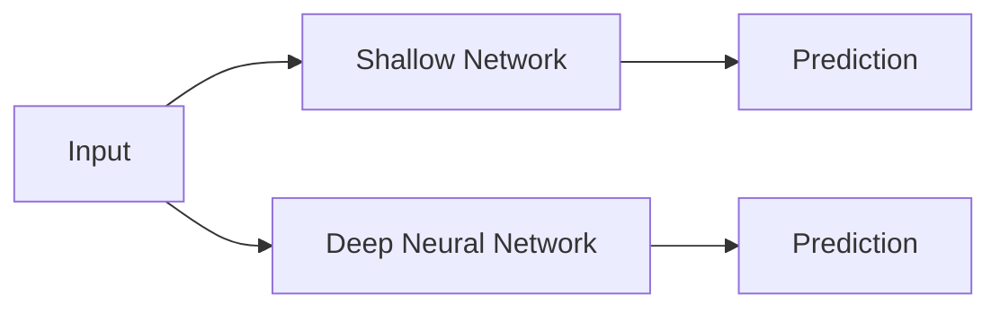

The key advantage of increasing depth is the ability to learn increasingly hierarchical representations.

For example, a computer vision model may conceptually learn:


This hierarchical representation learning is one of the defining characteristics of Deep Learning.

---

# 🧱 What is a Shallow Neural Network?

A shallow neural network contains a small number of hidden layers.

A simple example is:

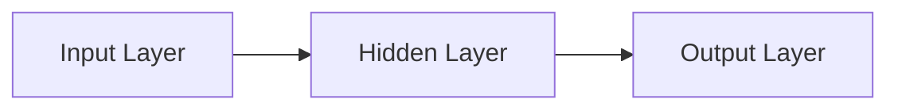

The hidden layer contains neurons that transform the input representation before passing it to the output layer.

A shallow network can still solve non-linear problems because the hidden layer uses nonlinear activation functions.

For example:

\[
A = f(XW_1 + b_1)
\]

followed by:

\[
Y = g(AW_2 + b_2)
\]

Even with a single hidden layer, the network can represent complex functions.

---

## 🧠 Example of a Shallow Network

Consider a classification problem with four input features.

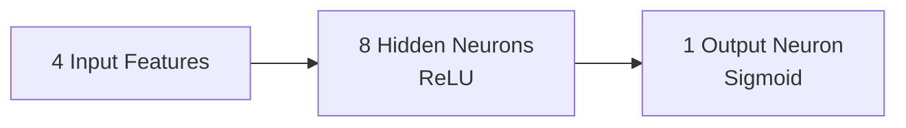

The architecture could be:

```python
from tensorflow import keras

model = keras.Sequential([
    keras.layers.Input(shape=(4,)),
    keras.layers.Dense(8, activation="relu"),
    keras.layers.Dense(1, activation="sigmoid")
])

model.summary()
```

This model has:

- 4 input features
- 1 hidden layer
- 8 hidden neurons
- 1 output neuron

It is therefore a shallow feedforward neural network.

---

# 🏗 What is a Deep Neural Network?

A **Deep Neural Network (DNN)** contains multiple hidden layers.

For example:

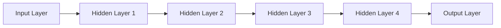

Each hidden layer transforms the representation generated by the previous layer.

A deep network can therefore progressively construct more abstract representations.

---

## 🔢 Mathematical Representation of a Deep Network

Consider a network with three hidden layers.

The first hidden layer computes:

\[
Z_1 = XW_1 + b_1
\]

\[
A_1 = f_1(Z_1)
\]

The second layer computes:

\[
Z_2 = A_1W_2 + b_2
\]

\[
A_2 = f_2(Z_2)
\]

The third layer computes:

\[
Z_3 = A_2W_3 + b_3
\]

\[
A_3 = f_3(Z_3)
\]

Finally:

\[
Y = g(A_3W_4 + b_4)
\]

The complete network can therefore be viewed as:

\[
Y =
g\left(
f_3
\left(
f_2
\left(
f_1(XW_1+b_1)W_2+b_2
\right)
W_3+b_3
\right)
W_4+b_4
\right)
\]

This nested transformation is what gives deep networks their representational power.

---

# 📏 Depth vs Width

Two important concepts when discussing neural network architecture are:

- **Depth**
- **Width**

### Depth

Depth generally refers to the number of layers in the network.

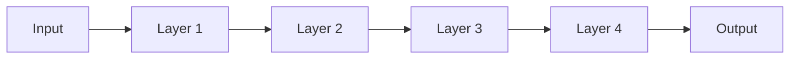

Increasing the number of hidden layers increases the network's depth.

### Width

Width refers to the number of neurons in a layer.

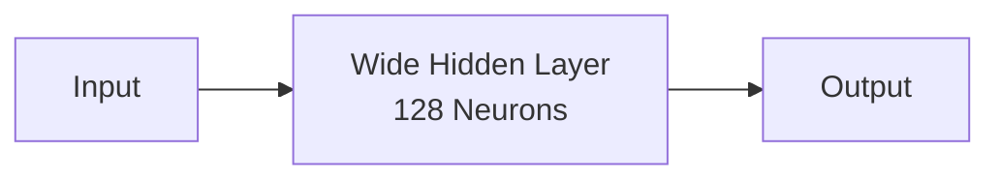

A network can therefore be:

- Shallow and narrow
- Shallow and wide
- Deep and narrow
- Deep and wide

---

## 📊 Depth vs Width

| Concept | Meaning | Example |
|---|---|---|
| Depth | Number of layers | 5 hidden layers |
| Width | Number of neurons in a layer | 128 neurons |
| Capacity | Ability to represent complex functions | Depends on architecture |
| Compute | Processing required | Increases with parameters |
| Memory | Parameters + activations | Generally increases with model size |

Depth and width are complementary architectural choices.

---

# 🧮 Number of Parameters

Increasing depth or width generally increases the number of learnable parameters.

For a Dense layer:

\[
P = (N_{in} \times N_{out}) + N_{out}
\]

Where:

- \(N_{in}\) = number of input neurons
- \(N_{out}\) = number of output neurons

For example, a layer with:

\[
10 \text{ inputs}
\]

and:

\[
20 \text{ neurons}
\]

has:

\[
P = (10 \times 20) + 20
\]

\[
P = 220
\]

learnable parameters.

---

## 📈 Parameter Growth

Consider a network:

```text
Input = 100
Hidden 1 = 128
Hidden 2 = 128
Hidden 3 = 128
Output = 10
```

The parameter count is:

\[
(100 \times 128 + 128)
\]

plus:

\[
(128 \times 128 + 128)
\]

plus:

\[
(128 \times 128 + 128)
\]

plus:

\[
(128 \times 10 + 10)
\]

Total:

\[
12928 + 16512 + 16512 + 1290 = 47242
\]

So the network contains **47,242 learnable parameters**.

This demonstrates why increasing width and depth affects:

- Training cost
- Memory usage
- Inference cost
- Model capacity

---

# 🧠 Why Does Depth Matter?

The key advantage of depth is **hierarchical representation learning**.

Instead of trying to learn the entire problem in one transformation, a deep network can learn a sequence of representations.

For example, an image model may conceptually learn:

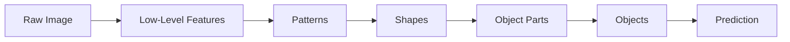

The deeper layers operate on increasingly transformed representations rather than directly on raw input data.

---

# 🧩 Representation Hierarchy

Different types of data can produce different conceptual hierarchies.

### Images


### Text


### Audio


These diagrams represent the intuition behind hierarchical representation learning rather than a strict mapping of individual neurons to semantic concepts.

---

# 🔬 Shallow vs Deep Representation Learning

A shallow model has fewer transformation stages:

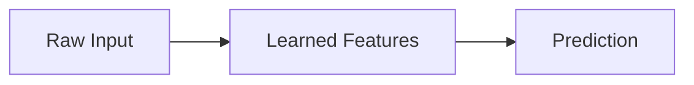

A deep model contains multiple transformation stages:

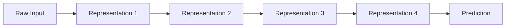

The deeper architecture provides more opportunities for the network to construct intermediate representations.

---

# ⚖️ Shallow vs Deep Networks

| Characteristic | Shallow Network | Deep Network |
|---|---|---|
| Hidden Layers | Few | Multiple |
| Representation Depth | Lower | Higher |
| Model Capacity | Lower to moderate | Potentially high |
| Hierarchical Learning | Limited | Strong |
| Parameter Count | Usually lower | Usually higher |
| Training Cost | Lower | Higher |
| Memory Requirements | Lower | Higher |
| Optimization Complexity | Lower | Higher |
| Overfitting Risk | Possible | Can be significant |
| Hardware Requirements | Often modest | May require GPU/accelerator |
| Suitable Problems | Simpler relationships | Complex representations |

Deep networks are particularly useful when the problem contains complex hierarchical structure.

---

# 🧠 Universal Approximation vs Practical Deep Learning

A common misconception is:

> "If a single hidden layer can approximate complex functions, why do we need deep networks?"

The **Universal Approximation Theorem** shows, under certain assumptions, that a sufficiently wide neural network with a single hidden layer can approximate a broad class of continuous functions.

However, this does not mean shallow networks are always practically preferable.

A very wide shallow network may require:

- A very large number of neurons
- Many parameters
- Large amounts of training data
- High computational cost

Deep networks can sometimes represent complex functions more efficiently by composing multiple transformations.

Conceptually:

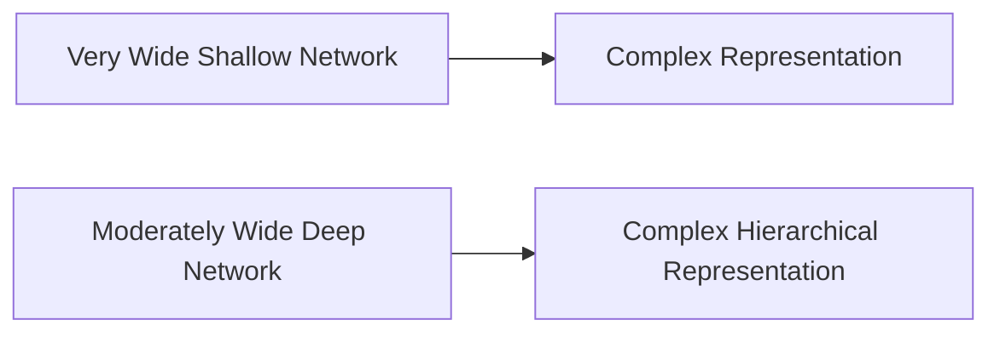

The practical advantage of depth is therefore not simply "more layers = better".

It is the ability to **compose representations**.

---

# 🧱 Function Composition

A shallow network can be viewed as one major transformation:

\[
y = f(x)
\]

A deep network composes multiple functions:

\[
y = f_4(f_3(f_2(f_1(x))))
\]

This composition allows the model to construct increasingly complex transformations.

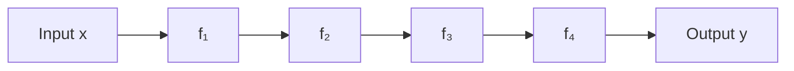

This idea of function composition is central to understanding why depth matters.

---

# 🔄 Forward Propagation in a Deep Network

For a deep network, forward propagation applies each layer sequentially.

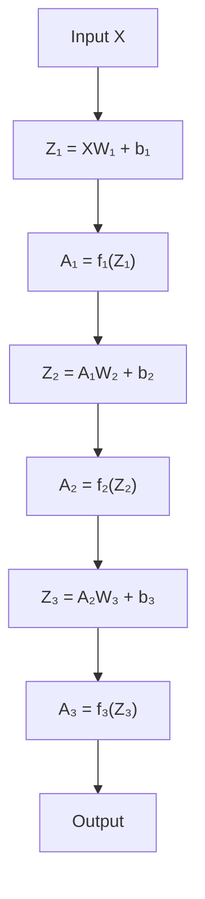

Each layer therefore consumes the representation produced by the previous layer.

---

# 🔁 Backpropagation Through Deep Networks

During training, gradients must propagate backward through all layers.

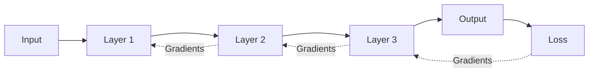

As the number of layers increases, optimization can become more challenging.

This historically contributed to problems such as:

- Vanishing gradients
- Exploding gradients
- Slow convergence

Modern architectures and optimization techniques address many of these challenges.

---

# ⚠ Vanishing Gradient Problem

In deep networks, gradients can become progressively smaller as they propagate backward.

Conceptually:


When gradients become extremely small, earlier layers may learn very slowly.

This can make deep network training difficult.

Techniques that help include:

- ReLU-family activations
- Better initialization
- Batch Normalization
- Residual Connections
- Appropriate optimization techniques

---

# ⚠ Exploding Gradient Problem

The opposite problem can occur when gradients become extremely large.


Potential solutions include:

- Gradient clipping
- Better initialization
- Appropriate learning rate
- Normalization
- Improved optimizers

---

# 🎯 Model Capacity

Model capacity describes how complex a function a model can potentially represent.

Capacity is affected by:

- Depth
- Width
- Number of parameters
- Activation functions
- Architecture
- Training data
- Regularization

A simplified relationship is:

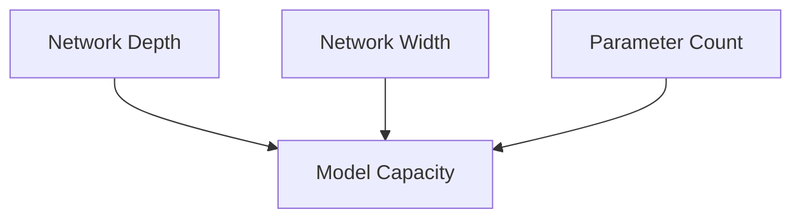

Increasing capacity can improve the ability to model complex relationships.

However, excessive capacity can increase the risk of overfitting.

---

# ⚠ Overfitting in Deep Networks

Deep networks can have very high capacity.

If the training dataset is small or not representative, the model may memorize training examples.

```mermaid
flowchart LR

    DATA["Training Data"]
    DNN["High-Capacity DNN"]
    TRAIN["Very Low Training Error"]
    TEST["High Test Error"]

    DATA --> DNN
    DNN --> TRAIN
    DNN --> TEST
```

This is why model architecture must be considered together with:

- Dataset size
- Validation strategy
- Regularization
- Data augmentation
- Early stopping
- Dropout
- Weight decay

---

# ⚠ Underfitting

A network can also be too simple.

```mermaid
flowchart LR

    DATA["Complex Problem"]
    MODEL["Low-Capacity Model"]
    ERROR["High Training Error"]

    DATA --> MODEL
    MODEL --> ERROR
```

Symptoms may include:

- High training loss
- High validation loss
- Poor training accuracy
- Poor validation accuracy

Possible solutions include:

- Increase model capacity
- Add layers
- Add neurons
- Improve input representation
- Train longer
- Reduce excessive regularization

---

# ⚖️ Finding the Right Capacity

The goal is not to maximize depth.

The goal is to find an architecture with sufficient capacity to learn the problem while maintaining good generalization and acceptable operational cost.

```mermaid
flowchart LR

    SIMPLE["Too Simple"]
    GOOD["Appropriate Capacity"]
    COMPLEX["Too Complex"]

    SIMPLE --> UNDER["Underfitting"]
    GOOD --> GENERAL["Good Generalization"]
    COMPLEX --> OVER["Overfitting"]
```

The optimal architecture depends on the:

- Problem
- Dataset
- Feature representation
- Compute budget
- Latency requirements
- Accuracy requirements

---

# 🧪 Building a Shallow Network with Keras

A simple shallow binary classifier can be implemented using Keras.

```python
import tensorflow as tf
from tensorflow import keras

shallow_model = keras.Sequential([
    keras.layers.Input(shape=(10,)),
    keras.layers.Dense(16, activation="relu"),
    keras.layers.Dense(1, activation="sigmoid")
])

shallow_model.summary()
```

Architecture:

```mermaid
flowchart LR

    I["10 Features"]
    H["Dense 16<br/>ReLU"]
    O["Dense 1<br/>Sigmoid"]

    I --> H
    H --> O
```

This architecture has one hidden layer.

---

# 🧪 Building a Deep Network with Keras

A deeper model can be created by adding multiple hidden layers.

```python
deep_model = keras.Sequential([
    keras.layers.Input(shape=(10,)),
    keras.layers.Dense(64, activation="relu"),
    keras.layers.Dense(64, activation="relu"),
    keras.layers.Dense(32, activation="relu"),
    keras.layers.Dense(16, activation="relu"),
    keras.layers.Dense(1, activation="sigmoid")
])

deep_model.summary()
```

Architecture:

```mermaid
flowchart LR

    I["10 Features"]
    H1["Dense 64<br/>ReLU"]
    H2["Dense 64<br/>ReLU"]
    H3["Dense 32<br/>ReLU"]
    H4["Dense 16<br/>ReLU"]
    O["Dense 1<br/>Sigmoid"]

    I --> H1
    H1 --> H2
    H2 --> H3
    H3 --> H4
    H4 --> O
```

The network has significantly greater depth and capacity than the shallow example.

---

# 🔍 Comparing Keras Architectures

```python
print("Shallow Model")
shallow_model.summary()

print("\nDeep Model")
deep_model.summary()
```

The deeper model generally has more parameters because each additional layer introduces additional weights and biases.

However, a larger parameter count does not guarantee better validation or production performance.

---

# 🐍 Building a Shallow Network with PyTorch

```python
import torch
import torch.nn as nn


class ShallowNetwork(nn.Module):

    def __init__(self):
        super().__init__()

        self.network = nn.Sequential(
            nn.Linear(10, 16),
            nn.ReLU(),
            nn.Linear(16, 1),
            nn.Sigmoid()
        )

    def forward(self, x):
        return self.network(x)


shallow_model = ShallowNetwork()

print(shallow_model)
```

Architecture:

```mermaid
flowchart LR

    I["10 Features"]
    L1["Linear 10 → 16"]
    R["ReLU"]
    O["Linear 16 → 1"]
    S["Sigmoid"]

    I --> L1
    L1 --> R
    R --> O
    O --> S
```

---

# 🐍 Building a Deep Network with PyTorch

```python
class DeepNetwork(nn.Module):

    def __init__(self):
        super().__init__()

        self.network = nn.Sequential(
            nn.Linear(10, 64),
            nn.ReLU(),

            nn.Linear(64, 64),
            nn.ReLU(),

            nn.Linear(64, 32),
            nn.ReLU(),

            nn.Linear(32, 16),
            nn.ReLU(),

            nn.Linear(16, 1),
            nn.Sigmoid()
        )

    def forward(self, x):
        return self.network(x)


deep_model = DeepNetwork()

print(deep_model)
```

Architecture:

```mermaid
flowchart LR

    I["10 Features"]
    L1["Linear 10 → 64"]
    R1["ReLU"]
    L2["Linear 64 → 64"]
    R2["ReLU"]
    L3["Linear 64 → 32"]
    R3["ReLU"]
    L4["Linear 32 → 16"]
    R4["ReLU"]
    O["Linear 16 → 1"]
    S["Sigmoid"]

    I --> L1
    L1 --> R1
    R1 --> L2
    L2 --> R2
    R2 --> L3
    L3 --> R3
    R3 --> L4
    L4 --> R4
    R4 --> O
    O --> S
```

---

# 📊 Shallow vs Deep: Engineering Trade-Off

Choosing between shallow and deep architectures involves multiple trade-offs.

| Factor | Shallow | Deep |
|---|---|---|
| Development Complexity | Lower | Higher |
| Training Time | Usually lower | Usually higher |
| Parameter Count | Usually lower | Usually higher |
| Memory Usage | Lower | Higher |
| Feature Learning | More limited | More hierarchical |
| Optimization | Easier | More challenging |
| Inference Cost | Lower | Potentially higher |
| Representation Power | Lower to moderate | Potentially much higher |
| Production Infrastructure | Simpler | Potentially more complex |

The correct architecture depends on the actual problem rather than a preference for depth.

---

# 🏢 Enterprise Architecture Perspective

In enterprise systems, the architecture decision should consider the complete lifecycle.

```mermaid
flowchart TD

    PROBLEM["Business Problem"]
    DATA["Data Characteristics"]
    MODEL["Model Architecture"]
    TRAIN["Training Cost"]
    EVAL["Model Evaluation"]
    SERVE["Inference Requirements"]
    SCALE["Scalability"]
    COST["Operational Cost"]

    PROBLEM --> DATA
    DATA --> MODEL
    MODEL --> TRAIN
    TRAIN --> EVAL
    EVAL --> SERVE
    SERVE --> SCALE
    SCALE --> COST
```

For example, a deeper model may improve accuracy but increase:

- GPU requirements
- Inference latency
- Memory consumption
- Deployment complexity
- Operational cost

Therefore:

> **The best model is not necessarily the deepest model. It is the model that provides the required business performance within acceptable engineering and operational constraints.**

---

# ⚙️ Deep Networks and Hardware

Deep networks perform large numbers of matrix operations.

These operations can be efficiently executed on GPUs and other accelerators.

```mermaid
flowchart LR

    MODEL["Deep Neural Network"]
    MATRIX["Matrix Operations"]
    GPU["GPU / Accelerator"]
    TRAIN["Faster Training"]

    MODEL --> MATRIX
    MATRIX --> GPU
    GPU --> TRAIN
```

This is one reason Deep Learning has evolved together with GPU and accelerator technology.

---

# 🚀 From DNN to Specialized Architectures

Deep Neural Networks provide the foundation for more specialized architectures.

```mermaid
flowchart TD

    ANN["Artificial Neural Network"]
    MLP["Multi-Layer Perceptron"]
    DNN["Deep Neural Network"]

    CNN["CNN"]
    RNN["RNN / LSTM"]
    TRANS["Transformer"]
    AE["Autoencoder"]
    GAN["GAN"]

    ANN --> MLP
    MLP --> DNN

    DNN --> CNN
    DNN --> RNN
    DNN --> TRANS
    DNN --> AE
    DNN --> GAN
```

Different architectures introduce specialized mechanisms for different data types and learning problems.

| Architecture | Primary Use |
|---|---|
| MLP | Tabular / Structured Data |
| CNN | Computer Vision |
| RNN / LSTM / GRU | Sequential Data |
| Transformer | Language / Multimodal Data |
| Autoencoder | Representation Learning |
| GAN | Generative Modeling |

---

# 🧠 Why Deep Learning Needs More Than Depth

Depth alone does not make a network effective.

Modern Deep Learning architectures combine depth with additional techniques such as:

- Appropriate activation functions
- Weight initialization
- Normalization
- Regularization
- Residual connections
- Attention mechanisms
- Specialized layers
- Optimizers
- Learning-rate scheduling

A modern deep architecture can therefore be viewed as:

```mermaid
flowchart TD

    DEPTH["Network Depth"]
    ACTIVATION["Activation Functions"]
    INIT["Weight Initialization"]
    NORM["Normalization"]
    REG["Regularization"]
    RES["Residual Connections"]
    OPT["Optimization"]

    DEPTH --> MODEL["Effective Deep Network"]
    ACTIVATION --> MODEL
    INIT --> MODEL
    NORM --> MODEL
    REG --> MODEL
    RES --> MODEL
    OPT --> MODEL
```

These techniques will be explored in subsequent chapters.

---

!!! tip "Production Insight"

    Do not increase network depth simply because a deeper model appears more sophisticated.

    Start with a reasonable baseline, establish validation performance, and increase capacity only when the problem and data justify it.

    In production, model accuracy must always be evaluated together with latency, memory, throughput, scalability, infrastructure requirements, and cost.

---

!!! note "Architecture Decision"

    A shallow network can be the correct solution for a simple structured-data problem.

    A deep network becomes more attractive when the problem requires learning complex hierarchical representations from large or high-dimensional datasets.

    Architecture selection should therefore be driven by the data and business problem—not by the assumption that Deep Learning always means "more layers."

---

# 🧪 Practical Architecture Comparison

A useful engineering workflow is:

```mermaid
flowchart TD

    BASELINE["Build Simple Baseline"]
    EVAL["Evaluate Validation Performance"]
    ERROR["Analyze Errors"]
    CAPACITY["Increase Capacity if Required"]
    REG["Apply Regularization"]
    OPT["Optimize Training"]
    FINAL["Select Production Model"]

    BASELINE --> EVAL
    EVAL --> ERROR
    ERROR --> CAPACITY
    CAPACITY --> REG
    REG --> OPT
    OPT --> FINAL
```

This approach helps avoid unnecessary model complexity.

---

# ⚠ Common Mistakes

Common mistakes when designing shallow and deep neural networks include:

- Assuming deeper always means better
- Adding too many layers without enough data
- Increasing width without monitoring validation performance
- Ignoring parameter count
- Ignoring inference cost
- Using inappropriate activation functions
- Ignoring initialization
- Ignoring normalization
- Training without a validation set
- Focusing only on training accuracy
- Ignoring overfitting
- Ignoring vanishing and exploding gradients
- Choosing architecture before understanding the data

---

# 📝 Interview Questions

## Beginner

### 1. What is a shallow neural network?

A neural network with relatively few hidden layers is commonly described as shallow.

### 2. What is a Deep Neural Network?

A neural network containing multiple hidden layers is generally called a Deep Neural Network.

### 3. What is network depth?

Depth refers to the number of layers or transformation stages in a neural network.

### 4. What is network width?

Width refers to the number of neurons in a layer.

---

## Intermediate

### 5. Why are deep networks useful?

Deep networks can learn hierarchical representations by composing multiple nonlinear transformations.

### 6. Does deeper always mean better?

No.

A deeper network may provide more capacity but can also introduce:

- Higher computational cost
- Greater memory usage
- Optimization challenges
- Overfitting risk
- Higher inference latency

### 7. What is the difference between depth and width?

Depth increases the number of transformation stages, while width increases the number of neurons within a layer.

### 8. Why can a shallow network approximate complex functions?

Under appropriate assumptions, the Universal Approximation Theorem shows that sufficiently wide shallow neural networks can approximate broad classes of continuous functions.

However, this does not imply that shallow networks are always the most efficient practical architecture.

---

## Advanced

### 9. Why can deep networks represent functions efficiently?

Deep networks compose multiple transformations:

\[
f(x) = f_n(f_{n-1}(...f_2(f_1(x))))
\]

This composition can provide efficient hierarchical representations.

### 10. Why are deep networks harder to train?

Deep networks involve more parameters and longer computational paths for gradients, which can lead to optimization challenges such as:

- Vanishing gradients
- Exploding gradients
- Slow convergence

### 11. How can vanishing gradients be mitigated?

Common approaches include:

- ReLU-family activations
- Better initialization
- Normalization
- Residual connections
- Appropriate optimizers

### 12. How would you choose between a shallow and deep model?

Consider:

- Data complexity
- Dataset size
- Representation requirements
- Model capacity
- Validation performance
- Training cost
- Inference latency
- Memory
- Scalability
- Operational cost

---

# 📌 Key Takeaways

- A shallow neural network contains relatively few hidden layers.
- A Deep Neural Network contains multiple hidden layers.
- Depth refers to the number of transformation stages.
- Width refers to the number of neurons within a layer.
- Increasing depth and width generally increases model capacity.
- Deep networks can learn hierarchical representations.
- Neural networks can be viewed as compositions of mathematical functions.
- The Universal Approximation Theorem does not mean shallow networks are always practically superior.
- Deep networks can represent complex transformations efficiently through function composition.
- Increasing depth also increases training and inference complexity.
- Deep networks can suffer from vanishing and exploding gradients.
- Initialization, normalization, activation functions, optimization, and residual connections help address deep-network training challenges.
- High-capacity models can overfit when training data is insufficient.
- Low-capacity models can underfit complex problems.
- The best architecture depends on the problem, data, and engineering constraints.
- Keras and PyTorch make it straightforward to build both shallow and deep architectures.
- Production architecture decisions must consider accuracy, latency, memory, scalability, hardware, and cost.
- Specialized architectures such as CNNs, RNNs, Transformers, Autoencoders, and GANs build upon the fundamental concepts of neural networks.

---

## 📚 Further Reading

Continue with the following chapters:

- Activation Functions & Loss Functions
- Forward Propagation & Backpropagation
- Gradient Descent & Optimization
- Weight Initialization & Regularization
- TensorFlow & Keras Fundamentals
- PyTorch Fundamentals
- Convolutional Neural Networks
- Transfer Learning
- Recurrent Neural Networks
- Attention Mechanisms
- Transformer Architecture

---

## ➡️ Next Chapter

**[04.Linear And Logistic Regression](04-linear-and-logistic-regression.md)**

---

> **Enterprise AI Engineering Handbook**  
> *Building Production-Grade Enterprise AI Systems — One Chapter at a Time.*