# 04. Linear and Logistic Regression

> Understand Linear Regression and Logistic Regression from both a Machine Learning and Deep Learning perspective, including their mathematical foundations, model architecture, probability interpretation, decision boundaries, training process, and implementations using Keras and PyTorch.

---

## 🎯 Learning Objectives

After completing this chapter, you will be able to:

- Explain Linear Regression and its purpose
- Understand simple and multiple Linear Regression
- Understand the mathematical representation of Linear Regression
- Explain coefficients, intercept, predictions, and residuals
- Understand Ordinary Least Squares (OLS)
- Understand Mean Squared Error (MSE) in regression
- Understand Linear Regression from a neural-network perspective
- Implement Linear Regression using Keras
- Implement Linear Regression using PyTorch
- Explain Logistic Regression
- Understand why Logistic Regression is used for classification
- Understand the sigmoid function
- Understand logits and probabilities
- Convert probabilities into class predictions using thresholds
- Understand decision boundaries
- Understand Binary Cross-Entropy / Log Loss at a conceptual level
- Understand Logistic Regression as a single-neuron model
- Implement Logistic Regression using Keras
- Implement Logistic Regression using PyTorch
- Compare Linear Regression and Logistic Regression
- Understand when these models are useful in Deep Learning
- Understand the relationship between regression, neural networks, activation functions, and loss functions

---

## 📖 Overview

Linear Regression and Logistic Regression are classical Machine Learning algorithms, but they are also extremely important for understanding Deep Learning.

A neural network can be viewed as a composition of mathematical transformations.

At the simplest level, a single neuron performs:

\[
z = \mathbf{w}^{T}\mathbf{x} + b
\]

Linear Regression uses this linear transformation directly to predict a continuous value.

Logistic Regression adds a **sigmoid activation function** to transform the linear output into a probability.

Therefore:

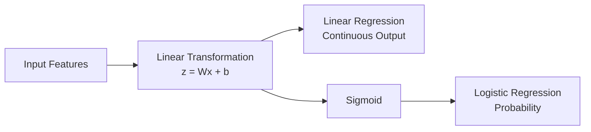

This makes Linear and Logistic Regression excellent bridge concepts between classical Machine Learning and neural networks.

---

# 📈 Part I — Linear Regression

## What is Linear Regression?

Linear Regression is a supervised learning algorithm used to model the relationship between one or more input variables and a continuous target variable.

Examples include:

- House price prediction
- Sales forecasting
- Revenue prediction
- Temperature prediction
- CO₂ emissions prediction
- Salary prediction
- Demand forecasting

The simplest form uses one input variable.

\[
\hat{y} = \theta_0 + \theta_1x
\]

Where:

- \(\hat{y}\) = predicted value
- \(x\) = input feature
- \(\theta_0\) = intercept
- \(\theta_1\) = coefficient / slope

---

## 📊 Simple Linear Regression

Simple Linear Regression uses one independent variable.

For example:

```text
Engine Size
     │
     ▼
Linear Regression
     │
     ▼
CO₂ Emissions
```

The relationship can be represented as:

\[
\hat{y} = \theta_0 + \theta_1x
\]

The model attempts to find the line that best represents the relationship between the input and target.

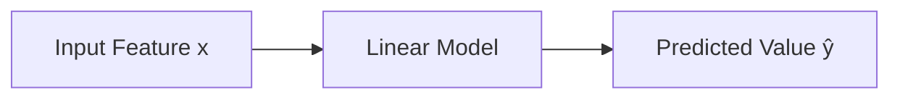

---

## 📐 Linear Regression Geometry

For one input feature, the model produces a line.

```text
y
│
│             •
│          •
│       •
│    •
│  •
│________________________ x
```

The learned line is:

\[
\hat{y} = \theta_0 + \theta_1x
\]

Where:

- \(\theta_0\) controls the vertical position
- \(\theta_1\) controls the slope

---

## 🔢 Intercept and Slope

### Intercept

The intercept is the predicted value when:

\[
x = 0
\]

Therefore:

\[
\hat{y} = \theta_0
\]

### Slope

The slope represents the expected change in the prediction for a one-unit increase in the input.

\[
\theta_1 =
\frac{\Delta y}{\Delta x}
\]

For example:

\[
\hat{y} = 100 + 20x
\]

means:

- Intercept = 100
- Slope = 20

Therefore, increasing \(x\) by one unit increases the predicted value by 20.

---

## 🧮 Multiple Linear Regression

Real-world problems often contain multiple input features.

For example:

```text
House Price
    ↑
    │
    ├── Area
    ├── Bedrooms
    ├── Location
    ├── Age
    └── Parking
```

Multiple Linear Regression extends the model:

\[
\hat{y}
=
\theta_0
+
\theta_1x_1
+
\theta_2x_2
+
\cdots
+
\theta_nx_n
\]

In vector notation:

\[
\hat{y} = X\theta
\]

with the bias included appropriately in the design matrix.

---

## 🧱 Multiple Regression Architecture

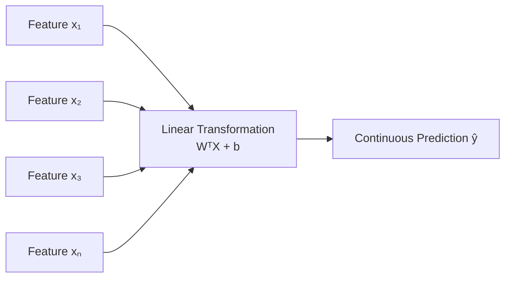

The model learns one coefficient for each feature.

---

## 🧮 Matrix Representation

For multiple features:

\[
\hat{\mathbf{y}} = X\mathbf{w} + b
\]

Where:

- \(X\) = feature matrix
- \(\mathbf{w}\) = weight vector
- \(b\) = bias
- \(\hat{\mathbf{y}}\) = predictions

This is exactly the type of matrix operation performed by a neural network's Dense / Linear layer.

---

# 📉 Residuals

A residual represents the difference between the actual value and the predicted value.

\[
e_i = y_i - \hat{y}_i
\]

For example:

```text
Actual Value
     │
     ▼
   250
     │
     │  Residual
     │
     ▼
Predicted
   230
```

Therefore:

\[
e = 250 - 230 = 20
\]

A good regression model attempts to minimize prediction errors across the dataset.

---

# 📊 Mean Squared Error

A common loss function for Linear Regression is Mean Squared Error.

\[
MSE =
\frac{1}{n}
\sum_{i=1}^{n}
(y_i-\hat{y}_i)^2
\]

The training objective is to find parameters that minimize the loss.

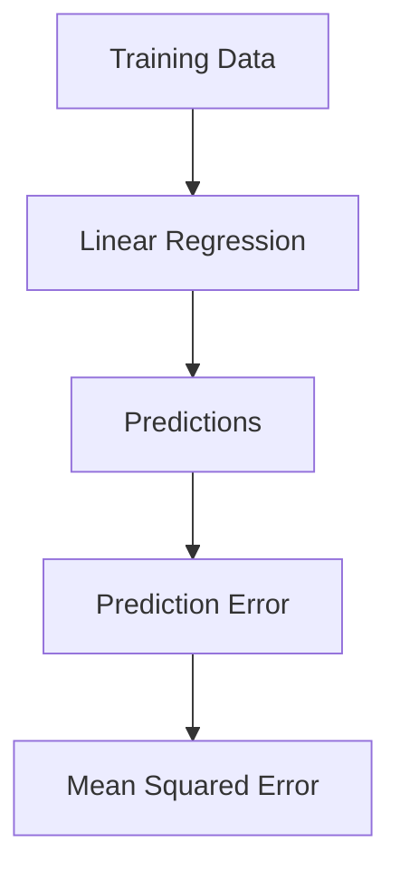

Squaring the errors means that larger errors receive greater penalty.

---

# 📐 Ordinary Least Squares

**Ordinary Least Squares (OLS)** estimates the parameters that minimize the sum of squared residuals.

The objective can be written as:

\[
\min_{\theta}
\sum_{i=1}^{n}
(y_i-\hat{y}_i)^2
\]

For suitable problems, Linear Regression can be solved analytically using the normal equation:

\[
\theta =
(X^TX)^{-1}X^Ty
\]

However, in Deep Learning and large-scale Machine Learning systems, iterative optimization methods such as Gradient Descent are often preferred.

---

# 🔄 Linear Regression Training

Linear Regression can be trained using an iterative optimization process.

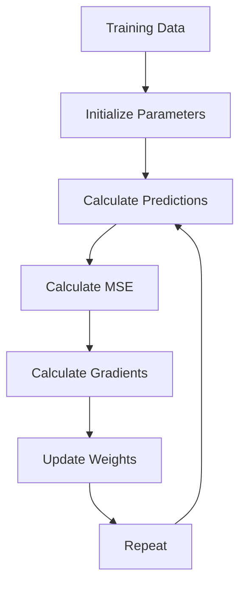

The detailed mechanics of gradient computation and optimization are covered in later chapters.

---

# 🧠 Linear Regression as a Neural Network

One of the most important Deep Learning connections is that Linear Regression can be represented as a neural network with:

- No hidden layers
- A linear output
- Learnable weights
- A learnable bias

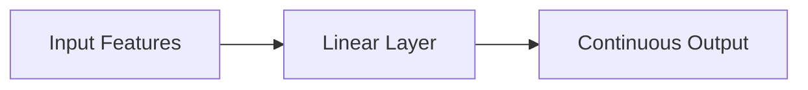

Mathematically:

\[
\hat{y} = Wx+b
\]

This is the same mathematical transformation performed by a neural network's linear layer.

---

# 💻 Linear Regression with Keras

A Linear Regression model can be created using a single Dense layer without a nonlinear activation.

```python
import tensorflow as tf
from tensorflow import keras

model = keras.Sequential([
    keras.layers.Input(shape=(3,)),
    keras.layers.Dense(1)
])

model.summary()
```

Architecture:

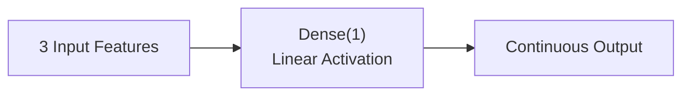

Compile the model using Mean Squared Error:

```python
model.compile(
    optimizer="adam",
    loss="mse",
    metrics=["mae"]
)
```

Train the model:

```python
history = model.fit(
    X_train,
    y_train,
    validation_data=(X_val, y_val),
    epochs=50,
    batch_size=32
)
```

---

# 🐍 Linear Regression with PyTorch

PyTorch provides the `nn.Linear` layer for linear transformations.

```python
import torch
import torch.nn as nn

model = nn.Linear(
    in_features=3,
    out_features=1
)

print(model)
```

The model implements:

\[
y = Wx+b
\]

A simple prediction can be generated using:

```python
X = torch.randn(5, 3)

predictions = model(X)

print(predictions.shape)
```

Output:

```text
torch.Size([5, 1])
```

---

# 🧪 Training Linear Regression with PyTorch

A simple training loop can be implemented as:

```python
import torch
import torch.nn as nn

model = nn.Linear(3, 1)

criterion = nn.MSELoss()
optimizer = torch.optim.SGD(
    model.parameters(),
    lr=0.01
)

for epoch in range(100):

    predictions = model(X_train)

    loss = criterion(
        predictions,
        y_train
    )

    optimizer.zero_grad()

    loss.backward()

    optimizer.step()

    if (epoch + 1) % 10 == 0:
        print(
            f"Epoch {epoch + 1}, "
            f"Loss: {loss.item():.4f}"
        )
```

The important training sequence is:

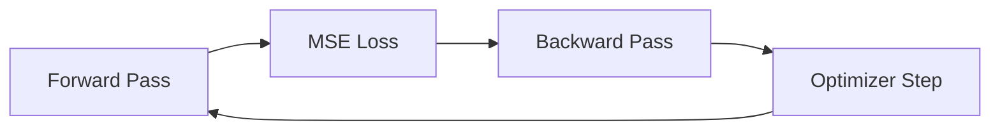

This is the same fundamental training loop used by much more complex Deep Learning models.

---

# 🧠 Why Linear Regression Matters in Deep Learning

Linear Regression may appear simple, but it introduces several concepts that become fundamental in Deep Learning:

| Linear Regression Concept | Deep Learning Equivalent |
|---|---|
| Weight | Learnable parameter |
| Bias | Learnable parameter |
| Linear transformation | Dense / Linear layer |
| MSE | Regression loss |
| Gradient | Parameter update signal |
| Gradient Descent | Model optimizer |
| Prediction | Forward pass |
| Error | Loss |
| Training | Repeated optimization |

Therefore, Linear Regression provides an excellent conceptual foundation for neural networks.

---

# 🔐 Part II — Logistic Regression

## What is Logistic Regression?

Logistic Regression is a supervised learning algorithm commonly used for **binary classification**.

Instead of directly predicting an unrestricted continuous value, Logistic Regression predicts the probability that an observation belongs to class 1.

Examples include:

- Customer churn prediction
- Fraud detection
- Disease prediction
- Loan default prediction
- System failure prediction
- Spam detection
- Match outcome prediction

The uploaded learning material similarly uses examples such as customer churn, disease occurrence, system failure, and financial risk. :contentReference[oaicite:2]{index=2}

---

# 🔄 Linear Regression vs Logistic Regression

The core difference is the transformation applied to the linear output.

### Linear Regression

\[
\hat{y} = Wx+b
\]

### Logistic Regression

\[
z = Wx+b
\]

followed by:

\[
\hat{p} = \sigma(z)
\]

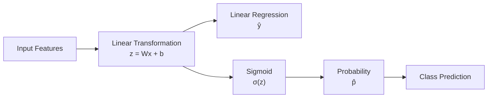

---

# 📉 Sigmoid Function

The sigmoid function converts any real-valued number into a value between 0 and 1.

\[
\sigma(z)=\frac{1}{1+e^{-z}}
\]

Its output can therefore be interpreted as a probability.

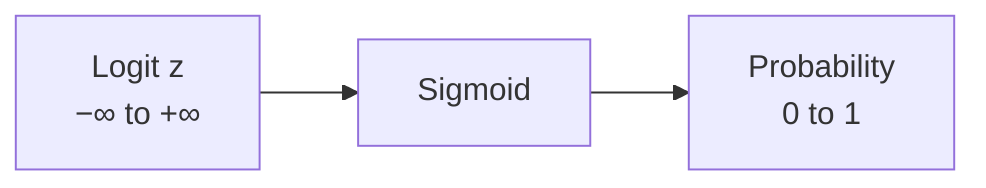

The sigmoid behaves approximately as:

```text
z → -∞  →  probability → 0

z = 0   →  probability = 0.5

z → +∞  →  probability → 1
```

---

## 📈 Sigmoid Shape

The sigmoid has an S-shaped curve.

```text
Probability
1.0 |                         ********
    |                    ****
0.5 |---------------****
    |           ****
0.0 |************
    +-----------------------------> z
             0
```

The important property is:

\[
0 < \sigma(z) < 1
\]

for finite \(z\).

The sigmoid therefore allows the output of a linear model to be interpreted as a probability.

---

# 🧮 From Logit to Probability

Logistic Regression first calculates a linear score:

\[
z = \theta_0 + \theta_1x_1 + \cdots + \theta_nx_n
\]

This value is sometimes called the **logit** or log-odds score.

The sigmoid then transforms it:

\[
\hat{p} =
\frac{1}{1+e^{-z}}
\]

Therefore:

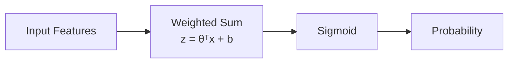

---

# 🎯 Probability Interpretation

Suppose the model produces:

\[
\hat{p}=0.87
\]

This means the model estimates an 87% probability of the positive class.

For example:

```text
Fraud Probability = 0.87
```

or:

```text
Churn Probability = 0.87
```

The probability itself is not yet necessarily the final class label.

A decision threshold must be applied.

---

# 🚦 Probability Thresholding

A common threshold is 0.5.

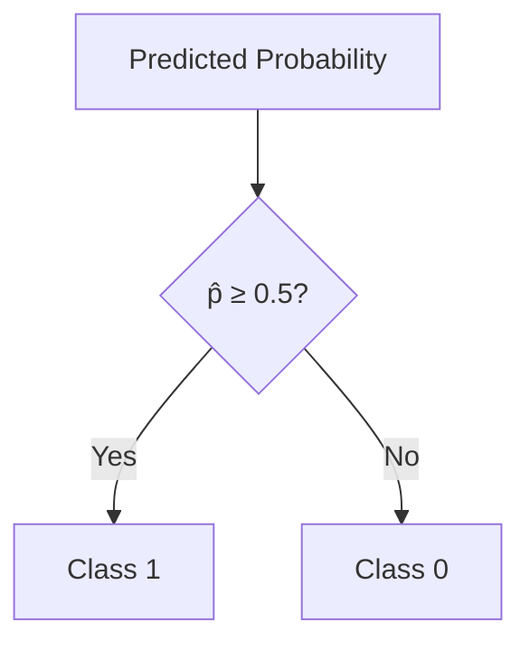

The decision rule is:

\[
\hat{y} =
\begin{cases}
1 & \text{if } \hat{p} \geq 0.5 \\
0 & \text{if } \hat{p} < 0.5
\end{cases}
\]

The threshold does not have to be 0.5.

It can be adjusted according to business requirements.

For example:

```text
High-risk fraud detection
        │
        ▼
Lower threshold
        │
        ▼
Catch more potential fraud
```

This can increase recall but may also increase false positives.

---

# 🎯 Decision Boundary

The decision boundary is the boundary at which the model changes its predicted class.

For a threshold of 0.5:

\[
\hat{p}=0.5
\]

The sigmoid reaches 0.5 when:

\[
z=0
\]

Therefore the decision boundary corresponds to:

\[
\theta_0+\theta_1x_1+\cdots+\theta_nx_n=0
\]

For two features, this produces a line.

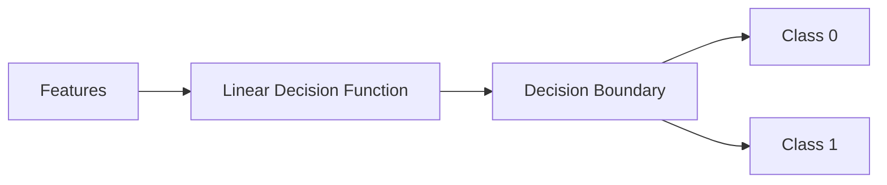

---

# 🧮 Odds and Log-Odds

Logistic Regression can also be expressed using odds.

The odds are:

\[
\text{odds}=
\frac{p}{1-p}
\]

Taking the logarithm:

\[
\log
\left(
\frac{p}{1-p}
\right)
=
\theta_0+\theta_1x_1+\cdots+\theta_nx_n
\]

This is the **logit relationship**.

Therefore:

```text
Features
   │
   ▼
Linear Combination
   │
   ▼
Log-Odds
   │
   ▼
Probability
```

This mathematical relationship explains why Logistic Regression is called a regression model even though it is commonly used for classification.

---

# 🧠 Logistic Regression as a Neural Network

Logistic Regression can be represented as a single artificial neuron.

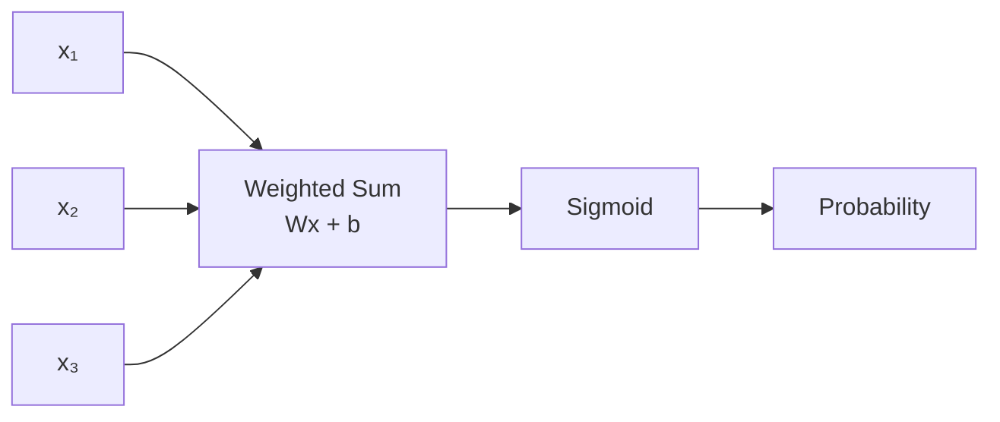

This is one of the most important connections between classical Machine Learning and Deep Learning.

A Logistic Regression model is essentially:

```text
Linear Layer
     ↓
Sigmoid Activation
```

This same structure appears in a neural network's binary classification output layer.

---

# 📉 Binary Cross-Entropy / Log Loss

For binary classification, Logistic Regression commonly uses Binary Cross-Entropy, also called Log Loss.

For one observation:

\[
L =
-\left[
y\log(\hat{p})
+
(1-y)\log(1-\hat{p})
\right]
\]

For a dataset:

\[
J =
-\frac{1}{n}
\sum_{i=1}^{n}
\left[
y_i\log(\hat{p}_i)
+
(1-y_i)\log(1-\hat{p}_i)
\right]
\]

The loss strongly penalizes incorrect and overconfident predictions.

For example:

```text
Actual = 1

Prediction = 0.99
→ Very small loss

Prediction = 0.10
→ Very large loss
```

The detailed mathematical treatment of Cross-Entropy and Maximum Likelihood is covered in:

**[06. Loss Functions and Maximum Likelihood](06-loss-functions-and-maximum-likelihood.md)**

---

# 🔄 Logistic Regression Training

The training process is iterative.

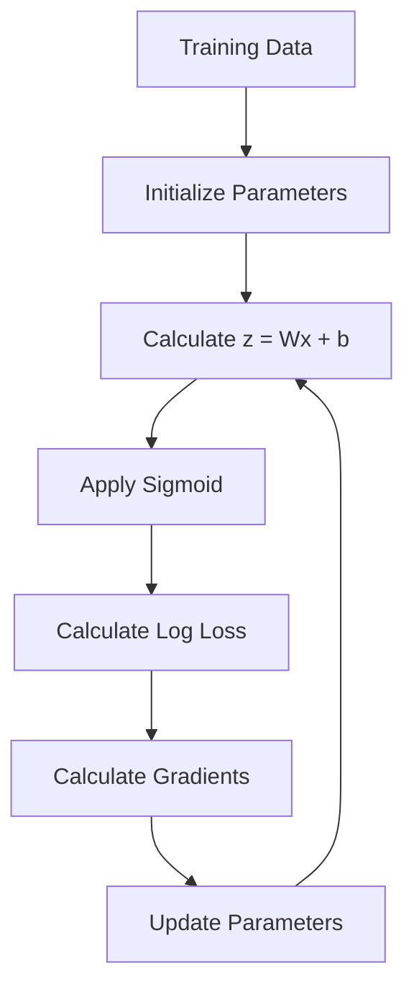

The process repeats until the model converges or reaches the configured training limit.

---

# 💻 Logistic Regression with Keras

Keras can represent Logistic Regression using a single Dense layer with a sigmoid activation.

```python
import tensorflow as tf
from tensorflow import keras

model = keras.Sequential([
    keras.layers.Input(shape=(10,)),
    keras.layers.Dense(1, activation="sigmoid")
])

model.summary()
```

Architecture:

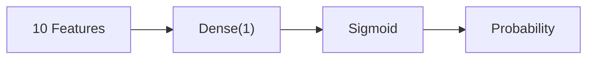

Compile the model:

```python
model.compile(
    optimizer="adam",
    loss="binary_crossentropy",
    metrics=["accuracy"]
)
```

Train:

```python
history = model.fit(
    X_train,
    y_train,
    validation_data=(X_val, y_val),
    epochs=50,
    batch_size=32
)
```

---

# 🐍 Logistic Regression with PyTorch

PyTorch can implement Logistic Regression using a linear layer followed by a sigmoid.

```python
import torch
import torch.nn as nn


class LogisticRegression(nn.Module):

    def __init__(self, input_features):
        super().__init__()

        self.linear = nn.Linear(
            input_features,
            1
        )

    def forward(self, x):
        return torch.sigmoid(
            self.linear(x)
        )


model = LogisticRegression(
    input_features=10
)

print(model)
```

Architecture:

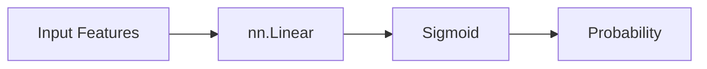

---

# ⚡ Numerically Stable PyTorch Implementation

In production PyTorch code, it is often preferable to return logits from the model and use `BCEWithLogitsLoss`.

```python
import torch
import torch.nn as nn


class LogisticRegression(nn.Module):

    def __init__(self, input_features):
        super().__init__()

        self.linear = nn.Linear(
            input_features,
            1
        )

    def forward(self, x):
        return self.linear(x)


model = LogisticRegression(10)

criterion = nn.BCEWithLogitsLoss()
```

The architecture becomes:

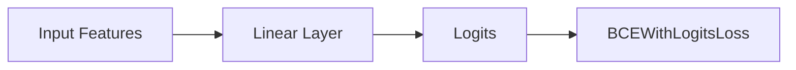

`BCEWithLogitsLoss` combines the sigmoid operation and binary cross-entropy computation in a numerically stable implementation.

---

# 🧪 Training Logistic Regression with PyTorch

```python
import torch

optimizer = torch.optim.SGD(
    model.parameters(),
    lr=0.01
)

for epoch in range(100):

    logits = model(X_train)

    loss = criterion(
        logits,
        y_train
    )

    optimizer.zero_grad()

    loss.backward()

    optimizer.step()

    if (epoch + 1) % 10 == 0:
        print(
            f"Epoch {epoch + 1}, "
            f"Loss: {loss.item():.4f}"
        )
```

To obtain probabilities:

```python
with torch.no_grad():

    logits = model(X_test)

    probabilities = torch.sigmoid(logits)
```

Convert probabilities to classes:

```python
predictions = (
    probabilities >= 0.5
).float()
```

---

# 🧪 Complete Classification Flow

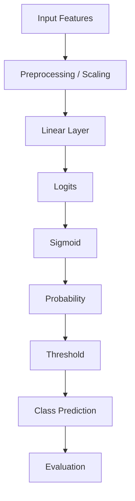

This pattern forms the foundation of many binary classification systems.

---

# 🔬 Feature Scaling

Feature scaling can be important for optimization-based models.

Suppose one feature ranges from:

```text
0 – 1
```

while another ranges from:

```text
0 – 1,000,000
```

The difference in scale can make optimization more difficult.

A common transformation is standardization:

\[
x' =
\frac{x-\mu}{\sigma}
\]

Where:

- \(\mu\) = mean
- \(\sigma\) = standard deviation

Conceptually:

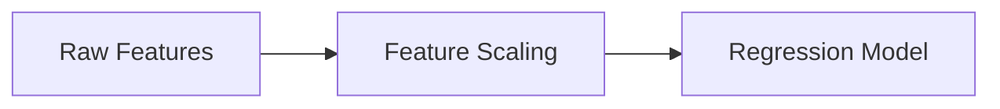

The uploaded material also emphasizes feature scaling as part of the practical Logistic Regression workflow. :contentReference[oaicite:3]{index=3}

---

# 📊 Linear Regression vs Logistic Regression

| Aspect | Linear Regression | Logistic Regression |
|---|---|---|
| Primary Task | Regression | Classification |
| Target | Continuous | Usually Binary |
| Output | Continuous value | Probability |
| Core Transformation | \(Wx+b\) | \(\sigma(Wx+b)\) |
| Activation | Linear / None | Sigmoid |
| Typical Loss | MSE | Binary Cross-Entropy |
| Output Range | \(-\infty\) to \(+\infty\) | 0 to 1 |
| Decision Threshold | Not required | Usually required |
| Example | House Price | Churn Probability |
| Neural Network Equivalent | Linear Layer | Linear + Sigmoid |

---

# 📊 Regression vs Classification

```mermaid
flowchart TD

    MODEL["Supervised Learning"]

    MODEL --> REG["Regression"]
    MODEL --> CLS["Classification"]

    REG --> LIN["Linear Regression"]
    REG --> TARGET1["Continuous Target"]

    CLS --> LOG["Logistic Regression"]
    CLS --> TARGET2["Categorical Target"]
```

The key distinction is the type of target being predicted.

---

# 🧠 Important Deep Learning Connection

Linear and Logistic Regression are not separate from Deep Learning.

They are simple instances of neural network building blocks.

```mermaid
flowchart TD

    LINEAR["Linear Transformation<br/>Wx + b"]

    LINEAR --> LR["Linear Regression"]
    LINEAR --> LOGR["Logistic Regression"]

    LOGR --> SIG["Sigmoid"]

    LINEAR --> NN["Neural Network Layer"]
    NN --> DNN["Deep Neural Network"]

    DNN --> CNN["CNN"]
    DNN --> RNN["RNN"]
    DNN --> TRANS["Transformer"]
```

This progression is important:

```text
Linear Transformation
        ↓
Linear Regression
        ↓
Logistic Regression
        ↓
Single Neuron
        ↓
Multiple Neurons
        ↓
Multiple Layers
        ↓
Deep Neural Network
        ↓
Specialized Deep Learning Architectures
```

---

# 🏢 Enterprise Applications

## Linear Regression

Common enterprise applications include:

- Revenue forecasting
- Sales forecasting
- Demand prediction
- Cost estimation
- Price prediction
- Capacity planning
- Resource estimation
- Predictive maintenance

## Logistic Regression

Common applications include:

- Fraud detection
- Customer churn
- Loan default prediction
- Risk scoring
- Disease prediction
- Failure prediction
- Spam detection
- Conversion prediction

---

# 🏢 Production Architecture

A production classification service might look like:

```mermaid
flowchart LR

    CLIENT["Client"]
    API["API Gateway"]
    SERVICE["Prediction Service"]
    PREPROCESS["Feature Preprocessing"]
    MODEL["Logistic Regression Model"]
    PROB["Probability"]
    DECISION["Business Threshold"]
    RESPONSE["Prediction Response"]
    MON["Monitoring"]

    CLIENT --> API
    API --> SERVICE
    SERVICE --> PREPROCESS
    PREPROCESS --> MODEL
    MODEL --> PROB
    PROB --> DECISION
    DECISION --> RESPONSE
    RESPONSE --> MON
```

The threshold can be treated as a business configuration rather than something permanently fixed at 0.5.

For example:

```text
Fraud Detection

Probability
     │
     ▼
0.30 ──────── Threshold
     │
     ▼
Fraud Review
```

The optimal threshold depends on the relative costs of:

- False positives
- False negatives
- Manual review
- Missed fraud
- Customer friction

---

# ⚠ Common Mistakes

Common mistakes when using Linear and Logistic Regression include:

- Treating Logistic Regression as ordinary Linear Regression
- Using Linear Regression directly for binary classification
- Forgetting the sigmoid transformation
- Interpreting logits directly as probabilities
- Assuming 0.5 is always the correct threshold
- Ignoring class imbalance
- Ignoring feature scaling
- Using an inappropriate loss function
- Evaluating only accuracy
- Ignoring precision and recall
- Using the test set repeatedly during model tuning
- Ignoring data leakage
- Ignoring calibration when probability estimates are important

---

# ⚠ Limitations

## Linear Regression

Linear Regression assumes that the target can be reasonably modeled using a linear relationship with the selected features.

Limitations can include:

- Sensitivity to outliers
- Nonlinear relationships
- Multicollinearity
- Underfitting complex patterns

## Logistic Regression

Logistic Regression is powerful and interpretable, but its standard form produces a linear decision boundary in feature space.

Limitations can include:

- Linear decision boundary
- Sensitivity to feature representation
- Multicollinearity
- Class imbalance
- Limited ability to model highly complex nonlinear relationships without feature engineering

For highly nonlinear problems, more expressive models such as neural networks, tree-based models, or kernel methods may be appropriate.

---

# 🧪 Practical Example — Customer Churn

Consider a customer churn problem.

Features:

```text
Age
Monthly Charges
Contract Duration
Support Tickets
Usage
```

Target:

```text
Churn

0 = Customer stays
1 = Customer leaves
```

The model computes:

\[
z =
\theta_0
+
\theta_1x_1
+
\theta_2x_2
+
\cdots
+
\theta_nx_n
\]

Then:

\[
\hat{p}=\sigma(z)
\]

Finally:

```mermaid
flowchart TD

    FEATURES["Customer Features"]
    LOGIT["Linear Score"]
    SIG["Sigmoid"]
    PROB["Churn Probability"]
    THRESH["Threshold"]
    CLASS["Churn / No Churn"]

    FEATURES --> LOGIT
    LOGIT --> SIG
    SIG --> PROB
    PROB --> THRESH
    THRESH --> CLASS
```

Example:

```text
Predicted probability = 0.82

Threshold = 0.50

Prediction = Churn
```

---

# 🧪 Practical Example — Regression

Suppose a model predicts house prices.

Features:

```text
Area
Bedrooms
Age
Location Score
```

The model calculates:

\[
\hat{y}
=
\theta_0
+
\theta_1x_1
+
\theta_2x_2
+
\theta_3x_3
+
\theta_4x_4
\]

Example:

```text
Predicted Price
       │
       ▼
₹8,500,000
```

The target is continuous, so this is a regression problem.

---

# 🔬 When Should You Use Each?

| Problem | Suitable Model |
|---|---|
| Predict house price | Linear Regression |
| Predict sales amount | Linear Regression |
| Predict temperature | Linear Regression |
| Predict customer churn probability | Logistic Regression |
| Predict fraud probability | Logistic Regression |
| Predict loan default probability | Logistic Regression |
| Predict disease class | Logistic Regression |
| Predict continuous risk score | Linear Regression |

For more complex nonlinear relationships, these models can become building blocks for larger neural architectures.

---

# 🧠 Interview Questions

## Beginner

### 1. What is Linear Regression?

A supervised learning algorithm used to predict continuous numerical targets.

### 2. What is Logistic Regression?

A supervised learning algorithm commonly used for binary classification by estimating the probability of the positive class.

### 3. What is the main difference?

Linear Regression predicts a continuous value, while Logistic Regression estimates a probability that can be converted into a class.

### 4. What is the sigmoid function?

The sigmoid function maps a real-valued input into a value between 0 and 1.

### 5. What is a decision threshold?

A threshold converts a predicted probability into a class label.

---

## Intermediate

### 6. Why can't Linear Regression normally be used directly for binary classification?

Its output is unrestricted and can fall below 0 or above 1, so it does not naturally represent probabilities.

### 7. Why is sigmoid used in Logistic Regression?

It transforms the linear score into a value between 0 and 1 that can be interpreted as a probability.

### 8. What is the relationship between Logistic Regression and a neural network?

Logistic Regression can be represented as a single linear layer followed by a sigmoid activation.

### 9. Why is MSE commonly used for Linear Regression?

It provides a differentiable measure of squared prediction error and strongly penalizes large errors.

### 10. Why is Binary Cross-Entropy used for Logistic Regression?

It measures the difference between predicted probabilities and binary target values and strongly penalizes incorrect confident predictions.

---

## Advanced

### 11. What is a logit?

The logit is the linear score:

\[
z = Wx+b
\]

It can also be interpreted as the log-odds of the positive class.

### 12. What is the Logistic Regression decision boundary?

For a threshold of 0.5, the boundary occurs where:

\[
Wx+b=0
\]

### 13. Why might the threshold not be 0.5?

Because business costs for false positives and false negatives may be different.

### 14. Why is feature scaling useful?

Scaling can improve numerical conditioning and optimization behavior, especially when features have very different ranges.

### 15. How does Logistic Regression connect to Deep Learning?

It provides the simplest example of a neural-network-style binary classifier:

```text
Input
  ↓
Linear Transformation
  ↓
Sigmoid
  ↓
Probability
```

Deep networks extend this idea by stacking and composing many transformations.

---

# 📌 Key Takeaways

- Linear Regression predicts continuous values.
- Simple Linear Regression uses one input feature.
- Multiple Linear Regression uses multiple features.
- Linear Regression can be represented as \(Wx+b\).
- Weights and bias are learnable parameters.
- Residuals measure prediction errors.
- MSE is a common regression loss.
- Ordinary Least Squares minimizes squared residuals.
- Gradient Descent can also optimize Linear Regression parameters.
- Logistic Regression is commonly used for binary classification.
- Logistic Regression first calculates a linear score.
- The sigmoid converts the score into a probability.
- A threshold converts the probability into a class prediction.
- A 0.5 threshold is common but not mandatory.
- The decision boundary depends on the learned parameters and threshold.
- Binary Cross-Entropy is commonly used for Logistic Regression.
- Logistic Regression can be represented as a single neuron with sigmoid activation.
- Linear Regression can be represented as a linear neural network layer.
- Keras and PyTorch can implement both models using their neural-network abstractions.
- These models provide the conceptual bridge between classical Machine Learning and Deep Learning.
- Understanding them makes later topics such as activation functions, loss functions, backpropagation, and optimization much easier.

---

# 📚 Further Reading

Continue with the next chapters:

- **[05. Activation Functions, Probabilities and Thresholding](05-activation-functions-probabilities-and-thresholding.md)**
- **[06. Loss Functions and Maximum Likelihood](06-loss-functions-and-maximum-likelihood.md)**
- **[07. Forward and Backpropagation](07-forward-and-backpropagation.md)**

These chapters will take the concepts introduced here and explain how modern neural networks use activation functions, probability distributions, loss functions, gradients, and backpropagation to learn complex representations.

---

## ➡️ Next Chapter

**[05. Activation Functions, Probabilities and Thresholding](05-activation-functions-probabilities-and-thresholding.md)**

---

> **Enterprise AI Engineering Handbook**  
> *Building Production-Grade Enterprise AI Systems — One Chapter at a Time.*