# 05. Activation Functions, Probabilities and Thresholding

> Understand how activation functions introduce non-linearity into neural networks, how raw model outputs become probabilities, and how probability thresholds convert model scores into practical classification decisions.

---

## 🎯 Learning Objectives

After completing this chapter, you will be able to:

- Explain why activation functions are required in neural networks
- Understand linear and non-linear transformations
- Understand the role of activation functions in Deep Neural Networks
- Explain Sigmoid, Tanh, ReLU, Leaky ReLU, ELU, GELU, and Softmax
- Understand the mathematical behavior of common activation functions
- Understand logits and probabilities
- Explain how Sigmoid converts logits into binary probabilities
- Explain how Softmax converts logits into a probability distribution
- Understand binary, multi-class, and multi-label classification
- Understand probability thresholding
- Understand how thresholds affect classification decisions
- Understand the relationship between activation functions and gradients
- Understand saturation and vanishing gradients
- Understand the dying ReLU problem
- Implement activation functions using Python
- Implement activation functions using TensorFlow/Keras
- Implement activation functions using PyTorch
- Understand numerical stability considerations
- Select appropriate activation functions for different Deep Learning problems
- Understand activation functions from a production Deep Learning perspective

---

## 📖 Overview

An artificial neuron performs a weighted transformation of its inputs:

\[
z = \mathbf{w}^{T}\mathbf{x} + b
\]

The value \(z\) is commonly called the **pre-activation**, **weighted sum**, or **logit**, depending on the context.

An activation function then transforms this value:

\[
a = f(z)
\]

Where:

- \(z\) = pre-activation
- \(f\) = activation function
- \(a\) = activated output

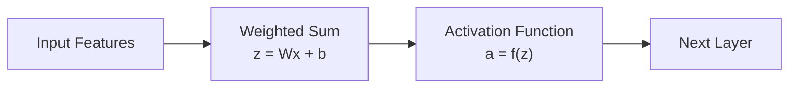

Activation functions are fundamental because they introduce **non-linearity** into neural networks.

Without nonlinear activation functions, even a network containing many linear layers would still behave like a single linear transformation.

---

# 🧠 Why Do We Need Activation Functions?

Consider a network containing two linear layers.

First layer:

\[
h = W_1x+b_1
\]

Second layer:

\[
y = W_2h+b_2
\]

Substituting the first equation:

\[
y = W_2(W_1x+b_1)+b_2
\]

Expanding:

\[
y = W_2W_1x + W_2b_1+b_2
\]

This can be rewritten as:

\[
y = Wx+b
\]

Therefore, the composition of two linear transformations is still a linear transformation.

The same principle applies even if we stack many linear layers.

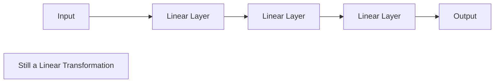

The solution is to introduce a nonlinear activation between layers.

\[
h=f(W_1x+b_1)
\]

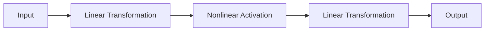

This allows neural networks to approximate complex nonlinear functions.

---

# 🔬 Activation Function Categories

Common activation functions include:

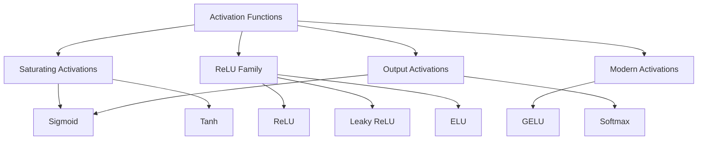

Different activation functions serve different purposes.

| Activation | Typical Usage |
|---|---|
| Sigmoid | Binary classification output |
| Tanh | RNN/LSTM internal transformations |
| ReLU | Hidden layers |
| Leaky ReLU | Hidden layers where dying ReLU is a concern |
| ELU | Some deep architectures |
| GELU | Modern architectures and Transformers |
| Softmax | Multi-class classification |

---

# 1. Sigmoid Activation

The Sigmoid function is one of the most important activation functions in Machine Learning and Deep Learning.

It is defined as:

\[
\sigma(x)=\frac{1}{1+e^{-x}}
\]

Its output is always between 0 and 1:

\[
0 < \sigma(x) < 1
\]

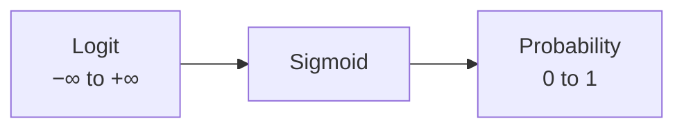

Because of this property, Sigmoid is particularly useful for binary classification.

---

## 📈 Sigmoid Function

The sigmoid curve has an S-shape.

```text
Probability
1.0 |                         ********
    |                     ****
    |                  ***
0.5 |---------------***
    |            ***
    |         ***
0.0 |*********
    +-------------------------------> x
                    0
```

Some approximate values are:

| Input | Sigmoid |
|---:|---:|
| -5 | 0.0067 |
| -2 | 0.1192 |
| -1 | 0.2689 |
| 0 | 0.5000 |
| 1 | 0.7311 |
| 2 | 0.8808 |
| 5 | 0.9933 |

---

## 🧮 Sigmoid Example

For:

\[
x=2
\]

we get:

\[
\sigma(2)
=
\frac{1}{1+e^{-2}}
\]

\[
\sigma(2)\approx0.8808
\]

Therefore:

```text
Probability ≈ 88.08%
```

---

## 🧪 Python Implementation

```python
import math


def sigmoid(x):
    return 1 / (1 + math.exp(-x))


values = [-5, -2, -1, 0, 1, 2, 5]

for value in values:
    print(
        f"x={value:>2}, "
        f"sigmoid={sigmoid(value):.4f}"
    )
```

---

# 🧠 Sigmoid and Binary Classification

A typical binary classification network is:

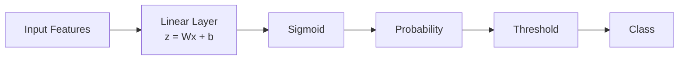

For example:

```text
Model Output = 0.87
Threshold    = 0.50
Prediction   = Class 1
```

---

# 🧮 Sigmoid Derivative

The derivative of Sigmoid has an especially useful form:

\[
\sigma'(x)
=
\sigma(x)(1-\sigma(x))
\]

The maximum derivative occurs around:

\[
x=0
\]

At extreme positive or negative inputs, the derivative approaches zero.

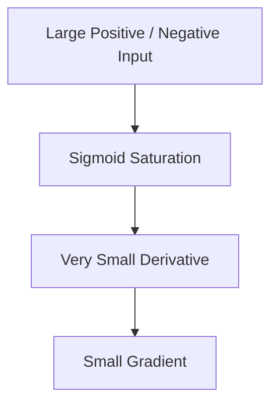

This behavior can contribute to the **vanishing gradient problem** in deep networks.

---

# 2. Tanh Activation

The Hyperbolic Tangent function is:

\[
\tanh(x)
=
\frac{e^x-e^{-x}}
{e^x+e^{-x}}
\]

Its output range is:

\[
-1 < \tanh(x) < 1
\]

Unlike Sigmoid, Tanh is zero-centered.

```text
-1 <──────────── 0 ────────────> +1
```

---

## 📈 Tanh Function

```text
 y
+1 |                       ******
   |                   ****
   |                ***
 0 |--------------***
   |           ***
   |       ****
-1 |******
   +------------------------------> x
                 0
```

Example values:

| Input | Tanh |
|---:|---:|
| -2 | -0.9640 |
| -1 | -0.7616 |
| 0 | 0 |
| 1 | 0.7616 |
| 2 | 0.9640 |

---

## 🔬 Sigmoid vs Tanh

| Property | Sigmoid | Tanh |
|---|---|---|
| Output Range | 0 to 1 | -1 to 1 |
| Zero-Centered | No | Yes |
| Saturates | Yes | Yes |
| Common Modern Use | Binary output | RNN/LSTM components |
| Vanishing Gradient Risk | Yes | Yes |

Tanh can be useful when negative and positive activations are meaningful.

It is particularly important when studying recurrent architectures such as RNNs and LSTMs.

---

# 3. ReLU

ReLU stands for **Rectified Linear Unit**.

It is defined as:

\[
ReLU(x)=\max(0,x)
\]

or:

\[
ReLU(x)=
\begin{cases}
0 & x<0\\
x & x\geq0
\end{cases}
\]

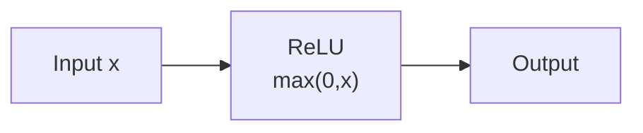

---

## 📈 ReLU Graph

```text
 y
 │
 │                 /
 │               /
 │             /
 │           /
 │         /
 │       /
 └──────/──────────────────── x
       0
```

For negative values:

\[
ReLU(x)=0
\]

For positive values:

\[
ReLU(x)=x
\]

---

## 🧠 Why ReLU Became Popular

ReLU provides several advantages:

- Simple mathematical operation
- Computationally efficient
- Introduces non-linearity
- Does not saturate for positive inputs
- Often improves gradient propagation
- Commonly performs well in deep neural networks

A typical MLP therefore looks like:

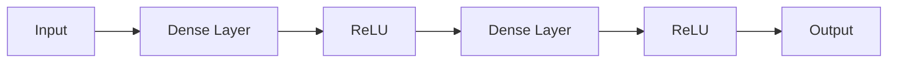

---

# ⚠ Dying ReLU Problem

ReLU has an important limitation.

For negative values:

\[
ReLU(x)=0
\]

and the derivative is:

\[
ReLU'(x)=0
\]

Therefore, if a neuron consistently receives negative inputs, it may stop receiving useful gradients.

This is called the **Dying ReLU problem**.

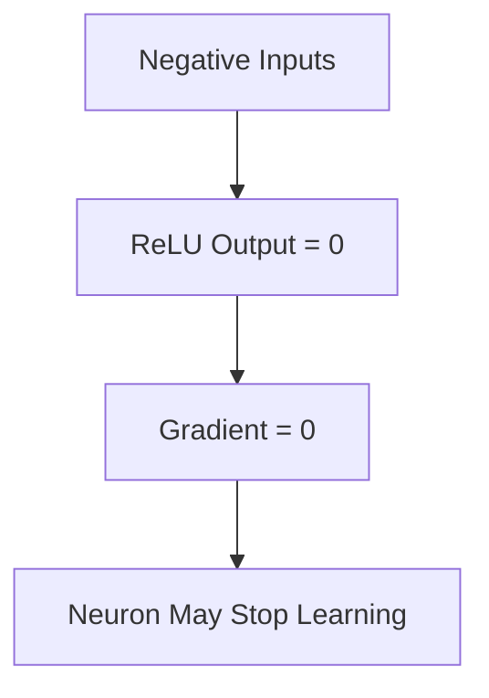

This is one reason alternative ReLU-family activations were introduced.

---

# 4. Leaky ReLU

Leaky ReLU introduces a small slope for negative values.

\[
LeakyReLU(x)
=
\begin{cases}
x & x\geq0\\
\alpha x & x<0
\end{cases}
\]

where:

\[
\alpha > 0
\]

A common value is:

\[
\alpha=0.01
\]

```text
 y
 │
 │                 /
 │               /
 │             /
 │           /
 └──────────/──────────────── x
           /
         /
       /
```

Unlike ReLU, the negative region has a small gradient.

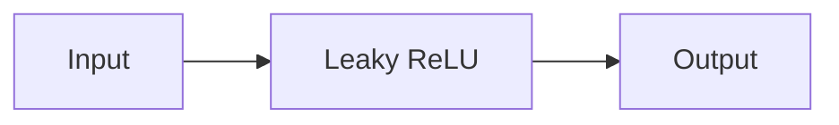

---

# 5. ELU

ELU stands for **Exponential Linear Unit**.

A common definition is:

\[
ELU(x)
=
\begin{cases}
x & x>0\\
\alpha(e^x-1) & x\leq0
\end{cases}
\]

ELU provides a smooth negative region.

Potential advantages include:

- Non-zero negative outputs
- Smooth negative behavior
- Reduced risk of dead neurons
- Potentially improved optimization in some architectures

However, the correct activation should always be validated empirically.

---

# 6. GELU

GELU stands for **Gaussian Error Linear Unit**.

A commonly used approximation is:

\[
GELU(x)
\approx
0.5x
\left(
1+
\tanh
\left[
\sqrt{\frac{2}{\pi}}
\left(
x+0.044715x^3
\right)
\right]
\right)
\]

GELU provides a smooth nonlinear transformation.

It is widely used in modern architectures, especially Transformer-based models.

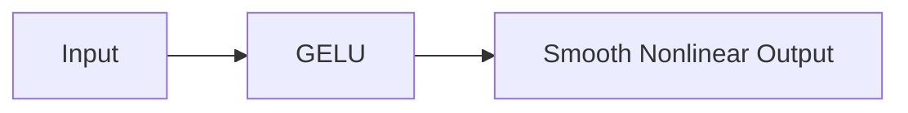

---

# 7. Softmax Activation

Softmax is primarily used for **multi-class classification**.

Suppose the network produces \(K\) logits:

\[
z_1,z_2,\ldots,z_K
\]

Softmax calculates:

\[
P(y=i)
=
\frac{e^{z_i}}
{\sum_{j=1}^{K}e^{z_j}}
\]

The outputs satisfy:

\[
0<P(y=i)<1
\]

and:

\[
\sum_{i=1}^{K}P(y=i)=1
\]

---

## 🧠 Softmax Workflow

```text
Logits
   ↓
Softmax
   ↓
Probability Distribution
   ↓
Highest Probability
   ↓
Predicted Class
```

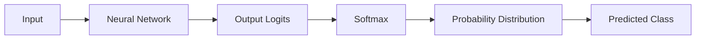

---

# 📊 Softmax Example

Suppose a classifier predicts:

```text
Cat     = 2.0
Dog     = 4.5
Bird    = 1.5
```

The largest logit is associated with Dog.

After Softmax, the approximate probability distribution is:

```text
Cat      ≈ 0.075
Dog      ≈ 0.907
Bird     ≈ 0.018
----------------
Total    ≈ 1.000
```

Therefore:

```text
Prediction = Dog
```

---

# 🧮 Softmax Properties

Softmax has two important properties.

### Property 1 — Probability Range

Each probability lies between 0 and 1:

\[
0<P_i<1
\]

### Property 2 — Probabilities Sum to One

\[
\sum_i P_i=1
\]

Therefore, Softmax creates a probability distribution across mutually exclusive classes.

---

# ⚠ Softmax and Multi-Label Classification

Softmax should generally not be used for independent multi-label classification.

Suppose an image contains:

```text
Cat
Dog
Car
```

Multiple labels can be simultaneously true.

Using Softmax would force the probabilities to compete and sum to one.

Instead, independent Sigmoid outputs are commonly used.

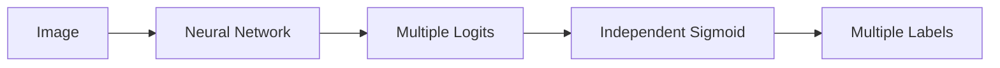

---

# 8. Numerically Stable Softmax

Directly calculating:

\[
e^{z_i}
\]

can cause numerical overflow for large values.

A stable implementation subtracts the maximum logit:

\[
softmax(z_i)
=
\frac{e^{z_i-\max(z)}}
{\sum_j e^{z_j-\max(z)}}
\]

This does not change the resulting probabilities.

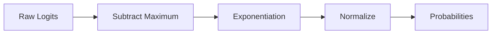

Modern frameworks provide optimized implementations, so production code should generally use those rather than implementing Softmax manually.

---

# 🧠 Logits vs Probabilities vs Predictions

These three concepts should not be confused.

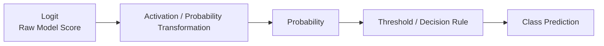

For example:

```text
Logit       = 2.0
      ↓
Sigmoid
      ↓
Probability = 0.881
      ↓
Threshold   = 0.5
      ↓
Class       = 1
```

Keeping these concepts separate is particularly important when building production ML systems.

---

# 🎯 Output Activation by Problem Type

The output activation depends on the problem.

| Problem | Output Representation | Typical Activation | Typical Loss |
|---|---|---|---|
| Regression | Continuous value | Linear / None | MSE |
| Binary Classification | One probability | Sigmoid | Binary Cross-Entropy |
| Multi-Class Classification | Class distribution | Softmax | Cross-Entropy |
| Multi-Label Classification | Independent probabilities | Sigmoid | Binary Cross-Entropy |

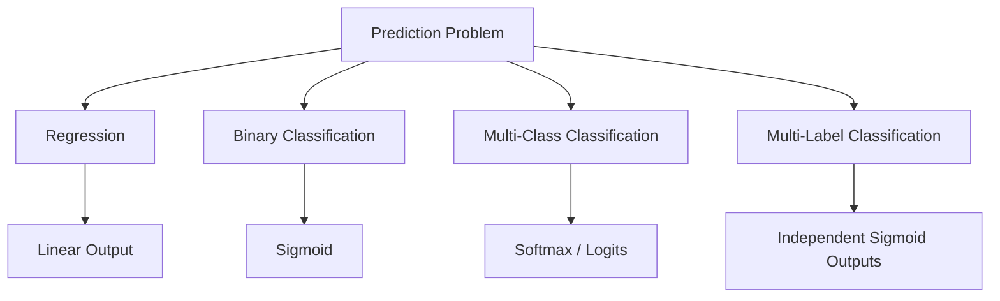

---

# 📌 Binary Classification

A binary classification model commonly follows:

```text
Input
  ↓
Hidden Layers
  ↓
Linear Output
  ↓
Sigmoid
  ↓
Probability
  ↓
Threshold
  ↓
Class
```

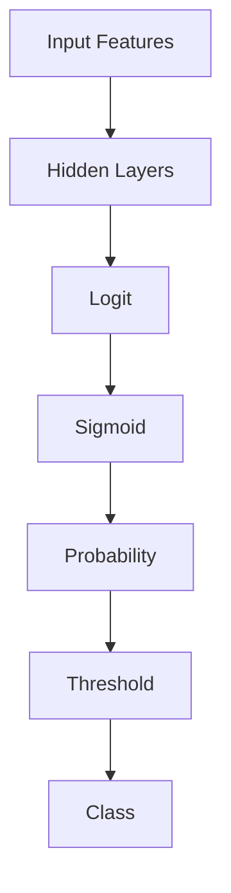

---

# 🚦 Probability Thresholding

A probability is not automatically a class prediction.

For binary classification:

\[
p \in [0,1]
\]

A threshold converts the probability into a class.

For threshold \(t\):

\[
\hat{y}
=
\begin{cases}
1 & p\geq t\\
0 & p<t
\end{cases}
\]

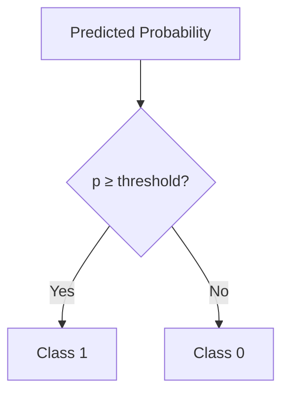

---

# 🎚 Threshold = 0.5

The most common threshold is:

\[
t=0.5
\]

Therefore:

```text
0.00 ───────────── 0.50 ───────────── 1.00
       Class 0            Class 1
                     ↑
                  Threshold
```

Example:

```text
Probability = 0.82
Threshold   = 0.50
Prediction  = Class 1
```

Another example:

```text
Probability = 0.31
Threshold   = 0.50
Prediction  = Class 0
```

---

# 🎯 Threshold Is Not Always 0.5

In real-world systems, 0.5 is only a starting point.

The threshold can be changed depending on business requirements.

Consider fraud detection.

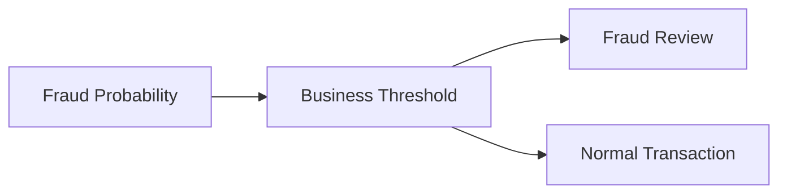

A lower threshold may identify more potential fraud cases.

However, it may also produce more false positives.

---

# ⚖️ Threshold and Confusion Matrix

For binary classification:

| Actual / Predicted | Positive | Negative |
|---|---:|---:|
| Positive | True Positive | False Negative |
| Negative | False Positive | True Negative |

Changing the threshold changes the number of:

- True Positives
- False Positives
- True Negatives
- False Negatives

```mermaid
flowchart TD

    SCORE["Model Scores"]
    THRESH["Classification Threshold"]

    SCORE --> THRESH

    THRESH --> TP["True Positives"]
    THRESH --> FP["False Positives"]
    THRESH --> TN["True Negatives"]
    THRESH --> FN["False Negatives"]
```

---

# 📊 Precision and Recall Trade-Off

A lower threshold usually causes more observations to be classified as positive.

This can increase recall while also increasing false positives.

A higher threshold generally produces fewer positive predictions.

```mermaid
flowchart LR

    LOW["Lower Threshold"]

    LOW --> MORE["More Positive Predictions"]
    LOW --> REC["Potentially Higher Recall"]
    LOW --> FP["Potentially More False Positives"]

    HIGH["Higher Threshold"]

    HIGH --> FEWER["Fewer Positive Predictions"]
    HIGH --> PREC["Potentially Higher Precision"]
    HIGH --> FN["Potentially More False Negatives"]
```

The exact relationship depends on the model and dataset.

---

# 📈 Threshold Tuning

A production-oriented threshold-selection workflow can be:

```mermaid
flowchart TD

    MODEL["Trained Model"]
    VALID["Validation Dataset"]
    SCORES["Predicted Probabilities"]
    CANDIDATES["Candidate Thresholds"]
    METRICS["Precision / Recall / F1"]
    COST["Business Cost"]
    SELECT["Selected Threshold"]
    TEST["Final Test Evaluation"]

    MODEL --> VALID
    VALID --> SCORES
    SCORES --> CANDIDATES
    CANDIDATES --> METRICS
    METRICS --> COST
    COST --> SELECT
    SELECT --> TEST
```

The threshold should generally be selected using validation data and then evaluated once on the final test set.

---

# 🧠 Activation Functions and Gradients

Activation functions are directly involved in backpropagation.

Suppose:

\[
a=f(z)
\]

Then:

\[
\frac{\partial L}{\partial z}
=
\frac{\partial L}{\partial a}
\frac{\partial a}{\partial z}
\]

Since:

\[
\frac{\partial a}{\partial z}=f'(z)
\]

we get:

\[
\frac{\partial L}{\partial z}
=
\frac{\partial L}{\partial a}
f'(z)
\]

Therefore, the activation derivative affects how gradients flow through the network.

```mermaid
flowchart LR

    LOSS["Loss"]
    GRAD["Gradient"]
    ACTGRAD["Activation Derivative"]
    PARAM["Parameter Gradient"]

    LOSS --> GRAD
    GRAD --> ACTGRAD
    ACTGRAD --> PARAM
```

---

# ⚠ Saturating Activation Functions

Sigmoid and Tanh can saturate.

For Sigmoid:

```text
Very Negative
      ↓
Output ≈ 0
      ↓
Derivative ≈ 0
      ↓
Small Gradient
```

and:

```text
Very Positive
      ↓
Output ≈ 1
      ↓
Derivative ≈ 0
      ↓
Small Gradient
```

This can contribute to vanishing gradients.

```mermaid
flowchart TD

    INPUT["Extreme Input"]
    SAT["Activation Saturation"]
    DERIV["Small Derivative"]
    GRAD["Small Gradient"]
    LEARN["Slow Learning"]

    INPUT --> SAT
    SAT --> DERIV
    DERIV --> GRAD
    GRAD --> LEARN
```

---

# 🔥 ReLU and Gradient Flow

For positive values:

\[
ReLU'(x)=1
\]

For negative values:

\[
ReLU'(x)=0
\]

Therefore:

```mermaid
flowchart TD

    INPUT["ReLU Input"]

    INPUT --> POS["Positive"]
    INPUT --> NEG["Negative"]

    POS --> G1["Gradient = 1"]
    G1 --> FLOW["Gradient Flows"]

    NEG --> G2["Gradient = 0"]
    G2 --> DEAD["Potential Dead Neuron"]
```

This explains both the strength and limitation of ReLU.

---

# 🧪 Activation Functions with Keras

Keras provides built-in activation functions.

## ReLU Hidden Layers

```python
import tensorflow as tf
from tensorflow import keras


model = keras.Sequential([
    keras.layers.Input(shape=(20,)),
    keras.layers.Dense(64, activation="relu"),
    keras.layers.Dense(32, activation="relu"),
    keras.layers.Dense(1, activation="sigmoid")
])
```

Architecture:

```mermaid
flowchart LR

    INPUT["20 Features"]
    D1["Dense 64"]
    R1["ReLU"]
    D2["Dense 32"]
    R2["ReLU"]
    OUT["Dense 1"]
    SIG["Sigmoid"]

    INPUT --> D1
    D1 --> R1
    R1 --> D2
    D2 --> R2
    R2 --> OUT
    OUT --> SIG
```

---

# 🧪 Keras Multi-Class Classification

For mutually exclusive classes:

```python
model = keras.Sequential([
    keras.layers.Input(shape=(20,)),
    keras.layers.Dense(64, activation="relu"),
    keras.layers.Dense(32, activation="relu"),
    keras.layers.Dense(5, activation="softmax")
])
```

The final layer produces five class probabilities.

---

# 🧪 Keras Explicit Activation Layers

Activations can also be represented as separate layers.

```python
model = keras.Sequential([
    keras.layers.Input(shape=(20,)),

    keras.layers.Dense(64),
    keras.layers.ReLU(),

    keras.layers.Dense(32),
    keras.layers.ReLU(),

    keras.layers.Dense(1),
    keras.layers.Activation("sigmoid")
])
```

This can be useful when the architecture needs more explicit control over the sequence of operations.

---

# 🐍 Activation Functions with PyTorch

PyTorch provides activation modules.

```python
import torch
import torch.nn as nn


model = nn.Sequential(
    nn.Linear(20, 64),
    nn.ReLU(),

    nn.Linear(64, 32),
    nn.ReLU(),

    nn.Linear(32, 1),
    nn.Sigmoid()
)
```

---

# 🐍 PyTorch Leaky ReLU

```python
model = nn.Sequential(
    nn.Linear(20, 64),
    nn.LeakyReLU(negative_slope=0.01),

    nn.Linear(64, 32),
    nn.LeakyReLU(negative_slope=0.01),

    nn.Linear(32, 1),
    nn.Sigmoid()
)
```

---

# ⚡ PyTorch Multi-Class Classification

For multi-class classification, it is usually preferable to return logits directly.

```python
import torch.nn as nn


model = nn.Sequential(
    nn.Linear(20, 64),
    nn.ReLU(),

    nn.Linear(64, 32),
    nn.ReLU(),

    nn.Linear(32, 5)
)
```

Then use:

```python
criterion = nn.CrossEntropyLoss()
```

The model returns logits:

```python
logits = model(X)
```

The loss receives the logits directly:

```python
loss = criterion(
    logits,
    target
)
```

```mermaid
flowchart LR

    INPUT["Input"]
    MODEL["Neural Network"]
    LOGITS["Raw Logits"]
    LOSS["CrossEntropyLoss"]

    INPUT --> MODEL
    MODEL --> LOGITS
    LOGITS --> LOSS
```

For inference:

```python
probabilities = torch.softmax(
    logits,
    dim=1
)
```

---

# ⚠ Why Not Apply Softmax Before CrossEntropyLoss?

A common mistake is:

```python
probabilities = torch.softmax(
    model(X),
    dim=1
)

loss = criterion(
    probabilities,
    target
)
```

Instead, with:

```python
criterion = nn.CrossEntropyLoss()
```

pass logits directly:

```python
logits = model(X)

loss = criterion(
    logits,
    target
)
```

`CrossEntropyLoss` is designed to work with logits and performs the required numerical operations internally.

---

# 📊 Activation Function Comparison

| Function | Output Range | Zero-Centered | Typical Usage | Main Concern |
|---|---|---|---|---|
| Sigmoid | 0 to 1 | No | Binary output | Vanishing gradients |
| Tanh | -1 to 1 | Yes | RNN/LSTM components | Saturation |
| ReLU | 0 to ∞ | No | Hidden layers | Dying ReLU |
| Leaky ReLU | -∞ to ∞ | No | Hidden layers | Extra hyperparameter |
| ELU | Approximately -α to ∞ | Partially | Hidden layers | More computation |
| GELU | Approximately -∞ to ∞ | No | Transformers / modern networks | More complex |
| Softmax | 0 to 1 | No | Multi-class output | Class competition |

---

# 📈 Visualizing Activation Functions

Visualizing activation functions makes their differences easier to understand.

```python
import numpy as np
import matplotlib.pyplot as plt


x = np.linspace(-6, 6, 400)

sigmoid = 1 / (1 + np.exp(-x))
tanh = np.tanh(x)
relu = np.maximum(0, x)
leaky_relu = np.where(x >= 0, x, 0.01 * x)

plt.figure(figsize=(10, 6))

plt.plot(x, sigmoid, label="Sigmoid")
plt.plot(x, tanh, label="Tanh")
plt.plot(x, relu, label="ReLU")
plt.plot(x, leaky_relu, label="Leaky ReLU")

plt.axhline(0)
plt.axvline(0)

plt.xlabel("Input")
plt.ylabel("Activation")
plt.title("Common Activation Functions")
plt.legend()
plt.grid(True)

plt.show()
```

The graph allows you to compare:

- Output ranges
- Saturation behavior
- Zero-centered behavior
- Negative-region behavior
- Approximate gradient behavior

---

# 🧠 Activation Functions Across Architectures

Activation-function usage changes depending on the architecture.

| Architecture | Common Activation Strategy |
|---|---|
| MLP | ReLU / GELU |
| CNN | ReLU-family |
| RNN | Tanh / Sigmoid |
| LSTM | Sigmoid + Tanh |
| GRU | Sigmoid + Tanh |
| Transformer | GELU / related variants |
| Binary Classifier | Sigmoid |
| Multi-Class Classifier | Softmax / Logits |
| Regression | Linear |

```mermaid
flowchart TD

    MODEL["Deep Learning Architecture"]

    MODEL --> MLP["MLP"]
    MODEL --> CNN["CNN"]
    MODEL --> RNN["RNN"]
    MODEL --> TRANS["Transformer"]

    MLP --> RELU["ReLU / GELU"]
    CNN --> RELU
    RNN --> TANH["Tanh / Sigmoid"]
    TRANS --> GELU["GELU / Variants"]
```

---

# 🏗 Activation Selection Strategy

A practical starting point is:

```mermaid
flowchart TD

    INPUT["Input"]

    H1["Hidden Layer"]
    A1["ReLU / GELU"]

    H2["Hidden Layer"]
    A2["ReLU / GELU"]

    OUTPUT["Output Layer"]

    INPUT --> H1
    H1 --> A1
    A1 --> H2
    H2 --> A2
    A2 --> OUTPUT

    OUTPUT --> REG["Regression<br/>Linear"]
    OUTPUT --> BIN["Binary<br/>Sigmoid"]
    OUTPUT --> MULTI["Multi-Class<br/>Softmax / Logits"]
    OUTPUT --> LABEL["Multi-Label<br/>Independent Sigmoid"]
```

This is a starting point rather than a universal rule.

Activation selection should ultimately be validated using:

- Training behavior
- Validation performance
- Gradient stability
- Computational cost
- Model architecture
- Dataset characteristics
- Production requirements

---

# 🏢 Enterprise Perspective

Activation functions are not merely mathematical details.

They can affect:

- Model convergence
- Training stability
- Gradient propagation
- Inference latency
- Numerical stability
- Hardware utilization
- Model accuracy
- Deployment behavior

A production model should therefore consider activation functions as part of the overall architecture.

```mermaid
flowchart TD

    BUSINESS["Business Problem"]
    DATA["Data Characteristics"]
    ARCH["Model Architecture"]
    ACT["Activation Selection"]
    TRAIN["Training"]
    VALID["Validation"]
    DEPLOY["Production Deployment"]

    BUSINESS --> DATA
    DATA --> ARCH
    ARCH --> ACT
    ACT --> TRAIN
    TRAIN --> VALID
    VALID --> DEPLOY
```

---

!!! tip "Production Insight"

    Do not select activation functions only because they are popular.

    The correct choice depends on the architecture, task, optimization behavior, numerical stability, inference requirements, and production constraints.

    In classification systems, keep these concepts separate:

    ```text
    Model Score
         ↓
    Probability
         ↓
    Decision Threshold
         ↓
    Business Decision
    ```

---

!!! note "Important Distinction"

    A **logit**, a **probability**, and a **class prediction** are different concepts.

    ```text
    Logit
       ↓
    Activation / Probability Transformation
       ↓
    Probability
       ↓
    Threshold / Decision Rule
       ↓
    Class Prediction
    ```

    Understanding this distinction becomes particularly important when implementing classification systems using Keras and PyTorch.

---

# ⚠ Common Mistakes

Avoid these common mistakes:

- Using Sigmoid in every hidden layer
- Using Tanh in every layer without understanding saturation
- Applying Softmax for binary classification unnecessarily
- Applying Softmax before PyTorch `CrossEntropyLoss`
- Treating logits as probabilities
- Assuming 0.5 is always the correct threshold
- Ignoring class imbalance
- Ignoring numerical stability
- Ignoring activation saturation
- Ignoring the dying ReLU problem
- Choosing an activation without considering the architecture
- Evaluating classification models using accuracy alone
- Tuning thresholds using the final test dataset
- Confusing multi-class and multi-label classification

---

# 🧪 Practical Checklist

Before selecting an activation function, ask:

```text
1. What is the prediction task?
        │
        ▼
2. Regression or classification?
        │
        ▼
3. Binary, multi-class, or multi-label?
        │
        ▼
4. What architecture is being used?
        │
        ▼
5. What activation is appropriate for hidden layers?
        │
        ▼
6. What output representation is required?
        │
        ▼
7. Does the loss expect logits or probabilities?
        │
        ▼
8. Are numerical stability concerns handled?
        │
        ▼
9. What classification threshold should be used?
        │
        ▼
10. Has the choice been validated experimentally?
```

---

# 🧠 Interview Questions

## Beginner

### 1. Why are activation functions required?

They introduce non-linearity into neural networks, allowing them to learn complex nonlinear relationships.

### 2. What is Sigmoid?

Sigmoid is:

\[
\sigma(x)=\frac{1}{1+e^{-x}}
\]

It maps a real-valued input into the range 0 to 1.

### 3. What is ReLU?

ReLU is:

\[
ReLU(x)=\max(0,x)
\]

### 4. What is Softmax?

Softmax converts multiple logits into a probability distribution whose values sum to one.

---

## Intermediate

### 5. Why is ReLU commonly used in hidden layers?

It is computationally simple, introduces non-linearity, and avoids saturation for positive inputs.

### 6. What is the difference between Sigmoid and Softmax?

Sigmoid independently maps values into probabilities and is commonly used for binary or multi-label outputs.

Softmax produces a probability distribution across mutually exclusive classes.

### 7. Why can Sigmoid cause vanishing gradients?

Sigmoid saturates for large positive and negative values, causing its derivative to become very small.

### 8. What is the dying ReLU problem?

A ReLU neuron that consistently receives negative inputs can produce zero output and zero gradient, potentially preventing further learning.

### 9. Why are logits important?

Logits are raw model outputs before probability normalization. Keeping logits until the appropriate loss function can improve numerical stability.

---

## Advanced

### 10. Why should Softmax not normally be applied before PyTorch `CrossEntropyLoss`?

`CrossEntropyLoss` expects logits and performs the appropriate numerical operations internally.

### 11. Why is GELU popular in Transformers?

GELU provides a smooth nonlinear transformation and is commonly used in modern Transformer architectures.

### 12. Why is the output activation different for regression and classification?

Regression generally requires a continuous output, while classification requires probabilities or class scores.

### 13. Why isn't 0.5 always the best classification threshold?

The appropriate threshold depends on the trade-off between false positives and false negatives and their business costs.

### 14. What is the difference between multi-class and multi-label classification?

Multi-class classification normally selects one class from mutually exclusive classes.

Multi-label classification allows multiple labels to be true simultaneously.

### 15. How does an activation function affect backpropagation?

Its derivative participates directly in gradient computation:

\[
\frac{\partial L}{\partial z}
=
\frac{\partial L}{\partial a}
f'(z)
\]

Therefore, the activation function affects gradient flow and optimization.

---

# 📌 Key Takeaways

- Activation functions introduce non-linearity into neural networks.
- Without nonlinear activations, stacking linear layers still results in a linear transformation.
- Sigmoid maps values to the range 0–1.
- Sigmoid is commonly used for binary classification outputs.
- Tanh maps values to the range -1–1 and is zero-centered.
- ReLU is defined as \(max(0,x)\) and is widely used in hidden layers.
- Leaky ReLU introduces a small negative slope to address the dying ReLU problem.
- ELU provides a smooth negative region.
- GELU is widely used in modern Deep Learning architectures and Transformers.
- Softmax converts multiple logits into a probability distribution.
- Softmax is commonly used for mutually exclusive multi-class classification.
- Multi-label classification commonly uses independent Sigmoid outputs.
- Regression generally uses a linear output.
- A logit is not the same thing as a probability.
- A probability is not automatically a class prediction.
- Thresholding converts probabilities into decisions.
- A threshold of 0.5 is common but not mandatory.
- Threshold selection should consider precision, recall, and business costs.
- Sigmoid and Tanh can saturate and contribute to vanishing gradients.
- ReLU avoids saturation for positive inputs but can suffer from dying neurons.
- Activation derivatives directly influence gradient propagation.
- Numerical stability is important when working with Sigmoid and Softmax.
- Keras and PyTorch provide optimized activation implementations.
- Activation selection should be based on architecture, task, optimization behavior, and production requirements.

---

# 📚 Further Reading

The next chapters build on the concepts introduced here.

Continue with:

- **[06. Loss Functions and Maximum Likelihood](06-loss-functions-and-maximum-likelihood.md)**
- **[07. Forward and Backpropagation](07-forward-and-backpropagation.md)**
- **[08. Gradient Descent and Mini-Batch Training](08-gradient-descent-and-mini-batch-training.md)**
- **[09. Weight Initialization and Gradient Stability](09-weight-initialization-and-gradient-stability.md)**

The next chapter focuses on how neural networks measure prediction error using different loss functions and how loss functions connect to probability and Maximum Likelihood Estimation.

---

## ➡️ Next Chapter

**[06. Loss Functions and Maximum Likelihood](06-loss-functions-and-maximum-likelihood.md)**

---

> **Enterprise AI Engineering Handbook**  
> *Building Production-Grade Enterprise AI Systems — One Chapter at a Time.*