# 06. Loss Functions and Maximum Likelihood

> Understand how neural networks measure prediction error, how loss functions guide learning, and how Maximum Likelihood Estimation connects probability, cross-entropy, and model optimization.

---

## 🎯 Learning Objectives

After completing this chapter, you will be able to:

- Explain what a loss function is
- Understand why neural networks require loss functions
- Distinguish between loss functions and evaluation metrics
- Understand empirical risk and training objectives
- Explain Mean Squared Error (MSE)
- Explain Mean Absolute Error (MAE)
- Understand Huber Loss
- Explain Binary Cross-Entropy
- Explain Categorical Cross-Entropy
- Understand Negative Log-Likelihood
- Understand the relationship between likelihood and probability
- Understand Maximum Likelihood Estimation (MLE)
- Derive the connection between MLE and cross-entropy
- Understand why logarithms are used in likelihood optimization
- Understand logits, probabilities, and loss functions
- Select appropriate loss functions for regression and classification
- Implement common loss functions using Python
- Implement loss functions using TensorFlow/Keras
- Implement loss functions using PyTorch
- Understand numerical stability in loss computation
- Understand how loss functions influence gradient-based optimization
- Understand common mistakes when selecting loss functions
- Understand loss functions from a production Deep Learning perspective

---

## 📖 Overview

A neural network produces predictions.

However, a prediction alone does not tell us how well the model performed.

We need a mechanism that measures the difference between:

```text
Actual Target
     │
     ▼
Prediction
     │
     ▼
Error / Loss
```

A **loss function** converts the difference between predictions and actual targets into a numerical value that can be minimized during training.

In simple terms:

> **A loss function tells the neural network how wrong its current predictions are.**

During training, the optimization process attempts to find model parameters that minimize the loss.

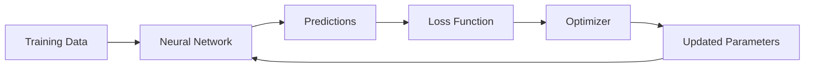

---

# 🧠 What Is a Loss Function?

Suppose the model predicts:

\[
\hat{y}
\]

while the actual value is:

\[
y
\]

A loss function measures the discrepancy between them:

\[
L(y,\hat{y})
\]

For a complete dataset containing \(N\) samples, the training objective is commonly expressed as the average loss:

\[
J(\theta)
=
\frac{1}{N}
\sum_{i=1}^{N}
L(y_i,\hat{y}_i)
\]

where:

- \(N\) = number of training examples
- \(y_i\) = actual target
- \(\hat{y}_i\) = model prediction
- \(\theta\) = learnable parameters
- \(L\) = loss function
- \(J(\theta)\) = overall training objective

---

# 🔄 The Training Loop

Loss functions are part of the central Deep Learning training loop.

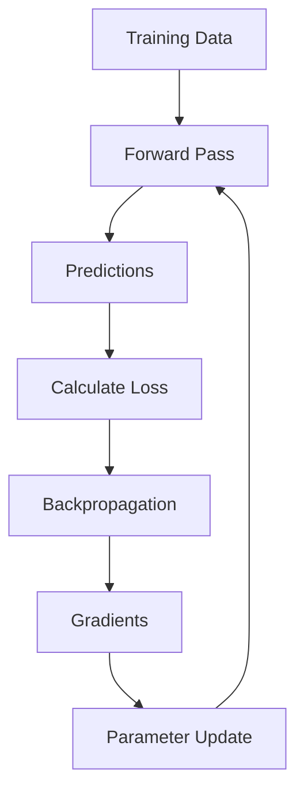

The process repeats for many batches and epochs.

---

# 🎯 What Does the Model Actually Minimize?

Suppose a model has parameters:

\[
\theta
\]

The goal of training is to find parameters that minimize the objective:

\[
\theta^*
=
\arg\min_{\theta} J(\theta)
\]

Conceptually:

```text
Poor Parameters
      │
      ▼
High Loss
      │
      ▼
Optimization
      │
      ▼
Better Parameters
      │
      ▼
Lower Loss
```

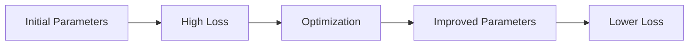

This is the fundamental connection between **loss functions** and **optimization**.

---

# 📚 Loss Functions by Problem Type

Different problems require different loss functions.

| Problem | Common Loss |
|---|---|
| Regression | MSE |
| Regression with outliers | MAE / Huber |
| Binary Classification | Binary Cross-Entropy |
| Multi-Class Classification | Categorical Cross-Entropy |
| Multi-Class with integer labels | Sparse Categorical Cross-Entropy |
| Probabilistic Models | Negative Log-Likelihood |
| Neural Language Models | Cross-Entropy / Negative Log-Likelihood |

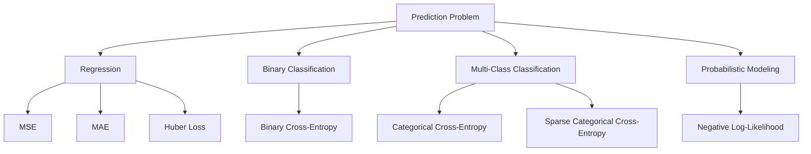

---

# 1. Mean Squared Error

Mean Squared Error is one of the most common loss functions for regression.

It is defined as:

\[
MSE
=
\frac{1}{N}
\sum_{i=1}^{N}
(y_i-\hat{y}_i)^2
\]

The error is squared before averaging.

---

## 🧮 Simple Example

Suppose:

```text
Actual:
[10, 20, 30]

Prediction:
[12, 18, 33]
```

Errors:

```text
10 - 12 = -2
20 - 18 =  2
30 - 33 = -3
```

Squared errors:

```text
4
4
9
```

Therefore:

\[
MSE
=
\frac{4+4+9}{3}
\]

\[
MSE
=
5.67
\]

---

## 📊 Why Square the Error?

Squaring provides several useful properties:

- Negative and positive errors do not cancel
- Larger errors receive greater penalty
- The function is differentiable
- It works well with gradient-based optimization

The important consequence is:

> **MSE strongly penalizes large errors.**

---

## ⚠ MSE and Outliers

Suppose most predictions are close but one prediction is extremely wrong.

Because the error is squared, the large error can dominate the overall loss.

```text
Error       Squared Error

1           1
2           4
5           25
10          100
20          400
```

This makes MSE sensitive to outliers.

---

# 2. Mean Absolute Error

Mean Absolute Error measures the average absolute difference between actual and predicted values.

\[
MAE
=
\frac{1}{N}
\sum_{i=1}^{N}
|y_i-\hat{y}_i|
\]

Unlike MSE, the error is not squared.

---

## 📊 MSE vs MAE

| Property | MSE | MAE |
|---|---|---|
| Error Transformation | Squared | Absolute |
| Outlier Sensitivity | High | Lower |
| Gradient | Smooth | Not differentiable at zero |
| Large Errors | Strongly Penalized | Linear Penalty |
| Common Usage | Regression | Robust Regression |

---

# 3. Huber Loss

Huber Loss combines characteristics of MSE and MAE.

For an error:

\[
e=y-\hat{y}
\]

Huber Loss can be defined as:

\[
L_\delta(e)
=
\begin{cases}
\frac{1}{2}e^2 & |e|\leq\delta\\
\delta(|e|-\frac{1}{2}\delta) & |e|>\delta
\end{cases}
\]

For small errors, Huber behaves like MSE.

For large errors, it behaves more like MAE.

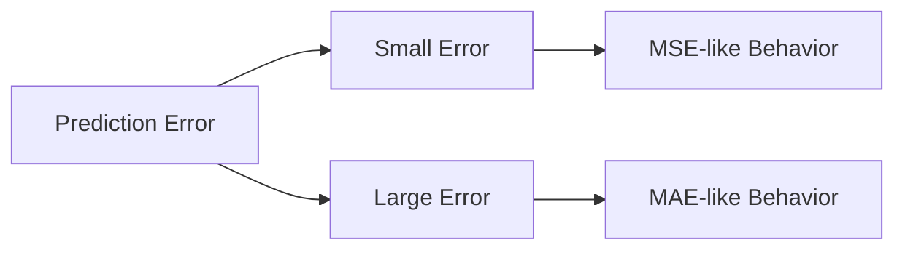

This makes Huber Loss useful when a regression dataset contains outliers but we still want smooth behavior around small errors.

---

# 4. Binary Cross-Entropy

Binary Cross-Entropy is commonly used for binary classification.

Suppose:

\[
y\in\{0,1\}
\]

and the model predicts probability:

\[
p=P(y=1|x)
\]

Binary Cross-Entropy is:

\[
L
=
-\left[
y\log(p)
+
(1-y)\log(1-p)
\right]
\]

For \(N\) samples:

\[
BCE
=
-\frac{1}{N}
\sum_{i=1}^{N}
\left[
y_i\log(p_i)
+
(1-y_i)\log(1-p_i)
\right]
\]

---

# 🧠 Why Cross-Entropy Works for Classification

Suppose the true class is:

```text
y = 1
```

If the model predicts:

```text
p = 0.99
```

the loss is very small.

But if it predicts:

```text
p = 0.01
```

the loss is very large.

```text
True Label = 1

Prediction        Loss
------------------------
0.99              Very Low
0.90              Low
0.70              Moderate
0.50              Higher
0.10              Very High
0.01              Extremely High
```

The loss strongly penalizes confident incorrect predictions.

---

# 📈 Binary Cross-Entropy Intuition

For \(y=1\):

\[
L=-\log(p)
\]

Therefore:

```text
p → 1
↓
Loss → 0
```

while:

```text
p → 0
↓
Loss → ∞
```

This makes Cross-Entropy particularly useful for probability-based classification.

---

# 🧮 Binary Cross-Entropy Example

Suppose:

```text
Actual label = 1
Predicted probability = 0.8
```

Then:

\[
L=-\log(0.8)
\]

\[
L\approx0.223
\]

Now suppose:

```text
Actual label = 1
Predicted probability = 0.1
```

Then:

\[
L=-\log(0.1)
\]

\[
L\approx2.303
\]

The second prediction receives a much larger penalty because the model was confidently wrong.

---

# 5. Categorical Cross-Entropy

Categorical Cross-Entropy is commonly used for multi-class classification.

Suppose there are \(K\) classes.

The loss for one example is:

\[
L
=
-\sum_{k=1}^{K}
y_k\log(p_k)
\]

where:

- \(y_k\) = true class indicator
- \(p_k\) = predicted probability

For one-hot encoded targets, only the correct class contributes to the loss.

---

## 📊 Example

Suppose the classes are:

```text
Cat
Dog
Bird
```

True label:

```text
Dog
```

One-hot representation:

```text
[0, 1, 0]
```

Model prediction:

```text
[0.10, 0.80, 0.10]
```

The loss is:

\[
L
=
-\left[
0\log(0.10)
+
1\log(0.80)
+
0\log(0.10)
\right]
\]

Therefore:

\[
L=-\log(0.80)
\]

---

# 6. Sparse Categorical Cross-Entropy

Sparse Categorical Cross-Entropy is useful when class labels are represented as integer IDs rather than one-hot vectors.

For example:

```text
Cat  = 0
Dog  = 1
Bird = 2
```

Instead of:

```text
[0, 1, 0]
```

the target can simply be:

```text
1
```

This is especially convenient when working with large classification datasets.

---

# 🔬 Cross-Entropy and Logits

A neural network often produces logits before probability normalization.

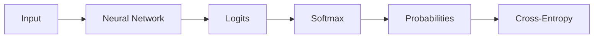

However, modern frameworks often combine Softmax and Cross-Entropy into a numerically stable operation.

This is why PyTorch commonly uses:

```python
criterion = torch.nn.CrossEntropyLoss()
```

with raw logits.

---

# ⚡ Logits vs Probabilities

For multi-class classification:

```text
Neural Network
      ↓
Logits
      ↓
Softmax
      ↓
Probabilities
```

But during training, the loss function can often operate directly on logits.

```text
Neural Network
      ↓
Logits
      ↓
CrossEntropyLoss
```

This avoids unnecessary intermediate operations and improves numerical stability.

---

# 7. Negative Log-Likelihood

Negative Log-Likelihood, commonly abbreviated as NLL, is closely related to Maximum Likelihood Estimation.

For a probability model:

\[
P(y|x;\theta)
\]

the likelihood of the observed data is:

\[
\mathcal{L}(\theta)
=
\prod_{i=1}^{N}
P(y_i|x_i;\theta)
\]

The negative log-likelihood is:

\[
NLL(\theta)
=
-\sum_{i=1}^{N}
\log P(y_i|x_i;\theta)
\]

Minimizing NLL is equivalent to maximizing likelihood.

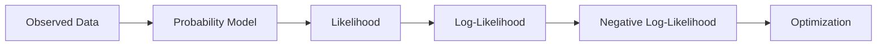

---

# 🧠 What Is Likelihood?

Likelihood asks:

> Given the observed data, how plausible are different parameter values of the model?

Suppose we have a model with parameters:

\[
\theta
\]

and observed data:

\[
D=\{(x_i,y_i)\}_{i=1}^{N}
\]

The likelihood is:

\[
\mathcal{L}(\theta|D)
=
P(D|\theta)
\]

For independent observations:

\[
\mathcal{L}(\theta|D)
=
\prod_{i=1}^{N}
P(y_i|x_i,\theta)
\]

The objective of Maximum Likelihood Estimation is to find:

\[
\theta^*
=
\arg\max_{\theta}
\mathcal{L}(\theta|D)
\]

---

# 📈 Maximum Likelihood Estimation

Maximum Likelihood Estimation, or MLE, chooses model parameters that make the observed data as likely as possible.

Conceptually:

```text
Candidate Parameters
        │
        ▼
Probability of Observed Data
        │
        ▼
Choose Parameters
with Maximum Likelihood
```

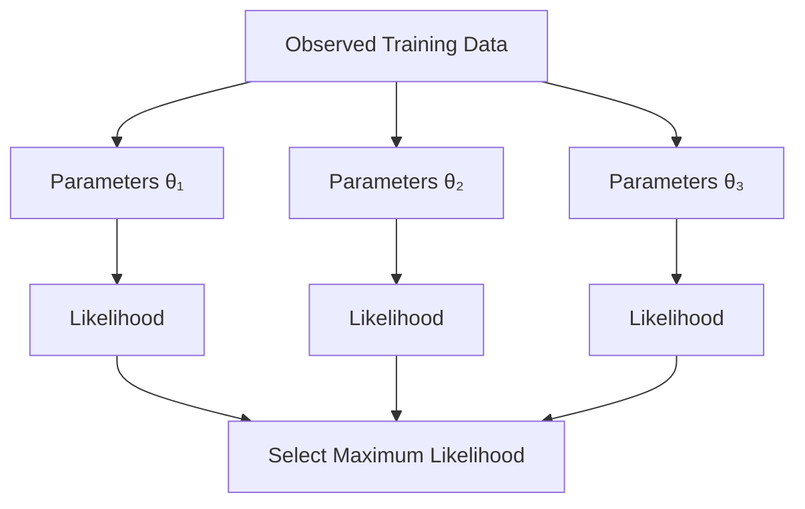

---

# 🧮 Why Use Log-Likelihood?

Likelihood involves multiplying probabilities:

\[
\mathcal{L}(\theta)
=
\prod_i P(y_i|x_i,\theta)
\]

Multiplication of many small probabilities can lead to numerical underflow.

Taking the logarithm transforms multiplication into addition:

\[
\log\mathcal{L}(\theta)
=
\sum_i
\log P(y_i|x_i,\theta)
\]

Therefore:

```text
Product of Probabilities
          ↓
       Logarithm
          ↓
Sum of Log Probabilities
```

This is much easier to optimize numerically.

---

# 🔄 MLE to Negative Log-Likelihood

Maximum Likelihood seeks:

\[
\arg\max_\theta
\sum_i
\log P(y_i|x_i,\theta)
\]

Multiplying the objective by \(-1\) converts maximization into minimization:

\[
\arg\min_\theta
-
\sum_i
\log P(y_i|x_i,\theta)
\]

This is Negative Log-Likelihood.

Therefore:

```text
Maximum Likelihood
       ↓
Maximize Log-Likelihood
       ↓
Equivalent to
       ↓
Minimize Negative Log-Likelihood
```

---

# 🔗 Cross-Entropy and Maximum Likelihood

This relationship is extremely important.

For classification, the model predicts probabilities:

\[
P(y|x;\theta)
\]

Maximum Likelihood tries to maximize the probability assigned to the observed labels.

Negative Log-Likelihood therefore becomes:

\[
-\sum_i
\log P(y_i|x_i;\theta)
\]

For classification, this corresponds to the familiar Cross-Entropy objective.

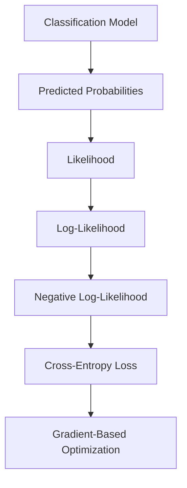

This is why Cross-Entropy is not an arbitrary choice.

It has a strong probabilistic foundation.

---

# 🎯 Maximum Likelihood for Binary Classification

Consider binary classification.

The model predicts:

\[
p_i=P(y_i=1|x_i)
\]

For a target \(y_i\in\{0,1\}\), the Bernoulli likelihood is:

\[
P(y_i|x_i)
=
p_i^{y_i}
(1-p_i)^{1-y_i}
\]

For all observations:

\[
\mathcal{L}
=
\prod_i
p_i^{y_i}
(1-p_i)^{1-y_i}
\]

Taking logarithms:

\[
\log\mathcal{L}
=
\sum_i
\left[
y_i\log(p_i)
+
(1-y_i)\log(1-p_i)
\right]
\]

Taking the negative:

\[
-\log\mathcal{L}
=
-\sum_i
\left[
y_i\log(p_i)
+
(1-y_i)\log(1-p_i)
\right]
\]

This is exactly the Binary Cross-Entropy objective.

---

# 🧠 The Important Connection

The complete relationship is:

```text
Binary Classification
        │
        ▼
Sigmoid
        │
        ▼
Probability p
        │
        ▼
Bernoulli Likelihood
        │
        ▼
Log-Likelihood
        │
        ▼
Negative Log-Likelihood
        │
        ▼
Binary Cross-Entropy
        │
        ▼
Optimization
```

This connection explains why Logistic Regression and neural-network binary classifiers naturally use Cross-Entropy-type objectives.

---

# 🧠 Loss Function vs Evaluation Metric

Loss functions and evaluation metrics are related but not identical.

| Loss Function | Evaluation Metric |
|---|---|
| Used during training | Used to assess model performance |
| Optimized by the model | Used for interpretation |
| Produces gradients | Usually does not need gradients |
| Directly influences parameter updates | Does not normally update parameters |
| Examples: MSE, BCE | Examples: Accuracy, Precision, Recall, F1 |

For example:

```text
Training:

Prediction
    ↓
Loss
    ↓
Gradient
    ↓
Parameter Update
```

while evaluation may be:

```text
Prediction
    ↓
Metrics
    ↓
Model Assessment
```

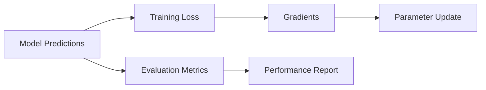

---

# 📊 Common Evaluation Metrics

For regression:

- MAE
- MSE
- RMSE
- \(R^2\)

For classification:

- Accuracy
- Precision
- Recall
- F1 Score
- ROC-AUC
- PR-AUC
- Log Loss

A model may optimize one loss while being evaluated using several metrics.

---

# ⚠ Accuracy Is Not a Loss Function

Suppose a binary classifier predicts:

```text
Actual:
[1, 1, 1, 1]

Prediction:
[1, 1, 0, 0]
```

Accuracy is:

\[
Accuracy=\frac{2}{4}=0.5
\]

But accuracy does not provide a smooth signal for gradient-based optimization.

A small change in the probability from:

```text
0.49 → 0.51
```

can change the class prediction even though the underlying model output changed only slightly.

Cross-Entropy provides a much richer optimization signal.

---

# 🔬 Why Cross-Entropy Is Useful for Neural Networks

Cross-Entropy provides several useful properties:

- Works naturally with probabilistic classification
- Penalizes confident incorrect predictions
- Provides useful gradients
- Connects directly to Maximum Likelihood
- Works naturally with Sigmoid and Softmax outputs
- Supports multi-class classification
- Has efficient implementations in modern frameworks

---

# 🧪 MSE with Python

```python
import numpy as np


y_true = np.array([10, 20, 30])
y_pred = np.array([12, 18, 33])

mse = np.mean(
    (y_true - y_pred) ** 2
)

print("MSE:", mse)
```

Output:

```text
MSE: 5.666666666666667
```

---

# 🧪 MAE with Python

```python
import numpy as np


y_true = np.array([10, 20, 30])
y_pred = np.array([12, 18, 33])

mae = np.mean(
    np.abs(y_true - y_pred)
)

print("MAE:", mae)
```

---

# 🧪 Binary Cross-Entropy with Python

```python
import numpy as np


y_true = np.array([1, 0, 1])
y_pred = np.array([0.9, 0.2, 0.8])

epsilon = 1e-7

y_pred = np.clip(
    y_pred,
    epsilon,
    1 - epsilon
)

bce = -np.mean(
    y_true * np.log(y_pred)
    + (1 - y_true) * np.log(1 - y_pred)
)

print("Binary Cross-Entropy:", bce)
```

The clipping step prevents taking:

\[
\log(0)
\]

which is undefined.

---

# 📈 Visualizing Loss Functions

Loss functions can be compared by plotting the loss against prediction error.

```python
import numpy as np
import matplotlib.pyplot as plt


error = np.linspace(-5, 5, 500)

mse = error ** 2
mae = np.abs(error)

delta = 1.0

huber = np.where(
    np.abs(error) <= delta,
    0.5 * error ** 2,
    delta * (
        np.abs(error) - 0.5 * delta
    )
)

plt.figure(figsize=(10, 6))

plt.plot(error, mse, label="MSE")
plt.plot(error, mae, label="MAE")
plt.plot(error, huber, label="Huber")

plt.xlabel("Prediction Error")
plt.ylabel("Loss")
plt.title("Regression Loss Functions")

plt.legend()
plt.grid(True)

plt.show()
```

This visualization demonstrates how:

- MSE grows quadratically
- MAE grows linearly
- Huber combines both behaviors

---

# 📈 Binary Cross-Entropy Visualization

For a positive target \(y=1\):

\[
L=-\log(p)
\]

The loss behaves approximately like:

```text
Loss
 │\
 │ \
 │  \
 │   \
 │    \
 │     \________
 │
 └──────────────────────> Probability
 0                    1
```

The loss becomes extremely large when the model assigns a probability close to zero to the true class.

---

# 🐍 TensorFlow / Keras Loss Functions

Keras provides built-in implementations.

## Mean Squared Error

```python
import tensorflow as tf


loss_fn = tf.keras.losses.MeanSquaredError()
```

---

## Binary Cross-Entropy

```python
loss_fn = tf.keras.losses.BinaryCrossentropy()
```

---

## Categorical Cross-Entropy

```python
loss_fn = tf.keras.losses.CategoricalCrossentropy()
```

---

## Sparse Categorical Cross-Entropy

```python
loss_fn = tf.keras.losses.SparseCategoricalCrossentropy()
```

---

# 🧪 Keras Model with Binary Cross-Entropy

```python
from tensorflow import keras


model = keras.Sequential([
    keras.layers.Input(shape=(20,)),
    keras.layers.Dense(64, activation="relu"),
    keras.layers.Dense(32, activation="relu"),
    keras.layers.Dense(1, activation="sigmoid")
])

model.compile(
    optimizer="adam",
    loss="binary_crossentropy",
    metrics=["accuracy"]
)
```

Training:

```python
model.fit(
    X_train,
    y_train,
    validation_data=(X_val, y_val),
    epochs=20,
    batch_size=32
)
```

---

# 🧪 Keras Multi-Class Classification

```python
model = keras.Sequential([
    keras.layers.Input(shape=(20,)),
    keras.layers.Dense(64, activation="relu"),
    keras.layers.Dense(32, activation="relu"),
    keras.layers.Dense(5, activation="softmax")
])

model.compile(
    optimizer="adam",
    loss="categorical_crossentropy",
    metrics=["accuracy"]
)
```

---

# 🐍 PyTorch Loss Functions

PyTorch provides several loss functions through `torch.nn`.

```python
import torch.nn as nn


mse_loss = nn.MSELoss()

bce_loss = nn.BCELoss()

cross_entropy_loss = nn.CrossEntropyLoss()

nll_loss = nn.NLLLoss()
```

---

# ⚡ PyTorch Binary Classification

A model can explicitly produce probabilities:

```python
model = nn.Sequential(
    nn.Linear(20, 64),
    nn.ReLU(),
    nn.Linear(64, 1),
    nn.Sigmoid()
)

criterion = nn.BCELoss()
```

However, for numerical stability, a common production approach is to output logits and use `BCEWithLogitsLoss`.

```python
model = nn.Sequential(
    nn.Linear(20, 64),
    nn.ReLU(),
    nn.Linear(64, 1)
)

criterion = nn.BCEWithLogitsLoss()
```

The model output is a logit rather than an explicit probability.

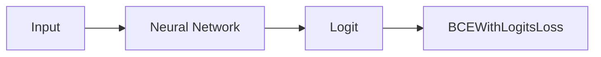

For inference, probabilities can be obtained with:

```python
probabilities = torch.sigmoid(logits)
```

---

# ⚡ PyTorch Multi-Class Classification

For multi-class classification:

```python
model = nn.Sequential(
    nn.Linear(20, 64),
    nn.ReLU(),
    nn.Linear(64, 5)
)

criterion = nn.CrossEntropyLoss()
```

The model returns logits.

```python
logits = model(X)
```

The loss receives the logits directly:

```python
loss = criterion(
    logits,
    target
)
```

For inference:

```python
probabilities = torch.softmax(
    logits,
    dim=1
)

predictions = torch.argmax(
    probabilities,
    dim=1
)
```

---

# 🧠 Log-Sum-Exp and Numerical Stability

Many classification losses involve logarithms and exponentials.

Naive implementations can suffer from:

- Overflow
- Underflow
- \(\log(0)\)
- Extremely large or small intermediate values

Modern frameworks therefore use numerically stable implementations.

For example:

```text
Raw Logits
    ↓
Stable Mathematical Transformation
    ↓
Loss
```

rather than explicitly calculating every intermediate probability.

This is one reason APIs such as:

```python
nn.CrossEntropyLoss()
```

and:

```python
nn.BCEWithLogitsLoss()
```

are preferred over manually composing activation and loss operations when appropriate.

---

# 🎯 Choosing the Correct Loss Function

A practical decision flow is:

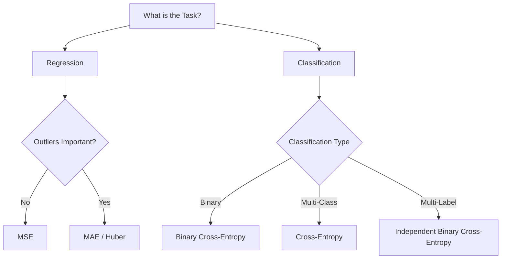

---

# 📊 Loss Function Selection Table

| Task | Output | Recommended Loss |
|---|---|---|
| Single-value regression | Continuous | MSE |
| Regression with outliers | Continuous | MAE / Huber |
| Binary classification | Sigmoid / Logit | BCE / BCEWithLogitsLoss |
| Multi-class classification | Softmax / Logits | Cross-Entropy |
| Multi-label classification | Independent Sigmoids / Logits | Binary Cross-Entropy |
| Probabilistic estimation | Probability distribution | Negative Log-Likelihood |

---

# ⚠ Common Mistakes

## Mistake 1 — Using MSE for Every Problem

MSE is useful for regression but is generally not the preferred objective for classification.

---

## Mistake 2 — Applying Softmax Before PyTorch CrossEntropyLoss

Avoid:

```python
probabilities = torch.softmax(
    logits,
    dim=1
)

loss = criterion(
    probabilities,
    target
)
```

Prefer:

```python
loss = criterion(
    logits,
    target
)
```

---

## Mistake 3 — Applying Sigmoid Before BCEWithLogitsLoss

Avoid:

```python
probability = torch.sigmoid(logit)

loss = bce_with_logits(
    probability,
    target
)
```

Prefer:

```python
loss = criterion(
    logit,
    target
)
```

`BCEWithLogitsLoss` combines the relevant operations in a numerically stable way.

---

## Mistake 4 — Treating Loss as Accuracy

A lower loss does not directly mean:

```text
Accuracy = Higher
```

The relationship depends on the task, dataset, model, and loss function.

---

## Mistake 5 — Optimizing the Test Set

The test set should be reserved for final evaluation.

Thresholds, hyperparameters, and model decisions should primarily be selected using training and validation data.

---

# 🔬 Loss Surface and Optimization

The loss function creates an optimization landscape over model parameters.

Conceptually:

```text
Loss
 │
 │       *
 │      / \
 │     /   \
 │    /     \
 │___/_______\____________
 │
 └─────────────────────────> Parameters
```

Training attempts to move toward regions of lower loss.


This connection becomes central in the next chapters on forward propagation, backpropagation, and gradient descent.

---

# 🧠 Loss and Gradient

Suppose:

\[
L=L(\theta)
\]

The gradient is:

\[
\nabla_\theta L
\]

It tells the optimizer how the loss changes with respect to the model parameters.

A simplified gradient descent update is:

\[
\theta
\leftarrow
\theta-\eta\nabla_\theta L
\]

where:

- \(\theta\) = parameters
- \(\eta\) = learning rate
- \(\nabla_\theta L\) = gradient of the loss

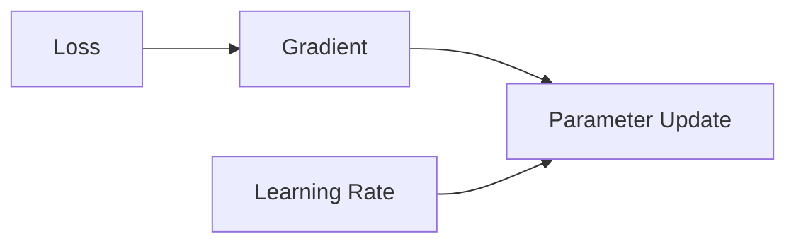

The detailed mechanics of this process are covered in the upcoming optimization chapters.

---

# 🧠 Why Loss Functions Matter So Much

The loss function influences what the model considers a "good" prediction.

For example:

### MSE

Strongly penalizes large numerical errors.

### MAE

Treats errors linearly and is more robust to outliers.

### Binary Cross-Entropy

Penalizes incorrect probability estimates.

### Cross-Entropy

Encourages the model to assign high probability to the correct class.

Therefore:

> **Choosing a loss function is effectively choosing what the model should optimize.**

---

# 🏢 Enterprise Perspective

In production Deep Learning systems, selecting a loss function should consider more than mathematical convenience.

Consider:

- Business objective
- Data distribution
- Label quality
- Class imbalance
- Outliers
- Probability calibration
- False-positive cost
- False-negative cost
- Numerical stability
- Model architecture
- Training infrastructure
- Deployment requirements

For example, a fraud detection system may care more about missed fraud than overall classification accuracy.

A medical screening system may prioritize recall.

A regression system dealing with noisy operational data may benefit from a robust loss.

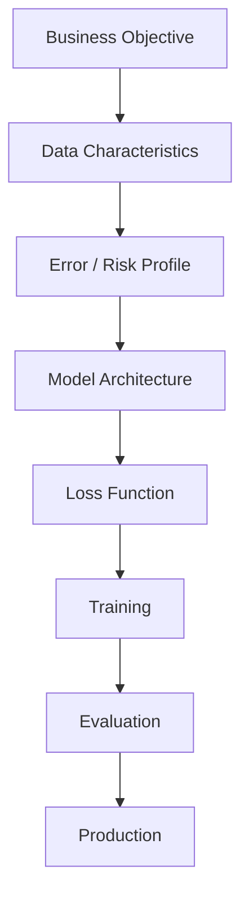

---

!!! tip "Production Insight"

    The loss function defines the mathematical objective used during training, but the business objective may be broader.

    A production system should therefore distinguish between:

    ```text
    Training Objective
           ↓
       Loss Function
           ↓
    Model Optimization
           ↓
    Evaluation Metrics
           ↓
    Business Objective
    ```

    The best production model is not necessarily the model with the lowest training loss. It is the model that satisfies the required business, technical, and operational objectives.

---

!!! note "Important Distinction"

    **Likelihood, probability, loss, and evaluation metrics are related but different concepts.**

    ```text
    Probability
        ↓
    Likelihood of Observed Data
        ↓
    Log-Likelihood
        ↓
    Negative Log-Likelihood
        ↓
    Loss
        ↓
    Optimization
    ```

    Understanding this chain provides the mathematical foundation for many modern classification objectives.

---

# 🧪 Practical Experiment

A useful experiment is to compare MSE, MAE, and Huber Loss for the same set of prediction errors.

```python
import numpy as np


errors = np.array([
    -3,
    -2,
    -1,
    0,
    1,
    2,
    3,
    10
])

mse = np.mean(errors ** 2)

mae = np.mean(np.abs(errors))

delta = 1.0

huber = np.where(
    np.abs(errors) <= delta,
    0.5 * errors ** 2,
    delta * (
        np.abs(errors) -
        0.5 * delta
    )
)

huber_mean = np.mean(huber)

print("MSE:", mse)
print("MAE:", mae)
print("Huber:", huber_mean)
```

Observe how the large error:

```text
10
```

affects the three losses differently.

---

# 🧠 Interview Questions

## Beginner

### 1. What is a loss function?

A loss function measures the error between a model's prediction and the actual target.

### 2. Why do neural networks need loss functions?

Loss functions provide the objective that optimization algorithms minimize during training.

### 3. What is MSE?

Mean Squared Error is the average squared difference between actual and predicted values.

### 4. What is Binary Cross-Entropy?

Binary Cross-Entropy measures the difference between actual binary labels and predicted probabilities.

---

## Intermediate

### 5. Why is MSE sensitive to outliers?

Because the error is squared, large errors receive disproportionately large penalties.

### 6. When would you use MAE instead of MSE?

MAE can be useful when robustness to outliers is more important.

### 7. What is Huber Loss?

Huber Loss behaves like MSE for small errors and like MAE for large errors.

### 8. What is Cross-Entropy?

Cross-Entropy measures the difference between a true probability distribution and the model's predicted distribution.

### 9. What is Negative Log-Likelihood?

It is the negative logarithm of the likelihood of the observed data and is commonly minimized during probabilistic model training.

---

## Advanced

### 10. What is Maximum Likelihood Estimation?

MLE selects model parameters that maximize the likelihood of the observed data.

### 11. Why do we use log-likelihood?

It converts products of probabilities into sums, making optimization easier and improving numerical stability.

### 12. How is Cross-Entropy related to Maximum Likelihood?

For common classification models, minimizing Cross-Entropy is equivalent to maximizing the likelihood of the observed labels.

### 13. Why should logits be passed directly to PyTorch CrossEntropyLoss?

Because the loss function expects logits and performs the required numerically stable transformations internally.

### 14. Why use BCEWithLogitsLoss instead of Sigmoid + BCELoss?

`BCEWithLogitsLoss` combines the sigmoid transformation and binary cross-entropy computation in a numerically stable way.

### 15. What is the difference between a loss function and an evaluation metric?

A loss function is typically optimized during training, while evaluation metrics are primarily used to assess model performance.

### 16. Why isn't accuracy normally used as the training loss?

Accuracy is not a smooth differentiable objective suitable for standard gradient-based optimization.

### 17. What does a lower loss mean?

Generally, it means the model is performing better according to the specific objective represented by that loss. It does not automatically mean better performance on every business or evaluation metric.

---

# 📌 Key Takeaways

- A loss function measures how wrong a model's predictions are.
- Neural network training attempts to minimize the loss.
- MSE is widely used for regression.
- MSE strongly penalizes large errors.
- MAE is more robust to outliers than MSE.
- Huber Loss combines characteristics of MSE and MAE.
- Binary Cross-Entropy is commonly used for binary classification.
- Categorical Cross-Entropy is commonly used for multi-class classification.
- Sparse Categorical Cross-Entropy works with integer class labels.
- Negative Log-Likelihood is closely related to probabilistic modeling.
- Maximum Likelihood Estimation finds parameters that maximize the likelihood of observed data.
- Logarithms convert products of probabilities into sums.
- Maximizing Log-Likelihood is equivalent to minimizing Negative Log-Likelihood.
- Cross-Entropy has a strong probabilistic interpretation through Maximum Likelihood.
- Logits and probabilities are different representations.
- Modern frameworks often combine activation and loss operations for numerical stability.
- PyTorch `CrossEntropyLoss` expects logits.
- PyTorch `BCEWithLogitsLoss` expects logits.
- Loss functions and evaluation metrics serve different purposes.
- Accuracy is generally not an appropriate differentiable training objective.
- The choice of loss function should reflect the problem, data, model, and business objective.
- Production systems should consider both the mathematical training objective and the final business objective.

---

# 📚 Further Reading

Continue with:

- **[07. Forward and Backpropagation](07-forward-and-backpropagation.md)**
- **[08. Gradient Descent and Mini-Batch Training](08-gradient-descent-and-mini-batch-training.md)**
- **[09. Weight Initialization and Gradient Stability](09-weight-initialization-and-gradient-stability.md)**
- **[10. Regularization and Generalization](10-regularization-and-generalization.md)**

These chapters build on the relationship between loss functions, gradients, optimization, and generalization.

---

## ➡️ Next Chapter

**[07. Forward and Backpropagation](07-forward-and-backpropagation.md)**

---

> **Enterprise AI Engineering Handbook**  
> *Building Production-Grade Enterprise AI Systems — One Chapter at a Time.*