# 07. Forward and Backpropagation

> Understand how neural networks transform inputs into predictions through forward propagation and learn from errors through backpropagation, forming the mathematical foundation of gradient-based Deep Learning.

---

## 🎯 Learning Objectives

After completing this chapter, you will be able to:

- Explain forward propagation
- Understand how inputs move through neural network layers
- Calculate weighted sums and neuron activations
- Understand the computational graph of a neural network
- Explain how predictions are produced
- Understand the relationship between logits, activations, and outputs
- Explain backpropagation
- Understand how gradients are calculated
- Understand the Chain Rule
- Calculate gradients through a simple neural network
- Understand the role of partial derivatives
- Understand how errors propagate backward
- Explain how gradients are used to update model parameters
- Understand the relationship between loss, gradients, and optimization
- Understand vanishing and exploding gradients at a conceptual level
- Implement a simple forward pass using Python
- Implement a simple backpropagation example using Python
- Understand how Keras and PyTorch perform automatic differentiation
- Understand the difference between manual and automatic differentiation
- Visualize forward and backward information flow
- Understand backpropagation from a production Deep Learning perspective

---

## 📖 Overview

A neural network learns through two fundamental computational processes:

```text
Forward Propagation
        ↓
Prediction
        ↓
Loss Calculation
        ↓
Backpropagation
        ↓
Gradients
        ↓
Parameter Update
        ↓
Repeat
```

**Forward propagation** determines what the network predicts.

**Backpropagation** determines how each model parameter contributed to the prediction error.

The optimizer then uses those gradients to update the parameters.

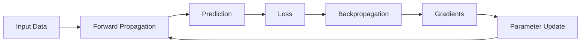

This loop is repeated over many batches and epochs until the model converges to a useful solution.

---

# 🧠 Neural Network Computation

Consider a simple neuron.

The neuron receives inputs:

\[
x_1,x_2,\ldots,x_n
\]

with corresponding weights:

\[
w_1,w_2,\ldots,w_n
\]

and a bias:

\[
b
\]

The weighted sum is:

\[
z
=
\sum_{i=1}^{n}w_ix_i+b
\]

The activation is:

\[
a=f(z)
\]

where \(f\) is the activation function.

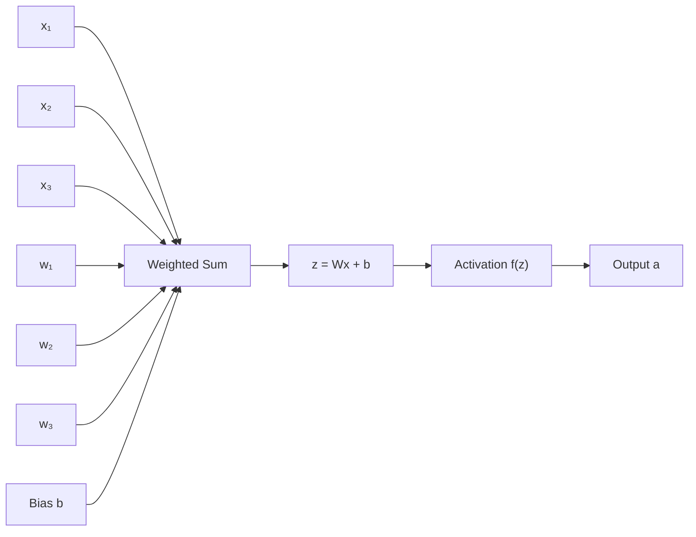

---

# 🔄 Forward Propagation

Forward propagation is the process of passing input data through the network from the input layer toward the output layer.

For a simple network:

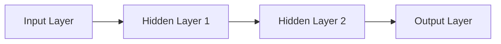

Each layer performs:

```text
Weighted Sum
     ↓
Activation
     ↓
Output
```

The output of one layer becomes the input to the next.

---

# 🧮 Forward Propagation in One Layer

For a layer:

\[
z=Wx+b
\]

and:

\[
a=f(z)
\]

Therefore:

\[
a=f(Wx+b)
\]

This is the fundamental computation performed by a neural network layer.

---

# 🧮 Forward Propagation Through Two Layers

Suppose a network contains two layers.

First layer:

\[
z^{[1]}=W^{[1]}x+b^{[1]}
\]

\[
a^{[1]}=f^{[1]}(z^{[1]})
\]

Second layer:

\[
z^{[2]}=W^{[2]}a^{[1]}+b^{[2]}
\]

\[
a^{[2]}=f^{[2]}(z^{[2]})
\]

Therefore:

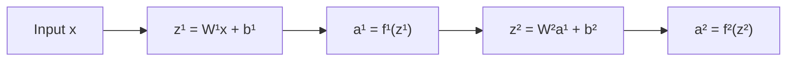

The final activation \(a^{[2]}\) becomes the model prediction.

---

# 🧠 Example: Simple Neural Network

Consider:

```text
Input Layer
     ↓
2 Neurons
     ↓
1 Output Neuron
```

Architecture:

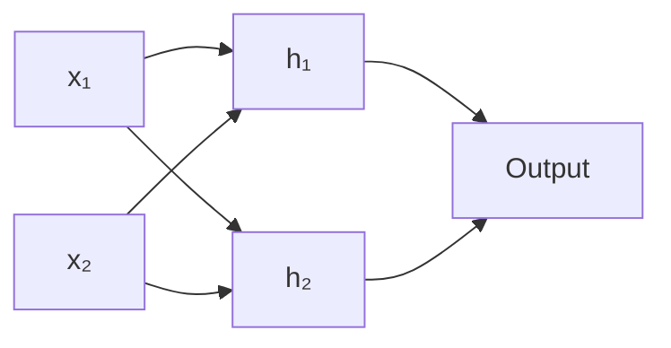

The hidden neurons calculate:

\[
z_1=w_{11}x_1+w_{12}x_2+b_1
\]

\[
a_1=f(z_1)
\]

and:

\[
z_2=w_{21}x_1+w_{22}x_2+b_2
\]

\[
a_2=f(z_2)
\]

The output neuron calculates:

\[
z_3=w_{31}a_1+w_{32}a_2+b_3
\]

and:

\[
\hat{y}=g(z_3)
\]

---

# 🧮 Numerical Forward Pass

Suppose:

```text
x₁ = 2
x₂ = 3
```

and the first hidden neuron has:

```text
w₁ = 0.5
w₂ = 0.2
b  = 0.1
```

Then:

\[
z
=
(0.5)(2)
+
(0.2)(3)
+
0.1
\]

\[
z=1.7
\]

Using ReLU:

\[
a=\max(0,1.7)
\]

\[
a=1.7
\]

Therefore:

```text
Input
  ↓
Weighted Sum = 1.7
  ↓
ReLU
  ↓
Activation = 1.7
```

---

# 🧪 Python Forward Pass

A single neuron can be implemented directly.

```python
import numpy as np


x = np.array([2.0, 3.0])

w = np.array([0.5, 0.2])

b = 0.1

z = np.dot(w, x) + b

a = max(0, z)

print("Weighted Sum:", z)
print("Activation:", a)
```

Output:

```text
Weighted Sum: 1.7
Activation: 1.7
```

---

# 🏗 Forward Propagation with Matrices

For a batch of samples, matrix operations make the computation efficient.

Suppose:

\[
X\in\mathbb{R}^{m\times n}
\]

where:

- \(m\) = number of samples
- \(n\) = number of input features

A layer performs:

\[
Z=XW+b
\]

followed by:

\[
A=f(Z)
\]

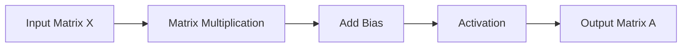

Modern Deep Learning frameworks are heavily optimized around these matrix and tensor operations.

---

# ⚙️ Why Matrix Operations Matter

Deep Learning models may contain:

- Millions or billions of parameters
- Thousands of training examples
- Large batches
- Multiple layers

Performing operations one element at a time would be inefficient.

Instead, frameworks use:

- Vectorization
- Matrix multiplication
- Tensor operations
- GPU acceleration
- Parallel computation

This is one of the reasons Deep Learning frameworks such as TensorFlow and PyTorch can train large models efficiently.

---

# 🧠 Computational Graph

A neural network can be represented as a computational graph.

For example:

\[
z=wx+b
\]

\[
a=f(z)
\]

\[
L=L(a,y)
\]

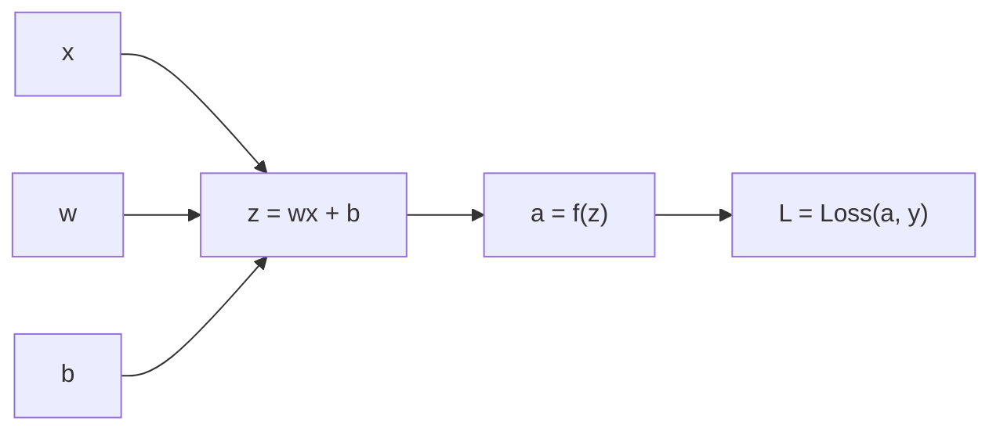

The graph represents dependencies between operations.

This becomes extremely important during backpropagation.

---

# 🔁 Forward Pass Through the Computational Graph

During the forward pass:

```text
Inputs
  ↓
Intermediate Values
  ↓
Prediction
  ↓
Loss
```

Each operation produces values that may be required later during gradient computation.

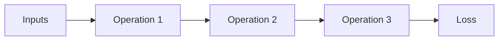

These intermediate values are often stored or tracked by automatic differentiation systems.

---

# 🔄 What Is Backpropagation?

Backpropagation is the algorithm used to efficiently compute gradients of the loss with respect to model parameters.

The key idea is:

> **Start with the loss and propagate gradient information backward through the computational graph.**

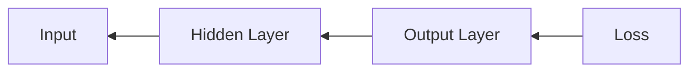

The backward pass determines:

```text
How much did each parameter contribute
to the final loss?
```

---

# 🧮 The Chain Rule

Backpropagation relies heavily on the Chain Rule from calculus.

If:

\[
y=f(u)
\]

and:

\[
u=g(x)
\]

then:

\[
\frac{dy}{dx}
=
\frac{dy}{du}
\frac{du}{dx}
\]

For a longer chain:

\[
x
\rightarrow
u
\rightarrow
v
\rightarrow
L
\]

the derivative becomes:

\[
\frac{dL}{dx}
=
\frac{dL}{dv}
\frac{dv}{du}
\frac{du}{dx}
\]

This allows gradients to be propagated backward through many operations.

---

# 🧠 Chain Rule in a Neural Network

Consider:

\[
z=wx+b
\]

\[
a=f(z)
\]

\[
L=L(a,y)
\]

We want:

\[
\frac{\partial L}{\partial w}
\]

Using the Chain Rule:

\[
\frac{\partial L}{\partial w}
=
\frac{\partial L}{\partial a}
\frac{\partial a}{\partial z}
\frac{\partial z}{\partial w}
\]

Since:

\[
z=wx+b
\]

we have:

\[
\frac{\partial z}{\partial w}=x
\]

Therefore:

\[
\frac{\partial L}{\partial w}
=
\frac{\partial L}{\partial a}
f'(z)
x
\]

This is the fundamental mechanism behind backpropagation.

---

# 🔬 Backpropagation Step-by-Step

The backward process can be understood as:

```text
Loss
 ↓
Gradient with respect to output
 ↓
Gradient through activation
 ↓
Gradient through weighted sum
 ↓
Gradient with respect to weights
 ↓
Gradient with respect to inputs
```

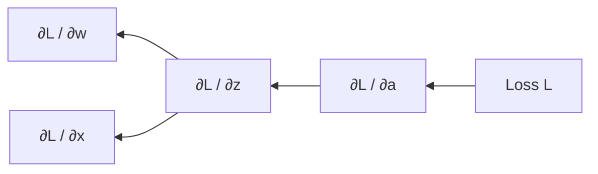

---

# 🧮 Derivative of the Weighted Sum

For:

\[
z=wx+b
\]

we have:

\[
\frac{\partial z}{\partial w}=x
\]

\[
\frac{\partial z}{\partial b}=1
\]

\[
\frac{\partial z}{\partial x}=w
\]

Therefore:

\[
\frac{\partial L}{\partial w}
=
\frac{\partial L}{\partial z}x
\]

\[
\frac{\partial L}{\partial b}
=
\frac{\partial L}{\partial z}
\]

and:

\[
\frac{\partial L}{\partial x}
=
\frac{\partial L}{\partial z}w
\]

These equations show how gradient information flows to different parts of the neuron.

---

# 🧠 A Complete Single-Neuron Example

Consider:

\[
z=wx+b
\]

\[
a=f(z)
\]

and:

\[
L=\frac{1}{2}(a-y)^2
\]

We want:

\[
\frac{\partial L}{\partial w}
\]

Using the Chain Rule:

\[
\frac{\partial L}{\partial w}
=
\frac{\partial L}{\partial a}
\frac{\partial a}{\partial z}
\frac{\partial z}{\partial w}
\]

The individual terms are:

\[
\frac{\partial L}{\partial a}
=
a-y
\]

\[
\frac{\partial a}{\partial z}
=
f'(z)
\]

\[
\frac{\partial z}{\partial w}
=
x
\]

Therefore:

\[
\frac{\partial L}{\partial w}
=
(a-y)f'(z)x
\]

This equation captures the essence of gradient computation for a single neuron.

---

# 🧮 Numerical Backpropagation Example

Suppose:

```text
x = 2
w = 0.5
b = 0
y = 2
```

Use the identity activation:

\[
a=z
\]

Forward pass:

\[
z=wx+b
\]

\[
z=(0.5)(2)=1
\]

Therefore:

\[
a=1
\]

Loss:

\[
L=
\frac{1}{2}(a-y)^2
\]

\[
L=
\frac{1}{2}(1-2)^2
\]

\[
L=0.5
\]

---

## Backward Pass

First:

\[
\frac{\partial L}{\partial a}
=
a-y
\]

\[
\frac{\partial L}{\partial a}
=
1-2
=
-1
\]

Since identity activation:

\[
\frac{\partial a}{\partial z}=1
\]

And:

\[
\frac{\partial z}{\partial w}=x=2
\]

Therefore:

\[
\frac{\partial L}{\partial w}
=
(-1)(1)(2)
\]

\[
\frac{\partial L}{\partial w}=-2
\]

Similarly:

\[
\frac{\partial L}{\partial b}=-1
\]

---

# 🔄 Parameter Update

Suppose the learning rate is:

\[
\eta=0.1
\]

Gradient descent updates the weight:

\[
w_{new}
=
w-\eta
\frac{\partial L}{\partial w}
\]

Therefore:

\[
w_{new}
=
0.5-(0.1)(-2)
\]

\[
w_{new}=0.7
\]

The weight increased because the gradient was negative.

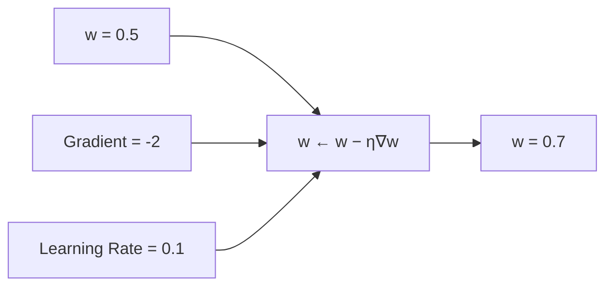

---

# 🧠 Forward vs Backward Pass

| Forward Propagation | Backpropagation |
|---|---|
| Moves input → output | Moves loss → earlier layers |
| Computes predictions | Computes gradients |
| Uses model parameters | Uses derivatives |
| Produces activations | Produces parameter gradients |
| Calculates loss at the end | Starts from the loss |
| Required for prediction | Required for gradient-based training |

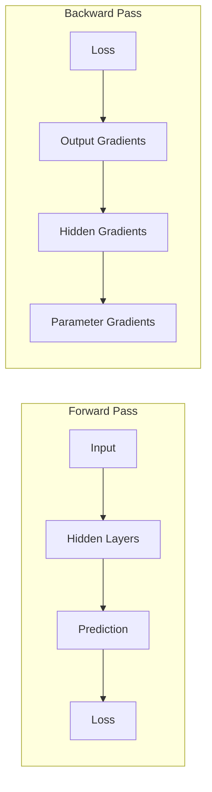

---

# 🧮 Vectorized Backpropagation

For a layer:

\[
Z=WA+b
\]

the gradients can be expressed using matrix operations.

If:

\[
dZ=\frac{\partial L}{\partial Z}
\]

then:

\[
dW=dZ\,A^T
\]

and:

\[
db=\sum dZ
\]

while:

\[
dA=W^T dZ
\]

The exact dimensions depend on the framework's tensor layout, but the central idea remains the same.

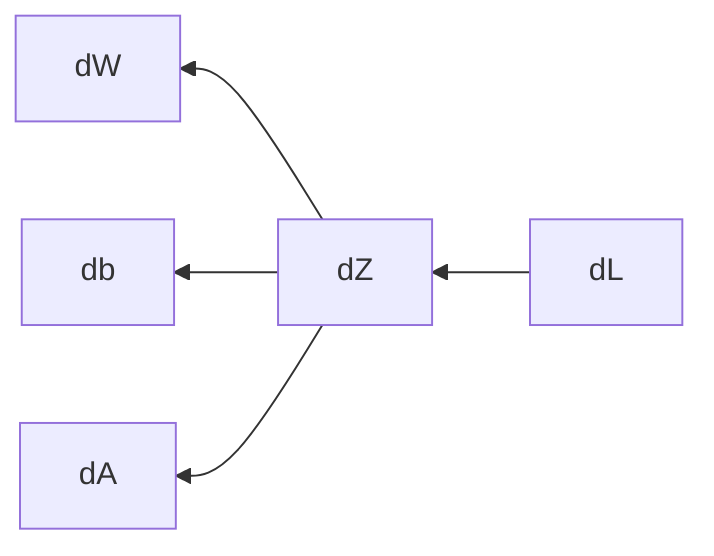

---

# 🏗 Backpropagation Through Multiple Layers

Consider:

```text
Input
  ↓
Layer 1
  ↓
Layer 2
  ↓
Layer 3
  ↓
Loss
```

The backward pass works in reverse:

```text
Loss
  ↓
Layer 3 Gradients
  ↓
Layer 2 Gradients
  ↓
Layer 1 Gradients
  ↓
Parameter Gradients
```

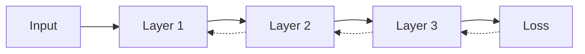

The same Chain Rule is repeatedly applied.

---

# 🔬 Computational Graph Example

Consider:

\[
u=xw
\]

\[
v=u+b
\]

\[
a=f(v)
\]

\[
L=(a-y)^2
\]

The graph is:

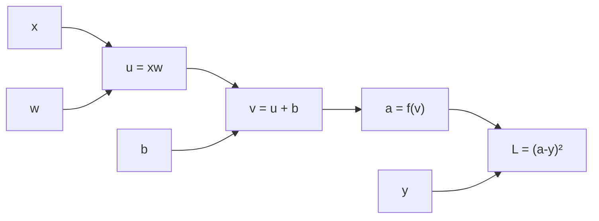

During backpropagation, gradients travel in the opposite direction.

---

# 🔁 Forward and Backward Information Flow

The complete computation looks like:

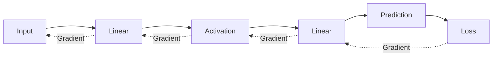

Forward propagation computes values.

Backpropagation computes sensitivities.

---

# 🧠 What Does a Gradient Mean?

A gradient tells us how much the loss changes when a parameter changes.

For a parameter \(w\):

\[
\frac{\partial L}{\partial w}
\]

can be interpreted as:

> How sensitive is the loss to a small change in \(w\)?

If:

\[
\frac{\partial L}{\partial w}>0
\]

increasing \(w\) tends to increase the loss locally.

If:

\[
\frac{\partial L}{\partial w}<0
\]

increasing \(w\) tends to decrease the loss locally.

This information allows gradient descent to choose a direction for parameter updates.

---

# 📈 Gradient Descent and Backpropagation

Backpropagation calculates gradients.

Gradient descent uses those gradients.

These are related but different concepts.

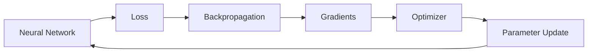

Therefore:

> **Backpropagation tells us how to change the parameters; the optimizer decides how to apply those gradients.**

---

# ⚠ Backpropagation Is Not Gradient Descent

These concepts are often confused.

### Backpropagation

Computes:

\[
\nabla_\theta L
\]

### Gradient Descent

Uses the gradient:

\[
\theta
\leftarrow
\theta-\eta\nabla_\theta L
\]

Therefore:

```text
Backpropagation
      ↓
Compute Gradients
      ↓
Optimizer
      ↓
Update Parameters
```

---

# 🧠 Automatic Differentiation

Modern frameworks rarely require engineers to manually derive every gradient.

Instead, they provide **automatic differentiation**.

For example:

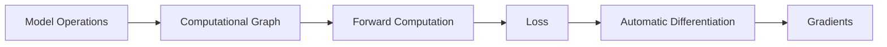

TensorFlow and PyTorch both provide automatic differentiation systems.

---

# 🐍 PyTorch Autograd

PyTorch uses `autograd` to track tensor operations and calculate gradients.

```python
import torch


x = torch.tensor(
    2.0,
    requires_grad=True
)

w = torch.tensor(
    0.5,
    requires_grad=True
)

b = torch.tensor(
    0.0,
    requires_grad=True
)

y = torch.tensor(2.0)

z = w * x + b

loss = 0.5 * (z - y) ** 2

loss.backward()

print("Loss:", loss.item())
print("dw:", w.grad.item())
print("db:", b.grad.item())
```

PyTorch automatically calculates:

```text
∂Loss/∂w
∂Loss/∂b
```

---

# 🔄 PyTorch Training Loop

A simplified PyTorch training loop is:

```python
for X_batch, y_batch in train_loader:

    optimizer.zero_grad()

    predictions = model(X_batch)

    loss = criterion(
        predictions,
        y_batch
    )

    loss.backward()

    optimizer.step()
```

Each step has a clear purpose:

```text
optimizer.zero_grad()
        ↓
Clear Previous Gradients

model(X_batch)
        ↓
Forward Pass

criterion(...)
        ↓
Calculate Loss

loss.backward()
        ↓
Backpropagation

optimizer.step()
        ↓
Update Parameters
```

---

# 🐍 TensorFlow GradientTape

TensorFlow provides `tf.GradientTape`.

```python
import tensorflow as tf


x = tf.Variable(2.0)
w = tf.Variable(0.5)
b = tf.Variable(0.0)

y = tf.constant(2.0)

with tf.GradientTape() as tape:

    z = w * x + b

    loss = 0.5 * (z - y) ** 2

gradients = tape.gradient(
    loss,
    [w, b]
)

print("Loss:", loss.numpy())
print("dw:", gradients[0].numpy())
print("db:", gradients[1].numpy())
```

---

# 🧪 Manual vs Automatic Differentiation

| Manual Backpropagation | Automatic Differentiation |
|---|---|
| Engineer derives gradients | Framework calculates gradients |
| Useful for learning | Used in production |
| Error-prone for large networks | Scales to complex models |
| Useful for understanding mathematics | Essential for practical Deep Learning |
| Good for small examples | Works with large computational graphs |

Understanding manual backpropagation remains important because it explains what automatic differentiation is actually doing.

---

# ⚠ Vanishing Gradients

During backpropagation, gradients are repeatedly multiplied through layers.

Suppose each layer contributes a factor:

\[
0.1
\]

After several layers:

\[
0.1^5=0.00001
\]

The gradient can become extremely small.

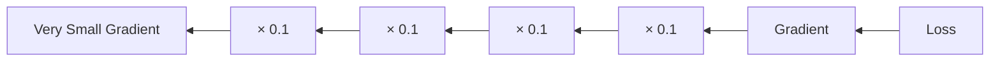

This is the **vanishing gradient problem**.

Consequences can include:

- Very slow learning
- Earlier layers learning poorly
- Difficulty training very deep networks

---

# ⚠ Exploding Gradients

The opposite can also happen.

If gradients repeatedly multiply by values larger than one:

\[
2^n
\]

they can grow rapidly.

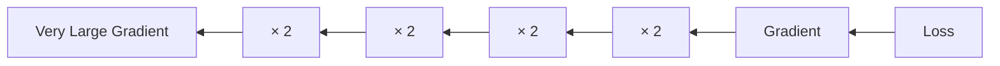

Consequences may include:

- Unstable training
- Extremely large parameter updates
- NaN values
- Divergence

Techniques such as:

- Appropriate initialization
- Normalization
- Gradient clipping
- Proper architecture design
- Suitable activation functions

can help mitigate these problems.

These topics are explored further in later chapters.

---

# 🔬 Gradient Flow Through Activations

Activation functions directly influence gradient propagation.

For ReLU:

\[
f'(x)
=
\begin{cases}
0 & x<0\\
1 & x>0
\end{cases}
\]

For Sigmoid:

\[
\sigma'(x)
=
\sigma(x)(1-\sigma(x))
\]

For Tanh:

\[
\tanh'(x)
=
1-\tanh^2(x)
\]

Therefore, the choice of activation affects the gradients available during backpropagation.

```mermaid
flowchart TD

    ACTIVATION["Activation Function"]

    ACTIVATION --> DERIV["Derivative"]
    DERIV --> FLOW["Gradient Flow"]
    FLOW --> TRAIN["Training Behavior"]

    TRAIN --> FAST["Effective Learning"]
    TRAIN --> SLOW["Vanishing / Weak Gradients"]
```

---

# 🧠 Backpropagation Through ReLU

Consider:

\[
a=ReLU(z)
\]

If:

\[
z>0
\]

then:

\[
\frac{da}{dz}=1
\]

If:

\[
z<0
\]

then:

\[
\frac{da}{dz}=0
\]

Therefore:

```text
Positive Activation
       ↓
Gradient flows

Negative Activation
       ↓
Gradient becomes zero
```

This is directly connected to the dying ReLU problem discussed earlier.

---

# 🧮 Backpropagation Through Sigmoid

For:

\[
a=\sigma(z)
\]

the derivative is:

\[
\frac{da}{dz}
=
a(1-a)
\]

When \(a\) is close to 0 or 1:

\[
a(1-a)\approx0
\]

Therefore, the gradient can become very small.

```mermaid
flowchart TD

    Z["Large |z|"]
    SIG["Sigmoid Saturates"]
    DER["a(1-a) ≈ 0"]
    GRAD["Small Gradient"]

    Z --> SIG
    SIG --> DER
    DER --> GRAD
```

---

# 🧠 Backpropagation in a Deep Network

A deep network can contain many layers:

```text
Input
 ↓
Layer 1
 ↓
Layer 2
 ↓
Layer 3
 ↓
Layer 4
 ↓
Layer 5
 ↓
Output
 ↓
Loss
```

During backpropagation:

```text
Loss
 ↓
Layer 5 Gradient
 ↓
Layer 4 Gradient
 ↓
Layer 3 Gradient
 ↓
Layer 2 Gradient
 ↓
Layer 1 Gradient
```

Each layer applies the Chain Rule.

```mermaid
flowchart RL

    LOSS["Loss"]
    L5["Layer 5"]
    L4["Layer 4"]
    L3["Layer 3"]
    L2["Layer 2"]
    L1["Layer 1"]

    LOSS --> L5
    L5 --> L4
    L4 --> L3
    L3 --> L2
    L2 --> L1
```

---

# 🏗 Complete Deep Learning Training Cycle

Forward propagation and backpropagation form only part of the complete training lifecycle.

```mermaid
flowchart TD

    DATA["Training Data"]
    BATCH["Mini-Batch"]
    FORWARD["Forward Propagation"]
    LOSS["Loss Calculation"]
    BACK["Backpropagation"]
    GRAD["Gradients"]
    OPT["Optimizer"]
    UPDATE["Parameter Update"]
    METRIC["Metrics"]
    NEXT["Next Batch"]

    DATA --> BATCH
    BATCH --> FORWARD
    FORWARD --> LOSS
    LOSS --> BACK
    BACK --> GRAD
    GRAD --> OPT
    OPT --> UPDATE
    UPDATE --> METRIC
    METRIC --> NEXT
    NEXT --> BATCH
```

This cycle repeats for multiple batches and epochs.

---

# 🧪 Complete Conceptual Example

Suppose we train a binary classifier.

```text
Input Features
      ↓
Dense Layer
      ↓
ReLU
      ↓
Dense Layer
      ↓
Logit
      ↓
Binary Cross-Entropy
      ↓
Backpropagation
      ↓
Gradients
      ↓
Optimizer
      ↓
Updated Weights
```

```mermaid
flowchart LR

    X["Features"]
    D1["Dense"]
    R["ReLU"]
    D2["Dense"]
    LOGIT["Logit"]
    LOSS["BCE Loss"]
    BACK["Backpropagation"]
    GRAD["Gradients"]
    OPT["Optimizer"]

    X --> D1
    D1 --> R
    R --> D2
    D2 --> LOGIT
    LOGIT --> LOSS
    LOSS --> BACK
    BACK --> GRAD
    GRAD --> OPT
    OPT -. Update .-> D1
    OPT -. Update .-> D2
```

---

# 🏢 Enterprise Perspective

Backpropagation is fundamental to Deep Learning, but production systems must consider the larger training infrastructure.

Important concerns include:

- GPU utilization
- Batch size
- Memory consumption
- Mixed precision
- Distributed training
- Gradient accumulation
- Gradient clipping
- Checkpointing
- Training reproducibility
- Experiment tracking
- Model versioning
- Validation strategy
- Training observability

A production training system therefore looks more like:

```mermaid
flowchart TD

    DATA["Training Data"]
    PIPE["Data Pipeline"]
    GPU["Accelerated Training"]
    FORWARD["Forward Pass"]
    LOSS["Loss"]
    BACK["Backpropagation"]
    OPT["Optimizer"]
    CKPT["Checkpoint"]
    EVAL["Validation"]
    TRACK["Experiment Tracking"]

    DATA --> PIPE
    PIPE --> GPU
    GPU --> FORWARD
    FORWARD --> LOSS
    LOSS --> BACK
    BACK --> OPT
    OPT --> CKPT
    CKPT --> EVAL
    EVAL --> TRACK
```

---

!!! tip "Production Insight"

    Backpropagation is the mathematical mechanism that computes gradients, but a production Deep Learning training system must make the entire training loop reliable.

    ```text
    Data
      ↓
    Forward Pass
      ↓
    Loss
      ↓
    Backpropagation
      ↓
    Gradients
      ↓
    Optimizer
      ↓
    Parameter Update
      ↓
    Validation
      ↓
    Checkpoint / Experiment Tracking
    ```

    In large-scale systems, training failures can come from data pipelines, GPU memory, numerical instability, incorrect gradient handling, or distributed-training issues—not only from the model architecture.

---

!!! note "Important Distinction"

    Remember the difference between these three concepts:

    ```text
    Forward Propagation
        ↓
    Computes predictions

    Backpropagation
        ↓
    Computes gradients

    Optimization
        ↓
    Uses gradients to update parameters
    ```

    These processes work together but are not interchangeable.

---

# ⚠ Common Mistakes

Avoid these common mistakes:

- Confusing forward propagation with backpropagation
- Assuming backpropagation updates weights by itself
- Confusing gradients with parameter updates
- Forgetting to clear accumulated gradients in PyTorch
- Using the wrong tensor shapes
- Ignoring activation derivatives
- Ignoring vanishing gradients
- Ignoring exploding gradients
- Updating parameters before calculating all required gradients
- Accidentally modifying tensors required for gradient computation
- Performing unnecessary manual differentiation in production code
- Treating automatic differentiation as a replacement for understanding the mathematics
- Forgetting validation during training
- Ignoring numerical instability
- Ignoring GPU memory and computational constraints

---

# 🧪 Practical Exercise

Build a single-neuron regression model manually.

Use:

```text
x = 2
y = 4
w = 0.5
b = 0
```

Use the model:

\[
\hat{y}=wx+b
\]

and loss:

\[
L=\frac{1}{2}(\hat{y}-y)^2
\]

Calculate:

1. Forward prediction
2. Loss
3. \(\frac{\partial L}{\partial \hat{y}}\)
4. \(\frac{\partial \hat{y}}{\partial w}\)
5. \(\frac{\partial L}{\partial w}\)
6. \(\frac{\partial L}{\partial b}\)
7. Updated weight using learning rate \(0.1\)

Then implement the same calculation using PyTorch Autograd.

---

# 🧠 Interview Questions

## Beginner

### 1. What is forward propagation?

Forward propagation is the process of passing input data through the network to calculate predictions.

### 2. What is backpropagation?

Backpropagation calculates gradients of the loss with respect to model parameters by propagating gradient information backward through the computational graph.

### 3. What is the Chain Rule?

The Chain Rule allows derivatives of composed functions to be calculated by multiplying the relevant partial derivatives.

### 4. What is a gradient?

A gradient indicates how the loss changes with respect to model parameters.

---

## Intermediate

### 5. What happens during a forward pass?

The network performs weighted transformations and activation functions layer by layer until it produces a prediction and loss.

### 6. What happens during backpropagation?

The model calculates gradients of the loss with respect to intermediate values and parameters, starting from the loss and moving backward through the network.

### 7. Does backpropagation update the weights?

No. Backpropagation calculates gradients. An optimizer uses those gradients to update the parameters.

### 8. Why is the Chain Rule important?

Neural networks are compositions of many functions. The Chain Rule allows gradients to be propagated efficiently through those compositions.

### 9. What is automatic differentiation?

Automatic differentiation is a computational technique used by frameworks such as PyTorch and TensorFlow to calculate derivatives of numerical programs.

---

## Advanced

### 10. What is the difference between backpropagation and automatic differentiation?

Backpropagation is the reverse-mode gradient computation used for neural networks, while automatic differentiation is the broader technique/framework capability that automatically computes derivatives of composed operations.

### 11. Why can deep networks suffer from vanishing gradients?

During backpropagation, gradients can be repeatedly multiplied by small derivatives, causing the resulting gradient to become extremely small.

### 12. What causes exploding gradients?

Repeated multiplication by large derivatives or weight values can cause gradients to grow exponentially.

### 13. Why does ReLU help with vanishing gradients?

For positive inputs, ReLU has a derivative of 1, so it does not shrink gradients in the same way as saturating activations over that region.

### 14. What is the dying ReLU problem?

A ReLU neuron can become inactive when it consistently receives negative inputs, resulting in zero gradients for those inputs.

### 15. Why does PyTorch require `zero_grad()`?

Gradients accumulate by default in PyTorch. Clearing them before the next backward pass prevents gradients from previous batches from being unintentionally accumulated.

### 16. Why are computational graphs important?

They represent dependencies between operations and allow automatic differentiation systems to calculate gradients efficiently.

---

# 📌 Key Takeaways

- Forward propagation computes predictions.
- A neural network layer generally performs a weighted transformation followed by an activation.
- The fundamental layer computation is \(z=Wx+b\).
- The activation is \(a=f(z)\).
- Forward propagation moves information from input toward output.
- The loss measures the quality of the prediction.
- Backpropagation computes gradients of the loss with respect to model parameters.
- Backpropagation relies heavily on the Chain Rule.
- Gradients describe how sensitive the loss is to model parameters.
- Backpropagation does not itself update model parameters.
- Optimizers use gradients to update parameters.
- Automatic differentiation allows frameworks to calculate gradients automatically.
- PyTorch uses `autograd`.
- TensorFlow provides `GradientTape`.
- Gradient flow depends on activation functions and network architecture.
- Vanishing gradients can make earlier layers learn very slowly.
- Exploding gradients can make training unstable.
- ReLU can help with gradient flow for positive activations but can suffer from dying neurons.
- Forward propagation and backpropagation together form the core of gradient-based Deep Learning training.
- Production Deep Learning requires much more than the mathematical training loop, including data pipelines, hardware acceleration, checkpointing, validation, monitoring, and reproducibility.

---

# 📚 Further Reading

Continue with:

- **[08. Gradient Descent and Mini-Batch Training](08-gradient-descent-and-mini-batch-training.md)**
- **[09. Weight Initialization and Gradient Stability](09-weight-initialization-and-gradient-stability.md)**
- **[10. Regularization and Generalization](10-regularization-and-generalization.md)**
- **[11. Advanced Optimization Techniques](11-advanced-optimization-techniques.md)**

The next chapter focuses on how the gradients calculated through backpropagation are used to optimize model parameters efficiently using Gradient Descent and Mini-Batch Training.

---

## ➡️ Next Chapter

**[08. Gradient Descent and Mini-Batch Training](08-gradient-descent-and-mini-batch-training.md)**

---

> **Enterprise AI Engineering Handbook**  
> *Building Production-Grade Enterprise AI Systems — One Chapter at a Time.*