# 08. Gradient Descent and Mini-Batch Training

> Understand how neural networks use gradients to optimize model parameters, how Gradient Descent works mathematically, and why mini-batch training is the standard approach for training Deep Learning models efficiently at scale.

---

## 🎯 Learning Objectives

After completing this chapter, you will be able to:

- Explain the purpose of Gradient Descent
- Understand the relationship between loss, gradients, and optimization
- Explain the Gradient Descent update rule
- Understand learning rate
- Understand Batch Gradient Descent
- Understand Stochastic Gradient Descent (SGD)
- Understand Mini-Batch Gradient Descent
- Compare Batch, Stochastic, and Mini-Batch training
- Understand epochs, batches, and iterations
- Calculate the number of training iterations
- Understand the effect of batch size
- Understand learning-rate sensitivity
- Understand convergence and loss landscapes
- Explain local minima, saddle points, and plateaus
- Understand gradient noise
- Understand why mini-batch training is efficient on GPUs
- Implement Gradient Descent manually using Python
- Implement mini-batch training using TensorFlow/Keras
- Implement mini-batch training using PyTorch
- Understand gradient accumulation at a conceptual level
- Understand learning-rate scheduling at a conceptual level
- Diagnose common optimization problems
- Understand Gradient Descent from a production Deep Learning perspective

---

## 📖 Overview

In the previous chapter, we learned how **backpropagation calculates gradients**.

However, calculating a gradient is not the same as updating the model.

The optimizer uses the gradients to change the model parameters.

The basic process is:

```text
Forward Pass
     ↓
Prediction
     ↓
Loss
     ↓
Backpropagation
     ↓
Gradients
     ↓
Gradient Descent / Optimizer
     ↓
Updated Parameters
     ↓
Repeat
```

Gradient Descent is one of the fundamental optimization algorithms behind Deep Learning.

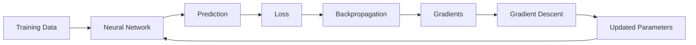

---

# 🧠 What Is Optimization?

A neural network contains parameters such as:

- Weights
- Biases

Let all model parameters be represented by:

\[
\theta
\]

The training objective is to find parameters that minimize the loss:

\[
\theta^*
=
\arg\min_{\theta}J(\theta)
\]

where:

- \(\theta\) = model parameters
- \(J(\theta)\) = objective / loss
- \(\theta^*\) = optimal parameters

Conceptually:

```text
Parameters
    ↓
Model
    ↓
Predictions
    ↓
Loss
    ↓
Optimization
    ↓
Better Parameters
```

---

# 📉 Gradient Descent Intuition

Imagine standing on a mountain and trying to reach the lowest point.

You can look at the slope around you.

The gradient tells you the direction of steepest increase.

Therefore, moving in the opposite direction takes you toward lower values.

```text
Loss
 │
 │          *
 │        *   *
 │      *       *
 │    *           *
 │  *               *
 │ *                 *
 │____________________________
             ↓
          Minimum
```

Gradient Descent repeatedly moves the parameters toward lower loss.

---

# 🧮 Gradient Descent Update Rule

The fundamental update rule is:

\[
\theta
\leftarrow
\theta-\eta\nabla_{\theta}J(\theta)
\]

where:

- \(\theta\) = model parameters
- \(\eta\) = learning rate
- \(\nabla_{\theta}J(\theta)\) = gradient of the loss with respect to parameters

The minus sign is important because the gradient points toward increasing loss.

Therefore, we move in the opposite direction.

---

# 🔄 Gradient Descent Step

A single optimization step looks like:

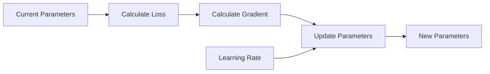

The cycle repeats until the model reaches a useful solution.

---

# 🧠 One-Parameter Example

Suppose:

\[
w=5
\]

and:

\[
\frac{\partial L}{\partial w}=2
\]

with learning rate:

\[
\eta=0.1
\]

The update is:

\[
w_{new}
=
w-\eta\frac{\partial L}{\partial w}
\]

Therefore:

\[
w_{new}
=
5-(0.1)(2)
\]

\[
w_{new}=4.8
\]

The weight moves from:

```text
5.0 → 4.8
```

because the gradient was positive.

---

# 🧮 Negative Gradient Example

Suppose:

\[
w=5
\]

and:

\[
\frac{\partial L}{\partial w}=-3
\]

with:

\[
\eta=0.1
\]

Then:

\[
w_{new}
=
5-(0.1)(-3)
\]

\[
w_{new}=5.3
\]

The parameter increases because the gradient is negative.

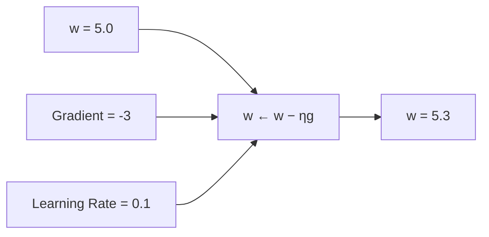

---

# 🎚️ Learning Rate

The learning rate controls how large each parameter update is.

It is commonly represented as:

\[
\eta
\]

A very small learning rate produces small updates.

A very large learning rate produces large updates.

```text
Small Learning Rate
        ↓
Small Steps
        ↓
Slow Training

Large Learning Rate
        ↓
Large Steps
        ↓
Potential Instability
```

---

# 📊 Learning Rate Intuition

```text
Loss
 │
 │       \       /
 │        \     /
 │         \___/
 │
 └────────────────────────> Steps

Too Large:
    * → * → * → *
    May overshoot

Good:
    * → * → * → minimum

Too Small:
    * → * → * → * → * ...
    Very slow
```

---

# ⚠ Learning Rate Too Small

If the learning rate is too small:

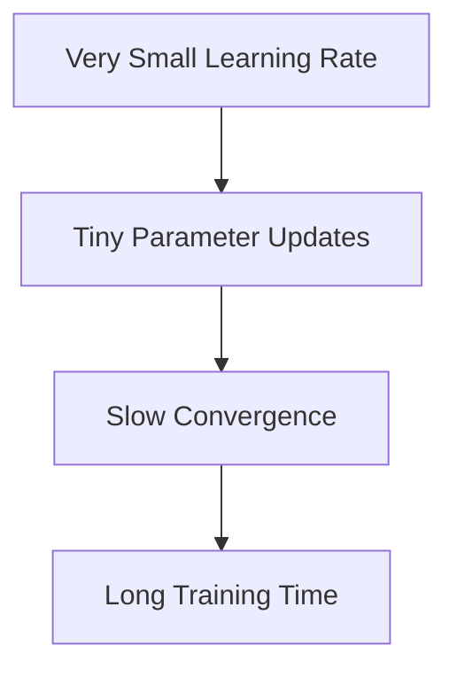

The model may eventually converge, but training can become unnecessarily expensive.

---

# ⚠ Learning Rate Too Large

If the learning rate is too large:

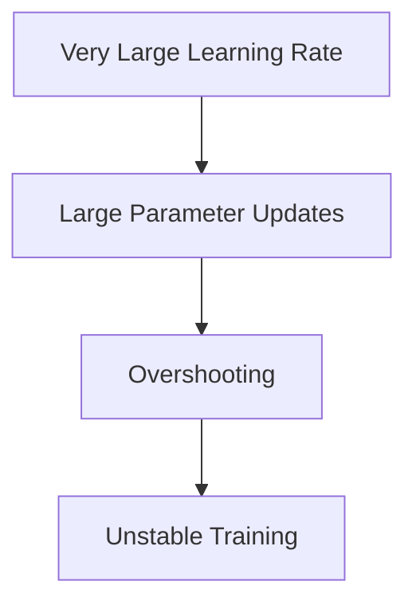

The model may oscillate around the minimum or diverge completely.

---

# 🎯 Choosing a Learning Rate

Learning-rate selection is one of the most important training decisions.

Typical values depend on:

- Model architecture
- Optimizer
- Batch size
- Dataset
- Normalization
- Parameter scale
- Training strategy

There is no universal best learning rate.

The correct value should be determined experimentally.

---

# 🧠 Batch Gradient Descent

Batch Gradient Descent calculates the gradient using the **entire training dataset**.

Suppose the training set contains \(N\) samples.

The objective is:

\[
J(\theta)
=
\frac{1}{N}
\sum_{i=1}^{N}
L_i(\theta)
\]

The gradient is:

\[
\nabla_\theta J(\theta)
=
\frac{1}{N}
\sum_{i=1}^{N}
\nabla_\theta L_i(\theta)
\]

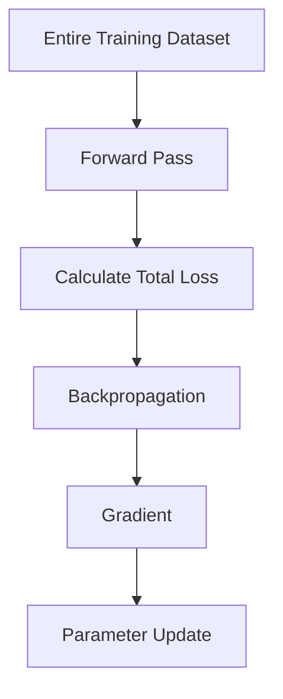

Only after processing the entire dataset is one parameter update performed.

---

# 🐌 Limitations of Batch Gradient Descent

For very large datasets, Batch Gradient Descent can be expensive.

Suppose a dataset contains:

```text
10,000,000 samples
```

A single update may require processing all 10 million samples.

This can result in:

- High memory requirements
- Long computation time per update
- Poor hardware utilization in some scenarios
- Slow parameter-update frequency

This motivates Stochastic and Mini-Batch Gradient Descent.

---

# ⚡ Stochastic Gradient Descent

Stochastic Gradient Descent uses one training example at a time.

Instead of:

\[
\frac{1}{N}
\sum_{i=1}^{N}
\nabla L_i
\]

it uses:

\[
\nabla L_i
\]

for a single sample.

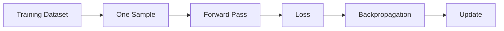

The model can update parameters after every training example.

---

# 📊 SGD Characteristics

Advantages:

- Frequent parameter updates
- Low memory requirement
- Can escape some shallow local structures due to noisy gradients
- Useful for very large datasets

Disadvantages:

- High gradient variance
- Noisy training trajectory
- Loss may fluctuate
- Hardware utilization can be inefficient compared with vectorized mini-batches

---

# 📦 Mini-Batch Gradient Descent

Mini-Batch Gradient Descent is the standard approach for most modern Deep Learning workloads.

Instead of using:

```text
Entire Dataset
```

or:

```text
One Sample
```

we use:

```text
Small Batch
```

For a mini-batch \(B\):

\[
J_B(\theta)
=
\frac{1}{|B|}
\sum_{i\in B}
L_i(\theta)
\]

and:

\[
\nabla_\theta J_B
=
\frac{1}{|B|}
\sum_{i\in B}
\nabla_\theta L_i
\]

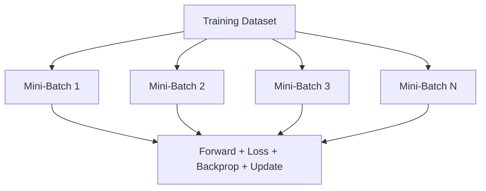

---

# 🧠 Why Mini-Batches Are So Important

Mini-batches provide a useful balance between:

```text
Batch Gradient Descent
        │
        │ Large stable gradients
        │
        ▼
Mini-Batch Gradient Descent
        │
        │ Balance
        │
        ▼
Stochastic Gradient Descent
        │
        │ Highly noisy gradients
        ▼
```

Mini-batches allow:

- Efficient matrix operations
- GPU parallelism
- Frequent parameter updates
- Lower memory usage than full-batch training
- More stable gradients than pure SGD

---

# 📊 Batch vs SGD vs Mini-Batch

| Property | Batch GD | SGD | Mini-Batch GD |
|---|---|---|---|
| Samples per Update | Entire dataset | 1 | Small batch |
| Gradient Stability | High | Low | Medium/High |
| Memory Usage | High | Low | Medium |
| Update Frequency | Low | Very High | High |
| GPU Efficiency | Can be inefficient | Often poor | Excellent |
| Training Noise | Low | High | Moderate |
| Modern DL Usage | Limited | Sometimes | Standard |

---

# 📦 Batch Size

Batch size represents the number of samples processed before one parameter update.

Examples:

```text
Batch Size = 16
Batch Size = 32
Batch Size = 64
Batch Size = 128
Batch Size = 256
```

There is no universally optimal batch size.

It depends on:

- GPU memory
- Model size
- Dataset size
- Training objective
- Hardware
- Learning rate
- Generalization behavior

---

# 🔢 Epochs, Batches, and Iterations

These terms are essential.

### Epoch

One complete pass through the training dataset.

### Batch

A subset of training examples processed together.

### Iteration / Step

One parameter update.

---

# 🧮 Number of Steps per Epoch

If:

\[
N=\text{number of training samples}
\]

and:

\[
B=\text{batch size}
\]

then approximately:

\[
StepsPerEpoch
=
\left\lceil
\frac{N}{B}
\right\rceil
\]

For:

```text
Training Samples = 10,000
Batch Size       = 100
```

we get:

\[
StepsPerEpoch=100
\]

---

# 🧮 Total Training Steps

If:

\[
E=\text{number of epochs}
\]

then approximately:

\[
TotalSteps
=
E
\times
StepsPerEpoch
\]

For:

```text
Samples = 10,000
Batch Size = 100
Epochs = 20
```

we have:

\[
StepsPerEpoch=100
\]

and:

\[
TotalSteps=20\times100
\]

\[
TotalSteps=2000
\]

---

# 🔄 Training Timeline

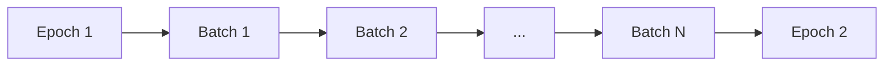

Each batch generally performs:

```text
Forward
   ↓
Loss
   ↓
Backward
   ↓
Update
```

---

# 🧠 Mini-Batch Gradient Descent Mathematics

Suppose the mini-batch contains \(m\) samples.

The average gradient is:

\[
g
=
\frac{1}{m}
\sum_{i=1}^{m}
\nabla_\theta L_i
\]

The parameter update becomes:

\[
\theta
\leftarrow
\theta-\eta g
\]

This is the mathematical foundation of mini-batch training.

---

# 📈 Gradient Noise

Because a mini-batch represents only part of the dataset, its gradient is an estimate of the full-dataset gradient.

Therefore:

```text
Full Dataset
     ↓
More Accurate Gradient

Mini-Batch
     ↓
Approximate Gradient

Single Sample
     ↓
Noisy Gradient
```

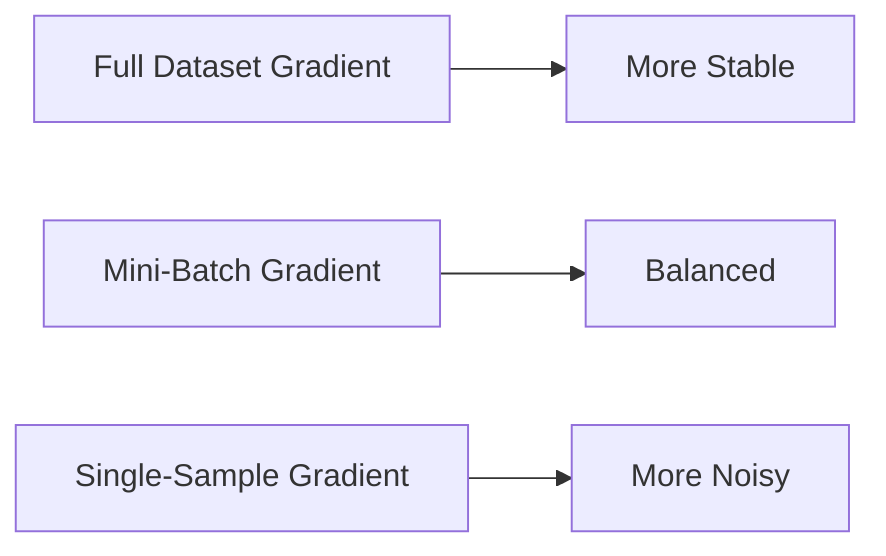

This noise is not necessarily bad.

Some degree of stochasticity can help optimization explore the loss landscape.

---

# 🎯 Batch Size and Generalization

Batch size can influence more than computational efficiency.

It can affect:

- Gradient noise
- Training dynamics
- Convergence
- Generalization
- Memory consumption
- Hardware utilization

However, there is no universal rule such as:

```text
Small batch = always better
```

or:

```text
Large batch = always better
```

The optimal choice depends on the model and workload.

---

# ⚡ GPU and Mini-Batch Training

Modern GPUs are highly effective at parallel numerical operations.

Instead of processing:

```text
Sample 1
Sample 2
Sample 3
...
```

individually, a batch can be processed as a matrix or tensor.

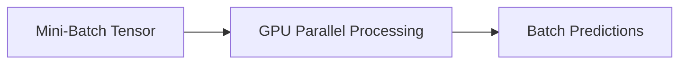

This is one of the major reasons mini-batch training is standard in modern Deep Learning.

---

# 🧮 Vectorized Mini-Batch Computation

Suppose:

\[
X\in\mathbb{R}^{B\times D}
\]

where:

- \(B\) = batch size
- \(D\) = number of input features

For a layer:

\[
Z=XW+b
\]

The entire batch can be processed in a single matrix operation.

```text
Individual Processing:

x₁ → model
x₂ → model
x₃ → model
...

Vectorized:

[X₁
 X₂
 X₃
 ...]
     ↓
   Model
     ↓
[ŷ₁
 ŷ₂
 ŷ₃
 ...]
```

This provides much better computational efficiency.

---

# 🧪 Manual Mini-Batch Training in Python

A simple linear regression example:

```python
import numpy as np


np.random.seed(42)

X = np.random.randn(1000, 1)

y = 3 * X + 2 + 0.1 * np.random.randn(1000, 1)

w = np.zeros((1, 1))
b = 0.0

learning_rate = 0.01
batch_size = 32
epochs = 20


for epoch in range(epochs):

    indices = np.random.permutation(len(X))

    X_shuffled = X[indices]
    y_shuffled = y[indices]

    for start in range(0, len(X), batch_size):

        end = start + batch_size

        X_batch = X_shuffled[start:end]
        y_batch = y_shuffled[start:end]

        # Forward pass
        predictions = X_batch @ w + b

        # Error
        error = predictions - y_batch

        # Loss
        loss = np.mean(error ** 2)

        # Gradients
        dw = (
            2
            / len(X_batch)
            * X_batch.T
            @ error
        )

        db = (
            2
            * np.mean(error)
        )

        # Parameter update
        w -= learning_rate * dw
        b -= learning_rate * db

    print(
        f"Epoch {epoch + 1}: "
        f"Loss={loss:.4f}"
    )
```

This demonstrates the basic mini-batch optimization loop without using a Deep Learning framework.

---

# 🧠 Mini-Batch Training Flow

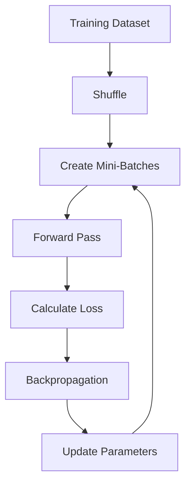

After all batches are processed, one epoch is complete.

---

# 🐍 Mini-Batch Training with Keras

Keras supports mini-batch training through the `batch_size` parameter.

```python
model.fit(
    X_train,
    y_train,
    epochs=20,
    batch_size=32,
    validation_data=(
        X_val,
        y_val
    )
)
```

Here:

```text
batch_size = 32
```

means that approximately 32 training examples are processed before each parameter update.

---

# 🐍 Keras Dataset Pipeline

For larger datasets, `tf.data` can be used.

```python
import tensorflow as tf


train_dataset = (
    tf.data.Dataset
    .from_tensor_slices(
        (X_train, y_train)
    )
    .shuffle(10000)
    .batch(32)
    .prefetch(
        tf.data.AUTOTUNE
    )
)
```

This separates the data pipeline from the model training logic.

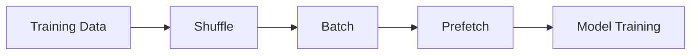

---

# 🐍 PyTorch Mini-Batch Training

PyTorch commonly uses `DataLoader`.

```python
from torch.utils.data import DataLoader


train_loader = DataLoader(
    train_dataset,
    batch_size=32,
    shuffle=True
)
```

A training loop then processes one batch at a time.

```python
for X_batch, y_batch in train_loader:

    optimizer.zero_grad()

    predictions = model(X_batch)

    loss = criterion(
        predictions,
        y_batch
    )

    loss.backward()

    optimizer.step()
```

---

# 🔄 PyTorch Training Lifecycle

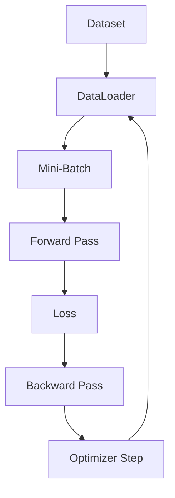

---

# 🧠 Gradient Accumulation

Sometimes the desired effective batch size is larger than GPU memory allows.

For example:

```text
GPU can process:
Batch = 32

Desired effective batch:
Batch = 128
```

Gradient accumulation can process four batches before performing one parameter update.

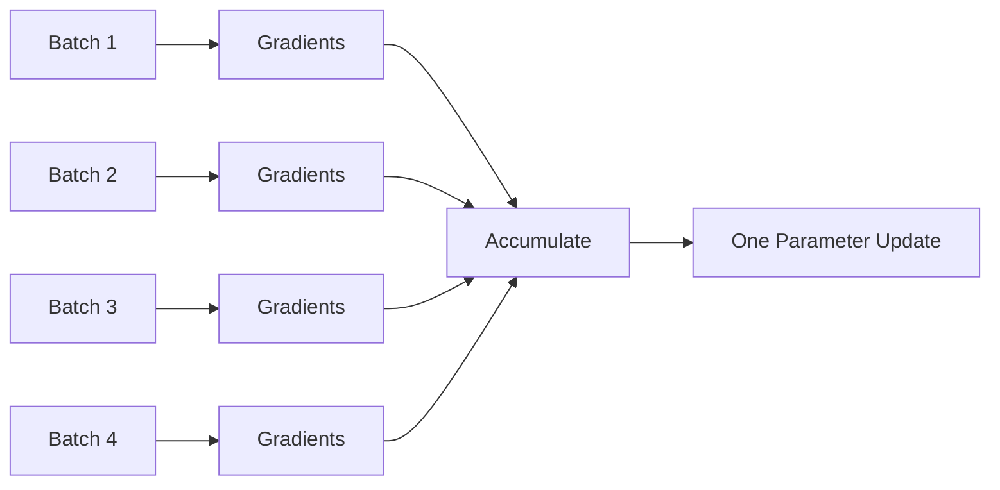

Conceptually:

```text
Batch 1 → accumulate
Batch 2 → accumulate
Batch 3 → accumulate
Batch 4 → accumulate
              ↓
        Parameter Update
```

This is useful when GPU memory limits the physical batch size.

---

# ⚠ Gradient Accumulation Considerations

Gradient accumulation can be useful, but it is not identical to simply increasing the batch size in every possible situation.

Differences can arise from:

- Batch Normalization behavior
- Optimizer state updates
- Learning-rate scheduling
- Gradient scaling
- Regularization
- Mixed precision

Therefore, large effective batch sizes should be validated experimentally.

---

# 📈 Convergence

Training loss often decreases over time.

A simplified curve may look like:

```text
Loss
 │
 │\
 │ \
 │  \
 │   \
 │    \__
 │       \___
 │           \____
 └────────────────────> Training Steps
```

Initially, the model may improve quickly.

Later, improvements often become smaller.

---

# ⚠ Training Instability

A problematic loss curve may look like:

```text
Loss
 │
 │ \  /\/\ /\
 │  \/    /
 │ / \  /  \
 │/   \/    \
 └────────────────────> Steps
```

Possible causes include:

- Learning rate too large
- Poor initialization
- Exploding gradients
- Incorrect preprocessing
- Poorly scaled inputs
- Numerical instability
- Inappropriate batch size

---

# 🧠 Loss Landscape

Neural networks often have complex high-dimensional loss surfaces.

```text
Loss
 │
 │      /\       /\
 │     /  \_____/  \
 │____/             \____
 │
 └──────────────────────────> Parameters
```

In reality, neural networks have millions or billions of parameters, so the true landscape cannot be visualized directly in two dimensions.

Important structures include:

- Local minima
- Saddle points
- Plateaus
- Steep regions
- Flat regions

---

# 🧠 Local Minima

A local minimum is a point that is lower than nearby points.

```text
Loss
 │
 │       \       /
 │        \_____/
 │
 └────────────────────> Parameter
```

However, the global minimum may exist elsewhere.

Modern Deep Learning optimization is more complex than simply finding a single perfect global minimum.

---

# 🧠 Saddle Points

A saddle point can behave like a minimum in one direction and a maximum in another.

Conceptually:

```text
        \       /
         \     /
          \___/
          /   \
         /     \
```

Saddle points can create regions with very small gradients.

This can slow optimization.

---

# 🧠 Plateaus

A plateau is a region where the loss changes very slowly.

```text
Loss
 │
 │
 │        __________
 │_______/
 │
 └────────────────────> Parameter
```

The gradients can be small, resulting in slow progress.

---

# 🎚️ Learning Rate Schedules

A fixed learning rate is not always optimal throughout training.

A learning-rate schedule changes the learning rate over time.

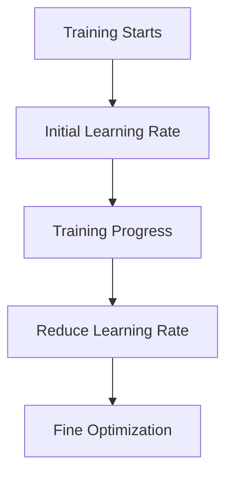

Common strategies include:

- Step decay
- Exponential decay
- Cosine decay
- Warmup
- Reduce-on-plateau

Advanced optimization techniques are covered in:

**[11. Advanced Optimization Techniques](11-advanced-optimization-techniques.md)**

---

# 🧠 Learning Rate vs Batch Size

Batch size and learning rate interact.

Increasing batch size can change:

- Gradient noise
- Throughput
- Memory usage
- Convergence behavior
- Generalization

Therefore, changing batch size may require reconsidering the learning rate.

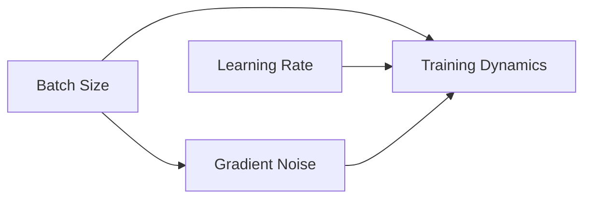

There is no universal scaling rule that works perfectly for every architecture and training setup.

---

# 🏢 Enterprise Perspective

In production Deep Learning environments, Gradient Descent is only one part of the training system.

Production training must consider:

- Dataset size
- Batch size
- GPU memory
- GPU utilization
- Data loading throughput
- Learning-rate configuration
- Distributed training
- Mixed precision
- Checkpointing
- Training duration
- Experiment tracking
- Reproducibility
- Cost

A well-designed training pipeline attempts to keep the accelerator continuously supplied with data.

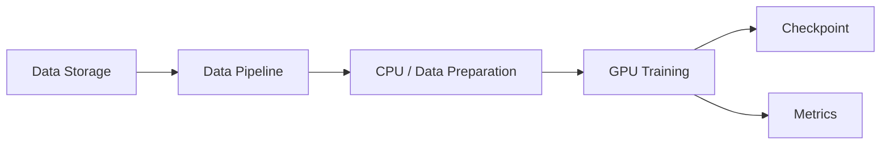

---

!!! tip "Production Insight"

    In modern Deep Learning systems, training performance is not determined only by the model.

    A slow data pipeline can leave expensive GPUs idle.

    A production training pipeline should therefore optimize the complete path:

    ```text
    Storage
       ↓
    Data Loading
       ↓
    Preprocessing
       ↓
    Batching
       ↓
    GPU Transfer
       ↓
    Forward Pass
       ↓
    Backpropagation
       ↓
    Parameter Update
    ```

    Mini-batch training provides the foundation for efficiently executing this pipeline at scale.

---

!!! note "Important Distinction"

    Remember the difference between:

    ```text
    Batch
    ↓
    Number of samples processed together

    Iteration / Step
    ↓
    One parameter update

    Epoch
    ↓
    One complete pass through the training dataset
    ```

    For example:

    ```text
    10,000 samples
    Batch size = 100

    ≈ 100 steps per epoch

    20 epochs

    ≈ 2,000 training steps
    ```

---

# ⚠ Common Mistakes

Avoid these common mistakes:

- Using a learning rate that is too large
- Using a learning rate that is unnecessarily small
- Confusing batch size with epoch count
- Confusing an iteration with an epoch
- Using the entire dataset for every update when mini-batch training is more appropriate
- Using batch size without considering GPU memory
- Ignoring data-loading bottlenecks
- Forgetting to shuffle training data when appropriate
- Changing batch size without reconsidering training dynamics
- Assuming a larger batch size always improves training
- Assuming a smaller batch size always improves generalization
- Ignoring gradient accumulation when GPU memory is limited
- Ignoring learning-rate scheduling
- Interpreting noisy mini-batch loss as necessarily problematic
- Evaluating optimization only using training loss
- Ignoring validation performance

---

# 🧪 Practical Exercise 1 — Manual Gradient Descent

Consider the function:

\[
J(w)=(w-3)^2
\]

The derivative is:

\[
\frac{dJ}{dw}=2(w-3)
\]

Start with:

\[
w=0
\]

and use:

\[
\eta=0.1
\]

Perform several Gradient Descent steps manually.

The optimization process is:

```text
w₀
 ↓
Calculate Gradient
 ↓
Update w
 ↓
Calculate Gradient
 ↓
Update w
 ↓
...
```

The parameter should gradually approach:

\[
w=3
\]

---

# 🧪 Practical Exercise 2 — Mini-Batch Regression

Build a simple regression model using NumPy.

Requirements:

1. Generate synthetic data
2. Create training and validation datasets
3. Shuffle the training data
4. Divide data into mini-batches
5. Perform a forward pass
6. Calculate MSE
7. Calculate gradients
8. Update parameters
9. Track training loss
10. Plot the loss curve

Expected flow:

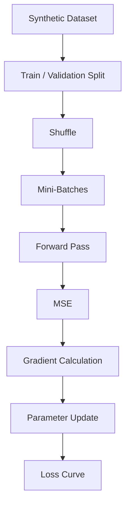

---

# 🧠 Interview Questions

## Beginner

### 1. What is Gradient Descent?

Gradient Descent is an optimization algorithm that updates model parameters in the direction that reduces the loss.

### 2. What is the Gradient Descent update rule?

\[
\theta
\leftarrow
\theta-\eta\nabla_\theta J(\theta)
\]

### 3. What is the learning rate?

The learning rate controls the size of parameter updates.

### 4. What is a batch?

A batch is a subset of training samples processed together before a parameter update.

### 5. What is an epoch?

An epoch is one complete pass through the training dataset.

---

## Intermediate

### 6. What is the difference between Batch Gradient Descent and SGD?

Batch Gradient Descent calculates gradients using the entire dataset, while SGD calculates the gradient using one sample at a time.

### 7. What is Mini-Batch Gradient Descent?

It calculates gradients using a small subset of the training dataset before updating parameters.

### 8. Why is Mini-Batch Gradient Descent commonly used?

It provides a balance between computational efficiency, memory usage, gradient stability, and GPU parallelism.

### 9. What happens if the learning rate is too large?

The optimizer may overshoot good regions of the loss surface, causing oscillation or divergence.

### 10. What happens if the learning rate is too small?

Training can become unnecessarily slow and may require many iterations to converge.

### 11. Why does batch size matter?

Batch size affects memory usage, gradient noise, GPU utilization, convergence behavior, and potentially generalization.

---

## Advanced

### 12. Why can mini-batch gradients be noisy?

Because they are estimates based on a subset of the complete dataset rather than the entire dataset.

### 13. Why can gradient noise sometimes be useful?

It can help optimization explore complex loss landscapes and avoid becoming trapped in certain problematic regions.

### 14. How does batch size affect GPU performance?

Larger batches can provide more parallel work for GPUs, but excessively large batches can exceed memory limits or reduce optimization efficiency.

### 15. What is gradient accumulation?

Gradient accumulation combines gradients from multiple smaller batches before performing a parameter update, effectively increasing the batch size without requiring all samples to fit in memory simultaneously.

### 16. Why can changing batch size require changing the learning rate?

Because batch size changes gradient noise and the statistical characteristics of each parameter update.

### 17. What is the relationship between backpropagation and Gradient Descent?

Backpropagation computes the gradients; Gradient Descent uses those gradients to update the model parameters.

### 18. Why is Mini-Batch Gradient Descent preferred for large Deep Learning models?

It enables vectorized computation, efficient GPU utilization, manageable memory usage, and frequent parameter updates.

---

# 📌 Key Takeaways

- Gradient Descent is a fundamental optimization algorithm for Deep Learning.
- The gradient indicates the direction of increasing loss.
- Gradient Descent moves in the opposite direction.
- The learning rate controls the size of parameter updates.
- A learning rate that is too large can cause unstable training.
- A learning rate that is too small can cause very slow convergence.
- Batch Gradient Descent uses the entire training dataset for each update.
- Stochastic Gradient Descent uses one sample for each update.
- Mini-Batch Gradient Descent uses a small subset of samples for each update.
- Mini-Batch training is the standard approach for many modern Deep Learning workloads.
- Batch size affects memory usage, GPU utilization, gradient noise, and training dynamics.
- An epoch represents one complete pass through the training dataset.
- An iteration or step generally represents one parameter update.
- Mini-batch gradients are estimates of the full-dataset gradient.
- Gradient noise can sometimes help optimization.
- GPUs benefit from vectorized mini-batch operations.
- Gradient accumulation can simulate larger effective batch sizes when GPU memory is limited.
- Learning-rate schedules can improve optimization during later stages of training.
- Backpropagation calculates gradients; the optimizer uses those gradients to update parameters.
- Production training requires attention to data pipelines, GPU utilization, memory, checkpoints, metrics, reproducibility, and cost.

---

# 📚 Further Reading

Continue with:

- **[09. Weight Initialization and Gradient Stability](09-weight-initialization-and-gradient-stability.md)**
- **[10. Regularization and Generalization](10-regularization-and-generalization.md)**
- **[11. Advanced Optimization Techniques](11-advanced-optimization-techniques.md)**
- **[12. Hyperparameter Tuning and Training Strategies](12-hyperparameter-tuning-and-training-strategies.md)**

The next chapter focuses on how neural networks initialize their parameters and how initialization affects gradient stability and training convergence.

---

## ➡️ Next Chapter

**[09. Weight Initialization and Gradient Stability](09-weight-initialization-and-gradient-stability.md)**

---

> **Enterprise AI Engineering Handbook**  
> *Building Production-Grade Enterprise AI Systems — One Chapter at a Time.*