# 09. Weight Initialization and Gradient Stability

> Understand how neural networks initialize their parameters, why initialization matters for successful training, and how poor initialization can lead to vanishing gradients, exploding gradients, unstable activations, and slow convergence.

---

## 🎯 Learning Objectives

After completing this chapter, you will be able to:

- Understand why neural networks require weight initialization
- Explain why weights should not normally start with identical values
- Understand the problems with zero initialization
- Understand random initialization
- Explain the importance of initialization scale
- Understand how initialization affects forward activations
- Understand how initialization affects backward gradients
- Explain vanishing gradients
- Explain exploding gradients
- Understand Xavier / Glorot initialization
- Understand He initialization
- Understand LeCun initialization
- Understand the relationship between initialization and activation functions
- Understand initialization for ReLU networks
- Understand initialization for Sigmoid and Tanh networks
- Understand fan-in and fan-out
- Understand variance preservation
- Understand gradient flow through deep networks
- Implement common initialization strategies using NumPy
- Configure initialization strategies in Keras
- Configure initialization strategies in PyTorch
- Diagnose poor initialization using activation and gradient statistics
- Understand the relationship between initialization, normalization, and residual connections
- Understand initialization from a production Deep Learning perspective

---

## 📖 Overview

A neural network begins training with a set of parameters.

These parameters include:

- Weights
- Biases

Before training begins, the model must assign initial values to these parameters.

This process is called **weight initialization**.

Initialization may appear to be a small implementation detail, but it can have a major impact on whether a deep neural network:

- Learns efficiently
- Converges quickly
- Maintains stable activations
- Maintains stable gradients
- Becomes numerically unstable
- Gets stuck during training

The central idea is:

> **Good initialization helps information and gradients flow through the network without becoming excessively large or small.**

---

# 🧠 Why Do Neural Networks Need Initialization?

Consider a layer:

\[
z=Wx+b
\]

Before training:

```text
W = ?
b = ?
```

The network needs initial values for these parameters.

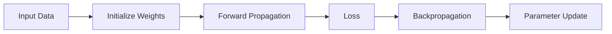

The optimizer can only update parameters after gradients have been calculated.

Therefore:

```text
Initialization
      ↓
Forward Pass
      ↓
Loss
      ↓
Backpropagation
      ↓
Gradients
      ↓
Optimization
```

---

# ⚠ Why Not Initialize Every Weight to Zero?

Suppose all weights in a neural network are initialized as:

```text
w₁ = 0
w₂ = 0
w₃ = 0
...
```

At first this may seem reasonable.

However, identical initialization creates a **symmetry problem**.

Consider two neurons in the same hidden layer:

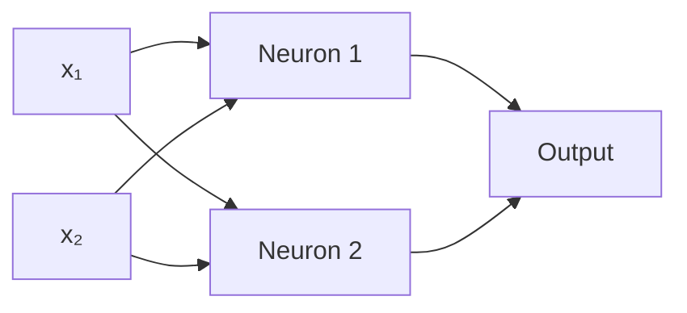

If both neurons start with identical weights and biases, they receive the same inputs and produce the same outputs.

Their gradients can also remain identical.

Therefore:

```text
Neuron 1
   ↓
Same computation
   ↓
Same gradient
   ↓
Same update

Neuron 2
   ↓
Same computation
   ↓
Same gradient
   ↓
Same update
```

The neurons fail to learn different features.

---

# 🧠 Symmetry Breaking

Random initialization breaks this symmetry.

Instead of:

```text
Neuron 1:
[0.0, 0.0, 0.0]

Neuron 2:
[0.0, 0.0, 0.0]
```

we might have:

```text
Neuron 1:
[ 0.12, -0.08,  0.04]

Neuron 2:
[-0.03,  0.15, -0.11]
```

Now the neurons begin from different states and can learn different representations.

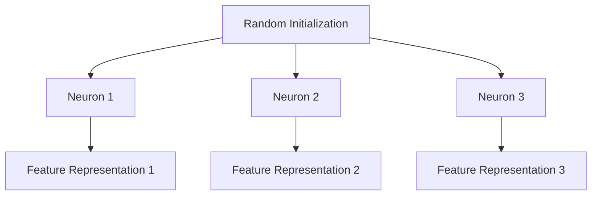

---

# ⚠ Zero Initialization Is Not Always Bad

There is an important distinction.

For many standard neural networks:

```text
Weights → Randomly Initialized
Biases  → Often Zero Initialized
```

Zero-initializing biases is generally fine.

The major problem is initializing all weights identically.

Therefore:

> **The symmetry-breaking requirement primarily applies to weights, not necessarily biases.**

---

# 🎲 Random Initialization

A simple approach is to initialize weights using random values.

For example:

```python
import numpy as np


weights = np.random.randn(
    3,
    4
)

print(weights)
```

However, blindly choosing random values is not sufficient.

The **scale** of the random values matters.

---

# ⚠ Why Initialization Scale Matters

Suppose the weights are extremely large.

Then:

\[
z=Wx+b
\]

can become very large.

This may cause:

```text
Large Weights
     ↓
Large Activations
     ↓
Large Gradients
     ↓
Exploding Training
```

Conversely, if weights are extremely small:

```text
Tiny Weights
     ↓
Tiny Activations
     ↓
Tiny Gradients
     ↓
Vanishing Training Signal
```

Therefore:

> **Initialization should provide a reasonable starting scale for activations and gradients.**

---

# 🔬 Forward Signal Propagation

Consider a deep network:

```text
Input
  ↓
Layer 1
  ↓
Layer 2
  ↓
Layer 3
  ↓
Layer 4
  ↓
Layer 5
  ↓
Output
```

Each layer transforms the signal.

If the variance of activations changes dramatically at each layer, the signal may become unstable.

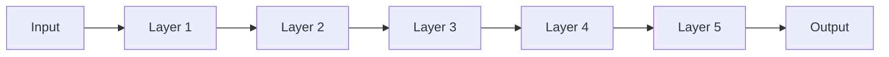

We ideally want the scale of activations to remain reasonably controlled.

---

# 🧠 Backward Gradient Propagation

The same problem occurs in the backward direction.

Gradients propagate through layers using the Chain Rule.

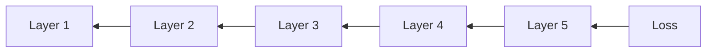

If gradients repeatedly become smaller:

```text
Gradient
   ↓
0.1 ×
   ↓
0.01 ×
   ↓
0.001 ×
   ↓
≈ 0
```

we have a vanishing-gradient problem.

If gradients repeatedly become larger:

```text
Gradient
   ↓
2 ×
   ↓
4 ×
   ↓
8 ×
   ↓
16 ×
```

we have an exploding-gradient problem.

---

# 📉 Vanishing Gradients

Vanishing gradients occur when gradients become extremely small as they propagate backward through the network.

Conceptually:

```text
Output Layer
Gradient = 1.0
     ↓
Layer 5 = 0.2
     ↓
Layer 4 = 0.04
     ↓
Layer 3 = 0.008
     ↓
Layer 2 = 0.0016
     ↓
Layer 1 = 0.00032
```

The earlier layers receive a very weak learning signal.


---

# ⚠ Consequences of Vanishing Gradients

Vanishing gradients can cause:

- Very slow learning
- Earlier layers learning poorly
- Difficulty training deep networks
- Saturation of certain activation functions
- Poor representation learning

Historically, this was particularly problematic for deep networks using Sigmoid or Tanh activations.

---

# 📈 Exploding Gradients

Exploding gradients occur when gradients become excessively large.

For example:

```text
1
 ↓ × 2
2
 ↓ × 2
4
 ↓ × 2
8
 ↓ × 2
16
 ↓ × 2
32
```

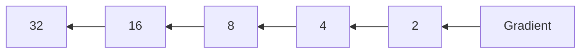

---

# ⚠ Consequences of Exploding Gradients

Exploding gradients can result in:

- Extremely large parameter updates
- Unstable loss
- Training divergence
- NaN values
- Infinite values
- Numerical overflow

A typical training curve may look like:

```text
Loss
 │
 │        /
 │       /
 │      /
 │     /
 │____/
 │
 └──────────────────> Training Steps
```

---

# 🧮 Why Initialization Affects Gradient Stability

Suppose a network contains repeated transformations:

\[
z^{(l)}
=
W^{(l)}a^{(l-1)}
\]

During backpropagation, gradients contain products involving weights and activation derivatives.

Conceptually:

\[
\frac{\partial L}{\partial W^{(1)}}
\sim
\prod_l
W^{(l)}
f'(\cdot)
\]

If these factors are generally:

\[
<1
\]

the gradient can shrink.

If they are generally:

\[
>1
\]

the gradient can grow.

Therefore initialization needs to keep the scale of these values under control.

---

# 🧠 Variance Preservation

One major idea behind modern initialization techniques is **variance preservation**.

We want:

```text
Variance of Input
       ↓
Layer
       ↓
Variance of Output
```

to remain reasonably stable.

If variance keeps shrinking:

```text
1.0
 ↓
0.5
 ↓
0.25
 ↓
0.125
 ↓
...
```

the signal disappears.

If variance keeps growing:

```text
1
 ↓
2
 ↓
4
 ↓
8
 ↓
...
```

the signal becomes unstable.

---

# 🧮 Fan-In and Fan-Out

Initialization strategies often depend on the number of connections entering and leaving a layer.

### Fan-In

Number of input connections to a neuron.

### Fan-Out

Number of output connections from a neuron.

For a dense layer:

```text
Input Features
      ↓
   Neuron
      ↓
Output
```

If a layer has:

```text
100 input neurons
50 output neurons
```

then approximately:

```text
Fan-In  = 100
Fan-Out = 50
```

These quantities are used by initialization algorithms to determine appropriate weight variance.

---

# 🧠 Xavier / Glorot Initialization

Xavier Initialization, also called Glorot Initialization, was designed to maintain a reasonable variance of activations and gradients.

A commonly used variance formulation is:

\[
Var(W)
=
\frac{2}{fan_{in}+fan_{out}}
\]

The corresponding standard deviation is:

\[
\sigma
=
\sqrt{
\frac{2}
{fan_{in}+fan_{out}}
}
\]


Xavier initialization is particularly associated with symmetric activations such as:

- Tanh
- Sigmoid

and is also useful in many other architectures depending on the surrounding design.

---

# 🎯 Xavier Uniform Initialization

A common Xavier uniform distribution uses:

\[
W
\sim
U(-a,a)
\]

where:

\[
a
=
\sqrt{
\frac{6}
{fan_{in}+fan_{out}}
}
\]

This provides a controlled range for the initial weights.

---

# 🧠 Xavier Normal Initialization

Xavier Normal initialization samples weights from:

\[
W
\sim
\mathcal{N}
\left(
0,
\frac{2}
{fan_{in}+fan_{out}}
\right)
\]

Conceptually:

```text
Mean ≈ 0
Variance controlled by fan-in and fan-out
```

---

# 🔥 He Initialization

He Initialization was designed primarily for networks using ReLU-like activations.

A common variance formulation is:

\[
Var(W)
=
\frac{2}{fan_{in}}
\]

The corresponding standard deviation is:

\[
\sigma
=
\sqrt{
\frac{2}{fan_{in}}
}
\]


This accounts for the behavior of ReLU, where approximately half of a symmetric input distribution may be mapped to zero.

---

# 🔥 Why He Initialization Works Well with ReLU

Consider:

\[
ReLU(x)=\max(0,x)
\]

Approximately half of a symmetric distribution may produce negative values.

Those values become:

\[
0
\]

Therefore, the initialization needs to compensate for the change in activation variance.

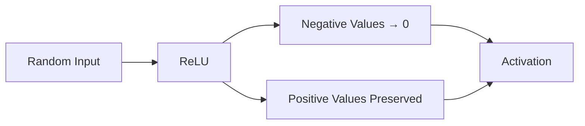

He initialization is designed to maintain a more appropriate signal scale under this behavior.

---

# 🧠 LeCun Initialization

LeCun Initialization uses a variance related to fan-in:

\[
Var(W)
=
\frac{1}{fan_{in}}
\]

It is commonly associated with activations such as SELU.

The key idea is again variance control.

```text
fan-in
  ↓
Initialization Scale
  ↓
Activation Variance
  ↓
Gradient Stability
```

---

# 📊 Initialization Comparison

| Initialization | Typical Variance | Common Association |
|---|---:|---|
| Zero | 0 | Not suitable for weights |
| Random Normal | User-defined | Basic experimentation |
| Xavier / Glorot | \(2/(fan_{in}+fan_{out})\) | Tanh / Sigmoid |
| He | \(2/fan_{in}\) | ReLU / ReLU-like |
| LeCun | \(1/fan_{in}\) | SELU |

The correct strategy depends on the architecture and activation function.

---

# 🧠 Activation Function and Initialization

Initialization and activation functions should be considered together.

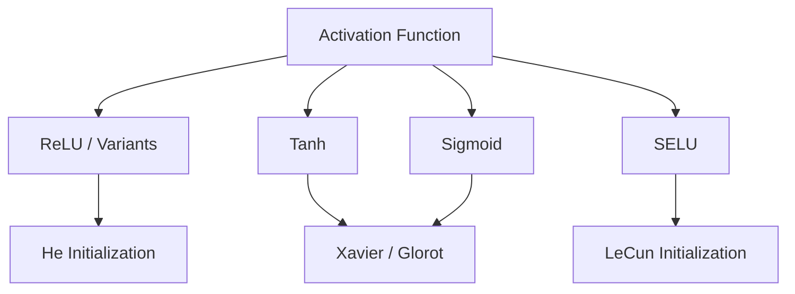

This is a guideline rather than an absolute rule.

Modern architectures may use additional techniques such as normalization and residual connections that change the practical initialization strategy.

---

# 🧪 NumPy: Compare Initialization Scales

```python
import numpy as np


fan_in = 100
fan_out = 50

# Xavier
xavier_std = np.sqrt(
    2 / (fan_in + fan_out)
)

# He
he_std = np.sqrt(
    2 / fan_in
)

# LeCun
lecun_std = np.sqrt(
    1 / fan_in
)

print("Xavier std:", xavier_std)
print("He std:", he_std)
print("LeCun std:", lecun_std)
```

---

# 🧪 NumPy: Generate Initialized Weights

```python
import numpy as np


fan_in = 100
fan_out = 50

# Xavier Normal
xavier_weights = np.random.normal(
    loc=0.0,
    scale=np.sqrt(
        2 / (fan_in + fan_out)
    ),
    size=(fan_in, fan_out)
)

# He Normal
he_weights = np.random.normal(
    loc=0.0,
    scale=np.sqrt(
        2 / fan_in
    ),
    size=(fan_in, fan_out)
)

print(
    "Xavier variance:",
    np.var(xavier_weights)
)

print(
    "He variance:",
    np.var(he_weights)
)
```

---

# 📊 Visualizing Weight Distributions

A useful experiment is to compare different initialization strategies.

```python
import numpy as np
import matplotlib.pyplot as plt


fan_in = 100
fan_out = 50

xavier = np.random.normal(
    0,
    np.sqrt(
        2 / (fan_in + fan_out)
    ),
    10000
)

he = np.random.normal(
    0,
    np.sqrt(
        2 / fan_in
    ),
    10000
)

lecun = np.random.normal(
    0,
    np.sqrt(
        1 / fan_in
    ),
    10000
)

plt.figure(figsize=(10, 6))

plt.hist(
    xavier,
    bins=50,
    alpha=0.5,
    label="Xavier"
)

plt.hist(
    he,
    bins=50,
    alpha=0.5,
    label="He"
)

plt.hist(
    lecun,
    bins=50,
    alpha=0.5,
    label="LeCun"
)

plt.xlabel("Weight Value")
plt.ylabel("Frequency")
plt.title("Weight Initialization Distributions")
plt.legend()
plt.grid(True)

plt.show()
```

---

# 🐍 Keras Initialization

Keras provides built-in initializers.

```python
from tensorflow import keras


layer = keras.layers.Dense(
    64,
    activation="relu",
    kernel_initializer="he_normal"
)
```

---

# 🔥 Keras He Initialization

```python
layer = keras.layers.Dense(
    64,
    activation="relu",
    kernel_initializer="he_normal",
    bias_initializer="zeros"
)
```

Another option:

```python
layer = keras.layers.Dense(
    64,
    activation="relu",
    kernel_initializer="he_uniform"
)
```

---

# 🧠 Keras Xavier Initialization

```python
layer = keras.layers.Dense(
    64,
    activation="tanh",
    kernel_initializer="glorot_normal"
)
```

or:

```python
layer = keras.layers.Dense(
    64,
    activation="tanh",
    kernel_initializer="glorot_uniform"
)
```

---

# 🐍 PyTorch Initialization

PyTorch provides initialization utilities through:

```python
import torch.nn.init as init
```

For example:

```python
import torch
import torch.nn as nn


layer = nn.Linear(
    100,
    50
)

init.xavier_uniform_(
    layer.weight
)

init.zeros_(
    layer.bias
)
```

---

# 🔥 PyTorch He Initialization

```python
layer = nn.Linear(
    100,
    50
)

init.kaiming_normal_(
    layer.weight,
    mode="fan_in",
    nonlinearity="relu"
)

init.zeros_(
    layer.bias
)
```

PyTorch commonly refers to He initialization as **Kaiming initialization**.

---

# 🧠 PyTorch Xavier Initialization

```python
layer = nn.Linear(
    100,
    50
)

init.xavier_uniform_(
    layer.weight
)

init.zeros_(
    layer.bias
)
```

---

# 🧪 Inspecting Initialization

It is useful to inspect the initial weights.

```python
import torch
import torch.nn as nn


layer = nn.Linear(
    100,
    50
)

print(
    "Mean:",
    layer.weight.mean().item()
)

print(
    "Std:",
    layer.weight.std().item()
)

print(
    "Min:",
    layer.weight.min().item()
)

print(
    "Max:",
    layer.weight.max().item()
)
```

This can help identify unexpected initialization behavior.

---

# 📈 Monitoring Activation Statistics

Initialization can be evaluated by monitoring activation statistics.

For example:

```python
activations = model(X)

print(
    "Mean:",
    activations.mean().item()
)

print(
    "Std:",
    activations.std().item()
)
```

During training, unusually large or tiny activation values can indicate problems.

---

# 📊 Monitoring Gradient Statistics

Similarly, gradient statistics can be inspected.

```python
for name, parameter in model.named_parameters():

    if parameter.grad is not None:

        print(
            name,
            "gradient mean:",
            parameter.grad.mean().item(),
            "gradient std:",
            parameter.grad.std().item()
        )
```

This is useful when debugging:

- Vanishing gradients
- Exploding gradients
- Dead layers
- Numerical instability

---

# 🧠 Gradient Norm

A common diagnostic is the gradient norm.

```python
total_norm = 0.0

for parameter in model.parameters():

    if parameter.grad is not None:

        param_norm = (
            parameter.grad.data.norm(2)
        )

        total_norm += (
            param_norm.item() ** 2
        )

total_norm = total_norm ** 0.5

print(
    "Gradient Norm:",
    total_norm
)
```

A rapidly growing gradient norm may indicate instability.

An extremely small gradient norm over many layers may indicate vanishing gradients.

---

# 🛑 Gradient Clipping

Gradient clipping can help control exploding gradients.

A simple PyTorch example:

```python
torch.nn.utils.clip_grad_norm_(
    model.parameters(),
    max_norm=1.0
)
```

A typical training loop becomes:

```python
optimizer.zero_grad()

predictions = model(X_batch)

loss = criterion(
    predictions,
    y_batch
)

loss.backward()

torch.nn.utils.clip_grad_norm_(
    model.parameters(),
    max_norm=1.0
)

optimizer.step()
```

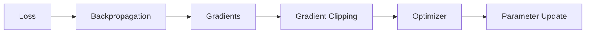

Gradient clipping does not replace good initialization, but it can provide additional protection against exploding gradients.

---

# 🧠 Initialization vs Gradient Clipping

These techniques solve related but different problems.

| Technique | Primary Purpose |
|---|---|
| Weight Initialization | Establish stable starting parameters |
| Normalization | Stabilize intermediate representations |
| Gradient Clipping | Limit excessively large gradients |
| Learning Rate | Control update magnitude |
| Residual Connections | Improve information and gradient flow |

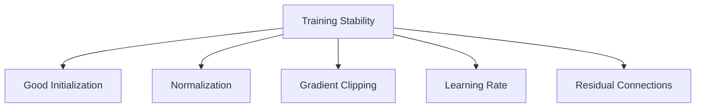

---

# 🧠 Initialization and Normalization

Modern Deep Learning architectures frequently combine initialization with normalization.

Examples include:

- Batch Normalization
- Layer Normalization
- RMS Normalization

Normalization can help control the distribution of intermediate activations.

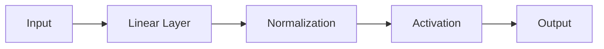

Initialization remains important, but normalization can make networks less sensitive to certain initialization choices.

---

# 🧠 Residual Connections and Gradient Flow

Residual connections provide shortcut paths through a network.

A residual block can be represented as:

\[
y=F(x)+x
\]

The shortcut provides a direct path for information and gradients.

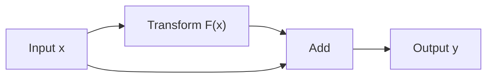

This idea is central to architectures such as ResNet and is especially important for very deep networks.

---

# 🔬 Deep Network Gradient Flow

Without shortcuts:

```text
Layer 1
   ↓
Layer 2
   ↓
Layer 3
   ↓
Layer 4
   ↓
Layer 5
```

The gradient must travel through every transformation.

With residual connections:

```text
Layer 1 ──────────────────────┐
   ↓                          │
Layer 2                      │
   ↓                          │
Layer 3                      │
   ↓                          │
Layer 4                      │
   ↓                          │
Layer 5 ─────────────────────┘
```

This creates additional paths for information and gradients.

---

# 🧠 Initialization Is Not the Only Cause of Gradient Problems

Gradient instability can result from many factors:

- Poor initialization
- Saturating activation functions
- Excessive network depth
- Large learning rate
- Poorly scaled inputs
- Numerical precision
- Unstable architecture
- Long recurrent sequences

Therefore:

> **Do not automatically assume that every vanishing or exploding gradient problem is caused by initialization.**

A production debugging process should examine the entire training pipeline.

---

# 🔬 Gradient Stability Debugging Workflow

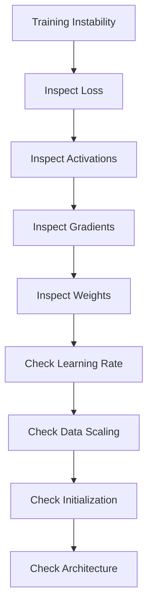

---

# 📊 Symptoms and Possible Causes

| Symptom | Possible Cause |
|---|---|
| Loss becomes NaN | Exploding gradients / numerical instability |
| Loss increases rapidly | Learning rate too large |
| Very slow training | Small learning rate / vanishing gradients |
| Earlier layers barely update | Vanishing gradients |
| Very large gradients | Exploding gradients |
| Activations become huge | Poor initialization / unstable architecture |
| Activations become almost zero | Poor initialization / saturation |
| Many ReLU outputs remain zero | Dying ReLU |
| Training highly sensitive to initialization | Unstable architecture / optimization |

---

# 🧪 Practical Experiment — Compare Initializers

Build identical networks using:

```text
1. Very Small Random Initialization
2. Large Random Initialization
3. Xavier Initialization
4. He Initialization
```

Train each model on the same dataset.

Compare:

- Training loss
- Validation loss
- Convergence speed
- Activation statistics
- Gradient norms
- Final accuracy

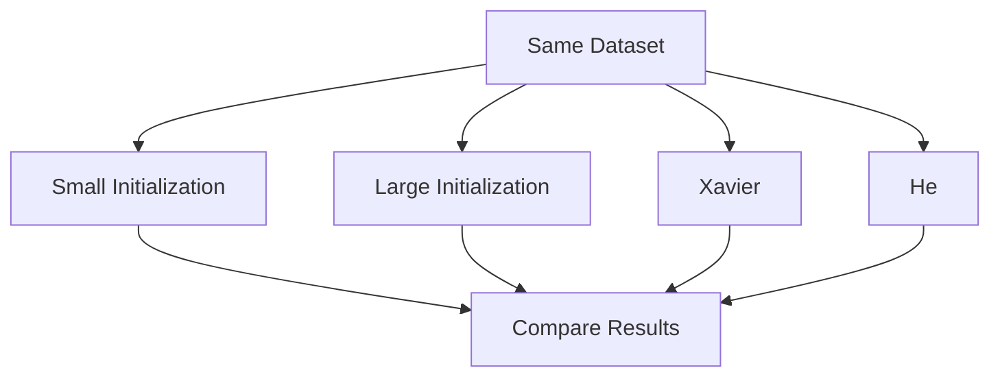

This experiment demonstrates why initialization matters.

---

# 🧪 Practical Experiment — Gradient Norms

During training, record the gradient norm after every batch.

```python
gradient_norms = []

for X_batch, y_batch in train_loader:

    optimizer.zero_grad()

    predictions = model(X_batch)

    loss = criterion(
        predictions,
        y_batch
    )

    loss.backward()

    total_norm = 0.0

    for parameter in model.parameters():

        if parameter.grad is not None:

            param_norm = (
                parameter.grad.data.norm(2)
            )

            total_norm += (
                param_norm.item() ** 2
            )

    total_norm = total_norm ** 0.5

    gradient_norms.append(
        total_norm
    )

    optimizer.step()
```

Plot the values:

```python
import matplotlib.pyplot as plt


plt.figure(figsize=(10, 6))

plt.plot(
    gradient_norms
)

plt.xlabel("Training Step")
plt.ylabel("Gradient Norm")
plt.title("Gradient Norm During Training")
plt.grid(True)

plt.show()
```

---

# 📈 What a Healthy Gradient Profile Might Look Like

There is no universal ideal gradient norm.

However, a healthy training process often shows gradients that remain within a manageable numerical range.

```text
Gradient Norm
 │
 │     /\    /\
 │ ___/  \__/  \___
 │
 └────────────────────> Training Steps
```

The important thing is not a specific number but whether the gradients behave consistently with the training objective.

---

# 🧠 Weight Initialization in Convolutional Networks

Initialization also applies to CNNs.

A convolutional layer has a receptive field.

For example:

```text
Input Image
    ↓
3 × 3 Kernel
    ↓
Feature Map
```

The effective fan-in depends on:

```text
Kernel Height
×
Kernel Width
×
Input Channels
```

For a convolution:

```text
3 × 3 kernel
64 input channels
```

the approximate fan-in is:

\[
3\times3\times64
=
576
\]

Initialization methods use this structure when determining appropriate weight scale.

---

# 🧠 Initialization in Deep Learning Frameworks

Frameworks generally provide sensible defaults.

However, engineers should still understand:

- What initializer is being used
- Which activation follows the layer
- Whether normalization is present
- Whether the model uses residual connections
- Whether the architecture overrides defaults

Production debugging sometimes requires explicitly controlling initialization.

---

# 🐍 Keras Custom Initializer

Keras allows custom initialization.

```python
from tensorflow import keras


initializer = keras.initializers.RandomNormal(
    mean=0.0,
    stddev=0.02
)

layer = keras.layers.Dense(
    64,
    activation="relu",
    kernel_initializer=initializer
)
```

This can be useful for controlled experiments.

---

# 🐍 PyTorch Custom Initialization

PyTorch allows explicit initialization of model parameters.

```python
import torch
import torch.nn as nn


class Network(nn.Module):

    def __init__(self):

        super().__init__()

        self.fc1 = nn.Linear(
            100,
            64
        )

        self.fc2 = nn.Linear(
            64,
            10
        )

        self.initialize_weights()

    def initialize_weights(self):

        nn.init.kaiming_normal_(
            self.fc1.weight,
            nonlinearity="relu"
        )

        nn.init.zeros_(
            self.fc1.bias
        )

        nn.init.xavier_uniform_(
            self.fc2.weight
        )

        nn.init.zeros_(
            self.fc2.bias
        )

    def forward(self, x):

        x = torch.relu(
            self.fc1(x)
        )

        return self.fc2(x)
```

This makes the initialization strategy explicit and reproducible.

---

# 🔁 Initialization and Reproducibility

Random initialization means different training runs may start from different parameter values.

Therefore, reproducibility often requires controlling random seeds.

```python
import numpy as np
import torch


np.random.seed(42)

torch.manual_seed(42)
```

For production experiments, reproducibility may additionally require controlling:

- Dataset shuffling
- GPU behavior
- Data-loader workers
- Framework versions
- Hardware
- Numerical precision

---

# 🏢 Enterprise Perspective

In production Deep Learning systems, initialization should be treated as part of the model configuration.

A production experiment should record:

```text
Model Architecture
       ↓
Activation Functions
       ↓
Initialization Strategy
       ↓
Normalization
       ↓
Optimizer
       ↓
Learning Rate
       ↓
Batch Size
       ↓
Training Configuration
```

This information is important for:

- Reproducibility
- Debugging
- Model comparison
- Experiment tracking
- Model governance
- Production incident analysis

---

!!! tip "Production Insight"

    When a Deep Learning model fails to train, do not immediately change the architecture.

    First inspect the training signals:

    ```text
    Loss
      ↓
    Activation Statistics
      ↓
    Gradient Norms
      ↓
    Weight Statistics
      ↓
    Learning Rate
      ↓
    Initialization
    ```

    This systematic approach can distinguish between initialization problems, optimization problems, data problems, and architectural problems.

---

!!! note "Important Distinction"

    Weight initialization and gradient clipping solve different problems.

    ```text
    Weight Initialization
            ↓
    Controls the starting parameter scale

    Gradient Clipping
            ↓
    Controls excessively large gradients during training
    ```

    Initialization is primarily a **starting-condition strategy**.

    Gradient clipping is primarily a **runtime stability strategy**.

---

# ⚠ Common Mistakes

Avoid these common mistakes:

- Initializing all weights to zero
- Initializing all neurons with identical values
- Using excessively large random weights
- Using excessively small random weights
- Ignoring the activation function when choosing initialization
- Assuming Xavier is always the best initializer
- Assuming He initialization is appropriate for every activation
- Ignoring fan-in and fan-out
- Ignoring gradient statistics
- Ignoring activation statistics
- Assuming gradient clipping fixes poor initialization
- Changing many training parameters simultaneously when debugging
- Ignoring input feature scaling
- Ignoring numerical precision
- Assuming every exploding gradient problem is caused by initialization
- Assuming every vanishing gradient problem is caused by initialization

---

# 🧠 Interview Questions

## Beginner

### 1. What is weight initialization?

Weight initialization is the process of assigning initial values to the trainable parameters of a neural network before training begins.

### 2. Why shouldn't all weights be initialized to zero?

Because identical weights create symmetry, causing neurons in the same layer to learn the same representations.

### 3. Can biases be initialized to zero?

Yes. Zero-initialized biases are commonly used.

### 4. Why is random initialization used?

Random initialization helps break symmetry between neurons.

---

## Intermediate

### 5. What is Xavier initialization?

Xavier / Glorot initialization chooses the weight scale based on fan-in and fan-out to help maintain stable activation and gradient variance.

### 6. What is He initialization?

He / Kaiming initialization is designed primarily for ReLU-like activations and commonly uses variance proportional to:

\[
\frac{2}{fan_{in}}
\]

### 7. What is fan-in?

Fan-in is the number of input connections to a neuron or layer.

### 8. What is fan-out?

Fan-out is the number of output connections from a neuron or layer.

### 9. What is vanishing gradient?

A vanishing gradient occurs when gradients become extremely small as they propagate through the network.

### 10. What is exploding gradient?

An exploding gradient occurs when gradients become excessively large during backpropagation.

---

## Advanced

### 11. Why does initialization affect gradient flow?

Because gradients are propagated through repeated transformations involving weights and activation derivatives. Poor parameter scales can cause these products to shrink or grow dramatically.

### 12. Why is He initialization commonly used with ReLU?

ReLU sets negative inputs to zero, changing the variance of activations. He initialization compensates for this behavior by using an appropriate fan-in-based variance.

### 13. What is variance preservation?

Variance preservation is the idea of selecting initialization scales so that activation and gradient variance remains reasonably stable across layers.

### 14. How are initialization and normalization related?

Normalization can stabilize intermediate activations, reducing sensitivity to certain initialization choices, but initialization remains important for establishing a reasonable starting state.

### 15. How do residual connections help gradient flow?

Residual connections provide shortcut paths that allow information and gradients to travel through the network more directly.

### 16. Does gradient clipping solve vanishing gradients?

No. Gradient clipping primarily limits excessively large gradients and is therefore mainly useful for exploding-gradient problems.

### 17. How would you diagnose exploding gradients?

Inspect:

- Gradient norms
- Loss values
- Activation statistics
- Weight statistics
- Learning rate
- Numerical values such as NaN or infinity

### 18. How would you diagnose vanishing gradients?

Inspect gradient norms across layers and determine whether earlier layers consistently receive extremely small gradients.

---

# 📌 Key Takeaways

- Weight initialization determines the starting point of neural network training.
- Random initialization helps break symmetry between neurons.
- Initializing all weights identically can prevent neurons from learning different features.
- Zero-initialized biases are generally acceptable.
- Initialization scale strongly affects activation and gradient stability.
- Very small weights can contribute to vanishing signals.
- Very large weights can contribute to exploding signals.
- Vanishing gradients make learning difficult in earlier layers.
- Exploding gradients can make training unstable.
- Xavier / Glorot initialization considers both fan-in and fan-out.
- He / Kaiming initialization is commonly used with ReLU-like activations.
- LeCun initialization is associated with fan-in-based variance and activations such as SELU.
- Fan-in represents incoming connections.
- Fan-out represents outgoing connections.
- Initialization and activation functions should be considered together.
- Gradient clipping is a runtime stability technique, not a replacement for good initialization.
- Normalization can improve training stability.
- Residual connections provide additional paths for information and gradients.
- Activation statistics and gradient norms are valuable debugging signals.
- Initialization should be treated as part of the model configuration in production systems.
- Reproducibility requires controlling more than just the random seed.
- Good initialization improves the probability of stable and efficient training, but it does not guarantee successful optimization.

---

# 📚 Further Reading

Continue with:

- **[10. Regularization and Generalization](10-regularization-and-generalization.md)**
- **[11. Advanced Optimization Techniques](11-advanced-optimization-techniques.md)**
- **[12. Hyperparameter Tuning and Training Strategies](12-hyperparameter-tuning-and-training-strategies.md)**
- **[19. Convolutional Neural Networks](19-convolutional-neural-networks.md)**
- **[22. ResNet, Residual Connections and TorchVision](22-resnet-residual-connections-and-torchvision.md)**

The next chapter focuses on preventing overfitting and improving the ability of neural networks to generalize to unseen data.

---

## ➡️ Next Chapter

**[10. Regularization and Generalization](10-regularization-and-generalization.md)**

---

> **Enterprise AI Engineering Handbook**  
> *Building Production-Grade Enterprise AI Systems — One Chapter at a Time.*