# 10. Regularization and Generalization

> Learn how Deep Learning models can memorize training data, why overfitting occurs, and how regularization techniques such as L1/L2 penalties, Dropout, Early Stopping, Data Augmentation, and normalization help neural networks generalize to unseen data.

---

## 🎯 Learning Objectives

After completing this chapter, you will be able to:

- Explain overfitting and underfitting
- Understand the difference between training performance and generalization
- Explain the bias-variance trade-off
- Understand why Deep Learning models can overfit
- Identify signs of overfitting
- Understand regularization
- Explain L1 and L2 regularization
- Understand weight decay
- Explain Dropout
- Understand why Dropout behaves differently during training and inference
- Understand Early Stopping
- Understand Data Augmentation
- Understand noise-based regularization
- Understand Batch Normalization as a training-stability technique
- Understand label smoothing
- Understand data leakage and its relationship to generalization
- Apply regularization using Keras
- Apply regularization using PyTorch
- Compare different regularization techniques
- Understand when regularization should and should not be applied
- Design a practical regularization strategy for production Deep Learning systems

---

## 📖 Overview

A Deep Learning model should not simply memorize the training dataset.

Its real purpose is to learn patterns that generalize to **new, unseen data**.

Consider a model trained to classify images:

```text
Training Images
      ↓
     Model
      ↓
Excellent Training Accuracy
```

This alone does not mean the model is useful.

The important question is:

```text
How well does the model perform on
images it has never seen before?
```

This ability is called **generalization**.

---

# 🧠 What Is Generalization?

Generalization is the ability of a trained model to perform well on unseen data drawn from the same underlying problem distribution.

Conceptually:

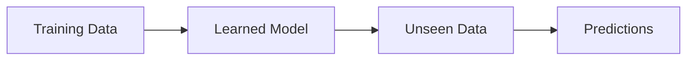

A good model learns:

```text
Underlying Patterns
```

rather than:

```text
Training Examples
```

---

# 🎯 Memorization vs Learning

Consider a classification dataset.

A model that memorizes:

```text
Image A → Class 1
Image B → Class 2
Image C → Class 1
```

may achieve excellent training accuracy.

But when presented with:

```text
New Image
```

it may fail.

A model that learns meaningful features can instead recognize:

```text
Shape
Texture
Edges
Patterns
Spatial Relationships
```

and use those features to classify new examples.

---

# 📊 Training Performance vs Generalization

A typical Deep Learning training process looks like:

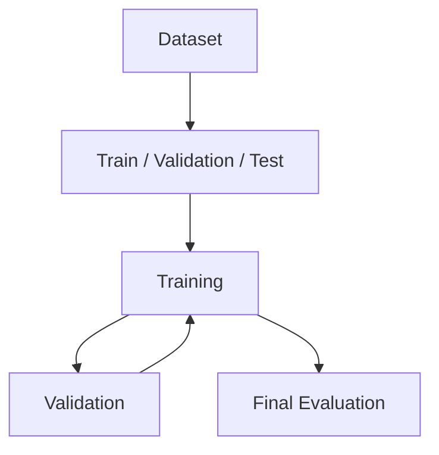

The training set is used to learn parameters.

The validation set helps evaluate generalization during development.

The test set should be reserved for final unbiased evaluation.

---

# ⚠ Overfitting

Overfitting occurs when a model performs very well on training data but poorly on unseen data.

A simplified example:

```text
Training Accuracy   = 99.8%
Validation Accuracy = 82%
```

This is a strong indication that the model may be overfitting.

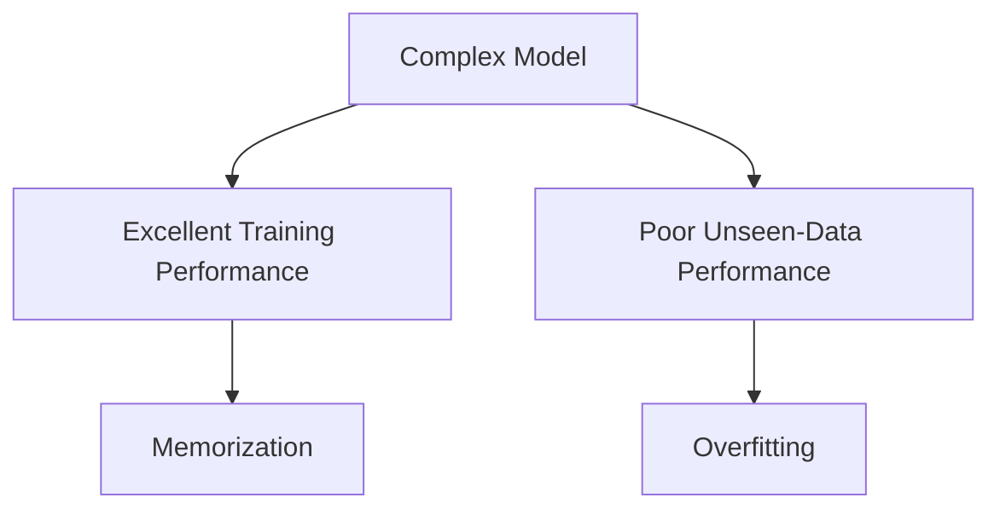

---

# 📉 Typical Overfitting Curve

During training, the training loss may continue decreasing while validation loss begins increasing.

```text
Loss
 │
 │\
 │ \
 │  \
 │   \________ Training Loss
 │
 │    \__
 │       \____
 │            \__
 │              \____
 │
 │       __
 │      /  \____ Validation Loss
 │     /
 │____/____________________________> Epoch
```

The point where validation loss stops improving is important.

---

# 🧠 Underfitting

Underfitting occurs when the model is too simple or insufficiently trained to capture the underlying patterns.

For example:

```text
Training Accuracy   = 70%
Validation Accuracy = 68%
```

Both are relatively poor.

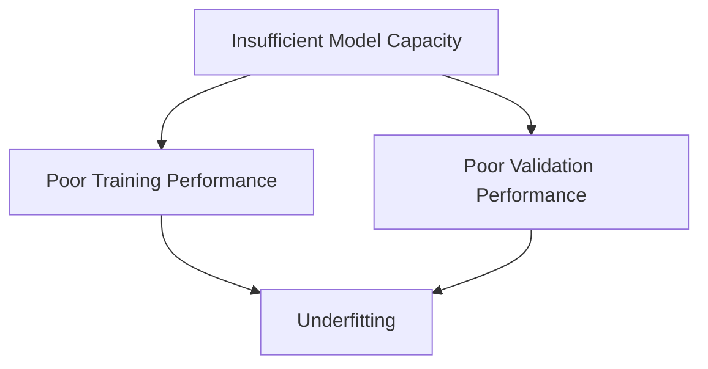

---

# 📊 Underfitting vs Good Fit vs Overfitting

| Condition | Training Performance | Validation Performance |
|---|---|---|
| Underfitting | Poor | Poor |
| Good Generalization | Good | Good |
| Overfitting | Excellent | Poor |

The objective is not maximum training accuracy.

The objective is strong **generalization**.

---

# 🧠 Model Capacity

Model capacity represents the ability of a model to represent complex functions.

Increasing capacity can mean:

- More layers
- More neurons
- Larger hidden dimensions
- More parameters
- More expressive architectures

Conceptually:

```text
Low Capacity
     ↓
May Underfit

Appropriate Capacity
     ↓
Good Generalization

Excessive Capacity
     ↓
May Overfit
```

However, modern Deep Learning has shown that the relationship between parameter count and generalization is more complex than this simple picture suggests.

---

# ⚖️ Bias and Variance

The classical bias-variance framework helps explain model behavior.

### High Bias

The model is too constrained and cannot capture the underlying pattern.

This often corresponds to:

```text
Underfitting
```

### High Variance

The model is highly sensitive to the particular training dataset.

This often corresponds to:

```text
Overfitting
```

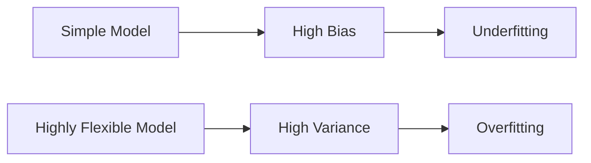

---

# 🧠 Bias-Variance Trade-Off

Conceptually:

```text
Model Complexity
      │
      ├───────────────┐
      │               │
      ▼               ▼
   Bias ↓          Variance ↑
```

The classical goal is to find a useful balance between underfitting and overfitting.

In modern Deep Learning, however, model capacity and generalization can behave in ways that are not fully captured by the classical two-way trade-off.

---

# 🔐 What Is Regularization?

Regularization refers to techniques that constrain or influence model learning to improve generalization.

The goal is not simply:

```text
Make the model smaller
```

The goal is:

```text
Prevent the model from relying too heavily
on patterns that do not generalize.
```

Common techniques include:

- L1 regularization
- L2 regularization
- Weight decay
- Dropout
- Early Stopping
- Data Augmentation
- Label Smoothing
- Noise injection
- Architectural constraints
- Transfer Learning

---

# 🧮 Regularized Objective Function

Without regularization:

\[
J(\theta)
=
L(\theta)
\]

With regularization:

\[
J(\theta)
=
L(\theta)
+
\lambda R(\theta)
\]

where:

- \(L(\theta)\) = original loss
- \(R(\theta)\) = regularization penalty
- \(\lambda\) = regularization strength

The optimizer therefore minimizes both:

```text
Prediction Error
+
Regularization Penalty
```

---

# 🧮 L2 Regularization

L2 regularization penalizes large weights.

A common formulation is:

\[
J(\theta)
=
L(\theta)
+
\lambda
\sum_i w_i^2
\]

The penalty grows as the magnitude of the weights increases.

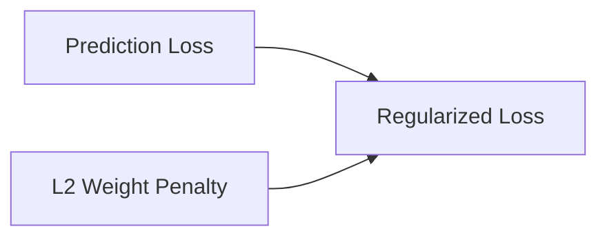

---

# 🧠 Why L2 Can Help

Without regularization, the model may learn very large weights to fit training examples.

L2 encourages the model to keep weights relatively small.

Conceptually:

```text
Large Weights
     ↓
Higher Penalty
     ↓
Optimizer Discourages Them
```

This can produce smoother models that generalize better.

---

# 📐 L2 Geometry

For two weights:

\[
w_1,w_2
\]

the L2 penalty is:

\[
w_1^2+w_2^2
\]

Its constraint region is circular in two dimensions.

```text
        w₂
        ↑
      *****
    **     **
   *         *
  *     •     *
   *         *
    **     **
      *****
──────────────→ w₁
```

The geometric interpretation becomes more important when comparing L1 and L2 regularization.

---

# 🧮 L1 Regularization

L1 regularization uses the absolute value of weights:

\[
J(\theta)
=
L(\theta)
+
\lambda
\sum_i |w_i|
\]

Unlike L2, L1 tends to encourage some weights toward exactly zero.

---

# 🎯 L1 and Sparsity

L1 regularization can encourage sparse parameter representations.

```text
Before:

[0.91, -0.42, 0.18, 0.07, -0.03]

After stronger L1 effect:

[0.84,  0.00, 0.12, 0.00,  0.00]
```

This can be useful in certain settings where feature or parameter sparsity is desirable.

---

# 📊 L1 vs L2

| Property | L1 | L2 |
|---|---|---|
| Penalty | \(|w|\) | \(w^2\) |
| Encourages sparsity | Stronger | Weaker |
| Can push weights to zero | Yes | Usually not exactly |
| Smooth penalty | No at zero | Yes |
| Common Deep Learning usage | Selective | Very common |

---

# 🧠 Weight Decay

Weight decay is closely related to L2 regularization.

Conceptually, the optimizer applies a decay effect to parameters:

\[
w
\leftarrow
w-\eta
\left(
\nabla L(w)+\lambda w
\right)
\]

This encourages weights to remain smaller.

Modern optimizers may implement weight decay separately from the gradient update.

This distinction becomes particularly important with optimizers such as AdamW.

---

# 🧠 L2 Regularization vs Decoupled Weight Decay

It is useful to distinguish:

```text
L2 Penalty
     ↓
Added to optimization objective / gradient

Decoupled Weight Decay
     ↓
Parameter decay applied separately
```

AdamW uses decoupled weight decay.

This is an important production optimization concept.

---

# 🧠 Dropout

Dropout is a stochastic regularization technique.

During training, randomly selected activations are temporarily removed.

For example:

```text
Before Dropout:

● ● ● ● ● ●

After Dropout:

● ○ ● ○ ○ ●
```

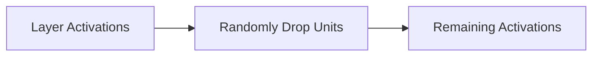

---

# 🎲 Dropout During Training

Suppose:

```text
Dropout Rate = 0.5
```

Approximately half of the eligible activations are randomly dropped during each training pass.

The exact mask changes between batches.

```text
Batch 1:
● ○ ● ○ ●

Batch 2:
○ ● ● ○ ○

Batch 3:
● ● ○ ● ○
```

This prevents the model from relying too heavily on a specific set of neurons.

---

# 🧠 Dropout as an Ensemble Intuition

One way to understand Dropout is that different subsets of neurons are trained across different iterations.

Conceptually:

```text
Network
   ↓
Many Random Sub-Networks
   ↓
Shared Parameters
   ↓
More Robust Representation
```

This creates an ensemble-like regularization effect.

---

# ⚠ Dropout During Inference

Dropout is generally active during training but disabled during inference.

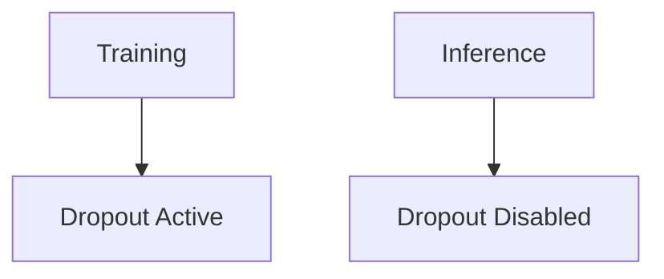

Deep Learning frameworks handle the appropriate scaling and behavior automatically.

---

# 🐍 Dropout with Keras

```python
from tensorflow import keras


model = keras.Sequential([
    keras.layers.Dense(
        128,
        activation="relu"
    ),

    keras.layers.Dropout(
        0.3
    ),

    keras.layers.Dense(
        64,
        activation="relu"
    ),

    keras.layers.Dropout(
        0.3
    ),

    keras.layers.Dense(
        10,
        activation="softmax"
    )
])
```

---

# 🐍 Dropout with PyTorch

```python
import torch.nn as nn


model = nn.Sequential(

    nn.Linear(
        128,
        64
    ),

    nn.ReLU(),

    nn.Dropout(
        p=0.3
    ),

    nn.Linear(
        64,
        10
    )
)
```

During training:

```python
model.train()
```

During inference:

```python
model.eval()
```

This distinction is critical in PyTorch.

---

# ⏹️ Early Stopping

Early Stopping terminates training when validation performance stops improving.

Instead of training for:

```text
1000 epochs
```

we may stop when:

```text
Validation loss stops improving
```

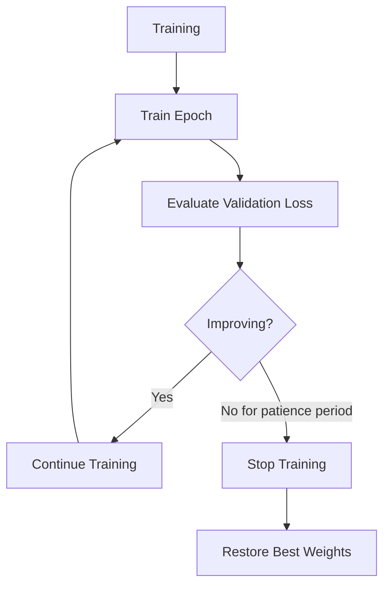

---

# 🧠 Patience

Early Stopping often uses a **patience** parameter.

For example:

```text
patience = 5
```

means:

```text
Allow up to 5 epochs without improvement
before stopping.
```

This prevents training from stopping because of a temporary fluctuation.

---

# 🐍 Keras Early Stopping

```python
from tensorflow import keras


early_stopping = keras.callbacks.EarlyStopping(
    monitor="val_loss",
    patience=5,
    restore_best_weights=True
)

model.fit(
    X_train,
    y_train,
    epochs=100,
    validation_data=(
        X_val,
        y_val
    ),
    callbacks=[
        early_stopping
    ]
)
```

---

# 🐍 PyTorch Early Stopping

PyTorch does not require a single built-in callback abstraction for Early Stopping.

A simple implementation can track validation loss:

```python
best_val_loss = float("inf")
patience = 5
epochs_without_improvement = 0

for epoch in range(100):

    train_one_epoch()

    val_loss = validate()

    if val_loss < best_val_loss:

        best_val_loss = val_loss

        epochs_without_improvement = 0

        torch.save(
            model.state_dict(),
            "best_model.pt"
        )

    else:

        epochs_without_improvement += 1

    if epochs_without_improvement >= patience:
        break
```

---

# 🧠 Data Augmentation

Data Augmentation creates modified versions of training examples.

For images, examples include:

- Rotation
- Cropping
- Flipping
- Translation
- Scaling
- Color changes
- Random erasing

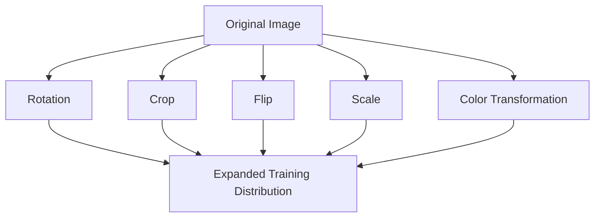

---

# 🖼️ Image Augmentation Example

```text
Original
   ↓
 ┌───────┐
 │ Image │
 └───────┘

      ↓

 ┌───────┐
 │Rotate │
 └───────┘

      ↓

 ┌───────┐
 │ Crop  │
 └───────┘

      ↓

 ┌───────┐
 │ Flip  │
 └───────┘
```

The goal is not simply to generate more data.

The goal is to teach the model that certain transformations should not change the underlying label.

---

# ⚠ Data Augmentation Must Preserve Labels

Suppose:

```text
Dog → Dog
```

A horizontal flip may still represent:

```text
Dog → Dog
```

But some transformations may change the semantic meaning.

For example, a transformation that completely distorts an object may make the original label incorrect.

Therefore:

> **Augmentation should reflect realistic variations expected in production data.**

---

# 🐍 Keras Data Augmentation

```python
from tensorflow import keras


augmentation = keras.Sequential([

    keras.layers.RandomFlip(
        "horizontal"
    ),

    keras.layers.RandomRotation(
        0.1
    ),

    keras.layers.RandomZoom(
        0.1
    )
])
```

---

# 🐍 PyTorch Data Augmentation

```python
from torchvision import transforms


train_transform = transforms.Compose([

    transforms.RandomHorizontalFlip(),

    transforms.RandomRotation(
        10
    ),

    transforms.RandomResizedCrop(
        224
    ),

    transforms.ToTensor()
])
```

---

# 🧠 Noise Injection

Adding controlled noise can also act as a regularizer.

For example:

```text
Input
  ↓
Add Small Noise
  ↓
Model
  ↓
Prediction
```

The model is encouraged to learn representations that are robust to small perturbations.

Noise can be introduced into:

- Inputs
- Activations
- Parameters

The correct technique depends on the architecture and task.

---

# 🧠 Label Smoothing

In classification, targets are often represented as one-hot vectors.

For example:

```text
Class 0:

[1, 0, 0, 0]
```

Label smoothing replaces hard targets with softer probabilities.

For example:

```text
[0.9, 0.033, 0.033, 0.033]
```

This prevents the model from becoming excessively confident.

---

# 🎯 Why Label Smoothing Helps

Without label smoothing:

```text
Target:
[1, 0, 0]

Model may become:
[0.999999, 0.0000005, 0.0000005]
```

With label smoothing:

```text
Target:
[0.9, 0.05, 0.05]
```

The model is encouraged to maintain less extreme confidence.

---

# 🐍 Keras Label Smoothing

For categorical cross-entropy:

```python
loss = keras.losses.CategoricalCrossentropy(
    label_smoothing=0.1
)
```

---

# 🐍 PyTorch Label Smoothing

```python
criterion = nn.CrossEntropyLoss(
    label_smoothing=0.1
)
```

---

# 🧠 Batch Normalization and Generalization

Batch Normalization normalizes activations using statistics computed from mini-batches during training.

A simplified form is:

\[
\hat{x}
=
\frac{x-\mu_B}
{\sqrt{\sigma_B^2+\epsilon}}
\]

followed by learnable scaling and shifting.

Batch Normalization was introduced primarily to stabilize and improve training, but it can also have regularizing effects.

---

# ⚠ Batch Normalization Is Not Simply a Regularizer

It is important to distinguish:

```text
Primary Purpose:
Training stabilization / normalization

Additional Effect:
Can provide some regularization
```

It should not automatically be treated as a replacement for techniques such as Dropout.

---

# 🧠 Layer Normalization

Layer Normalization normalizes across features within an individual example rather than across a batch.

This makes it particularly useful in architectures such as:

- Transformers
- Sequence models
- Large Language Models

The exact normalization strategy depends on the architecture.

---

# 🧠 Regularization Through Architecture

Sometimes the architecture itself can improve generalization.

Examples include:

- Convolutional layers
- Weight sharing
- Residual connections
- Bottleneck architectures
- Attention mechanisms
- Pretrained representations

For example, CNNs use local connectivity and parameter sharing.

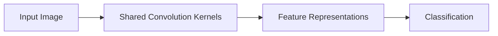

---

# 🧠 Transfer Learning as a Generalization Strategy

Transfer Learning starts with a model that has already learned useful representations from a large dataset.

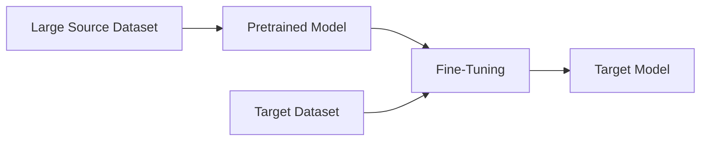

This can improve performance when the target dataset is relatively small.

Transfer Learning is covered in detail in:

**[21. Transfer Learning and Fine-Tuning](21-transfer-learning-and-fine-tuning.md)**

---

# 🔐 Data Leakage

Data leakage occurs when information from outside the training process improperly influences model training.

For example:

```text
Training Data
      ↓
Preprocessing
      ↓
Validation Information Accidentally Included
      ↓
Model
```

This can produce unrealistically strong validation or test performance.

---

# ⚠ Common Data Leakage Examples

Examples include:

- Scaling the entire dataset before train/test splitting
- Using future information in time-series features
- Including target-derived features
- Duplicating records across train and validation sets
- Performing augmentation before dataset splitting
- Using test data to tune hyperparameters

---

# 🧠 Correct Preprocessing Workflow

The correct general pattern is:

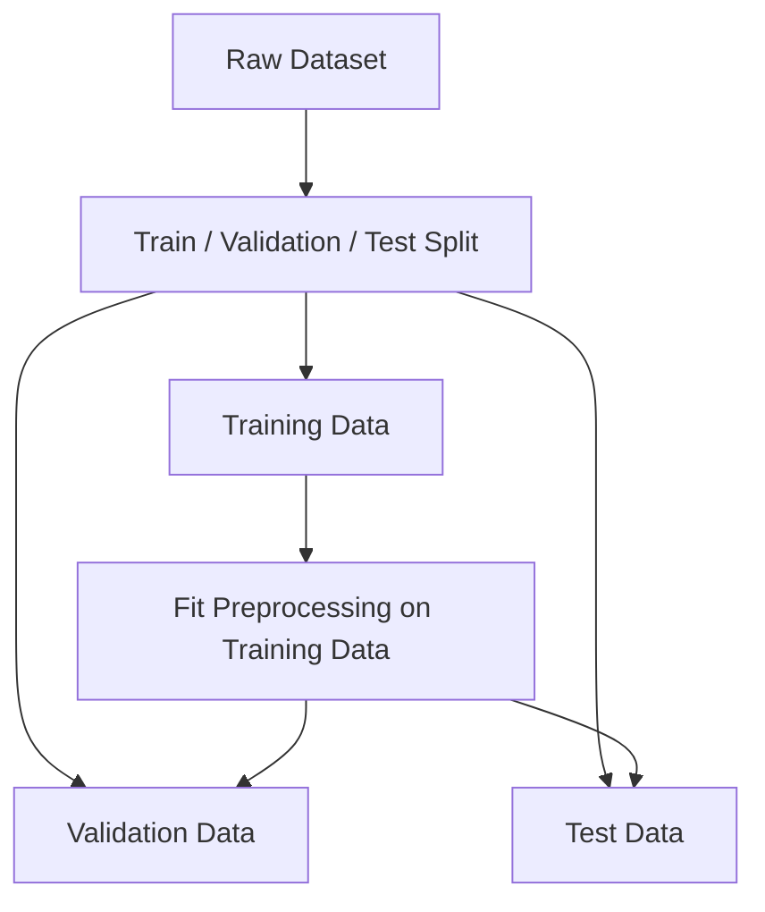

The preprocessing transformation should be learned from the training data and then applied consistently to validation and test data.

---

# 🧪 Regularization Strategy

There is no single regularization technique that should always be used.

A practical strategy is:

```text
Start with a reasonable architecture
        ↓
Establish baseline
        ↓
Evaluate validation performance
        ↓
Diagnose overfitting
        ↓
Apply appropriate regularization
        ↓
Tune strength
        ↓
Evaluate again
```

---

# 📊 Choosing a Regularization Technique

| Situation | Possible Technique |
|---|---|
| Large weights | L2 / Weight Decay |
| Sparse parameters desired | L1 |
| Fully connected network overfitting | Dropout |
| Training continues after validation degradation | Early Stopping |
| Limited image dataset | Data Augmentation |
| Excessive classifier confidence | Label Smoothing |
| Exploding gradients | Gradient Clipping |
| Limited target dataset | Transfer Learning |
| Data distribution instability | Normalization |
| Data leakage | Fix data pipeline |

These are starting points rather than rigid rules.

---

# 🧪 Baseline vs Regularized Model

A useful experiment is to compare:

```text
Model A
No Regularization

vs

Model B
L2 + Dropout

vs

Model C
Data Augmentation + Dropout

vs

Model D
Weight Decay + Early Stopping
```

Measure:

- Training loss
- Validation loss
- Training accuracy
- Validation accuracy
- Test accuracy
- Training time

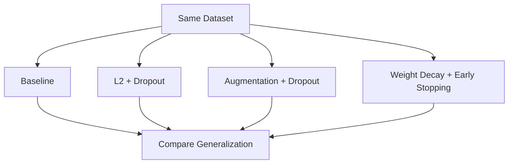

---

# 📈 Generalization Gap

A useful diagnostic is the difference between training and validation performance.

For accuracy:

\[
GeneralizationGap
=
Accuracy_{train}
-
Accuracy_{validation}
\]

For example:

```text
Training Accuracy   = 96%
Validation Accuracy = 86%

Gap = 10 percentage points
```

A large gap can indicate overfitting.

However, there is no universal threshold that defines "too large."

---

# 🧠 Training Curves

Always inspect both training and validation curves.

```python
import matplotlib.pyplot as plt


plt.figure(figsize=(10, 6))

plt.plot(
    history.history["loss"],
    label="Training Loss"
)

plt.plot(
    history.history["val_loss"],
    label="Validation Loss"
)

plt.xlabel("Epoch")
plt.ylabel("Loss")
plt.title("Training vs Validation Loss")

plt.legend()
plt.grid(True)

plt.show()
```

This is often more informative than looking at final accuracy alone.

---

# 🔍 Interpreting Training Curves

### Case 1 — Underfitting

```text
Training Loss     High
Validation Loss   High
```

Possible actions:

- Increase model capacity
- Train longer
- Improve features
- Reduce excessive regularization

---

### Case 2 — Good Generalization

```text
Training Loss     Low
Validation Loss   Low
```

and both curves remain reasonably aligned.

---

### Case 3 — Overfitting

```text
Training Loss     ↓ continuously

Validation Loss   ↓ initially
                  ↑ later
```

Possible actions:

- Add regularization
- Increase data
- Use augmentation
- Reduce model capacity
- Apply Early Stopping
- Improve data quality

---

# 🧠 Regularization Strength

The regularization parameter controls how strongly the penalty is applied.

For L2:

\[
J
=
L
+
\lambda
\sum w^2
\]

If:

\[
\lambda
\]

is too small:

```text
Regularization Effect
        ↓
Weak
```

If:

\[
\lambda
\]

is too large:

```text
Regularization Effect
        ↓
Excessive
        ↓
Possible Underfitting
```

Therefore, regularization strength must be tuned.

---

# 🧠 Dropout Rate

Similarly, Dropout has a tunable rate.

For example:

```text
0.1
0.2
0.3
0.5
```

A very high Dropout rate can make learning unnecessarily difficult.

A very low rate may provide little regularization.

---

# ⚠ More Regularization Is Not Always Better

Consider:

```text
No Regularization
      ↓
Overfitting

Moderate Regularization
      ↓
Good Generalization

Excessive Regularization
      ↓
Underfitting
```

The objective is balance.

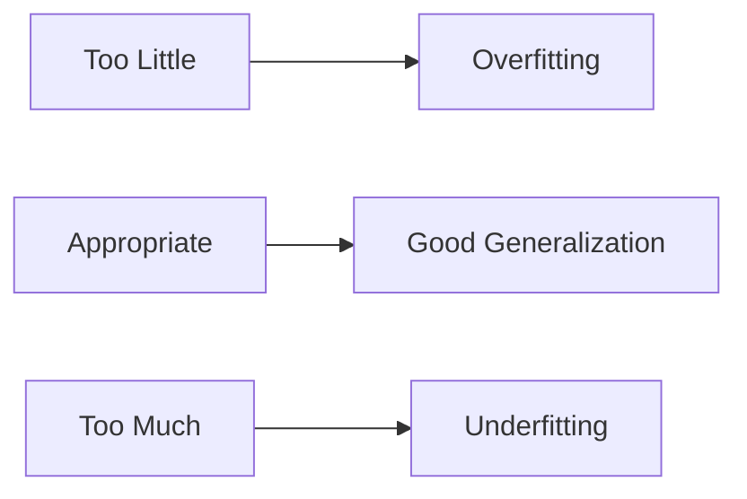

---

# 🧠 Regularization and Dataset Size

The amount of available training data strongly affects regularization needs.

```text
Small Dataset
     ↓
Higher Overfitting Risk
     ↓
Regularization Often More Important

Large Dataset
     ↓
More Information
     ↓
Potentially Better Generalization
```

However, large models can still overfit even when large datasets are available.

---

# 🧠 Regularization and Model Size

Suppose:

```text
Dataset = Small
Model   = Very Large
```

The model has enough capacity to memorize many training examples.

Possible strategies include:

```text
Reduce model size
        +
Data augmentation
        +
Weight decay
        +
Early stopping
```

But reducing model size is not always the best solution.

Pretraining and transfer learning can sometimes make large models effective even with limited target data.

---

# 🏢 Enterprise Perspective

In enterprise systems, generalization is ultimately about **production distribution performance**.

A model may perform well on historical test data but fail in production because the real-world distribution changes.

Examples:

```text
Training Data
     ↓
Historical Customers

Production Data
     ↓
New Customers
```

or:

```text
Training Images
     ↓
Controlled Lighting

Production Images
     ↓
Different Cameras / Lighting
```

Therefore, generalization must be considered together with:

- Data drift
- Distribution shift
- Concept drift
- Data quality
- Monitoring
- Retraining

---

# 🔄 Generalization in Production

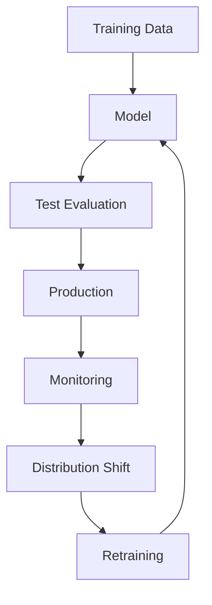

Regularization improves the model's ability to generalize, but it cannot eliminate production distribution shift.

---

!!! tip "Production Insight"

    A model that achieves 99% training accuracy is not necessarily better than a model achieving 95%.

    The real question is:

    ```text
    How does the model perform
    on unseen and production-like data?
    ```

    Production evaluation should therefore focus on:

    ```text
    Validation Performance
          +
    Test Performance
          +
    Production Monitoring
          +
    Drift Detection
    ```

---

# 🧠 Practical Regularization Checklist

Before deploying a Deep Learning model, verify:

```text
[ ] Train / validation / test split is correct

[ ] No data leakage

[ ] Training and validation distributions are understood

[ ] Training curves have been inspected

[ ] Generalization gap has been measured

[ ] Appropriate regularization has been evaluated

[ ] Regularization strength has been tuned

[ ] Early Stopping considered

[ ] Data augmentation evaluated where appropriate

[ ] Weight decay / L2 evaluated

[ ] Dropout evaluated where appropriate

[ ] Model performance evaluated on unseen data

[ ] Production distribution is understood

[ ] Monitoring strategy exists
```

---

# ⚠ Common Mistakes

Avoid these common mistakes:

- Optimizing only for training accuracy
- Using the test set for hyperparameter tuning
- Applying preprocessing before splitting the dataset
- Applying augmentation to validation/test data incorrectly
- Using excessive Dropout
- Using excessive L2 regularization
- Assuming L2 and weight decay are identical for every optimizer
- Assuming Batch Normalization is a complete replacement for regularization
- Stopping training based only on training loss
- Ignoring validation curves
- Increasing model capacity without checking generalization
- Assuming more parameters automatically improve performance
- Assuming a small validation gap guarantees production performance
- Ignoring distribution shift
- Ignoring data quality
- Using regularization without understanding the underlying failure mode

---

# 🧪 Practical Exercise 1 — Detect Overfitting

Train a neural network without regularization.

Track:

- Training loss
- Validation loss
- Training accuracy
- Validation accuracy

Plot the curves.

Determine:

```text
At which epoch does validation performance stop improving?
```

Then apply Early Stopping.

---

# 🧪 Practical Exercise 2 — Compare L1 and L2

Build two identical models:

```text
Model A → L1 Regularization
Model B → L2 Regularization
```

Compare:

- Training accuracy
- Validation accuracy
- Weight distributions
- Number of near-zero weights
- Generalization gap

---

# 🧪 Practical Exercise 3 — Dropout

Train:

```text
Model A → No Dropout
Model B → Dropout 0.2
Model C → Dropout 0.5
```

Compare:

```text
Training Accuracy
Validation Accuracy
Training Time
Convergence
```

Determine whether higher Dropout actually improves validation performance for your dataset.

---

# 🧪 Practical Exercise 4 — Data Augmentation

For an image classification task:

```text
Baseline
   ↓
No Augmentation

Experiment
   ↓
Random Flip
   +
Random Rotation
   +
Random Crop
```

Compare the validation performance.

The goal is to determine whether the augmentations represent realistic production variation.

---

# 🧪 Practical Exercise 5 — Complete Regularization Pipeline

Build a CNN with:

```text
Convolution
     ↓
Activation
     ↓
Normalization
     ↓
Pooling
     ↓
Dropout
     ↓
Dense
     ↓
Weight Decay
     ↓
Early Stopping
```

Evaluate:

- Accuracy
- Precision
- Recall
- F1
- Training loss
- Validation loss
- Generalization gap

This exercise combines several concepts from the chapter.

---

# 🧠 Interview Questions

## Beginner

### 1. What is overfitting?

Overfitting occurs when a model performs very well on training data but poorly on unseen data.

### 2. What is underfitting?

Underfitting occurs when a model is unable to capture sufficient patterns from the training data, resulting in poor training and validation performance.

### 3. What is generalization?

Generalization is the ability of a model to perform well on unseen data.

### 4. What is regularization?

Regularization refers to techniques that constrain or influence model learning to improve generalization.

### 5. Why is validation data required?

Validation data provides an independent dataset for evaluating model behavior during development and tuning.

---

## Intermediate

### 6. What is L1 regularization?

L1 regularization adds the absolute value of weights to the objective function:

\[
L+\lambda\sum|w|
\]

It can encourage sparse weights.

### 7. What is L2 regularization?

L2 regularization adds a squared-weight penalty:

\[
L+\lambda\sum w^2
\]

It discourages excessively large weights.

### 8. What is Dropout?

Dropout randomly removes a subset of activations during training to reduce reliance on specific neurons.

### 9. Is Dropout active during inference?

Normally no. Dropout is disabled during inference.

### 10. What is Early Stopping?

Early Stopping terminates training when validation performance stops improving according to a defined criterion.

### 11. What is Data Augmentation?

Data Augmentation creates realistic variations of training examples to improve robustness and generalization.

---

## Advanced

### 12. What is the difference between L2 regularization and weight decay?

They are closely related but are not necessarily identical in implementation. Decoupled weight decay, as used by AdamW, applies parameter decay separately from the gradient-based loss update.

### 13. Why can Dropout improve generalization?

It prevents the network from becoming overly dependent on specific activation paths and encourages more distributed representations.

### 14. Why should augmentation be applied only to training data?

Because validation and test datasets should represent the evaluation distribution rather than artificially altered training examples.

### 15. Can a very large model generalize well?

Yes. Modern Deep Learning demonstrates that large models can generalize effectively when trained with appropriate data, optimization, regularization, pretraining, and architecture.

### 16. What is the generalization gap?

It is the difference between training performance and performance on unseen validation/test data.

### 17. Can regularization solve data leakage?

No. Data leakage is a data-pipeline problem and must be fixed at the source.

### 18. Can regularization solve distribution shift?

No. Regularization can improve generalization, but production distribution shift requires monitoring and potentially adaptation or retraining.

### 19. Why should training and validation curves be monitored?

They reveal whether the model is underfitting, learning effectively, or beginning to overfit.

### 20. How would you diagnose overfitting in production?

Compare training, validation, test, and production-like evaluation performance while monitoring data distribution and performance drift over time.

---

# 📌 Key Takeaways

- Generalization is the ability to perform well on unseen data.
- Overfitting occurs when a model learns training-specific patterns that do not generalize.
- Underfitting occurs when the model cannot learn enough useful structure.
- Training accuracy alone is not a reliable measure of model quality.
- Validation and test datasets provide evidence about generalization.
- Regularization helps control overfitting.
- L1 regularization can encourage sparse parameters.
- L2 regularization discourages large weights.
- Weight decay applies a parameter-decay effect and should be distinguished from generic L2 penalties in some optimizers.
- Dropout randomly removes activations during training.
- Dropout is normally disabled during inference.
- Early Stopping prevents unnecessary training after validation performance stops improving.
- Data Augmentation teaches models to handle realistic input variation.
- Label Smoothing can reduce excessive model confidence.
- Normalization primarily improves training stability but can also have regularizing effects.
- Transfer Learning can improve generalization when target data is limited.
- Data leakage can produce misleadingly strong evaluation results.
- Regularization that is too weak may allow overfitting.
- Regularization that is too strong may cause underfitting.
- Regularization should be selected based on the actual failure mode.
- Production generalization also depends on distribution shift, drift, and data quality.
- A production-ready Deep Learning system requires both model regularization and ongoing monitoring.

---

# 📚 Further Reading

Continue with:

- **[11. Advanced Optimization Techniques](11-advanced-optimization-techniques.md)**
- **[12. Hyperparameter Tuning and Training Strategies](12-hyperparameter-tuning-and-training-strategies.md)**
- **[19. Convolutional Neural Networks](19-convolutional-neural-networks.md)**
- **[20. CNN Architecture, Optimization and Training](20-cnn-architecture-optimization-and-training.md)**
- **[21. Transfer Learning and Fine-Tuning](21-transfer-learning-and-fine-tuning.md)**
- **[35. GPU-Accelerated Deep Learning](35-gpu-accelerated-deep-learning.md)**
- **[36. Deep Learning Training and Model Lifecycle](36-deep-learning-training-and-model-lifecycle.md)**

The next chapter moves from fundamental regularization techniques into advanced optimization methods used to make Deep Learning training faster, more stable, and more efficient.

---

## ➡️ Next Chapter

**[11. Advanced Optimization Techniques](11-advanced-optimization-techniques.md)**

---

> **Enterprise AI Engineering Handbook**  
> *Building Production-Grade Enterprise AI Systems — One Chapter at a Time.*