# 11. Advanced Optimization Techniques

> Move beyond basic Gradient Descent and learn the optimization techniques used to train modern Deep Learning models efficiently, including Momentum, RMSProp, Adam, AdamW, learning-rate scheduling, warmup, cosine decay, gradient clipping, adaptive optimization, and practical optimizer-selection strategies.

---

## 🎯 Learning Objectives

After completing this chapter, you will be able to:

- Explain why basic Gradient Descent can be inefficient for Deep Learning
- Understand Momentum-based optimization
- Explain Stochastic Gradient Descent with Momentum
- Understand RMSProp
- Understand Adam
- Understand AdamW and decoupled weight decay
- Compare SGD, Momentum, RMSProp, Adam, and AdamW
- Understand optimizer hyperparameters
- Explain first-order and adaptive optimization
- Understand learning-rate scheduling
- Apply Step Decay
- Apply Exponential Decay
- Apply Cosine Decay
- Understand Learning-Rate Warmup
- Understand Warmup + Decay strategies
- Understand Reduce-on-Plateau
- Understand One-Cycle learning-rate policies
- Understand gradient clipping
- Understand gradient norm clipping and value clipping
- Understand optimizer state
- Understand the relationship between batch size and optimization
- Understand optimizer behavior in large Deep Learning models
- Implement advanced optimizers using Keras
- Implement advanced optimizers using PyTorch
- Design practical optimization strategies
- Diagnose common optimization failures
- Select appropriate optimization techniques for production Deep Learning systems

---

## 📖 Overview

Basic Gradient Descent provides the foundation for neural network optimization:

\[
\theta
\leftarrow
\theta-\eta\nabla_\theta J(\theta)
\]

However, modern Deep Learning models often contain:

- Millions or billions of parameters
- Highly non-convex loss landscapes
- Different parameter scales
- Noisy mini-batch gradients
- Very deep architectures
- Large datasets
- Expensive GPU training

A simple fixed learning rate may therefore be inefficient.

Modern Deep Learning typically combines:

```text
Gradient Computation
        ↓
Optimizer
        ↓
Learning-Rate Strategy
        ↓
Gradient Stabilization
        ↓
Parameter Update
```

---

# 🧠 Why Do We Need Advanced Optimizers?

Consider a loss surface with a narrow valley:

```text
Loss
 │
 │      \       /
 │       \     /
 │        \   /
 │         \_/
 │
 └────────────────────> Parameter
```

Gradient Descent may repeatedly move:

```text
↘
 ↗
↘
 ↗
↘
```

instead of moving efficiently toward the minimum.

This can result in:

- Slow convergence
- Oscillation
- Sensitivity to learning rate
- Inefficient parameter updates

Advanced optimizers attempt to improve the trajectory.

---

# 🔄 Optimization Landscape

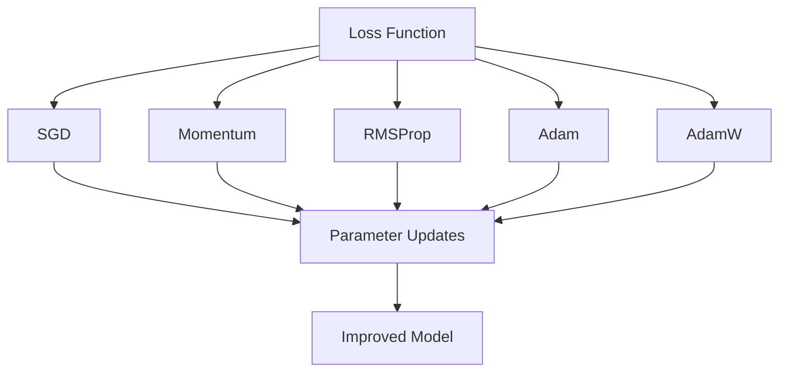

---

# 📐 Basic Gradient Descent

The standard update is:

\[
\theta_{t+1}
=
\theta_t
-
\eta g_t
\]

where:

\[
g_t
=
\nabla_\theta J(\theta_t)
\]

The optimizer only knows:

```text
Current Gradient
+
Learning Rate
```

It does not explicitly remember previous gradients.

---

# 🏃 Stochastic Gradient Descent

For a mini-batch \(B_t\):

\[
g_t
=
\nabla_\theta J_{B_t}(\theta_t)
\]

and:

\[
\theta_{t+1}
=
\theta_t-\eta g_t
\]

Because mini-batches are different, the gradient is noisy.

```text
Batch 1 → Gradient A
Batch 2 → Gradient B
Batch 3 → Gradient C
Batch 4 → Gradient D
```

This noise can make the optimization trajectory less smooth.

---

# 🏃‍♂️ SGD with Momentum

Momentum introduces a velocity term.

Instead of responding only to the current gradient, the optimizer also considers previous updates.

A common formulation is:

\[
v_t
=
\beta v_{t-1}
+
g_t
\]

and:

\[
\theta_t
=
\theta_{t-1}
-
\eta v_t
\]

where:

- \(v_t\) = velocity
- \(\beta\) = momentum coefficient
- \(g_t\) = current gradient
- \(\eta\) = learning rate

---

# 🧠 Momentum Intuition

Imagine a ball rolling down a landscape.

Without momentum:

```text
Gradient
   ↓
Step
   ↓
Gradient
   ↓
Step
```

With momentum:

```text
Previous Direction
        +
Current Gradient
        ↓
New Direction
```

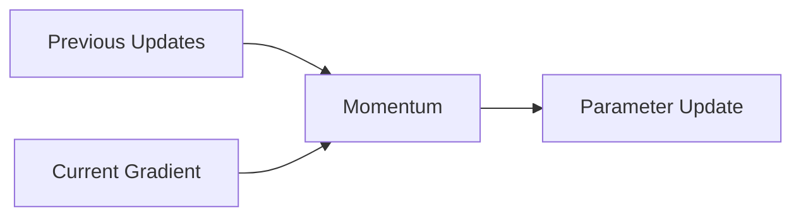

---

# 📈 Momentum Effect

Momentum can reduce oscillations.

Without momentum:

```text
↘ ↗ ↘ ↗ ↘ ↗
```

With momentum:

```text
→ → → → ↘
```

Conceptually, momentum accumulates movement in consistent directions.

---

# 🎚️ Momentum Coefficient

A common value is:

```text
β = 0.9
```

Higher momentum gives greater influence to previous updates.

However, the optimal value depends on:

- Model
- Dataset
- Learning rate
- Batch size
- Optimizer configuration

---

# 🧮 Momentum Example

Suppose:

\[
\beta=0.9
\]

and:

\[
v_{t-1}=2
\]

with:

\[
g_t=1
\]

Then:

\[
v_t
=
0.9(2)+1
\]

\[
v_t=2.8
\]

The optimizer therefore has memory of previous movement.

---

# 🧠 Nesterov Momentum

Nesterov Momentum modifies the point at which the gradient is evaluated.

Conceptually:

```text
Standard Momentum:

Current Position
      ↓
Calculate Gradient
      ↓
Update


Nesterov:

Look Ahead
      ↓
Calculate Gradient
      ↓
Update
```

This can provide improved optimization behavior in some workloads.

---

# 🐍 Keras SGD with Momentum

```python
import tensorflow as tf


optimizer = tf.keras.optimizers.SGD(
    learning_rate=0.01,
    momentum=0.9,
    nesterov=True
)
```

---

# 🐍 PyTorch SGD with Momentum

```python
import torch


optimizer = torch.optim.SGD(
    model.parameters(),
    lr=0.01,
    momentum=0.9,
    nesterov=True
)
```

---

# 🧠 RMSProp

RMSProp adapts the learning rate based on a moving average of squared gradients.

The moving average is:

\[
s_t
=
\beta s_{t-1}
+
(1-\beta)g_t^2
\]

The parameter update is:

\[
\theta_t
=
\theta_{t-1}
-
\frac{\eta}
{\sqrt{s_t}+\epsilon}
g_t
\]

---

# 🎯 RMSProp Intuition

RMSProp reduces the effective step size for parameters that repeatedly receive large gradients.

Conceptually:

```text
Large Historical Gradients
          ↓
Large sₜ
          ↓
Smaller Effective Step

Small Historical Gradients
          ↓
Small sₜ
          ↓
Larger Effective Step
```

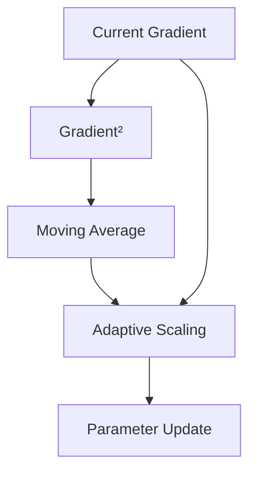

---

# 🧮 RMSProp Intuition

Suppose one parameter consistently has large gradients.

RMSProp increases its denominator:

\[
\sqrt{s_t}+\epsilon
\]

Therefore its effective learning rate decreases.

This helps handle parameters that operate on different scales.

---

# 🧠 Adam

Adam stands for:

> **Adaptive Moment Estimation**

Adam combines ideas from:

- Momentum
- RMSProp

It maintains:

1. Exponential moving average of gradients
2. Exponential moving average of squared gradients

---

# 🧮 Adam First Moment

The first moment estimate is:

\[
m_t
=
\beta_1m_{t-1}
+
(1-\beta_1)g_t
\]

This captures gradient direction.

---

# 🧮 Adam Second Moment

The second moment estimate is:

\[
v_t
=
\beta_2v_{t-1}
+
(1-\beta_2)g_t^2
\]

This captures gradient magnitude.

---

# 🧮 Adam Bias Correction

Because \(m_t\) and \(v_t\) start at zero, Adam applies bias correction:

\[
\hat{m}_t
=
\frac{m_t}
{1-\beta_1^t}
\]

and:

\[
\hat{v}_t
=
\frac{v_t}
{1-\beta_2^t}
\]

The parameter update becomes:

\[
\theta_t
=
\theta_{t-1}
-
\eta
\frac{\hat{m}_t}
{\sqrt{\hat{v}_t}+\epsilon}
\]


---

# 🧠 Adam Intuition

Adam can be viewed as:

```text
Gradient
   │
   ├───────────────┐
   ↓               ↓
First Moment    Second Moment
   ↓               ↓
Direction       Magnitude
   │               │
   └───────┬───────┘
           ↓
      Adaptive Update
```

This makes Adam highly effective for many Deep Learning workloads.

---

# 🎚️ Adam Hyperparameters

Common defaults are approximately:

```text
learning_rate = 0.001

β₁ = 0.9

β₂ = 0.999

ε = 1e-7 or similar framework-dependent value
```

These are defaults, not universal requirements.

---

# 🐍 Adam with Keras

```python
import tensorflow as tf


optimizer = tf.keras.optimizers.Adam(
    learning_rate=0.001
)
```

---

# 🐍 Adam with PyTorch

```python
import torch


optimizer = torch.optim.Adam(
    model.parameters(),
    lr=0.001
)
```

---

# 🧠 AdamW

AdamW is a variant of Adam that uses **decoupled weight decay**.

This distinction is important.

Instead of treating weight decay simply as an L2 penalty inside the gradient calculation, AdamW applies weight decay separately from the adaptive gradient update.

Conceptually:

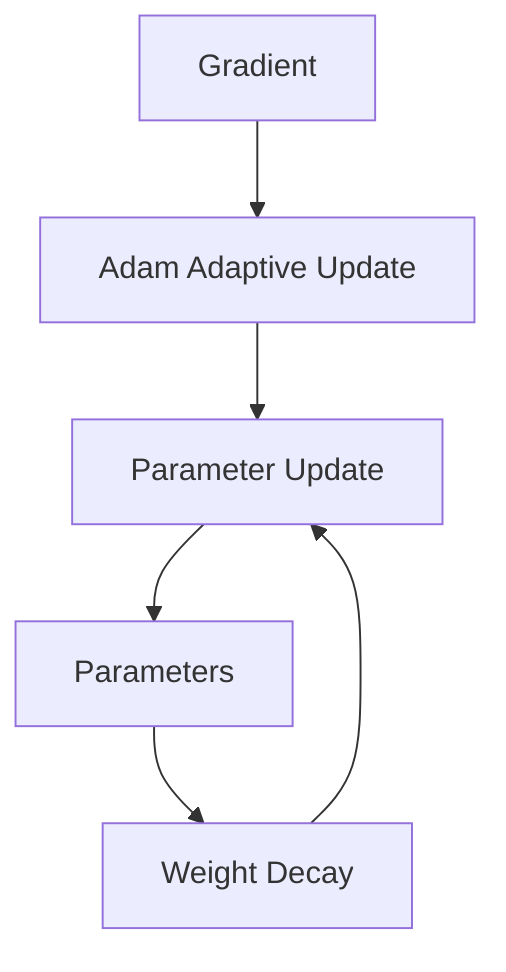

---

# 🧮 AdamW Concept

A simplified conceptual update is:

\[
\theta_t
=
\theta_{t-1}
-
\eta
\left(
\frac{\hat m_t}
{\sqrt{\hat v_t}+\epsilon}
+
\lambda\theta_{t-1}
\right)
\]

The exact implementation details depend on the optimizer formulation, but the important idea is:

> **Weight decay is decoupled from the adaptive gradient calculation.**

---

# 🧠 Why AdamW Matters

AdamW is widely used in modern Deep Learning because it combines:

```text
Adam's Adaptive Optimization
+
Explicit Weight Decay
```

It is particularly common in:

- Computer Vision
- Transformers
- Foundation Models
- Large Neural Networks

---

# 🐍 AdamW with Keras

```python
import tensorflow as tf


optimizer = tf.keras.optimizers.AdamW(
    learning_rate=0.001,
    weight_decay=1e-4
)
```

---

# 🐍 AdamW with PyTorch

```python
import torch


optimizer = torch.optim.AdamW(
    model.parameters(),
    lr=0.001,
    weight_decay=1e-4
)
```

---

# 📊 Optimizer Comparison

| Optimizer | Momentum | Adaptive Scaling | Weight Decay Support | Typical Usage |
|---|---:|---:|---:|---|
| SGD | No | No | Yes | Classical / Vision |
| SGD + Momentum | Yes | No | Yes | CNNs / Vision |
| RMSProp | Yes-like EMA | Yes | Config-dependent | Sequence / DL |
| Adam | Yes | Yes | Via regularization/configuration | General DL |
| AdamW | Yes | Yes | Decoupled | Modern DL / Transformers |

---

# 🧠 SGD vs Adam

There is no universally superior optimizer.

### SGD + Momentum

Often provides:

- Strong generalization in many vision workloads
- Simple optimizer state
- Predictable behavior
- Good performance with carefully tuned schedules

### Adam / AdamW

Often provides:

- Faster initial convergence
- Adaptive parameter updates
- Less manual tuning in some workloads
- Strong performance across many architectures

The correct choice depends on the problem.

---

# 🧠 Optimizer State

Advanced optimizers maintain additional state.

For SGD:

```text
Parameters
```

With Momentum:

```text
Parameters
+
Velocity
```

With Adam:

```text
Parameters
+
First Moment
+
Second Moment
```

Therefore, optimizer memory can become significant for large models.

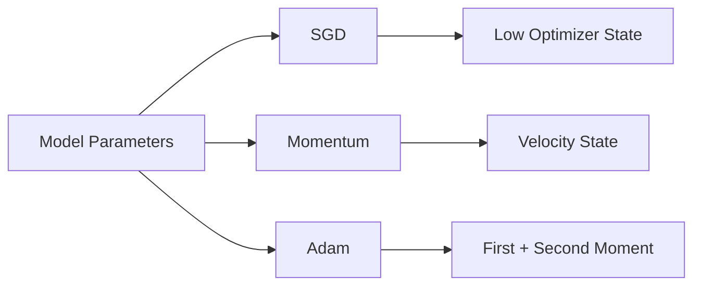

---

# 💾 Optimizer Memory

Suppose model parameters require:

```text
1 GB
```

An optimizer such as Adam may require additional memory for its state.

This becomes especially important for:

- Large models
- Multi-GPU training
- Large batch sizes
- Limited GPU memory

This is one reason optimizer choice is also a **systems engineering decision**.

---

# 📈 Learning-Rate Scheduling

A learning rate that remains constant throughout training may not always be optimal.

A common strategy is:

```text
Higher Learning Rate
       ↓
Fast Initial Learning
       ↓
Lower Learning Rate
       ↓
Fine Optimization
```

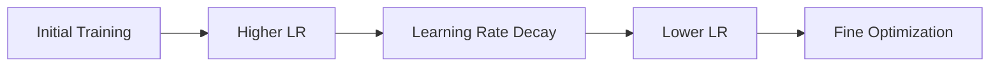

---

# 🪜 Step Decay

Step Decay reduces the learning rate at predefined intervals.

For example:

```text
Epoch 1–10   → 0.01
Epoch 11–20  → 0.001
Epoch 21–30  → 0.0001
```

Conceptually:

```text
Learning Rate
 │
 │────────
 │        │
 │        └────────
 │                 │
 │                 └────────
 └──────────────────────────> Epoch
```

---

# 🐍 Keras Step Decay

```python
def step_decay(epoch):

    if epoch < 10:
        return 0.01

    if epoch < 20:
        return 0.001

    return 0.0001


scheduler = tf.keras.callbacks.LearningRateScheduler(
    step_decay
)
```

---

# 📉 Exponential Decay

Exponential decay continuously reduces the learning rate.

A common formulation is:

\[
\eta_t
=
\eta_0
\gamma^t
\]

where:

- \(\eta_0\) = initial learning rate
- \(\gamma\) = decay factor
- \(t\) = training step


---

# 📈 Exponential Decay Curve

```text
Learning Rate
 │\
 │ \
 │  \
 │   \
 │    \__
 │       \____
 │            \____
 └────────────────────> Steps
```

---

# 🌀 Cosine Decay

Cosine decay smoothly reduces the learning rate.

A common formulation is:

\[
\eta_t
=
\eta_{min}
+
\frac{1}{2}
(\eta_{max}-\eta_{min})
\left(
1+\cos
\left(
\frac{\pi t}{T}
\right)
\right)
\]


Conceptually:

```text
Learning Rate
 │\
 │ \
 │  \
 │   \
 │    \
 │     \__
 │        \____
 └────────────────────> Training
```

Cosine schedules are widely used in modern Deep Learning training.

---

# 🐍 Keras Cosine Decay

```python
schedule = tf.keras.optimizers.schedules.CosineDecay(
    initial_learning_rate=0.001,
    decay_steps=10000
)

optimizer = tf.keras.optimizers.AdamW(
    learning_rate=schedule
)
```

---

# 🐍 PyTorch Cosine Annealing

```python
optimizer = torch.optim.AdamW(
    model.parameters(),
    lr=0.001
)

scheduler = torch.optim.lr_scheduler.CosineAnnealingLR(
    optimizer,
    T_max=100
)
```

Training:

```python
for epoch in range(100):

    train_one_epoch()

    scheduler.step()
```

---

# 🔥 Learning-Rate Warmup

Warmup starts training with a small learning rate and gradually increases it.

Conceptually:

```text
Learning Rate
 │       ______
 │      /
 │     /
 │    /
 │___/
 └────────────────────> Steps
     Warmup
```

The process is:

```text
Small LR
   ↓
Gradually Increase
   ↓
Target LR
   ↓
Training Schedule
```

---

# 🧠 Why Use Warmup?

Warmup can improve stability during the initial stages of training.

This can be especially useful when:

- Batch sizes are large
- Models are very deep
- Transformers are being trained
- Learning rates are relatively aggressive
- Training is sensitive to initial updates

---

# 🔥 Warmup + Cosine Decay

A modern strategy can combine:

```text
Warmup
   ↓
Peak Learning Rate
   ↓
Cosine Decay
   ↓
Very Small Learning Rate
```

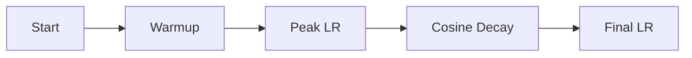

This strategy is widely applicable to modern large-scale training.

---

# 🧠 Reduce-on-Plateau

Another strategy is to reduce the learning rate when validation performance stops improving.

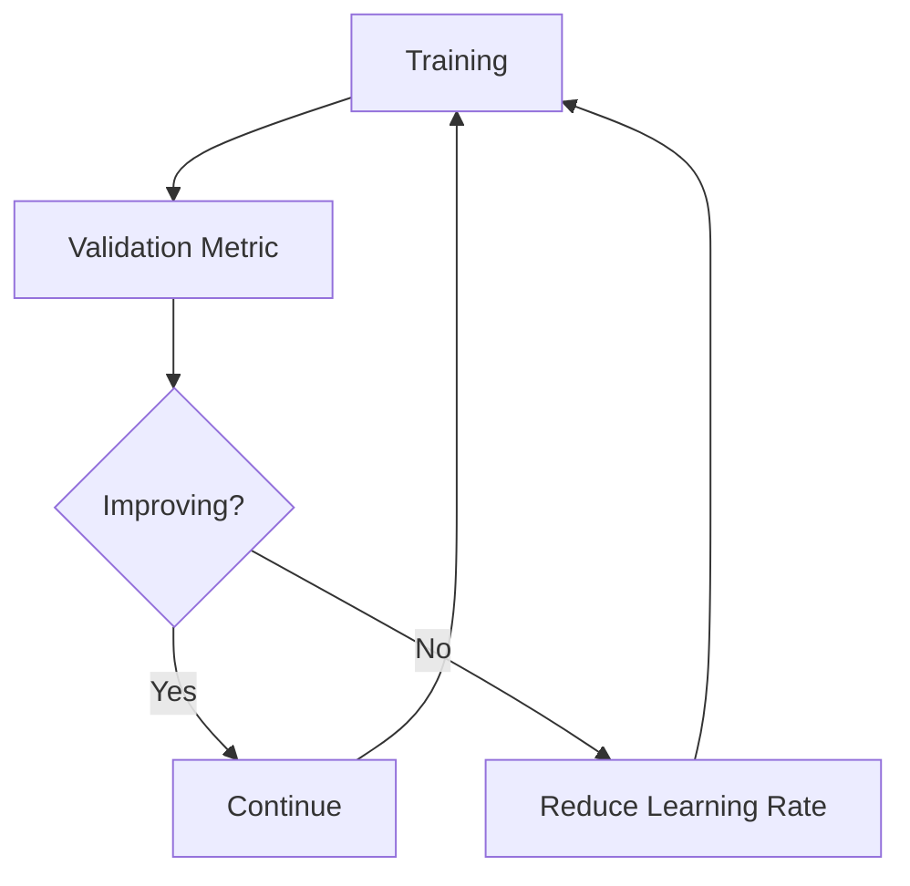

This is useful when the appropriate decay point is not known in advance.

---

# 🐍 Keras ReduceLROnPlateau

```python
scheduler = tf.keras.callbacks.ReduceLROnPlateau(
    monitor="val_loss",
    factor=0.5,
    patience=3,
    min_lr=1e-6
)
```

---

# 🧠 One-Cycle Learning Rate

The One-Cycle policy changes the learning rate during training.

A simplified concept is:

```text
Learning Rate
 │
 │       /\
 │      /  \
 │     /    \
 │____/      \________
 └──────────────────────> Training
```

The model:

```text
Starts with low LR
       ↓
Increases LR
       ↓
Reaches maximum LR
       ↓
Gradually decreases LR
```

This can produce efficient training for certain workloads.

---

# 🧠 Learning Rate Is Often More Important Than Optimizer Choice

A poorly configured learning rate can make even a strong optimizer perform badly.

For example:

```text
Adam + Bad LR
      ↓
Poor Training

SGD + Good LR + Momentum
      ↓
Excellent Training
```

Therefore, optimizer selection and learning-rate tuning should be considered together.

---

# ✂️ Gradient Clipping

Gradient clipping limits excessively large gradients.

It is particularly useful when exploding gradients occur.

Two common approaches are:

1. Gradient clipping by value
2. Gradient clipping by norm

---

# ✂️ Gradient Clipping by Value

Each gradient value is constrained to a range.

For example:

```text
[-1, +1]
```

A gradient:

```text
3.5
```

may become:

```text
1.0
```

and:

```text
-2.4
```

may become:

```text
-1.0
```

---

# 📏 Gradient Clipping by Norm

Instead of clipping individual values, the entire gradient vector is scaled when its norm exceeds a threshold.

If:

\[
\|g\|>c
\]

then:

\[
g
\leftarrow
g
\frac{c}{\|g\|}
\]


This preserves the direction while limiting the magnitude.

---

# 🧠 Gradient Clipping Intuition

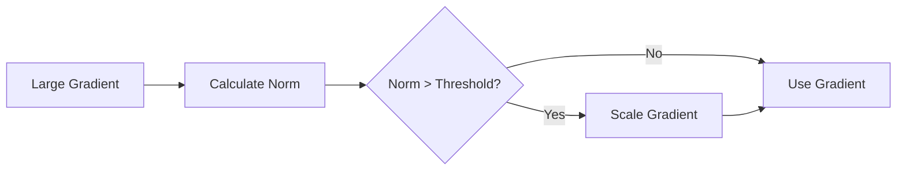

---

# 🐍 PyTorch Gradient Clipping

```python
loss.backward()

torch.nn.utils.clip_grad_norm_(
    model.parameters(),
    max_norm=1.0
)

optimizer.step()
```

---

# 🐍 Keras Gradient Clipping

Keras optimizers support gradient clipping.

```python
optimizer = tf.keras.optimizers.AdamW(
    learning_rate=0.001,
    clipnorm=1.0
)
```

Or clipping by value:

```python
optimizer = tf.keras.optimizers.AdamW(
    learning_rate=0.001,
    clipvalue=1.0
)
```

---

# 🧠 Optimizer + Scheduler + Clipping

A modern training configuration may look like:

```text
Model
  ↓
Forward Pass
  ↓
Loss
  ↓
Backpropagation
  ↓
Gradient Clipping
  ↓
Optimizer
  ↓
Learning-Rate Scheduler
  ↓
Parameter Update
```

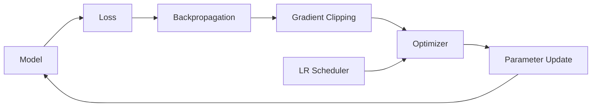

---

# 🧠 Optimizer Selection Strategy

A practical starting strategy can be:

```text
Start
  ↓
Choose Architecture
  ↓
Choose Baseline Optimizer
  ↓
Tune Learning Rate
  ↓
Inspect Training Curves
  ↓
Add Scheduler if Needed
  ↓
Add Regularization
  ↓
Add Gradient Clipping if Needed
  ↓
Compare Optimizers
```

---

# 📊 Practical Optimizer Selection

| Scenario | Starting Point |
|---|---|
| Basic Neural Network | Adam / AdamW |
| CNN | SGD + Momentum or AdamW |
| Transformer | AdamW |
| Very large model | AdamW / specialized optimizer |
| Recurrent Network | Adam / AdamW / RMSProp |
| Strong baseline needed | AdamW |
| Classical vision training | SGD + Momentum |
| Exploding gradients | Any suitable optimizer + clipping |

These are starting points, not universal rules.

---

# 🧠 Optimizer Hyperparameters

Important parameters include:

### Learning Rate

Controls update magnitude.

### Momentum

Controls influence of previous updates.

### Beta Values

Control exponential moving averages in adaptive optimizers.

### Weight Decay

Controls parameter shrinkage.

### Epsilon

Improves numerical stability.

### Gradient Clipping Threshold

Limits gradient magnitude.

---

# 🧪 Example — AdamW Configuration

```python
optimizer = torch.optim.AdamW(
    model.parameters(),
    lr=3e-4,
    betas=(0.9, 0.999),
    eps=1e-8,
    weight_decay=1e-4
)
```

A complete configuration might also include:

```python
scheduler = torch.optim.lr_scheduler.CosineAnnealingLR(
    optimizer,
    T_max=100
)
```

and:

```python
torch.nn.utils.clip_grad_norm_(
    model.parameters(),
    max_norm=1.0
)
```

---

# 🧠 Advanced Training Configuration

A modern training configuration can be represented as:

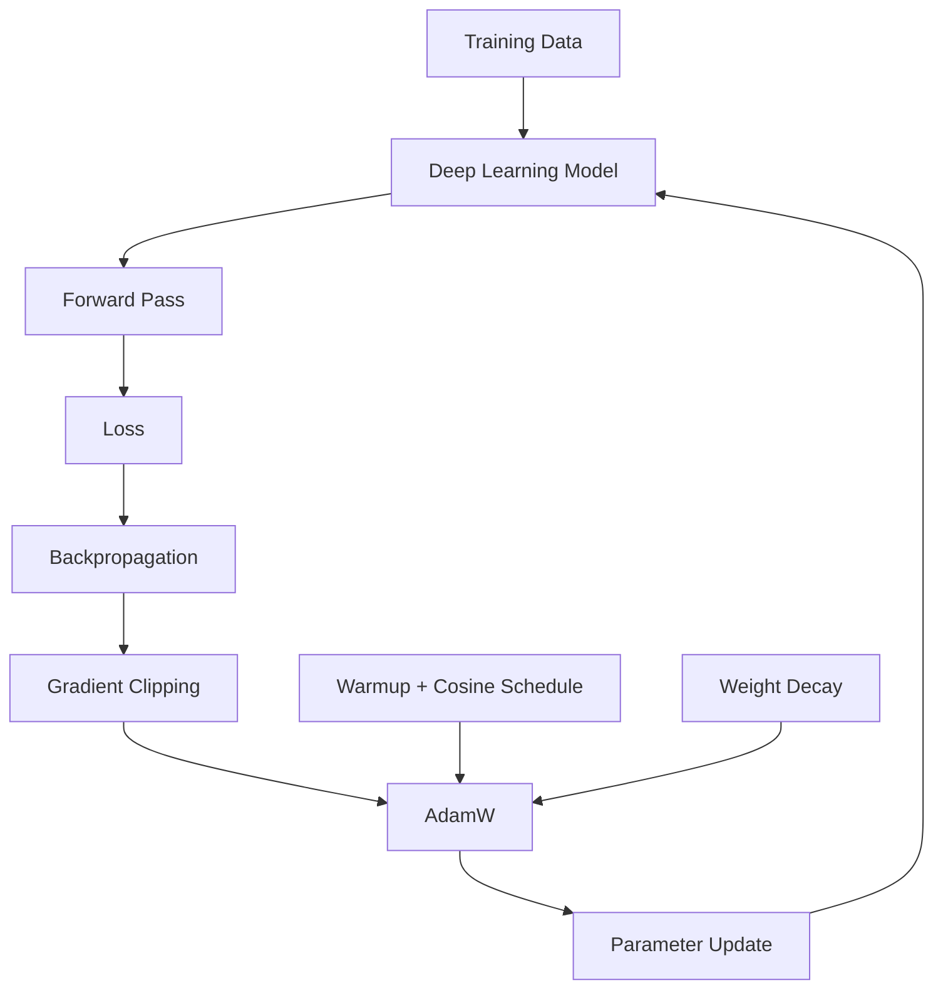

---

# ⚡ Mixed Precision and Optimization

Mixed Precision Training uses lower-precision numerical formats where appropriate.

Common formats include:

```text
FP32
FP16
BF16
```

The objective is to improve:

- Training throughput
- GPU memory efficiency
- Hardware utilization

while maintaining numerical stability.

Mixed precision is covered in greater depth in:

**[35. GPU-Accelerated Deep Learning](35-gpu-accelerated-deep-learning.md)**

---

# 🧠 Gradient Scaling

When using low-precision training such as FP16, small gradients may underflow.

Gradient scaling can help.

Conceptually:

```text
Loss
 ↓
Scale Loss
 ↓
Backpropagation
 ↓
Large Enough Gradients
 ↓
Unscale
 ↓
Optimizer Update
```

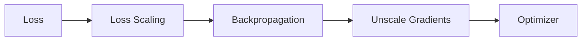

Modern frameworks provide automatic mixed-precision utilities to manage this process.

---

# 🧠 Batch Size and Optimization

Batch size affects optimization behavior.

Increasing batch size generally provides:

```text
Larger Batch
    ↓
Lower Gradient Noise
    ↓
Higher Computational Throughput
```

But it may also require:

- More GPU memory
- Learning-rate adjustment
- Different warmup configuration
- Different regularization behavior

---

# 🧮 Effective Batch Size

With distributed training:

\[
EffectiveBatchSize
=
BatchSize_{perGPU}
\times
NumberOfGPUs
\times
GradientAccumulationSteps
\]

For example:

```text
Per GPU Batch = 32
GPUs          = 4
Accumulation  = 2
```

Then:

\[
32\times4\times2=256
\]

So the effective batch size is:

```text
256
```

---

# 🏭 Distributed Optimization

Large models may be trained across multiple GPUs.

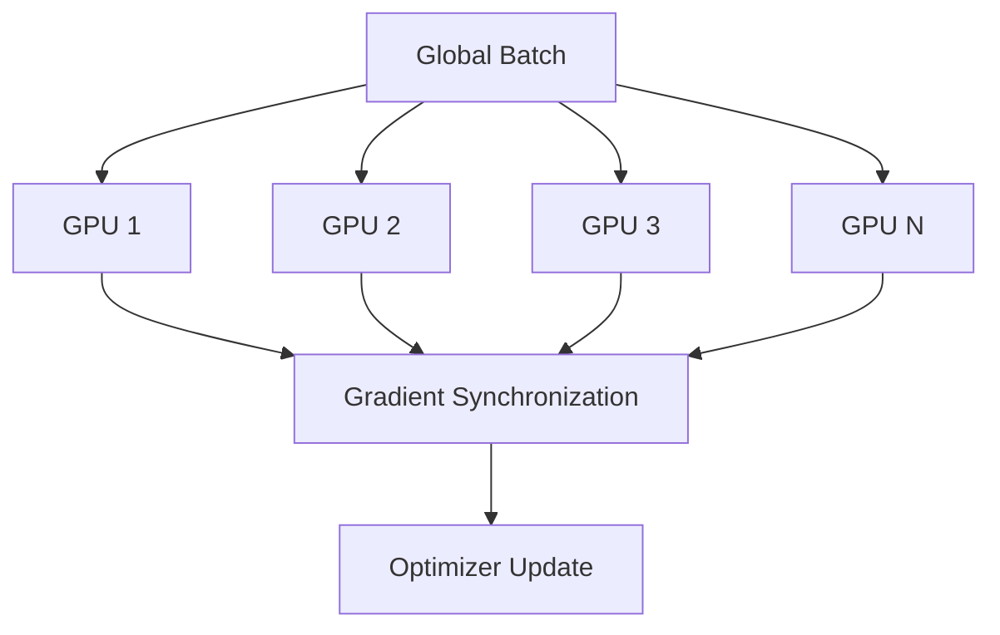

The optimizer therefore interacts with distributed gradient computation.

---

# 🧠 Optimizer State in Distributed Training

For large models, optimizer state can become a major memory consumer.

Potential strategies include:

- Data Parallelism
- Sharded Optimizer States
- Mixed Precision
- Gradient Checkpointing
- Parameter Sharding

These techniques become increasingly important when training large-scale models.

---

# 🔬 Optimization Diagnostics

When training is not working correctly, inspect:

```text
1. Loss
2. Learning Rate
3. Gradient Norm
4. Parameter Norm
5. Activation Statistics
6. Batch Size
7. Optimizer State
8. Validation Metrics
9. Numerical Stability
10. Data Pipeline
```

---

# 📊 Diagnostic Decision Tree

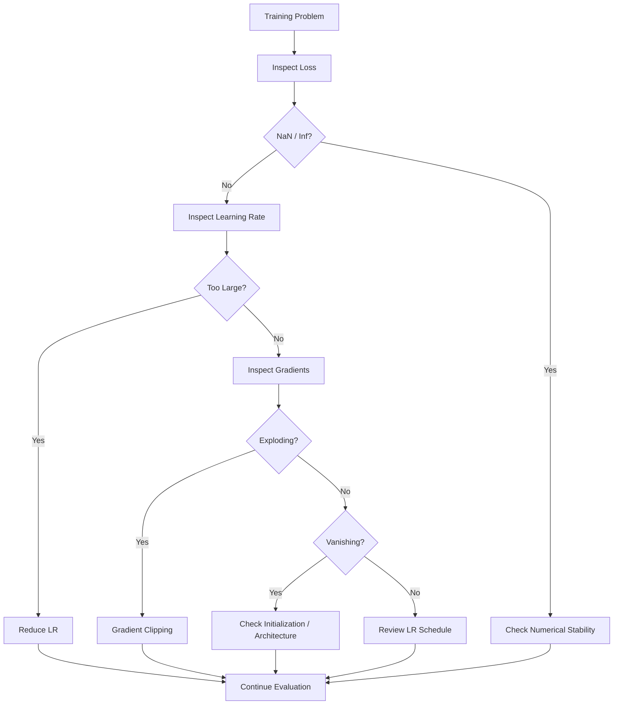

---

# 🧪 Practical Experiment 1 — Compare Optimizers

Train the same model with:

```text
1. SGD
2. SGD + Momentum
3. RMSProp
4. Adam
5. AdamW
```

Keep everything else constant.

Compare:

- Training loss
- Validation loss
- Accuracy
- Convergence speed
- Training time
- Final performance

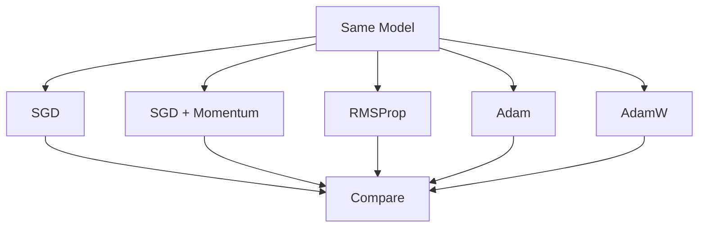

---

# 🧪 Practical Experiment 2 — Learning-Rate Comparison

Keep the optimizer fixed.

Try:

```text
1e-5
1e-4
1e-3
1e-2
```

Compare the resulting loss curves.

```python
learning_rates = [
    1e-5,
    1e-4,
    1e-3,
    1e-2
]
```

The objective is to observe:

```text
Too Small
   ↓
Slow Training

Good
   ↓
Stable Convergence

Too Large
   ↓
Oscillation / Divergence
```

---

# 🧪 Practical Experiment 3 — Scheduler Comparison

Compare:

```text
Constant LR
Step Decay
Exponential Decay
Cosine Decay
Warmup + Cosine
Reduce-on-Plateau
```

Track:

- Loss
- Accuracy
- Learning rate
- Training time

---

# 🧪 Practical Experiment 4 — Gradient Clipping

Train the same model:

```text
Without Clipping
```

and:

```text
With Gradient Clipping
```

Record:

- Gradient norm
- Training loss
- NaN occurrences
- Convergence

---

# 🧪 Practical Experiment 5 — Adam vs AdamW

Compare:

```text
Adam
```

with:

```text
AdamW
```

using similar learning-rate and weight-decay configurations.

Compare:

- Training loss
- Validation loss
- Generalization gap
- Weight norms
- Final test performance

---

# 📈 Plotting Learning Rate

When using a scheduler, it is useful to record the learning rate.

```python
learning_rates = []

for epoch in range(100):

    train_one_epoch()

    current_lr = optimizer.param_groups[0]["lr"]

    learning_rates.append(
        current_lr
    )

    scheduler.step()
```

Then plot:

```python
import matplotlib.pyplot as plt


plt.figure(figsize=(10, 6))

plt.plot(
    learning_rates
)

plt.xlabel("Epoch")
plt.ylabel("Learning Rate")
plt.title("Learning Rate Schedule")
plt.grid(True)

plt.show()
```

---

# 🧠 Production Optimization Checklist

Before running an expensive production training job:

```text
[ ] Optimizer selected

[ ] Learning rate selected

[ ] Batch size selected

[ ] Effective batch size calculated

[ ] Weight decay configured

[ ] Scheduler configured

[ ] Warmup considered

[ ] Gradient clipping evaluated

[ ] Mixed precision considered

[ ] GPU memory checked

[ ] Optimizer state memory estimated

[ ] Training throughput measured

[ ] Validation metrics configured

[ ] Checkpointing configured

[ ] Experiment tracking configured

[ ] Reproducibility configured

[ ] Training cost estimated
```

---

# 🏢 Enterprise Perspective

In enterprise AI systems, optimization is not simply about choosing:

```text
Adam vs SGD
```

It is a systems-level decision involving:

```text
Model Architecture
       ↓
Batch Size
       ↓
GPU Memory
       ↓
Optimizer
       ↓
Learning Rate
       ↓
Scheduler
       ↓
Precision
       ↓
Gradient Handling
       ↓
Distributed Training
       ↓
Training Cost
       ↓
Model Quality
```

A theoretically strong optimizer may still be a poor production choice if:

- It consumes too much memory
- Training throughput is poor
- It requires excessive tuning
- It produces unstable training
- It does not fit the deployment/training infrastructure

---

!!! tip "Production Insight"

    **Optimization is an engineering system, not just an optimizer class.**

    A production training configuration should be treated as a coordinated set of decisions:

    ```text
    Optimizer
       +
    Learning Rate
       +
    Scheduler
       +
    Batch Size
       +
    Weight Decay
       +
    Gradient Clipping
       +
    Precision
       +
    Hardware
    ```

    Changing one component can change the behavior of the entire training system.

---

!!! note "Important Distinction"

    Keep these concepts separate:

    ```text
    Optimizer
    ↓
    Determines how gradients update parameters

    Learning-Rate Scheduler
    ↓
    Determines how learning rate changes over time

    Regularization
    ↓
    Encourages better generalization

    Gradient Clipping
    ↓
    Controls excessively large gradients

    Mixed Precision
    ↓
    Improves computational and memory efficiency
    ```

---

# ⚠ Common Mistakes

Avoid these common mistakes:

- Choosing an optimizer without tuning the learning rate
- Assuming Adam is always better than SGD
- Using an excessively large learning rate
- Using an unnecessarily small learning rate
- Ignoring optimizer state memory
- Applying weight decay without understanding the optimizer implementation
- Confusing L2 regularization with decoupled weight decay
- Changing optimizer, learning rate, batch size, and architecture simultaneously
- Using gradient clipping without diagnosing the underlying issue
- Ignoring warmup for training configurations that require it
- Ignoring the interaction between batch size and learning rate
- Using a scheduler without monitoring its actual learning-rate values
- Forgetting to call `scheduler.step()` where required
- Applying the scheduler at the wrong frequency
- Ignoring mixed-precision numerical stability
- Assuming larger batches always train better
- Assuming smaller batches always generalize better
- Ignoring GPU memory consumed by optimizer state
- Comparing optimizers without keeping the experimental setup consistent

---

# 🧠 Interview Questions

## Beginner

### 1. Why do we need advanced optimization algorithms?

Basic Gradient Descent can converge slowly or behave inefficiently on complex Deep Learning loss landscapes. Advanced optimizers improve update dynamics and often accelerate training.

### 2. What is Momentum?

Momentum uses information from previous gradients or updates to smooth and accelerate optimization.

### 3. What is RMSProp?

RMSProp adapts parameter update magnitudes using a moving average of squared gradients.

### 4. What is Adam?

Adam combines momentum-like first-moment estimation with second-moment adaptive scaling.

### 5. What is AdamW?

AdamW is an Adam variant that uses decoupled weight decay.

---

## Intermediate

### 6. What is the difference between SGD and SGD with Momentum?

SGD uses the current gradient directly, while Momentum incorporates historical update information to smooth optimization.

### 7. Why can Momentum help?

It can reduce oscillation and accelerate movement along directions where gradients remain consistent.

### 8. Why does RMSProp use squared gradients?

The moving average of squared gradients provides a measure of recent gradient magnitude and allows adaptive scaling.

### 9. What are Adam's first and second moments?

The first moment tracks the moving average of gradients, while the second moment tracks the moving average of squared gradients.

### 10. Why does Adam use bias correction?

Because the moment estimates are initialized near zero, especially early in training. Bias correction compensates for this initialization effect.

### 11. What is a learning-rate scheduler?

A learning-rate scheduler changes the learning rate according to a predefined or metric-driven strategy during training.

### 12. What is learning-rate warmup?

Warmup gradually increases the learning rate from a small initial value before reaching the main training learning rate.

---

## Advanced

### 13. Why is AdamW different from Adam with L2 regularization?

AdamW decouples weight decay from the adaptive gradient update, whereas simply adding an L2 penalty modifies the gradient itself.

### 14. Why might SGD generalize better than Adam in some vision workloads?

SGD with Momentum can provide favorable optimization and generalization behavior when paired with appropriate learning-rate schedules, although this is workload-dependent.

### 15. Why are optimizer states important for large models?

Optimizers such as Adam maintain additional tensors for each parameter, which can significantly increase memory requirements.

### 16. Why can large batch sizes require learning-rate adjustments?

Changing batch size changes the statistical properties and noise level of gradient estimates, which can affect the appropriate learning rate and training dynamics.

### 17. What is gradient clipping by norm?

It scales the gradient vector when its norm exceeds a specified threshold while preserving its direction.

### 18. Why is warmup useful for large-scale training?

It can prevent unstable early updates when using aggressive learning rates, large batches, or sensitive architectures.

### 19. What is cosine decay?

Cosine decay smoothly decreases the learning rate according to a cosine-shaped schedule.

### 20. What is Reduce-on-Plateau?

It reduces the learning rate when a monitored validation metric stops improving for a specified period.

### 21. How would you debug unstable training?

Inspect:

```text
Loss
Learning Rate
Gradient Norms
Activation Statistics
Initialization
Batch Size
Optimizer
Numerical Precision
Data Pipeline
```

Then change one factor at a time where practical.

### 22. How would you choose between AdamW and SGD?

Start from the architecture and workload. Use AdamW as a strong general-purpose baseline, while considering SGD + Momentum for workloads such as many computer-vision training setups where careful schedules can provide strong results. Validate empirically.

---

# 📌 Key Takeaways

- Basic Gradient Descent is the foundation of neural network optimization.
- Momentum uses historical gradient information to improve optimization dynamics.
- RMSProp adapts learning rates using moving averages of squared gradients.
- Adam combines first- and second-moment estimates.
- Adam uses bias correction for its moment estimates.
- AdamW decouples weight decay from the adaptive gradient update.
- Optimizer choice and learning-rate choice should be considered together.
- Learning-rate scheduling can improve both convergence and final optimization.
- Step decay changes the learning rate at predefined intervals.
- Exponential decay continuously reduces the learning rate.
- Cosine decay provides a smooth learning-rate schedule.
- Warmup gradually increases the learning rate during the initial training phase.
- Warmup can be especially useful for large batches and modern architectures.
- Reduce-on-Plateau responds to validation performance rather than a fixed schedule.
- One-Cycle policies increase and then decrease the learning rate during training.
- Gradient clipping helps control exploding gradients.
- Gradient clipping by norm preserves gradient direction while limiting magnitude.
- Optimizers maintain internal state, which can significantly affect GPU memory usage.
- Batch size and learning rate interact strongly.
- Effective batch size can include distributed workers and gradient accumulation.
- Mixed precision can improve training efficiency but introduces numerical considerations.
- Large-scale training requires treating optimization as a complete system.
- There is no universally best optimizer.
- The best optimization configuration should be determined through controlled experimentation.

---

# 📚 Further Reading

Continue with:

- **[12. Hyperparameter Tuning and Training Strategies](12-hyperparameter-tuning-and-training-strategies.md)**
- **[13. TensorFlow and Keras Fundamentals](13-tensorflow-and-keras-fundamentals.md)**
- **[14. Keras Sequential and Functional API](14-keras-sequential-and-functional-api.md)**
- **[20. CNN Architecture, Optimization and Training](20-cnn-architecture-optimization-and-training.md)**
- **[27. Transformer Architecture](27-transformer-architecture.md)**
- **[35. GPU-Accelerated Deep Learning](35-gpu-accelerated-deep-learning.md)**
- **[36. Deep Learning Training and Model Lifecycle](36-deep-learning-training-and-model-lifecycle.md)**

The next chapter brings these concepts together by focusing on **hyperparameter tuning, experiment design, and practical training strategies**.

---

## ➡️ Next Chapter

**[12. Hyperparameter Tuning and Training Strategies](12-hyperparameter-tuning-and-training-strategies.md)**

---

> **Enterprise AI Engineering Handbook**  
> *Building Production-Grade Enterprise AI Systems — One Chapter at a Time.*