# 12. Hyperparameter Tuning and Training Strategies

> Learn how to systematically tune Deep Learning models, design reliable training experiments, select effective hyperparameters, diagnose training behavior, and build reproducible training strategies for production-grade neural networks.

---

## 🎯 Learning Objectives

After completing this chapter, you will be able to:

- Understand what hyperparameters are
- Distinguish parameters from hyperparameters
- Identify the most important Deep Learning hyperparameters
- Understand learning rate, batch size, epochs, optimizer, and regularization hyperparameters
- Understand model architecture hyperparameters
- Design a systematic hyperparameter tuning strategy
- Understand manual tuning
- Understand grid search
- Understand random search
- Understand Bayesian optimization
- Understand Hyperband and early-stopping-based search
- Understand the relationship between hyperparameters
- Understand learning-rate and batch-size interactions
- Understand training, validation, and test strategies
- Understand cross-validation considerations for Deep Learning
- Understand checkpointing and Early Stopping
- Understand reproducible experiments
- Track and compare experiments
- Build practical Keras training strategies
- Build practical PyTorch training strategies
- Understand distributed hyperparameter tuning
- Understand compute and cost considerations
- Avoid common hyperparameter tuning mistakes
- Design production-oriented Deep Learning experiments

---

## 📖 Overview

Training a Deep Learning model involves two fundamentally different types of values.

### Parameters

Parameters are learned automatically during training.

Examples:

```text
Weights
Biases
```

### Hyperparameters

Hyperparameters are configuration values chosen before or during the training process.

Examples:

```text
Learning Rate
Batch Size
Number of Epochs
Optimizer
Weight Decay
Dropout Rate
Number of Layers
Hidden Dimensions
```

The model learns its parameters from data.

The engineer controls its hyperparameters.

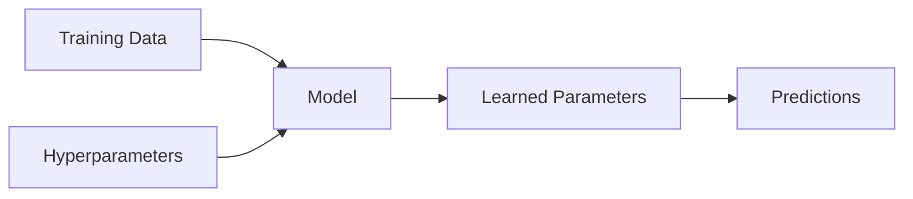

---

# 🧠 Parameters vs Hyperparameters

| Parameters | Hyperparameters |
|---|---|
| Learned during training | Selected by engineer / tuning system |
| Weights | Learning rate |
| Biases | Batch size |
| Embeddings | Number of layers |
| Kernel values | Dropout rate |
| Updated through backpropagation | Optimizer |
| Stored in model checkpoint | Stored in training configuration |

A useful mental model is:

```text
Hyperparameters
      ↓
Training Process
      ↓
Learned Parameters
      ↓
Trained Model
```

---

# 🏗 Deep Learning Training Pipeline

A complete training process can be represented as:

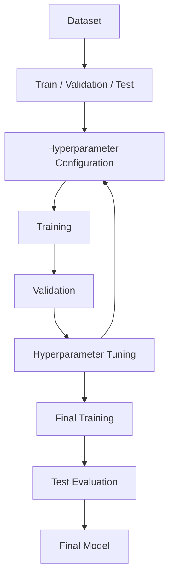

The important principle is:

> **Use validation data to make development decisions and reserve the test set for final evaluation.**

---

# 🎛️ What Is Hyperparameter Tuning?

Hyperparameter tuning is the process of finding a configuration that produces strong validation performance.

For example:

```text
Learning Rate
Batch Size
Optimizer
Weight Decay
Dropout
Hidden Units
Number of Layers
```

A tuning process searches through combinations of these values.

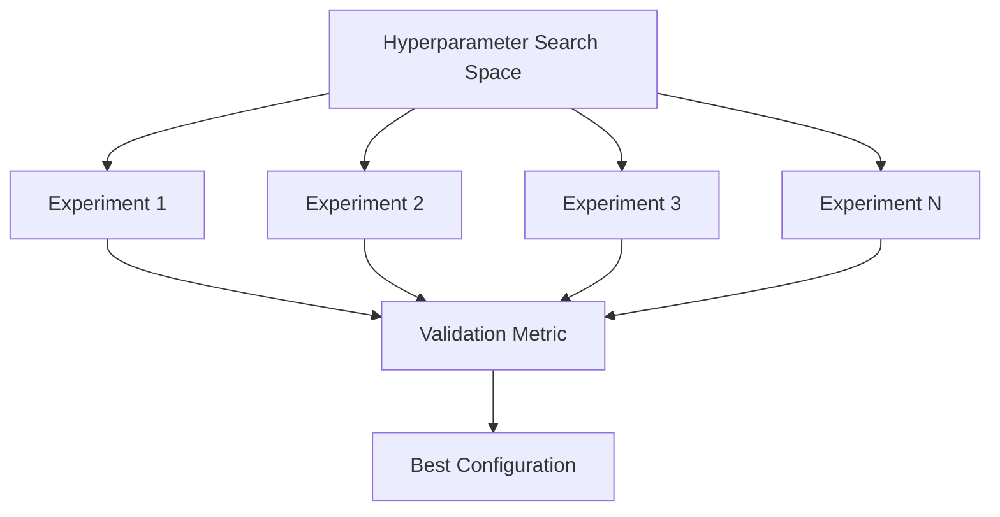

---

# 🧠 Why Hyperparameter Tuning Matters

A model can fail even when:

- The architecture is correct
- The dataset is good
- The optimizer is appropriate

because the hyperparameters may be poorly configured.

For example:

```text
Learning Rate Too High
        ↓
Unstable Training

Learning Rate Too Low
        ↓
Extremely Slow Training
```

Similarly:

```text
Dropout Too High
        ↓
Underfitting

Dropout Too Low
        ↓
Possible Overfitting
```

---

# 📊 Major Hyperparameter Categories

Hyperparameters can be grouped into several categories.

| Category | Examples |
|---|---|
| Optimization | Learning rate, optimizer, momentum |
| Training | Batch size, epochs |
| Regularization | Weight decay, dropout |
| Architecture | Layers, hidden units |
| Data | Augmentation strength |
| Scheduling | Warmup, decay strategy |
| Numerical | Precision, gradient clipping |
| Distributed | Number of GPUs, effective batch size |

---

# 🔥 Learning Rate

Learning rate is often one of the most important hyperparameters.

It controls the magnitude of parameter updates.

\[
\theta_{t+1}
=
\theta_t
-
\eta
\nabla_\theta L
\]

where:

\[
\eta
\]

is the learning rate.


---

# ⚠ Learning Rate Too High

```text
Large Learning Rate
        ↓
Large Updates
        ↓
Overshooting
        ↓
Oscillation
        ↓
Possible Divergence
```

A typical loss curve might look like:

```text
Loss
 │
 │ \/\/\
 │/    \/\_
 │
 └──────────────────> Training
```

---

# ⚠ Learning Rate Too Low

```text
Small Learning Rate
        ↓
Very Small Updates
        ↓
Slow Convergence
        ↓
Long Training Time
```

The loss may decrease extremely slowly.

---

# 🎯 Finding a Good Learning Rate

A practical approach is to start with a logarithmic range.

For example:

```text
1e-5
1e-4
1e-3
1e-2
```

rather than:

```text
0.001
0.002
0.003
0.004
```

The logarithmic approach explores orders of magnitude more efficiently.

---

# 🧠 Batch Size

Batch size determines how many examples are processed before an optimizer update.

For example:

```text
Dataset
   ↓
Batch 1 → 32 samples
Batch 2 → 32 samples
Batch 3 → 32 samples
```

Common values include:

```text
16
32
64
128
256
512
```

The correct value depends heavily on:

- GPU memory
- Model size
- Dataset
- Optimization strategy
- Training objective

---

# 🧠 Batch Size and Gradient Noise

Small batches:

```text
Small Batch
    ↓
More Gradient Noise
    ↓
Potentially Better Exploration
```

Large batches:

```text
Large Batch
    ↓
More Stable Gradient Estimate
    ↓
Higher Hardware Utilization
```

Neither is universally better.

---

# 🔄 Batch Size and Learning Rate

Changing batch size can affect the appropriate learning rate.


Therefore:

> **Do not tune batch size and learning rate as completely independent variables.**

---

# 🧮 Effective Batch Size

In distributed training:

\[
EffectiveBatchSize
=
BatchSize
\times
NumberOfDevices
\times
AccumulationSteps
\]

For example:

```text
Batch per GPU       = 32
Number of GPUs      = 4
Gradient accumulation = 2
```

Then:

\[
32\times4\times2=256
\]

The effective batch size is:

```text
256
```

---

# 🧠 Number of Epochs

An epoch represents one complete pass through the training dataset.

For example:

```text
Dataset = 10,000 samples
Batch Size = 100

Steps per Epoch = 100
```

Training for:

```text
20 epochs
```

means approximately:

```text
2,000 optimizer steps
```

assuming the dataset and batch configuration remain unchanged.

---

# ⏱️ Epochs vs Steps

For large-scale Deep Learning, training is often easier to reason about using **steps** rather than only epochs.

For example:

```text
Training:
100,000 optimizer steps
```

can be more meaningful than:

```text
10 epochs
```

when datasets are extremely large or dynamically generated.

---

# 🧠 Optimizer as a Hyperparameter

The optimizer itself is a hyperparameter.

Common choices include:

```text
SGD
SGD + Momentum
RMSProp
Adam
AdamW
```

A practical starting point for many modern Deep Learning models is:

```text
AdamW
```

while SGD + Momentum remains highly relevant for many computer-vision training workloads.

---

# 🎚️ Optimizer Hyperparameters

Different optimizers expose different settings.

For AdamW:

```text
Learning Rate
β₁
β₂
Epsilon
Weight Decay
```

For SGD:

```text
Learning Rate
Momentum
Weight Decay
Nesterov
```

---

# 🧠 Weight Decay

Weight decay controls parameter shrinkage.

Typical values might be explored logarithmically:

```text
1e-6
1e-5
1e-4
1e-3
1e-2
```

The appropriate range depends on the model and task.

---

# 🎯 Dropout Rate

Dropout is another tunable hyperparameter.

Common candidates might include:

```text
0.0
0.1
0.2
0.3
0.5
```

However:

> **Do not automatically add Dropout simply because it is available.**

If the model already uses strong regularization, normalization, augmentation, or pretraining, excessive Dropout may hurt performance.

---

# 🧠 Architecture Hyperparameters

Architecture itself contains hyperparameters.

Examples:

```text
Number of Layers
Number of Hidden Units
Kernel Size
Number of Filters
Stride
Pooling Size
Embedding Dimension
Attention Heads
Hidden Dimension
```

These can be much more expensive to tune than simple optimizer settings because changing architecture often changes:

- Parameter count
- Memory usage
- Training time
- Inference latency

---

# 🏗 Model Architecture Search Space

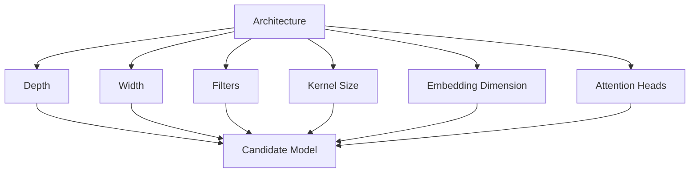

---

# 🧠 Hyperparameter Search Space

Before tuning, define a search space.

For example:

```python
search_space = {
    "learning_rate": [
        1e-4,
        3e-4,
        1e-3
    ],

    "batch_size": [
        32,
        64,
        128
    ],

    "weight_decay": [
        1e-5,
        1e-4,
        1e-3
    ],

    "dropout": [
        0.1,
        0.3,
        0.5
    ]
}
```

A search space should be:

- Meaningful
- Computationally manageable
- Based on domain knowledge

---

# 🧠 Grid Search

Grid Search evaluates every combination in a predefined search space.

Suppose:

```text
Learning Rate = 3 values
Batch Size    = 3 values
Dropout       = 3 values
```

Then:

\[
3\times3\times3=27
\]

experiments are required.

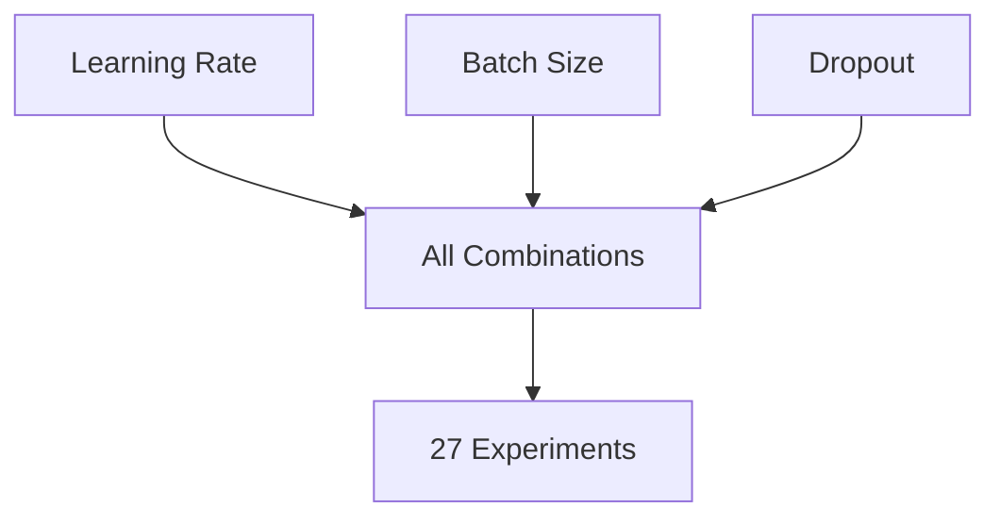

---

# ⚠ Grid Search Problem

Grid Search becomes expensive quickly.

For:

```text
5 hyperparameters
```

with:

```text
5 values each
```

the search requires:

\[
5^5=3125
\]

experiments.

This can be impractical for Deep Learning.

---

# 🎲 Random Search

Random Search samples configurations randomly from the search space.

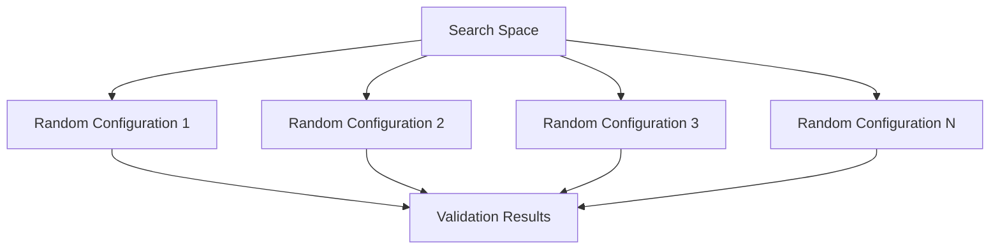

Random Search is often more efficient than Grid Search when only a subset of hyperparameters strongly affects performance.

---

# 🧠 Why Random Search Can Be Better

Suppose only:

```text
Learning Rate
```

strongly affects performance.

Grid Search wastes many experiments varying less important parameters.

Random Search explores more distinct learning-rate values.

```text
Grid Search

X X X X
X X X X
X X X X
X X X X


Random Search

  X
      X

 X       X

     X

          X
```

---

# 🧠 Bayesian Optimization

Bayesian Optimization uses previous experiment results to guide future experiments.

Instead of sampling blindly:

```text
Experiment
    ↓
Result
    ↓
Update Search Model
    ↓
Choose Next Configuration
```

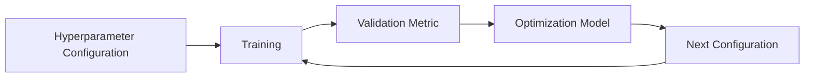

This makes Bayesian Optimization useful when:

- Experiments are expensive
- Search spaces are large
- Each evaluation takes significant time

---

# 🧠 Hyperband

Hyperband allocates more resources to promising configurations and stops poor configurations early.

Conceptually:

```text
Many Configurations
        ↓
Short Training
        ↓
Remove Poor Models
        ↓
Continue Promising Models
        ↓
Longer Training
        ↓
Best Candidates
```

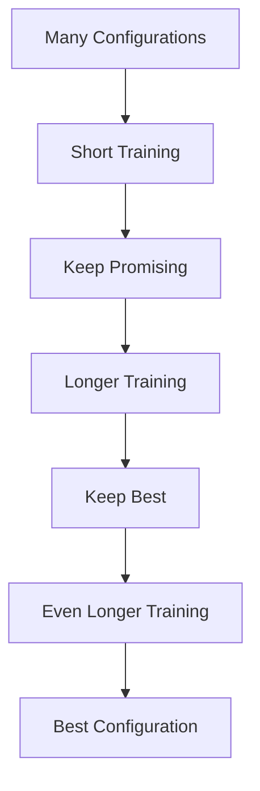

This can dramatically reduce wasted compute.

---

# ⚡ Early Stopping During Tuning

Early Stopping is especially valuable during hyperparameter tuning.

Suppose one experiment is clearly failing:

```text
Epoch 1 → Poor
Epoch 2 → Poor
Epoch 3 → Poor
Epoch 4 → Poor
```

There may be little value in running it for:

```text
100 epochs
```

Instead:

```text
Stop Early
   ↓
Free GPU
   ↓
Start Another Experiment
```

---

# 🧠 Multi-Fidelity Optimization

Multi-fidelity methods evaluate configurations using different amounts of resources.

For example:

```text
Trial A → 5 epochs
Trial B → 5 epochs
Trial C → 5 epochs
Trial D → 5 epochs

      ↓

Keep A + C

      ↓

20 epochs

      ↓

Keep C

      ↓

100 epochs
```

This allows compute to focus on promising candidates.

---

# 🧪 Hyperparameter Tuning Workflow

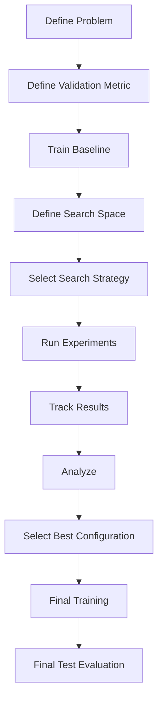

---

# 🎯 Start with a Baseline

Before tuning, build a baseline.

For example:

```text
Optimizer: AdamW
Learning Rate: 1e-3
Batch Size: 32
Weight Decay: 1e-4
Dropout: 0.2
Epochs: 30
```

Measure:

```text
Training Loss
Validation Loss
Training Accuracy
Validation Accuracy
Training Time
```

Without a baseline, it becomes difficult to determine whether tuning actually helped.

---

# 🧠 Tune One Group at a Time

A practical strategy is to tune hyperparameters in stages.

### Stage 1

```text
Learning Rate
Optimizer
```

### Stage 2

```text
Batch Size
Scheduler
```

### Stage 3

```text
Weight Decay
Dropout
```

### Stage 4

```text
Architecture
```

### Stage 5

```text
Data Augmentation
```

This reduces the search complexity.

---

# 🧪 Controlled Experimentation

Avoid changing everything simultaneously.

Bad experiment:

```text
Adam
→ AdamW
→ Batch 32 → 128
→ LR 1e-3 → 1e-5
→ Dropout 0.1 → 0.5
→ New Architecture
```

If performance improves, you do not know why.

Better:

```text
Baseline
   ↓
Change LR
   ↓
Compare
   ↓
Keep Best
   ↓
Change Batch Size
   ↓
Compare
```

---

# 🧠 Experiment Tracking

Every training experiment should record:

```text
Experiment ID
Model Version
Dataset Version
Learning Rate
Batch Size
Optimizer
Weight Decay
Dropout
Scheduler
Epochs
Training Time
Validation Metrics
Test Metrics
Git Commit
Random Seed
```

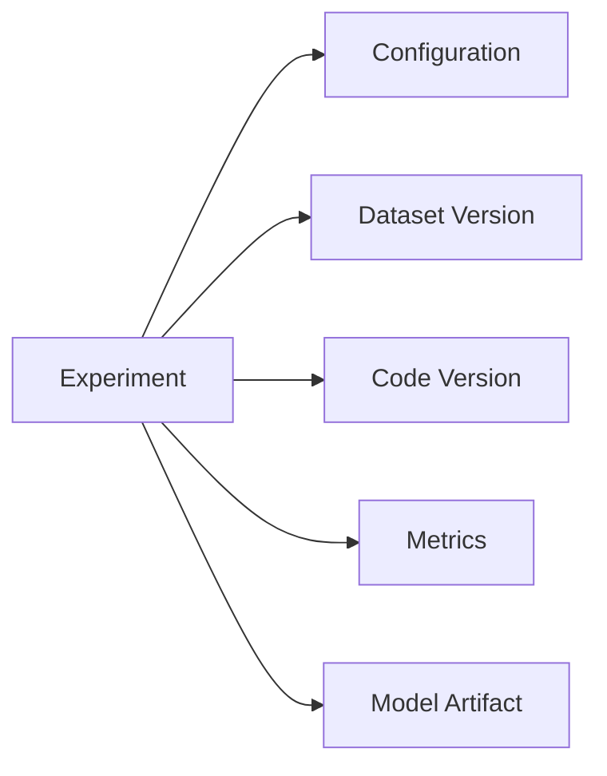

---

# 🧠 Why Experiment Tracking Matters

Without tracking:

```text
Experiment A
Experiment B
Experiment C
Experiment D
```

may become difficult to distinguish.

With tracking:

```text
Experiment 42
LR = 3e-4
Batch = 64
AdamW
WD = 1e-4
Val F1 = 0.91
```

The result becomes reproducible.

---

# 🧪 Keras Hyperparameter Configuration

A simple configuration approach:

```python
config = {
    "learning_rate": 3e-4,
    "batch_size": 64,
    "weight_decay": 1e-4,
    "dropout": 0.2,
    "epochs": 50
}
```

Use it to build the optimizer:

```python
optimizer = tf.keras.optimizers.AdamW(
    learning_rate=config["learning_rate"],
    weight_decay=config["weight_decay"]
)
```

---

# 🧪 PyTorch Hyperparameter Configuration

```python
config = {
    "learning_rate": 3e-4,
    "batch_size": 64,
    "weight_decay": 1e-4,
    "dropout": 0.2,
    "epochs": 50
}
```

Optimizer:

```python
optimizer = torch.optim.AdamW(
    model.parameters(),
    lr=config["learning_rate"],
    weight_decay=config["weight_decay"]
)
```

---

# 🧠 Configuration-Driven Training

A production training system should avoid hardcoding values throughout the code.

Prefer:

```text
Configuration
      ↓
Training Pipeline
      ↓
Model
      ↓
Optimizer
      ↓
Scheduler
```

rather than:

```text
learning_rate = 0.0003
```

being scattered across multiple files.

---

# 🧠 Training Configuration Example

```python
training_config = {
    "optimizer": "adamw",
    "learning_rate": 3e-4,
    "weight_decay": 1e-4,
    "batch_size": 64,
    "epochs": 50,
    "warmup_steps": 1000,
    "gradient_clip_norm": 1.0,
    "mixed_precision": True
}
```

This configuration can be version-controlled.

---

# 🧠 Validation Strategy

Validation data should be used for:

- Hyperparameter tuning
- Early Stopping
- Model selection
- Architecture selection

Test data should generally not be used for repeated tuning decisions.

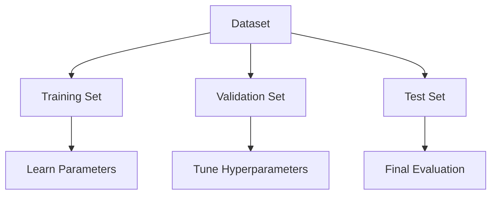

---

# ⚠ Test Set Contamination

If you repeatedly evaluate the test set and make decisions based on its results:

```text
Test Set
   ↓
Evaluation
   ↓
Decision
   ↓
Change Model
   ↓
Test Again
```

the test set effectively becomes part of the tuning process.

This weakens its value as an unbiased final evaluation.

---

# 🧠 Cross-Validation in Deep Learning

Traditional k-fold cross-validation can be expensive for Deep Learning.

For example:

```text
5 folds
×
20 training runs
=
100 training runs
```

This may be computationally expensive.

Therefore, many Deep Learning workflows use:

```text
Train
Validation
Test
```

instead of full k-fold cross-validation.

Cross-validation can still be useful when:

- Dataset is small
- Training is relatively cheap
- Variance estimation is important
- Dataset structure requires careful validation

---

# 🧠 Stratified Splitting

For classification problems, maintain class proportions across splits when appropriate.

For example:

```text
Dataset

Class A = 60%
Class B = 30%
Class C = 10%
```

A stratified split attempts to preserve similar proportions.

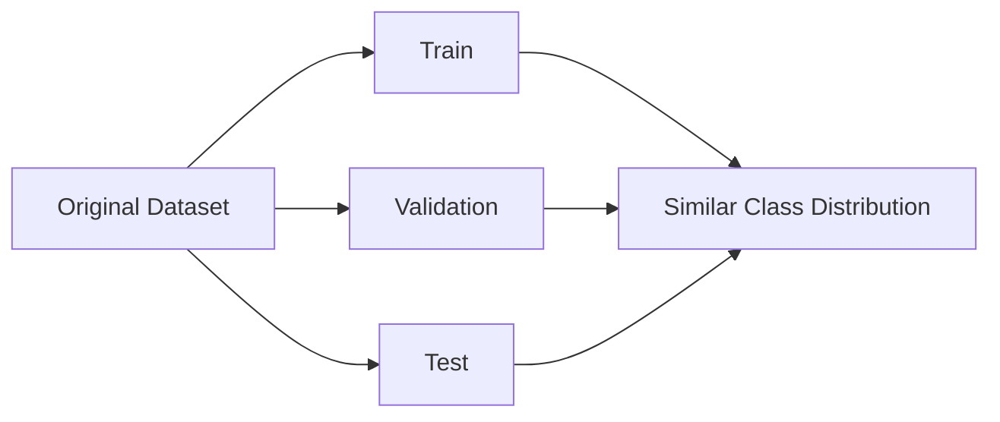

---

# 🕒 Time-Series Validation

For time-dependent data, random splitting may leak future information into training.

Instead:

```text
Past
 ↓
Training

Later
 ↓
Validation

Future
 ↓
Test
```

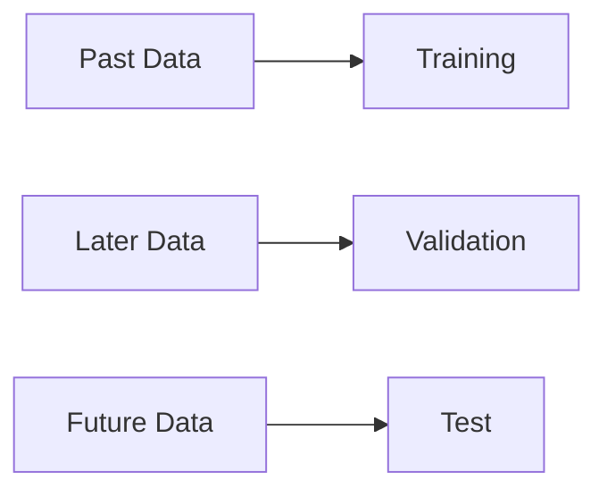

This better represents real-world forecasting.

---

# 🧠 Hyperparameter Tuning and Data Leakage

Hyperparameter tuning must respect the data boundary.

Incorrect:

```text
Train + Validation + Test
        ↓
Tune
```

Correct:

```text
Train
  ↓
Tune using Validation
  ↓
Freeze Configuration
  ↓
Evaluate Test
```

---

# 🧪 Checkpointing

During training, save the best model based on validation performance.

```python
checkpoint = tf.keras.callbacks.ModelCheckpoint(
    "best_model.keras",
    monitor="val_loss",
    save_best_only=True
)
```

This ensures that the final model is not necessarily the model from the final epoch.

---

# 🐍 PyTorch Checkpointing

```python
if val_loss < best_val_loss:

    best_val_loss = val_loss

    torch.save(
        {
            "model_state": model.state_dict(),
            "optimizer_state": optimizer.state_dict(),
            "epoch": epoch,
            "val_loss": val_loss
        },
        "best_checkpoint.pt"
    )
```

---

# 🔄 Resuming Training

A complete checkpoint should ideally contain:

```text
Model State
Optimizer State
Scheduler State
Epoch / Step
Best Metric
Configuration
```

This allows training to resume consistently.

---

# 🧠 Random Seeds and Reproducibility

Training can vary between runs because of:

- Random initialization
- Data shuffling
- Augmentation
- GPU operations
- Parallelism

Set seeds where appropriate.

```python
import random
import numpy as np
import torch


random.seed(42)
np.random.seed(42)
torch.manual_seed(42)
```

For GPU-based workloads, additional framework-specific settings may be required.

---

# ⚠ Reproducibility Is Not Always Absolute

Even with fixed seeds, exact reproducibility can be difficult because of:

- Hardware differences
- CUDA versions
- Framework versions
- Non-deterministic GPU operations
- Distributed training
- Different numerical precision

Therefore, record the environment as well as the seed.

---

# 📊 Training Metrics

Do not optimize only one metric blindly.

Depending on the task, track:

### Classification

```text
Accuracy
Precision
Recall
F1
ROC-AUC
PR-AUC
Log Loss
```

### Regression

```text
MAE
MSE
RMSE
R²
```

### Generative Models

Depending on the task:

```text
Task-specific quality metrics
Human evaluation
Perplexity
Similarity metrics
Safety metrics
```

---

# 🧠 Metric Selection

The metric should reflect the actual business objective.

For an imbalanced classification problem:

```text
Accuracy
```

may be misleading.

Instead, metrics such as:

```text
Precision
Recall
F1
PR-AUC
```

may be more appropriate.

---

# 🏢 Enterprise Training Objective

A production model should not be selected purely on validation accuracy.

A broader objective may include:

```text
Model Quality
+
Latency
+
Memory
+
Training Cost
+
Inference Cost
+
Reliability
```

For example:

```text
Model A
Accuracy = 94%
Latency = 50 ms

Model B
Accuracy = 95%
Latency = 900 ms
```

Model A may be preferable for a real-time production system.

---

# ⚖️ Multi-Objective Optimization

Production model selection may involve multiple objectives.

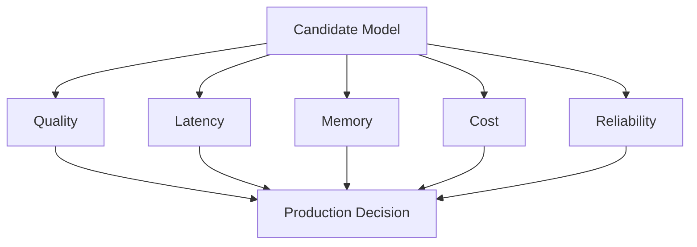

This is particularly important for enterprise AI systems.

---

# 💰 Cost-Aware Hyperparameter Tuning

Deep Learning experiments consume:

- GPU time
- CPU time
- Storage
- Network bandwidth
- Engineering time

A search strategy should therefore consider:

```text
Expected Improvement
        vs
Compute Cost
```

For example:

```text
Trial A
2 hours
Val F1 = 0.88

Trial B
2 hours
Val F1 = 0.89

Trial C
20 hours
Val F1 = 0.891
```

The tiny improvement from C may not justify the additional cost.

---

# 🧠 Efficient Search Strategy

A practical strategy:

```text
1. Build Baseline
        ↓
2. Identify Important Hyperparameters
        ↓
3. Define Reasonable Search Space
        ↓
4. Run Cheap Experiments
        ↓
5. Eliminate Poor Configurations
        ↓
6. Increase Training Budget
        ↓
7. Fine-Tune Best Candidates
        ↓
8. Final Training
```

---

# 🚀 Hyperparameter Tuning at Scale

For large projects, use a tuning service or experiment orchestration system.

Conceptually:

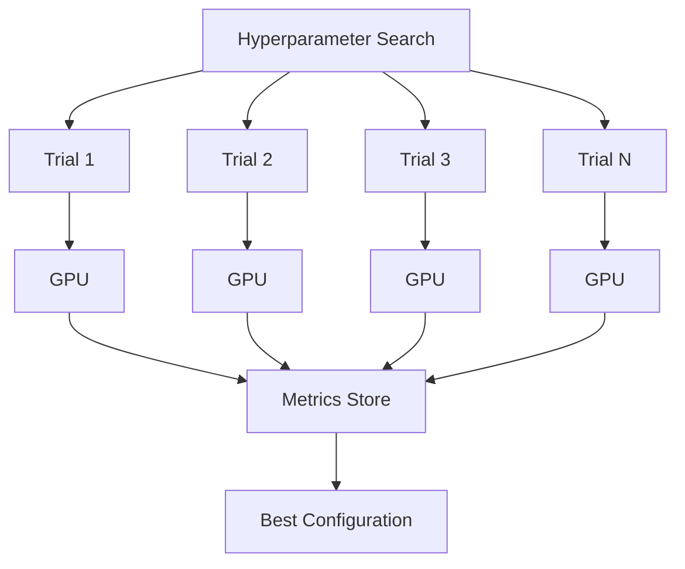

Cloud ML platforms can automate this process.

---

# 🧠 Hyperparameter Tuning with Transfer Learning

When using a pretrained model, tuning often starts with:

```text
Freeze Backbone
      ↓
Train Classification Head
      ↓
Tune Head
      ↓
Unfreeze Selected Layers
      ↓
Lower Learning Rate
      ↓
Fine-Tune
```

This is especially useful for Computer Vision.

---

# 🧠 Fine-Tuning Hyperparameters

Important parameters include:

```text
Backbone Learning Rate
Head Learning Rate
Number of Unfrozen Layers
Weight Decay
Batch Size
Augmentation
Scheduler
```

Often:

```text
Fine-Tuning LR
<
Initial Training LR
```

because pretrained representations should be changed more carefully.

---

# 🧪 Practical Experiment — Learning Rate Sweep

Build a small learning-rate experiment:

```python
learning_rates = [
    1e-5,
    3e-5,
    1e-4,
    3e-4,
    1e-3
]
```

Train each model for a small number of epochs.

Compare:

```text
Validation Loss
Validation Accuracy
Training Stability
```

Select a promising region rather than assuming the first successful value is optimal.

---

# 🧪 Practical Experiment — Batch Size

Compare:

```text
Batch = 16
Batch = 32
Batch = 64
Batch = 128
```

Record:

```text
Training Time
GPU Memory
Validation Performance
Convergence
```

This demonstrates the systems-level impact of batch size.

---

# 🧪 Practical Experiment — Search Strategy

Compare:

```text
Grid Search
Random Search
Bayesian Optimization
```

Use the same approximate compute budget.

Compare:

```text
Best Validation Score
Number of Experiments
Compute Cost
Time to Best Result
```

---

# 🧠 Hyperparameter Interaction

Hyperparameters are not independent.

Examples:

```text
Learning Rate ↔ Batch Size

Learning Rate ↔ Optimizer

Learning Rate ↔ Scheduler

Batch Size ↔ GPU Memory

Weight Decay ↔ Optimizer

Dropout ↔ Model Capacity

Architecture ↔ Learning Rate
```

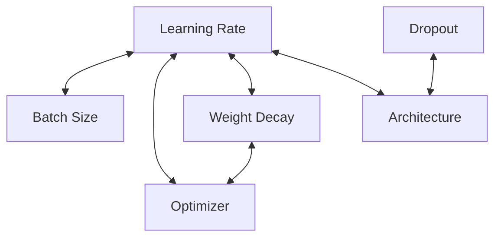

This is why naive one-variable-at-a-time tuning may not always find the best configuration.

---

# 🧠 Hyperparameter Sensitivity

Some hyperparameters are more sensitive than others.

For example:

```text
Learning Rate
████████████████████

Weight Decay
██████████

Dropout
██████

Hidden Units
████
```

The exact sensitivity depends on the task.

A good tuning strategy prioritizes high-impact hyperparameters first.

---

# 📈 Hyperparameter Importance

After running many experiments, analyze which parameters correlate with improved performance.

For example:

```text
Learning Rate
      ↓
Strong Effect

Batch Size
      ↓
Moderate Effect

Dropout
      ↓
Small Effect
```

This can help narrow future search spaces.

---

# 🧠 Overfitting During Hyperparameter Tuning

There is another form of overfitting:

> **Overfitting to the validation set.**

If thousands of configurations are evaluated against the same validation set, the tuning process may gradually optimize for quirks in that validation set.

Therefore:

```text
Validation Set
       ↓
Repeated Tuning
       ↓
Potential Validation Overfitting
```

A final untouched test set remains important.

---

# 🔐 Nested Evaluation Concept

For high-stakes evaluation, a nested validation strategy can help separate:

```text
Hyperparameter Selection
```

from:

```text
Final Performance Estimation
```

Conceptually:

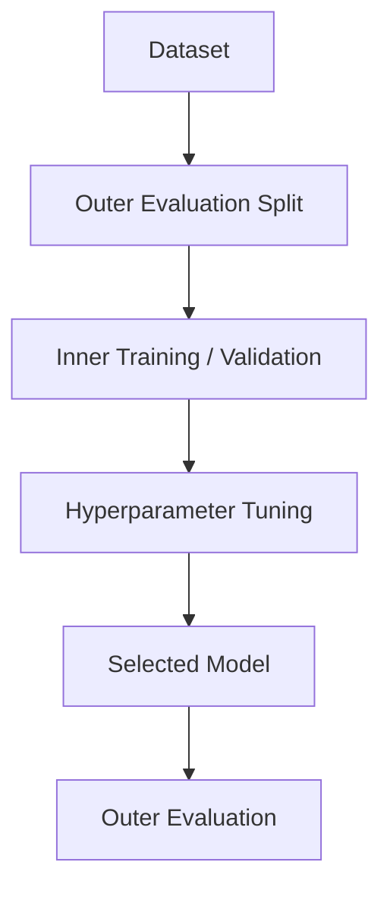

This can be computationally expensive and is therefore more common in research or high-stakes evaluation than everyday Deep Learning training.

---

# 🏢 Production Training Strategy

A production-oriented workflow should look like:

```text
Problem Definition
       ↓
Dataset Version
       ↓
Baseline Model
       ↓
Controlled Experiments
       ↓
Hyperparameter Search
       ↓
Validation
       ↓
Model Selection
       ↓
Final Training
       ↓
Test Evaluation
       ↓
Model Registry
       ↓
Deployment
```

---

# 🔄 End-to-End Training Lifecycle


---

!!! tip "Production Insight"

    **Hyperparameter tuning should be treated as an experiment-management problem, not simply a search problem.**

    A good production training system should make every experiment:

    ```text
    Reproducible
    Observable
    Comparable
    Versioned
    Cost-aware
    ```
    
    The objective is not to run the maximum number of experiments.

    The objective is to obtain the best model **within acceptable quality, latency, memory, and compute-cost constraints**.

---

!!! note "Important Distinction"

    Keep these concepts separate:

    ```text
    Parameters
    ↓
    Learned from training data

    Hyperparameters
    ↓
    Configuration selected before / during training

    Validation Set
    ↓
    Used for model and hyperparameter decisions

    Test Set
    ↓
    Used for final evaluation

    Experiment Tracking
    ↓
    Records what was trained and how
    ```

---

# ⚠ Common Mistakes

Avoid these common mistakes:

- Tuning without establishing a baseline
- Searching an unnecessarily huge space
- Using Grid Search blindly
- Tuning only one hyperparameter while ignoring interactions
- Changing too many variables without controlled experiments
- Using the test set during tuning
- Ignoring validation overfitting
- Using inappropriate validation splits
- Ignoring class imbalance
- Randomly splitting time-series data
- Ignoring learning-rate and batch-size interactions
- Ignoring optimizer state memory
- Running every trial for the maximum number of epochs
- Failing to use Early Stopping during expensive searches
- Not checkpointing the best model
- Not tracking dataset versions
- Not tracking code versions
- Not tracking random seeds
- Comparing experiments with different datasets
- Selecting a model only by accuracy
- Ignoring inference latency
- Ignoring GPU memory
- Ignoring training cost
- Assuming the best validation score automatically represents the best production model

---

# 🧪 Practical Project

## Build a Hyperparameter Tuning Pipeline

Create a small training framework that supports:

```text
Configuration
      ↓
Dataset
      ↓
Model Factory
      ↓
Optimizer Factory
      ↓
Scheduler
      ↓
Training
      ↓
Validation
      ↓
Checkpoint
      ↓
Metrics
```

The configuration should control:

```python
config = {
    "learning_rate": 3e-4,
    "batch_size": 64,
    "optimizer": "adamw",
    "weight_decay": 1e-4,
    "dropout": 0.2,
    "epochs": 50,
    "scheduler": "cosine",
    "gradient_clip_norm": 1.0
}
```

Then run multiple configurations and compare them systematically.

---

# 🧠 Suggested Experiment Table

Maintain a table similar to:

| Experiment | LR | Batch | Optimizer | WD | Dropout | Scheduler | Val Loss | Val F1 | Time |
|---|---:|---:|---|---:|---:|---|---:|---:|---:|
| EXP-001 | 1e-3 | 32 | AdamW | 1e-4 | 0.2 | None | - | - | - |
| EXP-002 | 3e-4 | 32 | AdamW | 1e-4 | 0.2 | Cosine | - | - | - |
| EXP-003 | 3e-4 | 64 | AdamW | 1e-4 | 0.2 | Cosine | - | - | - |
| EXP-004 | 3e-4 | 64 | SGD | 1e-4 | 0.2 | Cosine | - | - | - |

The important point is that every experiment has a traceable configuration.

---

# 🧠 Interview Questions

## Beginner

### 1. What is a hyperparameter?

A hyperparameter is a configuration value that controls the training process or model architecture and is not directly learned through backpropagation.

### 2. What is the difference between a parameter and a hyperparameter?

Parameters such as weights are learned during training, while hyperparameters such as learning rate and batch size are selected externally.

### 3. What is hyperparameter tuning?

It is the process of searching for a configuration that provides strong validation performance.

### 4. What is a learning rate?

The learning rate controls the magnitude of parameter updates.

### 5. What is batch size?

Batch size is the number of training examples processed before an optimizer update.

---

## Intermediate

### 6. Why is learning rate important?

It directly controls the size of optimization steps. An excessively large value can cause instability, while an excessively small value can make training extremely slow.

### 7. What is Grid Search?

Grid Search evaluates every predefined combination in a search space.

### 8. What is Random Search?

Random Search samples configurations randomly from the search space.

### 9. Why can Random Search outperform Grid Search?

When only a few hyperparameters strongly influence performance, Random Search can explore more meaningful values of those parameters for the same number of trials.

### 10. What is Bayesian Optimization?

Bayesian Optimization uses results from previous trials to guide selection of future configurations.

### 11. What is Hyperband?

Hyperband allocates training resources to promising configurations and terminates poor configurations early.

### 12. Why is Early Stopping useful during hyperparameter tuning?

It prevents poorly performing trials from consuming unnecessary compute.

---

## Advanced

### 13. Why should the test set not be used for hyperparameter tuning?

Because repeated tuning against the test set causes the model-development process to adapt to the test data, weakening its value as an unbiased final evaluation.

### 14. Why are learning rate and batch size related?

Changing batch size changes the gradient estimation and optimization dynamics, which can affect the appropriate learning rate.

### 15. What is multi-fidelity optimization?

It evaluates many configurations using small resource budgets and progressively allocates more resources to promising candidates.

### 16. What is validation overfitting?

It occurs when repeated hyperparameter tuning gradually adapts the model-selection process to quirks of the validation set.

### 17. Why is experiment tracking important?

It allows configurations, datasets, code versions, metrics, and artifacts to be reproduced and compared.

### 18. How would you tune a Deep Learning model with limited GPU resources?

Use:

```text
Baseline
+
Small Search Space
+
Random/Bayesian Search
+
Early Stopping
+
Checkpointing
+
Multi-Fidelity Evaluation
```

### 19. How would you choose the best production model?

Consider more than validation quality:

```text
Quality
+
Latency
+
Memory
+
Reliability
+
Training Cost
+
Inference Cost
```

### 20. Why might full cross-validation be impractical for Deep Learning?

Because training large neural networks multiple times can require substantial compute and time.

---

# 📌 Key Takeaways

- Hyperparameters control how Deep Learning models are trained.
- Model parameters are learned from data.
- Learning rate is often one of the most influential hyperparameters.
- Batch size affects gradient noise, memory usage, throughput, and optimization behavior.
- Learning rate and batch size should often be tuned together.
- Optimizer selection is itself a hyperparameter.
- Weight decay and Dropout control regularization strength.
- Architecture introduces additional hyperparameters.
- Grid Search can become computationally expensive.
- Random Search is often more efficient for high-dimensional search spaces.
- Bayesian Optimization uses previous experiment results to guide future trials.
- Hyperband and multi-fidelity strategies reduce wasted compute.
- Early Stopping is extremely useful during tuning.
- A baseline should be established before large-scale tuning.
- Hyperparameter tuning should use validation data rather than the test set.
- Repeated tuning can cause overfitting to the validation set.
- Cross-validation can be expensive for Deep Learning.
- Experiment tracking is essential for reproducibility.
- Dataset and code versions should be recorded with training experiments.
- Production model selection should consider quality, latency, memory, and cost.
- Hyperparameters interact with each other.
- The best tuning strategy is usually systematic, controlled, measurable, and cost-aware.

---

# 📚 Further Reading

Continue with:

- **[13. TensorFlow and Keras Fundamentals](13-tensorflow-and-keras-fundamentals.md)**
- **[14. Keras Sequential and Functional API](14-keras-sequential-and-functional-api.md)**
- **[15. Custom Layers, Models and Training Loops](15-custom-layers-models-and-training-loops.md)**
- **[16. PyTorch Fundamentals and Tensors](16-pytorch-fundamentals-and-tensors.md)**
- **[17. PyTorch Autograd, Dataset and DataLoader](17-pytorch-autograd-dataset-and-dataloader.md)**
- **[35. GPU-Accelerated Deep Learning](35-gpu-accelerated-deep-learning.md)**
- **[36. Deep Learning Training and Model Lifecycle](36-deep-learning-training-and-model-lifecycle.md)**

The next phase moves from Deep Learning theory into practical framework engineering with **TensorFlow, Keras, and PyTorch**.

---

## ➡️ Next Chapter

**[13. TensorFlow and Keras Fundamentals](13-tensorflow-and-keras-fundamentals.md)**

---

> **Enterprise AI Engineering Handbook**  
> *Building Production-Grade Enterprise AI Systems — One Chapter at a Time.*