# 13. TensorFlow and Keras Fundamentals

> Learn the foundations of TensorFlow and Keras, understand tensors, computation, models, layers, datasets, training, evaluation, GPU acceleration, and the complete workflow for building Deep Learning models.

---

## 🎯 Learning Objectives

After completing this chapter, you will be able to:

- Explain what TensorFlow is
- Explain what Keras is
- Understand the relationship between TensorFlow and Keras
- Understand tensors and their dimensions
- Work with TensorFlow tensors
- Understand tensor shapes, ranks, and data types
- Perform basic tensor operations
- Understand broadcasting
- Understand TensorFlow computation
- Understand automatic differentiation at a high level
- Understand Keras layers and models
- Build models using Keras
- Compile and train Keras models
- Evaluate and predict using Keras models
- Understand the Keras training workflow
- Work with datasets using `tf.data`
- Build input pipelines
- Understand batching, shuffling, caching, and prefetching
- Understand callbacks
- Save and load Keras models
- Use GPUs for TensorFlow training
- Understand CPU vs GPU execution
- Understand model parameters and trainable parameters
- Understand inference vs training mode
- Build classification and regression models using Keras
- Understand when to use Sequential vs Functional API
- Prepare for advanced Keras topics covered in later chapters

---

## 📖 Overview

TensorFlow is an open-source framework for numerical computation and Machine Learning.

It provides:

- Tensor operations
- Automatic differentiation
- Neural network primitives
- GPU and accelerator support
- Data pipelines
- Model training
- Model serialization
- Distributed training capabilities

Keras is a high-level Deep Learning API that provides a simpler interface for building and training neural networks.

The modern TensorFlow ecosystem can be viewed as:

```text
TensorFlow
    │
    ├── Tensor Operations
    ├── Automatic Differentiation
    ├── GPU / Accelerator Execution
    ├── tf.data
    └── Keras
          │
          ├── Layers
          ├── Models
          ├── Losses
          ├── Metrics
          ├── Optimizers
          └── Training APIs
```

---

# 🧠 What Is TensorFlow?

TensorFlow is a framework for numerical computation and Machine Learning developed around tensor-based computation.

The fundamental data structure is the:

> **Tensor**

A tensor is a multidimensional array with a defined shape and data type.

Examples:

```text
Scalar
   ↓
Vector
   ↓
Matrix
   ↓
3D Tensor
   ↓
Higher-Dimensional Tensor
```

---

# 📐 Tensor Ranks

Tensor rank represents the number of dimensions of a tensor.

### Rank 0 — Scalar

```text
5
```

### Rank 1 — Vector

```text
[1, 2, 3]
```

### Rank 2 — Matrix

```text
[
  [1, 2],
  [3, 4]
]
```

### Rank 3

```text
[
  [
    [1, 2],
    [3, 4]
  ],
  [
    [5, 6],
    [7, 8]
  ]
]
```

Conceptually:

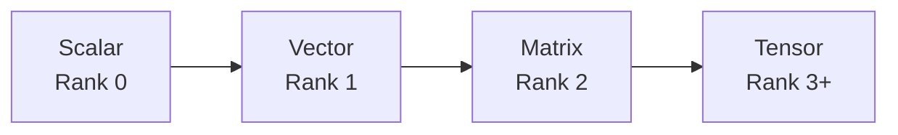

---

# 🧮 Tensor Terminology

Three concepts are particularly important:

```text
Rank
Shape
Data Type
```

For example:

```python
tensor.shape
```

might return:

```text
(32, 224, 224, 3)
```

This could represent:

```text
Batch Size = 32
Height     = 224
Width      = 224
Channels   = 3
```

---

# 🐍 Creating TensorFlow Tensors

```python
import tensorflow as tf


scalar = tf.constant(10)

vector = tf.constant(
    [1, 2, 3]
)

matrix = tf.constant(
    [
        [1, 2],
        [3, 4]
    ]
)

tensor = tf.constant(
    [
        [
            [1, 2],
            [3, 4]
        ],
        [
            [5, 6],
            [7, 8]
        ]
    ]
)
```

---

# 🔍 Inspecting a Tensor

```python
x = tf.constant(
    [
        [1, 2, 3],
        [4, 5, 6]
    ]
)

print(x)
print(x.shape)
print(x.dtype)
print(tf.rank(x))
```

Example:

```text
Shape:
(2, 3)

Rank:
2

Data Type:
int32
```

---

# 🧠 Tensor Shape

Tensor shape describes the size of each dimension.

For:

```python
x.shape
```

returning:

```text
(2, 3)
```

the tensor contains:

```text
2 rows
3 columns
```

For an image batch:

```text
(32, 224, 224, 3)
```

the dimensions commonly represent:

```text
Batch
Height
Width
Channels
```

---

# 🖼️ Image Tensor Representation

A typical RGB image can be represented as:

```text
Height × Width × Channels
```

For example:

```text
224 × 224 × 3
```

A batch of 32 images becomes:

```text
32 × 224 × 224 × 3
```

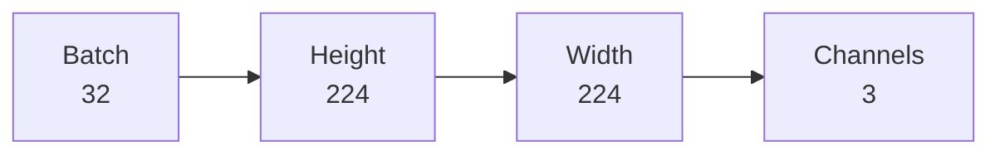

---

# 🧠 Tensor Data Types

TensorFlow supports multiple numeric data types.

Common examples include:

```text
float32
float64
int32
int64
uint8
bool
```

Deep Learning models commonly use:

```text
float32
```

while image data may initially be:

```text
uint8
```

---

# 🔄 Type Conversion

```python
image = tf.constant(
    [0, 128, 255],
    dtype=tf.uint8
)

image = tf.cast(
    image,
    tf.float32
)
```

This is important when preparing data for neural networks.

---

# 🧮 Tensor Operations

TensorFlow supports mathematical operations directly on tensors.

```python
a = tf.constant(
    [1, 2, 3]
)

b = tf.constant(
    [4, 5, 6]
)

print(a + b)
print(a - b)
print(a * b)
print(a / b)
```

---

# ✖️ Matrix Multiplication

Matrix multiplication is fundamental to neural networks.

```python
a = tf.constant(
    [
        [1, 2],
        [3, 4]
    ],
    dtype=tf.float32
)

b = tf.constant(
    [
        [5, 6],
        [7, 8]
    ],
    dtype=tf.float32
)

result = tf.matmul(
    a,
    b
)
```

Mathematically:

\[
C=AB
\]

---

# 📐 Tensor Reshaping

Tensor shape can often be changed without changing the underlying values.

```python
x = tf.constant(
    [
        [1, 2, 3],
        [4, 5, 6]
    ]
)

y = tf.reshape(
    x,
    (3, 2)
)
```

Original:

```text
2 × 3
```

New shape:

```text
3 × 2
```

---

# 🧩 Flattening

Flattening converts multiple dimensions into one.

```python
x = tf.constant(
    [
        [1, 2],
        [3, 4]
    ]
)

flat = tf.reshape(
    x,
    [-1]
)
```

Result:

```text
[1, 2, 3, 4]
```

This is frequently used when transitioning from convolutional layers to dense layers.

---

# 🔄 Broadcasting

TensorFlow supports broadcasting for compatible shapes.

For example:

```python
x = tf.constant(
    [
        [1, 2],
        [3, 4]
    ],
    dtype=tf.float32
)

y = tf.constant(
    [10, 20],
    dtype=tf.float32
)

result = x + y
```

Conceptually:

```text
[1, 2]       [10, 20]
[3, 4]   +   [10, 20]
```

Result:

```text
[11, 22]
[13, 24]
```

---

# 🧠 Why Tensors Matter in Deep Learning

Neural networks operate primarily on tensors.

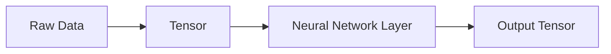

Examples:

```text
Images      → 4D tensors
Text        → 2D / 3D tensors
Audio       → 2D / 3D tensors
Video       → 5D tensors
Tabular     → 2D tensors
```

---

# 🧠 What Is Keras?

Keras is a high-level Deep Learning API designed to make neural network development easier and more readable.

It provides abstractions for:

- Layers
- Models
- Loss functions
- Optimizers
- Metrics
- Callbacks
- Training
- Evaluation
- Prediction

Instead of implementing every training operation manually, Keras provides a structured workflow.

---

# 🏗 Keras Model Architecture

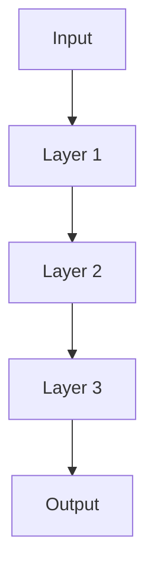

A Keras model is essentially a composition of layers connected according to an architecture.

---

# 🧱 Keras Layers

Common Keras layers include:

```text
Dense
Conv2D
MaxPooling2D
Flatten
Dropout
BatchNormalization
Embedding
LSTM
GRU
MultiHeadAttention
```

Example:

```python
dense = tf.keras.layers.Dense(
    128,
    activation="relu"
)
```

---

# 🧠 Dense Layer

A Dense layer performs an affine transformation followed by an optional activation.

\[
y=f(Wx+b)
\]

where:

- \(x\) = input
- \(W\) = weights
- \(b\) = bias
- \(f\) = activation function


---

# 🏗 Sequential Model

The simplest Keras model is the Sequential model.

```python
model = tf.keras.Sequential([

    tf.keras.layers.Dense(
        128,
        activation="relu"
    ),

    tf.keras.layers.Dense(
        64,
        activation="relu"
    ),

    tf.keras.layers.Dense(
        10,
        activation="softmax"
    )
])
```

This represents:

```text
Input
  ↓
Dense 128
  ↓
Dense 64
  ↓
Dense 10
  ↓
Output
```

The Sequential API is useful when the model is a simple linear stack of layers.

---

# 🧠 Input Shape

A model can explicitly define its input shape.

```python
model = tf.keras.Sequential([

    tf.keras.Input(
        shape=(784,)
    ),

    tf.keras.layers.Dense(
        128,
        activation="relu"
    ),

    tf.keras.layers.Dense(
        10,
        activation="softmax"
    )
])
```

Here:

```text
Input = 784 features
```

---

# 🧠 Keras Model Summary

Keras provides a useful model summary.

```python
model.summary()
```

Typical information includes:

```text
Layer
Output Shape
Number of Parameters
```

For example:

```text
Dense
(32, 128)
101,248 parameters
```

---

# 🧮 Trainable Parameters

For a Dense layer:

\[
Parameters
=
InputFeatures\times OutputFeatures
+
OutputFeatures
\]

For example:

```text
Input  = 784
Output = 128
```

Then:

\[
784\times128+128
=
100480
\]

This represents:

```text
Weights = 100352
Biases  = 128
Total   = 100480
```

---

# 🧠 Build → Compile → Fit → Evaluate → Predict

The basic Keras workflow is:

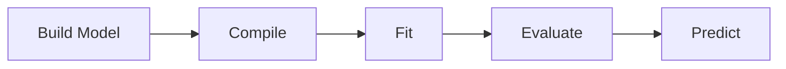

This is one of the most important workflows to remember.

---

# ⚙️ Compile

Before training, configure:

```text
Optimizer
Loss
Metrics
```

Example:

```python
model.compile(
    optimizer=tf.keras.optimizers.Adam(
        learning_rate=0.001
    ),
    loss="sparse_categorical_crossentropy",
    metrics=["accuracy"]
)
```

---

# 🏋️ Fit

Training is performed using:

```python
history = model.fit(
    X_train,
    y_train,
    epochs=20,
    batch_size=32,
    validation_data=(
        X_val,
        y_val
    )
)
```

---

# 📊 What Happens During `fit()`?

Conceptually:

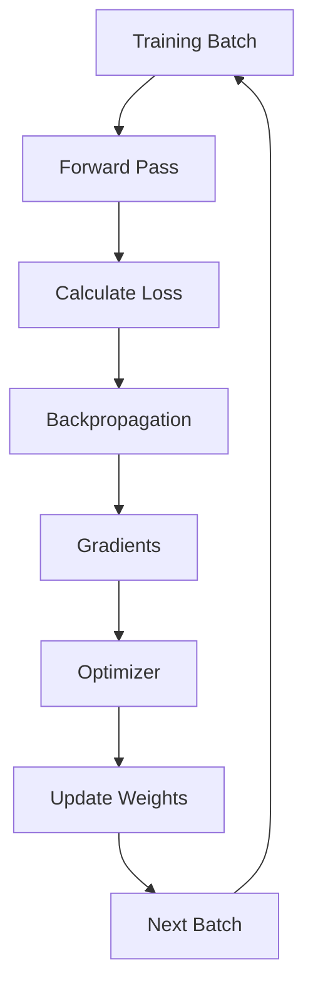

Keras handles much of this training loop automatically.

---

# 📉 Training History

The object returned by `fit()` contains training history.

```python
history.history.keys()
```

Typical values:

```text
loss
accuracy
val_loss
val_accuracy
```

---

# 📈 Plotting Training Curves

```python
import matplotlib.pyplot as plt


plt.figure(figsize=(10, 6))

plt.plot(
    history.history["loss"],
    label="Training Loss"
)

plt.plot(
    history.history["val_loss"],
    label="Validation Loss"
)

plt.xlabel("Epoch")
plt.ylabel("Loss")
plt.title("Training vs Validation Loss")

plt.legend()
plt.grid(True)

plt.show()
```

Training curves help identify:

```text
Underfitting
Overfitting
Good Convergence
Training Instability
```

---

# 🧪 Evaluate

After training:

```python
results = model.evaluate(
    X_test,
    y_test
)
```

This evaluates the model on unseen data.

---

# 🔮 Predict

Prediction:

```python
predictions = model.predict(
    X_test
)
```

For a classification model using Softmax:

```text
Output:

[
    0.02,
    0.01,
    0.91,
    0.06
]
```

The largest probability can be selected as the predicted class.

---

# 🧠 Classification Example

For a 10-class classification problem:

```python
model = tf.keras.Sequential([

    tf.keras.Input(
        shape=(784,)
    ),

    tf.keras.layers.Dense(
        128,
        activation="relu"
    ),

    tf.keras.layers.Dense(
        64,
        activation="relu"
    ),

    tf.keras.layers.Dense(
        10,
        activation="softmax"
    )
])
```

Compile:

```python
model.compile(
    optimizer="adam",
    loss="sparse_categorical_crossentropy",
    metrics=["accuracy"]
)
```

---

# 🧠 Regression Example

For regression, the output layer commonly has one unit with no classification activation.

```python
model = tf.keras.Sequential([

    tf.keras.Input(
        shape=(10,)
    ),

    tf.keras.layers.Dense(
        64,
        activation="relu"
    ),

    tf.keras.layers.Dense(
        32,
        activation="relu"
    ),

    tf.keras.layers.Dense(
        1
    )
])
```

Compile:

```python
model.compile(
    optimizer="adam",
    loss="mse",
    metrics=["mae"]
)
```

---

# 🧠 Classification vs Regression

| Problem | Output Layer | Typical Loss |
|---|---|---|
| Binary Classification | 1 + Sigmoid | Binary Cross-Entropy |
| Multi-Class Classification | N + Softmax | Categorical Cross-Entropy |
| Integer-Labeled Multi-Class | N + Softmax | Sparse Categorical Cross-Entropy |
| Regression | 1 or more linear outputs | MSE / MAE |

---

# 📦 TensorFlow `tf.data`

TensorFlow provides the `tf.data` API for building efficient input pipelines.

A basic pipeline:

```python
dataset = tf.data.Dataset.from_tensor_slices(
    (X_train, y_train)
)

dataset = dataset.shuffle(
    buffer_size=10000
)

dataset = dataset.batch(
    32
)

dataset = dataset.prefetch(
    tf.data.AUTOTUNE
)
```

---

# 🔄 `tf.data` Pipeline

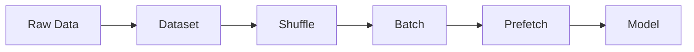

---

# 🔀 Shuffle

Shuffling helps prevent the model from learning unwanted ordering patterns.

```python
dataset = dataset.shuffle(
    buffer_size=10000
)
```

For training data, shuffling is generally useful.

For evaluation datasets, deterministic ordering is usually preferred.

---

# 📦 Batch

Batching groups examples together.

```python
dataset = dataset.batch(
    32
)
```

Conceptually:

```text
Dataset
   ↓
32 examples
   ↓
Model
   ↓
Gradient Update
```

---

# ⚡ Prefetch

Prefetching allows the input pipeline to prepare future batches while the model processes the current batch.

```python
dataset = dataset.prefetch(
    tf.data.AUTOTUNE
)
```

Conceptually:

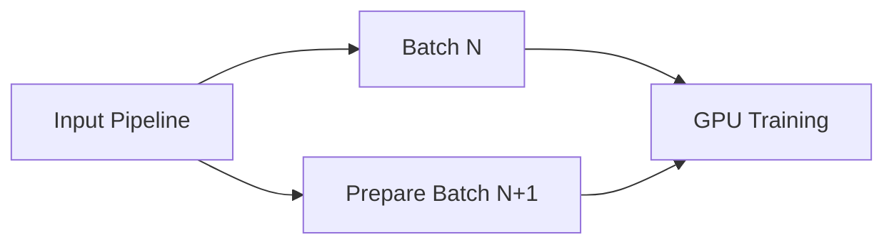

This can improve hardware utilization by reducing input pipeline waiting time.

---

# 💾 Cache

Caching can reduce repeated data-loading work.

```python
dataset = dataset.cache()
```

However, caching the entire dataset in memory may not be appropriate for large datasets.

Possible approaches include:

```text
Memory Cache
Disk Cache
No Cache
```

Choose based on dataset size and infrastructure.

---

# 🧠 Complete `tf.data` Pipeline

A common training pipeline:

```python
train_ds = (
    tf.data.Dataset
    .from_tensor_slices(
        (X_train, y_train)
    )
    .shuffle(10000)
    .batch(32)
    .prefetch(
        tf.data.AUTOTUNE
    )
)
```

Validation:

```python
val_ds = (
    tf.data.Dataset
    .from_tensor_slices(
        (X_val, y_val)
    )
    .batch(32)
    .prefetch(
        tf.data.AUTOTUNE
    )
)
```

---

# 🧠 Data Pipeline Performance

A production pipeline should aim for:

```text
Storage
   ↓
Data Loading
   ↓
Preprocessing
   ↓
Batching
   ↓
Prefetch
   ↓
GPU
```

The goal is to prevent:

```text
GPU waiting for data
```

---

# 🔌 Keras Callbacks

Callbacks allow additional behavior during training.

Common callbacks include:

```text
EarlyStopping
ModelCheckpoint
ReduceLROnPlateau
LearningRateScheduler
TensorBoard
```

---

# ⏹️ EarlyStopping

```python
early_stopping = tf.keras.callbacks.EarlyStopping(
    monitor="val_loss",
    patience=5,
    restore_best_weights=True
)
```

Use:

```python
model.fit(
    train_ds,
    validation_data=val_ds,
    epochs=100,
    callbacks=[
        early_stopping
    ]
)
```

---

# 💾 ModelCheckpoint

```python
checkpoint = tf.keras.callbacks.ModelCheckpoint(
    "best_model.keras",
    monitor="val_loss",
    save_best_only=True
)
```

This ensures that the best validation model can be preserved.

---

# 📉 ReduceLROnPlateau

```python
reduce_lr = tf.keras.callbacks.ReduceLROnPlateau(
    monitor="val_loss",
    factor=0.5,
    patience=3,
    min_lr=1e-6
)
```

This reduces the learning rate when validation performance stops improving.

---

# 📊 TensorBoard

TensorBoard provides tools for inspecting:

- Training metrics
- Loss curves
- Learning rates
- Histograms
- Model graphs
- Profiling information

Example:

```python
tensorboard = tf.keras.callbacks.TensorBoard(
    log_dir="./logs"
)
```

---

# 🧠 Complete Callback Configuration

```python
callbacks = [

    tf.keras.callbacks.EarlyStopping(
        monitor="val_loss",
        patience=5,
        restore_best_weights=True
    ),

    tf.keras.callbacks.ModelCheckpoint(
        "best_model.keras",
        monitor="val_loss",
        save_best_only=True
    ),

    tf.keras.callbacks.ReduceLROnPlateau(
        monitor="val_loss",
        factor=0.5,
        patience=3
    )
]
```

---

# 💾 Saving a Keras Model

Modern Keras supports saving complete models.

```python
model.save(
    "my_model.keras"
)
```

Load:

```python
loaded_model = tf.keras.models.load_model(
    "my_model.keras"
)
```

A complete model artifact can include:

```text
Architecture
Weights
Training Configuration
Optimizer State
```

depending on the saving configuration.

---

# 💾 Saving Weights Only

```python
model.save_weights(
    "model.weights.h5"
)
```

Load:

```python
model.load_weights(
    "model.weights.h5"
)
```

This is useful when the architecture is reconstructed separately.

---

# 🧠 Model Serialization Strategy

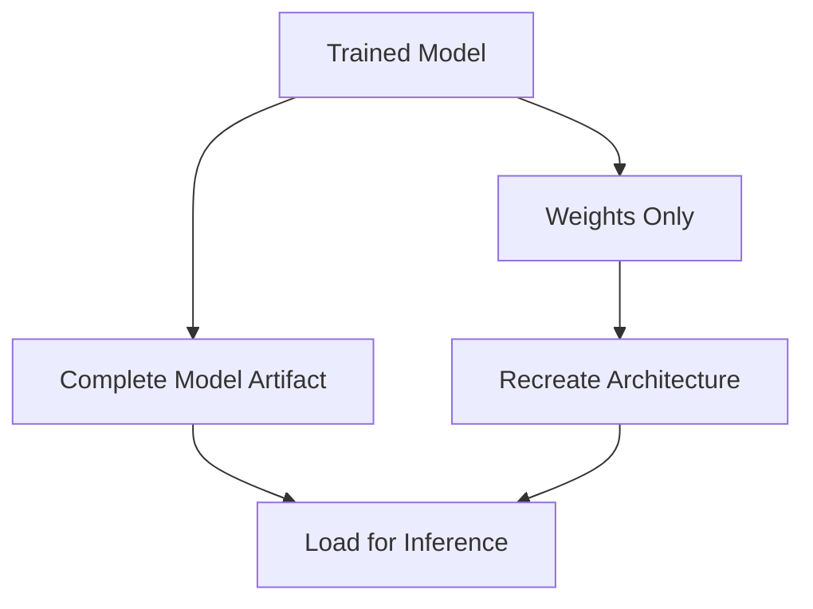

---

# 🖥️ CPU vs GPU

TensorFlow can execute operations on different devices.

Common devices include:

```text
CPU
GPU
TPU
```

For Deep Learning workloads:

```text
CPU
 ↓
General Purpose

GPU
 ↓
Highly Parallel Tensor Computation
```

---

# 🚀 Checking GPU Availability

```python
gpus = tf.config.list_physical_devices(
    "GPU"
)

print(gpus)
```

If a GPU is available, TensorFlow can often place supported operations on it automatically.

---

# 🔍 Inspecting Devices

```python
tf.config.list_physical_devices()
```

Possible output:

```text
[
    PhysicalDevice(
        name="/physical_device:CPU:0",
        device_type="CPU"
    ),
    PhysicalDevice(
        name="/physical_device:GPU:0",
        device_type="GPU"
    )
]
```

---

# 🧠 Explicit Device Placement

TensorFlow allows explicit device contexts.

```python
with tf.device("/GPU:0"):

    x = tf.random.normal(
        (1000, 1000)
    )

    y = tf.matmul(
        x,
        x
    )
```

In most applications, explicit placement is not necessary because TensorFlow's runtime can handle device placement.

---

# ⚡ GPU Training Pipeline


The CPU may prepare and feed data while the GPU performs tensor-heavy computation.

---

# 🧠 GPU Memory

GPU memory is a critical resource.

Memory is consumed by:

```text
Model Parameters
+
Gradients
+
Optimizer State
+
Activations
+
Input Batches
```

Therefore, increasing batch size may increase GPU memory consumption significantly.

---

# 🧠 Training vs Inference

Training requires:

```text
Forward Pass
+
Loss
+
Gradients
+
Optimizer State
```

Inference usually requires:

```text
Forward Pass
```

Therefore, training generally consumes considerably more memory.

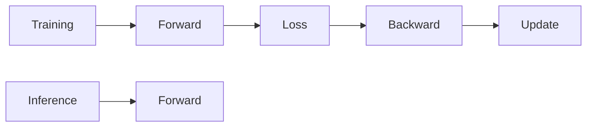

---

# 🧠 Trainable Parameters

Keras exposes model parameters through:

```python
model.trainable_variables
```

You can inspect them:

```python
for variable in model.trainable_variables:

    print(
        variable.name,
        variable.shape
    )
```

---

# 🔒 Freezing Layers

Layers can be frozen by setting:

```python
layer.trainable = False
```

This is particularly important for Transfer Learning.

Example:

```python
for layer in base_model.layers:

    layer.trainable = False
```

Transfer Learning is covered in:

**[21. Transfer Learning and Fine-Tuning](21-transfer-learning-and-fine-tuning.md)**

---

# 🧠 Keras Functional API Preview

The Functional API allows non-linear model structures.

For example:

```python
inputs = tf.keras.Input(
    shape=(784,)
)

x = tf.keras.layers.Dense(
    128,
    activation="relu"
)(inputs)

x = tf.keras.layers.Dense(
    64,
    activation="relu"
)(x)

outputs = tf.keras.layers.Dense(
    10,
    activation="softmax"
)(x)

model = tf.keras.Model(
    inputs=inputs,
    outputs=outputs
)
```

The Functional API is covered in detail in:

**[14. Keras Sequential and Functional API](14-keras-sequential-and-functional-api.md)**

---

# 🧠 Custom Training Loops Preview

Keras also allows custom training loops.

Conceptually:

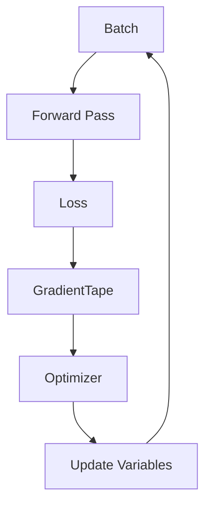

A simplified TensorFlow example:

```python
with tf.GradientTape() as tape:

    predictions = model(
        X_batch,
        training=True
    )

    loss = loss_fn(
        y_batch,
        predictions
    )

gradients = tape.gradient(
    loss,
    model.trainable_variables
)

optimizer.apply_gradients(
    zip(
        gradients,
        model.trainable_variables
    )
)
```

Custom models and training loops are covered in:

**[15. Custom Layers, Models and Training Loops](15-custom-layers-models-and-training-loops.md)**

---

# 🧠 Keras Model Lifecycle

A practical Keras lifecycle is:


---

# 🧪 Complete Example — Classification

```python
import tensorflow as tf


# Model
model = tf.keras.Sequential([

    tf.keras.Input(
        shape=(784,)
    ),

    tf.keras.layers.Dense(
        128,
        activation="relu"
    ),

    tf.keras.layers.Dropout(
        0.2
    ),

    tf.keras.layers.Dense(
        64,
        activation="relu"
    ),

    tf.keras.layers.Dense(
        10,
        activation="softmax"
    )
])


# Compile
model.compile(
    optimizer=tf.keras.optimizers.AdamW(
        learning_rate=3e-4,
        weight_decay=1e-4
    ),
    loss="sparse_categorical_crossentropy",
    metrics=["accuracy"]
)


# Callbacks
callbacks = [

    tf.keras.callbacks.EarlyStopping(
        monitor="val_loss",
        patience=5,
        restore_best_weights=True
    ),

    tf.keras.callbacks.ModelCheckpoint(
        "best_model.keras",
        monitor="val_loss",
        save_best_only=True
    )
]


# Train
history = model.fit(
    X_train,
    y_train,
    validation_data=(
        X_val,
        y_val
    ),
    epochs=50,
    batch_size=64,
    callbacks=callbacks
)


# Evaluate
model.evaluate(
    X_test,
    y_test
)
```

---

# 🧪 Complete Example — Regression

```python
import tensorflow as tf


model = tf.keras.Sequential([

    tf.keras.Input(
        shape=(10,)
    ),

    tf.keras.layers.Dense(
        128,
        activation="relu"
    ),

    tf.keras.layers.Dense(
        64,
        activation="relu"
    ),

    tf.keras.layers.Dense(
        1
    )
])


model.compile(
    optimizer=tf.keras.optimizers.AdamW(
        learning_rate=3e-4
    ),
    loss="mse",
    metrics=["mae"]
)


history = model.fit(
    X_train,
    y_train,
    validation_data=(
        X_val,
        y_val
    ),
    epochs=50,
    batch_size=64
)
```

---

# 🧪 Complete Example — `tf.data` + Keras

```python
train_ds = (
    tf.data.Dataset
    .from_tensor_slices(
        (X_train, y_train)
    )
    .shuffle(10000)
    .batch(64)
    .prefetch(
        tf.data.AUTOTUNE
    )
)


val_ds = (
    tf.data.Dataset
    .from_tensor_slices(
        (X_val, y_val)
    )
    .batch(64)
    .prefetch(
        tf.data.AUTOTUNE
    )
)


model.fit(
    train_ds,
    validation_data=val_ds,
    epochs=50
)
```

---

# 🧠 Production-Oriented TensorFlow Architecture

A production Deep Learning application should separate:

```text
Data
 ↓
Preprocessing
 ↓
Dataset Pipeline
 ↓
Model
 ↓
Training
 ↓
Evaluation
 ↓
Artifact
 ↓
Serving
```

A possible architecture:

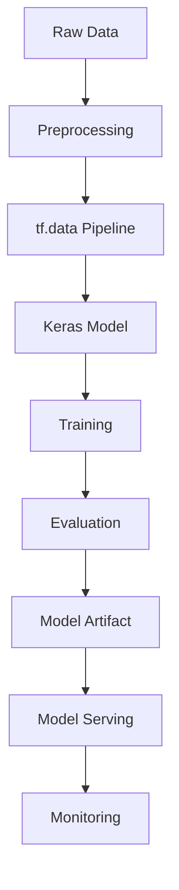

---

# 🏢 Enterprise Perspective

TensorFlow and Keras provide more than APIs for building neural networks.

They can serve as components of an enterprise Deep Learning platform:

```text
Data Engineering
       ↓
TensorFlow Data Pipeline
       ↓
Keras Model
       ↓
Training Infrastructure
       ↓
GPU / TPU
       ↓
Model Artifact
       ↓
Model Registry
       ↓
Serving
       ↓
Monitoring
```

For enterprise systems, the important concerns include:

- Reproducibility
- Dataset versioning
- Experiment tracking
- Model versioning
- Hardware utilization
- Training cost
- Model quality
- Deployment
- Monitoring
- Governance

---

!!! tip "Production Insight"

    **A Keras model is only one component of a production Deep Learning system.**

    A reliable system should connect:

    ```text
    Versioned Data
         ↓
    Reproducible Training
         ↓
    Versioned Model
         ↓
    Validated Artifact
         ↓
    Deployment
         ↓
    Monitoring
    ```

    Optimizing only the model while ignoring the data pipeline, hardware utilization, artifact management, and observability can create a fragile production system.

---

# ⚠ Common Mistakes

Avoid these common mistakes:

- Confusing TensorFlow with Keras
- Ignoring tensor shapes
- Mixing incompatible tensor data types
- Forgetting to normalize input data
- Using incorrect output activation functions
- Using the wrong loss function
- Forgetting validation data
- Training without monitoring validation metrics
- Ignoring GPU memory
- Using excessively large batch sizes
- Loading an entire large dataset into memory unnecessarily
- Failing to use efficient `tf.data` pipelines
- Applying augmentation incorrectly to validation/test data
- Saving only weights when the complete model artifact is required
- Forgetting to save the best checkpoint
- Not versioning the training configuration
- Assuming GPU usage automatically guarantees efficient training
- Ignoring CPU input-pipeline bottlenecks
- Treating training and inference as identical workloads
- Hardcoding hyperparameters throughout the codebase

---

# 🧠 Interview Questions

## Beginner

### 1. What is TensorFlow?

TensorFlow is a framework for tensor-based numerical computation and Machine Learning, providing automatic differentiation, neural-network primitives, hardware acceleration, and other ML capabilities.

### 2. What is Keras?

Keras is a high-level Deep Learning API that provides abstractions for building, training, evaluating, and deploying neural networks.

### 3. What is a tensor?

A tensor is a multidimensional array with a defined shape and data type.

### 4. What is tensor rank?

Tensor rank represents the number of dimensions of a tensor.

### 5. What is the difference between shape and rank?

Rank tells you how many dimensions a tensor has, while shape tells you the size of each dimension.

---

## Intermediate

### 6. What are the main steps in a Keras workflow?

```text
Build
 ↓
Compile
 ↓
Fit
 ↓
Evaluate
 ↓
Predict
```

### 7. What does `model.compile()` do?

It configures the optimizer, loss function, and metrics used by the training process.

### 8. What does `model.fit()` do?

It executes the training process over the supplied dataset for the specified number of epochs.

### 9. What is `tf.data`?

`tf.data` is TensorFlow's API for constructing input pipelines.

### 10. Why is `prefetch()` useful?

It allows future batches to be prepared while the current batch is being processed, potentially improving hardware utilization.

### 11. What is a Keras callback?

A callback is an object that can execute actions at specific points during training.

### 12. Why use `ModelCheckpoint`?

It allows the best or selected model state to be saved during training.

---

## Advanced

### 13. Why is tensor shape important?

Neural-network layers expect inputs with compatible dimensions. Incorrect shapes can cause runtime errors or produce incorrect model behavior.

### 14. Why can GPU training still be slow?

Potential bottlenecks include:

```text
Input Pipeline
CPU Preprocessing
GPU Memory
Small Batches
Data Transfer
Model Architecture
I/O
```

### 15. Why is `tf.data` important for production?

It can provide efficient batching, shuffling, caching, prefetching, and transformation pipelines that help keep training hardware utilized.

### 16. What is the difference between training and inference?

Training requires forward propagation, loss computation, backpropagation, and parameter updates. Inference generally requires only the forward pass.

### 17. Why is optimizer state important?

Optimizers such as Adam and AdamW maintain additional tensors, increasing memory requirements during training.

### 18. When should you use the Functional API instead of Sequential?

Use the Functional API when the architecture contains branching, multiple inputs/outputs, skip connections, shared layers, or other non-linear graph structures.

### 19. Why would you use a custom training loop?

Custom loops provide control over training behavior when the standard `fit()` workflow is insufficient for a particular research or production requirement.

### 20. How would you optimize a TensorFlow training pipeline?

Inspect:

```text
Input Pipeline
Batch Size
Prefetching
Caching
GPU Utilization
Mixed Precision
Model Complexity
Data Transfer
```

Then measure the actual bottleneck before optimizing.

---

# 🧪 Practical Exercises

## Exercise 1 — Tensor Fundamentals

Create tensors of:

```text
Rank 0
Rank 1
Rank 2
Rank 3
```

For each tensor, print:

```text
Value
Shape
Rank
Data Type
```

---

## Exercise 2 — Tensor Operations

Implement:

```text
Addition
Subtraction
Multiplication
Matrix Multiplication
Reshape
Transpose
Reduction
Broadcasting
```

Verify the resulting shapes.

---

## Exercise 3 — Build a Classification Model

Create a Keras model with:

```text
Input
 ↓
Dense
 ↓
ReLU
 ↓
Dense
 ↓
ReLU
 ↓
Dense
 ↓
Softmax
```

Train it on a classification dataset.

Track:

```text
Training Loss
Validation Loss
Training Accuracy
Validation Accuracy
```

---

## Exercise 4 — Build a Regression Model

Create a regression network using:

```text
Input
 ↓
Dense
 ↓
ReLU
 ↓
Dense
 ↓
ReLU
 ↓
Linear Output
```

Evaluate using:

```text
MSE
MAE
```

---

## Exercise 5 — Build a `tf.data` Pipeline

Create a pipeline using:

```text
from_tensor_slices()
shuffle()
batch()
prefetch()
```

Measure whether the training throughput changes when prefetching is enabled.

---

## Exercise 6 — GPU Training

Check:

```python
tf.config.list_physical_devices(
    "GPU"
)
```

Train the same model using:

```text
CPU
GPU
```

Compare:

```text
Training Time
Throughput
Memory Usage
```

---

## Exercise 7 — Callbacks

Train a model using:

```text
EarlyStopping
ModelCheckpoint
ReduceLROnPlateau
TensorBoard
```

Inspect the resulting training behavior.

---

# 📌 Key Takeaways

- TensorFlow provides tensor-based computation and Deep Learning infrastructure.
- Keras provides a high-level API for building and training neural networks.
- Tensors are the fundamental data structure used by Deep Learning systems.
- Tensor rank represents the number of dimensions.
- Tensor shape describes the size of each dimension.
- Data type determines how tensor values are represented.
- Matrix multiplication is fundamental to neural-network computation.
- Keras models are composed of layers.
- The basic Keras workflow is Build → Compile → Fit → Evaluate → Predict.
- `tf.data` provides efficient input-pipeline capabilities.
- Shuffling is generally useful for training data.
- Batching controls the number of examples processed per optimizer update.
- Prefetching can improve hardware utilization.
- Caching can reduce repeated data-loading work when used appropriately.
- Callbacks provide control over training behavior.
- Checkpointing preserves useful model states.
- Early Stopping can prevent unnecessary training.
- TensorFlow can use CPUs, GPUs, and other accelerators.
- GPU memory is consumed by parameters, gradients, optimizer state, activations, and input batches.
- Training generally requires more memory than inference.
- Sequential models are useful for simple linear stacks.
- More complex architectures should use the Functional API or custom model implementations.
- Efficient Deep Learning requires optimizing the complete pipeline, not only the neural network.

---

# 📚 Further Reading

Continue with:

- **[14. Keras Sequential and Functional API](14-keras-sequential-and-functional-api.md)**
- **[15. Custom Layers, Models and Training Loops](15-custom-layers-models-and-training-loops.md)**
- **[16. PyTorch Fundamentals and Tensors](16-pytorch-fundamentals-and-tensors.md)**
- **[17. PyTorch Autograd, Dataset and DataLoader](17-pytorch-autograd-dataset-and-dataloader.md)**
- **[18. Building Classification and Regression Models](18-building-classification-and-regression-models.md)**
- **[19. Convolutional Neural Networks](19-convolutional-neural-networks.md)**
- **[21. Transfer Learning and Fine-Tuning](21-transfer-learning-and-fine-tuning.md)**
- **[35. GPU-Accelerated Deep Learning](35-gpu-accelerated-deep-learning.md)**

The next chapter goes deeper into the two major Keras model-building approaches: the **Sequential API and Functional API**.

---

## ➡️ Next Chapter

**[14. Keras Sequential and Functional API](14-keras-seequential-and-functional-api.md)**

---

> **Enterprise AI Engineering Handbook**  
> *Building Production-Grade Enterprise AI Systems — One Chapter at a Time.*