# 14. Keras Sequential and Functional API

> Learn how to design Deep Learning models using Keras's Sequential and Functional APIs, understand when each approach should be used, build complex computation graphs, work with multiple inputs and outputs, reuse layers, implement skip connections, and design production-ready neural network architectures.

---

## 🎯 Learning Objectives

After completing this chapter, you will be able to:

- Understand the Keras Sequential API
- Understand the Keras Functional API
- Compare Sequential and Functional model construction
- Build simple neural networks using Sequential
- Build complex neural networks using the Functional API
- Understand Keras symbolic tensors
- Understand the relationship between inputs, layers, and outputs
- Build models with multiple inputs
- Build models with multiple outputs
- Reuse layers across different parts of a model
- Build branching architectures
- Build merging architectures
- Implement skip connections
- Understand residual-style connections
- Inspect Functional API model graphs
- Visualize model architecture
- Share layers between models
- Build reusable model components
- Understand model composition
- Understand when to choose Sequential, Functional API, or subclassing
- Design maintainable Keras architectures for enterprise Deep Learning systems

---

# 📖 Overview

Keras provides multiple ways to define neural network models.

The three major approaches are:

```text
Sequential API
      │
      ├── Simple linear stacks
      │
Functional API
      │
      ├── Complex computation graphs
      │
Model Subclassing
      │
      └── Maximum customization
```

The first two approaches are especially important for most Deep Learning applications.

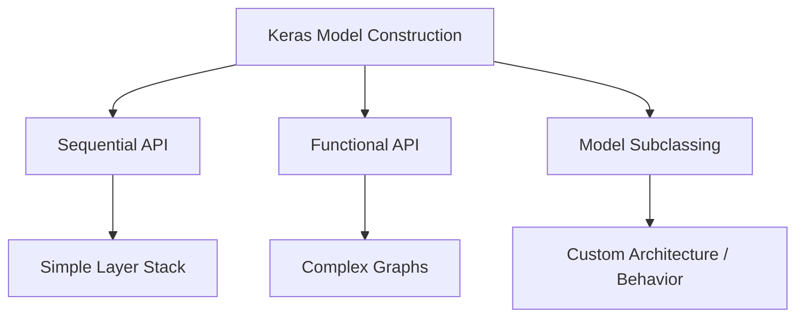

---

# 🧠 Why Multiple Model APIs?

Different neural networks have different architectural requirements.

A simple classifier may look like:

```text
Input
  ↓
Dense
  ↓
Dense
  ↓
Output
```

A more complex architecture may look like:

```text
             ┌── Dense ──┐
Input ───────┤            ├── Merge ── Output
             └── Dense ───┘
```

A residual network may contain:

```text
Input ────────────────┐
  ↓                   │
Layer                 │
  ↓                   │
Layer                 │
  ↓                   │
  └────── Add ◄───────┘
```

The Sequential API is ideal for the first case.

The Functional API is designed for the second and third cases.

---

# 🏗 Sequential API

The Sequential API represents a simple linear stack of layers.

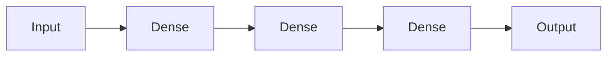

Each layer receives the output of the previous layer.

---

# 🧪 Basic Sequential Model

```python
import tensorflow as tf


model = tf.keras.Sequential([

    tf.keras.Input(
        shape=(784,)
    ),

    tf.keras.layers.Dense(
        128,
        activation="relu"
    ),

    tf.keras.layers.Dense(
        64,
        activation="relu"
    ),

    tf.keras.layers.Dense(
        10,
        activation="softmax"
    )
])
```

The architecture is:

```text
784 Features
     ↓
Dense(128)
     ↓
Dense(64)
     ↓
Dense(10)
     ↓
Softmax
```

---

# 🧠 Sequential Model Concept

The Sequential API can be viewed as:

\[
f(x)
=
f_n(
f_{n-1}(
...
f_2(
f_1(x)
)
...
)
)
\]


Each layer transforms the output of the previous layer.

---

# 🧱 Adding Layers

Layers can also be added incrementally.

```python
model = tf.keras.Sequential()

model.add(
    tf.keras.Input(
        shape=(784,)
    )
)

model.add(
    tf.keras.layers.Dense(
        128,
        activation="relu"
    )
)

model.add(
    tf.keras.layers.Dense(
        10,
        activation="softmax"
    )
)
```

---

# 🧠 When Sequential Works Well

Use Sequential when:

- The architecture is linear
- There is one input
- There is one output
- Every layer has exactly one input
- Every layer produces exactly one output
- There are no branching paths
- There are no skip connections

Typical examples:

```text
Simple Classification
Simple Regression
Basic MLP
Simple CNN
Basic Feed-Forward Network
```

---

# ⚠ Sequential API Limitations

Sequential becomes unsuitable when the architecture contains:

```text
Multiple Inputs
Multiple Outputs
Branching
Layer Sharing
Skip Connections
Non-linear Graphs
```

For these architectures, use the Functional API.

---

# 🧠 Functional API

The Functional API represents a neural network as a directed computation graph.

Instead of saying:

```python
model.add(layer)
```

we explicitly connect tensors:

```python
x = layer(inputs)
```

and finally create:

```python
model = tf.keras.Model(
    inputs=inputs,
    outputs=outputs
)
```

---

# 🏗 Functional API Architecture

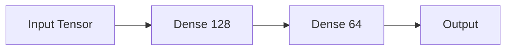

The important difference is that the engineer explicitly defines the graph.

---

# 🧪 Basic Functional API Model

```python
import tensorflow as tf


inputs = tf.keras.Input(
    shape=(784,)
)

x = tf.keras.layers.Dense(
    128,
    activation="relu"
)(inputs)

x = tf.keras.layers.Dense(
    64,
    activation="relu"
)(x)

outputs = tf.keras.layers.Dense(
    10,
    activation="softmax"
)(x)

model = tf.keras.Model(
    inputs=inputs,
    outputs=outputs
)
```

---

# 🧠 Functional API Mental Model

Think of:

```python
inputs
```

as the starting node.

Each layer:

```python
layer(x)
```

creates a new tensor.

Finally:

```python
outputs
```

becomes the endpoint.

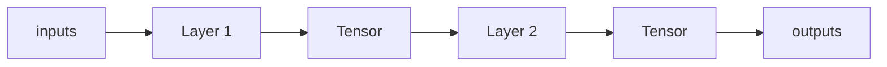

---

# 🧠 Symbolic Tensors

When using the Functional API:

```python
inputs = tf.keras.Input(
    shape=(784,)
)
```

`inputs` represents a symbolic tensor describing the expected computation.

It is not an actual batch of training data.

This distinction is important.

```text
Functional API

Symbolic Tensor
      ↓
Describes Computation
      ↓
Keras Builds Graph
```

During training:

```text
Actual Data
      ↓
Computation Graph
      ↓
Output
```

---

# 🧠 Sequential vs Functional

| Feature | Sequential | Functional |
|---|---:|---:|
| Simple layer stack | ✅ | ✅ |
| One input | ✅ | ✅ |
| One output | ✅ | ✅ |
| Multiple inputs | ❌ | ✅ |
| Multiple outputs | ❌ | ✅ |
| Branching | ❌ | ✅ |
| Skip connections | ❌ | ✅ |
| Layer sharing | ❌ | ✅ |
| Complex graph | ❌ | ✅ |
| Easy to read | ✅ | ✅ |
| Complex architectures | ❌ | ✅ |

---

# 🏗 Branching Architecture

Suppose an input should pass through two different paths.

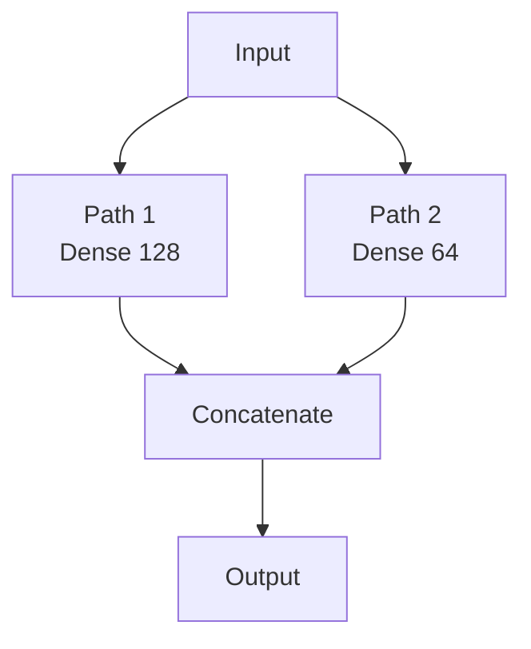

This cannot naturally be represented as a simple Sequential stack.

The Functional API handles it directly.

---

# 🧪 Branching Example

```python
inputs = tf.keras.Input(
    shape=(100,)
)

branch_1 = tf.keras.layers.Dense(
    128,
    activation="relu"
)(inputs)

branch_2 = tf.keras.layers.Dense(
    64,
    activation="relu"
)(inputs)

merged = tf.keras.layers.Concatenate()(
    [
        branch_1,
        branch_2
    ]
)

outputs = tf.keras.layers.Dense(
    10,
    activation="softmax"
)(merged)

model = tf.keras.Model(
    inputs=inputs,
    outputs=outputs
)
```

---

# 🧠 Concatenation

Concatenation joins tensors along a specified dimension.

Conceptually:

```text
Tensor A
[128 features]

        +

Tensor B
[64 features]

        ↓

Merged Tensor
[192 features]
```

The resulting tensor can then be passed to another layer.

---

# 🔀 Add vs Concatenate

Two common merging operations are:

```text
Add
Concatenate
```

### Add

Requires compatible shapes.

```text
A ──┐
    ├── Add
B ──┘
```

### Concatenate

Combines feature dimensions.

```text
A ──┐
    ├── Concatenate
B ──┘
```

---

# 🧪 Add Example

```python
x1 = tf.keras.layers.Dense(
    128
)(inputs)

x2 = tf.keras.layers.Dense(
    128
)(inputs)

merged = tf.keras.layers.Add()(
    [
        x1,
        x2
    ]
)
```

The two tensors must have compatible shapes.

---

# 🧠 Skip Connections

Skip connections allow information to bypass one or more layers.

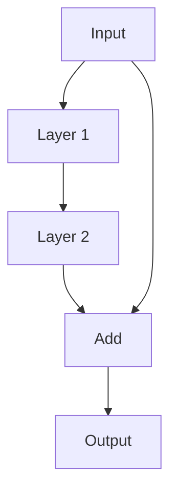

Mathematically:

\[
y=F(x)+x
\]


This is a core idea behind residual networks.

---

# 🧪 Skip Connection Example

```python
inputs = tf.keras.Input(
    shape=(128,)
)

x = tf.keras.layers.Dense(
    128,
    activation="relu"
)(inputs)

x = tf.keras.layers.Dense(
    128
)(x)

x = tf.keras.layers.Add()(
    [
        x,
        inputs
    ]
)

outputs = tf.keras.layers.Activation(
    "relu"
)(x)

model = tf.keras.Model(
    inputs=inputs,
    outputs=outputs
)
```

The Functional API makes this architecture straightforward.

---

# 🧠 Layer Reuse

Functional API allows the same layer to be reused.

For example:

```python
shared_layer = tf.keras.layers.Dense(
    64,
    activation="relu"
)
```

The same layer can process multiple inputs.

```python
x1 = shared_layer(input_1)
x2 = shared_layer(input_2)
```

This means the layer's weights are shared.

---

# 🔄 Shared Layer Architecture

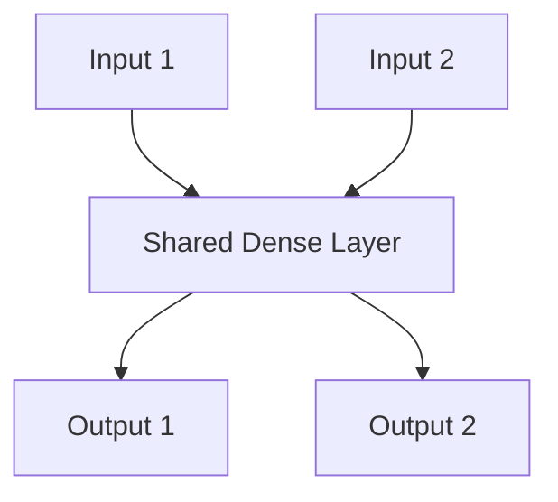

This pattern is useful for:

- Siamese networks
- Metric learning
- Shared feature extraction
- Multi-input architectures

---

# 🧪 Multiple Inputs

Suppose a model receives:

```text
Customer Profile
Transaction History
```

as separate inputs.

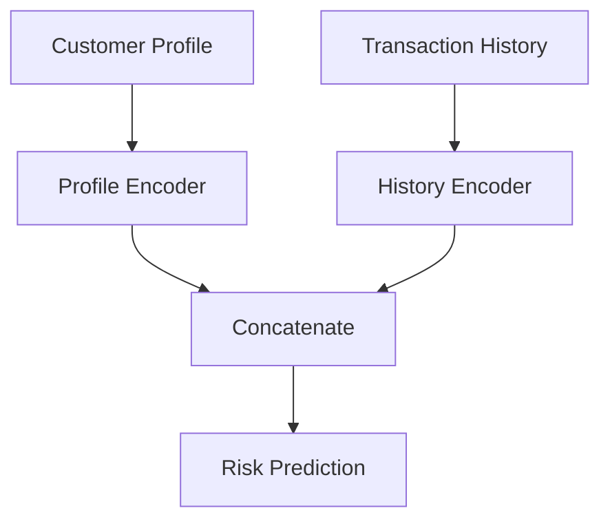

Functional API implementation:

```python
profile_input = tf.keras.Input(
    shape=(20,),
    name="profile"
)

history_input = tf.keras.Input(
    shape=(50,),
    name="history"
)

profile_features = tf.keras.layers.Dense(
    64,
    activation="relu"
)(profile_input)

history_features = tf.keras.layers.Dense(
    128,
    activation="relu"
)(history_input)

merged = tf.keras.layers.Concatenate()(
    [
        profile_features,
        history_features
    ]
)

outputs = tf.keras.layers.Dense(
    1,
    activation="sigmoid"
)(merged)

model = tf.keras.Model(
    inputs=[
        profile_input,
        history_input
    ],
    outputs=outputs
)
```

---

# 🧠 Multiple Outputs

A model can also produce multiple outputs.

For example:

```text
Input
  │
  ├── Classification Head
  │
  └── Regression Head
```

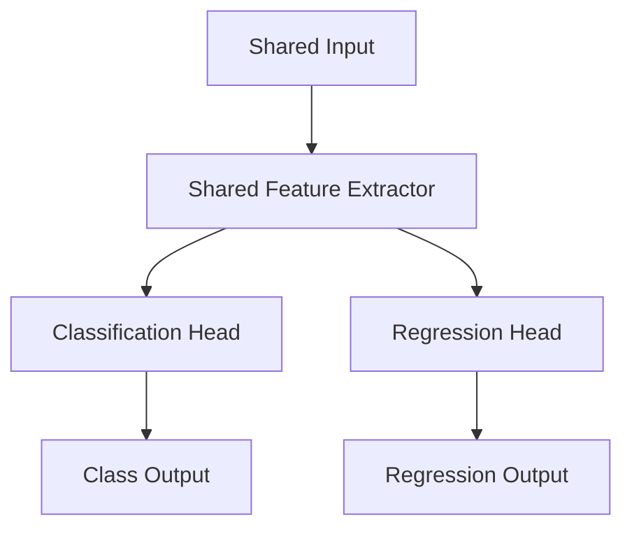

---

# 🧪 Multi-Output Model

```python
inputs = tf.keras.Input(
    shape=(100,)
)

features = tf.keras.layers.Dense(
    128,
    activation="relu"
)(inputs)

class_output = tf.keras.layers.Dense(
    10,
    activation="softmax",
    name="classification"
)(features)

reg_output = tf.keras.layers.Dense(
    1,
    name="regression"
)(features)

model = tf.keras.Model(
    inputs=inputs,
    outputs=[
        class_output,
        reg_output
    ]
)
```

---

# 🧠 Multi-Task Learning

A multi-output model can support multi-task learning.

For example:

```text
Shared Representation
        │
   ┌────┴────┐
   ↓         ↓
Task A      Task B
```

One model can learn:

```text
Classification
+
Regression
```

or:

```text
Object Detection
+
Object Classification
```

or:

```text
Sentiment
+
Topic Classification
```

---

# ⚙️ Compiling Multi-Output Models

Different outputs can have different losses.

```python
model.compile(

    optimizer="adam",

    loss={
        "classification":
            "sparse_categorical_crossentropy",

        "regression":
            "mse"
    },

    metrics={
        "classification":
            ["accuracy"],

        "regression":
            ["mae"]
    }
)
```

---

# 🧠 Loss Weighting

Multiple tasks may contribute differently to the total loss.

Conceptually:

\[
L_{total}
=
\lambda_1L_1
+
\lambda_2L_2
\]


Example:

```python
model.compile(

    optimizer="adam",

    loss={
        "classification": "sparse_categorical_crossentropy",
        "regression": "mse"
    },

    loss_weights={
        "classification": 1.0,
        "regression": 0.5
    }
)
```

---

# 🧠 Model Composition

Keras models can themselves behave like layers.

For example:

```python
encoder = tf.keras.Model(
    inputs=encoder_input,
    outputs=encoded
)

decoder = tf.keras.Model(
    inputs=decoder_input,
    outputs=decoded
)
```

They can then be composed:

```python
autoencoder_output = decoder(
    encoder(inputs)
)
```

This is extremely useful for:

- Autoencoders
- Encoder-decoder architectures
- Transfer Learning
- Reusable model components

---

# 🏗 Model-as-a-Layer Concept

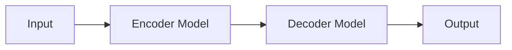

---

# 🧠 Reusable Model Components

Instead of creating one huge model, break it into components:

```text
Embedding
     ↓
Encoder
     ↓
Feature Extractor
     ↓
Task Head
```

This improves:

- Reusability
- Testing
- Maintenance
- Experimentation

---

# 🧪 Building a Reusable Block

```python
def dense_block(
    units,
    dropout_rate=0.2
):

    return tf.keras.Sequential([

        tf.keras.layers.Dense(
            units,
            activation="relu"
        ),

        tf.keras.layers.BatchNormalization(),

        tf.keras.layers.Dropout(
            dropout_rate
        )
    ])
```

Use:

```python
block = dense_block(
    128
)

x = block(inputs)
```

---

# 🧠 Functional API and CNNs

The Functional API becomes particularly valuable for Computer Vision.

For example:

```text
Input Image
     ↓
Convolution
     ↓
Pooling
     ↓
Branch
 ┌───┴───┐
 ↓       ↓
CNN     CNN
 └───┬───┘
     ↓
 Merge
     ↓
Classifier
```

This allows architectures beyond simple sequential CNN stacks.

---

# 🧠 Functional API and ResNet

Residual networks rely heavily on skip connections.

Conceptually:

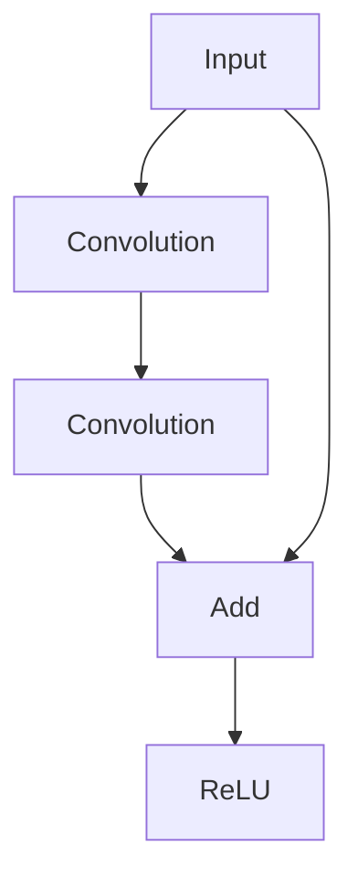

The Functional API is naturally suited to this type of architecture.

ResNet is covered in detail in:

**[22. ResNet, Residual Connections and TorchVision](22-resnet-residual-connections-and-torchvision.md)**

---

# 🧠 Functional API and Siamese Networks

Siamese networks often process two inputs through shared weights.

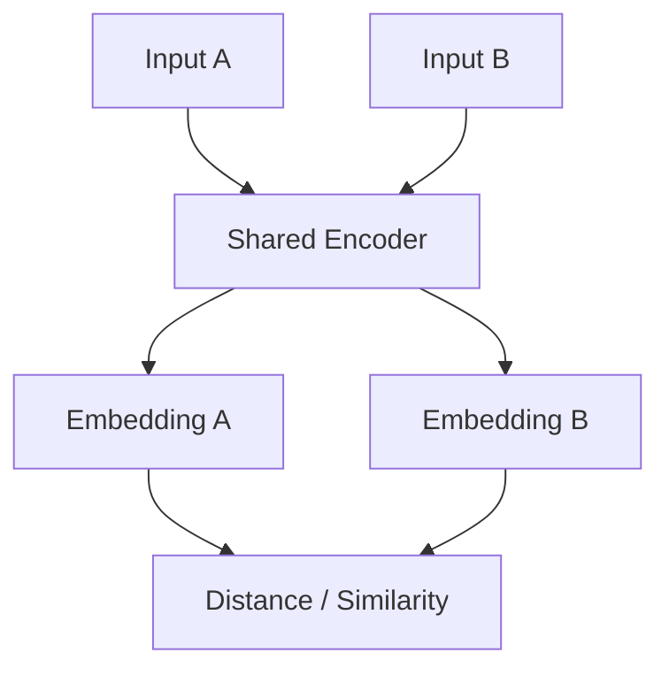

The Functional API is a natural fit because the same encoder can be reused.

---

# 🧠 Functional API and Attention

Attention architectures commonly contain:

```text
Query
Key
Value
```

and multiple computation paths.

Functional graphs can represent such architectures more naturally than simple sequential stacks.

This becomes increasingly important when building:

- Attention models
- Transformers
- Encoder-decoder systems
- Multi-head architectures

---

# 🧠 Functional API Model Visualization

Keras can visualize the architecture.

```python
tf.keras.utils.plot_model(
    model,
    show_shapes=True,
    show_layer_names=True
)
```

For complex architectures, this is extremely useful for verifying:

```text
Input Shapes
Output Shapes
Connections
Branches
Layer Names
```

---

# 🧠 Model Summary

```python
model.summary()
```

For a Functional model, the summary can reveal:

```text
Layer
Output Shape
Parameters
Connections
```

This helps identify:

- Unexpected parameter growth
- Shape mismatches
- Incorrect architecture
- Large layers

---

# 🔍 Inspecting the Graph

Functional models expose:

```python
model.inputs
model.outputs
model.layers
```

Example:

```python
for layer in model.layers:

    print(
        layer.name,
        layer.output.shape
    )
```

---

# 🧠 Naming Layers

Meaningful layer names improve observability.

Instead of:

```python
tf.keras.layers.Dense(128)
```

use:

```python
tf.keras.layers.Dense(
    128,
    activation="relu",
    name="feature_projection"
)
```

This becomes especially useful in:

- Debugging
- Model visualization
- Monitoring
- Transfer Learning
- Model inspection

---

# 🏢 Production Architecture

A production Keras model should ideally have clear boundaries between:

```text
Input Contract
      ↓
Preprocessing
      ↓
Feature Extraction
      ↓
Task-Specific Head
      ↓
Output Contract
```

Example:

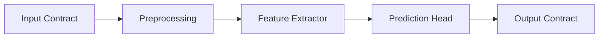

---

# 🧠 Functional API as Architecture-as-Code

The Functional API allows the model topology to be expressed directly in Python.

For example:

```python
inputs = tf.keras.Input(
    shape=(128,)
)

x = layer_a(inputs)

x1 = layer_b(x)

x2 = layer_c(x)

merged = tf.keras.layers.Add()(
    [x1, x2]
)

outputs = layer_d(
    merged
)

model = tf.keras.Model(
    inputs,
    outputs
)
```

The code itself reflects the architecture:

```text
Input
  ↓
Layer A
  ↓
 ┌──────┴──────┐
 ↓             ↓
Layer B       Layer C
 └──────┬──────┘
        ↓
       Add
        ↓
     Layer D
        ↓
      Output
```

---

# 🧠 Sequential → Functional Migration

A Sequential model:

```python
model = tf.keras.Sequential([

    tf.keras.Input(
        shape=(784,)
    ),

    tf.keras.layers.Dense(
        128,
        activation="relu"
    ),

    tf.keras.layers.Dense(
        10,
        activation="softmax"
    )
])
```

can be expressed using Functional API:

```python
inputs = tf.keras.Input(
    shape=(784,)
)

x = tf.keras.layers.Dense(
    128,
    activation="relu"
)(inputs)

outputs = tf.keras.layers.Dense(
    10,
    activation="softmax"
)(x)

model = tf.keras.Model(
    inputs,
    outputs
)
```

The underlying neural network is equivalent.

The difference is the amount of architectural control.

---

# 🧠 When Should You Use Sequential?

Use Sequential when:

```text
One Input
+
One Output
+
Linear Stack
+
No Branching
+
No Layer Sharing
+
No Skip Connections
```

Example:

```text
Input
 ↓
Dense
 ↓
Dropout
 ↓
Dense
 ↓
Output
```

---

# 🧠 When Should You Use Functional API?

Use Functional API when you need:

```text
Multiple Inputs
Multiple Outputs
Branches
Merges
Skip Connections
Shared Layers
Complex Graphs
Reusable Components
```

Examples:

```text
ResNet
Siamese Networks
Multi-Task Models
Encoder-Decoder Models
Complex CNNs
Attention Networks
Transformers
```

---

# 🧠 When Should You Use Model Subclassing?

Model subclassing becomes useful when:

- The architecture is highly dynamic
- Forward behavior requires custom control flow
- You need custom training behavior
- The computation graph cannot be conveniently expressed using standard Functional patterns

Example:

```python
class MyModel(
    tf.keras.Model
):

    def __init__(self):

        super().__init__()

        self.dense = tf.keras.layers.Dense(
            128,
            activation="relu"
        )

        self.output_layer = tf.keras.layers.Dense(
            10
        )

    def call(
        self,
        inputs
    ):

        x = self.dense(
            inputs
        )

        return self.output_layer(
            x
        )
```

Model subclassing is covered further in:

**[15. Custom Layers, Models and Training Loops](15-custom-layers-models-and-training-loops.md)**

---

# 🧭 Model API Decision Guide

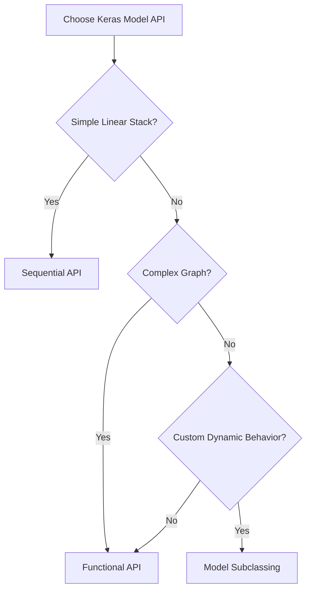

---

# 🧪 Practical Example — Multi-Input Enterprise Model

Imagine a financial risk model receiving:

```text
Customer Profile
+
Transaction Features
+
Behavioral Features
```

Architecture:

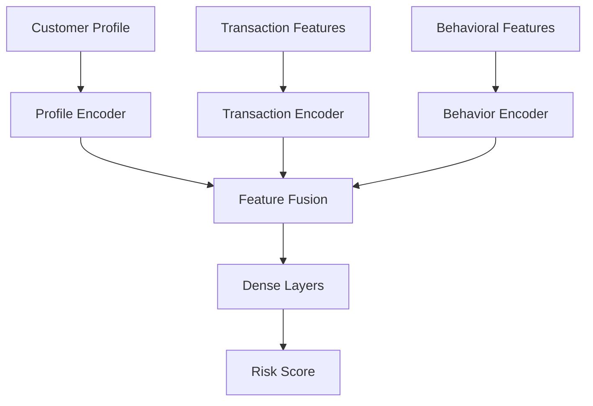

This is an excellent use case for the Functional API.

---

# 🧪 Implementation

```python
import tensorflow as tf


profile = tf.keras.Input(
    shape=(20,),
    name="profile"
)

transactions = tf.keras.Input(
    shape=(50,),
    name="transactions"
)

behavior = tf.keras.Input(
    shape=(30,),
    name="behavior"
)


profile_features = tf.keras.layers.Dense(
    64,
    activation="relu",
    name="profile_encoder"
)(profile)


transaction_features = tf.keras.layers.Dense(
    128,
    activation="relu",
    name="transaction_encoder"
)(transactions)


behavior_features = tf.keras.layers.Dense(
    64,
    activation="relu",
    name="behavior_encoder"
)(behavior)


features = tf.keras.layers.Concatenate(
    name="feature_fusion"
)([
    profile_features,
    transaction_features,
    behavior_features
])


x = tf.keras.layers.Dense(
    128,
    activation="relu",
    name="risk_features"
)(features)


x = tf.keras.layers.Dropout(
    0.2,
    name="regularization"
)(x)


output = tf.keras.layers.Dense(
    1,
    activation="sigmoid",
    name="risk_score"
)(x)


model = tf.keras.Model(
    inputs=[
        profile,
        transactions,
        behavior
    ],
    outputs=output,
    name="enterprise_risk_model"
)
```

---

# 🧠 Why This Architecture Is Production-Friendly

Each input has a dedicated representation:

```text
Profile
   ↓
Profile Encoder

Transactions
   ↓
Transaction Encoder

Behavior
   ↓
Behavior Encoder
```

These representations are then combined:

```text
Feature Fusion
      ↓
Shared Representation
      ↓
Prediction Head
```

This structure makes it easier to:

- Modify individual branches
- Test components
- Reuse encoders
- Monitor inputs
- Extend the architecture

---

# ⚠ Common Mistakes

Avoid these mistakes:

- Using Sequential for a graph-based architecture
- Using Functional API when Sequential would be simpler without a reason
- Forgetting that Functional API tensors are symbolic during model construction
- Connecting tensors with incompatible shapes
- Using `Add` when tensor shapes are incompatible
- Confusing `Add` with `Concatenate`
- Accidentally creating separate layers instead of sharing the same layer instance
- Creating unnecessarily complicated model graphs
- Not naming important inputs and outputs
- Ignoring model visualization
- Ignoring parameter counts
- Building giant monolithic Functional models
- Mixing preprocessing logic inconsistently between training and inference
- Forgetting to validate multi-input data contracts
- Using different preprocessing logic for different deployment paths
- Adding branches without a clear modeling reason

---

# 🧠 Interview Questions

## Beginner

### 1. What is the Sequential API?

The Sequential API is a Keras model-building approach for creating a simple linear stack of layers.

### 2. What is the Functional API?

The Functional API allows developers to construct arbitrary directed computation graphs by explicitly connecting inputs, layers, and outputs.

### 3. What is the main difference between Sequential and Functional API?

Sequential represents a simple linear stack, while Functional API supports complex graph structures such as branching, merging, multiple inputs, multiple outputs, shared layers, and skip connections.

### 4. Can Sequential models have multiple inputs?

Not naturally. Models with multiple inputs should generally use the Functional API.

### 5. Can Functional API build simple models?

Yes. A simple Sequential model can also be represented using the Functional API.

---

## Intermediate

### 6. What is a symbolic tensor?

A symbolic tensor represents a node or intermediate value in the Keras computation graph rather than an actual batch of numerical data during model construction.

### 7. What is a skip connection?

A skip connection allows information to bypass one or more layers and later be combined with the transformed representation.

### 8. Why is the Functional API useful for ResNet?

ResNet uses residual/skip connections, which require graph structures that are not naturally represented by a simple sequential stack.

### 9. What is layer sharing?

Layer sharing means using the same layer instance, and therefore the same learned weights, on multiple inputs or paths.

### 10. What is a multi-input model?

A model that receives more than one independent input tensor.

### 11. What is a multi-output model?

A model that produces multiple outputs, potentially representing different tasks.

### 12. What is multi-task learning?

Multi-task learning trains a shared representation to solve multiple related tasks, often using separate task-specific output heads.

---

## Advanced

### 13. Why would you use the Functional API instead of subclassing?

When the architecture can be clearly expressed as a computation graph, the Functional API provides strong graph visibility, model inspection, visualization, and serialization while remaining flexible.

### 14. Why might model subclassing be necessary?

Highly dynamic computation, custom control flow, or specialized training behavior may be easier to implement using subclassing.

### 15. What is the difference between `Add` and `Concatenate`?

`Add` performs element-wise addition and requires compatible shapes. `Concatenate` joins tensors along a specified dimension and generally increases the feature dimension.

### 16. How does layer sharing work?

The same layer object is applied to multiple inputs:

```python
shared_layer = Dense(64)

x1 = shared_layer(input1)
x2 = shared_layer(input2)
```

Both paths use the same learned weights.

### 17. How would you design a multi-input enterprise model?

Separate each input into an appropriate encoder, transform each representation, fuse the representations, and pass the fused representation into shared prediction layers.

### 18. Why is model visualization important?

It helps verify:

```text
Connections
Shapes
Branches
Skip Paths
Parameter Growth
```

and can expose architectural mistakes before training becomes expensive.

---

# 🧪 Practical Exercises

## Exercise 1 — Sequential Classifier

Build:

```text
Input
 ↓
Dense 128
 ↓
ReLU
 ↓
Dense 64
 ↓
ReLU
 ↓
Dense 10
 ↓
Softmax
```

using Sequential.

---

## Exercise 2 — Convert Sequential to Functional

Implement the same architecture using the Functional API.

Compare:

```text
Code
Model Summary
Parameter Count
Predictions
```

---

## Exercise 3 — Branching Network

Create:

```text
Input
 ├── Dense 128
 │
 └── Dense 64
       ↓
   Concatenate
       ↓
   Dense
       ↓
   Output
```

---

## Exercise 4 — Skip Connection

Implement:

```text
Input
   │
   ├───────────────┐
   ↓               │
Dense              │
   ↓               │
Dense              │
   ↓               │
   └──── Add ◄─────┘
          ↓
        Output
```

---

## Exercise 5 — Multi-Input Model

Build a model accepting:

```text
Profile Features
Transaction Features
Behavior Features
```

Create separate encoders and combine them using `Concatenate`.

---

## Exercise 6 — Multi-Output Model

Create one shared network with:

```text
Classification Head
+
Regression Head
```

Train it using different losses for each output.

---

## Exercise 7 — Shared Encoder

Build a Siamese-style architecture:

```text
Input A ──┐
          ├── Shared Encoder
Input B ──┘
```

Produce two embeddings and calculate a similarity score.

---

# 📌 Key Takeaways

- Keras provides multiple model-construction approaches.
- Sequential is ideal for simple linear stacks.
- Functional API is designed for arbitrary computation graphs.
- Functional API supports multiple inputs and outputs.
- Functional API supports branching and merging.
- Functional API supports shared layers.
- Skip connections are naturally implemented using Functional API.
- Residual networks rely heavily on this capability.
- Functional API uses symbolic tensors during model construction.
- `tf.keras.Model(inputs, outputs)` creates a Functional model.
- `Add` performs element-wise addition.
- `Concatenate` joins tensors along a dimension.
- Multi-output models can support multi-task learning.
- Different outputs can use different losses and metrics.
- Loss weights can balance multiple tasks.
- Keras models can be composed and reused as layers.
- Meaningful layer names improve model inspection and maintainability.
- Model visualization is especially valuable for complex architectures.
- Sequential should not be forced onto architectures that require graph connectivity.
- Functional API is often the right abstraction for production-grade complex neural networks.
- Model subclassing is useful when computation or behavior requires greater customization.
- Good architecture design should balance flexibility, readability, maintainability, and operational requirements.

---

# 📚 Further Reading

Continue with:

- **[15. Custom Layers, Models and Training Loops](15-custom-layers-models-and-training-loops.md)**
- **[16. PyTorch Fundamentals and Tensors](16-pytorch-fundamentals-and-tensors.md)**
- **[18. Building Classification and Regression Models](18-building-classification-and-regression-models.md)**
- **[19. Convolutional Neural Networks](19-convolutional-neural-networks.md)**
- **[20. CNN Architecture, Optimization and Training](20-cnn-architecture-optimization-and-training.md)**
- **[22. ResNet, Residual Connections and TorchVision](22-resnet-residual-connections-and-torchvision.md)**
- **[26. Attention and Positional Encoding](26-attention-and-positional-encoding.md)**
- **[27. Transformer Architecture](27-transformer-architecture.md)**

The next chapter moves from standard Keras model construction into **custom layers, custom models, and custom training loops**, giving you much deeper control over the training process.

---

## ➡️ Next Chapter

**[15. Custom Layers, Models and Training Loops](15-custom-layers-models-and-training-loops.md)**

---

> **Enterprise AI Engineering Handbook**  
> *Building Production-Grade Enterprise AI Systems — One Chapter at a Time.*