# 15. Custom Layers, Models and Training Loops

> Move beyond the standard Keras `Sequential` and Functional APIs and learn how to build custom layers, custom models, and custom training loops with TensorFlow and Keras. Understand how forward computation, trainable parameters, automatic differentiation, gradient computation, and optimizer updates work together to provide fine-grained control over Deep Learning systems.

---

## 🎯 Learning Objectives

After completing this chapter, you will be able to:

- Understand why custom Keras components are required
- Create custom Keras layers
- Understand the `Layer` base class
- Implement the `build()` method
- Implement the `call()` method
- Create trainable and non-trainable variables
- Understand `trainable_weights`
- Understand `non_trainable_weights`
- Build custom mathematical operations as layers
- Create reusable custom layers
- Create custom Keras models
- Understand the difference between custom layers and custom models
- Implement custom forward passes
- Understand `training=True` and `training=False`
- Use `tf.GradientTape`
- Compute gradients manually
- Apply gradients using an optimizer
- Implement a custom training step
- Build a custom training loop
- Implement validation loops
- Track metrics manually
- Use `tf.function`
- Understand eager execution vs graph execution
- Understand how Keras `fit()` works conceptually
- Override `train_step()`
- Combine custom training logic with `model.fit()`
- Implement custom losses
- Implement custom metrics
- Implement custom regularization
- Understand when custom training loops are appropriate
- Design maintainable custom Deep Learning components

---

# 📖 Overview

Keras provides high-level APIs that make Deep Learning development straightforward:

```text
Sequential
Functional API
model.compile()
model.fit()
model.evaluate()
model.predict()
```

For many applications, these abstractions are sufficient.

However, advanced Deep Learning systems sometimes require more control.

Examples include:

```text
Custom Layers
Custom Forward Pass
Custom Loss
Custom Optimization
Multiple Gradient Computations
Gradient Manipulation
Custom Training Logic
Adversarial Training
Contrastive Learning
Multi-Task Optimization
Research Architectures
```

For these situations, Keras allows developers to move down the abstraction stack.

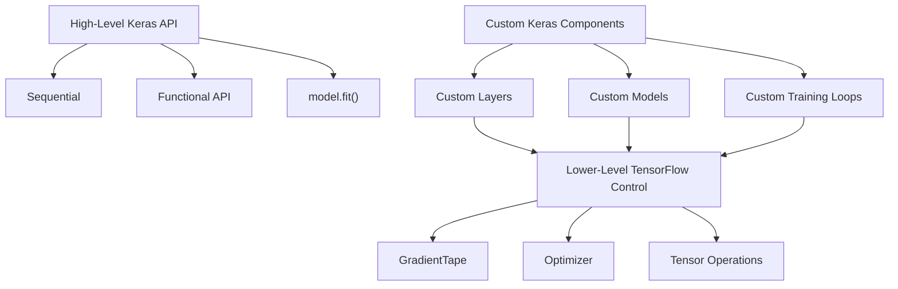

---

# 🧠 Why Custom Layers?

Standard Keras already provides many layers:

```text
Dense
Conv2D
Dropout
BatchNormalization
LSTM
GRU
Embedding
MultiHeadAttention
```

But sometimes your architecture requires an operation that does not exist as a standard layer.

For example:

```text
Custom Mathematical Transformation
Custom Feature Interaction
Custom Normalization
Custom Attention
Custom Routing
Custom Residual Block
Custom Research Layer
```

Instead of writing the operation directly inside the model, create a reusable layer.

---

# 🧱 Custom Layer Concept

A custom layer can be viewed as:

```text
Input Tensor
      ↓
Custom Layer
      ↓
Transformation
      ↓
Output Tensor
```

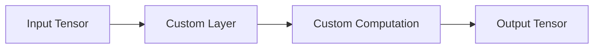

---

# 🧠 `tf.keras.layers.Layer`

Custom layers generally inherit from:

```python
tf.keras.layers.Layer
```

Basic structure:

```python
class MyLayer(tf.keras.layers.Layer):

    def __init__(self, ...):
        super().__init__()

    def build(self, input_shape):
        ...

    def call(self, inputs):
        ...

```

The three important concepts are:

```text
__init__()
build()
call()
```

---

# 🧠 Role of `__init__()`

The constructor is generally used to configure the layer.

For example:

```python
class MyLayer(tf.keras.layers.Layer):

    def __init__(
        self,
        units
    ):

        super().__init__()

        self.units = units
```

The constructor stores configuration.

It should not necessarily create weights that depend on the input shape.

---

# 🧠 Role of `build()`

`build()` is useful when weights depend on the input shape.

Example:

```python
def build(
    self,
    input_shape
):

    self.w = self.add_weight(
        shape=(
            input_shape[-1],
            self.units
        ),
        initializer="random_normal",
        trainable=True
    )

    self.b = self.add_weight(
        shape=(self.units,),
        initializer="zeros",
        trainable=True
    )
```

This allows the layer to determine the required weight dimensions after the input shape is known.

---

# 🧠 Role of `call()`

`call()` defines the forward computation.

For example:

```python
def call(
    self,
    inputs
):

    return tf.matmul(
        inputs,
        self.w
    ) + self.b
```

Conceptually:

```text
Input
  ↓
call()
  ↓
Matrix Multiplication
  ↓
Bias
  ↓
Output
```

---

# 🧪 Complete Custom Dense Layer

```python
import tensorflow as tf


class CustomDense(
    tf.keras.layers.Layer
):

    def __init__(
        self,
        units
    ):

        super().__init__()

        self.units = units

    def build(
        self,
        input_shape
    ):

        self.w = self.add_weight(
            shape=(
                input_shape[-1],
                self.units
            ),
            initializer="random_normal",
            trainable=True
        )

        self.b = self.add_weight(
            shape=(
                self.units,
            ),
            initializer="zeros",
            trainable=True
        )

    def call(
        self,
        inputs
    ):

        return tf.matmul(
            inputs,
            self.w
        ) + self.b
```

Usage:

```python
layer = CustomDense(
    64
)

output = layer(
    inputs
)
```

---

# 🧮 Custom Dense Layer Mathematics

The custom layer implements:

\[
y = Wx+b
\]


If an activation is included:

\[
y=f(Wx+b)
\]


This demonstrates an important principle:

> A neural-network layer is fundamentally a parameterized mathematical transformation.

---

# 🧠 `add_weight()`

Keras provides:

```python
self.add_weight()
```

for creating layer variables.

Example:

```python
self.kernel = self.add_weight(
    shape=(input_dim, units),
    initializer="glorot_uniform",
    trainable=True
)
```

This allows Keras to track the variable automatically.

---

# 🔍 Trainable Variables

A layer exposes trainable parameters through:

```python
layer.trainable_weights
```

For a custom dense layer:

```python
for weight in layer.trainable_weights:

    print(
        weight.name,
        weight.shape
    )
```

---

# 🧠 Trainable vs Non-Trainable Variables

A layer may contain:

```text
Trainable Variables
        +
Non-Trainable Variables
```

Trainable variables are updated during optimization.

Non-trainable variables are not updated by gradient descent.

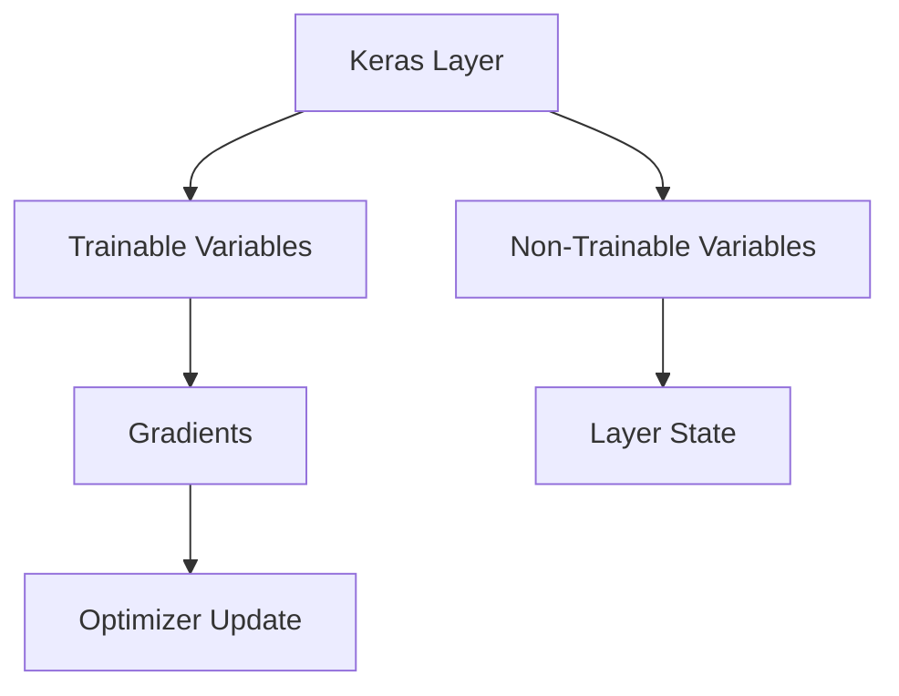

---

# 🧪 Non-Trainable Weight

```python
self.running_mean = self.add_weight(
    shape=(features,),
    initializer="zeros",
    trainable=False
)
```

This variable is tracked by Keras but is not optimized through backpropagation.

---

# 🧠 Custom Layer with Activation

```python
class CustomDense(
    tf.keras.layers.Layer
):

    def __init__(
        self,
        units,
        activation=None
    ):

        super().__init__()

        self.units = units
        self.activation = tf.keras.activations.get(
            activation
        )

    def build(
        self,
        input_shape
    ):

        self.w = self.add_weight(
            shape=(
                input_shape[-1],
                self.units
            ),
            initializer="glorot_uniform"
        )

        self.b = self.add_weight(
            shape=(self.units,),
            initializer="zeros"
        )

    def call(
        self,
        inputs
    ):

        output = tf.matmul(
            inputs,
            self.w
        ) + self.b

        if self.activation is not None:

            output = self.activation(
                output
            )

        return output
```

---

# 🧠 Why `build()` Is Useful

Consider:

```python
layer = CustomDense(
    128
)
```

At this moment, the layer may not know:

```text
Input Features
```

When the first input arrives:

```text
Input Shape
      ↓
build()
      ↓
Create Weights
```

This makes custom layers reusable across different input dimensions.

---

# 🏗 Layer Lifecycle

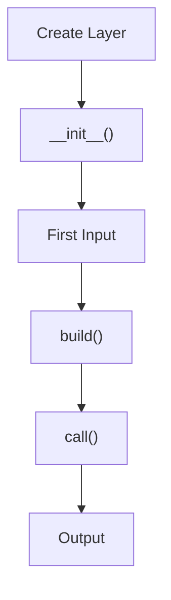

For subsequent compatible calls, Keras generally reuses the already-created weights rather than rebuilding them.

---

# 🧠 Custom Layer Example — Scaling

A simple custom layer can implement:

\[
y=\alpha x
\]


```python
class ScalingLayer(
    tf.keras.layers.Layer
):

    def __init__(
        self,
        scale
    ):

        super().__init__()

        self.scale = scale

    def call(
        self,
        inputs
    ):

        return inputs * self.scale
```

Usage:

```python
layer = ScalingLayer(
    0.5
)

output = layer(
    inputs
)
```

---

# 🧠 Custom Layer Example — Learnable Scaling

The scale itself can be trainable.

```python
class LearnableScaling(
    tf.keras.layers.Layer
):

    def build(
        self,
        input_shape
    ):

        self.scale = self.add_weight(
            shape=(input_shape[-1],),
            initializer="ones",
            trainable=True
        )

    def call(
        self,
        inputs
    ):

        return inputs * self.scale
```

The model learns:

```text
Which features should be amplified?
Which features should be reduced?
```

---

# 🧠 Custom Layer Example — Residual Block

A residual block can be implemented as a custom layer.

```python
class ResidualBlock(
    tf.keras.layers.Layer
):

    def __init__(
        self,
        units
    ):

        super().__init__()

        self.dense1 = tf.keras.layers.Dense(
            units,
            activation="relu"
        )

        self.dense2 = tf.keras.layers.Dense(
            units
        )

        self.activation = tf.keras.layers.ReLU()

    def call(
        self,
        inputs
    ):

        x = self.dense1(
            inputs
        )

        x = self.dense2(
            x
        )

        x = x + inputs

        return self.activation(
            x
        )
```

Architecture:

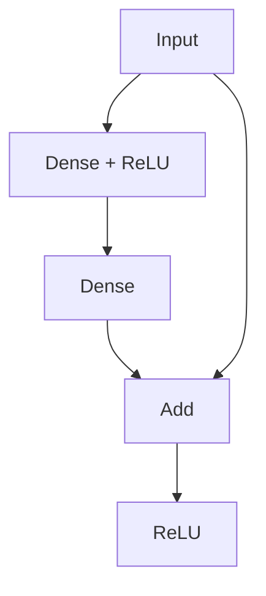

This pattern becomes important for:

- ResNet
- Deep MLPs
- Transformer blocks
- Advanced architectures

---

# 🧠 Custom Layer with Training Behavior

Some layers behave differently during training and inference.

Examples:

```text
Dropout
Batch Normalization
Stochastic Layers
Augmentation Layers
```

The `call()` method can accept:

```python
training=False
```

Example:

```python
class CustomDropout(
    tf.keras.layers.Layer
):

    def __init__(
        self,
        rate
    ):

        super().__init__()

        self.rate = rate

    def call(
        self,
        inputs,
        training=False
    ):

        if training:

            return tf.nn.dropout(
                inputs,
                rate=self.rate
            )

        return inputs
```

---

# 🧠 Training vs Inference

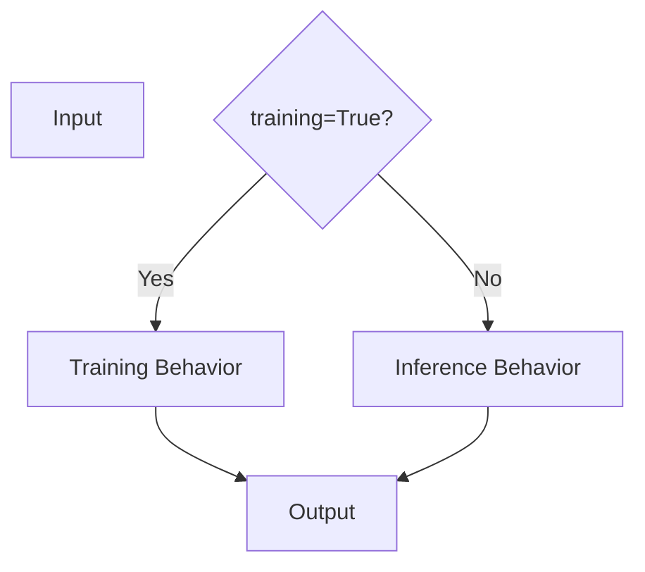

The model should be explicit about behavior that differs between training and inference.

---

# 🧠 Custom Models

A custom layer represents a reusable transformation.

A custom model generally represents the larger architecture.

For example:

```text
Custom Layer
    ↓
Reusable Component

Custom Model
    ↓
Complete Network
```

---

# 🧪 Custom Keras Model

```python
class MyModel(
    tf.keras.Model
):

    def __init__(
        self
    ):

        super().__init__()

        self.dense1 = tf.keras.layers.Dense(
            128,
            activation="relu"
        )

        self.dense2 = tf.keras.layers.Dense(
            64,
            activation="relu"
        )

        self.output_layer = tf.keras.layers.Dense(
            10,
            activation="softmax"
        )

    def call(
        self,
        inputs,
        training=False
    ):

        x = self.dense1(
            inputs
        )

        x = self.dense2(
            x
        )

        return self.output_layer(
            x
        )
```

Usage:

```python
model = MyModel()
```

---

# 🧠 Layer vs Model

| Custom Layer | Custom Model |
|---|---|
| Reusable computation block | Complete architecture |
| Usually smaller | Usually larger |
| Extends `Layer` | Extends `Model` |
| Can contain other layers | Can contain many layers |
| Used inside models | Represents the model itself |
| Defines transformation | Defines overall forward computation |

---

# 🏗 Custom Model Architecture

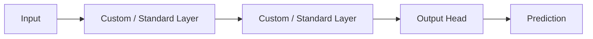

---

# 🧠 `call()` Defines Forward Pass

For a custom model:

```python
def call(
    self,
    inputs,
    training=False
):
```

defines how data moves through the network.

Conceptually:

\[
\hat{y}=f_\theta(x)
\]


where:

```text
x      = input
θ      = model parameters
fθ     = neural network
ŷ      = prediction
```

---

# 🧠 Automatic Differentiation

Training requires gradients.

TensorFlow provides:

```python
tf.GradientTape
```

for automatic differentiation.

Conceptually:

```text
Forward Pass
      ↓
Loss
      ↓
GradientTape
      ↓
Gradients
      ↓
Optimizer
      ↓
Updated Weights
```

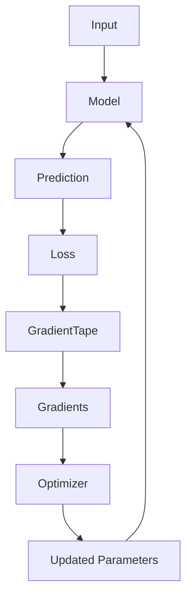

---

# 🧮 Gradient Computation

Suppose:

\[
L=f(w)
\]

The gradient is:

\[
\frac{\partial L}{\partial w}
\]


The optimizer then updates:

\[
w
\leftarrow
w-\eta
\frac{\partial L}{\partial w}
\]


---

# 🧪 Basic `GradientTape`

```python
x = tf.Variable(
    3.0
)

with tf.GradientTape() as tape:

    y = x ** 2

gradient = tape.gradient(
    y,
    x
)

print(
    gradient
)
```

Because:

\[
y=x^2
\]

we have:

\[
\frac{dy}{dx}=2x
\]

For:

\[
x=3
\]

the gradient is:

```text
6
```

---

# 🧠 GradientTape Workflow

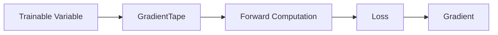

The tape records operations performed within its context so gradients can later be computed.

---

# 🧪 Simple Linear Regression with GradientTape

```python
import tensorflow as tf


w = tf.Variable(
    0.0
)

b = tf.Variable(
    0.0
)


x = tf.constant(
    [1.0, 2.0, 3.0]
)

y_true = tf.constant(
    [2.0, 4.0, 6.0]
)


with tf.GradientTape() as tape:

    y_pred = w * x + b

    loss = tf.reduce_mean(
        tf.square(
            y_true - y_pred
        )
    )


gradients = tape.gradient(
    loss,
    [w, b]
)

print(
    gradients
)
```

This demonstrates the core mechanism behind neural-network training.

---

# 🧠 Applying Gradients

Once gradients are computed:

```python
optimizer.apply_gradients(
    zip(
        gradients,
        variables
    )
)
```

The complete process becomes:

```text
Forward
   ↓
Loss
   ↓
GradientTape
   ↓
Gradients
   ↓
Optimizer
   ↓
Parameter Update
```

---

# 🧪 Manual Training Step

```python
optimizer = tf.keras.optimizers.Adam(
    learning_rate=0.001
)


with tf.GradientTape() as tape:

    predictions = model(
        x_batch,
        training=True
    )

    loss = loss_fn(
        y_batch,
        predictions
    )


gradients = tape.gradient(
    loss,
    model.trainable_variables
)


optimizer.apply_gradients(
    zip(
        gradients,
        model.trainable_variables
    )
)
```

This is the fundamental custom training step.

---

# 🧠 Custom Training Loop

A custom training loop repeatedly executes the training step.

```python
for epoch in range(
    epochs
):

    for x_batch, y_batch in train_dataset:

        with tf.GradientTape() as tape:

            predictions = model(
                x_batch,
                training=True
            )

            loss = loss_fn(
                y_batch,
                predictions
            )

        gradients = tape.gradient(
            loss,
            model.trainable_variables
        )

        optimizer.apply_gradients(
            zip(
                gradients,
                model.trainable_variables
            )
        )
```

---

# 🏗 Custom Training Loop

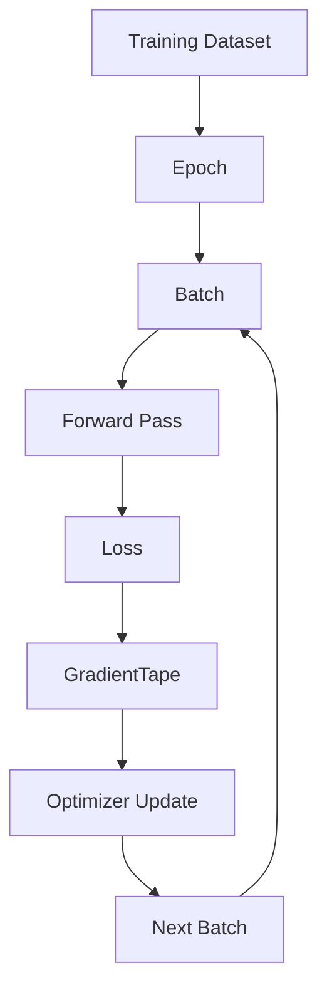

---

# 🧠 Why Use Custom Training Loops?

Use custom training loops when you need control over:

- Multiple losses
- Multiple optimizers
- Custom gradient manipulation
- Gradient accumulation
- Adversarial training
- Contrastive learning
- Custom optimization logic
- Complex training schedules
- Specialized research architectures

For ordinary supervised learning, `model.fit()` is often simpler.

---

# 🧠 `model.fit()` vs Custom Loop

| `model.fit()` | Custom Training Loop |
|---|---|
| High-level | Low-level |
| Less code | More code |
| Standard workflows | Specialized workflows |
| Built-in callbacks | Manual control |
| Built-in metrics | Manual or hybrid |
| Easier maintenance | More responsibility |
| Faster development | Greater flexibility |

---

# 🧠 Keras `fit()` Internals

Conceptually, `model.fit()` performs something similar to:

```text
for each epoch:

    for each batch:

        forward pass
        calculate loss
        calculate gradients
        update parameters
        update metrics
```

The difference is that Keras handles the training infrastructure for you.

---

# 🧠 Overriding `train_step()`

Keras provides a useful middle ground.

Instead of implementing the entire training loop, override:

```python
train_step()
```

This allows custom training logic while still using:

```python
model.fit()
```

---

# 🧪 Custom `train_step()`

```python
class CustomModel(
    tf.keras.Model
):

    def train_step(
        self,
        data
    ):

        x, y = data

        with tf.GradientTape() as tape:

            y_pred = self(
                x,
                training=True
            )

            loss = self.compute_loss(
                x=x,
                y=y,
                y_pred=y_pred
            )

        gradients = tape.gradient(
            loss,
            self.trainable_variables
        )

        self.optimizer.apply_gradients(
            zip(
                gradients,
                self.trainable_variables
            )
        )

        return {
            "loss": loss
        }
```

This provides custom training behavior without completely abandoning the Keras training framework.

---

# 🧠 Three Levels of Training Control

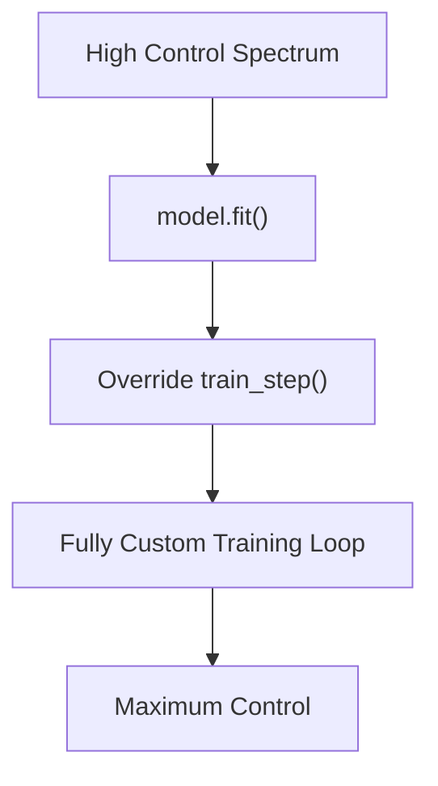

Think of the choices as:

```text
Standard Training
      ↓
model.fit()

Custom Training Behavior
      ↓
Custom train_step()

Maximum Control
      ↓
Custom Training Loop
```

---

# 🧠 Custom Loss Functions

Keras supports custom losses.

A loss function generally has:

```text
True Values
+
Predictions
      ↓
Loss
```

Example:

```python
def custom_mse(
    y_true,
    y_pred
):

    error = y_true - y_pred

    return tf.reduce_mean(
        tf.square(error)
    )
```

---

# 🧮 Mean Squared Error

\[
MSE
=
\frac{1}{n}
\sum_{i=1}^{n}
(y_i-\hat{y}_i)^2
\]


Custom losses are useful when standard loss functions do not match the training objective.

---

# 🧠 Custom Loss with Additional Terms

A custom loss can combine multiple objectives.

For example:

\[
L
=
L_{task}
+
\lambda L_{regularization}
\]


This is common in:

- Representation learning
- Multi-task learning
- Regularized models
- Research architectures

---

# 🧠 Custom Regularization

A layer can add a regularization term using:

```python
self.add_loss(...)
```

Example:

```python
class RegularizedLayer(
    tf.keras.layers.Layer
):

    def call(
        self,
        inputs
    ):

        penalty = tf.reduce_mean(
            tf.square(inputs)
        )

        self.add_loss(
            1e-4 * penalty
        )

        return inputs
```

Keras then incorporates this additional loss during training.

---

# 🧠 `add_loss()`

Conceptually:

```text
Main Task Loss
       +
Additional Layer Loss
       ↓
Total Loss
```

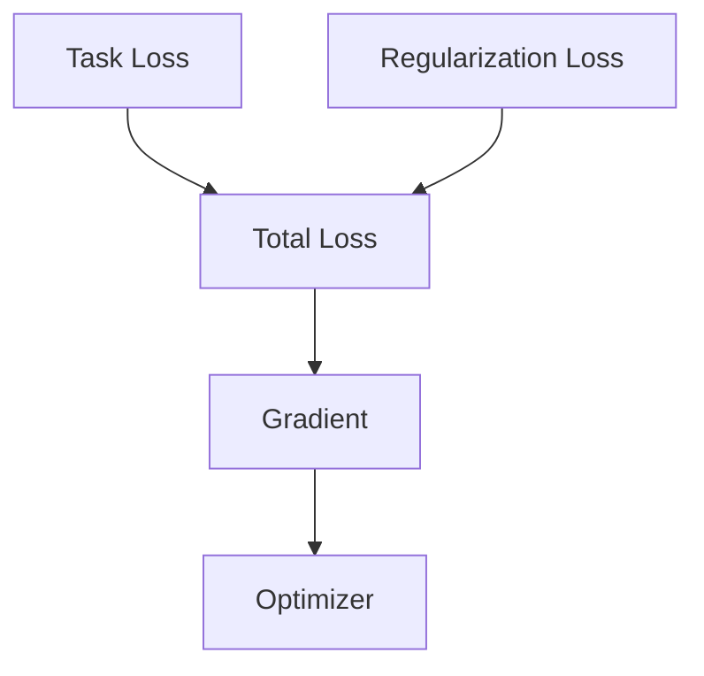

---

# 🧠 Custom Metrics

Metrics measure model behavior without necessarily controlling optimization.

Example:

```python
class MeanAbsoluteErrorMetric(
    tf.keras.metrics.Metric
):

    def __init__(
        self,
        name="mae",
        **kwargs
    ):

        super().__init__(
            name=name,
            **kwargs
        )

        self.total = self.add_weight(
            name="total",
            initializer="zeros"
        )

        self.count = self.add_weight(
            name="count",
            initializer="zeros"
        )

    def update_state(
        self,
        y_true,
        y_pred,
        sample_weight=None
    ):

        error = tf.abs(
            y_true - y_pred
        )

        self.total.assign_add(
            tf.reduce_sum(error)
        )

        self.count.assign_add(
            tf.cast(
                tf.size(error),
                tf.float32
            )
        )

    def result(self):

        return (
            self.total /
            self.count
        )

    def reset_state(self):

        self.total.assign(
            0.0
        )

        self.count.assign(
            0.0
        )
```

---

# 🧠 Loss vs Metric

Keep the distinction clear:

```text
Loss
 ↓
Optimization Target

Metric
 ↓
Measurement / Monitoring
```

For example:

```text
Loss = Cross Entropy
Metric = Accuracy
```

The optimizer uses gradients derived from the loss.

---

# 🧠 Multiple Optimizers

Custom training loops can use different optimizers for different components.

For example:

```text
Generator
    ↓
Optimizer A

Discriminator
    ↓
Optimizer B
```

This pattern is important in:

- GANs
- Adversarial training
- Multi-network architectures

---

# 🧠 Multiple Gradient Tapes

Some architectures require separate gradient computations.

Conceptually:

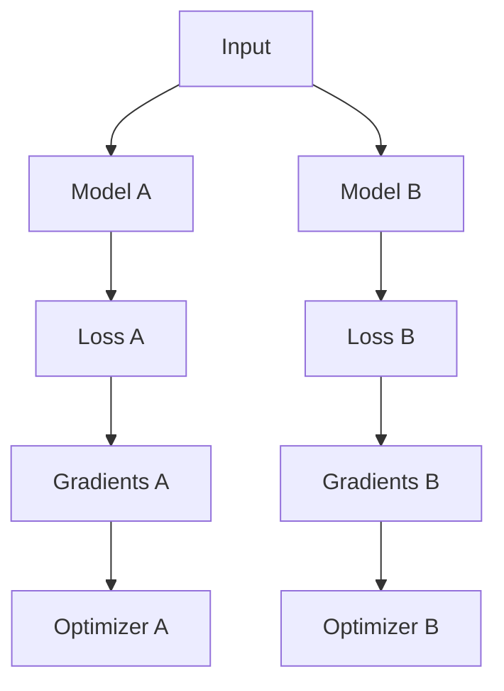

This level of control is difficult to express using a simple standard training workflow.

---

# 🧠 Gradient Clipping in Custom Loops

Gradients can be clipped before applying them.

```python
gradients = tape.gradient(
    loss,
    model.trainable_variables
)

gradients, _ = tf.clip_by_global_norm(
    gradients,
    1.0
)

optimizer.apply_gradients(
    zip(
        gradients,
        model.trainable_variables
    )
)
```

The workflow becomes:

```text
Loss
 ↓
Gradients
 ↓
Gradient Clipping
 ↓
Optimizer
 ↓
Parameter Update
```

---

# 🧠 Gradient Accumulation

Gradient accumulation can simulate a larger effective batch size when GPU memory is limited.

Conceptually:

```text
Batch 1 → Gradients
Batch 2 → Accumulate
Batch 3 → Accumulate
Batch 4 → Accumulate
          ↓
      Update Weights
```

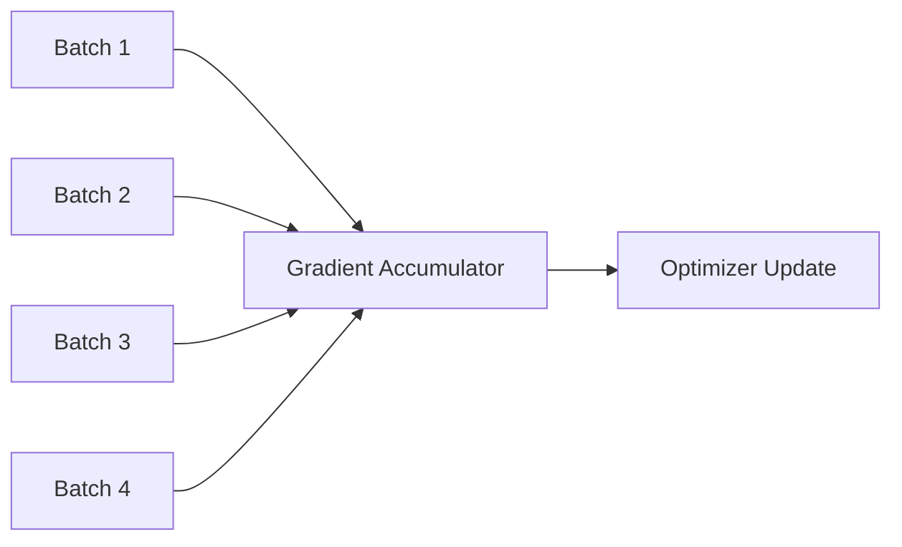

This is useful for large models where the desired effective batch size does not fit into GPU memory.

---

# 🧪 Simplified Gradient Accumulation

```python
accumulated_gradients = [
    tf.zeros_like(variable)
    for variable
    in model.trainable_variables
]


for x_batch, y_batch in train_dataset:

    with tf.GradientTape() as tape:

        predictions = model(
            x_batch,
            training=True
        )

        loss = loss_fn(
            y_batch,
            predictions
        )

    gradients = tape.gradient(
        loss,
        model.trainable_variables
    )

    accumulated_gradients = [

        acc + grad

        for acc, grad
        in zip(
            accumulated_gradients,
            gradients
        )
    ]
```

In production, the accumulated gradients should be normalized appropriately and reset after the optimizer update.

---

# 🧠 `tf.function`

TensorFlow can convert Python functions into optimized TensorFlow graphs using:

```python
@tf.function
```

Example:

```python
@tf.function
def square(
    x
):

    return x * x
```

This can improve execution efficiency for repeated TensorFlow operations.

---

# 🧠 Eager Execution vs Graph Execution

### Eager Execution

Operations execute immediately.

```text
Python Code
    ↓
Tensor Operation
    ↓
Immediate Result
```

### Graph Execution

Operations are traced into a computation graph.

```text
Python Function
      ↓
TensorFlow Graph
      ↓
Optimized Execution
```

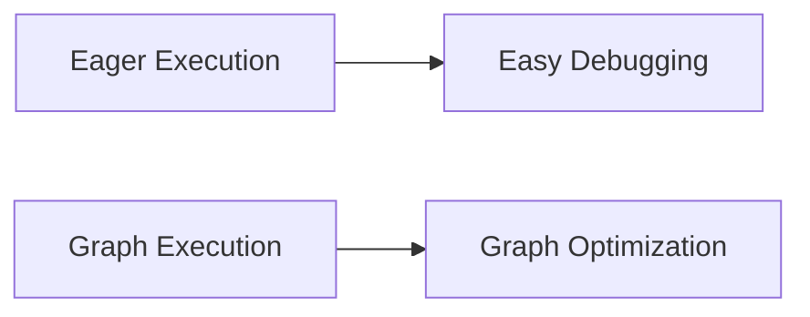

---

# 🧠 `tf.function` Example

```python
@tf.function
def train_step(
    model,
    optimizer,
    loss_fn,
    x,
    y
):

    with tf.GradientTape() as tape:

        predictions = model(
            x,
            training=True
        )

        loss = loss_fn(
            y,
            predictions
        )

    gradients = tape.gradient(
        loss,
        model.trainable_variables
    )

    optimizer.apply_gradients(
        zip(
            gradients,
            model.trainable_variables
        )
    )

    return loss
```

This can be used inside a custom training loop.

---

# ⚠ `tf.function` Considerations

`tf.function` can improve performance, but developers should understand:

- Tracing
- Retracing
- Python side effects
- Tensor vs Python values
- Dynamic control flow
- Input signatures

Avoid repeatedly creating different Python signatures that cause unnecessary retracing.

---

# 🧠 Custom Validation Loop

A custom validation loop can be implemented without gradient computation.

```python
for x_batch, y_batch in validation_dataset:

    predictions = model(
        x_batch,
        training=False
    )

    loss = loss_fn(
        y_batch,
        predictions
    )
```

Notice:

```text
training=False
```

and:

```text
No GradientTape
```

because validation does not update model parameters.

---

# 🧠 Training vs Validation

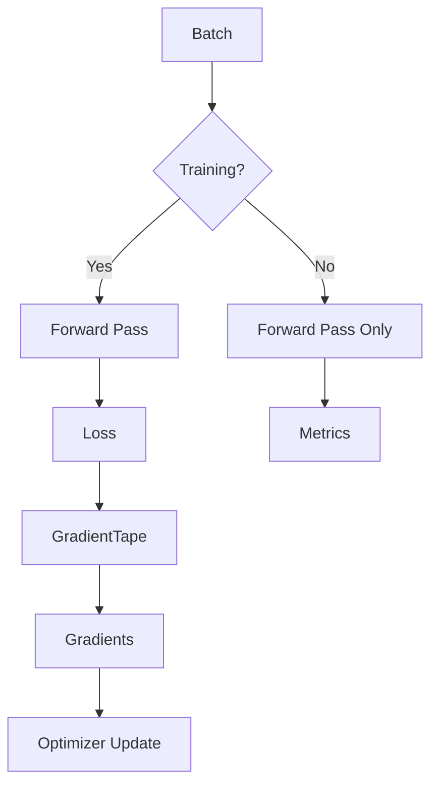

---

# 🧠 Custom Training Step with Metrics

A more complete training step can track metrics.

```python
loss_metric = tf.keras.metrics.Mean(
    name="loss"
)


for x_batch, y_batch in train_dataset:

    with tf.GradientTape() as tape:

        predictions = model(
            x_batch,
            training=True
        )

        loss = loss_fn(
            y_batch,
            predictions
        )

    gradients = tape.gradient(
        loss,
        model.trainable_variables
    )

    optimizer.apply_gradients(
        zip(
            gradients,
            model.trainable_variables
        )
    )

    loss_metric.update_state(
        loss
    )
```

At the end:

```python
print(
    loss_metric.result()
)
```

---

# 🧠 Complete Custom Training Architecture

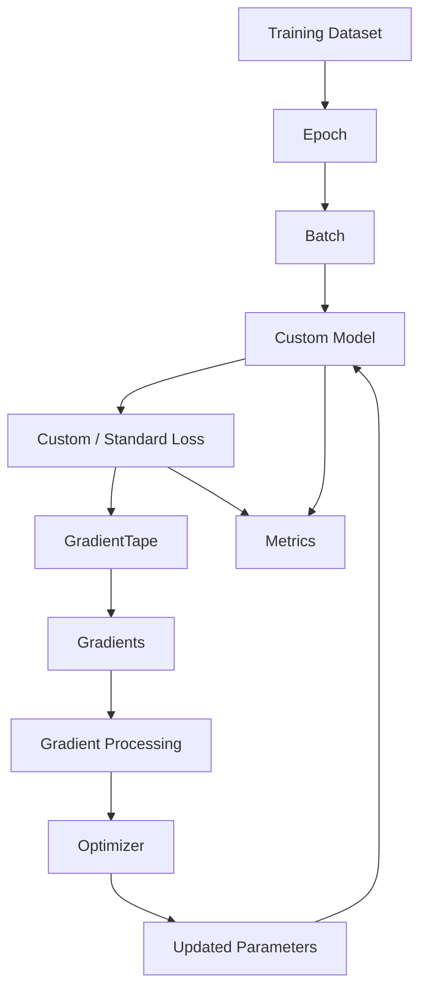

---

# 🧠 Custom Training Loop Design Principles

A good custom training loop should have clear separation between:

```text
Data Loading
      ↓
Forward Pass
      ↓
Loss Calculation
      ↓
Gradient Calculation
      ↓
Gradient Processing
      ↓
Parameter Update
      ↓
Metrics
      ↓
Checkpointing
```

Avoid putting all of this logic into one giant function.

---

# 🧱 Recommended Structure

A production-oriented implementation could look like:

```text
training/
│
├── trainer.py
├── losses.py
├── metrics.py
├── optimizers.py
├── schedulers.py
└── callbacks.py

models/
│
├── layers.py
├── blocks.py
└── model.py

data/
│
├── dataset.py
└── preprocessing.py
```

This keeps training infrastructure separate from model architecture.

---

# 🧠 Custom Layer Testing

Custom layers should be tested independently.

For example:

```python
layer = CustomDense(
    32
)

x = tf.random.normal(
    (8, 16)
)

y = layer(
    x
)

assert y.shape == (
    8,
    32
)
```

Test:

```text
Output Shape
Data Type
Trainable Variables
Numerical Behavior
Serialization
Training Behavior
Inference Behavior
```

---

# 🧪 Numerical Gradient Verification

For complex custom operations, gradient correctness matters.

You can inspect gradients:

```python
with tf.GradientTape() as tape:

    output = layer(x)

gradient = tape.gradient(
    output,
    layer.trainable_variables
)
```

Check for:

```text
None
NaN
Inf
Unexpected Magnitude
```

---

# ⚠ Common Custom-Layer Errors

Common mistakes include:

- Creating weights in the wrong place
- Creating weights repeatedly inside `call()`
- Forgetting `trainable=True`
- Returning tensors with unexpected shapes
- Ignoring the `training` argument
- Mixing NumPy operations with TensorFlow tensors inside differentiable computation
- Creating Python-side state that TensorFlow cannot track
- Failing to implement serialization configuration
- Assuming eager execution behavior is identical under `tf.function`

---

# 🧠 Serialization of Custom Layers

Custom layers should support serialization when they need to be saved and reloaded.

Example:

```python
class ScalingLayer(
    tf.keras.layers.Layer
):

    def __init__(
        self,
        scale,
        **kwargs
    ):

        super().__init__(
            **kwargs
        )

        self.scale = scale

    def call(
        self,
        inputs
    ):

        return inputs * self.scale

    def get_config(
        self
    ):

        config = super().get_config()

        config.update({
            "scale": self.scale
        })

        return config
```

This allows Keras to reconstruct the layer configuration.

---

# 🧠 Why `get_config()` Matters

Without proper serialization:

```text
Saved Model
      ↓
Load Model
      ↓
Custom Layer Unknown
```

With serialization support:

```text
Saved Model
      ↓
Configuration
      ↓
Custom Layer Reconstruction
      ↓
Loaded Model
```

For production systems, model portability is an important consideration.

---

# 🧠 Custom Models and Serialization

Custom models should similarly be designed with serialization in mind.

Keep configuration values explicit:

```python
class CustomModel(
    tf.keras.Model
):

    def __init__(
        self,
        units,
        **kwargs
    ):

        super().__init__(
            **kwargs
        )

        self.units = units

        self.dense = tf.keras.layers.Dense(
            units
        )
```

Configuration should not be hidden inside arbitrary runtime state.

---

# 🏢 Enterprise Perspective

Custom layers and training loops provide powerful capabilities, but they also increase engineering responsibility.

With standard Keras:

```text
Less Code
+
More Framework Management
```

With custom training:

```text
More Control
+
More Engineering Responsibility
```

The production engineering team must now consider:

```text
Correctness
+
Testing
+
Serialization
+
Reproducibility
+
Performance
+
Numerical Stability
+
Monitoring
+
Distributed Execution
```

---

!!! tip "Production Insight"

    **Use the highest-level abstraction that satisfies the requirement.**

    A practical decision is:

    ```text
    Standard Model
        ↓
    model.fit()

    Need Custom Model Component
        ↓
    Custom Layer

    Need Custom Training Behavior
        ↓
    Override train_step()

    Need Maximum Training Control
        ↓
    Custom Training Loop
    ```

    Do not implement a custom training loop simply because you can.

    Every additional layer of customization becomes part of the production system that must be tested, maintained, monitored, and upgraded.

---

# 🧠 Custom Training Decision Guide

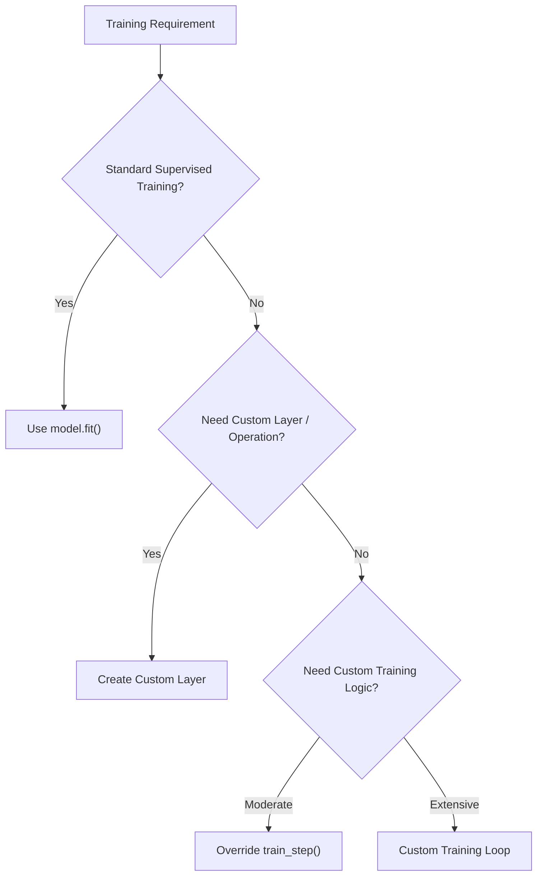

---

# 🧪 Practical Exercise 1 — Custom Dense Layer

Implement a layer that performs:

\[
y=f(Wx+b)
\]

Requirements:

```text
Custom weights
Custom bias
Optional activation
Correct trainable variables
```

Test it against:

```python
tf.keras.layers.Dense
```

for compatible initialization and configuration.

---

# 🧪 Practical Exercise 2 — Custom Residual Block

Implement:

```text
Input
  │
  ├──────────────┐
  ↓              │
Dense            │
  ↓              │
Dense            │
  ↓              │
  └──── Add ◄────┘
         ↓
       ReLU
```

Verify:

```text
Input Shape
Output Shape
Parameter Count
Gradient Flow
```

---

# 🧪 Practical Exercise 3 — Custom Loss

Implement:

```python
def custom_loss(
    y_true,
    y_pred
):
    ...
```

Compare it with:

```python
tf.keras.losses.MeanSquaredError()
```

Verify that the outputs are numerically consistent for the same inputs.

---

# 🧪 Practical Exercise 4 — Custom Training Loop

Build:

```text
Dataset
 ↓
Model
 ↓
Loss
 ↓
GradientTape
 ↓
Gradients
 ↓
AdamW
 ↓
Update
```

Track:

```text
Training Loss
Validation Loss
Accuracy
```

---

# 🧪 Practical Exercise 5 — Custom `train_step()`

Create a custom model that overrides:

```python
train_step()
```

but still trains using:

```python
model.fit()
```

Compare the implementation with a normal Keras model.

---

# 🧪 Practical Exercise 6 — Gradient Clipping

Modify the custom training loop to apply:

```python
tf.clip_by_global_norm()
```

Compare:

```text
Without Clipping
With Clipping
```

Track gradient norms and training stability.

---

# 🧪 Practical Exercise 7 — Gradient Accumulation

Implement gradient accumulation:

```text
Batch 1
Batch 2
Batch 3
Batch 4
    ↓
Optimizer Update
```

Compare it against:

```text
Large Physical Batch
```

with approximately the same effective batch size.

---

# 🧪 Practical Exercise 8 — Training vs Inference

Create a custom layer whose behavior changes according to:

```python
training=True
```

and:

```python
training=False
```

Verify that:

```text
Training Output
```

and:

```text
Inference Output
```

behave as expected.

---

# 🧠 Interview Questions

## Beginner

### 1. Why would you create a custom Keras layer?

To implement reusable computations or transformations that are not adequately represented by existing Keras layers.

### 2. What are the main methods in a custom layer?

Commonly:

```text
__init__()
build()
call()
```

### 3. What does `build()` do?

It is commonly used to create weights whose shapes depend on the input shape.

### 4. What does `call()` do?

It defines the forward computation performed by the layer.

### 5. What is `GradientTape`?

`tf.GradientTape` records differentiable TensorFlow operations so gradients can be computed automatically.

---

## Intermediate

### 6. What is the difference between a custom layer and custom model?

A custom layer generally represents a reusable computation block, while a custom model represents a larger network architecture and its forward pass.

### 7. What is a custom training loop?

It is a manually controlled training process where the developer explicitly performs forward computation, loss calculation, gradient calculation, and parameter updates.

### 8. Why use a custom training loop?

When standard `model.fit()` does not provide sufficient control over the training algorithm.

### 9. What is `train_step()`?

It is a Keras extension point that allows custom training logic while continuing to use the broader `model.fit()` framework.

### 10. What is the difference between a loss and a metric?

A loss provides the optimization objective, while a metric is primarily used to measure and monitor model behavior.

### 11. What is gradient clipping?

Gradient clipping limits gradient magnitude to improve numerical stability and control exploding gradients.

---

## Advanced

### 12. Why should weights generally not be created inside `call()`?

Because `call()` may execute repeatedly. Creating weights there can lead to repeated variable creation and incorrect parameter tracking.

### 13. Why is `training` passed to `call()`?

Some layers need different behavior during training and inference, such as Dropout and Batch Normalization.

### 14. What is the advantage of overriding `train_step()` over writing a completely custom loop?

It allows custom training logic while retaining Keras features such as `fit()`, callbacks, progress reporting, and other training infrastructure.

### 15. When would you use multiple optimizers?

When different model components require independent optimization, such as generator/discriminator systems or specialized multi-network training.

### 16. Why is gradient accumulation useful?

It allows a larger effective batch size when the desired batch cannot fit into available device memory.

### 17. What are the risks of custom training loops?

They introduce additional complexity around:

```text
Correctness
Metrics
Checkpointing
Distributed Training
Mixed Precision
Serialization
Reproducibility
```

### 18. Why is serialization important for custom layers?

A production model must be reconstructable after deployment or loading. Custom layer configuration must therefore be preserved correctly.

### 19. When should you avoid a custom training loop?

When standard Keras training already satisfies the requirements. Unnecessary customization increases maintenance and testing complexity.

### 20. How would you design a production custom training system?

Separate:

```text
Model
Layer
Loss
Optimizer
Training Step
Metrics
Checkpointing
Configuration
Data Pipeline
```

and ensure each component is testable and observable.

---

# 📌 Key Takeaways

- Keras provides high-level APIs but also allows low-level customization.
- Custom layers extend `tf.keras.layers.Layer`.
- `__init__()` generally stores configuration.
- `build()` is useful for creating input-dependent weights.
- `call()` defines the forward computation.
- `add_weight()` allows Keras to track variables correctly.
- Trainable variables participate in gradient-based optimization.
- Non-trainable variables represent state that is not optimized through gradients.
- Custom layers can implement reusable mathematical operations.
- Custom models extend `tf.keras.Model`.
- A model's `call()` defines its forward pass.
- `tf.GradientTape` provides automatic differentiation.
- A custom training step generally consists of forward pass, loss calculation, gradient computation, and optimizer update.
- Custom training loops provide maximum control.
- Overriding `train_step()` provides a useful middle ground between `model.fit()` and a fully custom loop.
- Custom losses allow specialized optimization objectives.
- `add_loss()` can incorporate additional regularization or auxiliary objectives.
- Custom metrics provide specialized monitoring.
- Gradient clipping can be incorporated into custom training.
- Gradient accumulation can increase effective batch size without increasing physical batch size.
- `tf.function` can convert Python functions into optimized TensorFlow graphs.
- Training and inference may require different layer behavior.
- Custom components should be independently tested.
- Custom layers and models should support serialization when required.
- Custom training loops should be used only when the additional control justifies the additional complexity.
- Production Deep Learning requires balancing flexibility with maintainability, reproducibility, observability, and operational reliability.

---

# 📚 Further Reading

Continue with:

- **[16. PyTorch Fundamentals and Tensors](16-pytorch-fundamentals-and-tensors.md)**
- **[17. PyTorch Autograd, Dataset and DataLoader](17-pytorch-autograd-dataset-and-dataloader.md)**
- **[18. Building Classification and Regression Models](18-building-classification-and-regression-models.md)**
- **[19. Convolutional Neural Networks](19-convolutional-neural-networks.md)**
- **[20. CNN Architecture, Optimization and Training](20-cnn-architecture-optimization-and-training.md)**
- **[22. ResNet, Residual Connections and TorchVision](22-resnet-residual-connections-and-torchvision.md)**
- **[30. Generative Adversarial Networks](30-generative-adversarial-networks.md)**
- **[36. Deep Learning Training and Model Lifecycle](36-deep-learning-training-and-model-lifecycle.md)**

The next chapter moves to the second major Deep Learning framework and builds the equivalent foundations in **PyTorch**, including tensors, autograd, model construction, and GPU execution.

---

## ➡️ Next Chapter

**[16. PyTorch Fundamentals and Tensors](16-pytorch-fundamentals-and-tensors.md)**

---

> **Enterprise AI Engineering Handbook**  
> *Building Production-Grade Enterprise AI Systems — One Chapter at a Time.*