# 16. PyTorch Fundamentals and Tensors

> Learn the foundations of PyTorch, understand tensors, tensor operations, device management, automatic differentiation, neural network modules, parameters, GPU acceleration, and the core building blocks required to develop Deep Learning models using PyTorch.

---

## 🎯 Learning Objectives

After completing this chapter, you will be able to:

- Explain what PyTorch is
- Understand the architecture of PyTorch
- Understand PyTorch tensors
- Understand tensor dimensions, shape, rank, and data types
- Create tensors using different methods
- Perform tensor indexing and slicing
- Perform tensor arithmetic and matrix operations
- Understand broadcasting
- Reshape, transpose, squeeze, and unsqueeze tensors
- Understand tensor devices
- Move tensors between CPU and GPU
- Understand tensor memory and performance considerations
- Understand `requires_grad`
- Understand the role of tensors in automatic differentiation
- Understand `torch.nn`
- Build neural network components using `nn.Module`
- Understand parameters and trainable variables
- Build a basic PyTorch neural network
- Understand the PyTorch training workflow
- Understand the difference between training and inference
- Save and load PyTorch models
- Understand PyTorch GPU acceleration
- Understand the relationship between tensors, models, autograd, and optimizers
- Prepare for PyTorch datasets, DataLoaders, and custom training loops

---

# 📖 Overview

PyTorch is an open-source Deep Learning framework widely used for:

- Neural network development
- Computer Vision
- Natural Language Processing
- Generative AI
- Reinforcement Learning
- Research
- Production Machine Learning

The core PyTorch ecosystem can be viewed as:

```text
PyTorch
   │
   ├── Tensors
   │
   ├── Autograd
   │
   ├── torch.nn
   │
   ├── Optimizers
   │
   ├── Data Utilities
   │
   ├── GPU / CUDA
   │
   └── Model Serialization
```

---

# 🧠 What Is PyTorch?

PyTorch is a tensor-based Deep Learning framework that provides:

```text
Tensor Computation
+
Automatic Differentiation
+
Neural Network APIs
+
Optimization
+
GPU Acceleration
+
Data Loading
```

A typical PyTorch Deep Learning workflow is:

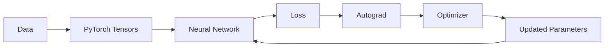

---

# 🧠 PyTorch vs TensorFlow

Both frameworks provide the fundamental capabilities required for Deep Learning.

| Capability | PyTorch | TensorFlow |
|---|---|---|
| Tensor Operations | `torch.Tensor` | `tf.Tensor` |
| Neural Networks | `torch.nn` | `tf.keras` |
| Automatic Differentiation | `torch.autograd` | `tf.GradientTape` |
| Optimizers | `torch.optim` | `tf.keras.optimizers` |
| Data Pipeline | `Dataset` / `DataLoader` | `tf.data` |
| GPU | CUDA / device APIs | CUDA / device APIs |
| Model Definition | `nn.Module` | Keras Model |
| Training | Custom / higher-level tooling | `model.fit()` / custom |
| Ecosystem | PyTorch ecosystem | TensorFlow ecosystem |

The important point is that both frameworks implement similar Deep Learning concepts using different APIs and abstractions.

---

# 🧠 The PyTorch Mental Model

A useful mental model is:

```text
Tensor
  ↓
Model
  ↓
Prediction
  ↓
Loss
  ↓
Autograd
  ↓
Gradients
  ↓
Optimizer
  ↓
Parameter Update
```

This loop is repeated across batches and epochs.

---

# 🔢 What Is a PyTorch Tensor?

A PyTorch tensor is a multidimensional data structure used for numerical computation.

Examples:

```text
Scalar
Vector
Matrix
3D Tensor
4D Tensor
5D Tensor
```

Deep Learning models operate primarily on tensors.

---

# 📐 Tensor Rank

Tensor rank represents the number of dimensions.

### Rank 0 — Scalar

```python
x = torch.tensor(5)
```

Conceptually:

```text
5
```

---

### Rank 1 — Vector

```python
x = torch.tensor(
    [1, 2, 3]
)
```

Conceptually:

```text
[1, 2, 3]
```

---

### Rank 2 — Matrix

```python
x = torch.tensor(
    [
        [1, 2],
        [3, 4]
    ]
)
```

Conceptually:

```text
[
    [1, 2],
    [3, 4]
]
```

---

### Rank 3 Tensor

```python
x = torch.tensor(
    [
        [
            [1, 2],
            [3, 4]
        ],
        [
            [5, 6],
            [7, 8]
        ]
    ]
)
```

---

# 🧠 Tensor Dimensions

A tensor can be represented as:

```text
Shape
 ↓
(D1, D2, D3, ...)
```

For example:

```text
(32, 224, 224, 3)
```

may represent:

```text
Batch Size = 32
Height     = 224
Width      = 224
Channels   = 3
```

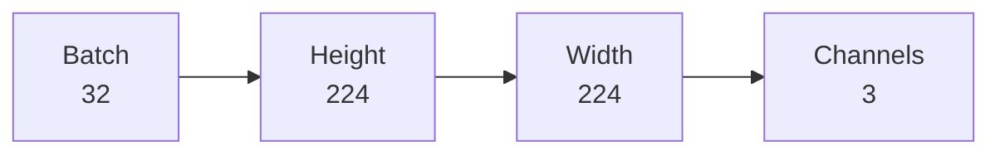

---

# 🐍 Importing PyTorch

```python
import torch
```

For neural networks:

```python
import torch.nn as nn
```

For optimization:

```python
import torch.optim as optim
```

---

# 🧪 Creating Tensors

## From Python Lists

```python
x = torch.tensor(
    [1, 2, 3]
)
```

---

## Matrix

```python
x = torch.tensor(
    [
        [1, 2],
        [3, 4]
    ]
)
```

---

## Random Tensor

```python
x = torch.rand(
    3,
    4
)
```

---

## Normal Distribution

```python
x = torch.randn(
    3,
    4
)
```

---

## Zeros

```python
x = torch.zeros(
    3,
    4
)
```

---

## Ones

```python
x = torch.ones(
    3,
    4
)
```

---

## Empty Tensor

```python
x = torch.empty(
    3,
    4
)
```

`empty()` allocates memory without initializing the values to a meaningful default.

---

# 🧠 Tensor Creation Summary

| Function | Purpose |
|---|---|
| `torch.tensor()` | Create from existing data |
| `torch.zeros()` | Create zeros |
| `torch.ones()` | Create ones |
| `torch.rand()` | Uniform random values |
| `torch.randn()` | Normal random values |
| `torch.empty()` | Uninitialized tensor |
| `torch.arange()` | Sequence of values |
| `torch.linspace()` | Evenly spaced values |

---

# 🔢 `torch.arange()`

```python
x = torch.arange(
    0,
    10
)
```

Result:

```text
[0, 1, 2, ..., 9]
```

---

# 📏 `torch.linspace()`

```python
x = torch.linspace(
    0,
    1,
    5
)
```

Conceptually:

```text
[0.00, 0.25, 0.50, 0.75, 1.00]
```

---

# 🔍 Inspecting a Tensor

```python
x = torch.randn(
    32,
    784
)

print(x)
print(x.shape)
print(x.ndim)
print(x.dtype)
print(x.device)
```

Typical information:

```text
Shape
Number of Dimensions
Data Type
Device
```

---

# 🧠 Tensor Shape

For:

```python
x = torch.randn(
    32,
    784
)
```

the shape is:

```text
(32, 784)
```

This commonly means:

```text
32 samples
784 features
```

---

# 🧠 Tensor `ndim`

```python
x.ndim
```

returns the number of dimensions.

Example:

```python
x = torch.randn(
    32,
    224,
    224,
    3
)

print(x.ndim)
```

Result:

```text
4
```

---

# 🧠 Tensor Data Types

Common PyTorch data types include:

```text
torch.float32
torch.float64
torch.float16
torch.bfloat16
torch.int32
torch.int64
torch.uint8
torch.bool
```

For many Deep Learning workloads:

```text
float32
```

is a common default.

---

# 🔄 Converting Data Types

```python
x = torch.tensor(
    [1, 2, 3]
)

x = x.float()
```

Or:

```python
x = x.to(
    torch.float32
)
```

---

# 🧠 Why Data Type Matters

Data type affects:

```text
Memory Usage
Computation Speed
Numerical Precision
GPU Performance
```

For example:

```text
float32
   ↓
Higher Precision

float16 / bfloat16
   ↓
Lower Memory
Potentially Faster Training
```

Mixed precision is explored further in advanced training and optimization topics.

---

# 🔢 Tensor Indexing

```python
x = torch.tensor(
    [
        [10, 20, 30],
        [40, 50, 60]
    ]
)
```

Access the first row:

```python
x[0]
```

Access the first element:

```python
x[0, 0]
```

Access the second row, third element:

```python
x[1, 2]
```

---

# ✂️ Tensor Slicing

```python
x[:, 0]
```

selects the first column.

```python
x[0, :]
```

selects the first row.

```python
x[:, 1:3]
```

selects columns 1 and 2.

---

# 🧮 Tensor Arithmetic

```python
a = torch.tensor(
    [1, 2, 3]
)

b = torch.tensor(
    [4, 5, 6]
)

print(a + b)
print(a - b)
print(a * b)
print(a / b)
```

These operations are element-wise.

---

# ✖️ Matrix Multiplication

Matrix multiplication is fundamental to neural networks.

```python
a = torch.tensor(
    [
        [1.0, 2.0],
        [3.0, 4.0]
    ]
)

b = torch.tensor(
    [
        [5.0, 6.0],
        [7.0, 8.0]
    ]
)

result = torch.matmul(
    a,
    b
)
```

You can also use:

```python
result = a @ b
```

Mathematically:

\[
C=AB
\]

---

# 🧮 Dot Product

For vectors:

```python
a = torch.tensor(
    [1.0, 2.0, 3.0]
)

b = torch.tensor(
    [4.0, 5.0, 6.0]
)

result = torch.dot(
    a,
    b
)
```

---

# 🔄 Reshaping

PyTorch provides:

```python
reshape()
```

Example:

```python
x = torch.arange(
    12
)

x = x.reshape(
    3,
    4
)
```

Result:

```text
3 × 4
```

---

# 🧠 `view()`

`view()` can reshape tensors when the underlying memory layout permits it.

```python
x = torch.arange(
    12
)

y = x.view(
    3,
    4
)
```

In modern PyTorch code, `reshape()` is often more convenient because it can handle non-contiguous tensors by creating a copy when necessary.

---

# 🔄 Flattening

```python
x = torch.randn(
    32,
    28,
    28
)

flat = x.reshape(
    32,
    -1
)
```

The result is:

```text
32 × 784
```

This is commonly used when transitioning from image feature maps to fully connected layers.

---

# ↔️ Transpose

```python
x = torch.randn(
    3,
    4
)

y = x.T
```

For more general dimensions:

```python
y = x.transpose(
    0,
    1
)
```

---

# 🧩 `permute()`

`permute()` changes the ordering of dimensions.

Example:

```python
x = torch.randn(
    32,
    224,
    224,
    3
)

y = x.permute(
    0,
    3,
    1,
    2
)
```

Shape changes from:

```text
Batch × Height × Width × Channels
```

to:

```text
Batch × Channels × Height × Width
```

This is particularly important because many PyTorch vision layers commonly use channel-first tensor layouts.

---

# 🧠 Tensor Layout

A common PyTorch image tensor format is:

```text
N × C × H × W
```

where:

```text
N = Batch
C = Channels
H = Height
W = Width
```

For example:

```text
32 × 3 × 224 × 224
```

---

# 🖼️ Image Tensor Pipeline


---

# 🔄 `unsqueeze()`

`unsqueeze()` adds a dimension.

```python
x = torch.tensor(
    [1, 2, 3]
)

y = x.unsqueeze(
    0
)
```

Shape:

```text
(3)
```

becomes:

```text
(1, 3)
```

---

# 🔄 `squeeze()`

`squeeze()` removes dimensions of size 1.

```python
x = torch.randn(
    1,
    3,
    1
)

y = x.squeeze()
```

---

# 🧠 Broadcasting

PyTorch supports broadcasting for compatible shapes.

```python
x = torch.tensor(
    [
        [1.0, 2.0],
        [3.0, 4.0]
    ]
)

y = torch.tensor(
    [10.0, 20.0]
)

result = x + y
```

Conceptually:

```text
[1, 2]    [10, 20]
[3, 4] +  [10, 20]
```

Result:

```text
[11, 22]
[13, 24]
```

---

# 🧠 Tensor Reduction

Common reduction operations include:

```python
x.mean()
x.sum()
x.max()
x.min()
```

Example:

```python
x = torch.tensor(
    [1.0, 2.0, 3.0]
)

print(
    x.mean()
)
```

---

# 📊 Reduction Along a Dimension

```python
x = torch.tensor(
    [
        [1.0, 2.0],
        [3.0, 4.0]
    ]
)

row_mean = x.mean(
    dim=1
)

column_mean = x.mean(
    dim=0
)
```

Understanding dimensions is critical when building neural networks.

---

# 🧠 Device Management

PyTorch tensors can live on different devices.

Common examples:

```text
CPU
CUDA GPU
MPS
```

A tensor's device can be inspected using:

```python
x.device
```

---

# 🖥️ CPU Tensor

```python
x = torch.tensor(
    [1.0, 2.0, 3.0]
)

print(
    x.device
)
```

Typical result:

```text
cpu
```

---

# 🚀 GPU Availability

For NVIDIA CUDA:

```python
torch.cuda.is_available()
```

Example:

```python
if torch.cuda.is_available():

    print(
        "CUDA GPU available"
    )
```

---

# 🧠 Selecting a Device

A common pattern is:

```python
device = torch.device(
    "cuda"
    if torch.cuda.is_available()
    else "cpu"
)
```

Then:

```python
x = torch.randn(
    32,
    784
).to(device)
```

---

# 🧠 Device-Agnostic Code

A production-friendly approach is:

```python
device = torch.device(
    "cuda"
    if torch.cuda.is_available()
    else "cpu"
)

model = model.to(
    device
)

x = x.to(
    device
)
```

This allows the same code to run on:

```text
GPU
or
CPU
```

without hardcoding one environment.

---

# 🧠 CPU → GPU

```python
x = torch.randn(
    1000,
    1000
)

if torch.cuda.is_available():

    x = x.to(
        "cuda"
    )
```

---

# 🧠 GPU → CPU

```python
x_cpu = x.to(
    "cpu"
)
```

When converting tensors to NumPy:

```python
array = x_cpu.numpy()
```

For a GPU tensor:

```python
array = x.detach().cpu().numpy()
```

---

# ⚠ Device Mismatch

Model and input tensors generally need to be on compatible devices.

Incorrect:

```text
Model → GPU
Input → CPU
```

This can produce runtime errors.

Correct:

```text
Model → GPU
Input → GPU
```

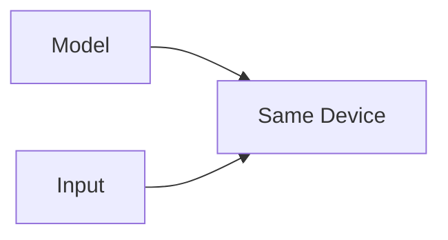

---

# 🧠 GPU Memory

GPU memory is consumed by:

```text
Model Parameters
+
Gradients
+
Optimizer State
+
Activations
+
Input Batches
```

Therefore, GPU memory usage can increase significantly with:

```text
Larger Models
Larger Batch Sizes
Longer Sequences
Higher Resolution Images
Larger Activations
```

---

# 🧠 PyTorch Autograd

PyTorch provides automatic differentiation through:

```python
torch.autograd
```

The key concept is:

```python
requires_grad=True
```

Example:

```python
x = torch.tensor(
    3.0,
    requires_grad=True
)
```

---

# 🧮 Automatic Differentiation

Suppose:

\[
y=x^2
\]

Then:

\[
\frac{dy}{dx}=2x
\]


PyTorch can calculate this automatically.

---

# 🧪 Basic Autograd Example

```python
import torch


x = torch.tensor(
    3.0,
    requires_grad=True
)

y = x ** 2

y.backward()

print(
    x.grad
)
```

Result:

```text
6
```

---

# 🧠 Autograd Workflow

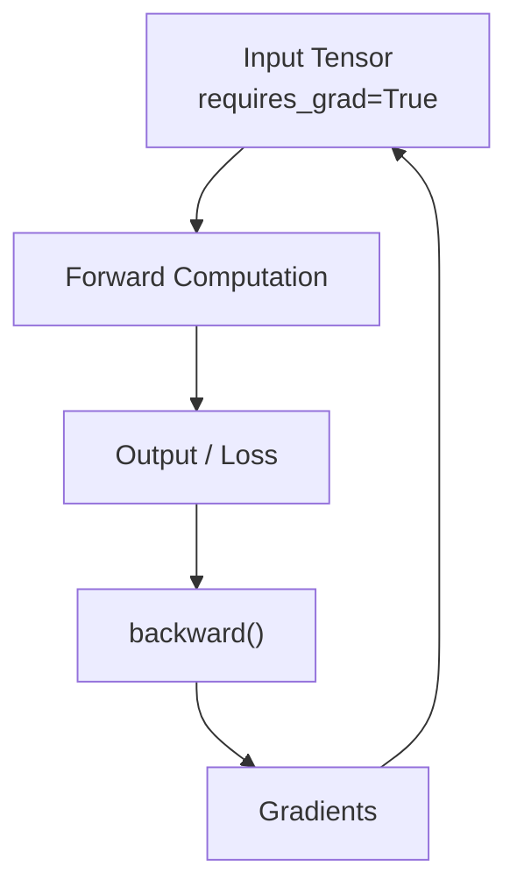

---

# 🧠 Computational Graph

PyTorch tracks operations involving tensors that require gradients.

For:

```python
y = x * x
```

the computational graph conceptually becomes:

```text
x
│
├── ×
│
└── x
    ↓
    y
```

During:

```python
y.backward()
```

PyTorch traverses the graph backward to compute gradients.

---

# 🧠 Gradient Accumulation

PyTorch gradients accumulate by default.

Example:

```python
x = torch.tensor(
    2.0,
    requires_grad=True
)

y = x ** 2

y.backward()

print(
    x.grad
)
```

If another backward pass is performed without clearing the gradient, the gradient can accumulate.

Therefore, training loops commonly reset gradients.

---

# 🧹 Clearing Gradients

With an optimizer:

```python
optimizer.zero_grad()
```

Then:

```python
loss.backward()
```

Then:

```python
optimizer.step()
```

The standard sequence is:

```text
zero_grad()
    ↓
forward
    ↓
loss
    ↓
backward()
    ↓
step()
```

---

# 🧠 PyTorch Neural Networks

PyTorch provides:

```python
torch.nn
```

for neural network components.

Common modules include:

```text
nn.Linear
nn.Conv2d
nn.ReLU
nn.Dropout
nn.BatchNorm2d
nn.MaxPool2d
nn.LSTM
nn.GRU
nn.Embedding
```

---

# 🧱 `nn.Module`

The fundamental abstraction for neural network models is:

```python
nn.Module
```

A model generally:

```python
class MyModel(
    nn.Module
):
```

---

# 🧪 Basic PyTorch Model

```python
import torch
import torch.nn as nn


class SimpleNetwork(
    nn.Module
):

    def __init__(self):

        super().__init__()

        self.fc1 = nn.Linear(
            784,
            128
        )

        self.fc2 = nn.Linear(
            128,
            64
        )

        self.output = nn.Linear(
            64,
            10
        )

    def forward(
        self,
        x
    ):

        x = torch.relu(
            self.fc1(x)
        )

        x = torch.relu(
            self.fc2(x)
        )

        return self.output(x)
```

---

# 🧠 PyTorch Model Architecture

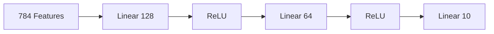

---

# 🧠 Why `nn.Module`?

`nn.Module` automatically manages:

- Parameters
- Child modules
- Model hierarchy
- Device movement
- Training/inference modes
- State dictionaries

For example:

```python
model.parameters()
```

returns trainable parameters.

---

# 🔍 Inspecting Model Parameters

```python
model = SimpleNetwork()

for name, parameter in model.named_parameters():

    print(
        name,
        parameter.shape
    )
```

Typical parameters include:

```text
fc1.weight
fc1.bias
fc2.weight
fc2.bias
output.weight
output.bias
```

---

# 🧮 Parameter Count

For:

```text
nn.Linear(784, 128)
```

the parameter count is:

\[
784\times128+128
\]


This includes:

```text
Weights
+
Bias
```

---

# 🧠 `forward()`

The `forward()` method defines the forward computation.

Example:

```python
def forward(
    self,
    x
):

    x = self.fc1(
        x
    )

    x = torch.relu(
        x
    )

    return self.output(
        x
    )
```

You normally invoke the model as:

```python
output = model(
    x
)
```

rather than calling:

```python
model.forward(x)
```

directly.

---

# 🧠 Model Call Flow

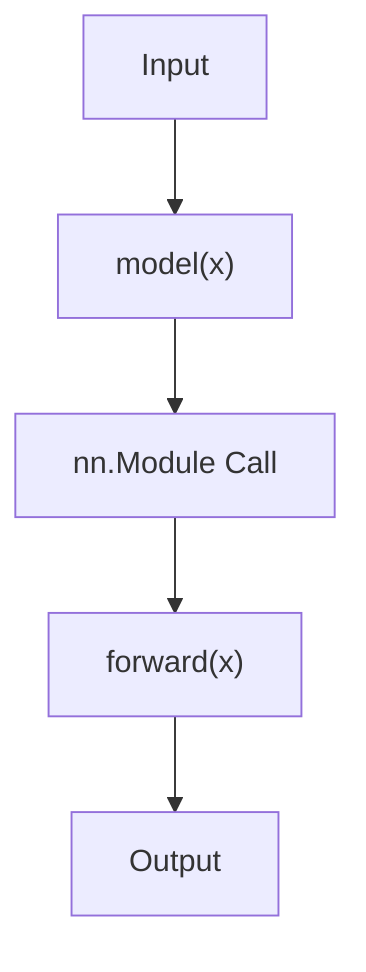

The `nn.Module` call mechanism also supports hooks and other framework behavior.

---

# 🧠 `nn.Linear`

The PyTorch equivalent of a fully connected layer is:

```python
nn.Linear(
    in_features,
    out_features
)
```

Mathematically:

\[
y=xW^T+b
\]


Example:

```python
layer = nn.Linear(
    784,
    128
)
```

---

# 🧠 Activation Functions

PyTorch provides activation functions such as:

```python
nn.ReLU()
nn.Sigmoid()
nn.Tanh()
nn.GELU()
nn.Softmax()
```

Example:

```python
self.relu = nn.ReLU()
```

or:

```python
x = torch.relu(
    x
)
```

---

# 🧪 Using `nn.Sequential`

PyTorch also provides a convenient sequential model API.

```python
model = nn.Sequential(

    nn.Linear(
        784,
        128
    ),

    nn.ReLU(),

    nn.Linear(
        128,
        64
    ),

    nn.ReLU(),

    nn.Linear(
        64,
        10
    )
)
```

This is conceptually similar to Keras Sequential.

---

# 🧠 Sequential vs Custom `nn.Module`

| Approach | Best Use |
|---|---|
| `nn.Sequential` | Simple linear stacks |
| Custom `nn.Module` | Complex architectures |
| Functional Tensor Operations | Specialized computations |

For architectures involving:

```text
Branches
Skip Connections
Multiple Inputs
Multiple Outputs
Custom Logic
```

a custom `nn.Module` is generally more appropriate.

---

# 🧠 Training Mode and Evaluation Mode

PyTorch models have two important modes:

```python
model.train()
```

and:

```python
model.eval()
```

Training mode enables training-specific behavior such as:

```text
Dropout
Batch Normalization behavior
```

Evaluation mode switches the model to inference behavior.

---

# 🧪 Training Mode

```python
model.train()

predictions = model(
    x
)
```

---

# 🧪 Evaluation Mode

```python
model.eval()

with torch.no_grad():

    predictions = model(
        x
    )
```

---

# 🧠 `torch.no_grad()`

During inference, gradients are generally unnecessary.

```python
with torch.no_grad():

    output = model(
        x
    )
```

This reduces unnecessary autograd tracking and can lower memory usage.

---

# 🧠 Training vs Inference

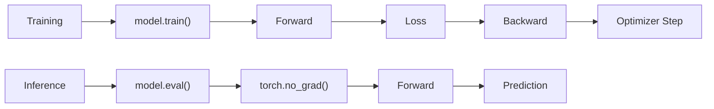

---

# 🧠 PyTorch Training Workflow

The fundamental training loop is:

```python
for x_batch, y_batch in train_loader:

    optimizer.zero_grad()

    predictions = model(
        x_batch
    )

    loss = loss_fn(
        predictions,
        y_batch
    )

    loss.backward()

    optimizer.step()
```

The workflow is:

```text
Zero Gradients
      ↓
Forward Pass
      ↓
Calculate Loss
      ↓
Backward Pass
      ↓
Update Parameters
```

---

# 🧠 PyTorch Training Loop Architecture

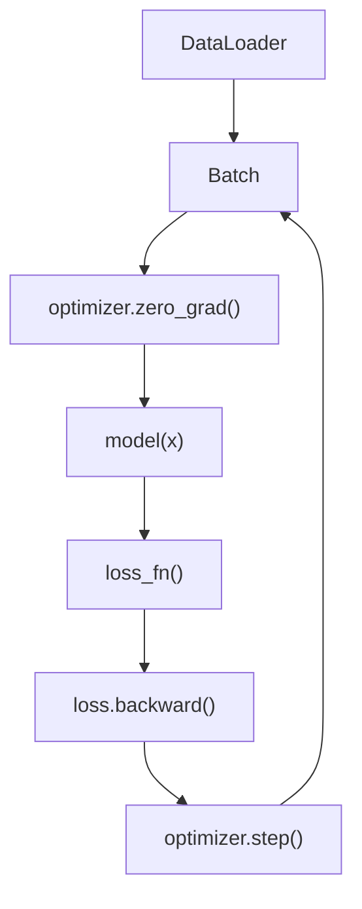

---

# 🧠 Loss Functions

PyTorch provides many loss functions.

Common examples:

```python
nn.MSELoss()
nn.L1Loss()
nn.CrossEntropyLoss()
nn.BCEWithLogitsLoss()
```

Example:

```python
loss_fn = nn.CrossEntropyLoss()
```

---

# 🧠 Optimizers

PyTorch provides:

```python
torch.optim
```

Common optimizers include:

```text
SGD
Adam
AdamW
RMSprop
```

Example:

```python
optimizer = torch.optim.AdamW(
    model.parameters(),
    lr=0.001
)
```

---

# 🧠 Optimizer Workflow

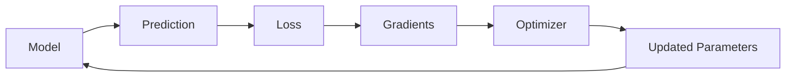

---

# 🧪 Complete PyTorch Classification Example

```python
import torch
import torch.nn as nn


device = torch.device(
    "cuda"
    if torch.cuda.is_available()
    else "cpu"
)


class Classifier(
    nn.Module
):

    def __init__(self):

        super().__init__()

        self.network = nn.Sequential(

            nn.Linear(
                784,
                128
            ),

            nn.ReLU(),

            nn.Linear(
                128,
                64
            ),

            nn.ReLU(),

            nn.Linear(
                64,
                10
            )
        )

    def forward(
        self,
        x
    ):

        return self.network(
            x
        )


model = Classifier().to(
    device
)


loss_fn = nn.CrossEntropyLoss()


optimizer = torch.optim.AdamW(
    model.parameters(),
    lr=0.001
)
```

Training:

```python
for epoch in range(
    10
):

    model.train()

    for x_batch, y_batch in train_loader:

        x_batch = x_batch.to(
            device
        )

        y_batch = y_batch.to(
            device
        )

        optimizer.zero_grad()

        predictions = model(
            x_batch
        )

        loss = loss_fn(
            predictions,
            y_batch
        )

        loss.backward()

        optimizer.step()
```

---

# 🧠 Why `CrossEntropyLoss` Expects Logits

For multi-class classification, the model commonly returns raw logits:

```python
outputs = model(
    x
)
```

The final layer is usually:

```python
nn.Linear(
    64,
    10
)
```

without explicitly applying:

```python
Softmax
```

when using:

```python
nn.CrossEntropyLoss()
```

`CrossEntropyLoss` internally combines the required log-softmax and negative log-likelihood behavior.

Therefore:

```text
Model
 ↓
Raw Logits
 ↓
CrossEntropyLoss
```

is the common PyTorch pattern.

---

# 🧠 PyTorch Classification Architecture

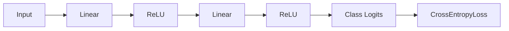

---

# 🧪 PyTorch Regression Example

```python
class RegressionModel(
    nn.Module
):

    def __init__(self):

        super().__init__()

        self.network = nn.Sequential(

            nn.Linear(
                10,
                64
            ),

            nn.ReLU(),

            nn.Linear(
                64,
                32
            ),

            nn.ReLU(),

            nn.Linear(
                32,
                1
            )
        )

    def forward(
        self,
        x
    ):

        return self.network(
            x
        )
```

Loss:

```python
loss_fn = nn.MSELoss()
```

Optimizer:

```python
optimizer = torch.optim.AdamW(
    model.parameters(),
    lr=0.001
)
```

---

# 🧠 Classification vs Regression

| Problem | Output | Typical Loss |
|---|---|---|
| Binary Classification | Logit / Sigmoid interpretation | `BCEWithLogitsLoss` |
| Multi-Class Classification | Class Logits | `CrossEntropyLoss` |
| Regression | Continuous Value | `MSELoss` / `L1Loss` |

---

# 🧠 PyTorch Parameters

Parameters are represented by:

```python
nn.Parameter
```

They are tensors that PyTorch tracks as trainable model parameters.

Example:

```python
self.weight = nn.Parameter(
    torch.randn(
        10,
        5
    )
)
```

---

# 🧠 Parameter Registration

When layers are assigned as attributes of an `nn.Module`:

```python
self.fc = nn.Linear(
    10,
    5
)
```

PyTorch automatically registers the layer and its parameters.

This allows:

```python
model.parameters()
```

to discover them.

---

# 🧠 `state_dict()`

A PyTorch model's parameters and persistent buffers can be accessed through:

```python
model.state_dict()
```

Example:

```python
state = model.state_dict()

for key, value in state.items():

    print(
        key,
        value.shape
    )
```

---

# 💾 Saving Model Weights

A common approach is:

```python
torch.save(
    model.state_dict(),
    "model.pth"
)
```

Load:

```python
model.load_state_dict(
    torch.load(
        "model.pth",
        weights_only=True
    )
)
```

The exact loading approach can depend on the PyTorch version and whether the artifact contains weights, a checkpoint, or another object.

---

# 🧠 Model Checkpoint

A production checkpoint may contain more than model weights.

For example:

```python
checkpoint = {

    "model_state_dict":
        model.state_dict(),

    "optimizer_state_dict":
        optimizer.state_dict(),

    "epoch":
        epoch,

    "loss":
        loss
}
```

Save:

```python
torch.save(
    checkpoint,
    "checkpoint.pth"
)
```

This allows training to resume more completely.

---

# 🧠 Checkpoint Architecture

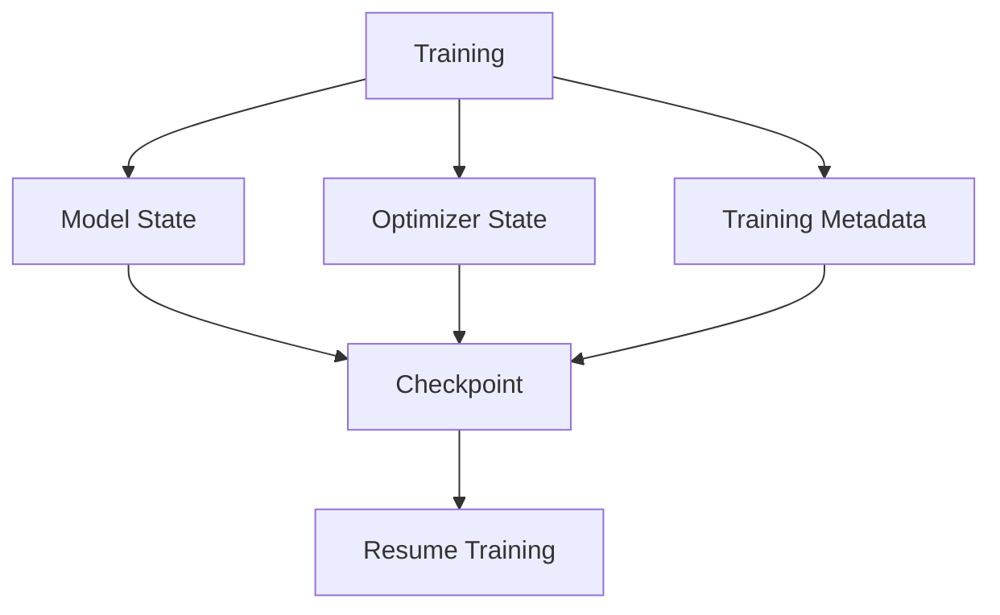

---

# 🧠 PyTorch Device + Model

A common production pattern:

```python
device = torch.device(
    "cuda"
    if torch.cuda.is_available()
    else "cpu"
)

model = model.to(
    device
)
```

For each batch:

```python
x_batch = x_batch.to(
    device
)

y_batch = y_batch.to(
    device
)
```

---

# 🧠 GPU Training Architecture


---

# ⚡ CUDA Device Selection

For multiple GPUs:

```python
device = torch.device(
    "cuda:0"
)
```

Check GPU count:

```python
torch.cuda.device_count()
```

Get device name:

```python
torch.cuda.get_device_name(
    0
)
```

---

# 🧠 CUDA Memory

Useful information:

```python
torch.cuda.memory_allocated()
```

and:

```python
torch.cuda.memory_reserved()
```

These help diagnose GPU memory consumption.

---

# 🧠 CPU ↔ GPU Data Movement

Moving data between devices has a cost.

```text
CPU Memory
    │
    │ Data Transfer
    ▼
GPU Memory
```

Therefore, efficient Deep Learning systems try to avoid unnecessary transfers.

---

# ⚠ Common Device Mistake

Avoid repeatedly moving tensors:

```python
for batch in data:

    x = x.to(
        device
    )

    # unnecessary repeated transfers
```

Instead, structure the pipeline so that device movement occurs at a predictable point.

---

# 🧠 Tensor Memory Sharing

When converting data from NumPy:

```python
x = torch.from_numpy(
    numpy_array
)
```

PyTorch may share the underlying memory with the NumPy array.

This differs from:

```python
torch.tensor(
    numpy_array
)
```

which generally creates a new tensor and copies the data.

This distinction can matter for performance and mutation behavior.

---

# 🧠 Detaching Tensors

If a tensor is part of an autograd graph:

```python
x.detach()
```

creates a tensor that does not require gradient tracking through that history.

Example:

```python
prediction = model(
    x
)

prediction_cpu = (
    prediction
    .detach()
    .cpu()
)
```

---

# 🧠 NumPy Conversion

For tensors that do not require gradients:

```python
array = tensor.numpy()
```

For tensors that require gradients:

```python
array = (
    tensor
    .detach()
    .cpu()
    .numpy()
)
```

---

# 🧠 `detach()` Mental Model


---

# 🧠 `torch.no_grad()` vs `detach()`

These are related but serve different purposes.

### `torch.no_grad()`

Disables gradient tracking for operations inside the context.

```python
with torch.no_grad():

    output = model(
        x
    )
```

### `detach()`

Creates a tensor disconnected from the current autograd graph.

```python
output = prediction.detach()
```

---

# 🧠 `inference_mode()`

For inference workloads, PyTorch also provides:

```python
with torch.inference_mode():

    output = model(
        x
    )
```

This can provide additional performance benefits compared with ordinary `no_grad()` in appropriate inference scenarios.

---

# 🧠 PyTorch Model Lifecycle

A typical workflow is:


---

# 🧠 PyTorch vs Keras Mental Mapping

| Concept | Keras / TensorFlow | PyTorch |
|---|---|---|
| Tensor | `tf.Tensor` | `torch.Tensor` |
| Layer | `tf.keras.layers.Layer` | `nn.Module` |
| Model | `tf.keras.Model` | `nn.Module` |
| Dense | `Dense` | `nn.Linear` |
| Conv2D | `Conv2D` | `nn.Conv2d` |
| ReLU | `ReLU` | `nn.ReLU` |
| Gradient | `GradientTape` | Autograd |
| Optimizer | `tf.keras.optimizers` | `torch.optim` |
| Dataset Pipeline | `tf.data` | `Dataset` / `DataLoader` |
| Training | `model.fit()` | Training loop |
| Evaluation Mode | `training=False` | `model.eval()` |
| No Gradients | Context / inference logic | `torch.no_grad()` / `inference_mode()` |
| Save Model | `.keras` / SavedModel workflows | `state_dict()` / checkpoints |

---

# 🧠 The Core PyTorch Training Equation

The fundamental parameter update is:

\[
\theta_{t+1}
=
\theta_t
-
\eta
\nabla_\theta L
\]


Where:

```text
θ  = Model Parameters
η  = Learning Rate
L  = Loss
∇θL = Gradient
```

The PyTorch training loop implements this concept through:

```text
loss.backward()
        ↓
Gradients
        ↓
optimizer.step()
        ↓
Updated Parameters
```

---

# 🏢 Enterprise Perspective

PyTorch should not be viewed only as a model-building library.

In production, it is one component of a larger Deep Learning platform:

```text
Data Sources
     ↓
Data Pipeline
     ↓
Dataset / DataLoader
     ↓
PyTorch Model
     ↓
Training Infrastructure
     ↓
GPU / Accelerator
     ↓
Checkpoint
     ↓
Model Validation
     ↓
Model Registry
     ↓
Serving
     ↓
Monitoring
```

Production concerns include:

- Dataset versioning
- Reproducibility
- Configuration management
- GPU utilization
- Checkpointing
- Model versioning
- Experiment tracking
- Model validation
- Deployment
- Monitoring
- Security
- Cost management

---

!!! tip "Production Insight"

    **PyTorch gives you significant control over the Deep Learning execution model.**

    That flexibility is powerful, but it also means the engineering team must explicitly manage:

    ```text
    Device Placement
    +
    Memory
    +
    Gradient Lifecycle
    +
    Checkpointing
    +
    Training State
    +
    Reproducibility
    ```

    A model that trains successfully on a developer laptop is not automatically production-ready.

---

# ⚠ Common Mistakes

Avoid these common PyTorch mistakes:

- Mixing CPU and GPU tensors
- Forgetting to move the model to the target device
- Forgetting to move input batches to the target device
- Forgetting `optimizer.zero_grad()`
- Calling `backward()` without understanding gradient accumulation
- Forgetting `model.train()` during training
- Forgetting `model.eval()` during evaluation
- Calculating inference with unnecessary gradient tracking
- Using an inappropriate output activation with a chosen loss function
- Applying Softmax before `CrossEntropyLoss` unnecessarily
- Ignoring tensor shape conventions
- Confusing `view()` and `reshape()`
- Misusing `squeeze()` and accidentally removing meaningful dimensions
- Using incorrect `permute()` ordering
- Performing unnecessary CPU/GPU transfers
- Converting GPU tensors directly to NumPy
- Failing to detach tensors before converting them for logging
- Saving only partial training state when resuming is required
- Ignoring GPU memory consumption
- Using unnecessarily large batch sizes
- Creating tensors on the wrong device inside the model

---

# 🧠 Interview Questions

## Beginner

### 1. What is PyTorch?

PyTorch is a Deep Learning framework providing tensor computation, automatic differentiation, neural network abstractions, optimization, and hardware acceleration.

### 2. What is a tensor?

A tensor is a multidimensional numerical data structure used as the fundamental data representation in PyTorch.

### 3. What is `nn.Module`?

`nn.Module` is the base class used to define neural network models and reusable neural network components in PyTorch.

### 4. What does `forward()` do?

It defines how input data flows through a PyTorch model.

### 5. What is `requires_grad=True`?

It tells PyTorch to track operations involving the tensor so gradients can be computed through autograd.

---

## Intermediate

### 6. What is autograd?

PyTorch's automatic differentiation system that records differentiable operations and computes gradients during backward propagation.

### 7. What is the standard PyTorch training loop?

```text
optimizer.zero_grad()
        ↓
forward
        ↓
loss
        ↓
loss.backward()
        ↓
optimizer.step()
```

### 8. Why call `optimizer.zero_grad()`?

Because PyTorch gradients accumulate by default. Existing gradients need to be cleared before computing the next update.

### 9. What is the difference between `model.train()` and `model.eval()`?

They switch the model between training and evaluation behavior, which affects layers such as Dropout and Batch Normalization.

### 10. Why use `torch.no_grad()` during inference?

It disables gradient tracking for the enclosed operations, reducing unnecessary computation and memory usage.

### 11. What is `state_dict()`?

It provides the model's parameters and persistent buffers in a dictionary-like structure that is commonly used for saving and loading model state.

### 12. Why use `DataLoader`?

`DataLoader` provides batching, iteration, shuffling, and other mechanisms for efficiently feeding data into a training loop. Its details are covered in the next chapter.

---

## Advanced

### 13. Why does PyTorch use `nn.Module` for both layers and models?

Because complex neural networks can be composed hierarchically from reusable modules. This allows PyTorch to recursively track parameters and submodules.

### 14. Why are model and tensors required to be on compatible devices?

Operations generally require tensors participating in the same computation to reside on compatible devices.

### 15. Why does `CrossEntropyLoss` typically receive raw logits?

PyTorch's `CrossEntropyLoss` combines the relevant log-softmax and negative-log-likelihood computation internally, so an explicit Softmax layer is normally unnecessary before it.

### 16. What is the difference between `detach()` and `torch.no_grad()`?

`detach()` disconnects a tensor from its existing autograd history. `torch.no_grad()` disables gradient tracking for operations executed inside its context.

### 17. Why can `view()` fail when `reshape()` works?

`view()` requires a compatible memory layout, while `reshape()` can create a copy when necessary.

### 18. Why is `permute()` important in Computer Vision?

Different frameworks and operations expect different dimension orders. PyTorch vision models commonly use:

```text
N × C × H × W
```

so tensors may need to be permuted into that format.

### 19. What consumes GPU memory during training?

Typically:

```text
Parameters
+
Gradients
+
Optimizer State
+
Activations
+
Input Batches
```

### 20. How would you design production PyTorch training?

Separate:

```text
Dataset
DataLoader
Model
Loss
Optimizer
Training Loop
Evaluation
Checkpointing
Configuration
Logging
```

and make device placement, reproducibility, checkpointing, and monitoring explicit.

---

# 🧪 Practical Exercises

## Exercise 1 — Tensor Fundamentals

Create:

```text
Scalar
Vector
Matrix
3D Tensor
4D Tensor
```

For each tensor print:

```text
Value
Shape
Rank
Data Type
Device
```

---

## Exercise 2 — Tensor Operations

Implement:

```text
Addition
Subtraction
Multiplication
Matrix Multiplication
Reshape
Transpose
Permute
Squeeze
Unsqueeze
Mean
Sum
```

Verify the resulting shapes.

---

## Exercise 3 — Autograd

Create:

```python
x = torch.tensor(
    3.0,
    requires_grad=True
)
```

Calculate:

\[
y=x^3+2x^2+x
\]

and use:

```python
y.backward()
```

to calculate the gradient.

---

## Exercise 4 — Build a Classification Model

Create:

```text
Input
 ↓
Linear
 ↓
ReLU
 ↓
Linear
 ↓
ReLU
 ↓
Linear
 ↓
Class Logits
```

Use:

```python
nn.CrossEntropyLoss()
```

for training.

---

## Exercise 5 — Build a Regression Model

Create:

```text
Input
 ↓
Linear
 ↓
ReLU
 ↓
Linear
 ↓
Regression Output
```

Use:

```python
nn.MSELoss()
```

and:

```python
AdamW
```

for optimization.

---

## Exercise 6 — CPU vs GPU

Detect:

```python
torch.cuda.is_available()
```

Train the same model using:

```text
CPU
GPU
```

Compare:

```text
Training Time
Throughput
Memory Usage
```

---

## Exercise 7 — Model Checkpointing

Save:

```text
Model State
Optimizer State
Epoch
Training Loss
```

Create a checkpoint and resume training from it.

---

## Exercise 8 — Tensor Layout

Create an image batch in:

```text
N × H × W × C
```

and convert it to:

```text
N × C × H × W
```

using:

```python
permute()
```

Verify the resulting shape.

---

# 📌 Key Takeaways

- PyTorch is a tensor-based Deep Learning framework.
- Tensors are the fundamental data structure in PyTorch.
- Tensor rank represents the number of dimensions.
- Tensor shape describes the size of each dimension.
- Tensor data types affect memory, precision, and performance.
- PyTorch supports CPU and accelerator-based tensor computation.
- Device management is critical when using GPUs.
- `torch.autograd` provides automatic differentiation.
- `requires_grad=True` enables gradient tracking for tensors.
- `backward()` computes gradients through the autograd graph.
- PyTorch gradients accumulate by default.
- `optimizer.zero_grad()` clears previous gradients.
- `optimizer.step()` updates model parameters.
- `nn.Module` is the fundamental abstraction for PyTorch neural networks.
- `forward()` defines the model's forward computation.
- `nn.Linear` represents a fully connected layer.
- `nn.Sequential` is useful for simple linear architectures.
- Complex architectures should generally use custom `nn.Module` implementations.
- `model.train()` enables training behavior.
- `model.eval()` enables evaluation behavior.
- `torch.no_grad()` and `torch.inference_mode()` help avoid unnecessary gradient tracking during inference.
- `state_dict()` is commonly used for model state serialization.
- Efficient GPU training requires careful management of device placement and memory.
- PyTorch gives developers significant control over the training process.
- That flexibility also creates greater responsibility for training infrastructure, reproducibility, checkpointing, and production reliability.

---

# 📚 Further Reading

Continue with:

- **[17. PyTorch Autograd, Dataset and DataLoader](17-pytorch-autograd-dataset-and-dataloader.md)**
- **[18. Building Classification and Regression Models](18-building-classification-and-regression-models.md)**
- **[19. Convolutional Neural Networks](19-convolutional-neural-networks.md)**
- **[20. CNN Architecture, Optimization and Training](20-cnn-architecture-optimization-and-training.md)**
- **[22. ResNet, Residual Connections and TorchVision](22-resnet-residual-connections-and-torchvision.md)**
- **[35. GPU-Accelerated Deep Learning](35-gpu-accelerated-deep-learning.md)**
- **[36. Deep Learning Training and Model Lifecycle](36-deep-learning-training-and-model-lifecycle.md)**

The next chapter goes deeper into **PyTorch Autograd, Dataset, and DataLoader**, connecting tensor computation with efficient real-world data pipelines and training workflows.

---

## ➡️ Next Chapter

**[17. PyTorch Autograd, Dataset and DataLoader](17-pytorch-autograd-dataset-and-dataloader.md)**

---

> **Enterprise AI Engineering Handbook**  
> *Building Production-Grade Enterprise AI Systems — One Chapter at a Time.*